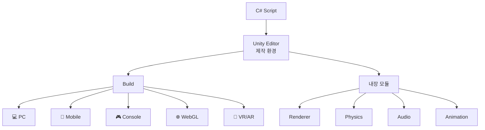

# **01. Unity Engine**
---

## **1. Unity Engine?**
**Unity Engine**은 게임·시뮬레이션·VR/AR 등 인터랙티브 콘텐츠를 만드는 **실시간 3D 개발 플랫폼**입니다. 단순히 "게임 엔진"이라기보다, **콘텐츠 제작에 필요한 거의 모든 기능**(렌더링·물리·오디오·애니메이션·네트워크)을 통합한 종합 도구예요.

> **비유**: Unity는 **종합 영화 스튜디오**와 같습니다.
>
> - **카메라**(Camera) — 장면을 어떻게 보여줄지
> - **조명·세트**(Lighting, Scene) — 시각적 분위기
> - **배우**(GameObject) — 화면 속 등장인물
> - **각본**(C# Script) — 누가 언제 무엇을 할지
> - **편집·후반작업**(Post-Processing) — 마지막 색감/효과
> - **다양한 상영관**(Build Targets) — PC·모바일·콘솔·웹 어디서든

**왜 사용하는가?** 게임 개발의 모든 단계(에셋 관리·씬 구성·코딩·테스트·빌드)를 **하나의 에디터** 안에서 처리할 수 있고, **한 번 만든 게임을 PC·iOS·Android·콘솔·웹**에 모두 배포할 수 있습니다.

---

## **2. 핵심 요약**
| 요소 | 한 줄 설명 |
| :--- | :--- |
| **통합 개발 환경** | 코드·에셋·씬·테스트가 한 에디터에서 |
| **크로스 플랫폼** | 한 번 작성, 20+ 플랫폼 배포 |
| **컴포넌트 기반** | GameObject + Component 조합으로 기능 부여 |
| **C# 스크립팅** | `MonoBehaviour` 상속으로 게임 로직 |
| **에셋 스토어** | 무료/유료 에셋·플러그인 거대 생태계 |
| **렌더링 파이프라인** | Built-in / URP / HDRP 선택 |
| **물리 엔진** | 2D(Box2D)·3D(PhysX) 내장 |

---

## **3. 세부 개념**
### **3.1 Unity의 두 얼굴 — Editor & Runtime**
| 구분 | 역할 | 사용자 |
| :--- | :--- | :--- |
| **Unity Editor** | 콘텐츠를 제작·설정하는 환경 | 개발자/디자이너 |
| **Unity Runtime** | 빌드된 게임이 실행되는 환경 | 최종 플레이어 |

### **3.2 컴포넌트 기반 구조**
Unity는 **컴포넌트 기반(Component-based)** 구조:

```
GameObject (빈 그릇)
  + Transform (위치·회전·크기) ← 모든 객체 기본
  + MeshRenderer (시각 표시)
  + Collider (충돌 판정)
  + Rigidbody (물리 적용)
  + 사용자 정의 Script (게임 로직)
```

**부품 조합**으로 객체에 기능을 더하는 방식.

### **3.3 활용 분야**
| 분야 | 예시 |
| :--- | :--- |
| 🎮 **게임** | 모바일·PC·콘솔 — Among Us, Hollow Knight, Pokémon GO |
| 🎬 **영화·애니메이션** | 가상 프로덕션, 사전 시각화 |
| 🏗 **건축 시각화** | 건축 디자인 인터랙티브 투어 |
| 🚗 **자동차** | BMW·아우디의 인터랙티브 카탈로그 |
| 🥽 **VR/AR** | Oculus, HoloLens 콘텐츠 |
| 🎓 **교육·훈련** | 의료 시뮬레이션, 군사 훈련 |

---

## **4. 코드로 보기**
### **4.1 가장 단순한 Unity 스크립트**
```csharp linenums="1"
using UnityEngine;

public class HelloUnity : MonoBehaviour
{
    void Start()
    {
        Debug.Log("Hello, Unity!");
    }

    void Update()
    {
        transform.Rotate(0, 90f * Time.deltaTime, 0);
    }
}
```

### **4.2 Unity의 3가지 핵심 클래스**
| 클래스 | 역할 |
| :--- | :--- |
| `MonoBehaviour` | 모든 게임 스크립트의 기반 |
| `GameObject` | 씬에 존재하는 모든 객체 |
| `Transform` | 위치·회전·크기를 다루는 컴포넌트 |

### **4.3 잘못된 접근과 흔한 오해**
=== "❌ 흔한 오해"

    - Unity는 게임 전용? — **No**, 영화·건축·자동차에도 사용
    - Unity는 C++만? — **No**, 게임 로직은 C# (엔진 자체는 C++)
    - Unity는 모바일 전용? — **No**, 콘솔·VR도 동일 코드

    !!! danger "왜 잘못된 오해인가"
        Unity의 강점은 **다양한 도메인 + 플랫폼** 모두를 한 코드로 다룰 수 있다는 점.

=== "✅ 올바른 이해"

    ```
    Unity = 인터랙티브 3D 콘텐츠 플랫폼
    Language = C# (게임 로직)
    Targets = 모바일·PC·콘솔·웹·VR/AR (20+ 플랫폼)
    ```

    !!! tip "포인트"
        Unity 학습의 진입점은 **C# + 컴포넌트 시스템**.
        이 둘만 익숙해지면 어떤 도메인이든 빠르게 적응할 수 있어요.

---

## **5. 다이어그램**


---

## **6. 활용 예시 (게임 도메인)**
### **시나리오**
> Unity로 만들어진 대표 게임들의 공통 구성 요소를 분석합니다.

### **분석**
| 게임 | 특징 | Unity 활용 |
| :--- | :--- | :--- |
| **Among Us** | 가벼운 멀티플레이 | 빠른 크로스 플랫폼 배포 |
| **Hollow Knight** | 2D 액션 | 정교한 2D + 물리 |
| **Pokémon GO** | 모바일 AR | AR Foundation + GPS |
| **Beat Saber** | VR 리듬 | XR Plugin |
| **Cuphead** | 손그림 애니메이션 | Sprite Animation |

### **한 줄 회고**
> **Unity의 진짜 강점은 "한 코드, 모든 플랫폼"** — 인디부터 AAA 스튜디오까지 활용하는 이유.

---

## **7. 실습 문제**
### **기초 문제 (기억 / 이해)**
1. **(기억하기)** Unity Editor와 Unity Runtime의 차이는?
2. **(이해하기)** "컴포넌트 기반 구조"는 무엇이고 왜 유리한가요?

??? success "정답 보기"

    1. - **Editor**: 개발자가 콘텐츠를 만들고 설정하는 환경
       - **Runtime**: 빌드된 게임이 사용자 디바이스에서 실행되는 환경

    2. - 하나의 GameObject에 여러 부품(Component)을 조합해 기능 부여
       - **재사용성 + 유연성 + 단일 책임** 모두 확보
       - 상속의 한계("총 든 좀비" 같은 다중 분류)를 자연스럽게 표현

### **응용 문제 (적용 / 분석 / 평가)**
3. **(적용하기)** Unity의 주요 기능 5가지와 각각의 게임 활용 예를 들어보세요.

4. **(분석하기)** Unity가 입문자에게 친숙한 이유는?

5. **(평가하기)** "Unity는 C#이라 성능이 떨어진다"는 주장의 타당성?

??? success "정답 및 해설"

    **3번 — Unity 주요 기능 5가지**:
    - **통합 에디터**: 빠른 반복
    - **컴포넌트 시스템**: 빠른 프로토타입
    - **PhysX 물리 엔진**: 사실적 충돌
    - **크로스 플랫폼 빌드**: 한 코드 모든 플랫폼
    - **에셋 스토어**: 즉시 활용 가능한 모델·플러그인

    **4번 — Unity 친숙성의 이유**:
    - **C#**: 진입 장벽 낮은 대중 언어
    - **컴포넌트 시스템**: 드래그&드롭으로 게임 가능
    - **방대한 한국어 자료** + 커뮤니티
    - **무료**: 매출 10만 달러 미만은 무료

    **5번 — Unity 성능 평가**:
    - **부분적 사실**: C# 자체는 C++보다 다소 느림
    - **하지만**: 엔진 core는 C++ 작성. IL2CPP 변환, DOTS/Burst Compiler로 거의 네이티브 수준 도달
    - **결론**: AAA 콘솔 최고 성능은 Unreal 유리, 99%의 게임엔 Unity 충분

---

## **8. 주의사항**
!!! warning "흔한 실수"
    - Unity = 게임만 만드는 도구로 오해
    - 모든 코드를 `Update()`에 몰아 성능 저하
    - 컴포넌트 너무 많이 부착해 GameObject 복잡화

!!! tip "안전 습관"
    - **목적 명확화**: 만들 콘텐츠 종류·플랫폼 미리 결정
    - **컴포넌트 분리**: 단일 책임 원칙
    - **에셋 스토어 활용**: 바퀴 재발명 금지

---

## **9. 더 알아보기**
!!! note "다음 단계 키워드"
    - **Unity Hub**: 버전·프로젝트 관리
    - **LTS 버전**: 장기 지원 안정 버전
    - **Render Pipeline**: Built-in / URP / HDRP
    - **Unity Asset Store**: 무료 모델·플러그인
    - **Unity Learn**: 공식 튜토리얼

!!! example "다음 챕터"
    [→ 02. Unity Editor](02_unity_editor.md)에서
    실제 에디터의 주요 창과 사용법을 배웁니다.
