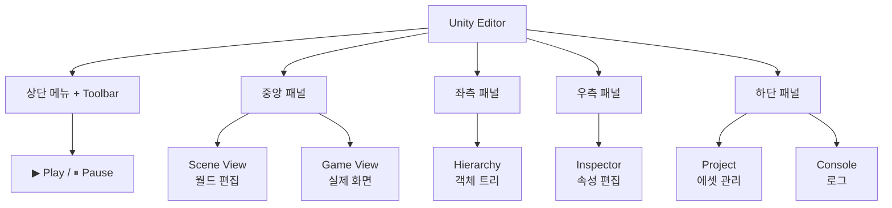

# **02. Unity Editor**
---

## **1. Unity Editor?**
**Unity Editor**는 Unity Engine으로 콘텐츠를 만들기 위한 **통합 개발 환경(IDE)** 입니다. 코드 작성, 에셋 관리, 씬 구성, 실시간 테스트, 빌드까지 **게임 제작의 모든 단계**가 이 한 화면에서 이뤄져요.

> **비유**: Unity Editor는 **만능 작업실**입니다.
>
> - **작업대(Scene View)** — 직접 만지고 조립하는 공간
> - **미리보기 거울(Game View)** — 손님 입장에서 어떻게 보이는지
> - **재료함(Project)** — 모델·이미지·사운드 등 에셋 보관
> - **부품 트리(Hierarchy)** — 지금 작업 중인 객체들의 가족 관계
> - **상세 설정(Inspector)** — 선택된 객체의 모든 속성 편집
> - **메모장(Console)** — 작업 중 발생한 메시지·오류 기록

**왜 알아야 하는가?** Unity는 코드를 짜는 게 전부가 아니라, **에디터에서 직접 만지는 비중이 매우 큰** 도구입니다. 에디터의 주요 창을 모르면 코드만으로는 절대 게임을 완성할 수 없어요.

---

## **2. 핵심 요약**
| 창 | 한 줄 설명 | 단축키 |
| :--- | :--- | :---: |
| **Scene View** | 3D/2D 게임 월드 시각 편집 | — |
| **Game View** | 실제 플레이 화면 미리보기 | — |
| **Hierarchy** | 씬 안 모든 GameObject 트리 | — |
| **Project** | 모든 에셋(모델·이미지·코드 등) | — |
| **Inspector** | 선택된 객체의 컴포넌트 상세 | — |
| **Console** | Debug 메시지·경고·오류 | — |
| **Play 모드** | ▶ 버튼으로 게임 실시간 테스트 | `Ctrl+P` |
| **Build Settings** | 빌드 대상 플랫폼 설정 | `Ctrl+Shift+B` |

---

## **3. 세부 개념**
### **3.1 6대 주요 창**
#### **🎬 Scene View**
3D/2D 월드를 **시각적으로 보고 편집**하는 작업 공간.
- 마우스로 객체 이동·회전·크기 조절
- WASD + 우클릭 드래그로 시점 이동
- 카메라 외부에서 모든 것을 봄 (개발자 시점)

#### **🎮 Game View**
실제 플레이어가 보는 **카메라 시점**의 화면.
- ▶ Play 모드 진입 시 게임 동작 미리보기
- 다양한 해상도·종횡비 시뮬레이션

#### **📋 Hierarchy**
현재 씬의 **모든 GameObject 목록**을 트리 구조로.
- 부모-자식 관계 설정 (드래그)
- 자식은 부모의 위치/회전/크기를 상속

#### **📁 Project**
프로젝트에 포함된 **모든 에셋** 관리.
- 모델, 텍스처, 오디오, 스크립트, 프리팹, 씬 파일
- 폴더 구조 정리가 프로젝트 규모 커질수록 중요

#### **🔧 Inspector**
선택된 객체의 **컴포넌트와 속성** 편집.
- 인스펙터에서 값 변경 시 즉시 반영
- 스크립트의 `public` 변수가 노출됨

#### **📢 Console**
**Debug 메시지·경고·오류** 출력.
- `Debug.Log("text")` 결과 표시
- 오류 발생 시 클릭하면 원인 코드로 이동

### **3.2 Play 모드 — 실시간 테스트**
▶ Play 버튼을 누르면:
- 씬이 실제 게임처럼 동작
- 코드 변경 사항 즉시 반영 (단, Play 중 변경한 인스펙터 값은 **저장되지 않음**)
- `Ctrl+P` 또는 ▶ 다시 클릭으로 중지

!!! danger "Play 모드의 함정"
    Play 중에 인스펙터 값을 바꾸면 **종료 후 원래대로 복원**됩니다.
    중요한 설정은 Play 중지 후 변경하세요.

### **3.3 레이아웃 커스터마이징**
상단 메뉴 `Window > Layouts`에서:
- **Default**, **Wide**, **2 by 3** 등 프리셋
- 본인의 워크플로에 맞게 창 배치 후 **Save Layout**

### **3.4 에셋 임포트 흐름**
```
외부 파일 (.fbx, .png, .wav 등)
    ↓ Project 창으로 드래그
임포트 (메타데이터 자동 생성)
    ↓
Scene으로 드래그 → GameObject로 사용
```

---

## **4. 코드로 보기**
### **4.1 인스펙터에 변수 노출**
```csharp linenums="1" hl_lines="4 5"
using UnityEngine;

public class Player : MonoBehaviour
{
    public int health = 100;           // 인스펙터에 노출
    public float moveSpeed = 5f;       // 인스펙터에 노출

    [SerializeField]                    // private이지만 노출
    private string playerName = "Hero";

    private int score;                  // 노출 안 됨
}
```

### **4.2 Debug 로그로 Console 활용**
```csharp linenums="1"
void Start()
{
    Debug.Log("게임 시작");
    Debug.LogWarning("주의: 체력 낮음");
    Debug.LogError("에러: 파일 없음");
}
```

### **4.3 잘못된 코드와 흔한 실수**
=== "❌ 잘못된 코드"

    ```csharp
    public class Player : MonoBehaviour
    {
        // 잘못 1 — 인스펙터에서 값 설정했는데 코드에서 덮어씀
        public int health = 100;
        void Start()
        {
            health = 50;   // 인스펙터 설정 의미 없어짐
        }

        // 잘못 2 — Play 중 인스펙터 값 변경하고 좋아함
        // (Play 종료 시 원래대로!)

        // 잘못 3 — 모든 변수를 public으로
        public int internalState;   // 외부 코드도 마음대로 변경 가능
    }
    ```

    !!! danger "왜 잘못됐을까?"
        - **`Start`에서 덮어쓰기**: 인스펙터의 값이 무용지물
        - **Play 모드 함정**: 변경한 값은 Play 종료 시 사라짐
        - **무분별한 public**: 캡슐화 깨짐, Inspector + 외부 코드 모두 접근 가능

=== "✅ 올바른 코드"

    ```csharp
    public class Player : MonoBehaviour
    {
        // 1) 인스펙터 기본값, 코드는 건드리지 않음
        public int health = 100;

        // 2) 중요한 변경은 Play 종료 후 인스펙터에서

        // 3) [SerializeField] + private 패턴
        [SerializeField] private int internalState;   // 인스펙터엔 노출, 외부 코드는 접근 불가
    }
    ```

    !!! tip "포인트"
        **`[SerializeField] private`** 가 Unity의 정석 패턴.
        외부 캡슐화 + 인스펙터 편의 동시에 확보.

---

## **5. 다이어그램**


---

## **6. 활용 예시 (게임 도메인)**
### **시나리오**
> 처음 Unity 프로젝트를 만들고 큐브 하나를 화면에 띄워 회전시키는 전체 과정.

### **단계**
1. **Hub에서 새 프로젝트 생성** (3D 또는 2D 템플릿)
2. **Hierarchy** 우클릭 → 3D Object → Cube 생성
3. **Scene View**에서 큐브가 보이는지 확인 (없으면 F 키로 포커스)
4. **Project** 우클릭 → Create → C# Script → `Rotator.cs`
5. 스크립트 작성:

```csharp linenums="1"
using UnityEngine;

public class Rotator : MonoBehaviour
{
    [SerializeField] private float speed = 90f;   // 도/초

    void Update()
    {
        transform.Rotate(0, speed * Time.deltaTime, 0);
    }
}
```

6. **Rotator.cs**를 큐브로 드래그 → 컴포넌트 부착
7. **Inspector**에서 Rotator 컴포넌트의 Speed 값 조정 가능
8. **▶ Play** 클릭 → 큐브가 자동으로 회전
9. **Console**에서 오류 없는지 확인

### **한 줄 회고**
> **에셋 만들기 → 객체로 배치 → 컴포넌트 부착 → Play**의 4단계가 Unity 모든 작업의 본질입니다.

---

## **7. 실습 문제**
### **기초 문제 (기억 / 이해)**
1. **(기억하기)** Scene View와 Game View의 차이는?
2. **(이해하기)** `public`과 `[SerializeField] private` 중 어느 것이 Unity 권장 패턴인가요?

??? success "정답 보기"

    1. - **Scene View**: 개발자가 자유롭게 보는 **편집용 시점** (3D 자유 회전)
       - **Game View**: 카메라가 비추는 **실제 게임 시점** (플레이어가 보는 화면)
       - Scene에서 자유롭게 배치하고, Game에서 결과 확인하는 흐름

    2. **`[SerializeField] private`**.
       - 외부 스크립트의 접근은 막으면서 (캡슐화)
       - 인스펙터에서는 편집 가능
       - Unity의 모범 사례

### **응용 문제 (적용 / 분석 / 평가)**
3. **(적용하기)** Hierarchy에 자식 객체 구조를 만들어보고, 부모를 회전시켰을 때 자식도 따라 도는지 설명하세요.

4. **(분석하기)** Play 모드 중 인스펙터 값을 변경하면 왜 종료 후 사라지나요?

5. **(평가하기)** Unity Editor가 코드 IDE(Visual Studio)와 분리된 이유는?

??? success "정답 및 해설"

    **3번**: 부모-자식 구조에서 자식은 부모의 **변환(Transform)을 상속**.
    - 빈 GameObject 'Parent' 생성 → 그 아래에 Cube 'Child' 자식으로 둠
    - Parent를 회전시키면 Child도 같이 회전 (Parent의 좌표계 안에서 자기 회전 유지)
    - 이는 캐릭터의 관절·차량의 바퀴·UI 그룹화 등에 필수

    **4번 — Play 모드 인스펙터 변경이 사라지는 이유**:
    - Unity는 Play 중에 변경된 모든 데이터를 **휘발성으로** 처리
    - 게임 테스트 도중 실수로 설정을 망가뜨리는 것을 방지
    - Play 종료 → 원래 인스펙터 상태로 복원
    - 영구 변경하려면 **Play 중지 후** 인스펙터 편집

    **5번 — Editor와 IDE 분리 이유**:
    - **역할 분담**: 코드 작성은 IDE의 전문 영역 (자동완성·디버깅·리팩토링)
    - **에디터는 시각 작업**: 씬·에셋·인스펙터 편집에 특화
    - **워크플로**: 디자이너는 IDE 없이도 에디터로 작업, 프로그래머는 IDE 활용
    - **빌드 시점**: Unity가 C# 코드를 컴파일해서 통합
    - **VS와의 연동**: Tools → Options에서 자동 연동 설정

---

## **8. 주의사항**
!!! warning "흔한 실수"
    - Play 모드에서 변경한 인스펙터 값을 영구화한 줄 알기
    - 모든 변수를 public으로 노출
    - Console의 오류·경고 무시
    - Scene 저장 안 하고 종료 → 작업 손실

!!! tip "안전 습관"
    - **자주 저장** `Ctrl+S` (Scene 별도 저장 필요)
    - **`[SerializeField] private`** 패턴
    - **Console 항상 깨끗하게**: 오류·경고 발견 즉시 해결
    - **레이아웃 저장**: 본인 워크플로에 맞게 한 번 설정 후 저장

---

## **9. 더 알아보기**
!!! note "다음 단계 키워드"
    - **Unity Hub**: Unity 버전 관리, 프로젝트 목록
    - **Package Manager**: 추가 모듈 설치 (Window → Package Manager)
    - **Custom Editor**: 인스펙터를 직접 커스터마이징
    - **Build Settings**: 플랫폼 빌드 설정
    - **Player Settings**: 게임 메타데이터·아이콘·시작 화면

!!! example "다음 챕터"
    [→ 03. Scene·Hierarchy·Inspector](03_scene_hierarchy_inspector.md)에서
    이 세 핵심 창의 상호작용을 깊이 다룹니다.
