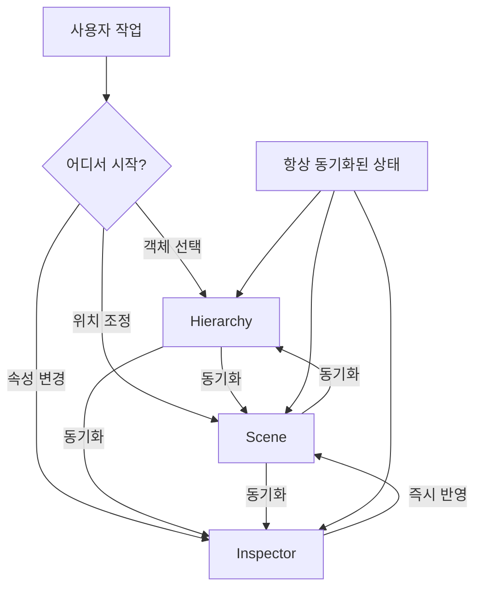

# **03. Scene · Hierarchy · Inspector**
---

## **1. 이 세 창은 왜 함께 다루는가?**
Unity Editor의 **Scene**, **Hierarchy**, **Inspector**는 게임 콘텐츠를 만드는 데 **가장 자주 오가는 3개 창**입니다. 셋이 유기적으로 연결되어 있어 따로 떼어 이해하면 흐름을 놓치기 쉬워요.

> **비유**: 셋의 관계는 **요리 작업장**과 같습니다.
>
> - **Hierarchy** = 재료 목록 (지금 도마 위에 뭐가 있는지)
> - **Scene** = 도마 + 작업대 (실제 자르고 조립하는 공간)
> - **Inspector** = 양념·간 조절 패널 (선택한 재료의 상세 설정)

세 창이 **서로 신호를 주고받으며** 사용됩니다:
- Hierarchy에서 객체 클릭 → Scene에서 선택 표시 + Inspector에 속성 표시
- Scene에서 객체 클릭 → Hierarchy 강조 + Inspector 갱신
- Inspector에서 값 변경 → Scene에 즉시 반영

**왜 알아야 하는가?** Unity 작업 시간의 90%가 이 세 창 사이를 오가는 것. 셋의 관계를 직관적으로 파악하면 작업 속도가 압도적으로 빨라집니다.

---

## **2. 핵심 요약**
| 창 | 주된 역할 | 핵심 기능 |
| :--- | :--- | :--- |
| **Scene** | 게임 월드 시각 편집 | 객체 배치·이동·회전·크기 조절 |
| **Hierarchy** | 씬 안 객체 트리 관리 | 부모-자식 관계, 객체 생성/삭제 |
| **Inspector** | 선택 객체 속성 편집 | 컴포넌트 추가·변경, 변수 값 수정 |
| **상호작용** | 셋이 항상 동기화 | 한 곳에서 선택하면 다른 둘에 반영 |

---

## **3. 세부 개념**
### **3.1 Scene View — 시각 편집의 본거지**
3D/2D 월드를 직접 보고 만지는 작업 공간.

**주요 도구** (좌상단 툴바):

| 도구 | 단축키 | 동작 |
| :--- | :---: | :--- |
| Hand | `Q` | 시점 이동 (드래그) |
| Move | `W` | 객체 위치 이동 |
| Rotate | `E` | 회전 |
| Scale | `R` | 크기 |
| Rect | `T` | 사각형 핸들 (UI에 유용) |
| Universal | `Y` | 위 셋 통합 |

**시점 조작**:
- 우클릭 + 드래그 = 시점 회전
- 휠 = 줌
- `F` = 선택 객체로 포커스
- WASD + 우클릭 = FPS 시점 이동

### **3.2 Hierarchy — 객체 트리**
씬에 존재하는 모든 GameObject를 **계층 구조**로 보여줌.

**부모-자식 관계의 의미**:
```
🚗 Car (Parent)               ← 회전시키면 모든 자식도 회전
├── 🛞 Wheel_FL (Child)
├── 🛞 Wheel_FR (Child)
└── 🚪 Door (Child)
    └── 🪟 Window (Grandchild) ← Door가 회전하면 같이 회전
```

자식의 `transform.localPosition`은 **부모 기준**.
부모를 이동/회전/스케일 변경하면 자식 전부 영향 받음.

### **3.3 Inspector — 세부 설정 패널**
선택된 객체의 **모든 컴포넌트와 속성**을 한 자리에 표시.

**기본 구성**:
```
GameObject 이름
┌─ Transform (모든 객체 기본)
│  Position, Rotation, Scale
├─ Mesh Renderer (시각)
│  Materials 등
├─ Collider (충돌)
│  Size, Center, IsTrigger
├─ Rigidbody (물리)
│  Mass, Drag, UseGravity
└─ My Script (사용자 정의)
   Public/SerializeField 변수들
```

**컴포넌트 추가**: 인스펙터 하단의 **Add Component** 버튼.
**컴포넌트 제거**: 컴포넌트 우상단 톱니바퀴 → Remove Component.

### **3.4 셋의 상호작용**
```
Hierarchy 선택 ←→ Scene 강조 표시
Hierarchy 선택 → Inspector 속성 표시
Scene 클릭 → Hierarchy 강조
Inspector 값 변경 → Scene 즉시 반영
```

이 4개 흐름이 작업의 기본 리듬.

---

## **4. 코드로 보기**
### **4.1 코드에서 Hierarchy 객체 찾기**
```csharp linenums="1"
using UnityEngine;

public class FindExample : MonoBehaviour
{
    void Start()
    {
        // 1) 이름으로 찾기 (느림, 권장 X)
        GameObject player = GameObject.Find("Player");

        // 2) 태그로 찾기 (빠름)
        GameObject enemy = GameObject.FindWithTag("Enemy");

        // 3) 타입으로 찾기 (빠름)
        Camera mainCam = FindObjectOfType<Camera>();

        // 4) 자식 객체 찾기 (직접 부모를 통해)
        Transform wheel = transform.Find("Wheel_FL");
    }
}
```

### **4.2 Inspector 노출 패턴**
```csharp linenums="1" hl_lines="4 7 10"
public class Player : MonoBehaviour
{
    // 1) public — 외부 접근 + 인스펙터 노출
    public int health = 100;

    // 2) [SerializeField] private — 인스펙터만 노출 (권장)
    [SerializeField] private float moveSpeed = 5f;

    // 3) [HideInInspector] public — 외부 접근만, 인스펙터엔 숨김
    [HideInInspector] public int internalScore;

    // 4) [Header] — 인스펙터 그룹 헤더
    [Header("전투 설정")]
    public int attackPower;
    public float attackRange;

    // 5) [Range] — 슬라이더로 노출
    [Range(0f, 100f)] public float volume = 50f;

    // 6) [Tooltip] — 마우스 오버 시 설명
    [Tooltip("플레이어 이름")]
    public string playerName = "Hero";
}
```

### **4.3 잘못된 코드와 흔한 실수**
=== "❌ 잘못된 코드 — 부모-자식 관계 미활용"

    ```csharp
    public class PlayerController : MonoBehaviour
    {
        public GameObject character;
        public GameObject weapon;   // 무기를 캐릭터의 자식으로 안 둠

        void Update()
        {
            // 매 프레임 무기 위치 수동 동기화 — 비효율!
            character.transform.Translate(Vector3.forward * Time.deltaTime);
            weapon.transform.position = character.transform.position + new Vector3(0.5f, 0, 0);
        }
    }
    ```

    !!! danger "왜 잘못됐을까?"
        - 매 프레임 weapon 위치를 코드로 동기화 → CPU 낭비
        - 코드 줄 늘어남, 잊으면 무기가 따로 노는 버그
        - 회전·스케일까지 동기화하면 복잡도 폭증

=== "✅ 올바른 코드 — Hierarchy 부모-자식 활용"

    ```csharp
    public class PlayerController : MonoBehaviour
    {
        // weapon을 Hierarchy에서 character의 자식으로 두면
        // 코드로 동기화할 필요 없음

        void Update()
        {
            // 캐릭터만 움직이면 자식 무기도 자동으로 따라감
            transform.Translate(Vector3.forward * Time.deltaTime);
        }
    }
    ```

    !!! tip "포인트"
        Unity의 가장 큰 디자인 철학: **"가능하면 코드 대신 Hierarchy로"**.
        부모-자식 관계로 표현 가능한 것은 코드로 동기화하지 마세요.

---

## **5. 다이어그램**


---

## **6. 활용 예시 (게임 도메인)**
### **시나리오**
> 캐릭터에 무기를 부착하고, 무기 색깔을 빨강으로 바꾸는 전체 과정.

### **단계**
1. **Hierarchy** 우클릭 → Create Empty → 이름을 `Player`로 변경
2. `Player` 우클릭 → 3D Object → Capsule 추가 (캐릭터 몸체)
3. **Hierarchy** 우클릭 → 3D Object → Cube 추가 (무기)
4. `Cube`를 `Player`로 드래그 → 자식으로 만듦
5. **Scene**에서 `Cube` 선택 → `W`(Move)로 캐릭터 손 위치로 이동
6. **Inspector**에서 `Cube`의 `Mesh Renderer` → Materials → Element 0 우클릭 → 새 Material 생성
7. 새 Material 선택 → Inspector에서 Albedo 색을 빨강으로
8. **Play** → `Player`를 코드로 이동시키면 무기도 자동으로 따라감

### **한 줄 회고**
> **3개 창은 셋이 아니라 하나의 통합 작업 흐름** — 각 창이 무엇을 표현하는지만 정확히 알면 작업이 직관적입니다.

---

## **7. 실습 문제**
### **기초 문제 (기억 / 이해)**
1. **(기억하기)** Scene·Hierarchy·Inspector 각 창의 한 줄 정의는?
2. **(이해하기)** Hierarchy에서 부모-자식 관계의 의미는?

??? success "정답 보기"

    1. - **Scene**: 게임 월드를 시각적으로 편집하는 작업 공간
       - **Hierarchy**: 씬에 있는 모든 GameObject 트리
       - **Inspector**: 선택된 객체의 컴포넌트·속성 편집

    2. - 자식은 부모의 **Transform(위치·회전·스케일)** 을 상속
       - 부모가 움직이면 자식도 함께 움직임 (상대 위치 유지)
       - 자식의 `localPosition`은 부모 기준 좌표

### **응용 문제 (적용 / 분석 / 평가)**
3. **(적용하기)** 캐릭터 모델에 카메라를 자식으로 두면 어떤 게임 장르에 유리한가요?

4. **(분석하기)** 인스펙터에서 스크립트의 public 변수를 변경하는 것의 장점은?

5. **(평가하기)** "모든 객체를 코드로 컨트롤하면 되니까 Hierarchy 부모-자식 관계는 필요 없다"는 주장을 평가하세요.

??? success "정답 및 해설"

    **3번 — 카메라를 캐릭터 자식으로**:
    - **1인칭 게임 (FPS, 호러)**: 카메라가 캐릭터 머리에 부착되어 자동으로 따라옴
    - **레이싱 게임**: 차량에 카메라 부착
    - **단점**: 자유로운 카메라 워크가 어려움 (시네마틱엔 별도 카메라 필요)
    - **3인칭 추적은 보통 자식 X**: 카메라가 부드럽게 따라가야 하므로 Lerp/SmoothDamp 사용

    **4번 — 인스펙터 public 변수의 장점**:
    - **코드 수정 없이 밸런스 조정**: 데미지·속도 같은 값을 인스펙터에서 즉시
    - **디자이너 친화적**: 프로그래머 도움 없이 값 튜닝
    - **여러 객체 다른 값**: 같은 스크립트라도 인스턴스마다 다른 값 (적1 vs 적2)
    - **Play 중 실험**: 게임 실행 중 값 변경해 효과 즉시 확인 (Play 종료 시 복원되지만 실험엔 유용)

    **5번 — Hierarchy vs 코드 컨트롤**:
    - **부분적으로 사실**: 코드로도 모든 것이 가능
    - **하지만 Hierarchy 활용이 압도적 우위**:
      - **성능**: 부모-자식은 엔진 레벨에서 효율적 처리. 코드로 매 프레임 동기화 시 CPU 낭비
      - **유지보수**: Hierarchy 변경은 즉시 시각화. 코드 변경은 디버깅 필요
      - **디자이너 친화**: 비-프로그래머도 Hierarchy를 직접 조정
    - **결론**: Hierarchy로 표현 가능한 관계는 **무조건 Hierarchy로**. 코드는 동적 변경에만.

---

## **8. 주의사항**
!!! warning "흔한 실수"
    - Hierarchy에서 부모-자식 잘못 설정 → 위치/회전 이상하게 적용
    - Inspector 값 변경했는데 Play 중이라 종료 후 사라짐
    - 매 프레임 `GameObject.Find` 호출 → 큰 성능 저하
    - Scene 저장 안 하고 종료

!!! tip "안전 습관"
    - **부모-자식 관계 적극 활용**: 코드 대신 Hierarchy로
    - **`[SerializeField] private`** 패턴
    - **객체 참조는 인스펙터에서 드래그**: `Find` 보다 빠르고 안전
    - **자주 `Ctrl+S`**: Scene 저장 습관

---

## **9. 더 알아보기**
!!! note "다음 단계 키워드"
    - **Prefab**: 자주 쓰는 GameObject 템플릿
    - **Multi-Selection**: Hierarchy에서 여러 객체 선택 후 일괄 편집
    - **Component Reordering**: 인스펙터에서 컴포넌트 순서 변경
    - **Layers & Tags**: 객체 분류 시스템

!!! example "다음 챕터"
    [→ 04. Input (Legacy)](04_input_legacy.md)에서
    키보드·마우스 입력 처리를 배웁니다.
