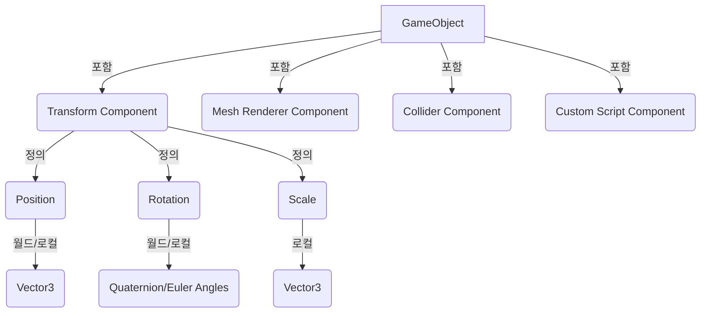

# **GameObject, Transform?**
Unity에서 GameObject (게임 오브젝트)와 Transform (트랜스폼)은 모든 콘텐츠의 가장 기본적인 구성 요소입니다. GameObject는 게임 세계에 존재하는 모든 개체를 나타내며, Transform은 그 GameObject의 위치, 회전, 크기를 정의합니다. 마치 연극 무대 위의 배우(GameObject)와 그 배우가 무대 위에서 서 있는 위치, 바라보는 방향, 그리고 크기(Transform)를 생각할 수 있습니다.

## **핵심 요약**
- **GameObject**: Unity 씬에 존재하는 모든 개체의 기본 단위입니다.
- **Transform**: GameObject의 위치(Position), 회전(Rotation), 크기(Scale) 정보를 담는 컴포넌트입니다.
- 모든 GameObject는 반드시 하나의 Transform 컴포넌트를 가집니다.
- GameObject는 여러 컴포넌트(Component)들의 컨테이너 역할을 합니다.

## **세부 개념**
### **1. GameObject (게임 오브젝트)**
- **정의**: Unity 씬(Scene)에 존재하는 모든 개체를 나타내는 기본 단위입니다. 플레이어 캐릭터, 적, 카메라, 조명, UI 요소 등 게임을 구성하는 모든 것이 GameObject입니다.
- **특징**: 
  - **컴포넌트 기반**: GameObject 자체는 아무런 기능도 하지 않으며, 다양한 컴포넌트(Component)들을 부착하여 기능을 부여합니다. (예: `Mesh Renderer`로 시각화, `Rigidbody`로 물리 적용, `Collider`로 충돌 감지, 스크립트로 동작 정의)
  - **이름**: 각 GameObject는 고유한 이름을 가질 수 있으며, Hierarchy 창에서 이를 확인할 수 있습니다.
  - **활성화/비활성화**: GameObject를 활성화/비활성화하여 씬에서 보이거나 보이지 않게, 또는 동작하게/동작하지 않게 할 수 있습니다.
- **예시**: 
  - **단순 출력 예제**: 빈 GameObject를 생성한 후, `Debug.Log()`를 사용하여 해당 GameObject의 이름을 출력하는 스크립트를 작성할 수 있습니다.
    ```csharp
    using UnityEngine;

    public class MyGameObjectScript : MonoBehaviour
    {
        void Start()
        {
            Debug.Log("현재 GameObject의 이름: " + gameObject.name);
        }
    }
    ```
  - **실용 예제 (아이템)**: 게임 내에서 획득 가능한 '코인' GameObject를 생성합니다. 이 코인 GameObject에는 `Mesh Renderer` 컴포넌트로 코인 모델을 표시하고, `Sphere Collider` 컴포넌트로 플레이어와의 충돌을 감지하며, `CoinScript`라는 사용자 정의 스크립트로 획득 시 점수를 증가시키고 사라지는 로직을 구현합니다.

### **2. Transform (트랜스폼)**
- **정의**: 모든 GameObject가 반드시 하나씩 가지는 컴포넌트입니다. GameObject의 위치(Position), 회전(Rotation), 크기(Scale) 정보를 담고 있으며, 씬 내에서 GameObject의 공간적인 정보를 정의합니다.
- **특징**: 
  - **계층 구조**: Transform은 부모-자식 관계를 가질 수 있으며, 자식 Transform은 부모 Transform의 영향을 받습니다. (예: 부모가 이동하면 자식도 함께 이동)
  - **로컬 및 월드 공간**: Position, Rotation, Scale은 로컬 공간(부모를 기준으로 한 상대적인 값)과 월드 공간(씬의 원점을 기준으로 한 절대적인 값)으로 표현될 수 있습니다.
- **예시**: 
  - **단순 출력 예제**: 스크립트에서 GameObject의 현재 위치를 콘솔에 출력하고, 매 프레임마다 앞으로 이동시키는 코드입니다.
    ```csharp
    using UnityEngine;

    public class MoveObject : MonoBehaviour
    {
        public float moveSpeed = 1.0f;

        void Update()
        {
            // 현재 위치 출력
            Debug.Log("현재 위치: " + transform.position);

            // 매 프레임마다 앞으로 이동
            transform.Translate(Vector3.forward * moveSpeed * Time.deltaTime);
        }
    }
    ```
  - **실용 예제 (카메라 추적)**: 플레이어 캐릭터를 따라다니는 카메라를 구현할 때, 카메라 GameObject의 Transform을 플레이어 GameObject의 Transform에 기반하여 업데이트합니다. `transform.position = playerTransform.position + offset;`과 같이 위치를 설정하거나, `transform.LookAt(playerTransform);`을 사용하여 항상 플레이어를 바라보게 할 수 있습니다.
  - **잘못된 코드 (월드 vs 로컬 이해 부족)**:
    ```csharp
    // 의도: 플레이어의 로컬 X축으로 이동
    // 실제: 월드 X축으로 이동 (transform.position을 직접 조작)
    public class PlayerMovement : MonoBehaviour
    {
        public float speed = 5.0f;

        void Update()
        {
            if (Input.GetKey(KeyCode.A))
            {
                // transform.position은 월드 좌표를 직접 변경합니다.
                // 플레이어가 회전한 상태라면, 로컬 X축 이동이 아닌 월드 X축 이동이 됩니다.
                transform.position += Vector3.left * speed * Time.deltaTime;
            }
        }
    }
    ```
  - **설명**: 위 코드에서 `transform.position += Vector3.left * speed * Time.deltaTime;`는 GameObject를 월드 좌표계의 왼쪽 방향으로 이동시킵니다. 만약 플레이어가 회전하여 로컬 왼쪽 방향이 월드 왼쪽 방향과 다르다면, 의도와 다른 움직임을 보이게 됩니다. 로컬 좌표계 기준으로 이동하려면 `transform.Translate(Vector3.left * speed * Time.deltaTime, Space.Self);` 또는 `transform.position += transform.right * -1 * speed * Time.deltaTime;`와 같이 `transform.Translate` 메서드를 사용하거나 `transform.right`와 같은 로컬 방향 벡터를 활용해야 합니다.

## **코드/다이어그램**


## **주요 속성과 메서드**
| 이름 | 타입 | 설명 | 예시 |
|---|---|---|---|
| `gameObject.name` | `string` | GameObject의 이름 | `Debug.Log(gameObject.name);` |
| `gameObject.activeSelf` | `bool` | GameObject의 활성화 상태 (자체) | `if (gameObject.activeSelf) { ... }` |
| `gameObject.SetActive(bool value)` | `void` | GameObject의 활성화 상태 설정 | `gameObject.SetActive(false);` |
| `transform.position` | `Vector3` | 월드 공간에서의 위치 | `transform.position = new Vector3(0, 1, 0);` |
| `transform.localPosition` | `Vector3` | 부모 기준 로컬 공간에서의 위치 | `transform.localPosition = Vector3.zero;` |
| `transform.rotation` | `Quaternion` | 월드 공간에서의 회전 | `transform.rotation = Quaternion.identity;` |
| `transform.localRotation` | `Quaternion` | 부모 기준 로컬 공간에서의 회전 | `transform.localRotation = Quaternion.Euler(0, 90, 0);` |
| `transform.localScale` | `Vector3` | 부모 기준 로컬 공간에서의 크기 | `transform.localScale = new Vector3(2, 2, 2);` |
| `transform.forward` | `Vector3` | GameObject의 앞 방향 (월드) | `transform.Translate(transform.forward * speed * Time.deltaTime);` |
| `transform.right` | `Vector3` | GameObject의 오른쪽 방향 (월드) | `transform.Translate(transform.right * speed * Time.deltaTime);` |
| `transform.up` | `Vector3` | GameObject의 위쪽 방향 (월드) | `transform.Translate(transform.up * speed * Time.deltaTime);` |
| `transform.parent` | `Transform` | 부모 Transform | `transform.parent = otherGameObject.transform;` |
| `transform.Translate(Vector3 translation, Space relativeTo = Space.Self)` | `void` | GameObject 이동 | `transform.Translate(Vector3.forward * Time.deltaTime);` |
| `transform.Rotate(Vector3 eulers, Space relativeTo = Space.Self)` | `void` | GameObject 회전 | `transform.Rotate(0, 90 * Time.deltaTime, 0);` |
| `transform.LookAt(Transform target)` | `void` | 특정 대상을 바라보도록 회전 | `transform.LookAt(playerTransform);` |

## **실습 문제**
1. 빈 GameObject를 생성하고, 그 아래에 큐브 GameObject를 자식으로 추가하시오. 부모 GameObject를 이동시켰을 때 자식 큐브가 어떻게 움직이는지 설명하시오.
2. 스크립트를 작성하여 특정 GameObject를 매 초마다 월드 좌표계의 X축 방향으로 1단위씩 이동시키고, 동시에 로컬 좌표계의 Y축 방향으로 0.5단위씩 회전시키시오.
3. 플레이어 GameObject와 적 GameObject가 있다고 가정하고, 적 GameObject가 항상 플레이어 GameObject를 바라보도록 스크립트를 작성하시오. (힌트: `transform.LookAt()` 사용)

??? success "정답 및 해설"

    **1번**: 부모를 이동시키면 **자식 큐브도 똑같이 따라 움직입니다.**
    자식의 위치는 부모 기준의 **로컬 좌표**로 저장되기 때문 — 인스펙터에 보이는 자식의
    Position 값은 변하지 않지만, 월드 상의 실제 위치는 부모를 따라 바뀝니다.

    **2번**:
    ```csharp
    void Update()
    {
        // Space.World : 월드 X축 기준 이동
        transform.Translate(Vector3.right * 1f * Time.deltaTime, Space.World);
        // Space.Self : 자신의 로컬 Y축 기준 회전
        transform.Rotate(Vector3.up * 0.5f * Time.deltaTime, Space.Self);
    }
    ```
    `Time.deltaTime`을 곱하면 "프레임당"이 아니라 **"초당"** 단위가 됩니다.

    **3번**:
    ```csharp
    public Transform player;

    void Update()
    {
        transform.LookAt(player);   // 적의 forward(+Z)가 플레이어를 향하도록 회전
    }
    ```
    `LookAt`은 내부적으로 방향 벡터 계산 + 쿼터니언 회전을 한 줄로 처리해 주는 내장 API입니다.


## **주의사항**
GameObject와 Transform은 Unity 개발의 근간을 이룹니다. 이 두 개념을 정확히 이해하고 능숙하게 다루는 것이 복잡한 게임 로직과 상호작용을 구현하는 데 필수적입니다.
