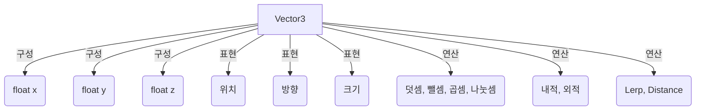

# **Vector3 (벡터 3)?**
Unity에서 Vector3 (벡터 3)는 3차원 공간에서의 위치, 방향, 또는 크기(magnitude)를 나타내는 데 사용되는 구조체(struct)입니다. 마치 지도에서 특정 지점의 좌표를 표시하거나, 어떤 방향으로 얼마나 이동해야 하는지를 화살표로 나타내는 것과 같습니다. Vector3는 Unity의 모든 3D 계산의 기본이 되며, GameObject의 위치, 이동 방향, 속도, 힘 등을 표현하는 데 필수적으로 사용됩니다.

## **핵심 요약**
- Vector3는 3차원 공간의 위치, 방향, 크기를 나타내는 구조체입니다.
- `x`, `y`, `z` 세 개의 부동 소수점 값으로 구성됩니다.
- GameObject의 Transform, 물리, 애니메이션 등 다양한 곳에 활용됩니다.

## **세부 개념**
### **1. Vector3의 정의 및 구성**
Vector3는 `x`, `y`, `z` 세 개의 `float` 타입 변수로 구성된 구조체입니다. 이 세 값은 3차원 공간에서의 좌표를 나타내거나, 특정 방향으로의 벡터를 나타내는 데 사용됩니다.

- **위치 (Position)**: 씬 내의 특정 지점의 좌표를 나타냅니다. (예: `transform.position`)
- **방향 (Direction)**: 한 지점에서 다른 지점으로 향하는 방향을 나타냅니다. (예: `transform.forward`)
- **크기 (Scale)**: GameObject의 크기를 나타냅니다. (예: `transform.localScale`)

### **2. Vector3의 주요 속성**
Vector3 구조체는 자주 사용되는 특정 벡터 값들을 미리 정의해두어 편리하게 사용할 수 있습니다.

- `Vector3.zero`: `(0, 0, 0)`을 나타냅니다. (원점, 움직이지 않는 상태)
- `Vector3.one`: `(1, 1, 1)`을 나타냅니다. (기본 크기)
- `Vector3.forward`: `(0, 0, 1)`을 나타냅니다. (Z축 양의 방향)
- `Vector3.back`: `(0, 0, -1)`을 나타냅니다. (Z축 음의 방향)
- `Vector3.up`: `(0, 1, 0)`을 나타냅니다. (Y축 양의 방향)
- `Vector3.down`: `(0, -1, 0)`을 나타냅니다. (Y축 음의 방향)
- `Vector3.right`: `(1, 0, 0)`을 나타냅니다. (X축 양의 방향)
- `Vector3.left`: `(-1, 0, 0)`을 나타냅니다. (X축 음의 방향)
- `vector.magnitude`: 벡터의 길이(크기)를 반환합니다. (원점으로부터의 거리)
- `vector.sqrMagnitude`: 벡터 길이의 제곱을 반환합니다. `magnitude`보다 계산 비용이 적어 거리 비교 시 유용합니다.
- `vector.normalized`: 길이가 1인 단위 벡터(Unit Vector)를 반환합니다. 방향만을 나타낼 때 사용됩니다.

### **3. Vector3의 주요 연산**
Vector3는 다양한 수학적 연산을 지원하여 3차원 공간에서의 계산을 용이하게 합니다.

- **덧셈 (+)**: 두 벡터를 더하여 새로운 벡터를 만듭니다. (예: 현재 위치 + 이동 방향 = 새로운 위치)
  ```csharp
  Vector3 pos1 = new Vector3(1, 2, 3);
  Vector3 pos2 = new Vector3(4, 5, 6);
  Vector3 result = pos1 + pos2; // (5, 7, 9)
  ```
- **뺄셈 (-)**: 한 벡터에서 다른 벡터를 빼서 두 지점 사이의 방향 벡터를 얻습니다. (예: 목표 위치 - 현재 위치 = 목표 방향)
  ```csharp
  Vector3 targetPos = new Vector3(10, 0, 0);
  Vector3 currentPos = new Vector3(5, 0, 0);
  Vector3 direction = targetPos - currentPos; // (5, 0, 0)
  ```
- **스칼라 곱셈 (*)**: 벡터의 크기를 스칼라(단일 숫자) 값만큼 늘리거나 줄입니다. (예: 방향 벡터 * 속도 = 이동량)
  ```csharp
  Vector3 direction = Vector3.right; // (1, 0, 0)
  float speed = 5.0f;
  Vector3 movement = direction * speed; // (5, 0, 0)
  ```
- **스칼라 나눗셈 (/)**: 벡터의 크기를 스칼라 값으로 나눕니다.
  ```csharp
  Vector3 vec = new Vector3(10, 20, 30);
  float divisor = 2.0f;
  Vector3 result = vec / divisor; // (5, 10, 15)
  ```
- **내적 (Dot Product)**: 두 벡터가 얼마나 같은 방향을 향하는지 나타내는 스칼라 값을 반환합니다. 두 벡터 사이의 각도를 구하거나, 특정 방향으로의 투영 값을 계산할 때 사용됩니다.
  ```csharp
  Vector3 a = Vector3.forward; // (0, 0, 1)
  Vector3 b = Vector3.right;   // (1, 0, 0)
  float dotProduct = Vector3.Dot(a, b); // 0 (두 벡터가 직각)
  ```
- **외적 (Cross Product)**: 두 벡터에 모두 수직인 새로운 벡터를 반환합니다. 3D 공간에서 법선 벡터를 구하거나, 회전 축을 찾을 때 사용됩니다.
  ```csharp
  Vector3 a = Vector3.up;    // (0, 1, 0)
  Vector3 b = Vector3.right; // (1, 0, 0)
  Vector3 crossProduct = Vector3.Cross(a, b); // (0, 0, -1) (Vector3.back)
  ```
- **선형 보간 (Lerp)**: 두 벡터 사이를 선형적으로 보간합니다. 부드러운 이동이나 값 변화에 사용됩니다.
  ```csharp
  Vector3 start = Vector3.zero;
  Vector3 end = Vector3.one * 10;
  float t = 0.5f; // 0.5는 중간 지점
  Vector3 interpolated = Vector3.Lerp(start, end, t); // (5, 5, 5)
  ```
- **거리 (Distance)**: 두 벡터(지점) 사이의 거리를 계산합니다.
  ```csharp
  Vector3 p1 = new Vector3(0, 0, 0);
  Vector3 p2 = new Vector3(3, 4, 0);
  float distance = Vector3.Distance(p1, p2); // 5 (피타고라스 정리)
  ```

- **예시 (Vector3 활용)**:
  - **단순 출력 예제**: 두 지점 사이의 방향 벡터를 구하고, 그 방향으로 GameObject를 이동시키는 코드입니다.
    ```csharp
    using UnityEngine;

    public class MoveTowardsTarget : MonoBehaviour
    {
        public Transform target;
        public float speed = 5.0f;

        void Update()
        {
            if (target != null)
            {
                // 목표 지점 - 현재 지점 = 방향 벡터
                Vector3 direction = target.position - transform.position;
                // 방향 벡터를 정규화하여 단위 벡터로 만듦 (크기는 1)
                direction = direction.normalized;

                // 단위 벡터 * 속도 * 시간 = 이동량
                transform.position += direction * speed * Time.deltaTime;
            }
        }
    }
    ```
    - **설명**: `target.position - transform.position`을 통해 현재 GameObject에서 목표 GameObject로 향하는 방향 벡터를 얻습니다. 이 벡터를 `normalized`하여 크기가 1인 단위 벡터로 만든 후, `speed`와 `Time.deltaTime`을 곱하여 매 프레임마다 일정한 속도로 이동시킵니다.

  - **실용 예제 (총알 발사)**: 플레이어의 위치에서 마우스 클릭 지점(또는 특정 방향)으로 총알을 발사하는 경우, 총알의 초기 속도 벡터를 계산하는 데 Vector3가 사용됩니다.
    ```csharp
    // BulletSpawner.cs
    using UnityEngine;

    public class BulletSpawner : MonoBehaviour
    {
        public GameObject bulletPrefab;
        public float bulletSpeed = 10f;

        void Update()
        {
            if (Input.GetMouseButtonDown(0))
            {
                GameObject bullet = Instantiate(bulletPrefab, transform.position, Quaternion.identity);
                Rigidbody bulletRb = bullet.GetComponent<Rigidbody>();

                // 마우스 위치를 월드 좌표로 변환
                Vector3 mousePos = Input.mousePosition;
                mousePos.z = Camera.main.WorldToScreenPoint(transform.position).z; // 총알과 같은 Z축 유지
                Vector3 targetWorldPos = Camera.main.ScreenToWorldPoint(mousePos);

                // 발사 방향 계산
                Vector3 shootDirection = (targetWorldPos - transform.position).normalized;

                // 총알에 힘 가하기
                bulletRb.velocity = shootDirection * bulletSpeed;
            }
        }
    }
    ```
    - **설명**: 마우스 클릭 지점과 총알 발사 위치를 이용하여 `shootDirection` 벡터를 계산하고, 이 방향으로 `bulletSpeed`만큼의 속도를 `bulletRb.velocity`에 직접 할당하여 총알을 발사합니다.

  - **잘못된 코드 (정규화의 중요성)**:
    ```csharp
    // 의도: 목표를 향해 일정한 속도로 이동
    // 실제: 목표와의 거리에 따라 속도가 달라짐
    public class BadMoveTowardsTarget : MonoBehaviour
    {
        public Transform target;
        public float speed = 5.0f;

        void Update()
        {
            if (target != null)
            {
                Vector3 direction = target.position - transform.position; // 정규화하지 않음
                transform.position += direction * speed * Time.deltaTime;
            }
        }
    }
    ```
    - **설명**: `direction` 벡터를 `normalized`하지 않으면, `direction`의 크기가 목표와의 거리에 비례하게 됩니다. 따라서 목표가 멀리 있을수록 `direction`의 크기가 커져 GameObject가 더 빠르게 이동하고, 목표에 가까워질수록 느려지게 됩니다. 일정한 속도로 이동하려면 반드시 `direction.normalized`를 사용해야 합니다.

## **코드/다이어그램**


## **주요 속성과 메서드**
| 이름 | 타입 | 설명 | 예시 |
|---|---|---|---|
| `x`, `y`, `z` | `float` | 벡터의 각 축 값 | `myVector.x = 10f;` |
| `magnitude` | `float` | 벡터의 길이(크기) | `float len = myVector.magnitude;` |
| `sqrMagnitude` | `float` | 벡터 길이의 제곱 | `float sqrLen = myVector.sqrMagnitude;` |
| `normalized` | `Vector3` | 길이가 1인 단위 벡터 | `Vector3 dir = myVector.normalized;` |
| `zero` | `static Vector3` | `(0, 0, 0)` | `transform.position = Vector3.zero;` |
| `one` | `static Vector3` | `(1, 1, 1)` | `transform.localScale = Vector3.one;` |
| `forward` | `static Vector3` | `(0, 0, 1)` | `transform.position += Vector3.forward * speed;` |
| `up` | `static Vector3` | `(0, 1, 0)` | `transform.position += Vector3.up * speed;` |
| `right` | `static Vector3` | `(1, 0, 0)` | `transform.position += Vector3.right * speed;` |
| `Dot(Vector3 a, Vector3 b)` | `static float` | 두 벡터의 내적 | `float dot = Vector3.Dot(vec1, vec2);` |
| `Cross(Vector3 a, Vector3 b)` | `static Vector3` | 두 벡터의 외적 | `Vector3 cross = Vector3.Cross(vec1, vec2);` |
| `Lerp(Vector3 a, Vector3 b, float t)` | `static Vector3` | 선형 보간 | `Vector3 newPos = Vector3.Lerp(startPos, endPos, time);` |
| `Distance(Vector3 a, Vector3 b)` | `static float` | 두 지점 사이의 거리 | `float dist = Vector3.Distance(pos1, pos2);` |

## **실습 문제**
1. 두 개의 빈 GameObject를 씬에 배치하고, 각각의 `transform.position`을 `(1, 0, 0)`과 `(4, 0, 0)`으로 설정하시오. 스크립트를 작성하여 두 GameObject 사이의 거리와 방향 벡터를 콘솔에 출력하시오.
2. 스크립트를 작성하여 GameObject가 `Vector3.forward` 방향으로 초당 2단위의 속도로 이동하게 하시오. 5초 후에는 `Vector3.right` 방향으로 이동하도록 변경하시오.
3. 플레이어 GameObject와 적 GameObject가 있다고 가정하시오. 스크립트를 작성하여 적 GameObject가 플레이어 GameObject를 향하는 방향 벡터의 내적 값을 계산하고, 이 값을 통해 적이 플레이어를 바라보고 있는지(내적 값이 1에 가까운지) 여부를 판단하여 콘솔에 출력하시오.

??? success "정답 및 해설"

    **1번**:
    ```csharp
    public Transform objA, objB;   // (1,0,0), (4,0,0)

    void Start()
    {
        float dist = Vector3.Distance(objA.position, objB.position);     // 3
        Vector3 dir = (objB.position - objA.position).normalized;        // (1,0,0)
        Debug.Log($"거리: {dist}, 방향: {dir}");
    }
    ```
    공식 : 방향 = (목표 위치 - 시작 위치).normalized

    **2번**:
    ```csharp
    private float elapsed = 0f;

    void Update()
    {
        elapsed += Time.deltaTime;
        Vector3 dir = (elapsed < 5f) ? Vector3.forward : Vector3.right;
        transform.Translate(dir * 2f * Time.deltaTime, Space.World);
    }
    ```

    **3번**:
    ```csharp
    public Transform player;

    void Update()
    {
        Vector3 toPlayer = (player.position - transform.position).normalized;
        float dot = Vector3.Dot(transform.forward, toPlayer);

        // 공식 : 내적 = 1(정면), 0(수직), -1(정반대)
        if (dot > 0.9f) Debug.Log($"플레이어를 바라보는 중 (내적: {dot:F2})");
        else            Debug.Log($"다른 곳을 보는 중 (내적: {dot:F2})");
    }
    ```
    내적은 시야각 판정의 핵심 — 적 AI의 "플레이어 발견" 로직이 바로 이 계산입니다.


## **주의사항**
Vector3는 Unity에서 3차원 공간을 다루는 데 있어 가장 기본적이고 중요한 요소입니다. 다양한 연산과 속성을 숙지하고 실제 게임 로직에 적용하는 연습을 꾸준히 하는 것이 중요합니다.

!!! note "🔗 함께 보기"
    - **C# 메모리와 구조**: [02. 구조체 (Struct)](../../C%23 Programming/Part 2 - 메모리와 구조/02_c%23_struct.md) — `Vector3`는 값 타입 struct라 `transform.position.x = 5f;`처럼 직접 수정이 막히는 이유가 여기에 있습니다.
