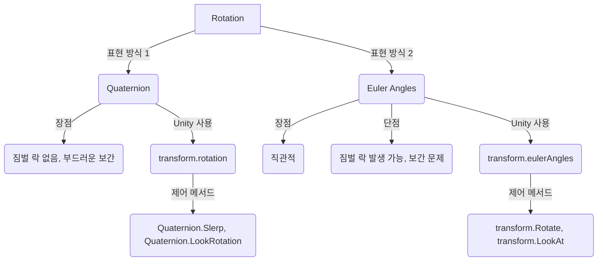

# **Rotation (회전)?**
Unity에서 Rotation (회전)은 GameObject가 3차원 공간에서 어떤 방향을 바라보고 있는지를 나타내는 개념입니다. 마치 나침반이 북쪽을 가리키듯이, GameObject는 특정 축을 중심으로 회전하여 다양한 방향을 가리킬 수 있습니다. Unity는 회전을 표현하기 위해 주로 Quaternion (쿼터니언)이라는 수학적 개념을 사용하며, 이는 오일러 각(Euler Angles)의 단점을 보완하여 부드럽고 정확한 회전 처리를 가능하게 합니다.

## **핵심 요약**
- Rotation은 GameObject의 방향을 나타내며, 주로 Quaternion으로 처리됩니다.
- Euler Angles는 직관적이지만 짐벌 락(Gimbal Lock) 문제가 발생할 수 있습니다.
- `transform.rotation`과 `transform.eulerAngles`를 통해 회전을 제어합니다.

## **세부 개념**
### **1. 회전의 표현: Quaternion vs Euler Angles**
#### **1.1. Euler Angles (오일러 각)**
- **정의**: X, Y, Z 세 축을 기준으로 각각 몇 도 회전했는지를 나타내는 방식입니다. 우리가 일상생활에서 각도를 생각하는 방식과 유사하여 직관적입니다.
- **장점**: 사람이 이해하고 설정하기 쉽습니다. Inspector 창에서 `transform.rotation`을 오일러 각으로 표시해줍니다.
- **단점**: 
  - **짐벌 락 (Gimbal Lock)**: 두 축의 회전이 겹쳐서 하나의 자유도를 잃어버리는 현상입니다. 이로 인해 특정 방향으로의 회전이 불가능해지거나 예측 불가능한 움직임을 보일 수 있습니다.
  - **보간 문제**: 두 오일러 각 사이를 선형 보간할 때 부드럽지 않은 회전이 발생할 수 있습니다.
- **Unity에서의 사용**: `transform.eulerAngles` 속성을 통해 오일러 각으로 회전 값을 설정하거나 읽을 수 있습니다. 하지만 Unity 내부에서는 이를 Quaternion으로 변환하여 처리합니다.

#### **1.2. Quaternion (쿼터니언)**
- **정의**: 4개의 숫자(x, y, z, w)로 구성된 복소수 확장 개념으로, 회전을 표현하는 데 사용됩니다. 축-각(Axis-Angle) 회전을 기반으로 합니다.
- **장점**: 
  - **짐벌 락 없음**: 짐벌 락 현상이 발생하지 않아 모든 방향으로의 회전을 부드럽고 정확하게 처리할 수 있습니다.
  - **부드러운 보간**: 두 Quaternion 사이를 보간(Slerp)할 때 가장 짧은 경로로 부드러운 회전을 제공합니다.
- **단점**: 사람이 직관적으로 이해하고 설정하기 어렵습니다.
- **Unity에서의 사용**: `transform.rotation` 속성은 Quaternion 타입입니다. Unity는 내부적으로 Quaternion을 사용하여 회전을 처리하며, 개발자는 주로 이 속성을 통해 회전을 제어합니다.

### **2. GameObject의 회전 제어**
#### **2.1. `transform.rotation` (Quaternion)**
- GameObject의 현재 회전 값을 Quaternion 형태로 가져오거나 설정합니다.
- **예시**: 
  - **단순 출력 예제**: GameObject의 현재 회전 값을 콘솔에 출력합니다.
    ```csharp
    using UnityEngine;

    public class RotationLogger : MonoBehaviour
    {
        void Start()
        {
            Debug.Log("현재 회전 (Quaternion): " + transform.rotation);
        }
    }
    ```
  - **실용 예제 (특정 방향 바라보기)**: `Quaternion.LookRotation()`을 사용하여 특정 방향을 바라보도록 회전을 설정합니다.
    ```csharp
    // LookAtTarget.cs
    using UnityEngine;

    public class LookAtTarget : MonoBehaviour
    {
        public Transform target;

        void Update()
        {
            if (target != null)
            {
                // 목표를 향하는 방향 벡터
                Vector3 direction = target.position - transform.position;
                // 방향 벡터를 기반으로 회전 Quaternion 생성
                Quaternion targetRotation = Quaternion.LookRotation(direction);
                // 현재 회전을 목표 회전으로 부드럽게 보간
                transform.rotation = Quaternion.Slerp(transform.rotation, targetRotation, Time.deltaTime * 5f);
            }
        }
    }
    ```
    - **설명**: `Quaternion.LookRotation(direction)`은 `direction` 벡터를 앞 방향(forward)으로 하는 회전 Quaternion을 생성합니다. `Quaternion.Slerp`는 두 Quaternion 사이를 구면 선형 보간하여 부드러운 회전을 만듭니다.

#### **2.2. `transform.eulerAngles` (Vector3)**
- GameObject의 현재 회전 값을 오일러 각(X, Y, Z) 형태로 가져오거나 설정합니다.
- **주의**: `transform.eulerAngles`를 직접 설정할 때 짐벌 락이나 예측 불가능한 회전이 발생할 수 있으므로, 증분 회전(incremental rotation)에는 `transform.Rotate()`를 사용하는 것이 더 안전합니다.
- **예시**: 
  - **단순 출력 예제**: GameObject의 현재 오일러 각을 콘솔에 출력합니다.
    ```csharp
    using UnityEngine;

    public class EulerAngleLogger : MonoBehaviour
    {
        void Start()
        {
            Debug.Log("현재 회전 (Euler Angles): " + transform.eulerAngles);
        }
        void Update()
        {
            // Y축을 기준으로 매 프레임 1도씩 회전
            // transform.eulerAngles = new Vector3(0, transform.eulerAngles.y + 1, 0); // 이 방식은 짐벌 락 위험이 있음
        }
    }
    ```
  - **실용 예제 (특정 축 회전)**: 특정 축을 기준으로 GameObject를 회전시킵니다.
    ```csharp
    // RotateObject.cs
    using UnityEngine;

    public class RotateObject : MonoBehaviour
    {
        public float rotationSpeed = 50f;

        void Update()
        {
            // Y축을 기준으로 초당 rotationSpeed만큼 회전
            transform.Rotate(Vector3.up * rotationSpeed * Time.deltaTime);
        }
    }
    ```
    - **설명**: `transform.Rotate(Vector3.up * rotationSpeed * Time.deltaTime)`는 GameObject를 월드 좌표계의 Y축을 기준으로 초당 `rotationSpeed`만큼 회전시킵니다. `transform.Rotate()` 메서드는 현재 회전에 증분적으로 회전을 더해주므로 짐벌 락 문제를 피할 수 있습니다.

#### **2.3. `transform.LookAt()`**
- GameObject가 특정 `Transform`을 바라보도록 회전을 즉시 설정합니다.
- **예시**: 
  - **단순 출력 예제**: GameObject가 다른 GameObject를 바라보도록 설정합니다.
    ```csharp
    using UnityEngine;

    public class SimpleLookAt : MonoBehaviour
    {
        public Transform target;

        void Update()
        {
            if (target != null)
            {
                transform.LookAt(target); // 매 프레임마다 목표를 바라보도록 회전
            }
        }
    }
    ```
  - **실용 예제 (포탑 회전)**: 적을 추적하는 포탑을 만들 때, 포탑의 회전을 적 GameObject의 `Transform`을 향하도록 설정합니다.

### **3. 잘못된 회전 처리 예시**
- **오일러 각 직접 조작의 위험성**: `transform.eulerAngles = new Vector3(x, y, z);`와 같이 오일러 각의 한 축만 변경하려고 할 때, Unity는 내부적으로 전체 Quaternion을 다시 계산하므로 다른 축의 값이 의도치 않게 변경될 수 있습니다. 증분 회전에는 `transform.Rotate()`를 사용하는 것이 안전합니다.
  ```csharp
  // 잘못된 예시: Y축만 회전시키려 했으나, 다른 축에도 영향 줄 수 있음
  // transform.eulerAngles = new Vector3(transform.eulerAngles.x, transform.eulerAngles.y + 1, transform.eulerAngles.z);
  ```

## **코드/다이어그램**


## **주요 속성과 메서드**
| 이름 | 타입 | 설명 | 예시 |
|---|---|---|---|
| `transform.rotation` | `Quaternion` | GameObject의 월드 회전 (Quaternion) | `transform.rotation = Quaternion.identity;` |
| `transform.localRotation` | `Quaternion` | GameObject의 로컬 회전 (Quaternion) | `transform.localRotation = Quaternion.Euler(0, 90, 0);` |
| `transform.eulerAngles` | `Vector3` | GameObject의 월드 회전 (오일러 각) | `Vector3 currentEuler = transform.eulerAngles;` |
| `transform.localEulerAngles` | `Vector3` | GameObject의 로컬 회전 (오일러 각) | `transform.localEulerAngles = new Vector3(0, 45, 0);` |
| `transform.Rotate(Vector3 axis, float angle)` | `void` | 특정 축을 중심으로 회전 | `transform.Rotate(Vector3.up, 30f * Time.deltaTime);` |
| `transform.Rotate(float xAngle, float yAngle, float zAngle)` | `void` | 각 축을 중심으로 회전 | `transform.Rotate(0, 10f * Time.deltaTime, 0);` |
| `transform.LookAt(Transform target)` | `void` | 특정 Transform을 바라보도록 회전 | `transform.LookAt(playerTransform);` |
| `Quaternion.identity` | `static Quaternion` | 회전이 없는 상태 (0,0,0) | `transform.rotation = Quaternion.identity;` |
| `Quaternion.Euler(float x, float y, float z)` | `static Quaternion` | 오일러 각으로 Quaternion 생성 | `Quaternion rot = Quaternion.Euler(0, 90, 0);` |
| `Quaternion.LookRotation(Vector3 forward)` | `static Quaternion` | 앞 방향 벡터로 Quaternion 생성 | `Quaternion rot = Quaternion.LookRotation(targetDirection);` |
| `Quaternion.Slerp(Quaternion a, Quaternion b, float t)` | `static Quaternion` | 두 Quaternion 사이 구면 선형 보간 | `transform.rotation = Quaternion.Slerp(startRot, endRot, time);` |

## **실습 문제**
1. 빈 GameObject를 생성하고, 스크립트를 작성하여 Y축을 기준으로 초당 60도씩 계속 회전하게 하시오. `transform.Rotate()` 메서드를 사용하시오.
2. 두 개의 GameObject를 씬에 배치하시오. 하나는 'Player', 다른 하나는 'Enemy'라고 가정합니다. 스크립트를 작성하여 'Enemy' GameObject가 항상 'Player' GameObject를 바라보도록 회전하게 하시오. `transform.LookAt()` 메서드를 사용하시오.
3. 스크립트를 작성하여 GameObject가 X축을 기준으로 45도, Y축을 기준으로 90도 회전한 상태로 시작하게 하시오. 이 회전 값을 `transform.eulerAngles`를 사용하여 설정하고, 콘솔에 현재 회전 값을 출력하시오.

??? success "정답 및 해설"

    **1번**:
    ```csharp
    void Update()
    {
        transform.Rotate(Vector3.up * 60f * Time.deltaTime);   // 초당 60도
    }
    ```

    **2번**:
    ```csharp
    public Transform player;

    void Update()
    {
        transform.LookAt(player);
    }
    ```
    2D 게임이라면 `LookAt`이 Z축을 향해 돌아가므로 `Mathf.Atan2`로 각도를 구해
    `Quaternion.Euler(0, 0, angle)`을 쓰는 방식이 일반적입니다.

    **3번**:
    ```csharp
    void Start()
    {
        transform.eulerAngles = new Vector3(45f, 90f, 0f);
        Debug.Log($"현재 회전: {transform.eulerAngles}");
    }
    ```
    주의: `eulerAngles`를 **읽을 때**의 값은 내부 쿼터니언에서 역계산된 결과라
    설정한 값과 다르게 표시될 수 있습니다 (예: -10도 → 350도). 같은 회전의 다른 표현일 뿐입니다.


## **주의사항**
회전은 3D 게임에서 매우 중요한 개념이지만, Quaternion의 복잡성 때문에 처음에는 어렵게 느껴질 수 있습니다. `transform.Rotate()`와 `transform.LookAt()` 같은 Unity의 편리한 메서드를 주로 사용하고, 필요할 때 `Quaternion.Slerp` 등을 활용하여 부드러운 회전을 구현하는 연습을 하는 것이 좋습니다.
