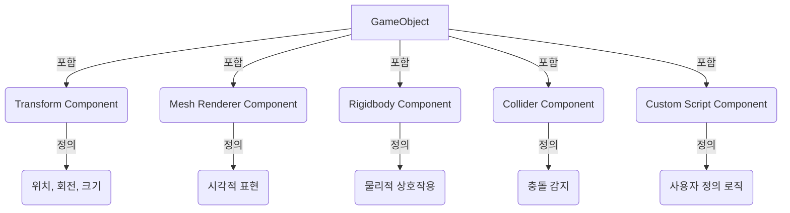

# **Component (컴포넌트)?**
Unity에서 Component (컴포넌트)는 GameObject (게임 오브젝트)에 특정 기능이나 속성을 부여하는 블록입니다. 마치 레고 블록처럼, 각 컴포넌트는 독립적인 기능을 수행하며, 이들을 GameObject에 조립하여 원하는 복합적인 기능을 가진 개체를 만들 수 있습니다. GameObject는 컴포넌트들의 컨테이너 역할을 하며, 컴포넌트 없이는 아무런 기능도 할 수 없습니다.

## **핵심 요약**
- Component는 GameObject에 기능과 속성을 부여하는 단위입니다.
- 모든 GameObject는 최소한 하나의 Transform 컴포넌트를 가집니다.
- 컴포넌트 기반 아키텍처는 유연하고 재사용 가능한 개발을 가능하게 합니다.

## **세부 개념**
### **1. Component의 정의 및 역할**
Component는 Unity의 핵심 개념 중 하나인 '컴포넌트 기반 아키텍처(Component-based Architecture)'의 근간을 이룹니다. 각 컴포넌트는 특정 목적을 가지고 설계되며, GameObject에 부착되어 해당 기능을 수행합니다.

- **역할**: 
  - **기능 부여**: GameObject에 시각적인 표현(Mesh Renderer), 물리적 상호작용(Rigidbody, Collider), 스크립트 로직(Script) 등 다양한 기능을 추가합니다.
  - **속성 정의**: GameObject의 특성(예: 빛의 색상, 카메라의 시야각)을 정의하고 조절할 수 있게 합니다.
  - **재사용성**: 한 번 만든 컴포넌트는 여러 GameObject에 재사용될 수 있어 개발 효율성을 높입니다.

### **2. GameObject와 Component의 관계**
- **GameObject는 컨테이너**: GameObject는 비어있는 상자와 같으며, 그 자체로는 아무것도 할 수 없습니다. 이 상자에 컴포넌트라는 부품들을 넣어야 비로소 의미 있는 개체가 됩니다.
- **Transform 컴포넌트의 필수성**: 모든 GameObject는 생성 시 자동으로 Transform 컴포넌트를 가집니다. 이는 GameObject의 위치, 회전, 크기 정보를 담당하며, 씬 내에서 GameObject의 존재를 정의하는 필수적인 요소입니다.
- **다양한 컴포넌트 부착**: 하나의 GameObject에는 여러 종류의 컴포넌트를 부착할 수 있으며, 같은 종류의 컴포넌트를 여러 개 부착할 수도 있습니다 (예외 있음).

### **3. 주요 내장 컴포넌트 종류**
Unity는 게임 개발에 필요한 다양한 내장 컴포넌트를 제공합니다. 몇 가지 예시는 다음과 같습니다.

- **Transform**: GameObject의 위치, 회전, 크기를 관리합니다. (모든 GameObject에 필수)
- **Mesh Renderer**: 3D 모델(Mesh)을 씬에 렌더링하여 시각적으로 보이게 합니다.
- **Mesh Filter**: Mesh Renderer가 렌더링할 3D 모델 데이터를 참조합니다.
- **Camera**: 씬을 캡처하여 화면에 표시합니다. 게임 뷰의 시점을 결정합니다.
- **Light**: 씬에 빛을 추가하여 오브젝트를 밝히고 그림자를 생성합니다.
- **Rigidbody**: GameObject에 물리 엔진의 영향을 받게 하여 중력, 충돌, 힘 등을 적용합니다.
- **Collider**: GameObject의 물리적 경계를 정의하여 다른 Collider와의 충돌을 감지합니다.
- **Audio Source**: 오디오 클립을 재생합니다.
- **Audio Listener**: 씬의 오디오를 듣고 출력합니다. (보통 카메라에 부착)
- **Animator**: GameObject의 애니메이션을 제어합니다.
- **Script (MonoBehaviour)**: C# 스크립트를 GameObject에 부착하여 사용자 정의 로직을 구현합니다.

- **예시 (컴포넌트의 조합)**:
  - **단순 출력 예제**: 빈 GameObject에 `Light` 컴포넌트를 추가하고, Inspector 창에서 빛의 색상을 변경하는 것은 컴포넌트의 속성을 조절하는 예시입니다.
  - **실용 예제 (움직이는 공)**: 게임에서 물리적인 움직임을 하는 공을 만들려면, `GameObject`에 `Mesh Filter` (공의 모양), `Mesh Renderer` (공의 시각화), `Sphere Collider` (충돌 감지), `Rigidbody` (물리 적용) 컴포넌트를 부착합니다. 여기에 `BallController`라는 스크립트 컴포넌트를 추가하여 키보드 입력에 따라 힘을 가하는 로직을 구현할 수 있습니다.
    ```csharp
    // BallController.cs
    using UnityEngine;

    public class BallController : MonoBehaviour
    {
        public float forceMagnitude = 10f;
        private Rigidbody rb;

        void Start()
        {
            rb = GetComponent<Rigidbody>(); // Rigidbody 컴포넌트 참조 가져오기
            if (rb == null)
            {
                Debug.LogError("Rigidbody 컴포넌트가 없습니다!");
            }
        }

        void FixedUpdate()
        {
            // 키보드 입력에 따라 힘을 가하여 공을 움직임
            float moveHorizontal = Input.GetAxis("Horizontal");
            float moveVertical = Input.GetAxis("Vertical");

            Vector3 movement = new Vector3(moveHorizontal, 0.0f, moveVertical);
            rb.AddForce(movement * forceMagnitude);
        }
    }
    ```
    - **설명**: 위 `BallController` 스크립트는 `Rigidbody` 컴포넌트를 `GetComponent<Rigidbody>()`를 통해 가져와서 `AddForce` 메서드를 호출하여 공에 물리적인 힘을 가합니다. 이처럼 스크립트 컴포넌트는 다른 컴포넌트들과 상호작용하여 복합적인 기능을 구현합니다.

### **4. 컴포넌트 추가 및 제거**
- **추가**: Inspector 창 하단의 'Add Component' 버튼을 클릭하여 원하는 컴포넌트를 검색하고 추가할 수 있습니다. 스크립트에서도 `AddComponent<T>()` 메서드를 사용하여 동적으로 컴포넌트를 추가할 수 있습니다.
- **제거**: Inspector 창에서 컴포넌트의 오른쪽 상단에 있는 톱니바퀴 아이콘을 클릭한 후 'Remove Component'를 선택하여 제거할 수 있습니다. 스크립트에서는 `Destroy(GetComponent<T>())`를 사용하여 제거할 수 있습니다.

## **코드/다이어그램**


## **주요 속성과 메서드**
(컴포넌트 자체의 Public Method/Field보다는 각 컴포넌트가 가지는 속성과 메서드가 중요합니다. 여기서는 일반적인 컴포넌트 접근 방식을 보여줍니다.)

| 이름 | 타입 | 설명 | 예시 |
|---|---|---|---|
| `GetComponent<T>()` | `T` | GameObject에 부착된 특정 타입의 컴포넌트를 가져옵니다. | `Rigidbody rb = GetComponent<Rigidbody>();` |
| `GetComponents<T>()` | `T[]` | GameObject에 부착된 특정 타입의 모든 컴포넌트를 가져옵니다. | `Collider[] colliders = GetComponents<Collider>();` |
| `AddComponent<T>()` | `T` | GameObject에 새로운 컴포넌트를 추가합니다. | `MeshRenderer mr = gameObject.AddComponent<MeshRenderer>();` |
| `Destroy(Component component)` | `void` | GameObject에서 컴포넌트를 제거합니다. | `Destroy(GetComponent<Collider>());` |
| `enabled` | `bool` | 컴포넌트의 활성화/비활성화 상태 | `GetComponent<Light>().enabled = false;` |

## **실습 문제**
1. 빈 GameObject를 생성하고, `Mesh Renderer`와 `Rigidbody` 컴포넌트를 추가하시오. `Rigidbody` 컴포넌트의 `Use Gravity` 속성을 체크 해제하여 중력의 영향을 받지 않도록 설정하시오.
2. 스크립트를 작성하여 특정 GameObject에 `BoxCollider` 컴포넌트가 부착되어 있는지 확인하고, 만약 없다면 `BoxCollider` 컴포넌트를 추가하는 코드를 작성하시오.
3. 게임 오브젝트에 `Light` 컴포넌트와 `MyLightController`라는 스크립트 컴포넌트를 부착하시오. `MyLightController` 스크립트에서 `Light` 컴포넌트의 `intensity` (밝기) 값을 매 프레임마다 0.1씩 증가시키고, 5가 되면 다시 0으로 초기화하는 로직을 구현하시오.

??? success "정답 및 해설"

    **1번 (에디터 작업)**: 빈 GameObject 선택 → `Add Component` → Mesh Renderer, Rigidbody 추가
    → Rigidbody의 **Use Gravity 체크 해제**. 코드로는 `GetComponent<Rigidbody>().useGravity = false;`
    (참고: 실제로 화면에 보이려면 Mesh **Filter**도 필요합니다 — Renderer는 "그리는 역할",
    Filter는 "어떤 모양인지 데이터 보관")

    **2번**:
    ```csharp
    void Start()
    {
        if (GetComponent<BoxCollider>() == null)
        {
            gameObject.AddComponent<BoxCollider>();
            Debug.Log("BoxCollider가 없어서 추가했습니다.");
        }
    }
    ```
    더 현대적인 방식: `if (!TryGetComponent<BoxCollider>(out _)) gameObject.AddComponent<BoxCollider>();`

    **3번**:
    ```csharp
    public class MyLightController : MonoBehaviour
    {
        private Light myLight;

        void Start()
        {
            myLight = GetComponent<Light>();   // 한 번만 찾아서 캐싱
        }

        void Update()
        {
            myLight.intensity += 0.1f;
            if (myLight.intensity >= 5f) myLight.intensity = 0f;
        }
    }
    ```
    `GetComponent`는 비용이 있으므로 `Update`가 아닌 `Start`에서 한 번만 호출해 저장합니다.
    (심화: 프레임마다 0.1씩이라 fps에 따라 속도가 달라짐 — `0.1f * 60f * Time.deltaTime`처럼
    `deltaTime`을 곱하면 프레임 독립적이 됩니다)


## **주의사항**
컴포넌트 기반 아키텍처는 Unity의 강력한 장점 중 하나입니다. 각 컴포넌트의 역할을 명확히 이해하고, 이들을 조합하여 복잡한 시스템을 구축하는 연습을 꾸준히 하는 것이 중요합니다.

!!! note "🔗 함께 보기"
    - **C# 객체지향(OOP)**: [03. 상속 (Inheritance)](../../C%23 Programming/Part 4 - OOP/03_c%23_oop_basic_inheritance.md) — 모든 스크립트 컴포넌트가 `MonoBehaviour`를 **상속**받는다는 것의 의미를 언어 차원에서 다룹니다.
