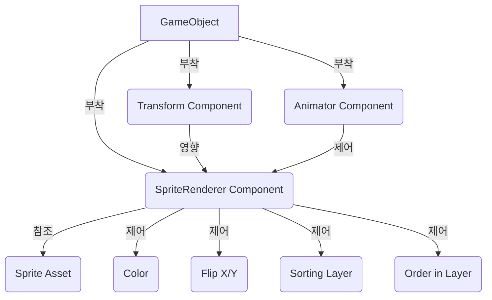

# **SpriteRenderer (스프라이트 렌더러)?**
Unity에서 SpriteRenderer (스프라이트 렌더러)는 2D 게임 개발의 핵심 컴포넌트입니다. 2D 이미지인 '스프라이트(Sprite)'를 씬에 렌더링(그려주는) 역할을 담당합니다. 마치 화가가 캔버스에 그림을 그릴 때, 다양한 그림 조각(스프라이트)들을 배치하고 색칠하는 것과 같다고 할 수 있습니다. SpriteRenderer는 GameObject에 부착되어 2D 이미지를 화면에 표시하고, 색상, 정렬 순서 등을 제어할 수 있게 해줍니다.

## **핵심 요약**
- SpriteRenderer는 2D 이미지를 씬에 렌더링하는 컴포넌트입니다.
- Sprite 에셋을 참조하여 화면에 표시합니다.
- 색상, 뒤집기, 정렬 순서 등 다양한 시각적 속성을 제어할 수 있습니다.

## **세부 개념**
### **1. SpriteRenderer의 정의 및 역할**
SpriteRenderer는 2D 게임에서 시각적인 요소를 담당하는 가장 기본적인 컴포넌트입니다. 텍스처(Texture)를 기반으로 생성된 Sprite 에셋을 받아 씬의 GameObject에 2D 이미지 형태로 그려줍니다.

- **역할**: 
  - **2D 이미지 표시**: Sprite 에셋을 사용하여 GameObject를 2D 이미지로 화면에 렌더링합니다.
  - **시각적 제어**: 스프라이트의 색상, 투명도, 뒤집기(Flip), 정렬 순서(Order in Layer) 등을 조절하여 다양한 시각적 효과를 연출합니다.
  - **애니메이션 지원**: Animator 컴포넌트와 함께 사용하여 스프라이트 애니메이션을 구현할 수 있습니다.

### **2. SpriteRenderer의 주요 속성**
Inspector 창에서 SpriteRenderer 컴포넌트를 선택하면 다음과 같은 주요 속성들을 설정할 수 있습니다.

- **Sprite**: 렌더링할 실제 Sprite 에셋을 지정합니다. 프로젝트 창에서 Sprite 에셋을 드래그하여 할당할 수 있습니다.
- **Color**: 스프라이트의 색상과 투명도(Alpha)를 조절합니다. 흰색(기본값)은 원본 스프라이트 색상을 유지하며, 다른 색상을 적용하면 스프라이트가 해당 색상으로 틴트(tint)됩니다.
- **Flip**: 스프라이트를 X축 또는 Y축으로 뒤집을 수 있습니다. (예: 캐릭터가 왼쪽/오른쪽을 바라보게 할 때)
- **Material**: 스프라이트를 렌더링하는 데 사용될 Material을 지정합니다. 일반적으로 2D 스프라이트용 기본 Material을 사용합니다.
- **Sorting Layer**: 스프라이트가 렌더링될 레이어를 지정합니다. 여러 레이어를 사용하여 복잡한 2D 씬의 깊이감을 표현할 수 있습니다.
- **Order in Layer**: 같은 Sorting Layer 내에서 스프라이트의 렌더링 순서를 지정합니다. 숫자가 높을수록 더 앞에 그려집니다.

- **예시 (SpriteRenderer 설정)**:
  - **단순 출력 예제**: 빈 GameObject를 생성하고 SpriteRenderer 컴포넌트를 추가한 후, Inspector 창에서 Sprite 속성에 원하는 2D 이미지(Sprite)를 할당하고, Color를 빨간색으로 변경하는 작업은 SpriteRenderer의 기본적인 사용 예시입니다.
  - **실용 예제 (캐릭터 스프라이트)**: 2D 게임의 플레이어 캐릭터 GameObject에 SpriteRenderer를 부착합니다. `Sprite` 속성에는 캐릭터의 기본 idle 애니메이션 첫 프레임 스프라이트를 할당하고, `Sorting Layer`를 'Player'로, `Order in Layer`를 0으로 설정합니다. 캐릭터가 피격당했을 때 `Color` 속성의 Alpha 값을 조절하여 깜빡이는 효과를 주거나, `Flip X`를 사용하여 캐릭터가 이동 방향에 따라 좌우를 바라보게 할 수 있습니다.
    ```csharp
    // PlayerSpriteController.cs
    using UnityEngine;

    public class PlayerSpriteController : MonoBehaviour
    {
        private SpriteRenderer spriteRenderer;
        public Color hitColor = Color.red; // 피격 시 색상
        public float blinkDuration = 0.5f; // 깜빡이는 시간
        private bool isBlinking = false;

        void Start()
        {
            spriteRenderer = GetComponent<SpriteRenderer>();
            if (spriteRenderer == null)
            {
                Debug.LogError("SpriteRenderer 컴포넌트가 없습니다!");
            }
        }

        // 캐릭터가 피격당했을 때 호출될 메서드
        public void OnHit()
        {
            if (!isBlinking)
            {
                StartCoroutine(BlinkEffect());
            }
        }

        System.Collections.IEnumerator BlinkEffect()
        {
            isBlinking = true;
            Color originalColor = spriteRenderer.color;
            float timer = 0f;

            while (timer < blinkDuration)
            {
                spriteRenderer.color = (spriteRenderer.color == originalColor) ? hitColor : originalColor;
                yield return new WaitForSeconds(0.1f); // 0.1초마다 색상 변경
                timer += 0.1f;
            }
            spriteRenderer.color = originalColor; // 원래 색상으로 복귀
            isBlinking = false;
        }

        void Update()
        {
            // 예시: 좌우 이동에 따라 스프라이트 뒤집기
            if (Input.GetKeyDown(KeyCode.LeftArrow))
            {
                spriteRenderer.flipX = true;
            }
            else if (Input.GetKeyDown(KeyCode.RightArrow))
            {
                spriteRenderer.flipX = false;
            }
        }
    }
    ```
    - **설명**: 위 스크립트는 `SpriteRenderer` 컴포넌트의 `color` 속성을 변경하여 피격 시 깜빡이는 효과를 주거나, `flipX` 속성을 변경하여 캐릭터의 좌우 방향을 전환하는 예시를 보여줍니다. `GetComponent<SpriteRenderer>()`를 통해 SpriteRenderer 컴포넌트에 접근합니다.

### **3. SpriteRenderer와 다른 컴포넌트의 상호작용**
- **Transform**: SpriteRenderer는 GameObject의 Transform 컴포넌트가 정의하는 위치, 회전, 크기에 따라 씬에 렌더링됩니다.
- **Animator**: Animator 컴포넌트와 함께 사용하여 여러 스프라이트를 순차적으로 표시함으로써 2D 애니메이션을 구현합니다.
- **Collider2D**: SpriteRenderer가 표시하는 이미지의 형태에 맞춰 2D 충돌 영역을 설정할 수 있습니다.

## **코드/다이어그램**


## **주요 속성과 메서드**
| 이름 | 타입 | 설명 | 예시 |
|---|---|---|---|
| `sprite` | `Sprite` | 렌더링할 Sprite 에셋 | `spriteRenderer.sprite = mySpriteAsset;` |
| `color` | `Color` | 스프라이트의 색상 및 투명도 | `spriteRenderer.color = Color.red;` |
| `flipX` | `bool` | X축으로 뒤집기 여부 | `spriteRenderer.flipX = true;` |
| `flipY` | `bool` | Y축으로 뒤집기 여부 | `spriteRenderer.flipY = false;` |
| `sortingLayerName` | `string` | 렌더링될 Sorting Layer의 이름 | `spriteRenderer.sortingLayerName = "Player";` |
| `sortingOrder` | `int` | Sorting Layer 내에서의 렌더링 순서 | `spriteRenderer.sortingOrder = 1;` |
| `GetPropertyBlock(MaterialPropertyBlock dest)` | `void` | Material 속성 블록을 가져옵니다. | `spriteRenderer.GetPropertyBlock(block);` |
| `SetPropertyBlock(MaterialPropertyBlock properties)` | `void` | Material 속성 블록을 설정합니다. | `spriteRenderer.SetPropertyBlock(block);` |

## **실습 문제**
1. 빈 GameObject를 생성하고 SpriteRenderer 컴포넌트를 추가하시오. 프로젝트에 2D 이미지(예: PNG 파일)를 임포트하여 Sprite로 변환한 후, SpriteRenderer의 `Sprite` 속성에 할당하시오.
2. 스크립트를 작성하여 키보드의 왼쪽 화살표를 누르면 스프라이트가 X축으로 뒤집히고, 오른쪽 화살표를 누르면 원래대로 돌아오도록 구현하시오.
3. 두 개의 SpriteRenderer를 가진 GameObject를 생성하시오. 하나는 배경 스프라이트, 다른 하나는 캐릭터 스프라이트라고 가정하고, 캐릭터 스프라이트가 항상 배경 스프라이트보다 앞에 렌더링되도록 `Sorting Layer`와 `Order in Layer` 속성을 조절하시오.

??? success "정답 및 해설"

    **1번 (에디터 작업)**:
    1. PNG 파일을 Project 창으로 드래그하여 임포트
    2. 이미지 선택 → 인스펙터에서 **Texture Type을 `Sprite (2D and UI)`** 로 변경 → Apply
    3. 빈 GameObject에 SpriteRenderer 추가 → `Sprite` 슬롯에 변환된 스프라이트를 드래그

    **2번**:
    ```csharp
    private SpriteRenderer sr;

    void Start()
    {
        sr = GetComponent<SpriteRenderer>();
    }

    void Update()
    {
        if (Input.GetKeyDown(KeyCode.LeftArrow))  sr.flipX = true;    // X축 뒤집기
        if (Input.GetKeyDown(KeyCode.RightArrow)) sr.flipX = false;   // 원래대로
    }
    ```
    `flipX`는 스케일을 음수로 만들지 않고 렌더링만 뒤집어서 콜라이더나 자식에 영향이 없습니다.

    **3번 (에디터 작업)**:
    1. 인스펙터 → Sorting Layer 드롭다운 → `Add Sorting Layer...` → `Background`, `Character` 생성
       (목록에서 **아래쪽에 있는 레이어가 나중에 = 더 앞에** 그려집니다)
    2. 배경 스프라이트 → Sorting Layer를 `Background`로
    3. 캐릭터 스프라이트 → Sorting Layer를 `Character`로
    - 같은 레이어 안에서 순서를 조절할 땐 **Order in Layer** 숫자가 클수록 앞에 그려집니다.


## **주의사항**
SpriteRenderer는 2D 게임의 시각적 표현에 있어 가장 기본적이면서도 중요한 컴포넌트입니다. 다양한 속성들을 조절하며 원하는 시각적 효과를 만들어내는 연습을 꾸준히 하는 것이 좋습니다.
