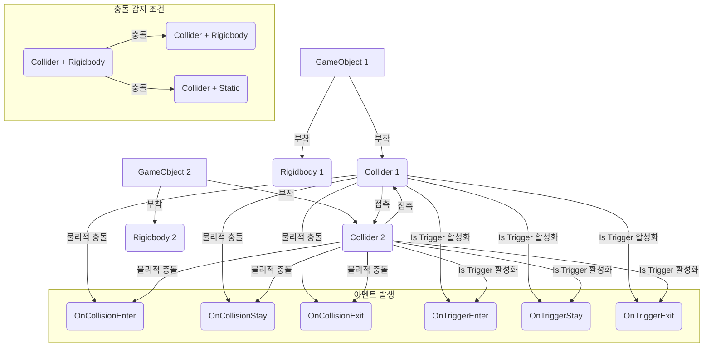

# **Collision (충돌)?**
Unity에서 Collision (충돌)은 두 개 이상의 GameObject가 물리적으로 서로 겹치거나 접촉하는 현상을 의미합니다. 이는 게임 세계에서 오브젝트들이 서로 부딪히고 반응하는 방식을 결정하는 핵심적인 요소입니다. 마치 당구공들이 서로 부딪히며 움직임이 변하는 것처럼, Unity의 충돌 시스템은 게임 오브젝트들이 현실적인 물리적 상호작용을 하도록 만듭니다.

## **핵심 요약**
- Collision은 GameObject 간의 물리적 접촉을 의미합니다.
- Collider 컴포넌트가 충돌 영역을 정의하고, Rigidbody 컴포넌트가 물리적 반응을 담당합니다.
- `OnCollisionEnter`, `OnCollisionStay`, `OnCollisionExit` 등의 콜백 함수를 통해 충돌 이벤트를 처리합니다.

## **세부 개념**
### **1. 충돌 감지의 기본 원리**
Unity에서 충돌을 감지하고 처리하기 위해서는 최소한 두 가지 조건이 필요합니다.

1.  **Collider (콜라이더)**: 충돌을 감지할 GameObject에는 반드시 Collider 컴포넌트가 부착되어 있어야 합니다. Collider는 GameObject의 물리적인 형태를 정의하는 '보이지 않는 껍질'과 같습니다. (예: `BoxCollider`, `SphereCollider`, `CapsuleCollider` 등)
2.  **Rigidbody (리지드바디)**: 두 GameObject 중 적어도 하나는 Rigidbody 컴포넌트가 부착되어 있어야 합니다. Rigidbody는 GameObject가 물리 엔진의 영향을 받도록 하여 질량, 중력, 힘, 마찰 등을 처리합니다. Rigidbody가 없는 Collider는 '정적(Static)' Collider로 간주되어 다른 Rigidbody와 충돌 시 물리적인 반응을 일으키지만, 스스로는 움직이지 않습니다.

- **충돌 감지 조건**: 
  - **Rigidbody + Collider vs Rigidbody + Collider**: 물리적 충돌 및 이벤트 발생
  - **Rigidbody + Collider vs Collider (Static)**: 물리적 충돌 및 이벤트 발생
  - **Collider (Static) vs Collider (Static)**: 충돌 감지 안 됨 (물리적 상호작용 없음)

### **2. 충돌 이벤트 (Collision Events)**
GameObject에 Collider와 Rigidbody가 올바르게 설정되어 있으면, 충돌이 발생했을 때 Unity는 특정 콜백 함수를 호출합니다. 이 함수들을 스크립트에서 구현하여 충돌에 대한 게임 로직을 작성할 수 있습니다.

- `OnCollisionEnter(Collision collision)`: 두 Collider가 처음으로 접촉하는 순간 한 번 호출됩니다.
- `OnCollisionStay(Collision collision)`: 두 Collider가 접촉하고 있는 동안 매 프레임 호출됩니다.
- `OnCollisionExit(Collision collision)`: 두 Collider가 서로 떨어지는 순간 한 번 호출됩니다.

- **`Collision` 객체**: 이 콜백 함수들은 `Collision` 타입의 매개변수를 받습니다. 이 객체는 충돌에 대한 다양한 정보를 포함합니다.
  - `collision.gameObject`: 충돌한 상대방 GameObject
  - `collision.collider`: 충돌한 상대방 Collider
  - `collision.contacts`: 충돌 지점들의 배열
  - `collision.relativeVelocity`: 충돌 시 상대적인 속도

- **예시 (충돌 이벤트 처리)**:
  - **단순 출력 예제**: 두 개의 큐브가 충돌했을 때 콘솔에 메시지를 출력합니다.
    ```csharp
    using UnityEngine;

    public class CollisionDetector : MonoBehaviour
    {
        void OnCollisionEnter(Collision collision)
        {
            Debug.Log(gameObject.name + "이(가) " + collision.gameObject.name + "과(와) 충돌했습니다!");
        }

        void OnCollisionStay(Collision collision)
        {
            // Debug.Log(gameObject.name + "이(가) " + collision.gameObject.name + "과(와) 충돌 중입니다.");
        }

        void OnCollisionExit(Collision collision)
        {
            Debug.Log(gameObject.name + "이(가) " + collision.gameObject.name + "과(와) 충돌에서 벗어났습니다.");
        }
    }
    ```
    - **설명**: 이 스크립트를 Rigidbody와 Collider를 가진 GameObject에 부착하면, 다른 Rigidbody/Collider와 충돌할 때 각 이벤트에 해당하는 메시지가 출력됩니다.

  - **실용 예제 (플레이어와 적 충돌)**: 플레이어가 적과 충돌했을 때 적에게 데미지를 주고, 적은 파괴되는 로직을 구현합니다.
    ```csharp
    // PlayerCombat.cs (플레이어에 부착)
    using UnityEngine;

    public class PlayerCombat : MonoBehaviour
    {
        public int damage = 10;

        void OnCollisionEnter(Collision collision)
        {
            // 충돌한 오브젝트가 "Enemy" 태그를 가지고 있는지 확인
            if (collision.gameObject.CompareTag("Enemy"))
            {
                EnemyHealth enemyHealth = collision.gameObject.GetComponent<EnemyHealth>();
                if (enemyHealth != null)
                {
                    enemyHealth.TakeDamage(damage);
                }
            }
        }
    }

    // EnemyHealth.cs (적에 부착)
    using UnityEngine;

    public class EnemyHealth : MonoBehaviour
    {
        public int currentHealth = 50;

        public void TakeDamage(int amount)
        {
            currentHealth -= amount;
            Debug.Log(gameObject.name + "이(가) " + amount + "의 데미지를 받았습니다. 남은 체력: " + currentHealth);

            if (currentHealth <= 0)
            {
                Destroy(gameObject); // 적 파괴
            }
        }
    }
    ```
    - **설명**: 플레이어의 `PlayerCombat` 스크립트에서 `OnCollisionEnter`를 통해 적과 충돌했는지 확인하고, 적의 `EnemyHealth` 컴포넌트를 찾아 `TakeDamage` 메서드를 호출합니다. `EnemyHealth` 스크립트에서는 데미지를 처리하고 체력이 0이 되면 적 GameObject를 파괴합니다.

### **3. 트리거 (Trigger) vs 충돌 (Collision)**
Collider 컴포넌트의 `Is Trigger` 속성을 체크하면, 해당 Collider는 물리적인 충돌을 일으키지 않고 '트리거 영역'으로 작동합니다. 이 경우 `OnCollision...` 대신 `OnTrigger...` 콜백 함수가 호출됩니다.

- `OnTriggerEnter(Collider other)`: 다른 Collider가 트리거 영역에 처음 진입하는 순간 한 번 호출됩니다.
- `OnTriggerStay(Collider other)`: 다른 Collider가 트리거 영역 내에 있는 동안 매 프레임 호출됩니다.
- `OnTriggerExit(Collider other)`: 다른 Collider가 트리거 영역에서 벗어나는 순간 한 번 호출됩니다.

- **`Collider` 객체**: 이 콜백 함수들은 `Collider` 타입의 매개변수를 받습니다. 이 객체는 트리거에 진입/탈출한 상대방 Collider를 나타냅니다.

- **예시 (트리거 이벤트 처리)**:
  - **단순 출력 예제**: 플레이어가 아이템 영역에 진입했을 때 메시지를 출력합니다.
    ```csharp
    using UnityEngine;

    public class TriggerZone : MonoBehaviour
    {
        void OnTriggerEnter(Collider other)
        {
            if (other.CompareTag("Player"))
            {
                Debug.Log("플레이어가 트리거 영역에 진입했습니다!");
            }
        }

        void OnTriggerExit(Collider other)
        {
            if (other.CompareTag("Player"))
            {
                Debug.Log("플레이어가 트리거 영역에서 벗어났습니다.");
            }
        }
    }
    ```
    - **설명**: 이 스크립트를 `Is Trigger`가 체크된 Collider를 가진 GameObject에 부착하면, 'Player' 태그를 가진 GameObject가 이 영역에 진입하거나 벗어날 때 메시지가 출력됩니다.

  - **잘못된 코드 (Collider와 Rigidbody의 부재)**:
    ```csharp
    // 의도: 충돌을 감지하려 함
    // 실제: Collider나 Rigidbody가 없어서 충돌이 감지되지 않음
    public class NoCollisionScript : MonoBehaviour
    {
        void OnCollisionEnter(Collision collision)
        {
            // 이 코드는 GameObject에 Collider와 Rigidbody가 없으면 호출되지 않습니다.
            Debug.Log("충돌 감지!");
        }
    }
    ```
    - **설명**: `OnCollisionEnter`와 같은 충돌 이벤트 함수는 해당 GameObject에 Collider 컴포넌트가 부착되어 있고, 충돌하는 두 GameObject 중 적어도 하나에 Rigidbody 컴포넌트가 있어야만 호출됩니다. 이 조건이 충족되지 않으면 충돌 이벤트는 발생하지 않습니다.

## **코드/다이어그램**


## **주요 속성과 메서드**
| 이름 | 타입 | 설명 | 예시 |
|---|---|---|---|
| **Collision (매개변수)** | | | |
| `collision.gameObject` | `GameObject` | 충돌한 상대방 GameObject | `Debug.Log(collision.gameObject.name);` |
| `collision.collider` | `Collider` | 충돌한 상대방 Collider | `Debug.Log(collision.collider.name);` |
| `collision.contacts` | `ContactPoint[]` | 충돌 지점 정보 | `Vector3 contactPoint = collision.contacts[0].point;` |
| `collision.relativeVelocity` | `Vector3` | 충돌 시 상대 속도 | `Vector3 vel = collision.relativeVelocity;` |
| **Collider (매개변수)** | | | |
| `other.gameObject` | `GameObject` | 트리거에 진입/탈출한 상대방 GameObject | `Debug.Log(other.gameObject.name);` |
| `other.tag` | `string` | 트리거에 진입/탈출한 상대방의 태그 | `if (other.CompareTag("Player")) { ... }` |
| **MonoBehaviour 콜백** | | | |
| `OnCollisionEnter(Collision collision)` | `void` | 충돌 시작 시 | `void OnCollisionEnter(Collision col) { ... }` |
| `OnCollisionStay(Collision collision)` | `void` | 충돌 중 | `void OnCollisionStay(Collision col) { ... }` |
| `OnCollisionExit(Collision collision)` | `void` | 충돌 종료 시 | `void OnCollisionExit(Collision col) { ... }` |
| `OnTriggerEnter(Collider other)` | `void` | 트리거 진입 시 | `void OnTriggerEnter(Collider other) { ... }` |
| `OnTriggerStay(Collider other)` | `void` | 트리거 내에 있는 동안 | `void OnTriggerStay(Collider other) { ... }` |
| `OnTriggerExit(Collider other)` | `void` | 트리거 벗어날 시 | `void OnTriggerExit(Collider other) { ... }` |

## **실습 문제**
1. 씬에 두 개의 큐브 GameObject를 배치하시오. 하나는 `Rigidbody`와 `BoxCollider`를 가지고, 다른 하나는 `BoxCollider`만 가지게 하시오. `Rigidbody`를 가진 큐브를 움직여 다른 큐브와 충돌하게 하고, `OnCollisionEnter`를 사용하여 충돌 시 콘솔에 메시지를 출력하시오.
2. 플레이어 GameObject와 'Goal' GameObject를 씬에 배치하시오. 'Goal' GameObject에는 `BoxCollider`를 부착하고 `Is Trigger`를 활성화하시오. 플레이어가 'Goal' 영역에 진입하면 `OnTriggerEnter`를 사용하여 '게임 승리!' 메시지를 출력하고 플레이어를 비활성화하는 스크립트를 작성하시오.
3. 스크립트를 작성하여 `OnCollisionStay`를 사용하여 두 GameObject가 충돌하고 있는 동안 특정 효과(예: 충돌 지점의 색상 변경)를 지속적으로 발생시키시오.

??? success "정답 및 해설"

    **1번**:
    ```csharp
    // Rigidbody를 가진 큐브에 부착
    void OnCollisionEnter(Collision collision)
    {
        Debug.Log($"{collision.gameObject.name}와 충돌!");
    }
    ```
    핵심 조건: **충돌하는 두 오브젝트 중 최소 하나는 Rigidbody가 있어야** 충돌 이벤트가 발생합니다.

    **2번**:
    ```csharp
    // Goal GameObject에 부착 (BoxCollider의 Is Trigger 체크)
    void OnTriggerEnter(Collider other)
    {
        if (other.CompareTag("Player"))
        {
            Debug.Log("게임 승리!");
            other.gameObject.SetActive(false);
        }
    }
    ```
    트리거도 마찬가지로 움직이는 쪽(플레이어)에 Rigidbody가 필요합니다.
    `CompareTag`는 문자열 비교(`other.tag == "Player"`)보다 GC 부담이 없어 권장됩니다.

    **3번**:
    ```csharp
    void OnCollisionStay(Collision collision)
    {
        var rend = collision.gameObject.GetComponent<Renderer>();
        if (rend != null)
        {
            // PingPong : 0~1 사이를 왕복 — 충돌 중 색이 깜빡이는 효과
            float t = Mathf.PingPong(Time.time * 2f, 1f);
            rend.material.color = Color.Lerp(Color.white, Color.red, t);
        }
    }
    ```
    `OnCollisionStay`는 닿아 있는 동안 매 물리 프레임 호출 — 지속 데미지(용암 등)에도 같은 패턴을 씁니다.


## **주의사항**
충돌과 트리거는 게임의 상호작용을 구현하는 데 필수적인 요소입니다. 각 이벤트의 발생 조건과 `Collision` 또는 `Collider` 객체가 제공하는 정보를 정확히 이해하고 활용하는 것이 중요합니다. 2D 게임에서는 `Collider2D`와 `Rigidbody2D`를 사용하며, 콜백 함수 이름도 `OnCollisionEnter2D`와 같이 `2D`가 붙습니다.
