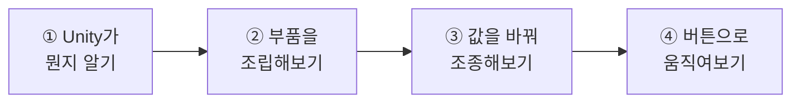
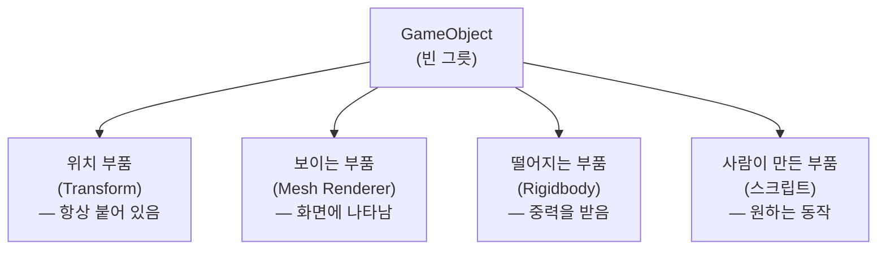
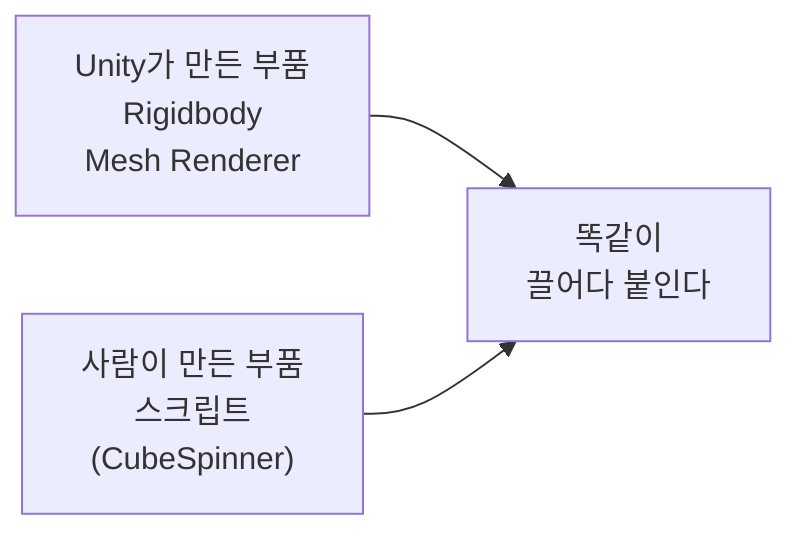
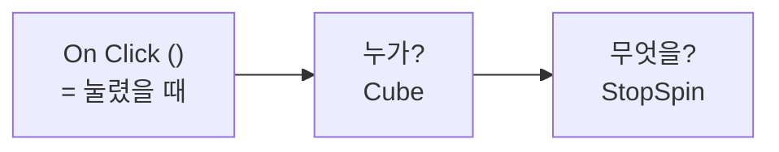
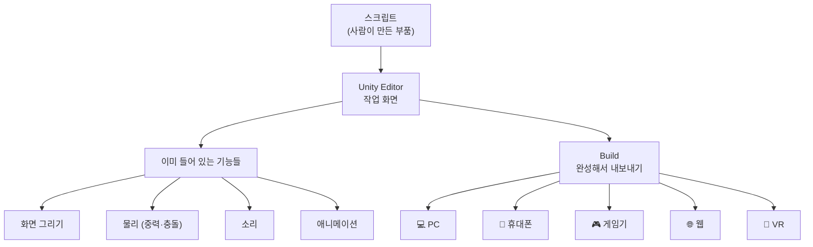

# **1차시. Unity와 첫 만남**
---

!!! info "이 자료는 이렇게 보세요"
    - **강의 영상과 함께 보는 자료**입니다. 영상을 따라가시면서 옆에 두고 보시면 됩니다.
    - **프로그래밍을 몰라도 괜찮습니다.** 이번 차시에는 **코드를 한 줄도 쓰지 않습니다.**
    - 오늘 하실 일은 **마우스로 끌어다 놓기, 숫자 바꾸기, 목록에서 고르기** 이 세 가지가 전부예요.
    - 낯선 영어 단어가 나와도 걱정하지 마세요. **필요한 것만 그때그때 알려드립니다.**

---

## **오늘의 목표**

이번 차시가 끝나면 여러분은 **코드 없이** 이런 것을 만드시게 됩니다.

- 화면에서 **네모가 빙글빙글 도는 것**
- 그 속도를 **숫자로 조절하는 것**
- **버튼을 눌러 멈추고, 다시 돌리고, 색을 바꾸는 것**

---

## **1. Unity는 어떤 도구인가요?**

**Unity**는 한마디로 **화면에서 움직이는 것들을 만드는 도구**입니다.

'게임 엔진'이라고 부르기도 하는데, 그건 반만 맞는 말이에요. 게임도 만들지만 그 외에도 아주 많은 곳에 쓰입니다.

### **영화 스튜디오에 비유하면**

Unity는 **종합 영화 스튜디오**와 같습니다. 영화를 한 편 찍는다고 생각해보세요.

| 영화를 찍으려면 | Unity에서는 | 무슨 역할인가요 |
| :--- | :--- | :--- |
| 카메라가 필요하죠 | **Camera** | 장면을 어떻게 보여줄지 |
| 조명과 세트가 필요하죠 | **Lighting · Scene** | 화면의 분위기 |
| 배우가 있어야 하죠 | **GameObject** | 화면에 등장하는 것들 |
| 배우에겐 각본이 필요하죠 | **스크립트** | 언제 무엇을 할지 |
| 다 찍으면 색보정을 하죠 | **Post-Processing** | 마지막 색감과 효과 |
| 극장에 걸어야죠 | **Build** | PC·휴대폰·콘솔·웹으로 내보내기 |

!!! tip "오늘 여러분이 할 일"
    오늘은 **배우(GameObject)에게 각본(스크립트)을 쥐여주는 것**까지 해봅니다.
    각본은 이미 만들어져 있으니, 여러분은 **건네주기만** 하면 됩니다.

### **왜 Unity를 쓰나요?**

이유는 딱 두 가지입니다.

1. **한 프로그램 안에서 다 됩니다.** 만들고, 배치하고, 바로 실행해보는 것까지요.
2. **한 번 만들면 여러 곳으로 나갑니다.** PC, 휴대폰, 게임기, 웹, VR 어디든 갑니다.

---

## **2. Unity로 뭘 만드나요?**

게임만 만드는 도구가 아닙니다. 생각보다 훨씬 넓게 쓰입니다.

| 분야 | 어떻게 쓰이나요 |
| :--- | :--- |
| 🎮 **게임** | 휴대폰·PC·게임기용 게임 |
| 🚗 **자동차** | 화면에서 차를 돌려보고 색을 바꿔보는 카탈로그 |
| 🏗 **건축** | 아직 안 지어진 건물 안을 미리 걸어다녀 보기 |
| 🎓 **교육·훈련** | 병원의 수술 연습, 안전 교육 프로그램 |
| 🥽 **VR·AR** | VR 기기용 콘텐츠 |
| 🎬 **영상 제작** | 촬영 전에 장면을 미리 만들어보기 |

!!! note "그래서"
    여러분이 배우시는 게 **게임 만드는 기술만은 아닙니다.**

---

## **3. Unity의 두 얼굴**

Unity에는 얼굴이 두 개 있습니다. **주방과 완성된 요리**라고 생각하시면 쉽습니다.

| 구분 | 무엇인가요 | 누가 보나요 |
| :--- | :--- | :--- |
| **Unity Editor** | 만드는 사람이 쓰는 **작업 화면** | 만드는 사람 |
| **Unity Runtime** | 다 만들어져서 **혼자 돌아가는 상태** | 사용하는 사람 |

여러분이 앞으로 계속 보게 될 화면이 **Editor**입니다.
Editor 위쪽의 **▶ 버튼**을 누르면 실행되는데, 이건 **작업 화면 안에서 미리 돌려보는 것**입니다. 아직 진짜 완성품은 아니에요.

!!! warning "처음 Editor 화면을 보면"
    창이 여러 개라 정신없어 보입니다. **지금은 하나도 모르셔도 괜찮습니다.**
    각 창이 뭘 하는지는 **2차시에서** 하나씩 다룹니다. 오늘은 강사가 클릭하는 것만 따라와주세요.

---

## **4. Unity가 물건을 만드는 방식 — 부품 조립**

여기가 오늘 가장 중요한 부분입니다.

Unity는 **레고 조립**과 아주 비슷한 방식으로 물건을 만듭니다.

### **먼저 빈 그릇을 놓습니다**

아무것도 아닌 **빈 그릇**을 하나 놓습니다. 이걸 **GameObject**라고 부릅니다.
말 그대로 비어 있어서, 이 상태로는 화면에 보이지도 않습니다.

### **여기에 부품을 하나씩 끼웁니다**

| 이렇게 하고 싶다면 | 이 부품을 붙입니다 |
| :--- | :--- |
| 어디에 있는지 정하고 싶다 | **위치 부품** (Transform) |
| 화면에 보이게 하고 싶다 | **보이는 부품** (Mesh Renderer) |
| 아래로 떨어지게 하고 싶다 | **떨어지는 부품** (Rigidbody) |
| 부딪히게 하고 싶다 | **부딪히는 부품** (Collider) |
| 내가 원하는 대로 움직이게 하고 싶다 | **사람이 만든 부품** (스크립트) |

!!! success "핵심 한 줄"
    **붙이면 생기고, 빼면 사라집니다.**
    필요한 부품을 갖다 붙이는 것, 이게 Unity의 방식입니다.

!!! note "위치 부품은 뗄 수 없습니다"
    **Transform**이라는 이름의 위치 부품은 **모든 물건에 항상 붙어 있고, 절대 뗄 수 없습니다.**
    어디에 있는지 모르는 물건은 존재할 수가 없기 때문이에요.

---

## **5. Inspector — 부품 목록이자 조종석**

Unity 화면 **오른쪽**에 있는 창을 **Inspector**라고 부릅니다.
오늘 이 창을 가장 많이 쓰게 되실 거예요.

!!! abstract "Inspector가 하는 일"
    1. **지금 고른 물건에 어떤 부품이 붙어 있는지** 보여줍니다.
    2. **그 부품의 값을 바꿀 수 있게** 해줍니다. ← **오늘의 핵심**

### **여기서 뭘 할 수 있나요**

| 이런 칸이 나오면 | 이렇게 하시면 됩니다 |
| :--- | :--- |
| 숫자 칸 | 숫자를 직접 입력합니다 |
| 체크박스 ☑ | 켜고 끕니다 |
| 색깔 칸 ■ | 클릭해서 색을 고릅니다 |
| 빈 칸 | 물건을 **끌어다 놓습니다** |
| 목록(드롭다운) | 원하는 것을 고릅니다 |

!!! tip "실제 게임 회사에서는"
    **프로그래머가 부품을 만들고, 기획자와 디자이너가 Inspector에서 값을 조정합니다.**
    코드를 몰라도 게임을 만질 수 있게 해주는 게 바로 이 Inspector예요.
    오늘 여러분이 하실 일이 정확히 그 일입니다.

---

## **6. 스크립트도 결국 '부품'입니다**

지금까지 붙인 부품들은 **Unity가 미리 만들어둔 것**입니다.
그런데 **사람이 직접 만든 부품**도 붙일 수 있어요. 그게 바로 **스크립트**입니다.

앞에서 영화 비유에 나왔던 **'각본'** 이 이겁니다.

!!! success "겁먹지 마세요"
    스크립트는 어렵고 특별한 게 아니라 **그냥 부품 중 하나**입니다.
    붙이는 방법도 Rigidbody와 **똑같습니다. 끌어다 놓기만 하면 돼요.**
    그리고 오늘 쓸 스크립트는 **이미 만들어져 있습니다.** 여러분은 갖다 쓰기만 하시면 됩니다.

---

## **7. 오늘 사용할 부품 — CubeSpinner**

강의자료에 들어 있는 **`CubeSpinner`** 라는 부품을 씁니다. **큐브를 돌리는 부품**이에요.

이 부품을 붙이면 Inspector에 아래 항목들이 나타납니다.

### **7.1 조절할 수 있는 값**

| Inspector 항목 | 무슨 뜻인가요 | 어떻게 바꾸나요 |
| :--- | :--- | :--- |
| **Rotation Speed** | 회전 속도 | 숫자 입력 (클수록 빠름, **음수면 반대 방향**) |
| **Is Spinning** | 돌지 말지 | 체크 켜고 끄기 |
| **Target Color** | 바꿀 색깔 | 클릭해서 색 고르기 |

### **7.2 버튼에 연결할 수 있는 동작**

| 동작 이름 | 무슨 일을 하나요 |
| :--- | :--- |
| **StartSpin** | 돌기 시작 |
| **StopSpin** | 멈추기 |
| **ChangeColor** | 골라둔 색으로 바꾸기 |

### **7.3 특별한 칸 하나**

| 항목 | 무슨 뜻인가요 |
| :--- | :--- |
| **On Stopped** | **회전이 멈추는 순간** 같이 실행할 동작을 연결하는 자리 |

!!! note "미리 알아두시면 좋은 것"
    `Target Color`에서 색을 골라도 **바로 바뀌지는 않습니다.**
    `ChangeColor`가 실행되는 순간에 그 색이 적용됩니다.

---

## **8. 실습 — 직접 해보세요**

영상에서 강사가 "멈추세요"라고 하는 지점에서 아래 순서대로 따라 하시면 됩니다.
**안 되셔도 괜찮습니다.** 몇 번 다시 보셔도 되고, 순서를 그대로 따라만 하셔도 충분합니다.

---

### **실습 ① — 부품을 붙여 물건 만들기**

!!! abstract "목표"
    빈 그릇에 부품을 붙여서, **화면에 나타나고 아래로 떨어지는 네모**를 만듭니다.

1. **Hierarchy**(왼쪽 목록)에서 빈 곳을 **우클릭** → `Create Empty`
   → 빈 그릇이 하나 생깁니다. 아직 화면엔 안 보여요.
2. **Inspector**(오른쪽)를 봅니다. **Transform** 하나만 있습니다.
3. Inspector 아래쪽 **`Add Component`** 클릭 → `Mesh Filter` 검색해서 추가
   → 추가한 뒤 **Mesh** 항목을 **Cube**로 지정합니다.
4. 다시 **`Add Component`** → `Mesh Renderer` 추가
   → **화면에 네모가 나타납니다.**
5. 다시 **`Add Component`** → `Rigidbody` 추가
6. 위쪽 **▶ 버튼**을 누릅니다 → **네모가 아래로 떨어집니다.**
7. ▶ 를 다시 눌러 멈춘 뒤, `Rigidbody` 이름 왼쪽의 **체크를 해제**하고 다시 ▶
   → 이번엔 떨어지지 않습니다.

??? success "확인해보세요"
    - 코드를 **한 줄도 쓰지 않았는데** 네모가 떨어졌나요?
    - 중력이 얼마인지, 떨어지는 속도가 얼마인지 계산한 적이 있나요?
      → **없습니다.** Unity가 이미 다 만들어둔 부품을 갖다 붙였을 뿐입니다.
    - 체크를 해제했더니 안 떨어졌나요?
      → **붙이면 생기고, 빼면 사라진다.** 이게 오늘의 핵심입니다.

!!! warning "잘 안 되신다면"
    - 화면에 아무것도 안 보인다 → `Mesh Filter`의 **Mesh가 비어 있지 않은지** 확인해주세요. `Cube`로 지정해야 합니다.
    - 안 떨어진다 → `Rigidbody`의 **체크가 꺼져 있지 않은지** 확인해주세요.

---

### **실습 ② — Inspector에서 값 바꾸기**

!!! abstract "목표"
    **코드를 고치지 않고**, 숫자와 색만 바꿔서 동작을 조절합니다.

1. 강의자료에서 받은 **`CubeSpinner`** 파일을 **Hierarchy의 큐브 위로 끌어다 놓습니다.**
   → Inspector에 `Cube Spinner (Script)` 가 나타납니다.
2. **▶** 를 눌러봅니다 → **큐브가 돌기 시작합니다.**
3. 돌아가는 상태에서 **Rotation Speed** 값을 바꿔봅니다.
   - `360` → 훨씬 빨라집니다
   - `20` → 아주 느려집니다
   - `-90` → **반대 방향**으로 돕니다
4. **Is Spinning** 체크를 해제 → 멈춥니다. 다시 체크 → 다시 돕니다.
5. **Target Color** 를 클릭해서 원하는 색을 골라둡니다.
   (아직 색은 안 바뀝니다. 다음 실습에서 씁니다.)

??? success "확인해보세요"
    - 속도를 바꾸려고 **코드를 연 적이 있나요?** → 없습니다. 숫자만 바꿨습니다.
    - 이게 바로 게임 회사에서 **기획자와 디자이너가 하는 일**입니다.

!!! danger "꼭 알아두세요 — 값이 사라지는 이유"
    **▶ 를 누른 상태에서 바꾼 값은, ▶ 를 끄면 원래대로 돌아갑니다.**
    실행 중에 이것저것 시험해보라고 만들어진 기능이라 그렇습니다.

    **값을 남기고 싶으시면 ▶ 를 끈 상태에서 바꿔주세요.**

!!! tip "값을 원래대로 되돌리고 싶다면"
    항목 이름 위에서 **우클릭 → `Revert`** 를 누르면 처음 값으로 돌아갑니다.
    마음껏 바꿔보셔도 됩니다.

---

### **실습 ③ — 버튼으로 조종하기**

!!! abstract "목표"
    **회전 시작 / 멈춤 / 색 바꾸기** 버튼 세 개를 만들어 큐브를 조종합니다.

#### **버튼 만들기**

1. **Hierarchy** 우클릭 → `UI` → `Button - TextMeshPro`
2. 처음이라면 **TMP Essentials 설치 창**이 뜹니다 → **`Import TMP Essentials`** 를 눌러주세요.
   글자를 예쁘게 쓰기 위한 준비물입니다.
3. 화면에 큰 사각형이 생기고 시야가 갑자기 넓어집니다.
   → **놀라지 마세요.** 버튼을 올려놓는 **판**이 자동으로 만들어진 것입니다. 지금은 신경 쓰지 않으셔도 됩니다.

#### **동작 연결하기**

1. 만든 **Button**을 선택하고, Inspector를 **아래로 스크롤**합니다.
2. **`On Click ()`** 이라고 적힌 칸을 찾습니다. **'눌렸을 때'** 라는 뜻이에요.
3. **`+`** 를 눌러 칸을 하나 만듭니다.
4. **Hierarchy의 큐브**를 왼쪽 빈 칸으로 **끌어다 놓습니다.** ← **누가** 할지
5. 오른쪽 **목록**을 클릭 → `CubeSpinner` → **`StopSpin`** 선택 ← **무엇을** 할지
6. 버튼의 글자를 **"멈춤"** 으로 바꿉니다.
7. **▶** 를 누르고 버튼을 클릭 → **큐브가 멈춥니다.**

#### **버튼 두 개 더 만들기**

버튼을 선택하고 **Ctrl + D**(복제)를 누른 뒤, 위 4~6번을 똑같이 반복합니다.

| 버튼 글자 | 연결할 동작 |
| :--- | :--- |
| 회전 시작 | `StartSpin` |
| 멈춤 | `StopSpin` |
| 색 바꾸기 | `ChangeColor` |

??? success "완성되면"
    버튼 세 개로 큐브를 자유롭게 조종할 수 있습니다.
    **코드를 한 줄도 쓰지 않고** 여기까지 오셨습니다.

!!! warning "목록에 동작이 안 보인다면"
    4번에서 **큐브를 끌어다 놓지 않으신 경우**가 대부분입니다.
    왼쪽 칸이 `None`으로 비어 있으면 오른쪽 목록에 아무것도 나오지 않습니다.

---

### **실습 ④ — 멈추면 색도 바뀌게 (선택)**

!!! abstract "목표"
    **버튼을 하나만 눌렀는데 두 가지 일이 일어나게** 만듭니다.

1. **Hierarchy에서 큐브**를 선택합니다.
2. Inspector의 **`On Stopped`** 칸을 찾습니다. 버튼의 `On Click`과 **똑같이 생겼습니다.**
3. **`+`** 클릭 → **큐브를 끌어다 놓기** → 목록에서 **`ChangeColor`** 선택
4. **▶** 를 누르고 **"멈춤"** 버튼을 클릭합니다.

??? success "무슨 일이 일어났나요"
    **멈추기도 하고, 색도 같이 바뀌었습니다.**
    색 바꾸기 버튼은 누르지도 않았는데요.

    **'회전이 멈추면 색을 바꿔라'** 라고 미리 연결해뒀기 때문입니다.
    이런 걸 **이벤트 연결**이라고 부릅니다. 이름만 기억해두세요.

!!! tip "이게 왜 좋은가요"
    나중에 "멈출 때 소리도 나게 하고 싶다", "멈출 때 점수도 올리고 싶다" 하시면
    **여기에 하나씩 더 추가하기만 하면 됩니다.**

---

## **9. 오늘 배운 것을 그림으로**

!!! success "이 그림 하나만 기억하셔도 오늘은 성공입니다"
    - 왼쪽 **Editor**가 여러분이 오늘 만졌던 화면입니다.
    - 여기에 **스크립트**가 들어갑니다. 큐브에 붙였던 그 부품이죠.
    - **물리** 덕분에 Rigidbody를 붙이자마자 알아서 떨어졌습니다.
    - **Build**를 누르면 여러 곳으로 나갑니다.

---

## **10. Unity로 만든 것들**

아마 아시는 게 있을 거예요. **전부 같은 프로그램으로 만들었습니다.**

| 이름 | 어떤 것 |
| :--- | :--- |
| **어몽 어스** | PC·휴대폰·게임기에서 모두 나온 멀티플레이 게임 |
| **할로우 나이트** | 조작감 좋은 2D 게임 |
| **포켓몬 GO** | 휴대폰 카메라로 밖에서 즐기는 게임 |
| **비트세이버** | VR 리듬 게임 |
| **컵헤드** | 옛날 만화 스타일로 손으로 그린 게임 |

!!! quote "한 줄 정리"
    **한 번 만들면, 어디든 간다.**
    혼자 만드는 개인 개발자부터 큰 회사까지 Unity를 쓰는 이유입니다.

---

## **11. 정리 문제**

맞히는 게 목적이 아닙니다. **오늘 내용이 머리에 남았는지 확인하는 용도**예요.
먼저 스스로 답을 떠올려보신 뒤에 정답을 펼쳐주세요.

### **문제 1**
**Unity Editor**와 **Unity Runtime**은 어떻게 다른가요?

??? success "정답 보기"
    - **Editor**: 만드는 사람이 쓰는 **작업 화면**
    - **Runtime**: 다 만들어져서 **혼자 돌아가는 상태**

    **주방과 완성된 요리**로 비유했었습니다.

### **문제 2**
Unity에서 물건을 만드는 방식을 **한마디로** 하면?

??? success "정답 보기"
    **빈 그릇에 부품을 붙인다.** (레고 조립)

    - 보이게 하고 싶으면 → **보이는 부품**
    - 떨어뜨리고 싶으면 → **Rigidbody**
    - 돌리고 싶으면 → **CubeSpinner**

    **필요한 걸 갖다 붙이면 됩니다.**

    !!! tip "이 답이 잘 안 떠오르셨다면"
        영상에서 **부품 조립 파트를 한 번 더** 보시는 걸 권합니다.
        여기서 안 잡히면 다음 차시가 어려워집니다.

### **문제 3**
**Inspector**는 무엇을 하는 곳인가요?

??? success "정답 보기"
    **고른 물건의 부품 목록이자, 그 부품의 값을 조정하는 곳**입니다.

    오늘 여기서 회전 속도를 바꾸고, 체크를 껐다 켜고, 색을 고르고, 버튼에 동작을 연결했습니다.
    **전부 Inspector에서 했고, 코드는 고치지 않았습니다.**

### **문제 4**
Unity가 **처음 배우는 사람에게 좋은 이유**는 무엇일까요?

??? success "정답 보기"
    - **부품을 끌어다 놓으면 바로 움직입니다.** 코드 없이도 뭔가 만들어져요. (오늘 직접 겪으셨죠)
    - **한국어 자료가 아주 많습니다.** 막히면 검색하면 거의 다 나옵니다.
    - **일정 규모 이하에서는 무료**로 쓸 수 있습니다.

    !!! note "요금에 대해"
        정확한 무료 조건과 요금제는 **정책이 자주 바뀝니다.**
        [Unity 공식 요금 페이지](https://unity.com/pricing)에서 현재 기준을 확인해주세요.

### **문제 5**
**"Unity는 성능이 떨어진다"** 는 말을 들어보셨을 수 있습니다. 맞는 말일까요?

??? success "정답 보기"
    **부분적으로는 맞지만, 대부분의 경우 문제가 되지 않습니다.**

    - 게임기에서 **최고 화질·최고 성능**을 뽑아야 하는 대형 게임이라면 다른 도구가 유리할 수 있습니다.
    - 그런데 **세상에 나오는 게임의 대부분은 Unity로 충분합니다.**

    !!! tip "지금 단계에서는"
        성능을 걱정할 단계가 아닙니다. **만드는 게 먼저입니다.**

---

## **12. 앞으로 조심할 것**

!!! warning "흔한 오해와 실수"
    - **Unity = 게임만 만드는 도구**라고 생각하기 → 아니라고 했죠?
    - **부품을 무작정 많이 붙이기** → 한 물건에 스무 개씩 붙이면 나중에 본인도 뭐가 뭔지 모릅니다.

!!! tip "좋은 습관 하나"
    **부품 하나는 일 하나만.**
    오늘은 이 습관 하나만 가져가시면 충분합니다.

---

## **13. 오늘의 정리**

!!! success "세 줄 요약"
    1. Unity는 **화면에서 움직이는 것을 만드는 도구**다.
    2. **빈 그릇에 부품을 붙여서** 만든다.
    3. **Inspector에서 값을 바꾸고 동작을 연결하면**, 코드 없이도 조종할 수 있다.

여러분은 오늘 **프로그래밍 한 줄 없이 게임 요소를 하나 만드셨습니다.** 충분히 잘하셨어요.

---

## **14. 다음 차시 준비**

!!! example "2차시 — Unity Editor 제대로 보기"
    오늘 "지금은 몰라도 된다"고 넘어갔던 그 창들을 하나씩 다룹니다.
    Hierarchy는 뭐고, Project는 뭐고, Scene은 무엇인지요.

    오늘은 강사가 클릭하는 걸 따라 하셨다면, **2차시부터는 직접 찾아서 만지시게 됩니다.**

!!! note "미리 해두시면 좋은 것"
    다운로드에 시간이 꽤 걸리니 **미리 해두시길 권합니다.**

    - [ ] **Unity Hub** 설치
    - [ ] **Unity 에디터** 설치 — 버전은 **강의자료에 안내된 버전**으로 맞춰주세요
    - [ ] 강의자료 다운로드

    !!! warning "버전을 꼭 맞춰주세요"
        버전이 다르면 화면이 조금씩 달라서 따라 하실 때 헷갈리실 수 있습니다.

---

## **부록 — 오늘 나온 용어 정리**

영어 이름이 낯설게 느껴지실 때 이 표를 보세요.

| 화면에 보이는 이름 | 우리말로 하면 |
| :--- | :--- |
| **GameObject** | 빈 그릇, 화면에 놓는 물건 하나 |
| **Component** | 부품 |
| **Transform** | 위치 부품 (항상 붙어 있음) |
| **Mesh Renderer** | 보이는 부품 |
| **Rigidbody** | 떨어지는 부품 (중력) |
| **Collider** | 부딪히는 부품 |
| **Script** | 사람이 만든 부품, 각본 |
| **Inspector** | 부품 목록이자 조종석 |
| **Hierarchy** | 화면에 있는 물건들의 목록 |
| **Add Component** | 부품 추가 |
| **On Click** | 눌렸을 때 |
| **Play (▶)** | 미리 실행해보기 |
| **Build** | 완성해서 내보내기 |
