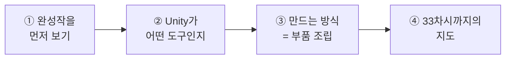
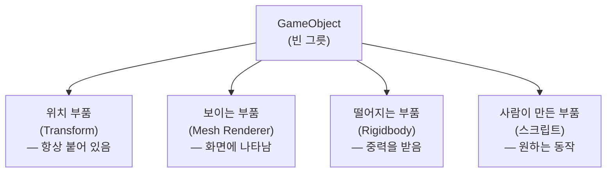
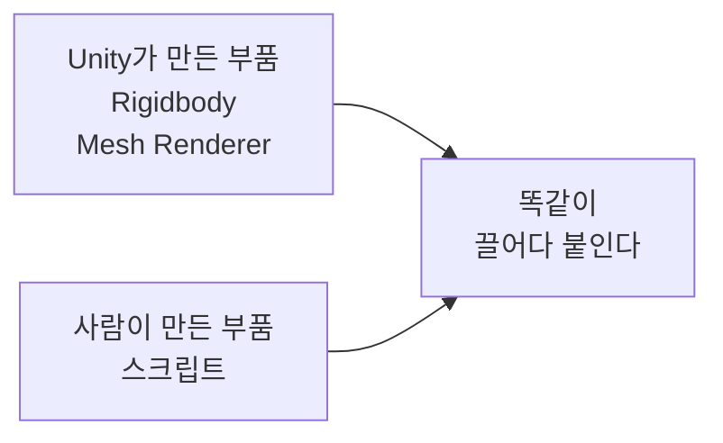
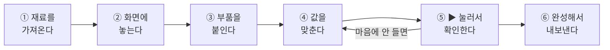
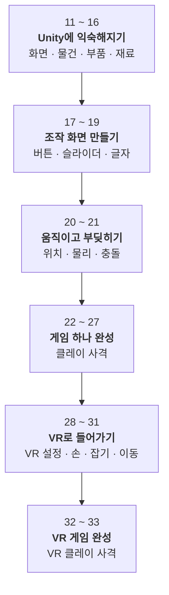

# **11차시. 왜 메타버스에 유니티인가**
---

!!! info "이 자료는 이렇게 보세요"
    - **강의 영상과 함께 보는 자료**입니다. 영상을 따라가시면서 옆에 두고 보시면 됩니다.
    - **오늘은 아무것도 안 하셔도 됩니다.** 보기만 하시면 돼요. **설치는 다음 시간에 같이 합니다.**
    - 이번 과정 내내 **코드는 한 줄도 쓰지 않습니다.** 오늘 이 말만 믿고 가시면 됩니다.
    - 낯선 영어 단어가 나와도 걱정하지 마세요. **필요한 것만 그때그때 알려드립니다.**

---

## **오늘의 목표**

오늘은 만드는 시간이 아니라 **"우리가 앞으로 뭘 하는지" 감을 잡는 시간**입니다.

이번 차시가 끝나면 이렇게 되십니다.

- **앞으로 33차시까지 무엇을 만들게 되는지** 압니다
- **Unity가 물건을 만드는 방식**을 한 문장으로 말할 수 있습니다
- **왜 VR·메타버스를 Unity로 만드는지** 압니다

!!! quote "오늘 이 시간의 목적"
    **불안을 없애는 것**입니다.
    "프로그래밍을 못 하는데 괜찮을까"라는 생각이 드셨다면, 오늘이 그 답을 드리는 시간이에요.

---

## **1. 먼저, 여러분이 만들 것을 보여드립니다**

설명을 듣기 전에 **결과물부터** 보시는 게 빠릅니다.

| 언제 | 무엇을 만드나요 |
| :--- | :--- |
| **22 ~ 27차시** | **클레이 사격 게임** — 날아오는 표적을 총으로 맞히고, 점수가 오르고, 소리가 나는 게임 하나 |
| **32 ~ 33차시** | **VR 클레이 사격** — 같은 게임을, 이번엔 **직접 손을 뻗어 총을 잡고** 쏘는 형태로 |

!!! success "지금 화면에 나오는 게 그겁니다"
    영상에서 지금 보고 계신 게 **여러분이 직접 만드실 결과물**입니다.

    그리고 여기에 들어간 **코드는 여러분이 한 줄도 쓰지 않습니다.**
    다 만들어진 부품을 **끌어다 놓고, 숫자를 바꾸고, 목록에서 고르는 것**으로 만듭니다.

---

## **2. Unity는 어떤 도구인가요?**

**Unity**는 한마디로 **화면에서 움직이는 것들을 만드는 도구**입니다.

'게임 엔진'이라고 부르기도 하는데, 그건 반만 맞는 말이에요. 게임도 만들지만 그 외에도 아주 많은 곳에 쓰입니다.

### **영화 스튜디오에 비유하면**

Unity는 **종합 영화 스튜디오**와 같습니다. 영화를 한 편 찍는다고 생각해보세요.

| 영화를 찍으려면 | Unity에서는 | 무슨 역할인가요 |
| :--- | :--- | :--- |
| 카메라가 필요하죠 | **Camera** | 장면을 어떻게 보여줄지 |
| 조명과 세트가 필요하죠 | **Lighting · Scene** | 화면의 분위기 |
| 배우가 있어야 하죠 | **GameObject** | 화면에 등장하는 것들 |
| 배우에겐 각본이 필요하죠 | **스크립트** | 언제 무엇을 할지 |
| 다 찍으면 색보정을 하죠 | **Post-Processing** | 마지막 색감과 효과 |
| 극장에 걸어야죠 | **Build** | PC·휴대폰·콘솔·웹으로 내보내기 |

!!! tip "여러분이 맡으실 역할"
    이 중에서 **각본(스크립트)을 쓰는 일은 이미 끝나 있습니다.**
    여러분은 **배우에게 각본을 건네주고, 어디에 설지 정하고, 얼마나 빨리 움직일지 조절하는** 일을 하십니다.

    영화로 치면 **감독과 연출**의 자리예요.

### **왜 Unity를 쓰나요?**

이유는 딱 두 가지입니다.

1. **한 프로그램 안에서 다 됩니다.** 만들고, 배치하고, 바로 실행해보는 것까지요.
2. **한 번 만들면 여러 곳으로 나갑니다.** PC, 휴대폰, 게임기, 웹, VR 어디든 갑니다.

---

## **3. Unity로 뭘 만드나요?**

게임만 만드는 도구가 아닙니다. 생각보다 훨씬 넓게 쓰입니다.

| 분야 | 어떻게 쓰이나요 |
| :--- | :--- |
| 🎮 **게임** | 휴대폰·PC·게임기용 게임 |
| 🥽 **VR·AR** | VR 기기용 콘텐츠 — **이번 과정의 목적지** |
| 🚗 **자동차** | 화면에서 차를 돌려보고 색을 바꿔보는 카탈로그 |
| 🏗 **건축** | 아직 안 지어진 건물 안을 미리 걸어다녀 보기 |
| 🎓 **교육·훈련** | 병원의 수술 연습, 안전 교육 프로그램 |
| 🎬 **영상 제작** | 촬영 전에 장면을 미리 만들어보기 |

아마 아시는 것도 있을 거예요. **아래는 전부 Unity로 만들었습니다.**

| 이름 | 어떤 것 |
| :--- | :--- |
| **어몽 어스** | PC·휴대폰·게임기에서 모두 나온 멀티플레이 게임 |
| **포켓몬 GO** | 휴대폰 카메라로 밖에서 즐기는 게임 |
| **비트세이버** | VR 리듬 게임 |
| **할로우 나이트** | 조작감 좋은 2D 게임 |

!!! quote "한 줄 정리"
    **한 번 만들면, 어디든 간다.**
    혼자 만드는 개인 개발자부터 큰 회사까지 Unity를 쓰는 이유입니다.

---

## **4. Unity의 두 얼굴**

Unity에는 얼굴이 두 개 있습니다. **주방과 완성된 요리**라고 생각하시면 쉽습니다.

| 구분 | 무엇인가요 | 누가 보나요 |
| :--- | :--- | :--- |
| **Unity Editor** | 만드는 사람이 쓰는 **작업 화면** | 만드는 사람 |
| **Unity Runtime** | 다 만들어져서 **혼자 돌아가는 상태** | 사용하는 사람 |

여러분이 앞으로 계속 보게 될 화면이 **Editor**입니다.
Editor 위쪽의 **▶ 버튼**을 누르면 실행되는데, 이건 **작업 화면 안에서 미리 돌려보는 것**입니다. 아직 진짜 완성품은 아니에요.

!!! warning "처음 Editor 화면을 보면"
    창이 여러 개라 정신없어 보입니다. **지금은 하나도 모르셔도 괜찮습니다.**
    각 창이 뭘 하는지는 **13차시에서** 하나씩 다룹니다. 오늘은 강사가 클릭하는 것만 봐주세요.

---

## **5. Unity가 물건을 만드는 방식 — 부품 조립**

여기가 오늘 가장 중요한 부분입니다. **오늘 이거 하나만 가져가시면 됩니다.**

Unity는 **레고 조립**과 아주 비슷한 방식으로 물건을 만듭니다.

### **먼저 빈 그릇을 놓습니다**

아무것도 아닌 **빈 그릇**을 하나 놓습니다. 이걸 **GameObject**라고 부릅니다.
말 그대로 비어 있어서, 이 상태로는 화면에 보이지도 않습니다.

### **여기에 부품을 하나씩 끼웁니다**

| 이렇게 하고 싶다면 | 이 부품을 붙입니다 |
| :--- | :--- |
| 어디에 있는지 정하고 싶다 | **위치 부품** (Transform) |
| 화면에 보이게 하고 싶다 | **보이는 부품** (Mesh Renderer) |
| 아래로 떨어지게 하고 싶다 | **떨어지는 부품** (Rigidbody) |
| 부딪히게 하고 싶다 | **부딪히는 부품** (Collider) |
| 내가 원하는 대로 움직이게 하고 싶다 | **사람이 만든 부품** (스크립트) |

!!! success "핵심 한 줄"
    **붙이면 생기고, 빼면 사라집니다.**
    필요한 부품을 갖다 붙이는 것, 이게 Unity의 방식입니다.

!!! note "위치 부품은 뗄 수 없습니다"
    **Transform**이라는 이름의 위치 부품은 **모든 물건에 항상 붙어 있고, 절대 뗄 수 없습니다.**
    어디에 있는지 모르는 물건은 존재할 수가 없기 때문이에요.

### **스크립트도 결국 '부품'입니다**

지금까지 나온 부품들은 **Unity가 미리 만들어둔 것**입니다.
그런데 **사람이 직접 만든 부품**도 붙일 수 있어요. 그게 바로 **스크립트**입니다.

앞에서 영화 비유에 나왔던 **'각본'** 이 이겁니다.

!!! success "겁먹지 마세요"
    스크립트는 어렵고 특별한 게 아니라 **그냥 부품 중 하나**입니다.
    붙이는 방법도 Rigidbody와 **똑같습니다. 끌어다 놓기만 하면 돼요.**

    그리고 이번 과정에서 쓸 스크립트는 **전부 미리 만들어져 있습니다.**
    여러분은 **갖다 쓰기만** 하시면 됩니다.

---

## **6. 만드는 순서 — 앞으로 계속 반복할 흐름**

Unity로 뭘 만들든, 흐름은 **거의 항상 똑같습니다.**

| 단계 | 하는 일 | 배우는 차시 |
| :--- | :--- | :---: |
| ① 재료를 가져온다 | 그림·소리·모양 파일을 프로젝트에 넣기 | 15 |
| ② 화면에 놓는다 | 물건을 만들어 배치하기 | 14 |
| ③ 부품을 붙인다 | 필요한 기능을 갖다 붙이기 | 14 · 16 · 21 |
| ④ 값을 맞춘다 | 숫자·색·체크박스 조절하기 | 13 이후 계속 |
| ⑤ ▶ 눌러 확인한다 | 실행해보고 다시 고치기 | 13 이후 계속 |
| ⑥ 완성해서 내보낸다 | PC·VR 기기에서 돌아가게 만들기 | 28 이후 |

!!! tip "④와 ⑤ 사이를 계속 왔다 갔다 합니다"
    실제 작업 시간의 대부분이 여기예요. **값 조금 바꾸고 → 실행해보고 → 다시 바꾸고.**
    이 반복이 바로 **여러분이 하실 일**입니다. 그리고 이건 코드 없이 됩니다.

---

## **7. 메타버스·VR을 왜 Unity로 만드나요?**

이번 과정의 목적지는 **VR**입니다. 그럼 왜 하필 Unity일까요.

### **VR을 만들려면 원래 이런 게 다 필요합니다**

VR 기기를 쓰고 뭔가를 하려면, 프로그램이 이걸 전부 알아야 합니다.

- 지금 **머리가 어디를 보고 있는지**
- **양손 컨트롤러가 어디에 있는지**
- 버튼을 **눌렀는지 뗐는지**
- 손이 물건에 **닿았는지**
- 물건을 **잡았다면 손을 따라오게** 하기
- 놓으면 **던져지게** 하기

!!! quote "이걸 다 직접 만든다면"
    아주 오래 걸립니다. 그런데 여러분은 **이걸 하나도 안 만드셔도 됩니다.**

### **XR Interaction Toolkit — 미리 만들어둔 부품 묶음**

Unity에는 **XR Interaction Toolkit**이라는 것이 있습니다. 줄여서 **XRI**라고도 불러요.

이름이 길고 어려워 보이는데, 뜻은 단순합니다.
**VR에서 자주 쓰는 동작들을 미리 부품으로 만들어둔 꾸러미**입니다.

| 하고 싶은 것 | XRI에서는 |
| :--- | :--- |
| 물건을 **잡고 싶다** | 그 물건에 **잡히는 부품**을 붙입니다 |
| **던지고 싶다** | 잡는 부품이 **던지는 것까지** 같이 해줍니다 |
| **순간이동하고 싶다** | 바닥에 **이동할 수 있는 부품**을 붙입니다 |
| 손으로 **버튼을 누르고 싶다** | 버튼에 **눌리는 부품**을 붙입니다 |

!!! success "결국 5번에서 배운 그것과 같습니다"
    **붙이면 생기고, 빼면 사라진다.**

    VR도 다르지 않아요. **부품을 갖다 붙이면** 잡을 수 있게 되고, 순간이동할 수 있게 됩니다.
    그래서 **코드 없이도 VR을 만들 수 있는** 겁니다.

!!! note "지금은 이름만 기억하세요"
    XR Interaction Toolkit이 실제로 어떻게 생겼는지는 **28 ~ 31차시**에서 다룹니다.
    오늘은 **"VR에 필요한 건 이미 만들어져 있다"** 이 정도만 아시면 충분합니다.

---

## **8. 33차시까지의 지도**

앞으로 어디로 가는지 한 번에 보여드립니다. **외우실 필요 없습니다.**

| 구간 | 이 구간이 끝나면 |
| :--- | :--- |
| **11 ~ 16** | Unity 화면이 안 무서워지고, 물건을 만들어 다룰 수 있습니다 |
| **17 ~ 19** | 버튼을 눌러 뭔가를 조종하는 화면을 만들 수 있습니다 |
| **20 ~ 21** | 물건이 움직이고, 부딪히면 반응하게 만들 수 있습니다 |
| **22 ~ 27** | **게임 하나가 끝까지 완성됩니다.** 이 과정의 첫 번째 봉우리예요 |
| **28 ~ 31** | VR 안에서 손으로 물건을 잡고 이동할 수 있습니다 |
| **32 ~ 33** | **만든 게임을 VR로 옮깁니다.** 최종 결과물입니다 |

!!! tip "중간에 막히셔도 괜찮습니다"
    각 차시는 **이전 차시 결과물을 이어서** 갑니다.
    그런데 막히셨을 때를 대비해서, **각 차시의 완성 상태 파일**을 강의자료에 같이 드립니다.

    **한 차시 놓쳤다고 그다음을 못 따라가지는 않습니다.**

---

## **9. 정리 문제**

맞히는 게 목적이 아닙니다. **오늘 내용이 머리에 남았는지 확인하는 용도**예요.
먼저 스스로 답을 떠올려보신 뒤에 정답을 펼쳐주세요.

### **문제 1**
Unity에서 물건을 만드는 방식을 **한마디로** 하면?

??? success "정답 보기"
    **빈 그릇에 부품을 붙인다.** (레고 조립)

    - 보이게 하고 싶으면 → **보이는 부품**
    - 떨어뜨리고 싶으면 → **Rigidbody**
    - 원하는 대로 움직이게 하고 싶으면 → **스크립트**

    **붙이면 생기고, 빼면 사라집니다.**

    !!! tip "이 답이 잘 안 떠오르셨다면"
        영상에서 **부품 조립 파트를 한 번 더** 보시는 걸 권합니다.
        여기서 안 잡히면 앞으로가 계속 어려워집니다.

### **문제 2**
**Unity Editor**와 **Unity Runtime**은 어떻게 다른가요?

??? success "정답 보기"
    - **Editor**: 만드는 사람이 쓰는 **작업 화면**
    - **Runtime**: 다 만들어져서 **혼자 돌아가는 상태**

    **주방과 완성된 요리**로 비유했었습니다.

### **문제 3**
VR에서 **물건을 잡는 기능**을 만들려면 무엇을 해야 하나요?

??? success "정답 보기"
    **그 물건에 '잡히는 부품'을 붙이면 됩니다.**

    손이 어디 있는지, 버튼을 눌렀는지, 잡았을 때 어떻게 따라오게 할지 —
    **이건 전부 XR Interaction Toolkit에 이미 만들어져 있습니다.**

    결국 여기서도 답은 같습니다. **부품을 붙인다.**

### **문제 4**
Unity가 **처음 배우는 사람에게 좋은 이유**는 무엇일까요?

??? success "정답 보기"
    - **부품을 끌어다 놓으면 바로 움직입니다.** 코드 없이도 뭔가 만들어져요.
    - **한국어 자료가 아주 많습니다.** 막히면 검색하면 거의 다 나옵니다.
    - **일정 규모 이하에서는 무료**로 쓸 수 있습니다.

    !!! note "요금에 대해"
        정확한 무료 조건과 요금제는 **정책이 자주 바뀝니다.**
        [Unity 공식 요금 페이지](https://unity.com/pricing)에서 현재 기준을 확인해주세요.

### **문제 5**
**"Unity는 성능이 떨어진다"** 는 말을 들어보셨을 수 있습니다. 맞는 말일까요?

??? success "정답 보기"
    **부분적으로는 맞지만, 대부분의 경우 문제가 되지 않습니다.**

    - 게임기에서 **최고 화질·최고 성능**을 뽑아야 하는 대형 게임이라면 다른 도구가 유리할 수 있습니다.
    - 그런데 **세상에 나오는 게임의 대부분은 Unity로 충분합니다.**

    !!! tip "지금 단계에서는"
        성능을 걱정할 단계가 아닙니다. **만드는 게 먼저입니다.**

---

## **10. 앞으로 조심할 것**

!!! warning "흔한 오해"
    - **Unity = 게임만 만드는 도구**라고 생각하기 → 아니라고 했죠?
    - **부품을 무작정 많이 붙이기** → 한 물건에 스무 개씩 붙이면 나중에 본인도 뭐가 뭔지 모릅니다.

!!! tip "좋은 습관 하나"
    **부품 하나는 일 하나만.**
    오늘은 이 습관 하나만 가져가시면 충분합니다.

---

## **11. 오늘의 정리**

!!! success "세 줄 요약"
    1. Unity는 **화면에서 움직이는 것을 만드는 도구**다.
    2. **빈 그릇에 부품을 붙여서** 만든다. — 붙이면 생기고, 빼면 사라진다.
    3. **VR에 필요한 것도 이미 부품으로 만들어져 있다.** 그래서 코드 없이 된다.

오늘은 아무것도 안 만드셨지만, **앞으로 뭘 하는지 아시게 됐습니다.** 그것만으로 오늘은 충분합니다.

---

## **12. 다음 차시 준비**

!!! example "12차시 — 유니티 엔진 소개 및 환경 설정"
    다음 시간에는 **여러분 컴퓨터에 Unity를 설치**합니다. **영상을 따라 같이 하시면 됩니다.**

    설치가 끝나면 **빈 프로젝트를 하나 만드는 것**까지 합니다.
    그때부터 여러분의 작업이 시작돼요.

!!! note "다음 시간 전에 확인해두시면 좋은 것"
    설치에 **시간과 저장 공간이 꽤 필요합니다.** 미리 확인해두시면 다음 시간이 수월합니다.

    - [ ] 컴퓨터에 **저장 공간이 넉넉히 남아 있는지** 확인
    - [ ] **인터넷이 안정적인 곳**에서 들으실 수 있는지 확인
    - [ ] 강의자료 다운로드

    !!! tip "미리 설치하지 않으셔도 됩니다"
        **버전을 맞추는 게 중요해서**, 다음 시간에 같이 하는 편이 안전합니다.
        먼저 깔아두셨다가 버전이 다르면 오히려 다시 하셔야 해요.

---

## **부록 — 오늘 나온 용어 정리**

영어 이름이 낯설게 느껴지실 때 이 표를 보세요.

| 화면에 보이는 이름 | 우리말로 하면 |
| :--- | :--- |
| **GameObject** | 빈 그릇, 화면에 놓는 물건 하나 |
| **Component** | 부품 |
| **Transform** | 위치 부품 (항상 붙어 있음) |
| **Mesh Renderer** | 보이는 부품 |
| **Rigidbody** | 떨어지는 부품 (중력) |
| **Collider** | 부딪히는 부품 |
| **Script** | 사람이 만든 부품, 각본 |
| **Camera** | 어디를 비출지 정하는 것 |
| **Scene** | 물건들이 놓인 한 장면 |
| **Unity Editor** | 만드는 사람이 쓰는 작업 화면 |
| **Unity Runtime** | 다 만들어져서 혼자 돌아가는 상태 |
| **Play (▶)** | 미리 실행해보기 |
| **Build** | 완성해서 내보내기 |
| **XR** | VR·AR을 한꺼번에 부르는 말 |
| **XR Interaction Toolkit** | VR 동작을 미리 만들어둔 부품 꾸러미 |
