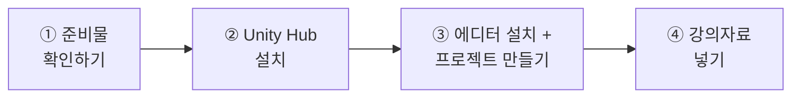
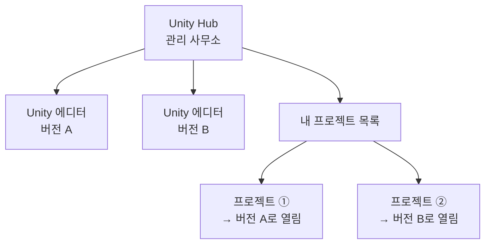
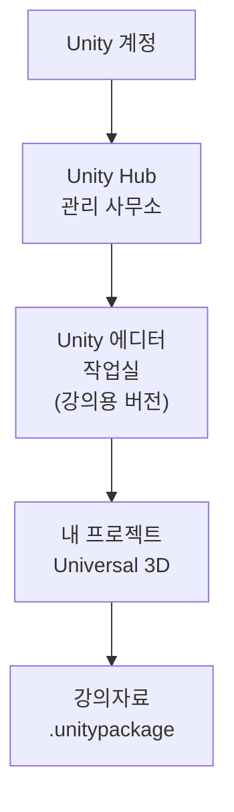

# **12차시. Unity 설치하고 첫 프로젝트 만들기**
---

!!! info "이 자료는 이렇게 보세요"
    - **강의 영상과 함께 보는 자료**입니다. 오늘은 **영상을 따라 같이 설치**하시게 됩니다.
    - 이번 차시에도 **코드를 한 줄도 쓰지 않습니다.** 오늘 하실 일은 **다운로드 · 설치 · 클릭**뿐이에요.
    - **오늘은 기다리는 시간이 깁니다.** 다운로드가 크거든요. **조급해하지 않으셔도 됩니다.**
    - 중간에 영상을 멈추고 기다리셨다가, 끝나면 다시 재생하시면 됩니다.

---

## **오늘의 목표**

이번 차시가 끝나면 여러분 컴퓨터에 이런 상태가 만들어집니다.

- **Unity Hub**가 설치되어 있고
- **강의에서 쓸 버전의 Unity**가 설치되어 있고
- **빈 프로젝트가 하나 만들어져서 열려 있습니다**

!!! quote "11차시와 오늘의 차이"
    11차시에는 **보기만** 하셨습니다.
    오늘부터는 **여러분 컴퓨터에서 직접** 하십니다. 그래서 오늘이 첫 실습 시간이에요.

---

## **1. 뭘 설치하는 건가요?**

설치할 게 **두 개**입니다. 이름이 비슷해서 헷갈리기 쉬운데, 역할이 완전히 다릅니다.

| 이름 | 무엇인가요 | 비유하자면 |
| :--- | :--- | :--- |
| **Unity Hub** | Unity를 **관리하는 프로그램** | 건물 **관리 사무소** |
| **Unity 에디터** | 실제로 **만드는 프로그램** | 실제 **작업실** |

### **왜 두 개나 필요한가요?**

Unity는 **버전이 여러 개**입니다. 그리고 프로젝트마다 쓰는 버전이 다릅니다.

- 작년에 만든 것은 작년 버전으로 열어야 하고
- 올해 시작한 것은 올해 버전으로 열어야 하고요

**Unity Hub**는 이걸 대신 관리해줍니다. 어떤 프로젝트가 어떤 버전인지 기억해뒀다가, **맞는 버전으로 알아서 열어줍니다.**

!!! tip "그래서 순서가 정해져 있습니다"
    **Unity Hub를 먼저 깔고 → 그 안에서 에디터를 깝니다.**
    에디터를 따로 받아서 설치하는 방법도 있지만, **그렇게 하지 마세요.** 나중에 관리가 어려워집니다.

---

## **2. 오늘 걸리는 시간**

미리 알고 계시면 마음이 편합니다.

| 단계 | 대략 |
| :--- | :--- |
| Unity Hub 설치 | 몇 분 |
| **Unity 에디터 설치** | **오래 걸립니다** — 인터넷 속도에 따라 수십 분 |
| 프로젝트 만들기 | 몇 분 (처음 열 때 조금 기다립니다) |

!!! warning "다운로드가 오래 걸립니다"
    Unity 에디터는 **용량이 큽니다.** 인터넷이 느리면 한참 걸릴 수 있어요.

    **이건 여러분이 뭘 잘못해서가 아닙니다.** 원래 그렇습니다.
    다운로드 막대가 멈춘 것처럼 보여도 **그냥 두시면 됩니다.**

---

## **3. 계정이 하나 필요합니다**

Unity를 쓰려면 **Unity 계정**이 필요합니다. 만드는 건 무료예요.

| 궁금하실 만한 것 | 답 |
| :--- | :--- |
| 돈이 드나요? | **개인이 배우는 용도는 무료**입니다 |
| 어디서 만드나요? | Unity Hub 안에서 바로 만들 수 있습니다 |
| 꼭 필요한가요? | 네, 로그인해야 에디터를 쓸 수 있습니다 |

!!! note "요금에 대해"
    무료로 쓸 수 있는 조건과 요금제는 **정책이 자주 바뀝니다.**
    지금 기준은 [Unity 공식 요금 페이지](https://unity.com/pricing)에서 확인해주세요.

    **지금 단계에서는 무료로 충분합니다.** 요금을 걱정하실 단계가 아니에요.

---

## **4. 버전을 꼭 맞춰주세요**

오늘 가장 중요한 이야기입니다.

**강의자료에 적힌 버전**과 **똑같은 버전**을 설치해주세요.

!!! danger "버전이 다르면 생기는 일"
    Unity는 **더 높은 버전으로 프로젝트를 한 번 열면, 그 프로젝트가 높은 버전용으로 바뀝니다.**
    그리고 **되돌릴 수 없습니다.**

    - 강의자료 파일을 더 높은 버전으로 열면 → **다시 원래대로 못 돌립니다**
    - 반대로 더 낮은 버전으로 열면 → **아예 안 열리거나 화면이 깨집니다**

    **강의자료에 적힌 버전 그대로** 설치해주세요. 이것만 지키시면 됩니다.

!!! tip "이미 다른 버전이 깔려 있으시다면"
    **지우지 않으셔도 됩니다.** Unity는 여러 버전을 같이 둘 수 있어요.
    강의용 버전을 **하나 더 추가로** 설치하시면 됩니다.

---

## **5. 실습 — 직접 해보세요**

영상에서 강사가 "멈추세요"라고 하는 지점에서 아래 순서대로 따라 하시면 됩니다.
**오늘은 기다리는 시간이 깁니다.** 조급해하지 마세요.

---

### **실습 ① — 내 컴퓨터가 준비됐는지 확인하기**

!!! abstract "목표"
    설치를 시작하기 전에 **막힐 만한 것을 미리 걷어냅니다.**

1. **저장 공간을 확인합니다.**
   - Windows: `내 PC` 열기 → C 드라이브의 남은 용량 확인
   - Mac: 왼쪽 위 사과 → `이 Mac에 관하여` → 저장 공간
2. 남은 공간이 **강의자료에 안내된 용량보다 넉넉한지** 봅니다.
3. **인터넷이 안정적인 곳**인지 확인합니다. 다운로드가 크니까요.
4. 노트북이라면 **충전기를 꽂아주세요.** 설치 중에 꺼지면 처음부터 다시 해야 합니다.

??? success "확인해보세요"
    - 저장 공간이 넉넉한가요? → 부족하면 **지금** 정리하시는 게 낫습니다. 중간에 멈추면 더 번거로워요.
    - 이 단계는 **아무것도 설치하지 않았습니다.** 확인만 한 거예요. 실패할 게 없습니다.

!!! warning "공간이 부족하시다면"
    다운로드 폴더나 휴지통부터 비워보세요. 그래도 부족하면 **다른 드라이브에 설치**할 수도 있습니다.
    (실습 ③에서 설치 위치를 고르는 곳이 나옵니다.)

---

### **실습 ② — Unity Hub 설치하고 로그인하기**

!!! abstract "목표"
    **관리 사무소**를 먼저 세웁니다.

1. [Unity 공식 다운로드 페이지](https://unity.com/download)에 들어갑니다.
2. **`Download for Windows`** (또는 Mac) 버튼을 눌러 **Unity Hub**를 받습니다.
   → 여기서 받는 건 **Hub**입니다. 에디터가 아니에요.
3. 받은 파일을 실행하고, **기본값 그대로** 계속 눌러 설치합니다.
   → 뭘 고를지 묻는 게 나와도 **바꾸지 마세요.** 기본값이 맞습니다.
4. Unity Hub가 열리면 **로그인 화면**이 나옵니다.
   - 계정이 있으시면 로그인
   - 없으시면 **`Create account`** 로 하나 만드시면 됩니다
5. 로그인이 끝나면 **라이선스를 받으라는 안내**가 나올 수 있습니다.
   → **개인용(Personal)** 을 고르시면 됩니다.

??? success "확인해보세요"
    - Unity Hub 창이 열렸고, 왼쪽에 **`Projects` · `Installs`** 같은 메뉴가 보이나요?
    - 아직 **아무 프로젝트도 없는 게 정상**입니다. 텅 비어 있어야 맞아요.
    - 여기까지는 **작업실이 아니라 관리 사무소만** 세운 겁니다.

!!! warning "잘 안 되신다면"
    - 로그인이 안 된다 → 가입할 때 받은 **인증 메일을 확인**해주세요. 메일 인증 전에는 로그인이 막힙니다.
    - 라이선스 안내가 안 뜬다 → 나중에 뜹니다. **그냥 넘어가셔도 됩니다.**

---

### **실습 ③ — 에디터 설치하고 프로젝트 만들기**

!!! abstract "목표"
    **작업실을 세우고, 첫 프로젝트를 만듭니다.** 오늘의 결과물입니다.

#### **에디터 설치**

1. Unity Hub 왼쪽에서 **`Installs`** 를 클릭합니다.
2. 오른쪽 위 **`Install Editor`** 를 클릭합니다.
3. 버전 목록이 나옵니다. **강의자료에 적힌 버전**을 찾아 고릅니다.
   → 목록에 없으면 **`Archive`** 나 **`Other versions`** 쪽을 눌러 찾아보세요.
4. **같이 설치할 것(모듈)** 을 고르는 화면이 나옵니다.
   - [ ] **한국어 문서(Documentation)** — 안 고르셔도 됩니다
   - [x] **Android Build Support** — **꼭 체크해주세요.** VR 기기를 쓰려면 필요합니다
   - [x] 그 아래 **`Android SDK & NDK Tools`**, **`OpenJDK`** — 같이 체크
5. **`Install`** 을 누릅니다. → **여기서 오래 걸립니다.**
   **영상을 멈추고 기다려주세요.**

#### **프로젝트 만들기**

6. 설치가 끝나면 왼쪽의 **`Projects`** → **`New project`** 를 클릭합니다.
7. 위쪽에서 **에디터 버전이 방금 설치한 버전인지** 확인합니다.
8. 템플릿 목록에서 **`Universal 3D`** 를 고릅니다.
   → 이름이 조금 다를 수 있습니다. **`3D`** 와 **`Universal`** 이 들어간 것을 고르시면 됩니다.
9. **`Project name`** 에 이름을 적습니다. 예: `MyFirstProject`
   → **한글과 띄어쓰기는 피해주세요.** 나중에 문제가 생길 수 있습니다.
10. **`Location`** 에서 저장할 위치를 정하고, **`Create project`** 를 누릅니다.
11. 프로젝트가 열립니다. → **처음 열 때 시간이 좀 걸립니다.** 기다려주세요.

??? success "확인해보세요"
    - **복잡한 화면이 하나 떴나요?** → 성공입니다. 그게 **Unity 에디터**예요.
    - 11차시에 제가 보여드렸던 그 화면이 지금 **여러분 컴퓨터에** 떠 있는 겁니다.
    - **지금은 하나도 몰라도 됩니다.** 이 화면이 뭔지는 **13차시에서** 하나씩 다룹니다.
    - 가운데에 회색 바닥과 파란 하늘 비슷한 게 보이면 정상입니다.

!!! warning "잘 안 되신다면"
    - 목록에 강의용 버전이 없다 → **`Archive`** 또는 **`Other versions`** 를 눌러주세요. 최신 버전만 먼저 보여줍니다.
    - 설치가 실패했다 → **저장 공간이 부족한 경우**가 대부분입니다. 공간을 확보하고 다시 `Install` 을 눌러주세요.
    - 프로젝트가 열렸는데 화면이 새까맣다 → 조금 더 기다려보세요. **처음 열 때는 준비 작업이 있습니다.**

---

### **실습 ④ — 강의자료 넣고 화면 정리하기 (선택)**

!!! abstract "목표"
    앞으로 쓸 **강의자료를 프로젝트에 넣어둡니다.**

1. 강의자료에서 받은 **`.unitypackage`** 파일을 찾습니다.
2. 그 파일을 **Unity 에디터 화면 위로 그냥 끌어다 놓습니다.**
   → 또는 위쪽 메뉴 `Assets` → `Import Package` → `Custom Package`
3. **뭘 가져올지 목록이 뜹니다.** 전부 체크된 상태 그대로 **`Import`** 를 누릅니다.
4. 위쪽 메뉴 **`Window`** → **`Layouts`** → **`Default`** 를 눌러 화면 배치를 기본으로 맞춰둡니다.
   → 앞으로 강사 화면과 똑같이 보여서 따라 하기 편해집니다.
5. **`Ctrl + S`** 로 저장합니다.

??? success "확인해보세요"
    - 아래쪽 **`Project`** 창에 새 폴더가 생겼나요? → 강의자료가 들어온 겁니다.
    - 폴더 안에 **부품 파일들과 한글 글꼴**이 들어 있습니다.
      → 이 글꼴이 있어야 나중에 버튼에 **한글을 쓸 수 있습니다.** 지금은 확인만 하세요.
    - 화면 배치가 강사 화면과 비슷해졌나요?
    - 여기까지 하셨으면 **다음 시간 준비가 끝났습니다.**

!!! warning "잘 안 되신다면"
    - 끌어다 놓았는데 아무 일도 없다 → **에디터 화면 안쪽**(가운데나 아래쪽 Project 창)에 놓으셔야 합니다.
    - 창을 잘못 건드려서 화면이 엉망이 됐다 → **`Window` → `Layouts` → `Default`** 로 언제든 되돌릴 수 있습니다.

---

## **6. 오늘 배운 것을 그림으로**

!!! success "이 순서만 기억하시면 됩니다"
    **계정 → Hub → 에디터 → 프로젝트 → 강의자료.**

    앞으로 새 프로젝트를 만드실 때도 **Hub에서 `New project`** 하나만 누르시면 됩니다.
    설치는 오늘 한 번으로 끝이에요.

---

## **7. 정리 문제**

맞히는 게 목적이 아닙니다. **오늘 내용이 머리에 남았는지 확인하는 용도**예요.

### **문제 1**
**Unity Hub**와 **Unity 에디터**는 어떻게 다른가요?

??? success "정답 보기"
    - **Unity Hub**: Unity를 **관리하는 프로그램**. 관리 사무소.
    - **Unity 에디터**: 실제로 **만드는 프로그램**. 작업실.

    Hub는 **어떤 프로젝트가 어떤 버전인지 기억해뒀다가 맞는 버전으로 열어줍니다.**

### **문제 2**
왜 **버전을 강의자료와 똑같이** 맞춰야 하나요?

??? success "정답 보기"
    **더 높은 버전으로 한 번 열면 되돌릴 수 없기 때문**입니다.

    - 높은 버전으로 열면 → 프로젝트가 그 버전용으로 바뀌고 **되돌아가지 않습니다**
    - 낮은 버전으로 열면 → **아예 안 열리거나 화면이 깨집니다**

    !!! tip "다른 버전이 이미 깔려 있어도 괜찮습니다"
        지울 필요 없습니다. **여러 버전을 같이 둘 수 있어요.**

### **문제 3**
에디터를 설치할 때 **Android Build Support**를 체크한 이유는 무엇일까요?

??? success "정답 보기"
    **나중에 VR 기기에서 돌리려면 필요하기 때문**입니다.

    우리가 쓸 VR 기기는 Android를 바탕으로 동작합니다.
    28차시 이후에 필요한데, **그때 다시 설치하려면 또 한참 기다려야 해서** 미리 넣어둡니다.

### **문제 4**
프로젝트 이름에 **한글과 띄어쓰기를 피하라**고 한 이유는?

??? success "정답 보기"
    **나중에 문제가 생길 수 있기 때문**입니다.

    특히 **완성해서 내보낼 때(Build)** 이름에 한글이 있으면 실패하는 경우가 있습니다.
    지금 영어로 지어두면 나중에 겪지 않아도 될 일이에요.

### **문제 5**
설치 중에 **다운로드 막대가 한참 멈춰 있는 것처럼 보입니다.** 어떻게 해야 할까요?

??? success "정답 보기"
    **그냥 두시면 됩니다.**

    Unity 에디터는 용량이 커서 원래 오래 걸립니다.
    **취소하고 다시 시작하는 게 가장 나쁜 선택**이에요. 처음부터 다시 받아야 합니다.

---

## **8. 앞으로 조심할 것**

!!! warning "흔한 실수"
    - **버전을 아무거나 설치하기** → 오늘 가장 중요한 이야기였습니다.
    - **에디터를 Hub 없이 따로 설치하기** → 나중에 버전 관리가 어려워집니다.
    - **설치 중에 취소하기** → 처음부터 다시 받아야 합니다.
    - **프로젝트 이름에 한글 쓰기** → 나중에 내보낼 때 막힐 수 있습니다.

!!! tip "좋은 습관 하나"
    **프로젝트는 한곳에 모아두세요.**
    바탕화면에 하나, 다운로드에 하나 흩어져 있으면 나중에 본인도 못 찾습니다.

---

## **9. 오늘의 정리**

!!! success "세 줄 요약"
    1. **Hub는 관리 사무소, 에디터는 작업실**이다. Hub를 먼저 깔고 그 안에서 에디터를 깐다.
    2. **버전은 강의자료와 똑같이** 맞춘다. 높은 버전으로 열면 되돌릴 수 없다.
    3. 설치는 **오늘 한 번**이면 끝이다. 앞으로는 `New project` 만 누르면 된다.

오늘 여러분은 **작업 환경을 직접 만드셨습니다.** 화면 앞에 앉으셨으니 이제 시작이에요. 충분히 잘하셨습니다.

---

## **10. 다음 차시 준비**

!!! example "13차시 — Unity 작업실 둘러보기"
    오늘 프로젝트를 여셨을 때 **복잡한 화면**이 떴죠. "지금은 몰라도 된다"고 넘어갔던 그 화면이요.

    다음 시간에 **그 창들을 하나씩** 다룹니다.
    어디에 뭐가 있는지 알고 나면, 그 화면이 더 이상 안 무서워집니다.

!!! note "미리 해두시면 좋은 것"
    - [ ] 오늘 만든 프로젝트를 **`Ctrl + S`** 로 저장해두기
    - [ ] `Window` → `Layouts` → `Default` 로 **화면 배치 정리해두기**
    - [ ] 강의자료 `.unitypackage` 가 **들어와 있는지** 확인 (실습 ④를 건너뛰셨다면 지금 해두세요)

    !!! tip "다음 시간부터는 기다릴 일이 없습니다"
        오늘이 유일하게 **다운로드로 시간을 쓰는 차시**예요. 다음 시간부터는 계속 만지십니다.

---

## **부록 — 오늘 나온 용어 정리**

| 화면에 보이는 이름 | 우리말로 하면 |
| :--- | :--- |
| **Unity Hub** | 관리 사무소 — 버전과 프로젝트를 관리 |
| **Unity Editor** | 작업실 — 실제로 만드는 화면 |
| **Installs** | 설치된 에디터 목록 |
| **Install Editor** | 에디터 설치하기 |
| **Projects** | 내 프로젝트 목록 |
| **New project** | 새 프로젝트 만들기 |
| **Template** | 프로젝트 시작 틀 |
| **Universal 3D** | 이번 강의에서 쓸 시작 틀 |
| **Module** | 에디터에 같이 설치하는 추가 기능 |
| **Android Build Support** | VR 기기용으로 내보낼 때 필요한 것 |
| **Personal** | 개인용 (무료) |
| **.unitypackage** | 강의자료 꾸러미 파일 |
| **Import Package** | 꾸러미 가져오기 |
| **Layouts → Default** | 화면 배치 원래대로 |
| **Ctrl + S** | 저장 |
