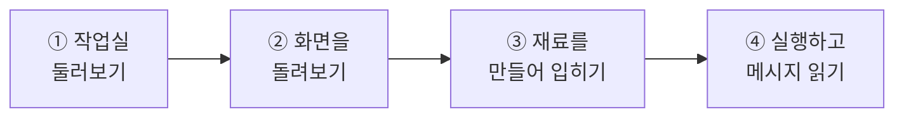
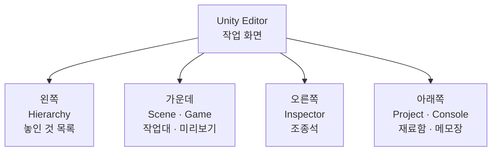
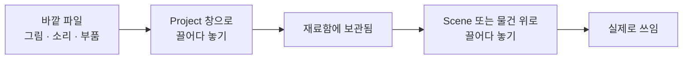
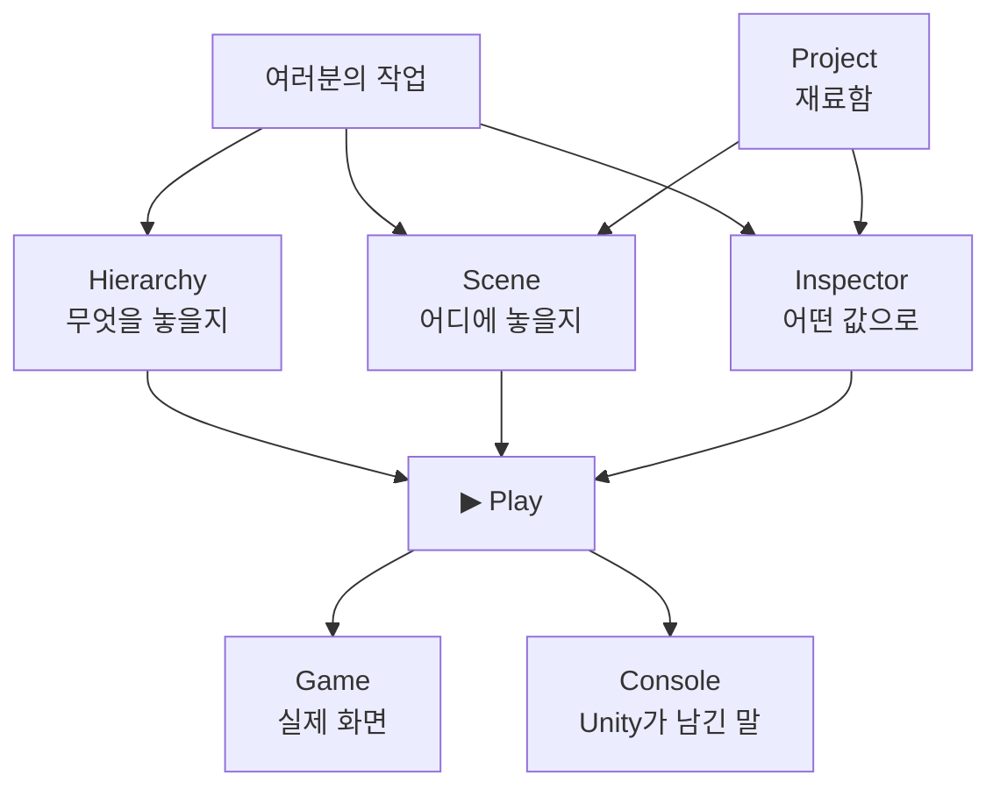

# **13차시. Unity 작업실 둘러보기**
---

> ℹ️ **이 자료는 이렇게 보세요**
>
> - **강의 영상과 함께 보는 자료**입니다. 영상을 따라가시면서 옆에 두고 보시면 됩니다.
> - 이번 차시에도 **코드를 한 줄도 쓰지 않습니다.** 앞 차시들과 똑같아요.
> - 오늘 하실 일은 **창 열고 닫기, 마우스로 화면 돌려보기, 색 고르기** 정도가 전부입니다.
> - 11차시에서 "지금은 몰라도 됩니다"라고 넘어갔던 **그 복잡한 화면**을, 오늘 하나씩 뜯어봅니다.

---

## **오늘의 목표**

이번 차시가 끝나면 여러분은 이렇게 되십니다.

- 화면에 있는 **창 여섯 개가 각각 무슨 일을 하는지** 압니다
- 창을 실수로 닫아도 **혼자 되찾을 수 있습니다**
- **Scene 창과 Game 창이 왜 다른지** 설명할 수 있습니다
- 빨간 글씨가 떠도 **당황하지 않습니다**



> 💬 **지금까지와 오늘의 차이**
>
> 11차시에는 **보기만** 하셨고, 12차시에는 **설치만** 하셨습니다.
> 오늘부터는 **직접 찾아서 만지시게** 됩니다. 그래서 오늘이 조금 더 중요해요.

---

## **1. Unity Editor는 '만능 작업실'입니다**

11차시에 Unity에는 얼굴이 두 개라고 했었죠. **Editor**와 **Runtime**이요.
오늘 다루는 건 그중 **Editor**, 여러분이 앞으로 계속 보게 될 **작업 화면**입니다.

이 화면을 **공방(작업실)** 이라고 생각해보세요. 목공소든 부엌이든 상관없습니다.

| 작업실에 있는 것 | Unity에서는 | 무슨 역할인가요 |
| :--- | :--- | :--- |
| 작업대 | **Scene** | 직접 만지고 조립하는 공간 |
| 미리보기 거울 | **Game** | 손님 눈에 어떻게 보이는지 |
| 재료함 | **Project** | 그림·소리·부품 파일 보관 |
| 지금 놓인 것들의 목록 | **Hierarchy** | 작업대 위에 뭐가 있는지 |
| 상세 설정판 | **Inspector** | 고른 물건의 값 조정 |
| 메모장 | **Console** | 작업 중 뜬 메시지 기록 |

> 💡 **이름을 다 외우실 필요 없습니다**
>
> 지금 외우려고 하지 마세요. **오늘 실습에서 손으로 만지다 보면 자연스럽게 외워집니다.**
> 이 표는 나중에 헷갈릴 때 돌아와서 보는 용도예요.

---

## **2. 창 여섯 개, 하나씩 보겠습니다**



> 📝 **위치는 바뀔 수 있습니다**
>
> 위 그림은 **처음 설치했을 때의 기본 배치**입니다.
> 창은 얼마든지 옮길 수 있어서 사람마다 다르게 생겼어요. **위치보다 이름을 기억해주세요.**

### **2.1 🎬 Scene — 작업대**

물건을 **직접 놓고 옮기는 공간**입니다. 오늘 가장 오래 보실 창이에요.

- 마우스로 물건을 **끌어서 옮기고, 돌리고, 키웁니다**
- 카메라가 안 비추는 곳까지 **전부 보입니다** — 만드는 사람만 볼 수 있는 시점이에요

### **2.2 🎮 Game — 미리보기 거울**

**실제 사용자가 보게 될 화면**입니다.

- 화면에 있는 **Camera가 비추는 곳만** 보입니다
- ▶ 를 누르면 여기서 실제로 돌아갑니다

> ⚠️ **여기가 13차시 최대 혼동 지점입니다**
>
> **Scene에서 아무리 화면을 돌려도 Game 화면은 꿈쩍도 하지 않습니다.**
>
> - Scene 창을 돌리는 건 → **여러분이 목을 돌려서 작업대를 들여다보는 것**
> - Game 창이 바뀌려면 → **카메라 자체를 옮겨야** 합니다
>
> 이건 말로 들으면 안 와닿습니다. **실습 ②에서 직접 해보시면 3초 만에 이해되실 거예요.**

### **2.3 📋 Hierarchy — 지금 놓인 것들의 목록**

작업대 위에 **뭐가 올라와 있는지** 이름으로 보여주는 목록입니다. 왼쪽에 있어요.

- 여기서 **우클릭 → 새 물건을 만듭니다**
- 물건을 **다른 물건 위로 끌어다 놓으면 한 덩어리처럼 묶입니다** — 이건 **14차시**에서 제대로 다룹니다

### **2.4 📁 Project — 재료함**

프로젝트에 들어 있는 **모든 파일**이 여기 있습니다. 그림, 소리, 색깔 재료, 부품(스크립트) 전부요.

| Hierarchy와 헷갈리신다면 | |
| :--- | :--- |
| **Project** | **재료함**에 보관 중인 것 — 아직 화면에 안 나옴 |
| **Hierarchy** | **작업대 위에 실제로 올려둔 것** — 화면에 나옴 |

재료함에서 꺼내 작업대에 올리는 것, 그게 **끌어다 놓기**입니다.

### **2.5 🔧 Inspector — 조종석**

11차시에 강사가 계속 보여드렸던 그 창입니다. 오른쪽에 있어요.

- **고른 물건에 어떤 부품이 붙어 있는지** 보여주고
- **그 부품의 값을 바꾸게** 해줍니다

### **2.6 📢 Console — 메모장**

Unity가 여러분에게 **말을 거는 곳**입니다. 아래쪽에 있어요.

| 색깔 | 뜻 | 어떻게 하나요 |
| :--- | :--- | :--- |
| ⬜ 하얀 줄 | 그냥 알림 | 읽고 넘기시면 됩니다 |
| 🟨 노란 줄 | 경고 | 당장 문제는 없지만 봐두면 좋습니다 |
| 🟥 빨간 줄 | 오류 | **여기부터는 읽어보셔야 합니다** |

> ✅ **빨간 줄은 혼내는 게 아닙니다**
>
> 처음 빨간 글씨를 보면 뭔가 크게 잘못한 것 같아 덜컥합니다. 그런데요,
> **빨간 줄은 "여기가 문제예요"라고 Unity가 알려주는 것**입니다. 알려주는 게 고마운 일이죠.
>
> 아무 말 없이 조용히 안 되는 것보다 **백 배 낫습니다.**

---

## **3. 창을 잃어버려도 괜찮습니다**

작업을 하다 보면 **창을 실수로 닫거나, 이상한 데로 옮겨버리는 일**이 반드시 생깁니다.
이건 초보만 겪는 일이 아니에요. 되찾는 방법만 알면 됩니다.

| 이런 상황이면 | 이렇게 하세요 |
| :--- | :--- |
| 창 하나가 사라졌다 | 위쪽 **`Window`** 메뉴 → **`General`** → 없어진 창 이름 클릭 |
| 배치가 엉망이 됐다 | **`Window`** → **`Layouts`** → **`Default`** |
| 방금 한 걸 되돌리고 싶다 | **`Ctrl + Z`** |

> ✅ **그래서 마음껏 만지셔도 됩니다**
>
> **되돌리는 방법이 있으면, 그건 실수가 아니라 시도입니다.**
> 오늘 실습에서는 일부러 한 번 흐트러뜨려 보고, 되돌려 보기까지 해봅니다.

---

## **4. ▶ Play — 실행해보기**

위쪽 가운데의 **▶ 버튼**을 누르면 만든 것이 실제로 움직입니다. 화면은 자동으로 **Game 창**으로 넘어가요.

- 다시 **▶** 를 누르면 멈추고 원래 상태로 돌아옵니다
- 옆의 **⏸** 은 잠깐 멈춤, **⏭** 은 아주 조금씩 진행시키기입니다

> 🚨 **꼭 알아두세요 — 값이 사라지는 이유**
>
> **▶ 를 누른 상태에서 바꾼 값은, ▶ 를 끄면 전부 사라집니다.**
>
> 이게 Unity를 처음 쓰는 분들이 **가장 많이 당황하는 지점**입니다.
> 한참 공들여 값을 맞춰놨는데 ▶ 를 끄니까 원래대로 돌아가 있거든요.
>
> - 실행 중에 **이것저것 시험해보라고** 일부러 그렇게 만들어져 있습니다
> - **값을 남기고 싶으시면 ▶ 를 끈 상태에서 바꿔주세요**

> 💡 **지금 Play 중인지 헷갈릴 때**
>
> ▶ 를 누르면 **화면 전체가 살짝 어두워지거나 색이 바뀝니다.** 그게 "지금 실행 중"이라는 표시예요.

---

## **5. 재료를 넣고 꺼내 쓰는 흐름**

밖에서 만든 그림이나 소리를 Unity에 가져오는 방법은 단순합니다. **끌어다 놓으면 끝**입니다.



Unity 안에서 **직접 만드는 재료**도 있습니다. 대표적인 게 **색깔·질감 재료(Material)** 예요.
실습 ③에서 이걸 만들어서 물건에 입혀봅니다.

> 📝 **파일을 넣으면 짝꿍 파일이 하나 더 생깁니다**
>
> 그림 파일 하나를 넣으면 옆에 **똑같은 이름의 파일이 하나 더** 생긴 것처럼 보일 때가 있습니다.
> Unity가 관리용으로 만든 것이니 **지우지 말고 그냥 두시면 됩니다.** 신경 안 쓰셔도 돼요.

---

## **6. 오늘 사용할 부품 — ConsoleTester**

Console 창을 직접 체험해보기 위해, 강의자료에 들어 있는 **`ConsoleTester`** 라는 부품을 씁니다.
**Console에 메시지를 찍어보는 부품**이에요.

### **6.1 조절할 수 있는 값**

| Inspector 항목 | 무슨 뜻인가요 | 어떻게 바꾸나요 |
| :--- | :--- | :--- |
| **Message** | Console에 찍을 내용 | 글자를 직접 입력 |
| **Log Type** | 어떤 색으로 찍을지 | 목록에서 고르기 (**Info** 하양 / **Warning** 노랑 / **Error** 빨강) |
| **Send On Start** | ▶ 를 누를 때 자동으로 한 번 찍을지 | 체크 켜고 끄기 |

### **6.2 나중에 버튼에 연결할 수 있는 동작**

| 동작 이름 | 무슨 일을 하나요 |
| :--- | :--- |
| **SendLog** | 위에 적어둔 내용을 골라둔 색으로 Console에 찍기 |

> 📝 **오늘은 버튼을 만들지 않습니다**
>
> **`Send On Start`** 에 체크만 해두면 ▶ 를 누를 때 알아서 찍힙니다. 오늘은 그걸로 충분해요.
>
> 버튼을 만들어서 **원할 때 눌러 실행하는 방법**은 **다음 차시(14차시) 마지막에 한 번 맛보고**,
> 화면을 제대로 다루는 **17~19차시**에서 본격적으로 배웁니다.
>
> 지금은 **"동작에는 이름이 있고, 나중에 버튼에 걸 수 있다"** 정도만 봐두시면 됩니다.

---

## **7. 실습 — 직접 해보세요**

영상에서 강사가 "멈추세요"라고 하는 지점에서 아래 순서대로 따라 하시면 됩니다.
**안 되셔도 괜찮습니다.** 몇 번 다시 보셔도 되고, 순서를 그대로 따라만 하셔도 충분합니다.

---

### **실습 ① — 작업실 둘러보고, 일부러 어질러보기**

> 🎯 **목표**
>
> 창 여섯 개의 위치를 눈으로 확인하고, **망가뜨렸다가 되돌리는 것**까지 해봅니다.

1. 화면에서 창 이름표(탭)를 하나씩 찾아 **클릭**해봅니다.
   → `Scene` · `Game` · `Hierarchy` · `Project` · `Inspector` · `Console`
   (`Console`이 안 보이면 아래쪽 `Project` 옆을 확인해보세요.)
2. **`Console` 탭을 마우스 오른쪽 클릭 → `Close Tab`** 으로 닫아버립니다.
   → 창이 사라집니다. **일부러 그런 거니 괜찮습니다.**
3. 위쪽 **`Window`** → **`General`** → **`Console`** 클릭
   → **되살아납니다.**
4. 이번엔 창 이름표 하나를 **아무 데나 끌어다 놓아** 배치를 흐트러뜨립니다.
5. **`Window`** → **`Layouts`** → **`Default`** 클릭
   → **처음 배치로 한 번에 돌아옵니다.**

<details>
<summary>✅ 확인해보세요</summary>

- 창을 닫았다가 되살리셨나요? → 이제 **창이 없어져도 당황하실 일이 없습니다.**
- 배치를 흐트러뜨렸다가 되돌리셨나요? → **`Layouts` → `Default`**, 이거 하나만 기억하시면 됩니다.
- 앞으로 화면이 이상해지면 **"아 그거 누르면 되지"** 하시면 됩니다.

</details>

> ⚠️ **잘 안 되신다면**
>
> - `Window` 메뉴에 `General`이 안 보인다 → 메뉴가 길어서 그렇습니다. **천천히 아래로 내려가며** 찾아주세요.
> - 창이 화면 밖으로 나가서 안 보인다 → **`Layouts` → `Default`** 로 한 번에 정리됩니다.

---

### **실습 ② — 화면을 돌려보고, Scene과 Game의 차이 느끼기**

> 🎯 **목표**
>
> Scene 창에서 시점을 자유롭게 움직여보고, **Game 창은 왜 안 따라오는지** 몸으로 확인합니다.

#### **먼저 물건을 하나 놓습니다**

1. **Hierarchy** 빈 곳 우클릭 → **`3D Object`** → **`Cube`**
   → 화면 가운데에 네모가 생깁니다.

#### **Scene 창에서 시점 움직이기**

2. **Scene** 탭을 클릭하고, 아래 세 가지를 해봅니다.

| 이렇게 하면 | 이렇게 됩니다 |
| :--- | :--- |
| 마우스 **우클릭한 채로 드래그** | 고개를 돌리듯 **시점이 회전**합니다 |
| 마우스 **휠 굴리기** | 가까워지고 멀어집니다 |
| 큐브 클릭 후 **`F` 키** | 큐브가 **화면 정중앙**으로 옵니다 |

> 💡 **길을 잃으셨다면**
>
> 한참 돌리다 보면 **큐브가 어디 갔는지 모르게** 됩니다. 아주 흔한 일이에요.
> **Hierarchy에서 큐브를 클릭하고 `F` 키**를 누르면 바로 앞으로 데려다줍니다.

#### **이제 Game 창을 봅니다**

3. **Game** 탭을 클릭합니다. → 아까와 **다른 각도**의 화면이 보입니다.
4. 다시 **Scene** 탭으로 가서 시점을 마구 돌려봅니다.
5. 또 **Game** 탭으로 돌아옵니다. → **하나도 안 바뀌었습니다.**
6. **Hierarchy에서 `Main Camera`** 를 클릭하고, **Inspector의 `Position` 숫자**를 바꿔봅니다.
   → 이번엔 **Game 화면이 바뀝니다.**

<details>
<summary>✅ 확인해보세요</summary>

- Scene을 아무리 돌려도 Game은 안 바뀌었죠?
  → **Scene은 여러분의 눈, Game은 카메라의 눈**입니다. 서로 다른 눈이에요.
- 카메라를 옮기니까 Game이 바뀌었나요?
  → **Game 화면을 바꾸고 싶으면 카메라를 옮겨야 한다.** 이게 오늘 챙겨가실 문장입니다.

</details>

> ⚠️ **잘 안 되신다면**
>
> - Game 화면이 새까맣다 → 카메라가 엉뚱한 데를 보고 있는 겁니다. `Main Camera`의 `Position`을 `0, 1, -10` 으로 되돌려보세요.
> - 시점이 너무 멀리 가버렸다 → 큐브 클릭 후 **`F` 키**입니다.

---

### **실습 ③ — 재료를 만들어서 입혀보기**

> 🎯 **목표**
>
> **Project(재료함)에서 색깔 재료를 만들어, Scene의 물건에 입힙니다.**
> 재료함 → 작업대 → 조종석, **세 창을 한 번에 오가보는 실습**입니다.

1. **Project** 창의 `Assets` 폴더에서 **우클릭 → `Create` → `Folder`**
   → 이름을 **`Materials`** 로 바꿉니다. (재료를 모아둘 서랍입니다.)
2. 만든 폴더를 **더블클릭**해서 들어간 뒤, 안에서 **우클릭 → `Create` → `Material`**
   → 이름을 **`RedMat`** 으로 바꿉니다.
3. 만든 `RedMat`을 **한 번 클릭**하고 **Inspector**를 봅니다.
4. **`Base Map`** 이라고 적힌 줄의 **색깔 네모**를 클릭 → **빨간색**을 고릅니다.
   (버전에 따라 `Albedo` 라고 적혀 있을 수도 있습니다. **같은 자리예요.**)
5. **`RedMat`을 Scene의 큐브 위로 끌어다 놓습니다.**
   → **큐브가 빨개집니다.**

<details>
<summary>✅ 확인해보세요</summary>

- 색을 바꾸려고 코드를 연 적이 있나요? → **없습니다. 색만 골라서 끌어다 놓았습니다.**
- 방금 하신 게 **재료함(Project) → 작업대(Scene)** 흐름 그대로입니다.
- `RedMat`의 색을 다른 색으로 다시 바꿔보세요. → **큐브 색도 같이 바뀝니다.**
  재료 하나를 여러 물건에 입혀두면, **재료만 고쳐서 한꺼번에** 바꿀 수 있다는 뜻이에요.

</details>

> ⚠️ **잘 안 되신다면**
>
> - 끌어다 놓았는데 색이 안 바뀐다 → **큐브 위에 정확히 올려놓고** 손을 떼셨는지 확인해주세요. 빈 공간에 놓으면 아무 일도 일어나지 않습니다.
> - 색이 이상하게 어둡다 → 색 고르는 창에서 **밝기 막대(오른쪽 세로 막대)가 아래로 내려가 있지 않은지** 확인해주세요.

---

### **실습 ④ — 실행하고, Console에서 메시지 읽기**

> 🎯 **목표**
>
> **Console에 메시지를 찍어보고, 빨간 줄도 일부러 내봅니다.**

1. 강의자료의 **`ConsoleTester`** 를 **Hierarchy의 큐브 위로 끌어다 놓습니다.**
2. Inspector에서 **`Message`** 칸에 아무 말이나 입력합니다. 예: `안녕하세요`
3. **`Send On Start`** 에 **체크가 되어 있는지** 확인합니다.
4. **`Console` 탭을 클릭해서 열어둡니다.**
5. **▶** 를 누릅니다.
   → **Console에 하얀 줄로 메시지가 뜹니다.**
6. ▶ 를 끄고, **`Log Type`** 을 **`Warning`** 으로 바꾼 뒤 다시 ▶
   → **노란 줄**로 뜹니다.
7. 한 번 더, **`Error`** 로 바꾸고 ▶
   → **빨간 줄**로 뜹니다.
8. Console 왼쪽 위의 **`Clear`** 를 눌러 싹 지웁니다.

<details>
<summary>✅ 확인해보세요</summary>

- 빨간 줄을 **일부러** 내보셨나요? 무섭지 않죠?
  → 앞으로 빨간 줄이 떠도 **"아 뭔가 알려주는구나"** 하고 **읽어보시면** 됩니다.
- 빨간 줄을 **더블클릭**하면 원인이 있는 곳으로 데려가 줍니다. (지금은 안 누르셔도 됩니다.)
- `Message` 를 바꿔가며 여러 번 찍어보셔도 좋습니다. **마음껏 해보세요.**
- 오늘도 **코드는 한 줄도 쓰지 않았습니다.** 끌어다 놓고, 고르고, 눌렀을 뿐입니다.

</details>

> ⚠️ **잘 안 되신다면**
>
> - Console에 아무것도 안 뜬다 → **`Send On Start` 체크가 꺼져 있는 경우**가 대부분입니다.
> - 색이 안 바뀐다 → **▶ 를 끈 상태에서** `Log Type` 을 바꾸셔야 합니다. ▶ 중에 바꾼 값은 사라집니다.
> - 메시지가 계속 쌓인다 → 정상입니다. **`Clear`** 로 지우시면 됩니다.

---

## **8. 코드는 딱 한 번만 보고 갑니다**

**외우실 필요도, 치실 필요도 없습니다.** 그냥 구경만 하세요.

방금 Inspector에서 만졌던 칸들이, 코드에서는 이렇게 생겼습니다.

```
Message 칸        ──→  [ Message       : 안녕하세요  ]
Log Type 칸       ──→  [ Log Type      : Error   ▼ ]
Send On Start 칸  ──→  [ ☑ Send On Start          ]
SendLog 동작      ──→  [ 나중에 버튼에 걸 이름       ]
```

> ✅ **결론은 하나입니다**
>
> **Inspector에 보이는 모든 칸은, 코드 어딘가에 대응하는 줄이 하나씩 있습니다.**
> 프로그래머가 그 줄을 적어두면, 여러분이 만질 수 있는 칸이 하나 생기는 것뿐이에요.

---

## **9. 오늘 배운 것을 그림으로**



> ✅ **이 그림 하나만 기억하셔도 오늘은 성공입니다**
>
> - **재료함(Project)** 에서 꺼내서
> - **작업대(Scene)** 에 놓고, **목록(Hierarchy)** 으로 관리하고, **조종석(Inspector)** 에서 값을 맞춘 뒤
> - **▶ 를 누르면 Game에서 돌아가고**, 할 말이 있으면 **Console**에 남습니다.

---

## **10. 정리 문제**

맞히는 게 목적이 아닙니다. **오늘 내용이 머리에 남았는지 확인하는 용도**예요.
먼저 스스로 답을 떠올려보신 뒤에 정답을 펼쳐주세요.

### **문제 1**
**Scene** 창과 **Game** 창은 무엇이 다른가요?

<details>
<summary>✅ 정답 보기</summary>

- **Scene**: 만드는 사람이 **자유롭게 둘러보는** 작업대. 카메라가 안 비추는 곳까지 다 보입니다.
- **Game**: **카메라가 비추는 곳만** 보이는, 실제 사용자가 볼 화면.

그래서 **Scene을 아무리 돌려도 Game은 안 바뀝니다.**
Game 화면을 바꾸고 싶으면 **카메라를 옮겨야** 합니다.

</details>

### **문제 2**
창 하나를 실수로 닫아버렸습니다. 어떻게 되찾나요?

<details>
<summary>✅ 정답 보기</summary>

**`Window` → `General` → 없어진 창 이름**

배치가 통째로 엉망이 됐다면 **`Window` → `Layouts` → `Default`** 로 한 번에 정리됩니다.

> 💡 **이건 외워두시는 게 좋습니다**
>
> 앞으로 가장 자주 쓰게 될 메뉴입니다. **창이 없어지는 건 사고가 아니라 일상이에요.**

</details>

### **문제 3**
**▶ 를 누른 상태**에서 값을 바꿨습니다. ▶ 를 끄면 어떻게 되나요?

<details>
<summary>✅ 정답 보기</summary>

**전부 사라지고 원래 값으로 돌아갑니다.**

- 실행 중에 마음껏 시험해보라고 일부러 그렇게 만들어져 있습니다.
- **값을 남기고 싶으시면 ▶ 를 끈 상태에서** 바꿔주세요.

이걸 모르면 "제가 맞춰둔 값이 없어졌어요"라며 한참 헤매게 됩니다.

</details>

### **문제 4**
Console에 **빨간 줄**이 떴습니다. 어떻게 해야 할까요?

<details>
<summary>✅ 정답 보기</summary>

**읽어보시면 됩니다.** 그게 전부입니다.

- 빨간 줄은 혼내는 게 아니라 **"여기가 문제예요"라고 알려주는 것**입니다.
- 더블클릭하면 **원인이 있는 곳으로 데려가 줍니다.**
- 무시하고 계속 작업하는 게 **가장 나쁜 선택**입니다.

</details>

### **문제 5**
Unity는 **그림 그리는 작업 화면**과 **글자를 다루는 프로그램**이 따로 있습니다. 왜 나눠져 있을까요?

<details>
<summary>✅ 정답 보기</summary>

**하는 일이 완전히 다르기 때문입니다.**

- **Unity Editor**: 물건을 놓고, 옮기고, 값을 맞추는 **눈으로 하는 작업**
- **코드 편집 프로그램**: 글자를 다루는 데 특화된 **다른 도구**

그래서 **디자이너나 기획자는 코드 편집 프로그램을 아예 열지 않고도** 일할 수 있습니다.
오늘 여러분이 하신 게 정확히 그 방식이에요.

> 📝 **지금 단계에서는**
>
> 코드 편집 프로그램은 **아직 열어보실 일이 없습니다.** 걱정하지 마세요.

</details>

---

## **11. 앞으로 조심할 것**

> ⚠️ **흔한 실수**
>
> - **▶ 를 켠 채로 값을 맞춰놓고 저장된 줄 알기** → 오늘 배운 그것입니다. 가장 흔해요.
> - **Console의 빨간 줄을 못 본 척하기** → 나중에 원인을 찾기 훨씬 어려워집니다.
> - **저장 안 하고 Unity 끄기** → 작업이 날아갑니다.

> 💡 **좋은 습관 두 개**
>
> - **`Ctrl + S`** — 뭔가 하고 나면 그냥 누르세요. 손버릇이 되면 제일 좋습니다.
> - **Console은 깨끗하게** — 빨간 줄이 쌓여 있으면 정작 중요한 걸 놓칩니다. 해결하고 `Clear` 하세요.

---

## **12. 오늘의 정리**

> ✅ **세 줄 요약**
>
> 1. Unity Editor는 **작업대 · 미리보기 · 재료함 · 목록 · 조종석 · 메모장**, 여섯 칸짜리 작업실이다.
> 2. **Scene은 내 눈, Game은 카메라의 눈**이다.
> 3. **창은 잃어버려도 되찾을 수 있고, ▶ 중에 바꾼 값은 사라진다.**

오늘 여러분은 **화면이 복잡해서 겁먹던 단계를 넘으셨습니다.**
이제 어디에 뭐가 있는지 아시니까, 14차시부터는 **훨씬 편해지실 거예요.** 충분히 잘하셨습니다.

---

## **13. 다음 차시 준비**

> 🧩 **14차시 — 세 창을 오가며 만들기**
>
> 오늘 이름만 알고 넘어간 **Scene · Hierarchy · Inspector**, 이 셋을 **한꺼번에 오가며** 씁니다.
>
> 그리고 **자동차를 하나 만듭니다.** 몸체와 바퀴 네 개를 묶어서, **몸체를 움직이면 바퀴가 전부 따라오게** 만들어요.
> 코드는 역시 한 줄도 안 씁니다.

> 📝 **미리 해두시면 좋은 것**
>
> - [ ] 오늘 만든 프로젝트를 **`Ctrl + S`** 로 저장해두기
> - [ ] `Window` → `Layouts` → `Default` 로 **화면 배치 정리해두기**
> - [ ] 강의자료의 **`CubeSpinner`** 파일이 프로젝트에 들어 있는지 확인 (14차시에 씁니다)

---

## **부록 — 오늘 나온 용어 정리**

| 화면에 보이는 이름 | 우리말로 하면 |
| :--- | :--- |
| **Scene** | 작업대 — 직접 놓고 옮기는 곳 |
| **Game** | 미리보기 — 카메라가 비추는 실제 화면 |
| **Hierarchy** | 작업대에 놓인 것들의 목록 |
| **Project** | 재료함 — 파일 보관소 |
| **Inspector** | 조종석 — 고른 물건의 값 조정 |
| **Console** | 메모장 — Unity가 남긴 말 |
| **Window** | 창을 되찾는 메뉴 |
| **Layouts → Default** | 화면 배치 원래대로 |
| **Material** | 색깔·질감 재료 |
| **Base Map** | 그 재료의 기본 색 |
| **Assets** | 재료함의 가장 바깥 서랍 |
| **Clear** | Console 내용 지우기 |
| **Play (▶)** | 미리 실행해보기 |
| **Ctrl + S** | 저장 |
| **Ctrl + Z** | 방금 한 것 되돌리기 |
| **F 키** | 고른 물건을 화면 정중앙으로 |
