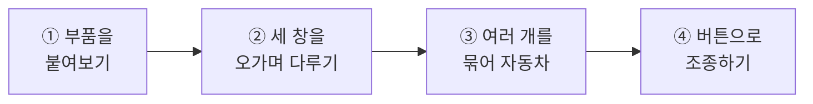
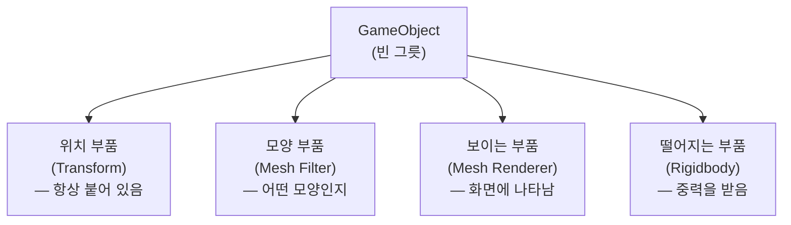
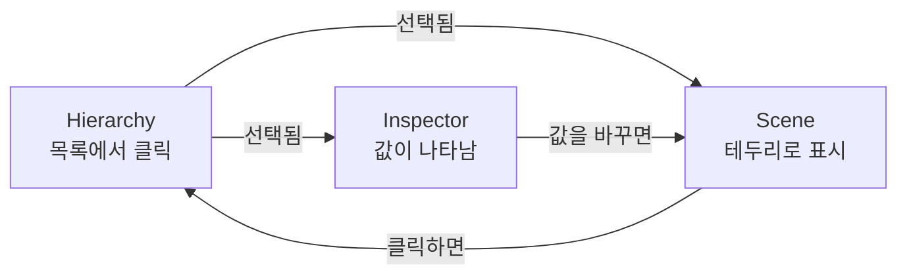
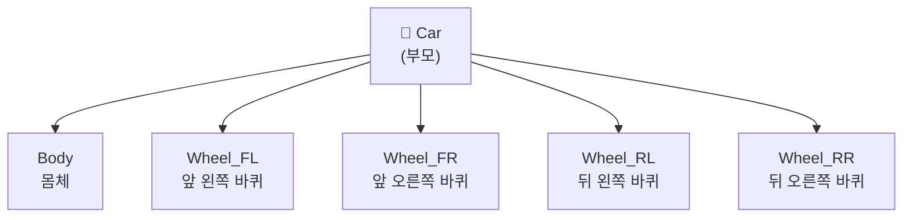
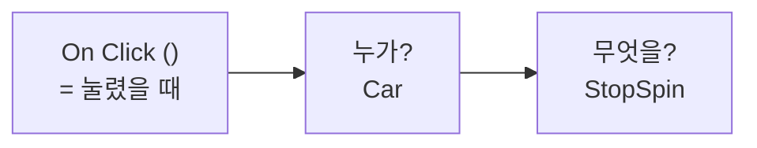
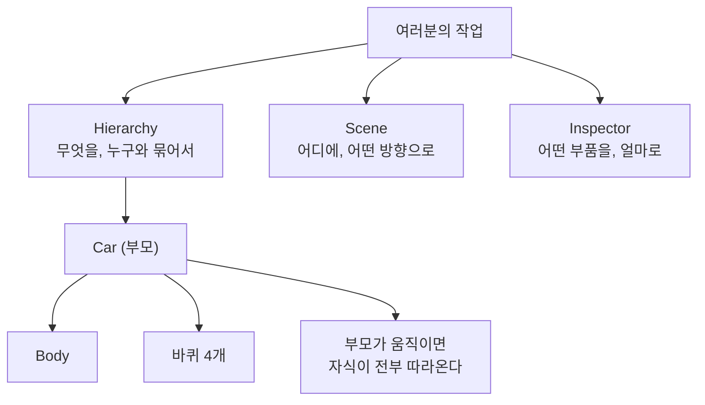

# **14차시. 부품을 붙여 자동차 만들기**
---

> ℹ️ **이 자료는 이렇게 보세요**
>
> - **강의 영상과 함께 보는 자료**입니다. 영상을 따라가시면서 옆에 두고 보시면 됩니다.
> - 이번 차시에도 **코드를 한 줄도 쓰지 않습니다.** 네 번째 시간이니 이제 익숙하시죠?
> - 오늘 하실 일은 **부품 붙이기, 물건 옮기기, 목록에서 끌어다 묶기** 정도입니다.
> - 오늘은 **직접 만드시는 시간이 가장 깁니다.** 자동차를 하나 만들어보실 거예요.

---

## **오늘의 목표**

이번 차시가 끝나면 여러분은 **코드 없이** 이런 것을 만드시게 됩니다.

- **빈 그릇에 부품을 붙여서** 화면에 나타나고 떨어지는 네모
- **몸체와 바퀴 네 개로 이루어진 자동차**
- 몸체를 옮기면 **바퀴가 알아서 따라오는** 자동차
- **버튼을 눌러 자동차를 멈추기**



> 💬 **13차시와 오늘의 차이**
>
> 13차시에는 창이 **어디에 있는지** 배웠습니다.
> 오늘은 그 창들을 **실제로 오가면서 물건을 만듭니다.** 오늘부터가 진짜 작업이에요.

---

## **1. 빈 그릇에 부품을 붙입니다**

11차시에 **레고 조립** 이야기를 했었죠. 오늘 그걸 **직접 해봅니다.**

### **먼저 빈 그릇을 놓습니다**

아무것도 아닌 **빈 그릇**을 하나 놓습니다. 이걸 **GameObject**라고 부릅니다.
말 그대로 비어 있어서, 이 상태로는 **화면에 보이지도 않습니다.**

### **여기에 부품을 하나씩 끼웁니다**



| 이렇게 하고 싶다면 | 이 부품을 붙입니다 |
| :--- | :--- |
| 어디에 있는지 정하고 싶다 | **위치 부품** (Transform) |
| 어떤 모양일지 정하고 싶다 | **모양 부품** (Mesh Filter) |
| 화면에 보이게 하고 싶다 | **보이는 부품** (Mesh Renderer) |
| 아래로 떨어지게 하고 싶다 | **떨어지는 부품** (Rigidbody) |
| 내가 원하는 대로 움직이게 하고 싶다 | **사람이 만든 부품** (스크립트) |

> ✅ **핵심 한 줄**
>
> **붙이면 생기고, 빼면 사라집니다.**
> 필요한 부품을 갖다 붙이는 것, 이게 Unity의 방식입니다.

> 📝 **위치 부품은 뗄 수 없습니다**
>
> **Transform**이라는 이름의 위치 부품은 **모든 물건에 항상 붙어 있고, 절대 뗄 수 없습니다.**
> 어디에 있는지 모르는 물건은 존재할 수가 없기 때문이에요.

### **모양 부품과 보이는 부품은 짝입니다**

처음엔 헷갈리기 쉬운데, 둘이 하는 일이 다릅니다.

| 부품 | 하는 일 | 비유하자면 |
| :--- | :--- | :--- |
| **Mesh Filter** | **어떤 모양**인지 정합니다 | 옷의 **본** |
| **Mesh Renderer** | 그 모양을 **화면에 그립니다** | 실제로 **입혀서 보여주기** |

**둘 다 있어야 화면에 나타납니다.** 하나만 붙이면 안 보여요.

> 💡 **매번 이렇게 만들지는 않습니다**
>
> `3D Object` → `Cube` 로 만들면 **Unity가 이 부품들을 한 번에 붙여서** 줍니다. 완제품이죠.
> 그런데 **직접 조립해보는 경험이 한 번은 필요합니다.** 그래야 완제품 안에 뭐가 들었는지 알거든요.
>
> **실습 ①에서 딱 한 번만** 손으로 조립해보고, 그 뒤로는 완제품을 씁니다.

---

## **2. 이 세 창은 늘 같이 씁니다**

**Scene · Hierarchy · Inspector**, 이 셋은 따로 배우면 오히려 헷갈립니다. **항상 같이 쓰이기 때문이에요.**

요리에 비유하면 이렇습니다.

| 요리할 때 | Unity에서는 | 하는 일 |
| :--- | :--- | :--- |
| 도마 위에 뭐가 있는지 보는 목록 | **Hierarchy** | 지금 놓인 것들의 이름 목록 |
| 실제로 자르고 조립하는 작업대 | **Scene** | 물건을 놓고 옮기는 공간 |
| 간을 맞추는 양념판 | **Inspector** | 고른 물건의 값 조정 |

> ✅ **Unity 작업 시간의 대부분이 이 세 창 사이입니다**
>
> 앞으로 무엇을 만드시든 **이 셋 사이를 계속 왔다 갔다** 하시게 됩니다.
> 그래서 오늘 이 셋의 관계를 잡아두면 앞으로가 훨씬 편해져요.

---

## **3. 세 창은 서로 신호를 주고받습니다**

한 곳에서 뭔가 하면 **나머지 둘이 알아서 따라옵니다.**



| 이렇게 하면 | 이렇게 됩니다 |
| :--- | :--- |
| **Hierarchy**에서 이름을 클릭 | Scene에서 **테두리가 생기고**, Inspector에 **값이 뜹니다** |
| **Scene**에서 물건을 클릭 | Hierarchy에서 **그 이름이 강조**됩니다 |
| **Inspector**에서 숫자를 바꿈 | Scene의 물건이 **즉시 움직입니다** |

> 💡 **그래서 물건이 안 보일 때**
>
> Scene에서 물건을 못 찾겠으면 **Hierarchy에서 이름을 클릭하고 `F` 키**를 누르세요.
> 목록에서 고르면 작업대가 알아서 그리로 데려다줍니다. 13차시에 배운 그 방법이에요.

---

## **4. Scene에서 물건을 다루는 도구 네 개**

Scene 창 **왼쪽 위**에 아이콘이 줄지어 있습니다. 이게 물건을 다루는 도구예요.

| 도구 | 단축키 | 무슨 일을 하나요 |
| :--- | :---: | :--- |
| ✋ **손 모양** | `Q` | 물건은 안 건드리고 **화면만** 움직입니다 |
| ✥ **이동** | `W` | 물건을 **옮깁니다** |
| ⟳ **회전** | `E` | 물건을 **돌립니다** |
| ⤢ **크기** | `R` | 물건을 **키우고 줄입니다** |

도구를 고르면 물건 위에 **색깔 화살표나 고리**가 나타납니다. 그걸 잡아서 끌면 돼요.

| 색깔 | 방향 |
| :--- | :--- |
| 🔴 빨강 | 좌우 (X) |
| 🟢 초록 | 위아래 (Y) |
| 🔵 파랑 | 앞뒤 (Z) |

> 📝 **화살표를 안 잡고 물건 몸통을 끌면**
>
> 아무 데로나 훅 가버립니다. 처음엔 다들 그래요.
> **반드시 색깔 화살표를 잡고** 끌어주세요. 그래야 한 방향으로만 움직입니다.

> ✅ **Scene에서 끌든, Inspector에 숫자를 치든 똑같습니다**
>
> Scene에서 물건을 끌면 **Inspector의 숫자가 같이 바뀝니다.** 반대도 마찬가지고요.
>
> - **대충 배치할 때**는 Scene에서 마우스로
> - **정확한 값이 필요할 때**는 Inspector에 숫자로
>
> 오늘 자동차를 만들 때는 **Inspector에 숫자를 넣는 방식**을 쓰겠습니다. 그게 더 쉽거든요.

---

## **5. Hierarchy — 묶으면 한 몸처럼 움직입니다**

여기가 오늘 가장 중요한 부분입니다.

Hierarchy에서 **물건 A를 물건 B 위로 끌어다 놓으면**, 둘이 묶입니다.
이때 **위에 있는 쪽(B)을 부모**, **아래로 들어간 쪽(A)을 자식**이라고 부릅니다.



### **묶으면 뭐가 좋은가요**

| 이렇게 하면 | 이렇게 됩니다 |
| :--- | :--- |
| **부모**를 옮긴다 | **자식이 전부 따라옵니다** |
| **부모**를 돌린다 | **자식이 전부 같이 돕니다** |
| **부모**를 키운다 | **자식도 같이 커집니다** |
| **자식** 하나만 옮긴다 | **그 자식만** 움직입니다 |

> ✅ **핵심 한 줄**
>
> **부모를 움직이면 자식이 따라오고, 자식은 혼자 움직일 수 있습니다.**
>
> 자동차를 생각해보세요. 차를 앞으로 몰면 바퀴도 같이 갑니다. 당연하죠.
> 그런데 바퀴 하나만 따로 빼서 옮길 수도 있어야 하고요.

### **묶지 않으면 어떻게 되나요**

바퀴 네 개를 안 묶어두면, 차를 옮길 때마다 **바퀴 네 개를 하나하나 같은 만큼 옮겨야** 합니다.
조금이라도 어긋나면 **바퀴만 뒤에 남아 있는** 이상한 자동차가 됩니다.

> 💬 **Unity의 사고방식**
>
> **손으로 매번 맞출 수 있는 일은, 애초에 묶어서 자동으로 되게 만든다.**
> 오늘 배우는 이 방식이 앞으로 캐릭터의 팔다리, 화면의 버튼 묶음까지 계속 쓰입니다.

---

## **6. Inspector — 부품을 붙이고 뗍니다**

물건을 하나 고르면 Inspector에 부품이 위에서부터 쭉 쌓여 있습니다.

| Inspector에 보이는 것 | 무슨 부품인가요 |
| :--- | :--- |
| 맨 위의 **이름 칸** | 이 물건의 이름 |
| **Transform** | 위치 부품 — 어디에, 얼마나 크게, 어느 방향으로 |
| **Mesh Renderer** | 보이는 부품 |
| **Collider** | 부딪히는 부품 |
| 그 아래 | 사람이 만든 부품(스크립트) 등 |

| 하고 싶은 일 | 이렇게 하세요 |
| :--- | :--- |
| 부품 붙이기 | Inspector 맨 아래 **`Add Component`** |
| 부품 잠깐 끄기 | 부품 이름 왼쪽 **체크 해제** |
| 부품 아예 떼기 | 부품 오른쪽 위 **점 세 개(⋮)** → **`Remove Component`** |

> 💡 **되돌리기가 있으니 마음껏 해보세요**
>
> 부품을 잘못 뗐어도 **`Ctrl + Z`** 를 누르면 그대로 돌아옵니다.
> **되돌릴 수 있으면 그건 실수가 아니라 시도입니다.**

---

## **7. 오늘 사용할 부품 — CubeSpinner**

강의자료에 들어 있는 **`CubeSpinner`** 라는 부품을 씁니다. **물건을 돌리는 부품**이에요.
지난 시간 `ConsoleTester` 와 마찬가지로, **끌어다 놓기만 하면** 됩니다.

| Inspector 항목 | 무슨 뜻인가요 |
| :--- | :--- |
| **Rotation Speed** | 회전 속도 (음수면 반대 방향) |
| **Is Spinning** | 돌지 말지 |

오늘은 이 부품을 **바퀴가 아니라 자동차 전체(부모)에 붙입니다.**
그러면 무슨 일이 일어날까요? **실습 ③ 마지막에 직접 확인해보세요.**

---

## **8. 실습 — 직접 해보세요**

영상에서 강사가 "멈추세요"라고 하는 지점에서 아래 순서대로 따라 하시면 됩니다.
**안 되셔도 괜찮습니다.** 오늘은 만드는 양이 좀 많으니 **천천히** 하세요.

---

### **실습 ① — 부품을 붙여 물건 만들기**

> 🎯 **목표**
>
> 빈 그릇에 부품을 붙여서, **화면에 나타나고 아래로 떨어지는 네모**를 만듭니다.

1. **Hierarchy**(왼쪽 목록)에서 빈 곳을 **우클릭** → `Create Empty`
   → 빈 그릇이 하나 생깁니다. **아직 화면엔 안 보여요.**
2. **Inspector**(오른쪽)를 봅니다. → **Transform** 하나만 있습니다.
3. Inspector 아래쪽 **`Add Component`** 클릭 → `Mesh Filter` 검색해서 추가
   → 추가한 뒤 **`Mesh`** 항목을 **`Cube`** 로 지정합니다.
   (오른쪽 끝 동그란 아이콘을 눌러 목록에서 고르시면 됩니다.)
4. 다시 **`Add Component`** → `Mesh Renderer` 추가
   → **화면에 네모가 나타납니다.**
5. 다시 **`Add Component`** → `Rigidbody` 추가
6. 위쪽 **▶ 버튼**을 누릅니다 → **네모가 아래로 떨어집니다.**
7. ▶ 를 다시 눌러 멈춘 뒤, `Rigidbody` 이름 왼쪽의 **체크를 해제**하고 다시 ▶
   → 이번엔 **떨어지지 않습니다.**

<details>
<summary>✅ 확인해보세요</summary>

- 코드를 **한 줄도 쓰지 않았는데** 네모가 떨어졌나요?
- 중력이 얼마인지, 떨어지는 속도가 얼마인지 계산한 적이 있나요?
  → **없습니다.** Unity가 이미 다 만들어둔 부품을 갖다 붙였을 뿐입니다.
- 3번까지만 했을 때는 **안 보였죠?** → **모양 부품과 보이는 부품은 짝**이라 둘 다 있어야 합니다.
- 체크를 해제했더니 안 떨어졌나요?
  → **붙이면 생기고, 빼면 사라진다.** 이게 오늘의 첫 번째 핵심입니다.

</details>

> ⚠️ **잘 안 되신다면**
>
> - 화면에 아무것도 안 보인다 → `Mesh Filter` 의 **`Mesh` 가 비어 있지 않은지** 확인해주세요. `Cube` 로 지정해야 합니다.
> - 안 떨어진다 → `Rigidbody` 의 **체크가 꺼져 있지 않은지** 확인해주세요.

---

### **실습 ② — 세 창을 오가며 물건 다루기**

> 🎯 **목표**
>
> **한 창에서 뭔가 하면 나머지 둘이 따라온다**는 것을 확인하고,
> 마우스와 숫자 **두 가지 방법**으로 물건을 다뤄봅니다.

#### **세 창이 이어져 있는지 확인하기**

1. **Hierarchy** 우클릭 → `3D Object` → `Cube` 를 **세 번** 반복합니다.
   → 큐브 세 개가 겹쳐서 생깁니다. (겹쳐 있는 게 정상입니다.)
   → **실습 ①과 달리 한 번에 나오죠?** Unity가 부품을 미리 붙여둔 완제품이라 그렇습니다.
2. **Hierarchy에서 `Cube` 하나를 클릭**합니다.
   → Scene에서 **테두리**가 생기고, Inspector에 **값이 뜹니다.**
3. **Scene에서 다른 큐브를 클릭**합니다.
   → Hierarchy에서 **그 이름이 파랗게 강조**됩니다.
4. **Inspector**의 `Transform` → `Position` 의 **`X` 값을 `3`** 으로 바꿔봅니다.
   → Scene에서 **즉시 옆으로 이동합니다.**

#### **마우스로 다뤄보기**

5. 큐브 하나를 고르고 **`W`** 를 누릅니다. → 색깔 **화살표**가 나타납니다.
6. **빨간 화살표**를 잡고 끌어봅니다. → 좌우로만 움직입니다.
   → 이때 **Inspector의 `Position` 숫자**를 같이 보세요. **같이 변합니다.**
7. **`E`** → 색깔 **고리**로 바뀝니다. 잡고 돌려보세요. → `Rotation` 숫자가 변합니다.
8. **`R`** → **작은 네모 손잡이**로 바뀝니다. 잡고 끌어보세요. → `Scale` 숫자가 변합니다.
9. 이번엔 반대로, **Inspector에 `Position` 을 `0, 0, 0`** 으로 직접 입력해봅니다.
   → **정확히 한가운데**로 갑니다.
10. 큐브 이름을 알아보기 쉽게 바꿔둡니다.
    → Hierarchy에서 이름을 **천천히 두 번 클릭**하거나, 이름 위에서 **`F2`**

<details>
<summary>✅ 확인해보세요</summary>

- 한 곳에서 고르면 **나머지 두 창이 따라왔나요?** → 세 창은 항상 같은 물건을 보고 있습니다.
- Scene에서 끌 때 Inspector 숫자가 같이 움직였나요?
  → **마우스로 끄는 것과 숫자를 치는 것은 똑같은 일**입니다. 방법만 다릅니다.
- `Position` 을 `0, 0, 0` 으로 하면 정확히 가운데로 오죠?
  → **어디로 갔는지 모르겠을 때 `0, 0, 0` 으로 되돌리는 것**, 아주 유용합니다.
- 이제부터 **"어? 값이 안 바뀌는데?"** 싶으면, **다른 물건을 고른 건 아닌지** 먼저 확인해보세요. 가장 흔한 원인입니다.

</details>

> ⚠️ **잘 안 되신다면**
>
> - 큐브가 하나만 보인다 → **똑같은 자리에 세 개가 겹쳐 있어서** 그렇습니다. Hierarchy 목록에는 세 개가 있는지 확인해보세요.
> - 물건이 아무 데로나 훅 간다 → **화살표를 안 잡고 몸통을 끄신 겁니다.** `Ctrl + Z` 로 되돌리고, 화살표를 잡아주세요.
> - 도구가 안 바뀐다 → 마우스 커서를 **Scene 창 위에 올려둔 상태**에서 `W`/`E`/`R` 을 눌러야 합니다.
> - 이름이 안 바뀐다 → 두 번 클릭을 **너무 빠르게** 하면 안 됩니다. **천천히** 두 번 클릭하거나 `F2` 를 쓰세요.

---

### **실습 ③ — 자동차 만들기 (오늘의 핵심)**

> 🎯 **목표**
>
> 몸체와 바퀴 네 개를 **하나로 묶어서**, 통째로 움직이는 자동차를 만듭니다.

#### **1단계 — 빈 그릇을 부모로 놓습니다**

1. 실습 ①②에서 만든 것은 **전부 지워주세요.** (선택 후 `Delete`)
2. **Hierarchy** 우클릭 → `Create Empty` → 이름을 **`Car`** 로 바꿉니다.
   → 이게 자동차 **전체를 대표하는 빈 그릇**입니다. 화면엔 안 보여요.
3. `Car` 를 선택하고 Inspector에서 `Position` 을 **`0, 0, 0`** 으로 맞춰둡니다.

#### **2단계 — 몸체를 만들어 자식으로 넣습니다**

4. **Hierarchy** 우클릭 → `3D Object` → `Cube` → 이름을 **`Body`** 로 바꿉니다.
5. **`Body` 를 `Car` 위로 끌어다 놓습니다.**
   → 목록에서 **한 칸 안으로 들어가면** 성공입니다.
6. `Body` 의 값을 아래 표대로 맞춥니다.

#### **3단계 — 바퀴 네 개를 만듭니다**

7. **Hierarchy** 우클릭 → `3D Object` → `Cylinder` → 이름을 **`Wheel_FL`** 로
8. **`Car` 위로 끌어다 놓고**, 아래 표대로 값을 맞춥니다.
9. `Wheel_FL` 을 선택하고 **`Ctrl + D`** 로 세 번 복제한 뒤, 이름과 `Position` 만 표대로 바꿉니다.

| 이름 | Position | Rotation | Scale |
| :--- | :--- | :--- | :--- |
| **Body** | `0, 0.5, 0` | `0, 0, 0` | `2, 0.5, 1` |
| **Wheel_FL** | `0.7, 0.2, 0.55` | `90, 0, 0` | `0.4, 0.1, 0.4` |
| **Wheel_FR** | `0.7, 0.2, -0.55` | `90, 0, 0` | `0.4, 0.1, 0.4` |
| **Wheel_RL** | `-0.7, 0.2, 0.55` | `90, 0, 0` | `0.4, 0.1, 0.4` |
| **Wheel_RR** | `-0.7, 0.2, -0.55` | `90, 0, 0` | `0.4, 0.1, 0.4` |

> 📝 **숫자가 조금 달라도 괜찮습니다**
>
> **자동차처럼 보이기만 하면 성공입니다.** 표는 참고용이에요.
> 마음에 안 들면 바퀴 위치를 마음대로 바꿔보셔도 좋습니다.

#### **4단계 — 묶였는지 확인합니다**

10. **`Car` 를 선택**하고 `W` → 화살표를 잡고 끌어봅니다.
    → **몸체와 바퀴가 전부 따라옵니다.**
11. **`Car` 를 선택**하고 `E` → 돌려봅니다.
    → **자동차 전체가 통째로 돕니다.**
12. 이번엔 **`Wheel_FL` 하나만 선택**하고 옮겨봅니다.
    → **그 바퀴만** 움직입니다. (확인했으면 `Ctrl + Z` 로 되돌려주세요.)

#### **5단계 — 자동차를 통째로 돌립니다**

13. **`Car` 를 선택**하고, 강의자료의 **`CubeSpinner`** 를 **끌어다 놓습니다.**
14. **▶** 를 누릅니다.

<details>
<summary>✅ 무슨 일이 일어났나요</summary>

**자동차 다섯 조각이 통째로 빙글빙글 돕니다.**

부품은 **`Car` 하나에만** 붙였는데요.
바퀴 네 개에 하나씩 붙인 게 아닙니다.

**부모가 돌면 자식이 전부 따라 돈다.** 이게 오늘의 핵심입니다.

> 💡 **묶지 않았다면**
>
> 부품을 **다섯 개에 전부 붙이고**, 속도까지 똑같이 맞춰야 했을 겁니다.
> 하나라도 틀리면 **바퀴만 따로 도는** 자동차가 되고요.

</details>

> 🚨 **꼭 알아두세요 — 값이 사라지는 이유**
>
> **▶ 를 누른 상태에서 만든 물건과 바꾼 값은, ▶ 를 끄면 전부 사라집니다.**
>
> 오늘은 만드는 양이 많아서 특히 조심하셔야 합니다.
> **자동차를 만드는 동안에는 ▶ 가 꺼져 있는지 꼭 확인해주세요.**
>
> 실수로 ▶ 를 켠 채 한참 만들었다면, 안타깝지만 되살릴 방법이 없습니다.

> ⚠️ **잘 안 되신다면**
>
> - 끌어다 놓았는데 안 들어간다 → 목록에서 **`Car` 이름 위에 정확히 올려놓고** 손을 떼야 합니다. 이름과 이름 **사이**에 놓으면 그냥 순서만 바뀝니다.
> - 자식으로 넣었더니 **크기나 위치가 확 변했다** → `Car` 의 `Scale` 이 `1, 1, 1` 이 아닌지, `Position` 이 `0, 0, 0` 인지 확인해주세요.
> - 바퀴가 누워 있지 않고 서 있다 → `Rotation` 의 **`X` 를 `90`** 으로 하셔야 합니다. `Z` 가 아닙니다.
> - 바퀴가 **앞뒤 범퍼에 붙은 원반처럼** 보인다 → `Z` 에 `90` 을 넣으신 겁니다. **`X` 로 옮겨주세요.**
> - 바퀴가 몸체 안에 파묻혔다 → `Position` 의 **`Z` 값 부호**(`0.55` / `-0.55`)를 확인해주세요.

---

### **실습 ④ — 버튼으로 조종하기 (선택)**

> 🎯 **목표**
>
> **버튼을 만들어 자동차를 멈춰봅니다.** 오늘 처음 만들어보는 화면 요소예요.

#### **버튼 만들기**

1. **Hierarchy** 우클릭 → **`UI`** → **`Button - TextMeshPro`**
2. 화면에 큰 사각형이 생기고 시야가 갑자기 넓어집니다.
   → **놀라지 마세요.** 버튼을 올려놓는 **판**이 자동으로 만들어진 것입니다.
   → 이 판이 뭔지는 **17차시에서 제대로** 다룹니다. 지금은 신경 쓰지 않으셔도 됩니다.
3. **`Game` 탭**을 눌러 버튼이 화면에 있는지 확인합니다.

#### **동작 연결하기**

4. 만든 **`Button`** 을 선택하고, Inspector를 **아래로 스크롤**합니다.
5. **`On Click ()`** 이라고 적힌 칸을 찾습니다. **'눌렸을 때'** 라는 뜻이에요.
6. **`+`** 를 눌러 칸을 하나 만듭니다.
7. **Hierarchy의 `Car`** 를 왼쪽 빈 칸으로 **끌어다 놓습니다.** ← **누가** 할지
8. 오른쪽 **목록**을 클릭 → `CubeSpinner` → **`StopSpin`** 선택 ← **무엇을** 할지
9. 버튼 안의 글자를 **"멈춤"** 으로 바꿉니다.
   → Hierarchy에서 `Button` 을 펼쳐 `Text (TMP)` 를 고르고, `Text` 칸에 입력하세요.
10. **▶** 를 누르고 버튼을 클릭합니다. → **자동차가 멈춥니다.**



#### **버튼 하나 더 — 다시 돌리기**

멈추기만 하면 **다시 돌릴 방법이 없습니다.** ▶ 를 껐다 켜야 하죠. 하나 더 만들겠습니다.

11. 만든 **`Button` 을 선택**하고 **`Ctrl + D`** 로 복제합니다.
12. 복제한 것의 자리를 조금 옮기고, 글자를 **"다시 돌리기"** 로 바꿉니다.
13. `On Click ()` 의 목록에서 **`StopSpin` 을 `StartSpin` 으로** 바꿉니다.
    → 왼쪽 칸의 `Car` 는 **복제하면서 같이 따라왔습니다.** 다시 안 넣으셔도 됩니다.
14. **▶** 를 누르고 두 버튼을 번갈아 눌러봅니다.

<details>
<summary>✅ 확인해보세요</summary>

- **멈췄다 다시 돌았나요?**
- 복제했더니 **연결까지 같이 따라왔죠?** → 15차시에 배울 **틀(Prefab)** 의 맛보기입니다.
- 두 버튼이 하는 일은 **똑같은 구조**입니다. **누가**(`Car`) — **무엇을**(`StartSpin` / `StopSpin`).
  → 19차시에서 이 패널을 **버튼 세 개**로 제대로 만듭니다.

</details>

<details>
<summary>✅ 무슨 일이 일어났나요</summary>

**버튼을 눌러서 자동차를 멈추셨습니다. 코드는 한 줄도 안 쓰고요.**

하신 일은 딱 두 가지였습니다.
**누가**(자동차를 끌어다 놓기) — **무엇을**(목록에서 고르기).

> 💡 **이게 노코드의 핵심입니다**
>
> 게임 회사에서 **프로그래머가 동작을 만들어두면, 기획자가 이렇게 연결합니다.**
> 오늘 여러분이 하신 게 정확히 그 일이에요.

화면을 제대로 만드는 방법은 **17차시부터** 다룹니다.

</details>

> ⚠️ **잘 안 되신다면**
>
> - 목록에 `StopSpin` 이 안 보인다 → 7번에서 **`Car` 를 끌어다 놓지 않으신 경우**가 대부분입니다. 왼쪽 칸이 `None` 이면 오른쪽 목록에 아무것도 안 나옵니다.
> - 버튼이 Game 화면에 안 보인다 → `Button` 이 **자동으로 생긴 판(Canvas)의 자식**인지 확인해주세요.
> - 글자가 네모(☐)로 나온다 → 강의자료의 **한글 글꼴**이 프로젝트에 들어와 있는지 확인해주세요. 12차시에 넣으신 그 꾸러미에 들어 있습니다.

---

## **9. 코드는 딱 한 번만 보고 갑니다**

**외우실 필요도, 치실 필요도 없습니다.** 그냥 구경만 하세요.

오늘 계속 만졌던 `Transform` 의 세 줄이, 코드에서는 이렇게 생겼습니다.

```
위치  ──→  [ Position   X 0    · Y 0.5 · Z 0 ]
회전  ──→  [ Rotation   X 90   · Y 0   · Z 0 ]
크기  ──→  [ Scale      X 0.4  · Y 0.1 · Z 0.4 ]
```

> ✅ **결론은 13차시와 같습니다**
>
> **Inspector에 보이는 칸은, 코드 어딘가에 대응하는 줄이 하나씩 있습니다.**
>
> 그런데 오늘 하신 **"자식으로 끌어다 넣기"** 는 조금 다릅니다.
> 이걸 코드로 하려면 **바퀴 네 개의 위치를 계속 따라 맞추는 줄**이 필요해요.
> **끌어다 놓기 한 번으로 끝낸 일**을요.

> 💬 **그래서 Unity는 이렇게 말합니다**
>
> **끌어다 놓아서 될 일은, 코드로 하지 마라.**
> 오늘 여러분이 하신 방식이 실제 현장에서도 **더 나은 방식**입니다.

---

## **10. 오늘 배운 것을 그림으로**



> ✅ **이 그림 하나만 기억하셔도 오늘은 성공입니다**
>
> - **Hierarchy**에서 묶고, **Scene**에서 배치하고, **Inspector**에서 부품을 붙이고 값을 맞춥니다.
> - 그리고 **부모 하나만 움직이면 자식이 전부 따라옵니다.**
> - 오늘 자동차에 부품을 **하나만** 붙여서 다섯 조각을 전부 돌리셨죠? 그게 증거입니다.

---

## **11. 정리 문제**

맞히는 게 목적이 아닙니다. **오늘 내용이 머리에 남았는지 확인하는 용도**예요.
먼저 스스로 답을 떠올려보신 뒤에 정답을 펼쳐주세요.

### **문제 1**
빈 그릇을 만들었는데 **화면에 아무것도 안 보입니다.** 무엇을 붙여야 할까요?

<details>
<summary>✅ 정답 보기</summary>

**모양 부품(Mesh Filter)과 보이는 부품(Mesh Renderer), 둘 다** 붙여야 합니다.

- **Mesh Filter**: 어떤 모양인지 정합니다 (옷의 본)
- **Mesh Renderer**: 그 모양을 화면에 그립니다 (실제로 보여주기)

**하나만 붙이면 안 보입니다.** 둘은 짝이에요.

> 💡 **그럼 왜 Cube는 한 번에 나오나요**
>
> `3D Object` → `Cube` 는 Unity가 **이 부품들을 미리 붙여둔 완제품**이기 때문입니다.

</details>

### **문제 2**
Hierarchy에서 물건을 **다른 물건 안에 넣으면** 무슨 일이 생기나요?

<details>
<summary>✅ 정답 보기</summary>

**부모를 움직이면 자식이 전부 따라옵니다.** 옮겨도, 돌려도, 키워도 마찬가지예요.

반대로 **자식 하나만 따로 움직이는 것도 됩니다.**

> 💡 **이 답이 잘 안 떠오르셨다면**
>
> 영상에서 **자동차 만드는 파트를 한 번 더** 보시는 걸 권합니다.
> 여기서 안 잡히면 앞으로 캐릭터나 화면 구성을 만들 때 계속 걸립니다.

</details>

### **문제 3**
자동차 전체를 돌리려고 **`CubeSpinner`를 어디에 붙였나요?** 왜 거기였을까요?

<details>
<summary>✅ 정답 보기</summary>

**부모인 `Car` 에 붙였습니다.**

부모가 돌면 **자식이 전부 따라 돌기 때문**입니다.
바퀴 네 개와 몸체에 하나씩 붙였다면 **다섯 개를 붙이고 속도까지 다 맞춰야** 했겠죠.

- 하나라도 값이 다르면 → **바퀴만 따로 도는** 이상한 자동차
- 부모 하나에만 붙이면 → **항상 같이 돕니다**

</details>

### **문제 4**
Scene에서 **마우스로 끄는 것**과 Inspector에 **숫자를 치는 것**, 어떻게 다른가요?

<details>
<summary>✅ 정답 보기</summary>

**결과는 똑같습니다.** 방법만 다를 뿐이에요.

- **마우스로 끌기**: 눈으로 보면서 **대충 배치**할 때 편합니다
- **숫자로 입력**: **정확한 값**이 필요할 때 편합니다

Scene에서 끌면 Inspector 숫자가 같이 변하는 걸 실습 ②에서 확인하셨죠.

</details>

### **문제 5**
**"묶지 말고 그냥 코드로 위치를 맞추면 되지 않나요?"** 이 말은 맞는 말일까요?

<details>
<summary>✅ 정답 보기</summary>

**할 수는 있지만, 훨씬 번거롭고 잘 틀립니다.**

- 바퀴 네 개의 위치를 **계속 따라 맞추는 일**을 해야 합니다
- 한 군데라도 빠뜨리면 **바퀴만 뒤에 남는** 버그가 생깁니다
- 나중에 바퀴를 하나 더 달면 **또 고쳐야** 하고요

묶어두면 **끌어다 놓기 한 번으로 끝**이고, 이후에 뭘 추가해도 알아서 따라옵니다.

> 💬 **결론**
>
> **끌어다 놓아서 될 일은, 코드로 하지 않는다.**

</details>

---

## **12. 앞으로 조심할 것**

> ⚠️ **흔한 실수**
>
> - **모양 부품만 붙이고 안 보인다고 하기** → 보이는 부품까지 있어야 합니다.
> - **자식으로 넣었더니 위치·크기가 이상해짐** → 부모의 `Scale` 이 `1, 1, 1` 이 아닌 경우가 대부분입니다.
> - **엉뚱한 물건을 고른 채로 값 바꾸기** → "값을 바꿨는데 아무 일도 안 일어나요"의 1위 원인입니다.
> - **▶ 를 켠 채로 물건 만들기** → ▶ 를 끄면 만든 게 전부 사라집니다.

> 💡 **좋은 습관 두 개**
>
> - **이름을 바로 바꿔두기** — `Cube (1)`, `Cube (2)` 가 열 개 쌓이면 본인도 못 찾습니다. 만들자마자 `Body`, `Wheel_FL` 처럼 바꿔두세요.
> - **묶을 수 있으면 묶기** — 같이 움직여야 하는 것들은 **처음부터** 부모 하나에 넣어두세요.

---

## **13. 오늘의 정리**

> ✅ **세 줄 요약**
>
> 1. **빈 그릇에 부품을 붙이면 생기고, 빼면 사라진다.**
> 2. **Hierarchy에서 묶으면, 부모를 움직일 때 자식이 전부 따라온다.**
> 3. **버튼 연결은 '누가 — 무엇을' 두 개만 고르면 된다.**

오늘 여러분은 **부품을 직접 조립하고, 여러 조각을 묶고, 버튼으로 조종하는 것**까지 하셨습니다.
이건 앞으로 캐릭터를 만들든, 화면을 구성하든 **계속 쓰게 될 방식**이에요. 충분히 잘하셨습니다.

---

## **14. 다음 차시 준비**

> 🧩 **15차시 — 데이터 관리**
>
> 오늘 자동차 한 대를 만드는 데 꽤 손이 갔죠. **다섯 대가 필요하면 어떻게 할까요?**
>
> 다음 시간에는 오늘 만든 자동차를 **'틀'로 만들어두고, 찍어내듯 복제**하는 방법을 배웁니다.
> 밖에서 만든 그림·소리 파일을 프로젝트에 가져오는 방법도 같이 다룹니다.
>
> > 📝 **오늘 못 푼 궁금증은 20차시에서**
> >
> > "0.55는 어느 쪽이지?", "왜 Z를 90으로 하면 눕지?"
> > **X·Y·Z가 각각 어느 방향인지**는 **20차시**에서 제대로 다룹니다. 지금은 몰라도 됩니다.

> 📝 **미리 해두시면 좋은 것**
>
> - [ ] 오늘 만든 **자동차를 `Ctrl + S` 로 저장**해두기 (다음 시간에 그대로 씁니다)
> - [ ] 자동차 색을 **본인 마음에 들게** 바꿔보기 (13차시에 배운 재료 만들기)
> - [ ] 여유가 되시면 **바퀴를 더 달아보거나, 지붕을 얹어보기**
>
> > 💡 **혼자 더 해보시면 가장 많이 늡니다**
> >
> > 정답이 없는 과제예요. **망가뜨려도 `Ctrl + Z` 가 있습니다.**

---

## **부록 — 오늘 나온 용어 정리**

| 화면에 보이는 이름 | 우리말로 하면 |
| :--- | :--- |
| **GameObject** | 빈 그릇, 화면에 놓는 물건 하나 |
| **Component** | 부품 |
| **Create Empty** | 빈 그릇 만들기 |
| **Add Component** | 부품 붙이기 |
| **Remove Component** | 부품 떼기 |
| **Transform** | 위치 부품 (위치·회전·크기) |
| **Mesh Filter** | 모양 부품 — 어떤 모양인지 |
| **Mesh Renderer** | 보이는 부품 — 화면에 그리기 |
| **Rigidbody** | 떨어지는 부품 (중력) |
| **Position** | 어디에 있는지 |
| **Rotation** | 어느 방향으로 돌아 있는지 |
| **Scale** | 얼마나 큰지 |
| **3D Object → Cube / Cylinder** | 네모 / 원기둥 만들기 (완제품) |
| **부모 · 자식** | 묶은 것 · 묶인 것 |
| **Ctrl + D** | 복제 |
| **Ctrl + Z** | 되돌리기 |
| **F2** | 이름 바꾸기 |
| **Q · W · E · R** | 화면 이동 · 옮기기 · 돌리기 · 크기 |
| **Button** | 누를 수 있는 버튼 |
| **On Click** | 눌렸을 때 |
| **Canvas** | 버튼을 올려놓는 판 (17차시에서 다룸) |
