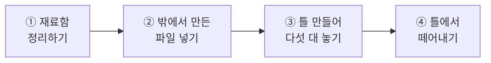
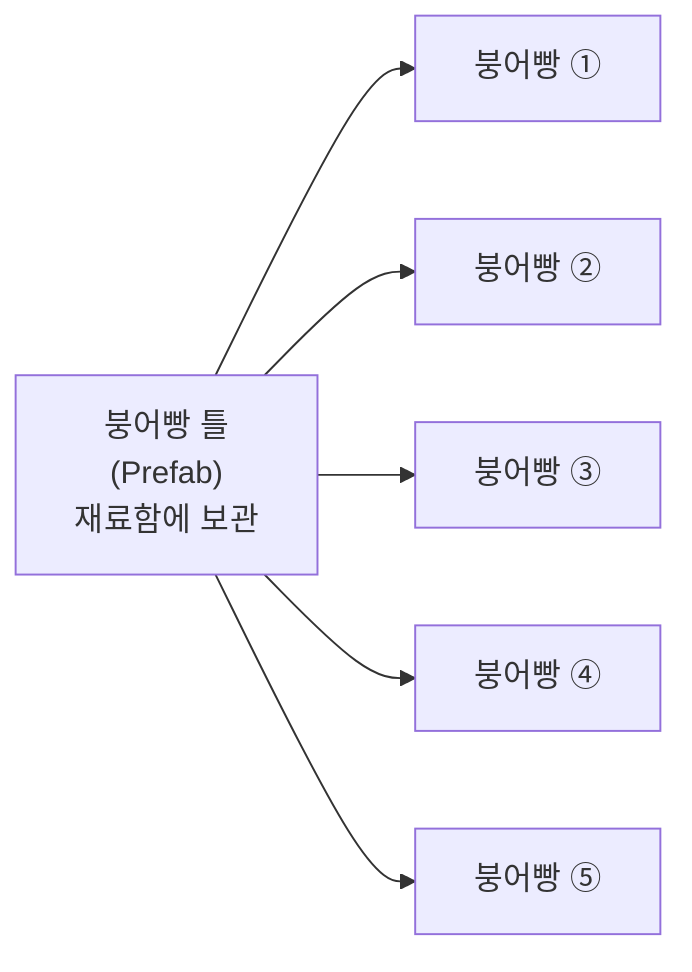
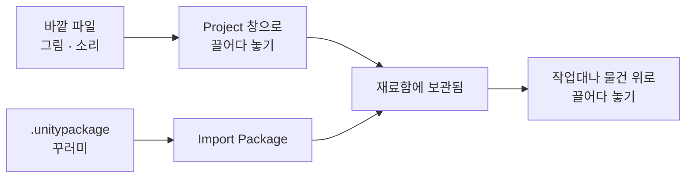
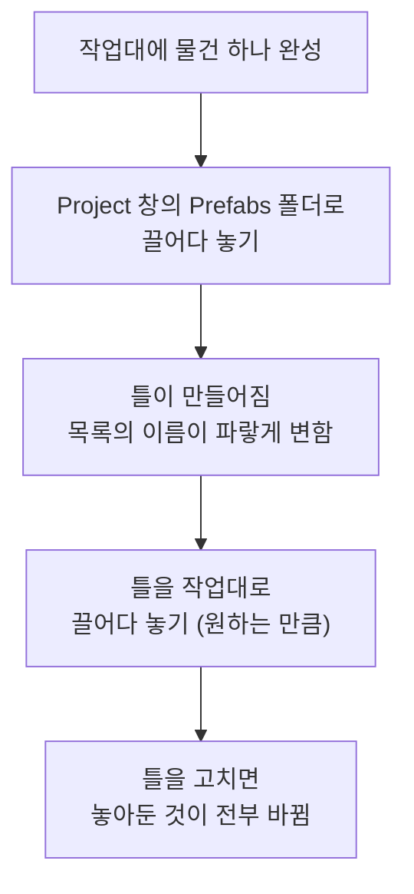
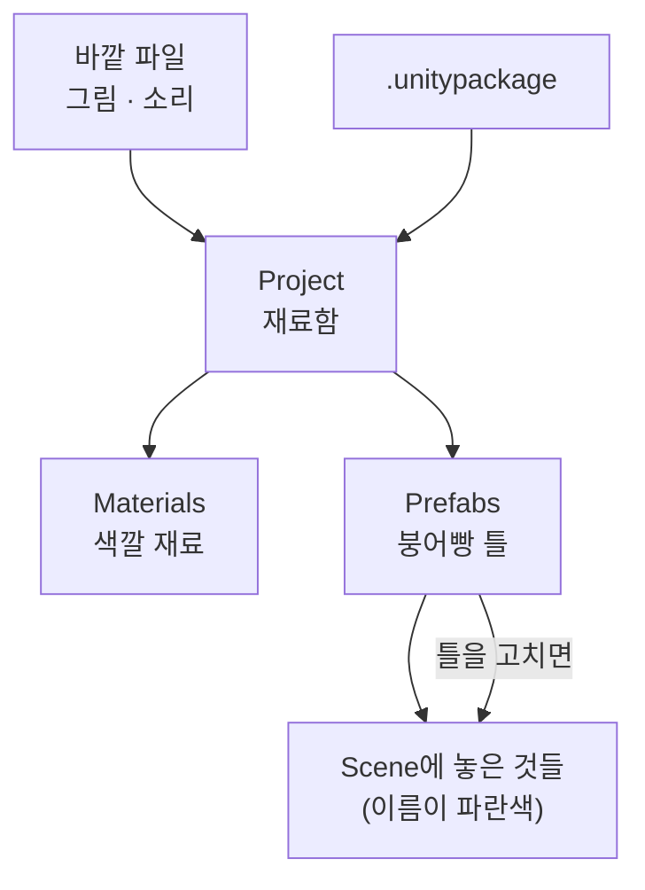

# **15차시. 재료 넣기와 붕어빵 틀 만들기**
---

> ℹ️ **이 자료는 이렇게 보세요**
>
> - **강의 영상과 함께 보는 자료**입니다. 영상을 따라가시면서 옆에 두고 보시면 됩니다.
> - 이번 차시에도 **코드를 한 줄도 쓰지 않습니다.**
> - 오늘 하실 일은 **파일 끌어다 넣기, 틀 만들기, 복제하기** 정도입니다.
> - 지난 시간에 만든 **자동차를 그대로 씁니다.** 저장해두셨죠?

---

## **오늘의 목표**

이번 차시가 끝나면 여러분은 **코드 없이** 이런 것을 하시게 됩니다.

- 밖에서 만든 **그림 파일을 프로젝트에 넣기**
- 지난 시간 자동차를 **'틀'로 만들어두기**
- 그 틀로 **자동차 다섯 대를 한 번에** 놓기
- **틀 하나만 고쳐서 다섯 대를 전부** 바꾸기

> 💬 **14차시와 오늘의 차이**
>
> 14차시에는 자동차를 **한 대** 만드셨습니다. 손이 꽤 갔죠.
> 오늘은 그걸 **다섯 대, 열 대로 늘리는 방법**을 배웁니다.

---

## **1. 자동차 다섯 대가 필요하다면?**

지난 시간에 자동차 한 대 만드는 데 시간이 꽤 걸렸습니다. 빈 그릇 놓고, 몸체 만들고, 바퀴 네 개 맞추고요.

**그럼 다섯 대가 필요하면 어떻게 할까요?**

| 방법 | 무슨 일이 생기나요 |
| :--- | :--- |
| 처음부터 다섯 번 만든다 | 시간이 다섯 배 듭니다. 그리고 **조금씩 달라집니다.** |
| `Ctrl + D` 로 네 번 복제한다 | 빠릅니다. 그런데 **나중에 바퀴 색을 바꾸려면 다섯 번 고쳐야** 합니다. |
| **틀을 만들어둔다** ✅ | **틀 하나만 고치면 다섯 대가 전부 바뀝니다.** |

> ✅ **오늘의 핵심**
>
> **똑같은 걸 여러 개 놓을 거라면, 먼저 '틀'을 만들어라.**

---

## **2. Prefab — 붕어빵 틀**

Unity에서 이 '틀'을 **Prefab**이라고 부릅니다. **붕어빵 틀**이라고 생각하시면 정확합니다.

| 붕어빵 가게 | Unity에서는 |
| :--- | :--- |
| 붕어빵 **틀**을 하나 만든다 | 물건을 **재료함(Project)에 끌어다 놓아** 틀로 만든다 |
| 틀로 붕어빵을 **여러 개 찍는다** | 틀을 **작업대(Scene)로 끌어다 놓는다** |
| **틀 모양을 바꾸면** 다음 붕어빵부터 바뀐다 | **틀을 고치면 놓아둔 것이 전부 바뀐다** |
| 붕어빵 하나에 팥 대신 슈크림을 넣는다 | **하나만 따로 바꿀 수도 있다** |

> 💡 **가장 중요한 차이**
>
> `Ctrl + D` 복제와 틀은 **겉보기엔 똑같아 보이지만** 결정적으로 다릅니다.
>
> - **복제**: 만든 순간부터 **서로 남남**입니다. 하나 고쳐도 나머지는 그대로.
> - **틀**: **계속 연결되어 있습니다.** 틀을 고치면 전부 따라 바뀝니다.

---

## **3. 재료함을 정리하는 이유**

13차시에 `Materials` 폴더를 만들어봤죠. 오늘은 폴더를 **몇 개 더** 만듭니다.

| 폴더 이름 | 여기에 넣을 것 |
| :--- | :--- |
| **Materials** | 색깔·질감 재료 |
| **Prefabs** | 틀 |
| **Textures** | 그림 파일 |
| **Audio** | 소리 파일 |

> 📝 **안 만들어도 동작은 합니다**
>
> 폴더 없이도 Unity는 잘 돌아갑니다. 그런데 **파일이 백 개쯤 되면 본인도 못 찾습니다.**
> 지금 습관을 들여두시면 22차시부터 시작하는 게임 만들기에서 크게 도움이 됩니다.

> ⚠️ **폴더 안에서 파일을 옮길 때**
>
> 파일을 옮길 때는 **반드시 Unity의 Project 창 안에서** 끌어다 놓으세요.
> Windows 탐색기에서 직접 옮기면 **연결이 끊어질 수 있습니다.**

---

## **4. 밖에서 만든 파일 가져오기**

그림이나 소리를 Unity에 가져오는 방법은 **두 가지**입니다.

| 방법 | 어떻게 하나요 | 언제 쓰나요 |
| :--- | :--- | :--- |
| **끌어다 놓기** | 파일을 **Project 창에 그냥 끌어다 놓기** | 그림·소리 파일 하나하나 |
| **꾸러미 가져오기** | `Assets` → `Import Package` → `Custom Package` | 강의자료처럼 **여러 개가 묶인 것** |

12차시에 강의자료를 넣으셨던 게 **두 번째 방법**입니다.

> 📝 **짝꿍 파일이 하나 더 생깁니다**
>
> 파일을 넣으면 **똑같은 이름의 파일이 하나 더** 생긴 것처럼 보일 때가 있습니다.
> Unity가 관리용으로 만든 것이니 **지우지 말고 그냥 두시면 됩니다.**
>
> 그래서 **Project 창 안에서 옮겨야** 하는 거예요. 짝꿍 파일까지 같이 옮겨주거든요.

---

## **5. 틀을 만들고 쓰는 순서**

| 화면에서 이렇게 보이면 | 뜻 |
| :--- | :--- |
| Hierarchy에서 이름이 **파란색** | 이건 **틀에서 나온 것**입니다 |
| Hierarchy에서 이름이 **검은색** | 이건 **틀과 상관없는 것**입니다 |

> ✅ **색깔만 보면 알 수 있습니다**
>
> **파랗게 보이면 틀에 연결되어 있는 것**입니다. 오늘 이것만 기억하셔도 됩니다.

---

## **6. 실습 — 직접 해보세요**

영상에서 강사가 "멈추세요"라고 하는 지점에서 아래 순서대로 따라 하시면 됩니다.
**안 되셔도 괜찮습니다.**

---

### **실습 ① — 재료함 정리하기**

> 🎯 **목표**
>
> 앞으로 쓸 **서랍을 미리 만들어둡니다.**

1. **Project** 창의 `Assets` 폴더에서 **우클릭 → `Create` → `Folder`**
2. 이름을 **`Prefabs`** 로 바꿉니다.
3. 같은 방법으로 **`Textures`**, **`Audio`** 폴더도 만듭니다.
   (`Materials` 는 13차시에 이미 만드셨습니다.)
4. 만든 폴더들을 **한 번씩 더블클릭**해서 들어갔다 나와봅니다.
   → 위쪽에 **현재 위치가 표시**되는 것을 확인하세요.

✅ 확인해보세요

- `Assets` 아래에 폴더 네 개가 보이나요?
- 이 단계는 **아무것도 망가뜨릴 수 없습니다.** 폴더만 만든 거예요.
- 폴더 이름은 **영어로** 지어주세요. 나중에 문제가 생기는 경우가 있습니다.

> ⚠️ **잘 안 되신다면**
>
> - `Create` 메뉴가 안 보인다 → **Project 창의 빈 공간**에서 우클릭하셔야 합니다. 파일 위에서 누르면 다른 메뉴가 나옵니다.

---

### **실습 ② — 밖에서 만든 파일 넣어보기**

> 🎯 **목표**
>
> **끌어다 놓기**로 그림 파일을 프로젝트에 넣어봅니다.

1. 컴퓨터에 있는 **아무 그림 파일**을 하나 찾습니다. (`.png` 나 `.jpg`)
   → 없으시면 강의자료의 그림을 쓰셔도 됩니다.
2. 그 파일을 **Unity의 `Textures` 폴더 위로 끌어다 놓습니다.**
3. 넣은 파일을 **한 번 클릭**하고 Inspector를 봅니다.
   → 그림 설정이 쭉 나옵니다. **지금은 몰라도 됩니다.**
4. Inspector 맨 위의 **`Texture Type`** 을 **`Sprite (2D and UI)`** 로 바꾸고,
   아래쪽 **`Apply`** 를 누릅니다.
   → 17차시에 화면에 쓸 수 있는 형태로 바꿔두는 것입니다.

✅ 확인해보세요

- `Textures` 폴더에 그림이 들어왔나요?
- 파일을 클릭하면 Inspector 아래쪽에 **미리보기**가 나오죠?
- 밖에서 만든 재료를 넣는 건 **끌어다 놓기 한 번**이면 끝입니다.

> ⚠️ **잘 안 되신다면**
>
> - 끌어다 놓았는데 안 들어온다 → **Project 창 안쪽**에 놓으셔야 합니다. Scene 창에 놓으면 다르게 동작합니다.
> - `Apply` 버튼이 안 눌린다 → 바꾼 게 없으면 회색으로 보입니다. `Texture Type` 을 실제로 바꾸셔야 활성화됩니다.

---

### **실습 ③ — 자동차를 틀로 만들고 다섯 대 놓기 (오늘의 핵심)**

> 🎯 **목표**
>
> 지난 시간 자동차를 **틀로 만들어**, 다섯 대를 놓고, **틀 하나만 고쳐서 전부 바꿉니다.**

#### **1단계 — 틀 만들기**

1. 지난 시간에 만든 **`Car`** 를 Hierarchy에서 찾습니다.
   → 없으시면 강의자료의 완성 파일을 쓰셔도 됩니다.
2. `Car` 에 `CubeSpinner` 가 붙어 있다면 **체크를 꺼두세요.** (돌면 확인하기 어렵습니다.)
3. **Hierarchy의 `Car` 를 Project 창의 `Prefabs` 폴더로 끌어다 놓습니다.**
   → `Prefabs` 폴더에 **`Car`** 가 생깁니다. **이게 틀입니다.**
4. Hierarchy를 봅니다. → **`Car` 이름이 파란색으로 변했습니다.**
   → 이제 이 자동차는 **틀에 연결된 상태**입니다.

#### **2단계 — 다섯 대 놓기**

5. **`Prefabs` 폴더의 `Car` 를 Scene 창으로 끌어다 놓습니다.** → 한 대 더 생깁니다.
6. 같은 방법으로 **네 번 더** 놓습니다. → 총 다섯 대가 됩니다.
7. 겹쳐 있으면 각각 선택해서 **`W`** 로 옮겨 나란히 세워둡니다.
   → 또는 Inspector에서 `Position` 의 `X` 값을 `0`, `3`, `6`, `9`, `12` 로 넣으셔도 됩니다.

#### **3단계 — 틀 하나만 고치기**

8. **`Prefabs` 폴더의 `Car` 를 더블클릭**합니다.
   → 화면이 바뀌면서 **자동차 한 대만** 보입니다. **틀을 고치는 방**이에요.
9. 여기서 **`Body` 를 선택**하고, 13차시에 만든 **색깔 재료를 끌어다 놓습니다.**
10. 왼쪽 위의 **`<` (뒤로 가기)** 버튼을 눌러 원래 화면으로 돌아옵니다.

✅ 무슨 일이 일어났나요

**다섯 대가 전부 색이 바뀌었습니다.**

한 대만 고쳤는데요. 나머지 네 대는 건드리지도 않았습니다.

**틀을 고치면 그 틀에서 나온 것이 전부 따라 바뀐다.** 이게 오늘의 핵심입니다.

> 💡 **복제였다면**
>
> `Ctrl + D` 로 복제했다면 **다섯 번 고쳐야** 했을 겁니다.
> 자동차가 오십 대라면요? 그래서 틀을 만드는 겁니다.

> 🚨 **꼭 알아두세요 — 값이 사라지는 이유**
>
> **▶ 를 누른 상태에서 만든 물건과 바꾼 값은, ▶ 를 끄면 전부 사라집니다.**
>
> 특히 오늘은 **틀을 고치는 방에 들어간 채로 ▶ 를 누르지 않도록** 주의해주세요.
> 자동차를 놓기 전에 **▶ 가 꺼져 있는지** 확인하시면 됩니다.

> ⚠️ **잘 안 되신다면**
>
> - 이름이 파랗게 안 변한다 → `Prefabs` **폴더 안에** 정확히 놓으셨는지 확인해주세요. 폴더 밖에 놓여도 틀은 만들어지지만 정리가 안 됩니다.
> - 틀을 고쳤는데 다섯 대가 안 바뀐다 → 고친 게 **틀이 아니라 놓아둔 것 중 하나**일 수 있습니다. 반드시 **`Prefabs` 폴더의 `Car` 를 더블클릭**해서 들어가야 합니다.
> - 틀 고치는 방에서 못 나오겠다 → 왼쪽 위의 **`<`** 버튼입니다. Hierarchy 위쪽에 있어요.

---

### **실습 ④ — 한 대만 다르게, 그리고 틀에서 떼어내기 (선택)**

> 🎯 **목표**
>
> **하나만 따로 바꾸는 방법**과 **아예 틀에서 떼어내는 방법**을 알아봅니다.

1. 놓아둔 자동차 **한 대만 선택**하고, Inspector에서 `Scale` 을 **`1.5, 1.5, 1.5`** 로 바꿉니다.
   → **그 한 대만 커집니다.** 나머지는 그대로예요.
2. Inspector를 보면 바뀐 항목 이름이 **굵게** 표시됩니다.
   → **"이건 틀이랑 다릅니다"** 라는 표시입니다.
3. 되돌리고 싶으면 그 항목 위에서 **우클릭 → `Revert`**
4. 이번엔 자동차 한 대를 **우클릭 → `Prefab` → `Unpack Completely`**
   → 이름이 **검은색으로 변합니다.** 이제 **틀과 남남**이 됐습니다.
5. 다시 틀을 고쳐봅니다. → **떼어낸 그 한 대만 안 바뀝니다.**

✅ 확인해보세요

- 하나만 바꿔도 나머지는 그대로였나요? → **틀은 기본값일 뿐, 하나씩 다르게 할 수 있습니다.**
- 떼어낸 것만 안 바뀌었나요? → **파란색 = 연결됨, 검은색 = 남남.** 색으로 구분됩니다.

> 💡 **언제 떼어내나요**
>
> 거의 안 떼어냅니다. **연결해두는 게 이득인 경우가 훨씬 많아요.**
> "이 하나만 완전히 다르게 쓸 거다" 싶을 때만 떼어내시면 됩니다.

---

## **7. 오늘 배운 것을 그림으로**

> ✅ **이 그림 하나만 기억하셔도 오늘은 성공입니다**
>
> - 재료는 **바깥에서 재료함으로** 들어옵니다.
> - 완성한 물건은 **재료함으로 되돌려 보내서 틀로** 만듭니다.
> - **틀 하나를 고치면 놓아둔 것이 전부 따라 바뀝니다.**

---

## **8. 정리 문제**

맞히는 게 목적이 아닙니다. **오늘 내용이 머리에 남았는지 확인하는 용도**예요.

### **문제 1**
**`Ctrl + D` 복제**와 **틀(Prefab)** 은 무엇이 다른가요?

✅ 정답 보기

- **복제**: 만든 순간부터 **서로 남남**입니다. 하나 고쳐도 나머지는 그대로.
- **틀**: **계속 연결되어 있습니다.** 틀을 고치면 전부 따라 바뀝니다.

자동차가 다섯 대일 때는 별 차이 없어 보이지만, **오십 대라면 결정적입니다.**

### **문제 2**
Hierarchy에서 이름이 **파란색**으로 보이면 무슨 뜻인가요?

✅ 정답 보기

**틀에서 나온 것**이라는 뜻입니다. 틀과 연결되어 있어요.

검은색이면 **틀과 상관없는 것**입니다.

`Unpack Completely` 로 떼어내면 파란색이 검은색으로 변합니다.

### **문제 3**
틀을 고치려면 어디로 들어가야 하나요?

✅ 정답 보기

**`Prefabs` 폴더에 있는 틀 자체를 더블클릭**해서 들어갑니다.

> ⚠️ **가장 흔한 실수**
>
> **Scene에 놓아둔 것을 고치는 것**과 헷갈립니다.
> 놓아둔 것을 고치면 **그 하나만** 바뀝니다.
> 전부 바꾸고 싶으면 **틀로 들어가서** 고쳐야 합니다.

### **문제 4**
그림 파일을 넣었더니 **똑같은 이름의 파일이 하나 더** 있는 것 같습니다. 지워도 될까요?

✅ 정답 보기

**지우면 안 됩니다.**

Unity가 관리용으로 만든 짝꿍 파일입니다.
이 파일이 사라지면 **연결이 끊어져서** 재료를 다시 지정해야 할 수 있습니다.

그래서 파일을 옮길 때도 **Unity의 Project 창 안에서** 옮겨야 합니다.

### **문제 5**
폴더를 만들어 정리하는 게 **정말 필요할까요?**

✅ 정답 보기

**지금은 없어도 됩니다. 나중에는 반드시 필요합니다.**

22차시부터 만들 게임에는 파일이 수십 개 들어갑니다.
그때 폴더가 없으면 **본인이 만든 것도 못 찾습니다.**

> 💡 **습관이 먼저입니다**
>
> 나중에 정리하려면 훨씬 번거로워요. **만들 때 바로 넣는 습관**이 제일 편합니다.

---

## **9. 앞으로 조심할 것**

> ⚠️ **흔한 실수**
>
> - **놓아둔 것을 고치고 "왜 다른 건 안 바뀌지?" 하기** → 틀로 들어가서 고쳐야 합니다.
> - **탐색기에서 파일 옮기기** → 반드시 Project 창 안에서 옮기세요.
> - **짝꿍 파일 지우기** → 연결이 끊어집니다.
> - **폴더 없이 다 늘어놓기** → 지금은 괜찮지만 곧 못 찾게 됩니다.

> 💡 **좋은 습관 하나**
>
> **두 개 이상 놓을 것 같으면 먼저 틀로 만드세요.**
> 나중에 만들려면 이미 놓아둔 것들을 다 지우고 다시 놓아야 합니다.

---

## **10. 오늘의 정리**

> ✅ **세 줄 요약**
>
> 1. **재료는 끌어다 놓으면 들어온다.** 꾸러미는 `Import Package` 로.
> 2. **틀(Prefab)은 붕어빵 틀이다.** 재료함에 끌어다 놓으면 만들어진다.
> 3. **틀 하나를 고치면, 놓아둔 것이 전부 바뀐다.** 이름이 파란색이면 연결된 것.

오늘 여러분은 **같은 것을 여러 개 만드는 방법**을 배우셨습니다.
이건 22차시부터 만들 게임에서 **표적 하나를 수십 개로 늘릴 때** 그대로 씁니다. 충분히 잘하셨어요.

---

## **11. 다음 차시 준비**

> 🧩 **16차시 — 화면에 그리는 부품들**
>
> 지금까지는 **입체 모양**만 다뤘습니다. 그런데 화면에 그리는 방법이 그것만은 아니에요.
>
> 다음 시간에는 **납작한 그림**과 **흩날리는 효과**도 다룹니다.
> 같은 자리에서 세 가지를 **갈아 끼워보면서** 차이를 봅니다.

> 📝 **미리 해두시면 좋은 것**
>
> - [ ] 오늘 만든 **자동차 틀을 `Ctrl + S` 로 저장**해두기
> - [ ] `Textures` 폴더에 **그림 파일 한두 개 더** 넣어두기 (다음 시간에 씁니다)
> - [ ] 자동차 다섯 대는 **그대로 두셔도 됩니다**

---

## **부록 — 오늘 나온 용어 정리**

| 화면에 보이는 이름 | 우리말로 하면 |
| :--- | :--- |
| **Prefab** | 붕어빵 틀 |
| **Prefabs 폴더** | 틀을 모아두는 서랍 |
| **Unpack Completely** | 틀에서 완전히 떼어내기 |
| **Revert** | 틀의 원래 값으로 되돌리기 |
| **Import Package** | 꾸러미 가져오기 |
| **Custom Package** | 강의자료 같은 직접 만든 꾸러미 |
| **Texture** | 그림 파일 |
| **Texture Type** | 이 그림을 어디에 쓸지 정하는 것 |
| **Sprite (2D and UI)** | 화면에 쓸 그림으로 지정 |
| **Apply** | 바꾼 설정 적용하기 |
| **Assets** | 재료함의 가장 바깥 서랍 |
| **파란 이름 / 검은 이름** | 틀에 연결됨 / 틀과 남남 |
