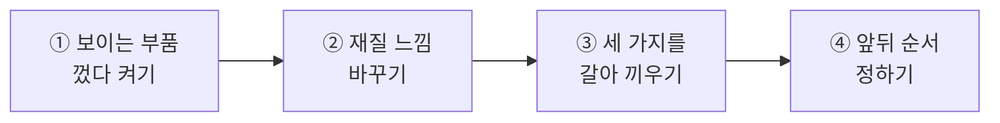
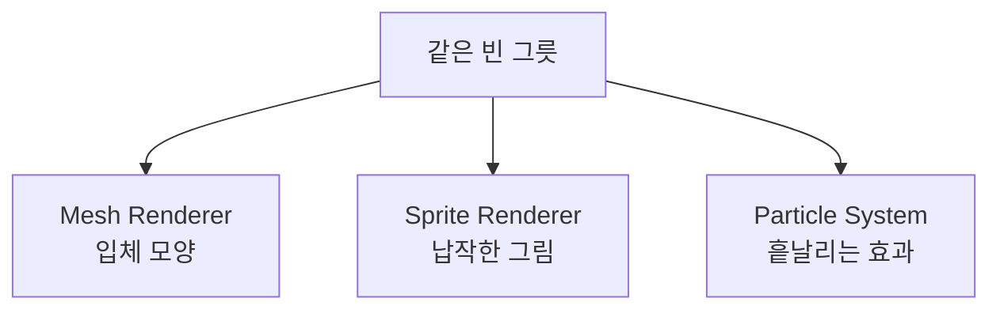
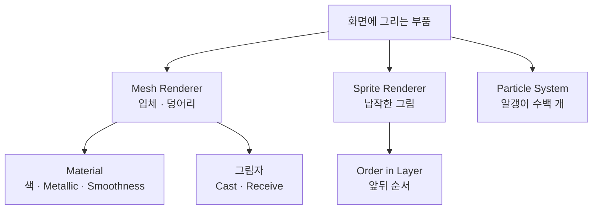

# **16차시. 화면에 그리는 부품들**
---

!!! info "이 자료는 이렇게 보세요"
    - **강의 영상과 함께 보는 자료**입니다. 영상을 따라가시면서 옆에 두고 보시면 됩니다.
    - 이번 차시에도 **코드를 한 줄도 쓰지 않습니다.**
    - 오늘 하실 일은 **체크 껐다 켜기, 값 조절하기, 목록에서 고르기** 정도입니다.
    - 지난 시간에 `Textures` 폴더에 넣어둔 **그림 파일을 씁니다.**

---

## **오늘의 목표**

이번 차시가 끝나면 여러분은 **코드 없이** 이런 것을 하시게 됩니다.

- **보이는 부품을 껐다 켜기** — 물건은 그대로인데 안 보이게
- **금속처럼 / 고무처럼** 재질 느낌 바꾸기
- 같은 자리에서 **입체 · 납작한 그림 · 흩날리는 효과**를 갈아 끼우기



!!! quote "15차시와 오늘의 차이"
    15차시에는 **똑같은 걸 여러 개 만드는 방법**을 배웠습니다.
    오늘은 **화면에 그리는 방식이 여러 가지라는 것**을 배웁니다.

---

## **1. 화면에 그리는 부품에도 종류가 있습니다**

14차시에 **보이는 부품(Mesh Renderer)** 을 붙여서 네모를 나타나게 하셨죠.
그런데 화면에 그리는 부품이 그것만 있는 게 아닙니다.

| 부품 | 무엇을 그리나요 | 어디에 쓰나요 |
| :--- | :--- | :--- |
| **Mesh Renderer** | **입체 모양** | 자동차, 건물, 캐릭터 |
| **Sprite Renderer** | **납작한 그림** | 2D 게임 캐릭터, 아이콘, 간판 |
| **Particle System** | **흩날리는 효과** | 불, 연기, 폭발, 반짝임 |



!!! success "공통점 하나"
    셋 다 **"화면에 그려주는 일"** 을 합니다. 그리는 **방식**만 다를 뿐이에요.

    그래서 셋 다 **떼면 안 보이고, 붙이면 보입니다.** 14차시에 배운 그대로입니다.

!!! note "왜 굳이 나눠져 있나요"
    **잘하는 일이 다르기 때문**입니다.

    - 입체를 그리는 건 **계산이 많이 듭니다.** 납작한 그림이면 충분한데 입체를 쓰면 낭비예요.
    - 불이나 연기처럼 **작은 알갱이가 수백 개** 필요한 건 또 다른 방식이 훨씬 유리합니다.

    지금은 **"목적에 맞는 걸 고른다"** 정도만 아시면 됩니다.

---

## **2. 안 보이게 하는 방법이 두 가지입니다**

이게 처음엔 헷갈립니다. 결과는 비슷해 보이는데 **뜻이 완전히 다릅니다.**

| 방법 | 어떻게 되나요 | 언제 쓰나요 |
| :--- | :--- | :--- |
| **보이는 부품 체크 끄기** | **안 보이지만 그 자리에 있습니다.** 부딪히기도 하고요. | 투명하게 만들고 싶을 때 |
| **물건 자체 체크 끄기** | **통째로 없는 셈** 칩니다. 부딪히지도 않습니다. | 아예 치우고 싶을 때 |

!!! tip "구분하는 자리"
    - **물건 자체 체크**: Inspector **맨 위**, 이름 왼쪽
    - **보이는 부품 체크**: 그 아래 **부품 이름 왼쪽**

    위치가 다릅니다. 실습 ①에서 둘 다 해보시면 바로 구분되실 거예요.

---

## **3. 그림자도 이 부품이 정합니다**

보이는 부품에는 **그림자 설정**이 같이 들어 있습니다.

| 항목 | 무슨 뜻인가요 |
| :--- | :--- |
| **Cast Shadows** | 이 물건이 **그림자를 만들지** |
| **Receive Shadows** | 이 물건이 **다른 그림자를 받을지** |

!!! note "그림자는 공짜가 아닙니다"
    그림자를 그리려면 계산이 꽤 듭니다. 그래서 **끌 수 있게** 만들어져 있어요.

    작은 소품 수십 개가 전부 그림자를 만들 필요는 없거든요.
    지금은 **"끄고 켤 수 있다"** 정도만 아시면 됩니다.

---

## **4. 재료(Material)를 좀 더 깊게**

13차시에 색깔 재료를 만들어보셨죠. 그 재료에는 **색 말고도 조절할 게 더** 있습니다.

| 항목 | 무슨 뜻인가요 | 올리면 |
| :--- | :--- | :--- |
| **Base Map** | 기본 색 | — |
| **Metallic** | **금속 느낌** | 쇠처럼 보입니다 |
| **Smoothness** | **매끈한 정도** | 반들반들 윤이 납니다 |

| 이런 느낌을 원하면 | Metallic | Smoothness |
| :--- | :---: | :---: |
| 고무·플라스틱 | 낮게 | 낮게 |
| 도자기·유리 | 낮게 | 높게 |
| 쇠·금 | 높게 | 높게 |
| 녹슨 쇠 | 높게 | 낮게 |

!!! success "숫자 두 개로 재질이 결정됩니다"
    **금속인가 아닌가**, **매끈한가 거친가**. 이 두 가지면 대부분의 재질이 표현됩니다.
    실습 ②에서 직접 움직여보시면 재밌습니다.

---

## **5. 오늘 사용할 부품 — RendererSwitcher**

강의자료의 **`RendererSwitcher`** 를 씁니다. **세 가지를 갈아 끼워주는 부품**이에요.

### **5.1 조절할 수 있는 값**

| Inspector 항목 | 무슨 뜻인가요 | 어떻게 바꾸나요 |
| :--- | :--- | :--- |
| **Show Mode** | 지금 무엇을 보여줄지 | 목록에서 고르기 (**Mesh · Sprite · Particle · None**) |
| **Mesh Object** | 입체 모양으로 보여줄 물건 | 끌어다 놓기 |
| **Sprite Object** | 납작한 그림으로 보여줄 물건 | 끌어다 놓기 |
| **Particle Object** | 흩날리는 효과로 보여줄 물건 | 끌어다 놓기 |

### **5.2 버튼에 연결할 수 있는 동작**

| 동작 이름 | 무슨 일을 하나요 |
| :--- | :--- |
| **ShowMesh** | 입체 모양만 보이게 |
| **ShowSprite** | 납작한 그림만 보이게 |
| **PlayParticle** | 효과를 보이게 하고 처음부터 재생 |
| **HideAll** | 셋 다 안 보이게 |

!!! tip "두 가지 방법이 다 있습니다"
    - **`Show Mode` 목록에서 고르기** — 만드는 도중에 **▶ 없이 바로 확인**할 때 편합니다.
    - **버튼에 연결하기** — 실행 중에 **눌러서 바꿀 때** 씁니다.

    14차시 마지막에 버튼을 한 번 만들어보셨죠? **오늘 그걸 네 개로 늘립니다.**
    화면을 제대로 만드는 방법은 **17차시부터** 다룹니다. 오늘은 **연결하는 연습**이에요.

---

## **6. 실습 — 직접 해보세요**

영상에서 강사가 "멈추세요"라고 하는 지점에서 아래 순서대로 따라 하시면 됩니다.
**안 되셔도 괜찮습니다.**

---

### **실습 ① — 보이는 부품을 껐다 켜기**

!!! abstract "목표"
    **안 보이게 하는 두 가지 방법**의 차이를 눈으로 확인합니다.

1. **Hierarchy** 우클릭 → `3D Object` → `Cube` 를 만듭니다.
2. 바닥이 있어야 그림자가 보입니다. 우클릭 → `3D Object` → `Plane` 을 만들고
   `Position` 을 **`0, -1, 0`** 으로 맞춥니다.
3. 큐브를 선택하고 Inspector의 **`Mesh Renderer` 체크를 해제**합니다.
   → **안 보입니다. 그런데 Hierarchy에는 그대로 있습니다.**
4. 다시 체크를 켭니다. → 나타납니다.
5. 이번엔 Inspector **맨 위, 이름 왼쪽의 체크**를 해제합니다.
   → **똑같이 안 보입니다.** 그런데 Hierarchy에서 **이름이 흐려집니다.**
6. 다시 켜고, **`Mesh Renderer` 의 `Cast Shadows`** 를 **`Off`** 로 바꿔봅니다.
   → **바닥의 그림자가 사라집니다.** 큐브는 그대로 보이는데요.

??? success "확인해보세요"
    - 3번과 5번, **결과는 같아 보이지만 뜻이 다릅니다.**
      → 3번은 **"몸만 안 보이게"**, 5번은 **"통째로 없는 셈 치기"** 입니다.
    - Hierarchy에서 **이름이 흐려지는지**로 구분할 수 있습니다.
    - 그림자만 껐을 때 큐브는 그대로 보였나요?
      → **그리는 것과 그림자를 만드는 것은 따로 정할 수 있습니다.**

!!! warning "잘 안 되신다면"
    - 그림자가 원래 안 보인다 → **바닥(Plane)** 이 있는지, 큐브가 바닥 위에 떠 있는지 확인해주세요.
    - 그림자가 너무 흐리다 → Hierarchy의 **`Directional Light`** 를 선택하고 `E` 로 방향을 돌려보세요.

---

### **실습 ② — 재질 느낌 바꾸기**

!!! abstract "목표"
    숫자 두 개로 **고무 → 도자기 → 쇠** 로 바꿔봅니다.

1. **Project** 창의 `Materials` 폴더에서 **우클릭 → `Create` → `Material`**
   → 이름을 **`MetalMat`** 으로 바꿉니다.
2. 만든 재료를 **큐브 위로 끌어다 놓습니다.**
3. `MetalMat` 을 클릭하고 Inspector에서 아래를 차례로 해봅니다.

| 순서 | Metallic | Smoothness | 어떻게 보이나요 |
| :---: | :---: | :---: | :--- |
| 1 | `0` | `0` | 고무·플라스틱처럼 |
| 2 | `0` | `0.9` | 도자기처럼 반들반들 |
| 3 | `1` | `0.9` | **쇠처럼** |
| 4 | `1` | `0.2` | 녹슨 쇠처럼 |

4. **`Base Map`** 색도 바꿔보면서 함께 확인합니다.

??? success "확인해보세요"
    - 숫자 두 개만 움직였는데 **완전히 다른 물질처럼** 보이죠?
    - 이게 실제 게임에서 **재질을 만드는 방식**입니다. 그림을 새로 그리는 게 아니라 값을 맞추는 거예요.
    - **마음껏 움직여보세요.** 재료는 언제든 다시 만들 수 있습니다.

!!! warning "잘 안 되신다면"
    - `Metallic` 이나 `Smoothness` 가 안 보인다 → 재료 맨 위의 **`Shader`** 가 `Universal Render Pipeline/Lit` 인지 확인해주세요.
    - 변화가 거의 없다 → **주변에 빛이 있어야** 금속 느낌이 납니다. `Directional Light` 가 씬에 있는지 봐주세요.

---

### **실습 ③ — 세 가지를 갈아 끼우기 (오늘의 핵심)**

!!! abstract "목표"
    같은 자리에서 **입체 · 납작한 그림 · 흩날리는 효과**를 목록으로 갈아 끼웁니다.

#### **1단계 — 세 가지를 만들어 한곳에 모읍니다**

1. **Hierarchy** 우클릭 → `Create Empty` → 이름을 **`Display`** 로, `Position` 을 **`0, 1, 0`** 으로
2. `Display` **위에서 우클릭** → `3D Object` → `Cube` → 이름을 **`ShowMesh`** 로
   → `Display` 의 자식으로 들어갑니다. (14차시에 배운 묶기입니다.)
3. `Display` 위에서 우클릭 → `2D Object` → `Sprites` → `Square` → 이름을 **`ShowSprite`** 로
4. `Display` 위에서 우클릭 → `Effects` → `Particle System` → 이름을 **`ShowParticle`** 로
5. 세 개의 `Position` 을 전부 **`0, 0, 0`** 으로 맞춥니다. → **같은 자리에 겹칩니다.**

#### **2단계 — 부품을 붙이고 연결합니다**

6. **`Display` 를 선택**하고, 강의자료의 **`RendererSwitcher`** 를 **끌어다 놓습니다.**
7. Inspector에 칸 세 개가 나타납니다. **Hierarchy에서 각각 끌어다 놓습니다.**

| 칸 | 여기에 끌어다 놓기 |
| :--- | :--- |
| **Mesh Object** | `ShowMesh` |
| **Sprite Object** | `ShowSprite` |
| **Particle Object** | `ShowParticle` |

#### **3단계 — 목록으로 먼저 확인합니다**

8. **`Show Mode`** 목록을 클릭하고 하나씩 골라봅니다.

| 고르면 | 화면에 |
| :--- | :--- |
| **Mesh** | 입체 네모가 보입니다 |
| **Sprite** | 납작한 흰 사각형이 보입니다 |
| **Particle** | 알갱이가 뿜어져 나옵니다 |
| **None** | 아무것도 안 보입니다 |

9. `ShowSprite` 를 선택하고, 15차시에 넣어둔 **그림 파일을 `Sprite` 칸에 끌어다 놓습니다.**
   → 다시 `Show Mode` 를 `Sprite` 로 하면 **그 그림이 보입니다.**

#### **4단계 — 버튼 네 개로 갈아 끼웁니다**

14차시 마지막에 버튼 하나를 만들어보셨죠. **이번엔 네 개입니다.**

10. **Hierarchy** 우클릭 → `UI` → `Button - TextMeshPro`
11. 버튼을 선택하고 **`Ctrl + D`** 로 **세 번 복제**합니다. → 총 네 개
12. 겹쳐 있으니 각각 선택해서 **`Pos Y`** 를 `60` / `20` / `-20` / `-60` 정도로 나눠 세웁니다.
13. 네 개를 각각 아래 표대로 연결합니다.
    → **`On Click ()`** 의 `+` → **`Display` 를 왼쪽 칸에 끌어다 놓기** → 오른쪽 목록에서 동작 고르기

| 버튼 글자 | 연결할 동작 |
| :--- | :--- |
| 입체 | `RendererSwitcher` → **`ShowMesh`** |
| 그림 | `RendererSwitcher` → **`ShowSprite`** |
| 효과 | `RendererSwitcher` → **`PlayParticle`** |
| 끄기 | `RendererSwitcher` → **`HideAll`** |

14. **▶** 를 누르고 버튼을 하나씩 눌러봅니다.

??? success "무슨 일이 일어났나요"
    **버튼 네 개로 같은 자리의 모습을 갈아 끼우셨습니다.**

    셋 다 **"화면에 그린다"** 는 일을 하지만 방식이 다릅니다.
    - 입체는 **덩어리**로
    - 그림은 **납작한 판**으로
    - 효과는 **알갱이 수백 개**로

    그리고 연결하신 방법은 14차시와 **똑같았습니다.**
    **누가**(Display를 끌어다 놓기) — **무엇을**(목록에서 고르기).

    !!! tip "'효과' 버튼만 다릅니다"
        `PlayParticle` 은 보이게 하는 것에 더해 **처음부터 다시 재생**까지 합니다.
        그래서 여러 번 눌러도 **매번 새로 터집니다.** 눌러서 확인해보세요.

!!! danger "꼭 알아두세요 — 값이 사라지는 이유"
    **▶ 를 누른 상태에서 바꾼 값은, ▶ 를 끄면 전부 사라집니다.**

    오늘은 버튼을 만들고 **▶ 를 눌러 확인**하게 됩니다.
    **만들고 연결하는 작업은 ▶ 가 꺼진 상태에서** 하시고, 확인할 때만 켜주세요.

!!! warning "잘 안 되신다면"
    - 목록을 바꿔도 안 바뀐다 → **세 칸에 물건을 끌어다 놓지 않으신 경우**가 대부분입니다. `None` 으로 보이는 칸이 없는지 확인해주세요.
    - 목록에 `ShowMesh` 같은 동작이 안 보인다 → 13번에서 **`Display` 를 왼쪽 칸에 끌어다 놓지 않으신 경우**입니다. 왼쪽이 `None` 이면 오른쪽 목록이 비어 있습니다.
    - 납작한 그림이 안 보인다 → 카메라가 **옆에서 보고 있으면 종이처럼 얇아서** 안 보입니다. Scene에서 정면으로 돌려보세요.
    - 그림이 회색 사각형으로만 보인다 → 15차시에서 **`Texture Type` 을 `Sprite (2D and UI)`** 로 바꾸셨는지 확인해주세요.

---

### **실습 ④ — 앞뒤 순서 정하기 (선택)**

!!! abstract "목표"
    납작한 그림끼리 **누가 앞에 오는지** 정해봅니다.

1. `ShowSprite` 를 선택하고 **`Ctrl + D`** 로 하나 복제합니다.
2. 복제한 것의 `Position` 을 **`0.3, 0.3, 0`** 으로 옮겨 살짝 겹치게 둡니다.
3. 두 개의 **`Color`** 를 서로 다르게 바꿔 구분되게 합니다.
4. 하나를 선택하고 Inspector의 **`Order in Layer`** 를 **`1`** 로 바꿔봅니다.
   → **앞으로 나옵니다.**
5. `-1` 로 바꾸면 → **뒤로 갑니다.**

??? success "확인해보세요"
    - 숫자가 **클수록 앞**에 그려집니다.
    - 입체는 **위치(Z)로 앞뒤가 정해지는데**, 납작한 그림은 **숫자로 정합니다.** 방식이 달라요.
    - 이건 17차시에 화면(UI)을 만들 때도 비슷하게 쓰입니다.

!!! warning "잘 안 되신다면"
    - 순서가 안 바뀐다 → 두 개가 **정확히 같은 자리에 겹쳐 있으면** 구분이 어렵습니다. 살짝 어긋나게 놓아주세요.

---

## **7. 코드는 딱 한 번만 보고 갑니다**

**외우실 필요도, 치실 필요도 없습니다.** 그냥 구경만 하세요.

```
Show Mode 칸       ──→  [ Show Mode      : Sprite ▼ ]
Mesh Object 칸     ──→  [ Mesh Object    : ShowMesh ]
Sprite Object 칸   ──→  [ Sprite Object  : ShowSprite ]
ShowMesh 동작      ──→  [ 19차시에 버튼에 걸 이름 ]
```

!!! success "결론은 지금까지와 같습니다"
    **Inspector에 보이는 칸은, 코드 어딘가에 대응하는 줄이 하나씩 있습니다.**

    물건을 끌어다 놓는 칸도 마찬가지예요.
    **"어떤 물건을 쓸지"를 코드에 적는 대신, 끌어다 놓는 것**입니다.

---

## **8. 오늘 배운 것을 그림으로**



!!! success "이 그림 하나만 기억하셔도 오늘은 성공입니다"
    - 화면에 그리는 부품은 **세 가지**가 있고, **잘하는 일이 다릅니다.**
    - 입체는 **재료(Material)** 로 재질을 정하고, **그림자**를 켜고 끕니다.
    - 납작한 그림은 **숫자로 앞뒤**를 정합니다.

---

## **9. 정리 문제**

맞히는 게 목적이 아닙니다. **오늘 내용이 머리에 남았는지 확인하는 용도**예요.

### **문제 1**
**보이는 부품 체크를 끄는 것**과 **물건 자체 체크를 끄는 것**은 어떻게 다른가요?

??? success "정답 보기"
    - **보이는 부품 체크 끄기**: **안 보이지만 그 자리에 있습니다.** 부딪히기도 합니다.
    - **물건 자체 체크 끄기**: **통째로 없는 셈** 칩니다. 부딪히지도 않습니다.

    Hierarchy에서 **이름이 흐려지는지**로 구분할 수 있습니다.

### **문제 2**
**Metallic**과 **Smoothness**를 어떻게 맞추면 **쇠처럼** 보이나요?

??? success "정답 보기"
    **Metallic 높게, Smoothness 높게.**

    | 느낌 | Metallic | Smoothness |
    | :--- | :---: | :---: |
    | 고무·플라스틱 | 낮게 | 낮게 |
    | 도자기·유리 | 낮게 | 높게 |
    | 쇠·금 | **높게** | **높게** |
    | 녹슨 쇠 | 높게 | 낮게 |

    **금속인가 아닌가, 매끈한가 거친가.** 이 두 가지로 대부분의 재질이 표현됩니다.

### **문제 3**
불이나 연기 같은 효과는 왜 **Mesh Renderer로 만들지 않나요?**

??? success "정답 보기"
    **작은 알갱이가 수백 개 필요하기 때문**입니다.

    입체 덩어리를 수백 개 그리는 건 계산이 너무 많이 듭니다.
    **Particle System**은 그런 걸 잘하도록 따로 만들어진 부품이에요.

    **목적에 맞는 걸 고른다.** 오늘의 결론입니다.

### **문제 4**
납작한 그림 두 개가 겹쳐 있습니다. **누가 앞에 올지** 어떻게 정하나요?

??? success "정답 보기"
    **`Order in Layer` 숫자로 정합니다.** 숫자가 클수록 앞입니다.

    입체는 **위치(Z)** 로 앞뒤가 정해지는데, 납작한 그림은 **숫자로** 정합니다. 방식이 달라요.

### **문제 5**
그림자를 **끌 수 있게** 만들어둔 이유는 무엇일까요?

??? success "정답 보기"
    **그림자를 그리는 데 계산이 꽤 들기 때문**입니다.

    작은 소품 수십 개가 전부 그림자를 만들 필요는 없습니다.
    필요한 것만 켜두면 **더 부드럽게 돌아갑니다.**

    !!! tip "지금 단계에서는"
        성능을 걱정하실 단계는 아닙니다. **끄고 켤 수 있다는 것만** 알아두세요.

---

## **10. 앞으로 조심할 것**

!!! warning "흔한 실수"
    - **끌어다 놓는 칸을 비워두고 "안 된다"고 하기** → `None` 으로 비어 있는 칸이 없는지 먼저 보세요.
    - **납작한 그림을 옆에서 보고 "안 보인다"고 하기** → 종이처럼 얇아서 옆에서는 안 보입니다.
    - **빛 없이 금속 재질 만들기** → 반사할 빛이 없으면 금속처럼 안 보입니다.

!!! tip "좋은 습관 하나"
    **자식으로 묶어두고 갈아 끼우기.**
    오늘 `Display` 아래에 세 개를 넣어두셨죠. 이렇게 해두면 **위치를 한 번만 맞추면** 됩니다.

---

## **11. 오늘의 정리**

!!! success "세 줄 요약"
    1. 화면에 그리는 부품은 **입체 · 납작한 그림 · 흩날리는 효과** 세 가지가 있다.
    2. **재료(Material)의 숫자 두 개**로 고무부터 쇠까지 표현된다.
    3. **떼면 안 보이고 붙이면 보인다.** 종류가 달라도 원칙은 같다.

오늘 여러분은 **화면에 뭔가를 그리는 방법이 하나가 아니라는 것**을 배우셨습니다.
22차시부터 만들 게임에서 **표적은 입체로, 총구 불꽃은 효과로** 만들게 됩니다. 충분히 잘하셨어요.

---

## **12. 다음 차시 준비**

!!! example "17차시 — 화면 위에 올리는 것들"
    지금까지는 **게임 세상 안에 있는 것**만 다뤘습니다.
    그런데 점수판이나 버튼처럼 **화면에 딱 붙어 있는 것**도 필요하죠.

    다음 시간부터 **화면(UI)** 을 만듭니다.
    휴대폰이든 큰 모니터든 **어디서 봐도 안 깨지는 화면**을 만드는 방법을 배웁니다.

!!! note "미리 해두시면 좋은 것"
    - [ ] 오늘 만든 것을 **`Ctrl + S` 로 저장**해두기
    - [ ] `Textures` 폴더에 **아이콘으로 쓸 만한 그림**을 몇 개 더 넣어두기
    - [ ] 시간이 되시면 **파티클 값을 이것저것 만져보기** (정답 없습니다)

---

## **부록 — 오늘 나온 용어 정리**

| 화면에 보이는 이름 | 우리말로 하면 |
| :--- | :--- |
| **Mesh Renderer** | 입체 모양을 그리는 부품 |
| **Sprite Renderer** | 납작한 그림을 그리는 부품 |
| **Particle System** | 흩날리는 효과를 그리는 부품 |
| **Cast Shadows** | 그림자를 만들지 |
| **Receive Shadows** | 그림자를 받을지 |
| **Material** | 색깔·질감 재료 |
| **Base Map** | 기본 색 |
| **Metallic** | 금속 느낌 |
| **Smoothness** | 매끈한 정도 |
| **Shader** | 재료가 그려지는 방식 |
| **Order in Layer** | 납작한 그림들의 앞뒤 순서 |
| **Plane** | 얇은 바닥판 |
| **Directional Light** | 해처럼 한 방향에서 오는 빛 |
| **2D Object → Sprites** | 납작한 그림 만들기 |
| **Effects → Particle System** | 흩날리는 효과 만들기 |
