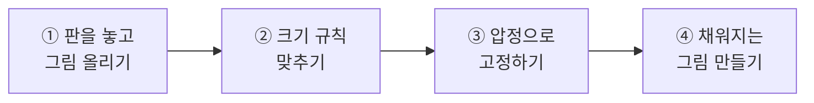
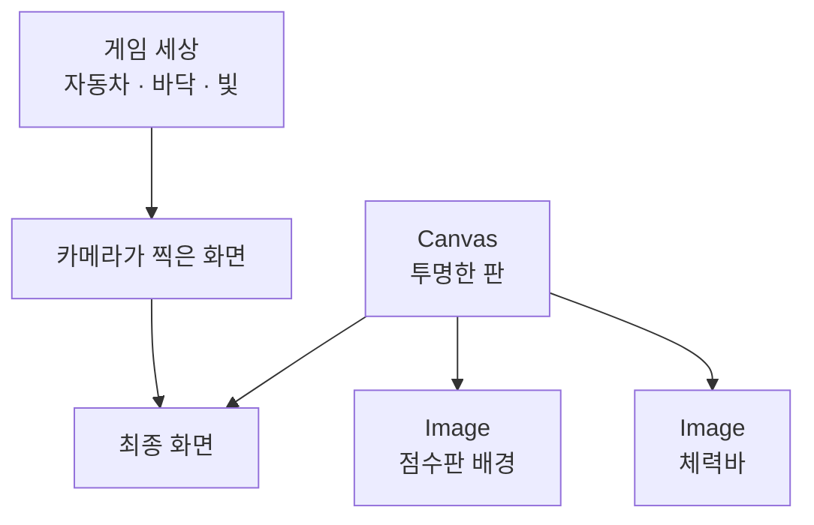
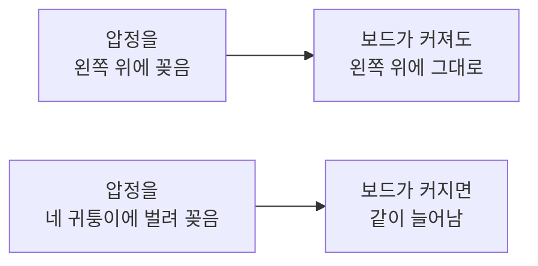
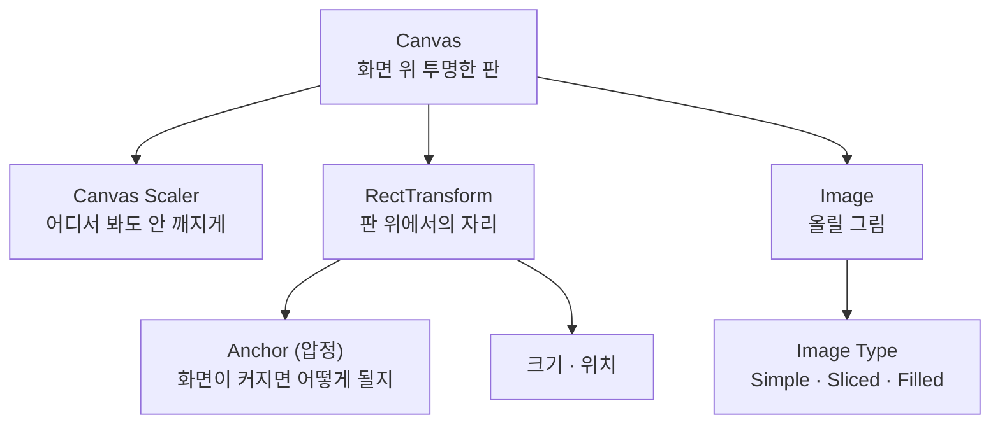

# **17차시. 화면 위에 올리는 것들**
---

!!! info "이 자료는 이렇게 보세요"
    - **강의 영상과 함께 보는 자료**입니다. 영상을 따라가시면서 옆에 두고 보시면 됩니다.
    - 이번 차시에도 **코드를 한 줄도 쓰지 않습니다.**
    - 오늘 하실 일은 **판 만들기, 압정 꽂기, 숫자 맞추기** 정도입니다.
    - 15차시에 넣어둔 **그림 파일을 씁니다.**

---

## **오늘의 목표**

이번 차시가 끝나면 여러분은 **코드 없이** 이런 것을 만드시게 됩니다.

- 화면에 **딱 붙어 있는 그림**
- **화면 크기를 바꿔도 안 깨지는** 배치
- 게임에서 보던 **점수판·체력바 자리가 잡힌 화면 틀(HUD)**



!!! quote "16차시와 오늘의 차이"
    16차시까지는 **게임 세상 안에 있는 것**을 다뤘습니다. 카메라가 움직이면 같이 움직이는 것들이요.
    오늘부터는 **화면에 딱 붙어 있는 것**을 만듭니다. 카메라가 어디를 보든 그 자리에 있는 것들이에요.

---

## **1. 화면 위에 덧대는 투명한 판**

점수판이나 체력바는 **게임 세상 안에 있는 게 아닙니다.** 화면에 붙어 있죠.

그래서 Unity는 **화면 위에 투명한 판을 한 장 덧댑니다.** 이 판을 **Canvas**라고 부릅니다.

| 그림 그리기 | Unity에서는 |
| :--- | :--- |
| 그림을 그리려면 **캔버스**가 필요하죠 | **Canvas** — 화면 위에 덧댄 투명한 판 |
| 캔버스 위에 **그림**을 올립니다 | **Image** — 판 위에 올리는 그림 |
| 그림의 **위치와 크기**를 정하죠 | **RectTransform** — 판 위에서의 자리 |



!!! success "핵심 한 줄"
    **화면에 올릴 것은 전부 Canvas 안에 들어가야 합니다.**
    Canvas 밖에 있으면 **아예 안 보입니다.**

!!! note "Canvas는 저절로 만들어집니다"
    `UI` 메뉴에서 뭔가를 만들면 **Canvas가 없을 때 자동으로 하나 만들어집니다.**
    같이 생기는 **EventSystem** 이라는 것도 있는데, **지금은 몰라도 됩니다.** 19차시에서 다룹니다.

---

## **2. Canvas는 Scene 뷰에서 아주 크게 보입니다**

처음 Canvas를 만들면 **Scene 창에 거대한 사각형**이 생깁니다. 자동차가 점처럼 작아 보이고요.

!!! warning "놀라지 마세요"
    **정상입니다.** 뭔가 잘못된 게 아니에요.

    Canvas는 **화면 픽셀 크기 그대로** 놓이기 때문에, 게임 세상 기준으로는 어마어마하게 큽니다.
    **Scene 창에서만 그렇게 보이는 것**이고, **Game 창에서는 딱 맞게** 나옵니다.

!!! tip "그래서 화면(UI)을 만들 때는"
    **Game 창을 보면서** 작업하시는 게 편합니다.
    Scene 창에서 UI를 만지실 때는 **Canvas를 더블클릭**하면 화면에 딱 맞게 잡아줍니다.

---

## **3. 어디서 봐도 안 깨지게 — Canvas Scaler**

같은 화면을 **휴대폰**에서도 보고 **큰 모니터**에서도 봅니다. 그런데 그냥 두면 **크기가 제멋대로**가 됩니다.

Canvas에는 **Canvas Scaler**라는 부품이 같이 붙어 있습니다. 이게 그 문제를 해결해줍니다.

| 항목 | 무엇을 정하나요 | 이렇게 쓰세요 |
| :--- | :--- | :--- |
| **UI Scale Mode** | 크기를 어떻게 맞출지 | **`Scale With Screen Size`** |
| **Reference Resolution** | 어떤 화면 크기를 기준으로 만들지 | `1920 × 1080` |
| **Match** | 가로와 세로 중 무엇에 맞출지 | **`0.5`** (중간) |

!!! success "이 세 가지만 맞춰두면 됩니다"
    처음 만들면 `UI Scale Mode` 가 **`Constant Pixel Size`** 로 되어 있습니다.
    이건 **화면이 커지면 UI가 상대적으로 작아지는** 방식이에요. 거의 안 씁니다.

    **`Scale With Screen Size` 로 바꾸는 것**, 이게 UI 만들 때 **가장 먼저 하는 일**입니다.

!!! note "Match를 0.5로 두는 이유"
    `0` 이면 가로에만, `1` 이면 세로에만 맞춥니다.
    **`0.5` 는 그 중간**이라 세로로 긴 휴대폰이든 가로로 넓은 모니터든 무난합니다.

    지금은 **0.5로 두고 넘어가시면 됩니다.**

---

## **4. 앵커 — 압정을 어디에 꽂을 것인가**

여기가 오늘 가장 중요한 부분입니다.

**화이트보드에 포스트잇을 붙인다**고 생각해보세요.

| 포스트잇 | Unity에서는 |
| :--- | :--- |
| 화이트보드 | **Canvas** |
| 포스트잇 | **Image** 같은 화면 요소 |
| 포스트잇을 고정한 **압정** | **Anchor (앵커)** |

**누군가 화이트보드를 옆으로 늘린다면?** 포스트잇이 어떻게 될까요.
**압정을 어디에 꽂았느냐에 따라 달라집니다.**



### **두 가지 방식**

| 압정을 이렇게 꽂으면 | 이렇게 됩니다 | 어디에 쓰나요 |
| :--- | :--- | :--- |
| **한 점에 모아서** | 크기는 그대로, **그 모서리에 붙어 있습니다** | 아이콘, 점수판, 버튼 |
| **벌려서** | 화면과 **같이 늘어납니다** | 상단 띠, 배경, 하단 바 |

### **앵커 고르는 곳**

Image를 선택하면 Inspector 맨 위 왼쪽에 **네모난 그림 버튼**이 있습니다. 이게 앵커를 고르는 자리예요.

| 이렇게 하고 싶다면 | 이 프리셋을 고르세요 |
| :--- | :--- |
| 왼쪽 위에 붙이고 싶다 | **`top-left`** |
| 오른쪽 위에 붙이고 싶다 | **`top-right`** |
| 아래 가운데에 붙이고 싶다 | **`bottom-center`** |
| 화면 가로로 꽉 채우고 싶다 | **`top-stretch`** 또는 **`bottom-stretch`** |
| 화면 전체를 채우고 싶다 | **`stretch-stretch`** |

!!! tip "프리셋 창을 열 때"
    프리셋 창에서 **`Alt` 키를 누른 채로** 고르면 **위치까지 같이 맞춰줍니다.**
    손으로 숫자 맞출 필요가 없어요. 오늘 실습에서 써봅니다.

!!! success "핵심 한 줄"
    **압정을 어디에 꽂았느냐가, 화면이 커졌을 때의 운명을 정합니다.**

---

## **5. Image — 판 위에 올리는 그림**

Canvas 위에 그림을 올리는 부품이 **Image**입니다.

| 항목 | 무슨 뜻인가요 |
| :--- | :--- |
| **Source Image** | 어떤 그림을 보여줄지 (비워두면 **흰 사각형**) |
| **Color** | 그림에 입힐 색. 투명도도 여기서 |
| **Image Type** | 그림을 **어떻게 그릴지** |

### **Image Type 네 가지**

| 종류 | 어떻게 그리나요 | 어디에 쓰나요 |
| :--- | :--- | :--- |
| **Simple** | 그냥 늘려서 채웁니다 | 아이콘, 초상화 |
| **Sliced** | **모서리는 그대로 두고** 가운데만 늘립니다 | 버튼 배경, 말풍선 |
| **Tiled** | 무늬처럼 **반복해서** 채웁니다 | 패턴 배경 |
| **Filled** | **일부만 채워서** 보여줍니다 | 체력바, 쿨타임 |

!!! note "Simple에서 그림이 찌그러진다면"
    **`Preserve Aspect`** 에 체크하시면 **원본 비율을 지킵니다.**
    아이콘이 찌그러져 보일 때 이 체크 하나면 해결됩니다.

---

## **6. 실습 — 직접 해보세요**

영상에서 강사가 "멈추세요"라고 하는 지점에서 아래 순서대로 따라 하시면 됩니다.
**안 되셔도 괜찮습니다.**

---

### **실습 ① — 판을 놓고 그림 올려보기**

!!! abstract "목표"
    Canvas를 만들고 그림을 하나 올려서, **Scene과 Game이 어떻게 다른지** 확인합니다.

1. **Hierarchy** 우클릭 → `UI` → `Image`
   → **Canvas와 EventSystem이 자동으로 같이 생깁니다.** 놀라지 마세요.
2. **Scene 창을 봅니다.** → 거대한 사각형이 생겼습니다. **정상입니다.**
3. Hierarchy에서 **`Canvas` 를 더블클릭**합니다. → 화면에 딱 맞게 잡아줍니다.
4. **`Game` 탭**을 클릭합니다. → 화면 가운데에 **흰 사각형**이 보입니다.
5. Game 창 위쪽의 **해상도 목록**을 바꿔봅니다.
   → `Free Aspect` → `16:9` → `Full HD` 등등
   → **흰 사각형의 위치와 크기가 어떻게 변하는지** 봐두세요.

??? success "확인해보세요"
    - Scene에서는 엄청 크게 보이는데 Game에서는 작게 보이죠?
      → **Canvas는 화면 픽셀 크기라서** Scene에서 크게 보이는 겁니다. 정상이에요.
    - 해상도를 바꿨을 때 사각형이 **가운데를 유지**하던가요?
      → 아직 앵커가 **가운데**로 되어 있어서 그렇습니다. 실습 ③에서 바꿔봅니다.
    - 같이 생긴 **EventSystem** 은 **지금 신경 쓰지 않으셔도 됩니다.**

!!! warning "잘 안 되신다면"
    - Scene에서 사각형을 못 찾겠다 → **`Canvas` 를 더블클릭**하거나, 선택 후 **`F` 키**를 누르세요.
    - Game 창에 아무것도 안 보인다 → 만든 `Image` 가 **`Canvas` 의 자식인지** 확인해주세요. 밖에 있으면 안 보입니다.

---

### **실습 ② — 크기 규칙 맞추고 그림 바꾸기**

!!! abstract "목표"
    **어디서 봐도 안 깨지도록** 규칙을 맞추고, 그림을 입혀봅니다.

#### **Canvas Scaler 맞추기**

1. Hierarchy에서 **`Canvas` 를 선택**합니다.
2. Inspector에서 **`Canvas Scaler`** 를 찾습니다.
3. **`UI Scale Mode`** 를 **`Scale With Screen Size`** 로 바꿉니다.
4. **`Reference Resolution`** 을 **`1920 × 1080`** 으로 입력합니다.
5. **`Match`** 슬라이더를 **`0.5`** (가운데)로 맞춥니다.
6. Game 창의 해상도를 다시 바꿔봅니다.
   → 이번엔 **비율을 유지하며 같이 커지고 작아집니다.**

#### **그림 입히기**

7. `Image` 를 선택하고, 15차시에 넣어둔 **그림 파일을 `Source Image` 칸에 끌어다 놓습니다.**
8. **`Color`** 를 클릭해서 색을 바꿔봅니다. → 그림에 색이 입혀집니다.
9. 색 고르는 창의 **`A`(투명도)** 를 내려봅니다. → **반투명해집니다.**
10. 그림이 찌그러져 보이면 **`Preserve Aspect`** 에 체크합니다.

??? success "확인해보세요"
    - 3번을 하기 전과 후, **해상도를 바꿨을 때 느낌이 다르죠?**
      → `Constant Pixel Size` 는 화면이 커지면 UI가 **상대적으로 작아 보입니다.**
      → `Scale With Screen Size` 는 **같이 커집니다.**
    - **UI를 만들 때 가장 먼저 하는 일**이 이겁니다. 앞으로 Canvas를 만들면 바로 해주세요.
    - `Source Image` 가 비어 있으면 **흰 사각형**으로 나옵니다. 그것도 배경으로 유용해요.

!!! warning "잘 안 되신다면"
    - 그림을 끌어다 놓을 수 없다 → 15차시에서 **`Texture Type` 을 `Sprite (2D and UI)`** 로 바꾸셨는지 확인해주세요. 안 바꾸면 이 칸에 안 들어갑니다.
    - `Reference Resolution` 을 바꿔도 변화가 없다 → **`Scale With Screen Size`** 로 먼저 바꾸셔야 합니다. 다른 모드에서는 이 칸이 회색이에요.

---

### **실습 ③ — 안 깨지는 화면 틀 만들기 (오늘의 핵심)**

!!! abstract "목표"
    **압정을 제대로 꽂아서**, 화면 크기가 바뀌어도 자리가 안 흐트러지는 틀을 만듭니다.

#### **1단계 — 네 개를 만듭니다**

1. `Canvas` 위에서 **우클릭 → `UI` → `Image`** 를 **네 번** 반복합니다.
2. 이름을 알아보기 쉽게 바꿉니다. (`F2`)
   → **`HealthBar`**, **`ScoreBox`**, **`TopBar`**, **`BottomBar`**
3. 넷의 **`Color`** 를 서로 다르게 해서 구분되게 합니다.

#### **2단계 — 압정을 꽂습니다**

각각을 선택하고, Inspector **맨 위 왼쪽의 네모 버튼**을 눌러 아래대로 고릅니다.
**`Alt` 를 누른 채로** 고르면 위치까지 같이 맞춰집니다.

| 이름 | 앵커 프리셋 | 그다음 할 일 |
| :--- | :--- | :--- |
| **HealthBar** | `top-left` | `Width` `300`, `Height` `40` |
| **ScoreBox** | `top-right` | `Width` `200`, `Height` `60` |
| **TopBar** | `top-stretch` | `Left` `0`, `Right` `0`, `Height` `80` |
| **BottomBar** | `bottom-stretch` | `Left` `0`, `Right` `0`, `Height` `120` |

4. `HealthBar` 와 `ScoreBox` 는 모서리에서 조금 띄웁니다.
   → `Pos X`, `Pos Y` 를 `±20` 정도로 조정하세요.

#### **3단계 — 진짜 되는지 확인합니다**

5. **Game 창의 해상도 목록**을 여러 번 바꿔봅니다.
   → `16:9` → `4:3` → `Full HD` → `세로로 긴 해상도`
6. 네 개가 **각자 자리를 지키는지** 봅니다.

??? success "무슨 일이 일어났나요"
    **해상도를 아무리 바꿔도 자리가 안 흐트러집니다.**

    - `HealthBar` 는 **항상 왼쪽 위**에
    - `ScoreBox` 는 **항상 오른쪽 위**에
    - `TopBar` 와 `BottomBar` 는 **화면 너비에 맞춰 같이 늘어납니다**

    **압정을 어디에 꽂았느냐가 전부입니다.**

    !!! tip "앵커를 안 바꿨다면"
        전부 가운데에 몰려 있다가, 해상도가 바뀌면 **제멋대로 흩어졌을 겁니다.**
        실제로 한번 `center` 로 되돌려서 확인해보셔도 좋습니다.

!!! danger "꼭 알아두세요 — 값이 사라지는 이유"
    **▶ 를 누른 상태에서 만든 것과 바꾼 값은, ▶ 를 끄면 전부 사라집니다.**

    화면을 만들 때는 **▶ 를 켜지 않아도** 결과가 다 보입니다.
    **▶ 가 꺼진 상태에서 작업하시는 게 안전합니다.**

!!! warning "잘 안 되신다면"
    - 앵커를 바꿨는데 물건이 이상한 데로 갔다 → **`Alt` 를 누른 채로** 프리셋을 고르시면 위치까지 맞춰집니다.
    - `Width` / `Height` 칸이 회색이라 못 고친다 → **stretch 앵커**를 쓰면 그 방향은 `Left`/`Right` 로 정합니다. 정상입니다.
    - 만든 게 Canvas 밖에 나갔다 → Hierarchy에서 **`Canvas` 안으로 끌어다 넣어주세요.**

---

### **실습 ④ — 채워지는 그림 만들기 (선택)**

!!! abstract "목표"
    체력바처럼 **일부만 채워지는 그림**을 만들어봅니다.

1. `HealthBar` 를 선택합니다.
2. **`Image Type`** 을 **`Filled`** 로 바꿉니다.
3. **`Fill Method`** 를 **`Horizontal`**, **`Fill Origin`** 을 **`Left`** 로 합니다.
4. **`Fill Amount`** 슬라이더를 **`1` → `0`** 으로 천천히 움직여봅니다.
   → **왼쪽부터 줄어듭니다.** 체력바 그대로죠?
5. `Fill Method` 를 **`Radial 360`** 으로 바꿔봅니다.
   → **원형으로 채워집니다.** 스킬 쿨타임에서 보던 그거예요.

??? success "확인해보세요"
    - 슬라이더 하나로 체력바가 되죠?
    - 18차시에 **슬라이더를 움직이면 이 값이 따라 바뀌게** 연결해봅니다.
    - `Fill Amount` 는 **`0` ~ `1`** 사이 값입니다. 절반이면 `0.5` 예요.

!!! warning "잘 안 되신다면"
    - `Fill Amount` 가 안 보인다 → **`Image Type` 을 `Filled`** 로 먼저 바꾸셔야 나타납니다.
    - `Sliced` 를 골랐더니 경고가 뜬다 → 그림에 **테두리 설정(Border)** 이 없어서 그렇습니다. 지금은 `Simple` 이나 `Filled` 만 쓰셔도 충분합니다.

---

## **7. 코드는 딱 한 번만 보고 갑니다**

**외우실 필요도, 치실 필요도 없습니다.** 그냥 구경만 하세요.

```
앵커 (압정 위치)   ──→  [ Anchor Min  X 0    · Y 1   ]
                        [ Anchor Max  X 0    · Y 1   ]
크기               ──→  [ Width  300  · Height 40    ]
채운 정도          ──→  [ Fill Amount : 0.7          ]
```

!!! success "결론은 지금까지와 같습니다"
    **Inspector에 보이는 칸은, 코드 어딘가에 대응하는 줄이 하나씩 있습니다.**

    그런데 오늘 하신 **앵커 프리셋 고르기**는 조금 다릅니다.
    저 숫자 네 개를 **직접 계산해서 넣는 대신**, 그림 버튼 하나로 끝내신 거예요.

!!! quote "그래서 이번에도 결론이 같습니다"
    **눌러서 될 일은, 계산하지 마라.**

---

## **8. 오늘 배운 것을 그림으로**



!!! success "이 그림 하나만 기억하셔도 오늘은 성공입니다"
    - 화면에 올릴 것은 **전부 Canvas 안**에 들어갑니다.
    - **Canvas Scaler** 로 어디서 봐도 안 깨지게 규칙을 정합니다.
    - **앵커(압정)** 를 어디에 꽂느냐가 **화면이 커졌을 때의 운명**을 정합니다.

---

## **9. 정리 문제**

맞히는 게 목적이 아닙니다. **오늘 내용이 머리에 남았는지 확인하는 용도**예요.

### **문제 1**
Canvas를 만들었더니 Scene 창에 **거대한 사각형**이 생겼습니다. 잘못된 걸까요?

??? success "정답 보기"
    **정상입니다.**

    Canvas는 **화면 픽셀 크기 그대로** 놓이기 때문에 게임 세상 기준으로는 어마어마하게 큽니다.
    **Scene 창에서만 그렇게 보이고, Game 창에서는 딱 맞게** 나옵니다.

    화면을 만드실 때는 **Game 창을 보면서** 작업하시는 게 편합니다.

### **문제 2**
UI를 만들 때 **가장 먼저 해야 할 일**은 무엇인가요?

??? success "정답 보기"
    **`Canvas Scaler` 의 `UI Scale Mode` 를 `Scale With Screen Size` 로 바꾸는 것**입니다.

    - `Reference Resolution` 은 `1920 × 1080`
    - `Match` 는 `0.5`

    처음 만들면 `Constant Pixel Size` 로 되어 있는데, 이건 **화면이 커지면 UI가 상대적으로 작아지는** 방식이라 거의 안 씁니다.

### **문제 3**
**앵커(Anchor)** 를 한마디로 하면?

??? success "정답 보기"
    **포스트잇을 고정하는 압정**입니다.

    - **한 점에 모아 꽂으면**: 크기 그대로, 그 모서리에 붙어 있습니다
    - **벌려서 꽂으면**: 화면과 같이 늘어납니다

    **압정을 어디에 꽂았느냐가, 화면이 커졌을 때의 운명을 정합니다.**

    !!! tip "이 답이 잘 안 떠오르셨다면"
        영상에서 **해상도를 바꿔가며 확인하는 파트**를 한 번 더 보시는 걸 권합니다.
        여기서 안 잡히면 18·19차시 화면 만들기가 계속 어긋납니다.

### **문제 4**
체력바처럼 **일부만 채워지는 그림**을 만들려면?

??? success "정답 보기"
    **`Image Type` 을 `Filled` 로** 바꾸고, **`Fill Amount`** 를 조절합니다.

    - `Fill Method` 로 **채워지는 방향**을 정합니다 (가로 / 세로 / 원형)
    - `Fill Amount` 는 **`0` ~ `1`** 사이 값입니다

    18차시에 **슬라이더와 연결**해봅니다.

### **문제 5**
아이콘이 **찌그러져 보입니다.** 어떻게 할까요?

??? success "정답 보기"
    **`Preserve Aspect` 에 체크**하시면 됩니다. 원본 비율을 지켜줍니다.

    체크 하나로 해결되는 문제라, **찌그러진 아이콘을 보면 여기부터** 확인해보세요.

---

## **10. 앞으로 조심할 것**

!!! warning "흔한 실수"
    - **Canvas 밖에 UI를 만들기** → 아예 안 보입니다. Hierarchy에서 안으로 넣어주세요.
    - **Canvas Scaler를 안 맞추고 배치하기** → 나중에 해상도 바꾸면 전부 어긋납니다.
    - **앵커를 그대로 두고 위치만 맞추기** → 화면 크기가 바뀌는 순간 무너집니다.
    - **Scene 창에서만 확인하기** → **Game 창**이 진짜입니다.

!!! tip "좋은 습관 두 개"
    - **Canvas를 만들면 바로 Scaler부터 맞추기.**
    - **배치가 끝나면 해상도를 두세 번 바꿔서 확인하기.** 여기서 안 깨지면 진짜 된 겁니다.

---

## **11. 오늘의 정리**

!!! success "세 줄 요약"
    1. 화면에 올릴 것은 **전부 Canvas 안**에 들어간다.
    2. **Canvas Scaler**를 `Scale With Screen Size` 로 맞추는 것이 UI의 첫 단추다.
    3. **앵커는 압정이다.** 어디에 꽂았느냐가 화면이 커졌을 때를 정한다.

오늘 여러분은 **어디서 봐도 안 깨지는 화면 틀**을 만드셨습니다.
22차시부터 만들 게임의 **점수판과 체력바가 여기에 올라갑니다.** 충분히 잘하셨어요.

---

## **12. 다음 차시 준비**

!!! example "18차시 — 누르고 움직이는 것들"
    오늘 만든 틀은 **보기만 하는 것**이었습니다. 다음 시간에는 **만질 수 있는 것**을 올립니다.

    **버튼**을 눌러 뭔가를 실행하고, **슬라이더**를 움직이면 **숫자가 따라 바뀌는** 화면을 만듭니다.
    14 · 16차시에 맛보기로 써본 버튼을, 이번엔 **제대로** 다룹니다.

!!! note "미리 해두시면 좋은 것"
    - [ ] 오늘 만든 **화면 틀을 `Ctrl + S` 로 저장**해두기 (다음 시간에 그대로 씁니다)
    - [ ] `HealthBar` 를 **`Filled`** 로 바꿔두기 (실습 ④를 건너뛰셨다면 지금 해두세요)
    - [ ] 강의자료의 **`ValueDisplay`** 파일이 프로젝트에 들어 있는지 확인

---

## **부록 — 오늘 나온 용어 정리**

| 화면에 보이는 이름 | 우리말로 하면 |
| :--- | :--- |
| **Canvas** | 화면 위에 덧댄 투명한 판 |
| **Canvas Scaler** | 어디서 봐도 안 깨지게 하는 부품 |
| **UI Scale Mode** | 크기를 맞추는 방식 |
| **Scale With Screen Size** | 화면 크기에 맞춰 같이 커지기 |
| **Reference Resolution** | 기준으로 삼을 화면 크기 |
| **Match** | 가로와 세로 중 무엇에 맞출지 |
| **RectTransform** | 판 위에서의 자리와 크기 |
| **Anchor** | 압정 — 어디에 고정할지 |
| **Pivot** | 크기·회전의 기준점 |
| **Stretch** | 화면과 같이 늘어나기 |
| **Image** | 판 위에 올리는 그림 |
| **Source Image** | 어떤 그림을 쓸지 |
| **Preserve Aspect** | 원본 비율 지키기 |
| **Image Type** | 그림을 어떻게 그릴지 |
| **Filled / Fill Amount** | 일부만 채우기 / 채운 정도 |
| **EventSystem** | (19차시에서 다룸) |
