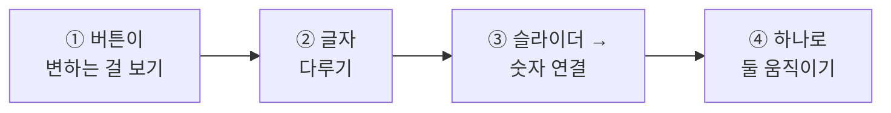
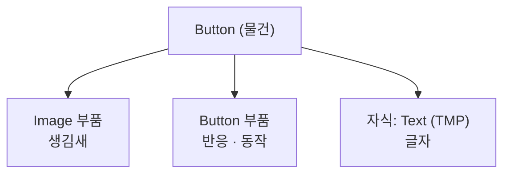
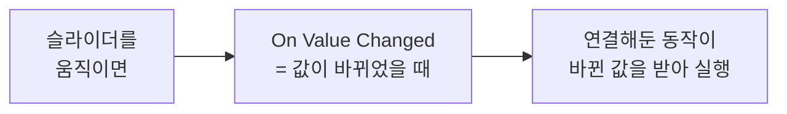
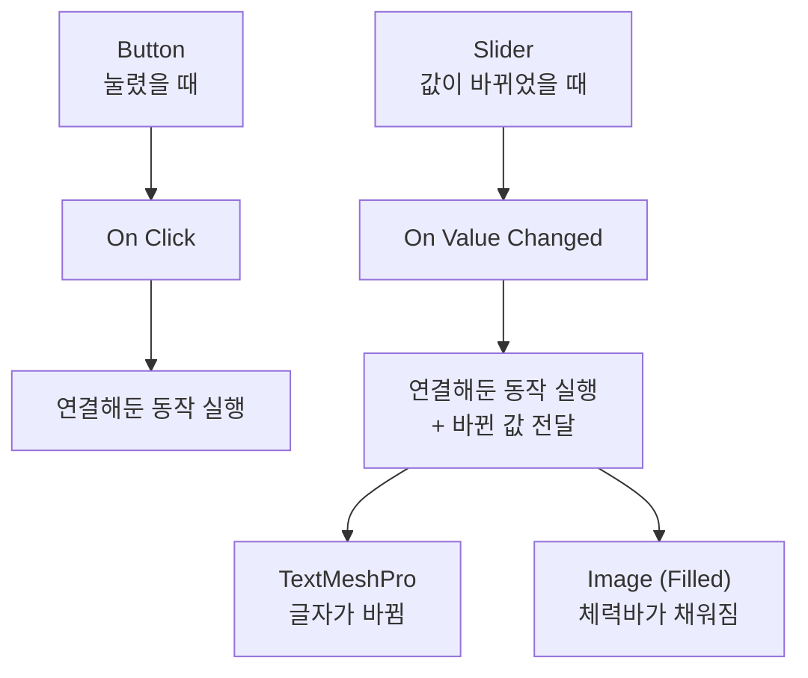

# **18차시. 누르고 움직이는 것들**
---

!!! info "이 자료는 이렇게 보세요"
    - **강의 영상과 함께 보는 자료**입니다. 영상을 따라가시면서 옆에 두고 보시면 됩니다.
    - 이번 차시에도 **코드를 한 줄도 쓰지 않습니다.**
    - 오늘 하실 일은 **색 고르기, 숫자 범위 정하기, 목록에서 고르기** 정도입니다.
    - 17차시에 만든 **화면 틀을 그대로 씁니다.** 저장해두셨죠?

---

## **오늘의 목표**

이번 차시가 끝나면 여러분은 **코드 없이** 이런 것을 만드시게 됩니다.

- **누르면 색이 변하는** 버튼
- **한글이 예쁘게 나오는** 글자
- **슬라이더를 움직이면 숫자가 따라 바뀌는** 패널
- **슬라이더 하나로 숫자와 체력바가 같이** 움직이는 화면



!!! quote "17차시와 오늘의 차이"
    17차시에 만든 건 **보기만 하는 것**이었습니다.
    오늘은 **만질 수 있는 것**을 올립니다. 누르고, 끌고, 값이 바뀌는 것들이요.

---

## **1. 버튼은 '보이는 것'과 '하는 일'이 따로입니다**

14차시와 16차시에 버튼을 만들어보셨죠. 그런데 그때는 **연결만** 했습니다.
오늘은 버튼 **자체**를 들여다봅니다.

버튼 하나에는 두 가지가 들어 있습니다.

| 부품 | 하는 일 |
| :--- | :--- |
| **Image** | 버튼이 **어떻게 생겼는지** (17차시에 배운 그것) |
| **Button** | 버튼이 **어떻게 반응하고 무엇을 하는지** |



!!! note "버튼 안에 글자가 들어 있습니다"
    Hierarchy에서 `Button` 앞의 **삼각형을 펼치면** `Text (TMP)` 가 나옵니다.
    **글자는 버튼의 자식**이에요. 14차시에 배운 부모-자식 그대로입니다.

---

## **2. 누르면 왜 색이 변할까요**

버튼에 마우스를 올리면 색이 살짝 밝아지고, 누르면 어두워집니다. **이건 저절로 되는 게 아니라 설정입니다.**

`Button` 부품의 **`Transition`** 이 그걸 정합니다.

| 상태 | 언제 | Inspector 항목 |
| :--- | :--- | :--- |
| **Normal** | 평소 | `Normal Color` |
| **Highlighted** | 마우스를 올렸을 때 | `Highlighted Color` |
| **Pressed** | 누르고 있을 때 | `Pressed Color` |
| **Disabled** | 못 누르게 막았을 때 | `Disabled Color` |

!!! tip "Interactable 체크를 끄면"
    버튼이 **회색으로 변하고 안 눌립니다.**
    "아직 조건이 안 됐어요"를 보여줄 때 쓰는 방법이에요. 실습 ①에서 해봅니다.

---

## **3. 슬라이더 — 끌어서 값을 정하는 것**

음량 조절처럼 **손잡이를 끌어서 값을 정하는** 부품입니다.

| 항목 | 무슨 뜻인가요 |
| :--- | :--- |
| **Min Value** | 가장 작을 때의 값 |
| **Max Value** | 가장 클 때의 값 |
| **Value** | 지금 값 |
| **Whole Numbers** | 체크하면 **정수로만** 움직입니다 (1, 2, 3…) |

### **슬라이더의 진짜 쓸모 — On Value Changed**

버튼에 `On Click`(눌렸을 때)이 있었죠. 슬라이더에는 **`On Value Changed`**(값이 바뀌었을 때)가 있습니다.



!!! success "버튼과 다른 점 하나"
    버튼은 **"눌렸다"** 만 알려줍니다.
    슬라이더는 **"지금 값이 얼마다"** 까지 같이 넘겨줍니다.

    그래서 슬라이더에 연결하는 동작은 **숫자를 받을 수 있는 것**이어야 합니다.

---

## **4. 글자 — TextMeshPro**

Unity에서 글자를 다루는 부품이 **TextMeshPro**입니다. 줄여서 **TMP**라고도 씁니다.

| 항목 | 무슨 뜻인가요 |
| :--- | :--- |
| **Text Input** | 보여줄 글자 |
| **Font Asset** | 어떤 **글꼴**을 쓸지 |
| **Font Size** | 글자 크기 |
| **Vertex Color** | 글자 색 |
| **Alignment** | 왼쪽 / 가운데 / 오른쪽 정렬 |
| **Auto Size** | 칸에 맞춰 **크기를 알아서** 조절 |

!!! warning "한글이 네모(☐)로 나온다면"
    **글꼴에 그 글자가 없어서** 그렇습니다. 잘못하신 게 아니에요.

    강의자료에 **한글 글꼴**이 들어 있습니다. `Font Asset` 칸에 그걸 끌어다 놓으시면 됩니다.
    12차시에 넣으신 그 꾸러미 안에 있어요.

!!! tip "한 번만 설정해두면 편합니다"
    글자를 만들 때마다 글꼴을 바꾸기 번거로우시면,
    위쪽 메뉴 `Edit` → `Project Settings` → `TextMesh Pro` → **`Default Font Asset`** 에
    한글 글꼴을 지정해두시면 **앞으로 만드는 글자에 기본으로 적용**됩니다.

---

## **5. 오늘 사용할 부품 — ValueDisplay**

강의자료의 **`ValueDisplay`** 를 씁니다. **숫자를 글자로 바꿔서 보여주는 부품**이에요.

### **5.1 조절할 수 있는 값**

| Inspector 항목 | 무슨 뜻인가요 | 어떻게 바꾸나요 |
| :--- | :--- | :--- |
| **Prefix** | 숫자 **앞**에 붙일 글자 | 글자 입력 (예: `점수: `) |
| **Suffix** | 숫자 **뒤**에 붙일 글자 | 글자 입력 (예: ` 점`) |
| **Decimals** | 소수점 아래 자릿수 | `0` 이면 정수로만 |

### **5.2 슬라이더에 연결할 동작**

| 동작 이름 | 무슨 일을 하나요 |
| :--- | :--- |
| **SetValue** | 받은 숫자를 글자로 바꿔서 보여주기 |

!!! note "이 부품은 글자 물건에 붙입니다"
    `ValueDisplay` 는 **글자를 바꾸는 부품**이라, **글자 부품이 붙어 있는 물건**에 같이 붙여야 합니다.
    엉뚱한 데 붙이면 **노란 경고 한 줄**이 뜹니다. 그때 옮겨 붙이시면 돼요.

---

## **6. 실습 — 직접 해보세요**

영상에서 강사가 "멈추세요"라고 하는 지점에서 아래 순서대로 따라 하시면 됩니다.
**안 되셔도 괜찮습니다.**

---

### **실습 ① — 버튼이 변하는 걸 눈으로 보기**

!!! abstract "목표"
    버튼의 **네 가지 상태**를 극단적인 색으로 바꿔서 차이를 확인합니다.

1. 17차시에 만든 화면을 엽니다. `Canvas` 위에서 **우클릭 → `UI` → `Button - TextMeshPro`**
2. 버튼을 선택하고 Inspector에서 **`Button`** 부품을 찾습니다.
3. 색 네 개를 **아주 다르게** 바꿉니다.

| 항목 | 이 색으로 |
| :--- | :--- |
| **Normal Color** | 하양 |
| **Highlighted Color** | 노랑 |
| **Pressed Color** | 빨강 |
| **Disabled Color** | 진회색 |

4. **▶** 를 누르고 Game 화면에서 버튼에 **마우스를 올렸다 눌렀다** 해봅니다.
   → **노랑 → 빨강** 으로 변합니다.
5. ▶ 를 끄고, **`Interactable`** 체크를 **해제**한 뒤 다시 ▶
   → **진회색이 되고 안 눌립니다.**

??? success "확인해보세요"
    - 마우스를 올렸을 때와 눌렀을 때 **색이 달랐나요?**
      → 이게 **`Transition`** 이 하는 일입니다. 저절로 되는 게 아니라 **설정**이에요.
    - `Interactable` 을 끄니 안 눌렸나요?
      → 게임에서 **"아직 못 누릅니다"** 를 보여줄 때 이렇게 합니다.
    - 색은 나중에 원래대로 돌려두셔도 되고, 그대로 두셔도 됩니다.

!!! warning "잘 안 되신다면"
    - 색이 안 변한다 → `Transition` 이 **`Color Tint`** 로 되어 있는지 확인해주세요. `None` 이면 아무 반응도 안 합니다.
    - Game 화면에서 버튼이 안 눌린다 → Hierarchy에 **`EventSystem`** 이 있는지 확인해주세요. **19차시에서 자세히 다룹니다.**

---

### **실습 ② — 글자 다루기**

!!! abstract "목표"
    **한글이 제대로 나오게** 하고, 크기·색·정렬을 맞춰봅니다.

1. 17차시에 만든 **`ScoreBox`** 위에서 **우클릭 → `UI` → `Text - TextMeshPro`**
   → 이름을 **`ScoreText`** 로 바꿉니다.
2. Inspector의 **`Text Input`** 칸에 **`점수: 0`** 이라고 입력합니다.
3. 한글이 **네모(☐)** 로 나오면, **`Font Asset`** 칸에 강의자료의 **한글 글꼴**을 끌어다 놓습니다.
4. 값을 맞춰봅니다.

| 항목 | 이렇게 |
| :--- | :--- |
| **Font Size** | `36` |
| **Vertex Color** | 잘 보이는 색으로 |
| **Alignment** | 가로 **가운데**, 세로 **가운데** |

5. **`Auto Size`** 에 체크하고 `ScoreText` 의 크기를 줄였다 늘려봅니다.
   → **글자 크기가 알아서 따라옵니다.**

??? success "확인해보세요"
    - 한글이 제대로 나오나요? → 안 나오면 **글꼴 문제**입니다. 여러분 잘못이 아니에요.
    - `Auto Size` 를 켜니 편하죠? → 칸 크기가 바뀌어도 글자가 안 잘립니다.
    - 정렬 버튼이 **가로 한 줄, 세로 한 줄**로 나뉘어 있는 걸 확인해보세요. 둘 다 맞춰야 정중앙입니다.

!!! warning "잘 안 되신다면"
    - 글자가 안 보인다 → `ScoreBox` 보다 **글자가 뒤에 있거나**, 색이 배경과 같을 수 있습니다. `Vertex Color` 를 바꿔보세요.
    - 글자가 잘린다 → 칸이 좁아서 그렇습니다. **`Auto Size`** 를 켜거나 칸을 넓혀주세요.

---

### **실습 ③ — 슬라이더로 숫자 바꾸기 (오늘의 핵심)**

!!! abstract "목표"
    **슬라이더를 움직이면 숫자가 따라 바뀌는** 패널을 만듭니다.

#### **1단계 — 슬라이더를 놓습니다**

1. `Canvas` 위에서 **우클릭 → `UI` → `Slider`**
2. 화면 아래쪽 잘 보이는 자리로 옮깁니다. (17차시의 `BottomBar` 위쪽이 좋습니다.)
3. Inspector에서 값을 맞춥니다.

| 항목 | 값 |
| :--- | :--- |
| **Min Value** | `0` |
| **Max Value** | `100` |
| **Value** | `50` |
| **Whole Numbers** | ☑ 체크 |

#### **2단계 — 글자에 부품을 붙입니다**

4. 실습 ②에서 만든 **`ScoreText` 를 선택**합니다.
5. 강의자료의 **`ValueDisplay`** 를 **끌어다 놓습니다.**
6. Inspector에서 값을 맞춥니다.

| 항목 | 값 |
| :--- | :--- |
| **Prefix** | `점수: ` |
| **Suffix** | ` 점` |
| **Decimals** | `0` |

#### **3단계 — 슬라이더와 글자를 연결합니다**

7. **`Slider` 를 선택**하고 Inspector를 아래로 내려 **`On Value Changed (Single)`** 를 찾습니다.
8. **`+`** 를 클릭합니다.
9. **`ScoreText` 를 왼쪽 칸에 끌어다 놓습니다.** ← **누가**
10. 오른쪽 목록 → **`ValueDisplay`** → **`SetValue`** 를 고릅니다. ← **무엇을**

    !!! tip "목록이 두 부분으로 나뉘어 있습니다"
        위쪽이 **`Dynamic float`**, 아래쪽이 **`Static Parameters`** 입니다.
        **반드시 위쪽(`Dynamic float`)의 `SetValue`** 를 고르세요.

        아래쪽을 고르면 **슬라이더 값이 아니라 미리 적어둔 고정 숫자**가 들어갑니다.

11. **▶** 를 누르고 슬라이더를 끌어봅니다.

??? success "무슨 일이 일어났나요"
    **슬라이더를 움직이는 대로 글자가 따라 바뀝니다.**

    `점수: 0 점` → `점수: 37 점` → `점수: 100 점`

    버튼의 `On Click` 과 **똑같은 방식**으로 연결했습니다.
    다른 점은 하나뿐이에요. **슬라이더는 "지금 값이 얼마다"까지 같이 넘겨줍니다.**

    !!! tip "이게 게임에서 어떻게 쓰이냐면"
        음량 조절, 밝기 조절, 캐릭터 만들기 화면의 키·얼굴 조절.
        **전부 이 구조입니다.**

!!! danger "꼭 알아두세요 — 값이 사라지는 이유"
    **▶ 를 누른 상태에서 바꾼 값은, ▶ 를 끄면 전부 사라집니다.**

    슬라이더를 확인하려면 ▶ 를 눌러야 하죠.
    **연결하고 값을 맞추는 작업은 ▶ 가 꺼진 상태에서** 하시고, 확인할 때만 켜주세요.

!!! warning "잘 안 되신다면"
    - 목록에 `SetValue` 가 안 보인다 → 9번에서 **`ScoreText` 를 안 끌어다 놓으신 경우**입니다. 왼쪽이 `None` 이면 목록이 비어 있습니다.
    - 슬라이더를 움직여도 숫자가 **안 바뀌고 그대로** → **아래쪽(`Static Parameters`)의 `SetValue`** 를 고르신 겁니다. 위쪽 **`Dynamic float`** 으로 다시 골라주세요.
    - 노란 경고가 뜬다 → `ValueDisplay` 를 **글자가 없는 물건**에 붙이신 겁니다. `ScoreText` 에 붙여주세요.

---

### **실습 ④ — 하나를 움직여 둘을 바꾸기 (선택)**

!!! abstract "목표"
    **슬라이더 하나로 숫자와 체력바를 동시에** 움직입니다.

1. 17차시에 만든 **`HealthBar`** 를 선택합니다.
   → `Image Type` 이 **`Filled`** 인지 확인합니다. 아니면 바꿔주세요.
2. **`Slider` 를 선택**하고, `On Value Changed` 에서 **`+`** 를 눌러 **칸을 하나 더** 만듭니다.
3. **`HealthBar` 를 왼쪽 칸에 끌어다 놓습니다.**
4. 오른쪽 목록 → **`Image`** → **`Fill Amount`** (위쪽 `Dynamic float`)
5. `Slider` 의 **`Max Value`** 를 **`1`** 로 바꿉니다.
   → `Fill Amount` 는 **`0` ~ `1`** 사이 값이라서요.
6. **▶** 를 누르고 슬라이더를 끌어봅니다.

??? success "확인해보세요"
    - **숫자와 체력바가 같이 움직이나요?**
      → `On Value Changed` 에 **칸을 여러 개 만들면 한꺼번에 실행**됩니다.
    - 14차시의 `On Stopped` 도 이런 식이었죠. **하나가 일어나면 여러 개를 같이 실행하는 것**, 이게 이벤트 연결입니다.
    - 숫자가 `0`, `1` 만 나온다면 → `Whole Numbers` 체크를 **해제**하고 `Decimals` 를 `2` 로 해보세요.

!!! warning "잘 안 되신다면"
    - 체력바가 안 채워진다 → `Image Type` 이 **`Filled`** 인지, `Max Value` 가 **`1`** 인지 확인해주세요.
    - 목록에 `Fill Amount` 가 없다 → `HealthBar` 에 **`Image` 부품**이 있는지 확인해주세요.

---

## **7. 코드는 딱 한 번만 보고 갑니다**

**외우실 필요도, 치실 필요도 없습니다.** 그냥 구경만 하세요.

```
Prefix 칸    ──→  [ Prefix   : 점수:  ]
Suffix 칸    ──→  [ Suffix   :  점    ]
Decimals 칸  ──→  [ Decimals : 0      ]
SetValue 동작 ──→ [ 슬라이더가 넘겨준 숫자를 받는 자리 ]
```

!!! success "오늘은 하나가 더 있습니다"
    지금까지 버튼에 연결한 동작은 **아무것도 안 받았습니다.** 그냥 "실행해라" 였죠.

    그런데 **`SetValue` 는 숫자를 하나 받습니다.**
    그래서 목록에 **`Dynamic float`** 이라는 칸이 따로 있었던 거예요.
    **"슬라이더가 넘겨주는 값을 그대로 받아라"** 는 뜻입니다.

!!! quote "결론"
    **넘겨줄 게 있으면 Dynamic, 미리 정한 값을 쓰려면 Static.**
    이것만 구분하시면 됩니다.

---

## **8. 오늘 배운 것을 그림으로**



!!! success "이 그림 하나만 기억하셔도 오늘은 성공입니다"
    - **버튼**은 "눌렸다"만 알려줍니다.
    - **슬라이더**는 "지금 값이 얼마다"까지 알려줍니다.
    - 연결 칸을 **여러 개 만들면 한꺼번에** 실행됩니다.

---

## **9. 정리 문제**

맞히는 게 목적이 아닙니다. **오늘 내용이 머리에 남았는지 확인하는 용도**예요.

### **문제 1**
버튼에 마우스를 올리면 색이 변합니다. 이건 저절로 되는 걸까요?

??? success "정답 보기"
    **아닙니다. `Transition` 설정입니다.**

    | 상태 | 언제 |
    | :--- | :--- |
    | Normal | 평소 |
    | Highlighted | 마우스를 올렸을 때 |
    | Pressed | 누르고 있을 때 |
    | Disabled | 못 누르게 막았을 때 |

    `Transition` 을 `None` 으로 하면 **아무 반응도 안 합니다.**

### **문제 2**
**버튼**과 **슬라이더**의 결정적인 차이는?

??? success "정답 보기"
    - **버튼**: **"눌렸다"** 만 알려줍니다.
    - **슬라이더**: **"지금 값이 얼마다"** 까지 같이 넘겨줍니다.

    그래서 슬라이더에 연결하는 동작은 **숫자를 받을 수 있는 것**이어야 합니다.

### **문제 3**
슬라이더를 움직였는데 **숫자가 안 바뀌고 그대로**입니다. 왜일까요?

??? success "정답 보기"
    목록에서 **아래쪽 `Static Parameters` 의 `SetValue`** 를 고르셨을 가능성이 큽니다.

    - **위쪽 `Dynamic float`**: 슬라이더가 넘겨주는 값을 받습니다 ✅
    - **아래쪽 `Static Parameters`**: 미리 적어둔 **고정 숫자**가 들어갑니다

    !!! tip "이 답이 잘 안 떠오르셨다면"
        영상에서 **목록을 고르는 파트를 한 번 더** 보시는 걸 권합니다.
        이 구분은 앞으로도 계속 나옵니다.

### **문제 4**
한글이 **네모(☐)** 로 나옵니다. 무엇을 확인해야 할까요?

??? success "정답 보기"
    **`Font Asset` 에 한글 글꼴이 들어 있는지** 확인합니다.

    글꼴에 그 글자가 없으면 네모로 나옵니다. **여러분이 잘못하신 게 아닙니다.**
    강의자료에 한글 글꼴이 들어 있으니 `Font Asset` 칸에 끌어다 놓으시면 됩니다.

### **문제 5**
슬라이더 하나로 **숫자와 체력바를 같이** 움직이려면?

??? success "정답 보기"
    **`On Value Changed` 에 칸을 두 개 만들면 됩니다.**

    - 첫 칸: `ScoreText` → `ValueDisplay` → `SetValue`
    - 둘째 칸: `HealthBar` → `Image` → `Fill Amount`

    **연결 칸을 여러 개 만들면 한꺼번에 실행됩니다.**
    14차시의 `On Stopped` 도 같은 구조였습니다.

---

## **10. 앞으로 조심할 것**

!!! warning "흔한 실수"
    - **`Static Parameters` 쪽을 고르기** → 값이 안 따라옵니다. 오늘 가장 흔한 실수예요.
    - **왼쪽 칸을 비워두고 목록에서 찾기** → 목록이 비어 있습니다.
    - **`ValueDisplay` 를 글자 없는 물건에 붙이기** → 노란 경고가 뜹니다.
    - **한글 안 나온다고 자기 탓 하기** → 글꼴 문제입니다.

!!! tip "좋은 습관 하나"
    **글꼴을 `Project Settings` 에서 기본으로 지정해두기.**
    한 번만 해두면 앞으로 글자를 만들 때마다 안 바꿔도 됩니다.

---

## **11. 오늘의 정리**

!!! success "세 줄 요약"
    1. 버튼의 색 변화는 **저절로가 아니라 `Transition` 설정**이다.
    2. **슬라이더는 값까지 넘겨준다.** 그래서 `Dynamic` 쪽을 골라야 한다.
    3. **연결 칸을 여러 개 만들면 한꺼번에 실행**된다.

오늘 여러분은 **사용자가 만질 수 있는 화면**을 만드셨습니다.
22차시부터 만들 게임의 **난이도 조절 슬라이더와 점수판**이 여기서 나옵니다. 충분히 잘하셨어요.

---

## **12. 다음 차시 준비**

!!! example "19차시 — 화면이 눌리는 원리와 조작 패널"
    오늘 버튼이 눌렸죠. 그런데 **무엇이 그걸 감지하고 있었을까요?**

    다음 시간에는 그 정체를 밝히고, 지금까지 배운 걸 전부 합쳐
    **자동차를 조종하는 조작 패널**을 만듭니다.

!!! note "미리 해두시면 좋은 것"
    - [ ] 오늘 만든 화면을 **`Ctrl + S` 로 저장**해두기
    - [ ] 14차시에 만든 **자동차가 씬에 있는지** 확인 (다음 시간에 조종합니다)
    - [ ] 자동차에 **`CubeSpinner`** 가 붙어 있는지 확인

---

## **부록 — 오늘 나온 용어 정리**

| 화면에 보이는 이름 | 우리말로 하면 |
| :--- | :--- |
| **Button** | 누르는 버튼 |
| **Transition** | 상태에 따라 어떻게 변할지 |
| **Normal / Highlighted / Pressed / Disabled** | 평소 / 올렸을 때 / 누를 때 / 막혔을 때 |
| **Interactable** | 누를 수 있게 할지 |
| **Slider** | 끌어서 값을 정하는 것 |
| **Min / Max Value** | 가장 작은 값 / 가장 큰 값 |
| **Whole Numbers** | 정수로만 움직이기 |
| **On Value Changed** | 값이 바뀌었을 때 |
| **Dynamic float** | 넘겨받은 값을 그대로 쓰기 |
| **Static Parameters** | 미리 정해둔 값을 쓰기 |
| **TextMeshPro (TMP)** | 글자를 다루는 부품 |
| **Font Asset** | 글꼴 |
| **Font Size** | 글자 크기 |
| **Alignment** | 정렬 |
| **Auto Size** | 칸에 맞춰 크기 자동 조절 |
| **Fill Amount** | 채운 정도 |
