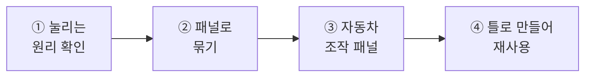
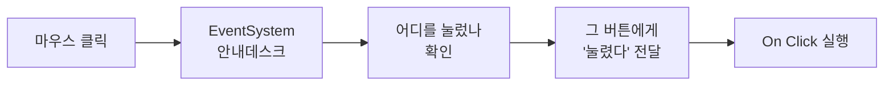
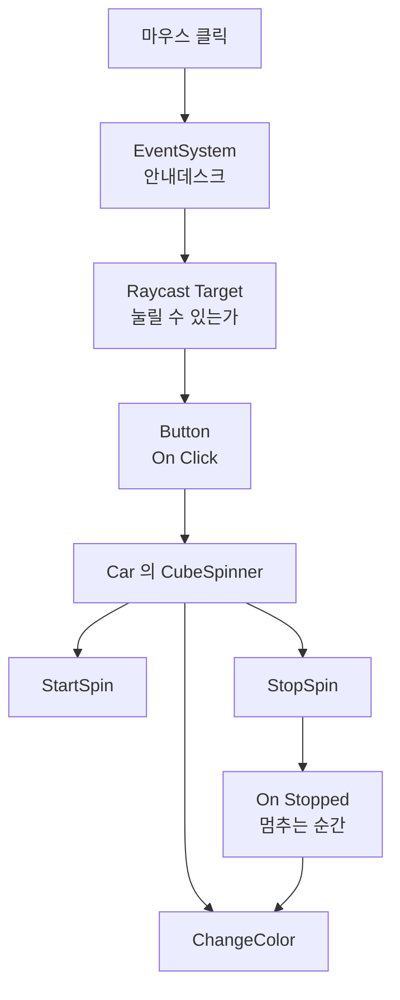

# **19차시. 화면이 눌리는 원리와 조작 패널**
---

> ℹ️ **이 자료는 이렇게 보세요**
>
> - **강의 영상과 함께 보는 자료**입니다. 영상을 따라가시면서 옆에 두고 보시면 됩니다.
> - 이번 차시에도 **코드를 한 줄도 쓰지 않습니다.**
> - 오늘 하실 일은 **지웠다 되살리기, 묶기, 연결하기** 정도입니다.
> - **14차시에 만든 자동차**와 **17·18차시에 만든 화면**을 함께 씁니다.

---

## **오늘의 목표**

이번 차시가 끝나면 여러분은 **코드 없이** 이런 것을 만드시게 됩니다.

- **버튼이 왜 눌리는지** 설명할 수 있습니다
- **버튼 세 개로 자동차를 조종하는 조작 패널**
- 그 패널을 **틀로 만들어 어디서든 다시 쓰기**



> 💬 **18차시와 오늘의 차이**
>
> 18차시에는 화면 요소를 **하나씩** 다뤘습니다.
> 오늘은 **전부 합쳐서 실제로 쓸 수 있는 물건**을 만듭니다. UGUI의 마무리예요.

---

## **1. 버튼은 왜 눌릴까요?**

17차시에 `UI` 로 뭔가를 만들 때, **Canvas 말고 하나가 더** 생겼던 것 기억나시나요?

**`EventSystem`** 이라는 것이었습니다. 그때 "지금은 몰라도 됩니다"라고 넘어갔죠. **오늘 그 정체입니다.**

### **EventSystem = 화면의 안내데스크**

건물에 안내데스크가 있다고 생각해보세요.

| 안내데스크 | Unity에서는 |
| :--- | :--- |
| 손님이 들어오면 **누구를 찾는지** 확인 | 마우스가 클릭한 자리에 **무엇이 있는지** 확인 |
| 맞는 사람에게 **연결해줌** | 그 물건에게 **"눌렸다"고 알려줌** |
| 안내데스크가 없으면 → **아무도 못 만남** | EventSystem이 없으면 → **아무것도 안 눌림** |



> ✅ **핵심 한 줄**
>
> **EventSystem이 없으면 화면의 어떤 것도 안 눌립니다.**
>
> 그래서 Unity가 **UI를 만들 때 자동으로 하나 만들어주는** 것입니다.
> 실습 ①에서 **일부러 지워보고** 확인합니다.

> 📝 **하나면 충분합니다**
>
> 씬에 **하나만** 있으면 됩니다. 여러 개 있어도 소용없어요.
> 자동으로 생기니까 **여러분이 만드실 일은 거의 없습니다.**

---

## **2. 눌리는 것과 안 눌리는 것**

화면에 올린 게 전부 눌리는 건 아닙니다. **눌릴 수 있게 표시된 것만** 눌립니다.

`Image` 를 보면 **`Raycast Target`** 이라는 체크가 있습니다.

| 체크 | 뜻 |
| :--- | :--- |
| ☑ 켜짐 | **"나를 클릭할 수 있다"** — 마우스를 여기서 막습니다 |
| ☐ 꺼짐 | **"나는 통과시킨다"** — 클릭이 뒤로 지나갑니다 |

> ⚠️ **이것 때문에 버튼이 안 눌리는 경우가 많습니다**
>
> 투명한 배경 그림이 버튼 **위에** 덮여 있으면, 클릭이 그 그림에 막혀 **버튼까지 안 갑니다.**
>
> 화면은 멀쩡해 보이는데 안 눌린다면 **위에 뭔가 덮여 있는지** 의심해보세요.

> 💡 **안 눌러도 되는 것은 꺼두세요**
>
> 배경 그림, 장식, 글자처럼 **누를 일이 없는 것**은 `Raycast Target` 을 꺼두는 게 좋습니다.
> 안내데스크가 확인할 게 줄어드니까요.

---

## **3. Panel — 화면 요소를 묶는 그릇**

버튼 세 개, 글자 하나, 배경 하나. 이런 걸 **한 덩어리로 다루고 싶을 때** 쓰는 게 **Panel**입니다.

사실 Panel은 특별한 게 아닙니다. **반투명한 `Image` 가 붙은 빈 그릇**이에요.

| 묶으면 뭐가 좋은가요 | |
| :--- | :--- |
| **한꺼번에 옮기기** | 패널을 옮기면 안의 것이 전부 따라옵니다 |
| **한꺼번에 숨기기** | 패널 체크만 끄면 안의 것이 전부 사라집니다 |
| **한꺼번에 재사용** | 패널을 틀로 만들면 통째로 복제됩니다 |

> ✅ **14차시의 자동차와 똑같습니다**
>
> `Car` 라는 빈 그릇에 몸체와 바퀴를 넣었죠.
> **화면에서도 같은 방식**입니다. 부모에 넣으면 같이 움직입니다.

---

## **4. 오늘 쓸 부품 — 새로 받으실 건 없습니다**

14차시에 쓰던 **`CubeSpinner`** 를 그대로 씁니다.

| 동작 이름 | 무슨 일을 하나요 |
| :--- | :--- |
| **StartSpin** | 돌기 시작 |
| **StopSpin** | 멈추기 |
| **ChangeColor** | 골라둔 색으로 바꾸기 |

| Inspector 항목 | 무슨 뜻인가요 |
| :--- | :--- |
| **Rotation Speed** | 회전 속도 |
| **Target Color** | `ChangeColor` 를 실행할 때 적용할 색 |
| **On Stopped** | **회전이 멈추는 순간** 같이 실행할 동작을 연결하는 자리 |

> 📝 **미리 알아두시면 좋은 것**
>
> `Target Color` 에서 색을 골라도 **바로 바뀌지는 않습니다.**
> `ChangeColor` 가 실행되는 순간에 그 색이 적용됩니다.

---

## **5. 실습 — 직접 해보세요**

영상에서 강사가 "멈추세요"라고 하는 지점에서 아래 순서대로 따라 하시면 됩니다.
**안 되셔도 괜찮습니다.**

---

### **실습 ① — 안내데스크를 없애보기**

> 🎯 **목표**
>
> **EventSystem을 일부러 지워서**, 없으면 어떻게 되는지 확인합니다.

1. 18차시에 만든 화면을 엽니다. **▶** 를 누르고 버튼을 눌러봅니다. → **잘 눌립니다.**
2. ▶ 를 끄고, **Hierarchy에서 `EventSystem` 을 선택 → `Delete`**
3. 다시 **▶** 를 누르고 버튼을 눌러봅니다.
   → **아무 반응이 없습니다.** 색도 안 변하고, 눌리지도 않습니다.
4. Console 창을 보면 **노란 경고**가 떠 있을 수 있습니다. → **읽어보세요.**
5. ▶ 를 끄고 되살립니다. → **`Ctrl + Z`**
   → 또는 **Hierarchy 우클릭 → `UI` → `Event System`**
6. 다시 **▶** → **잘 눌립니다.**

<details>
<summary>✅ 확인해보세요</summary>

- 지웠더니 **아무것도 안 눌렸나요?**
  → **EventSystem이 없으면 화면의 어떤 것도 안 눌립니다.** 이게 오늘의 첫 번째 내용입니다.
- 마우스를 올려도 **색조차 안 변했죠?**
  → 색이 변하는 것도 **"마우스가 올라왔다"를 누군가 알려줘야** 되는 일입니다.
- 앞으로 **"버튼이 안 눌려요"** 할 때 제일 먼저 볼 곳이 여기입니다.

</details>

> ⚠️ **잘 안 되신다면**
>
> - 되살리기가 안 된다 → **Hierarchy 우클릭 → `UI` → `Event System`** 으로 새로 만드시면 됩니다. 설정할 것 없습니다.
> - 지웠는데도 눌린다 → **▶ 를 끄지 않고** 지우신 경우입니다. ▶ 를 끄고 다시 해보세요.

---

### **실습 ② — 통과시키기와 막기**

> 🎯 **목표**
>
> **`Raycast Target`** 을 껐다 켜면서, 클릭이 막히고 통과하는 것을 확인합니다.

1. `Canvas` 위에서 **우클릭 → `UI` → `Image`** 를 하나 만듭니다. 이름을 **`Cover`** 로.
2. **앵커 프리셋**을 **`stretch-stretch`** 로 (`Alt` 누르고) → **화면 전체를 덮습니다.**
3. `Color` 의 **투명도(`A`)를 `50`** 정도로 낮춥니다. → 아래가 비쳐 보입니다.
4. **▶** 를 누르고 버튼을 눌러봅니다.
   → **안 눌립니다.** `Cover` 가 클릭을 막고 있습니다.
5. ▶ 를 끄고, `Cover` 의 **`Raycast Target`** 체크를 **해제**합니다.
6. 다시 **▶** → **이번엔 눌립니다.** 그림은 그대로 덮여 있는데요.

<details>
<summary>✅ 확인해보세요</summary>

- 화면은 똑같은데 **눌리고 안 눌리고가 달라졌죠?**
  → **보이는 것과 눌리는 것은 별개**입니다.
- 앞으로 "화면은 멀쩡한데 안 눌려요" 하면 **위에 뭔가 덮여 있는지** 의심해보세요.
- 확인이 끝나면 `Cover` 는 **지우셔도 됩니다.**

</details>

> ⚠️ **잘 안 되신다면**
>
> - `Cover` 가 화면을 안 덮는다 → 앵커 프리셋을 **`stretch-stretch`** 로, `Alt` 를 누른 채 고르셨는지 확인해주세요.
> - 껐는데도 안 눌린다 → `Cover` 안에 **자식 Image**가 또 있는지 확인해주세요. 자식도 각자 `Raycast Target` 을 가집니다.

---

### **실습 ③ — 자동차 조작 패널 만들기 (오늘의 핵심)**

> 🎯 **목표**
>
> **버튼 세 개로 자동차를 조종하는 패널**을 만듭니다. 오늘의 결과물입니다.

#### **1단계 — 패널을 놓습니다**

1. **Hierarchy에 14차시의 자동차(`Car`)가 있는지** 확인합니다.
   → 없으시면 강의자료의 완성 파일을 쓰셔도 됩니다.
2. `Car` 에 **`CubeSpinner`** 가 붙어 있는지 확인합니다.
3. `Canvas` 위에서 **우클릭 → `UI` → `Panel`** → 이름을 **`ControlPanel`** 로
4. 앵커 프리셋을 **`bottom-center`** (`Alt` 누르고) 로 하고, 크기를 **`Width 600`, `Height 140`** 정도로
5. `Panel` 의 `Color` 투명도를 조절해 **적당히 비치게** 합니다.

#### **2단계 — 버튼 세 개를 넣습니다**

6. **`ControlPanel` 위에서 우클릭 → `UI` → `Button - TextMeshPro`**
   → **패널의 자식으로** 들어갑니다.
7. **`Ctrl + D`** 로 두 번 복제해서 **세 개**를 만듭니다.
8. `Pos X` 를 **`-200`, `0`, `200`** 으로 나눠 나란히 세웁니다.
9. 각 버튼 안의 글자를 바꿉니다. → **회전 시작 · 멈춤 · 색 바꾸기**

#### **3단계 — 자동차에 연결합니다**

10. 버튼을 하나씩 선택하고 **`On Click ()`** 의 **`+`** → **`Car` 를 왼쪽 칸에 끌어다 놓기**
11. 오른쪽 목록에서 **`CubeSpinner`** 아래의 동작을 고릅니다.

| 버튼 글자 | 연결할 동작 |
| :--- | :--- |
| 회전 시작 | **`StartSpin`** |
| 멈춤 | **`StopSpin`** |
| 색 바꾸기 | **`ChangeColor`** |

12. `Car` 를 선택하고 **`Target Color`** 에서 원하는 색을 골라둡니다.
13. **▶** 를 누르고 버튼 세 개를 눌러봅니다.

#### **4단계 — 멈추면 색도 바뀌게**

14. `Car` 를 선택하고 Inspector의 **`On Stopped`** 칸을 찾습니다.
    → 버튼의 `On Click` 과 **똑같이 생겼습니다.**
15. **`+`** → **`Car` 를 끌어다 놓기** → 목록에서 **`ChangeColor`**
16. **▶** 를 누르고 **"멈춤"** 버튼을 클릭합니다.

<details>
<summary>✅ 무슨 일이 일어났나요</summary>

**멈추기도 하고, 색도 같이 바뀌었습니다.** 색 바꾸기 버튼은 누르지도 않았는데요.

**"회전이 멈추면 색을 바꿔라"** 라고 미리 연결해뒀기 때문입니다.

지금 여러분은 **버튼 세 개짜리 조작 패널**을 완성하셨습니다.
**코드는 한 줄도 쓰지 않고요.**

> 💡 **이게 왜 좋은가요**
>
> 나중에 "멈출 때 소리도 나게 하고 싶다", "멈출 때 점수도 올리고 싶다" 하시면
> **`On Stopped` 에 하나씩 더 추가하기만 하면 됩니다.**

</details>

> 🚨 **꼭 알아두세요 — 값이 사라지는 이유**
>
> **▶ 를 누른 상태에서 만든 것과 바꾼 값은, ▶ 를 끄면 전부 사라집니다.**
>
> 오늘은 버튼을 눌러 확인하느라 ▶ 를 자주 켜게 됩니다.
> **만들고 연결하는 작업은 ▶ 가 꺼진 상태에서** 하세요.

> ⚠️ **잘 안 되신다면**
>
> - 버튼이 패널 밖에 생긴다 → **`ControlPanel` 이름 위에서 우클릭**하셔야 자식으로 들어갑니다.
> - 목록에 `StartSpin` 이 안 보인다 → 왼쪽 칸에 **`Car` 를 끌어다 놓지 않으신 경우**입니다.
> - 색이 안 바뀐다 → `Car` 의 **`Target Color`** 를 골라두셨는지 확인해주세요. 기본값이 현재 색과 같으면 변화가 없습니다.
> - 버튼이 아예 안 눌린다 → **`EventSystem`** 이 있는지 확인해주세요. 실습 ①에서 지우고 안 되살리셨을 수 있습니다.

---

### **실습 ④ — 패널을 틀로 만들기 (선택)**

> 🎯 **목표**
>
> 만든 조작 패널을 **틀(Prefab)로 만들어** 언제든 다시 쓸 수 있게 합니다.

1. **`ControlPanel` 을 Project 창의 `Prefabs` 폴더로 끌어다 놓습니다.**
   → 15차시에 자동차로 해보셨던 그것입니다.
2. Hierarchy에서 **이름이 파란색으로** 변한 것을 확인합니다.
3. **`ControlPanel` 을 지웠다가**, `Prefabs` 폴더에서 **다시 끌어다 놓아** 봅니다.
   → **버튼 세 개가 통째로 살아납니다.**
4. `Panel` 자체의 **체크를 껐다 켜** 봅니다.
   → **버튼 세 개가 한꺼번에 사라졌다 나타납니다.**

<details>
<summary>✅ 확인해보세요</summary>

- 패널 하나를 지웠는데 **버튼 세 개가 다 따라갔죠?** → 14차시의 부모-자식 그대로입니다.
- 틀로 만들어두면 **다른 씬에서도 그대로** 쓸 수 있습니다.
- 다만 **버튼에 연결해둔 `Car` 는 따라가지 않습니다.**
  → 씬마다 자동차가 다르니까요. 새 씬에서는 **다시 끌어다 놓아야** 합니다.

</details>

> ⚠️ **잘 안 되신다면**
>
> - 다시 놓았는데 버튼이 자동차를 조종 안 한다 → 위에 적은 그 이유입니다. `On Click` 왼쪽 칸이 `None` 이 되어 있을 거예요. **다시 끌어다 놓으시면 됩니다.**

---

## **6. 코드는 딱 한 번만 보고 갑니다**

**외우실 필요도, 치실 필요도 없습니다.** 그냥 구경만 하세요.

```
버튼 목록의 이름  ──→  [ StartSpin · StopSpin · ChangeColor ]
On Stopped 칸     ──→  [ 멈추는 순간 실행할 목록 ]
```

> ✅ **결론은 지금까지와 같습니다**
>
> **목록에 뜬 이름들은, 코드에 적혀 있는 동작 이름 그대로입니다.**
> 프로그래머가 동작을 하나 만들어두면, 여러분이 고를 수 있는 항목이 하나 늘어납니다.

> 💬 **UGUI 세 차시의 결론**
>
> **화면은 "무엇이 있고(17), 어떻게 반응하고(18), 무엇에 연결되는가(19)" 로 만들어집니다.**
> 셋 다 코드 없이 됩니다.

---

## **7. 오늘 배운 것을 그림으로**



> ✅ **이 그림 하나만 기억하셔도 오늘은 성공입니다**
>
> - **EventSystem** 이 없으면 아무것도 안 눌립니다.
> - **Raycast Target** 이 꺼져 있으면 클릭이 통과합니다.
> - 버튼은 **누가 — 무엇을** 두 개만 고르면 연결됩니다.

---

## **8. 정리 문제**

맞히는 게 목적이 아닙니다. **오늘 내용이 머리에 남았는지 확인하는 용도**예요.

### **문제 1**
버튼이 하나도 안 눌립니다. **가장 먼저 확인할 것**은?

<details>
<summary>✅ 정답 보기</summary>

**Hierarchy에 `EventSystem` 이 있는지** 확인합니다.

EventSystem은 **화면의 안내데스크**입니다.
어디를 눌렀는지 확인해서 그 물건에게 알려주는 역할이에요.
**없으면 화면의 어떤 것도 안 눌립니다.**

없으면 **우클릭 → `UI` → `Event System`** 으로 만들면 됩니다. 설정할 것 없습니다.

</details>

### **문제 2**
화면은 멀쩡한데 **특정 버튼만 안 눌립니다.** 무엇을 의심해야 할까요?

<details>
<summary>✅ 정답 보기</summary>

**그 버튼 위에 뭔가 덮여 있는지** 의심합니다.

투명한 그림이라도 **`Raycast Target` 이 켜져 있으면 클릭을 막습니다.**
보이는 것과 눌리는 것은 **별개**예요.

덮은 것의 `Raycast Target` 을 꺼주면 클릭이 통과합니다.

</details>

### **문제 3**
**Panel**로 묶으면 뭐가 좋은가요?

<details>
<summary>✅ 정답 보기</summary>

**한꺼번에 다룰 수 있습니다.**

- 패널을 옮기면 → 안의 것이 전부 따라옵니다
- 패널 체크를 끄면 → 안의 것이 전부 사라집니다
- 패널을 틀로 만들면 → 통째로 복제됩니다

14차시에 자동차를 `Car` 로 묶었던 것과 **똑같은 원리**입니다.

</details>

### **문제 4**
**"멈춤" 버튼 하나를 눌렀는데 멈추기도 하고 색도 바뀝니다.** 왜일까요?

<details>
<summary>✅ 정답 보기</summary>

**`On Stopped` 에 `ChangeColor` 를 연결해뒀기 때문**입니다.

`On Stopped` 는 **"회전이 멈추는 순간"** 실행할 동작을 연결하는 자리예요.
버튼의 `On Click` 과 **똑같이 생겼습니다.**

나중에 소리나 점수를 추가하고 싶으면 **여기에 하나씩 더 넣으면** 됩니다.

</details>

### **문제 5**
조작 패널을 **틀로 만들어 다른 씬에 놓았습니다.** 버튼이 자동차를 조종할까요?

<details>
<summary>✅ 정답 보기</summary>

**안 합니다.** 다시 연결해야 합니다.

틀에는 **버튼과 글자와 생김새**가 저장됩니다.
그런데 **"어느 자동차를 조종할지"** 는 씬마다 다르기 때문에 따라가지 않습니다.

새 씬에서 `On Click` 왼쪽 칸에 **그 씬의 자동차를 다시 끌어다 놓으시면** 됩니다.

</details>

---

## **9. 앞으로 조심할 것**

> ⚠️ **흔한 실수**
>
> - **EventSystem을 지워놓고 "버튼이 안 눌려요" 하기** → 오늘 배운 그것입니다.
> - **투명한 그림으로 화면을 덮어놓기** → `Raycast Target` 을 꺼주세요.
> - **패널 밖에 버튼 만들기** → 패널 **이름 위에서** 우클릭해야 자식이 됩니다.
> - **틀로 만들면 연결까지 따라간다고 생각하기** → 씬 안의 물건 연결은 안 따라갑니다.

> 💡 **좋은 습관 하나**
>
> **누를 일 없는 것은 `Raycast Target` 을 꺼두기.**
> 배경, 장식, 글자 같은 것들이요. 나중에 원인 모를 "안 눌림"을 미리 막아줍니다.

---

## **10. 오늘의 정리**

> ✅ **세 줄 요약**
>
> 1. **EventSystem이 없으면 화면의 어떤 것도 안 눌린다.**
> 2. **Raycast Target이 켜진 것이 클릭을 막는다.** 보이는 것과 눌리는 것은 별개다.
> 3. **패널로 묶으면 한꺼번에 다룰 수 있다.**

오늘로 **화면 만들기(UGUI) 세 차시가 끝났습니다.**
버튼 세 개로 자동차를 조종하는 것까지 하셨어요. **코드는 여전히 한 줄도 안 쓰셨습니다.** 충분히 잘하셨습니다.

---

## **11. 다음 차시 준비**

> 🧩 **20차시 — X · Y · Z, 드디어**
>
> 14차시에 자동차 바퀴 위치를 맞추면서 이런 생각 하셨죠.
> **"0.55는 어느 쪽이지?", "왜 Z를 90으로 하면 눕지?"**
>
> **다음 시간에 그 답을 드립니다.** 그리고 오늘 만든 것 같은 버튼 패널로
> **물건을 실시간으로 이동·회전·확대**해봅니다.

> 📝 **미리 해두시면 좋은 것**
>
> - [ ] 오늘 만든 **조작 패널을 `Ctrl + S` 로 저장**해두기
> - [ ] `ControlPanel` 을 **틀로 만들어두기** (실습 ④를 건너뛰셨다면 지금 해두세요 — 다음 시간에 재활용합니다)
> - [ ] 강의자료의 **`TransformDriver`** 파일이 프로젝트에 들어 있는지 확인

---

## **부록 — 오늘 나온 용어 정리**

| 화면에 보이는 이름 | 우리말로 하면 |
| :--- | :--- |
| **EventSystem** | 화면의 안내데스크 — 어디를 눌렀는지 확인 |
| **Raycast Target** | 클릭을 막을지 통과시킬지 |
| **Panel** | 화면 요소를 묶는 그릇 |
| **On Click** | 눌렸을 때 |
| **On Stopped** | 회전이 멈추는 순간 |
| **StartSpin / StopSpin / ChangeColor** | 돌기 시작 / 멈추기 / 색 바꾸기 |
| **Target Color** | ChangeColor 로 적용할 색 |
| **Prefab** | 붕어빵 틀 (15차시) |
| **stretch-stretch** | 화면 전체를 덮는 앵커 |
| **bottom-center** | 아래 가운데에 붙이는 앵커 |
