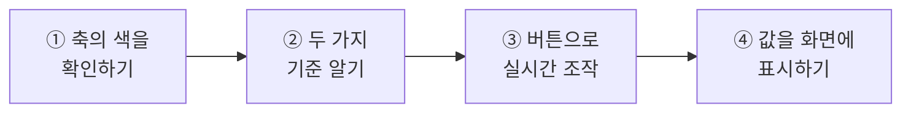
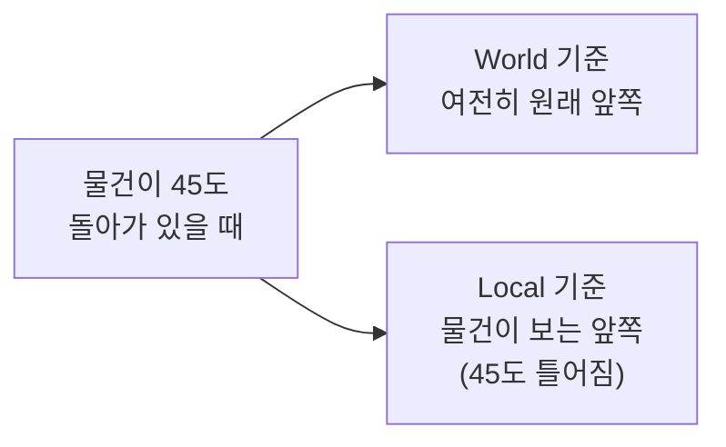
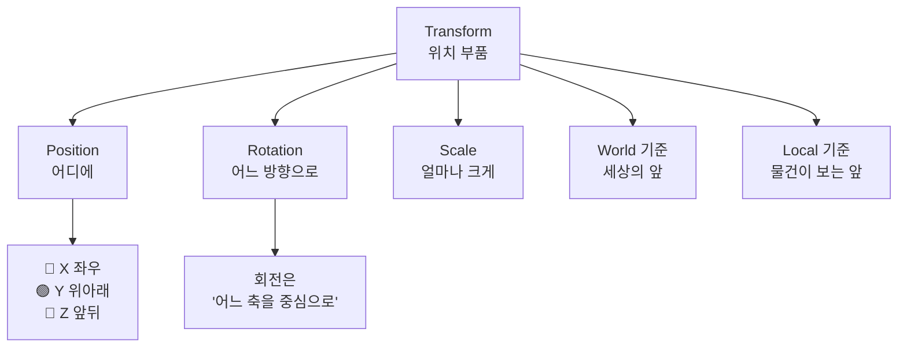

# **20차시. X · Y · Z, 드디어**
---

> ℹ️ **이 자료는 이렇게 보세요**
>
> - **강의 영상과 함께 보는 자료**입니다. 영상을 따라가시면서 옆에 두고 보시면 됩니다.
> - 이번 차시에도 **코드를 한 줄도 쓰지 않습니다.**
> - 오늘 하실 일은 **버튼 누르기, 값 확인하기, 토글 바꾸기** 정도입니다.
> - 19차시에 만든 **조작 패널을 그대로 재활용**합니다.

---

## **오늘의 목표**

14차시에 자동차 바퀴 위치를 맞추면서 이런 생각 하셨죠.

> **"0.55는 어느 쪽이지?"**
> **"왜 Z를 90으로 하면 눕지?"**

**오늘 그 답을 드립니다.**

이번 차시가 끝나면 여러분은 이렇게 되십니다.

- **X · Y · Z가 각각 어느 방향인지** 압니다
- **버튼을 눌러 물건을 실시간으로 옮기고 돌리고 키울 수** 있습니다
- **"돌아간 물건의 앞쪽"** 이 왜 헷갈리는지 압니다



> 💬 **19차시와 오늘의 차이**
>
> 19차시까지는 **화면**을 만들었습니다.
> 오늘부터는 그 화면으로 **게임 세상의 물건을 움직입니다.** 둘이 만나는 지점이에요.

---

## **1. 축은 색으로 기억하세요**

14차시에 이미 보셨습니다. **색깔 화살표**요.

| 색 | 축 | 방향 | 외우는 법 |
| :---: | :---: | :--- | :--- |
| 🔴 **빨강** | **X** | **좌우** | e**X**it — 옆으로 나가는 문 |
| 🟢 **초록** | **Y** | **위아래** | **Y**es — 고개를 위아래로 끄덕 |
| 🔵 **파랑** | **Z** | **앞뒤** | **Z**oom — 앞으로 당겨오기 |

> ✅ **이 표 하나면 오늘의 절반은 끝났습니다**
>
> **빨강은 옆, 초록은 위, 파랑은 앞.**
>
> 외우기 어려우시면 **Scene 창 오른쪽 위의 작은 축 표시**를 보세요.
> 거기에 항상 **X · Y · Z가 색깔과 함께** 떠 있습니다.

### **그래서 14차시의 답은**

| 그때 궁금했던 것 | 답 |
| :--- | :--- |
| **`0.55`는 어느 쪽?** | `Position` 의 **세 번째 칸이 Z**니까 **앞쪽**입니다. `-0.55` 는 뒤쪽이고요. 그래서 바퀴가 좌우로 갈라졌습니다. |
| **왜 Z를 90으로 하면 눕지?** | `Rotation` 의 `Z` 는 **"파란 축을 중심으로 돌린다"** 는 뜻입니다. 앞뒤 축을 중심으로 90도 돌리니 **원기둥이 옆으로 누운** 거예요. |

> 💡 **회전은 '어느 축을 중심으로 도는가'입니다**
>
> `Rotation` 의 `X` · `Y` · `Z` 는 **위치가 아니라 회전 중심축**입니다.
>
> - `Rotation Y` 를 올리면 → **팽이처럼** 제자리에서 돕니다
> - `Rotation X` 를 올리면 → **앞으로 고꾸라집니다**
> - `Rotation Z` 를 올리면 → **옆으로 갸웃합니다**

---

## **2. 기준이 두 가지 있습니다**

여기가 오늘 두 번째로 중요한 부분입니다.

**"앞으로 가라"** 고 하면, 어느 앞일까요?

| 기준 | 뜻 | 비유 |
| :--- | :--- | :--- |
| **World (전체 기준)** | **세상의 앞쪽.** 물건이 어느 방향을 보든 항상 같은 방향 | **북쪽으로 가라** |
| **Local (자기 기준)** | **그 물건이 보고 있는 앞쪽.** 물건이 돌면 같이 돕니다 | **네 앞으로 가라** |



> ✅ **안 돌아간 물건은 둘이 같습니다**
>
> 회전이 `0, 0, 0` 이면 **World와 Local이 똑같습니다.** 차이가 안 보여요.
>
> **물건을 돌려놓고 나서야** 차이가 드러납니다. 실습 ②에서 직접 보실 거예요.

### **Scene 창에서 바꿔볼 수 있습니다**

Scene 창 위쪽에 **`Global` / `Local` 토글**이 있습니다. 눌러서 바꿔보면 **화살표 방향이 달라집니다.**

> 📝 **왜 두 가지가 필요한가요**
>
> - **자동차를 앞으로 몰 때** → **Local** 이 맞습니다. 차가 향한 쪽으로 가야죠.
> - **물건을 하늘로 띄울 때** → **World** 가 맞습니다. 차가 기울어도 위는 위니까요.
>
> **둘 다 필요합니다.** 지금은 "두 가지가 있다"만 아시면 됩니다.

---

## **3. 오늘 사용할 부품 — TransformDriver**

강의자료의 **`TransformDriver`** 를 씁니다. **버튼으로 물건을 움직이는 부품**이에요.

### **3.1 조절할 수 있는 값**

| Inspector 항목 | 무슨 뜻인가요 | 어떻게 바꾸나요 |
| :--- | :--- | :--- |
| **Move Step** | 이동 버튼을 한 번 누를 때 **움직일 거리** | 숫자 입력 |
| **Rotate Step** | 회전 버튼을 한 번 누를 때 **돌아갈 각도** | 숫자 입력 |
| **Scale Step** | 크기 버튼을 한 번 누를 때 **곱해질 배율** | 숫자 입력 (`1.2` 면 20%씩) |

### **3.2 버튼에 연결할 수 있는 동작**

| 동작 이름 | 무슨 일을 하나요 |
| :--- | :--- |
| **MoveXPlus** / **MoveXMinus** | 🔴 **좌우**로 움직이기 |
| **MoveYPlus** / **MoveYMinus** | 🟢 **위아래**로 움직이기 |
| **MoveZPlus** / **MoveZMinus** | 🔵 **앞뒤**로 움직이기 |
| **RotateYPlus** / **RotateYMinus** | 팽이처럼 **돌리기** |
| **ScaleUp** / **ScaleDown** | **키우기 / 줄이기** |
| **ResetAll** | **처음 상태로 되돌리기** |

### **3.3 특별한 칸 하나**

| 항목 | 무슨 뜻인가요 |
| :--- | :--- |
| **On Changed** | 위치·회전·크기가 **바뀔 때마다** 같이 실행할 동작을 연결하는 자리 |

> 💡 **동작 이름에 축 이름이 그대로 들어 있습니다**
>
> `MoveXPlus` 는 **"X 방향으로 + 만큼"** 이라는 뜻이에요.
> **눌러보면서 어느 방향으로 가는지 확인하시면**, 축이 저절로 외워집니다.

> ✅ **ResetAll이 있어서 마음껏 눌러도 됩니다**
>
> 아무리 엉망으로 만들어도 **`ResetAll` 한 번이면 처음으로** 돌아갑니다.

---

## **4. 실습 — 직접 해보세요**

영상에서 강사가 "멈추세요"라고 하는 지점에서 아래 순서대로 따라 하시면 됩니다.
**안 되셔도 괜찮습니다.**

---

### **실습 ① — 축의 색을 눈으로 확인하기**

> 🎯 **목표**
>
> **어느 색이 어느 축인지** 눈으로 새깁니다.

1. **Hierarchy** 우클릭 → `3D Object` → `Cube`
2. 큐브를 선택하고 **`W`** 를 눌러 **색깔 화살표**를 띄웁니다.
3. **Scene 창 오른쪽 위**의 작은 축 표시를 봅니다.
   → **X · Y · Z가 색깔과 함께** 있습니다.
4. 화살표를 하나씩 잡고 끌면서 **Inspector의 어느 숫자가 변하는지** 확인합니다.

| 이 화살표를 끌면 | 이 숫자가 변합니다 |
| :--- | :--- |
| 🔴 빨강 | `Position` 의 **첫 번째 (X)** |
| 🟢 초록 | `Position` 의 **두 번째 (Y)** |
| 🔵 파랑 | `Position` 의 **세 번째 (Z)** |

5. 이번엔 **`E`** 를 눌러 회전 고리를 띄웁니다.
6. **초록 고리**를 잡고 돌려봅니다. → **팽이처럼** 제자리에서 돕니다.
7. **파란 고리**를 잡고 돌려봅니다. → **옆으로 갸웃**합니다.
   → 14차시에 바퀴를 눕혔던 그 회전입니다.

<details>
<summary>✅ 확인해보세요</summary>

- **빨강 = X = 좌우**, **초록 = Y = 위아래**, **파랑 = Z = 앞뒤.**
- `Rotation` 의 숫자는 **위치가 아니라 회전 중심축**입니다.
  → 파란 축(앞뒤)을 중심으로 돌리니 **원기둥이 옆으로 누웠던** 거예요.
- 14차시에 궁금하셨던 것, **답이 나왔죠?**

</details>

> ⚠️ **잘 안 되신다면**
>
> - 화살표가 안 보인다 → 큐브가 **선택되어 있는지**, 커서가 **Scene 창 위에 있는지** 확인해주세요.
> - 오른쪽 위 축 표시가 없다 → Scene 창이 너무 좁아서 가려진 경우입니다. 창을 넓혀보세요.

---

### **실습 ② — 기준 두 가지의 차이 보기**

> 🎯 **목표**
>
> **World와 Local이 왜 다른지**를 눈으로 확인합니다.

1. 큐브를 선택하고 `Rotation` 의 **`Y` 를 `45`** 로 입력합니다. → **비스듬히 돌아갑니다.**
2. Scene 창 위쪽의 **`Global` / `Local` 토글**을 찾습니다.
3. **`Global`** 상태에서 **`W`** 를 누릅니다.
   → 화살표가 **세상의 축 방향**을 가리킵니다. 큐브는 돌아가 있는데 화살표는 반듯하죠.
4. **`Local`** 로 바꿉니다.
   → 화살표가 **큐브가 돌아간 만큼 같이 틀어집니다.**
5. 각각의 상태에서 **파란 화살표**를 잡고 끌어봅니다.
   → `Global` 은 **세상의 앞쪽**으로, `Local` 은 **큐브가 보는 앞쪽**으로 갑니다.
6. `Rotation` 을 다시 **`0, 0, 0`** 으로 되돌립니다.
   → 이번엔 **두 상태가 똑같습니다.**

<details>
<summary>✅ 확인해보세요</summary>

- 회전이 `0` 일 때는 **차이가 없었죠?**
  → **물건이 돌아가야 비로소** 두 기준이 갈라집니다.
- **자동차를 앞으로 몰 때**는 `Local` 이 맞습니다. 차가 향한 쪽으로 가야 하니까요.
- **물건을 하늘로 띄울 때**는 `Global` 이 맞습니다. 차가 기울어도 위는 위니까요.
- 지금은 **"두 가지가 있다"** 만 아시면 충분합니다.

</details>

> ⚠️ **잘 안 되신다면**
>
> - 토글을 못 찾겠다 → Scene 창 **왼쪽 위 도구 아이콘 근처**에 있습니다. `Global` 또는 `Local` 이라고 적혀 있어요.
> - 눌러도 안 바뀐다 → **`W`(이동)** 상태여야 화살표가 보입니다. 손 모양(`Q`)에서는 안 보여요.

---

### **실습 ③ — 버튼으로 실시간 조작 (오늘의 핵심)**

> 🎯 **목표**
>
> 19차시에 만든 **조작 패널을 재활용**해서, 물건을 **버튼으로 움직이는** 화면을 만듭니다.

#### **1단계 — 부품을 붙입니다**

1. 큐브를 선택하고, 강의자료의 **`TransformDriver`** 를 **끌어다 놓습니다.**
2. 값을 맞춥니다.

| 항목 | 값 |
| :--- | :--- |
| **Move Step** | `0.5` |
| **Rotate Step** | `15` |
| **Scale Step** | `1.2` |

#### **2단계 — 버튼을 준비합니다**

3. 19차시에 만든 **`ControlPanel` 틀**을 Scene으로 끌어다 놓습니다.
   → 없으시면 `UI` → `Panel` 로 새로 만드셔도 됩니다.
4. 패널 안의 버튼을 **`Ctrl + D`** 로 복제해서 **일곱 개**를 만듭니다.
5. 나란히 배치하고 글자를 바꿉니다.

#### **3단계 — 연결합니다**

6. 각 버튼의 **`On Click ()`** → **`+`** → **큐브를 왼쪽 칸에 끌어다 놓기**
7. 오른쪽 목록 → **`TransformDriver`** → 아래 표대로 고릅니다.

| 버튼 글자 | 연결할 동작 |
| :--- | :--- |
| ← 왼쪽 | **`MoveXMinus`** |
| → 오른쪽 | **`MoveXPlus`** |
| ↑ 위 | **`MoveYPlus`** |
| ↓ 아래 | **`MoveYMinus`** |
| 돌리기 | **`RotateYPlus`** |
| 크게 | **`ScaleUp`** |
| 처음으로 | **`ResetAll`** |

8. **▶** 를 누르고 버튼을 눌러봅니다.

<details>
<summary>✅ 무슨 일이 일어났나요</summary>

**버튼으로 물건을 움직이고, 돌리고, 키우고, 되돌리고 있습니다.**

그리고 누를 때마다 **Inspector의 숫자가 같이 변하는 것**도 보이시죠?

- **← →** 를 누르면 → `Position` 의 **첫 번째(X)** 가 변합니다
- **↑ ↓** 를 누르면 → **두 번째(Y)** 가 변하고요
- **돌리기** 를 누르면 → `Rotation` 의 **두 번째(Y)** 가 변합니다

**버튼 이름과 숫자가 정확히 대응합니다.** `MoveXPlus` → X가 커집니다.

> 💡 **마음껏 눌러보세요**
>
> 엉망이 되어도 **처음으로** 버튼 하나면 돌아옵니다.
> **어느 버튼이 어느 방향인지 몸으로 익히는 게** 오늘의 목적이에요.

</details>

> 🚨 **꼭 알아두세요 — 값이 사라지는 이유**
>
> **▶ 를 누른 상태에서 움직인 위치는, ▶ 를 끄면 전부 사라집니다.**
>
> 오늘은 버튼을 눌러 확인하느라 ▶ 를 계속 켜두게 됩니다.
> **원래 자리로 돌아가는 게 정상**이니 놀라지 마세요. 오히려 편합니다.

> ⚠️ **잘 안 되신다면**
>
> - 목록에 `MoveXPlus` 가 안 보인다 → 왼쪽 칸에 **큐브를 끌어다 놓지 않으신 경우**입니다.
> - 버튼을 눌러도 안 움직인다 → `Move Step` 이 **`0`** 은 아닌지 확인해주세요.
> - 너무 조금씩 움직인다 → `Move Step` 을 **`1`** 이나 **`2`** 로 올려보세요.

---

### **실습 ④ — 지금 위치를 화면에 표시하기 (선택)**

> 🎯 **목표**
>
> **움직일 때마다 값이 화면에 나오게** 합니다. 18차시에 배운 것을 씁니다.

1. `Canvas` 위에 **`Text - TextMeshPro`** 를 하나 만듭니다. 이름을 **`InfoText`** 로.
   → 글자 내용은 **`버튼을 눌러보세요`** 라고 적어둡니다. **이게 중요합니다.** 이유는 7번에서요.
2. `InfoText` 에 강의자료의 **`ValueDisplay`** 를 붙입니다.
3. 값을 맞춥니다. → **`Prefix`** 는 `높이: `, **`Decimals`** 는 `1`
4. 큐브를 선택하고 Inspector에서 **`On Changed`** 칸을 찾습니다.
5. **`+`** → **`InfoText` 를 왼쪽 칸에 끌어다 놓기**
6. 오른쪽 목록 → **`ValueDisplay`** → **`SetValue`**
   → 이번엔 **아래쪽 `Static Parameters`** 를 고르고, 값에 **`0`** 을 넣습니다.

    > 📝 **왜 이번엔 Static인가요**
    >
    > `On Changed` 는 **"바뀌었다"만 알려주고 숫자는 안 넘겨줍니다.**
    > 18차시의 슬라이더와 다른 점이에요.
    >
    > 그래서 **넘겨받을 값이 없으니 `Static` 쪽**을 고릅니다.
    > 지금은 **연결이 실제로 실행되는지 확인하는 용도**로만 써보세요.

7. **▶** 를 누르고 이동 버튼을 **한 번** 눌러봅니다.
   → 글자가 **`버튼을 눌러보세요` 에서 `높이: 0.0` 으로 바뀝니다.**

    > 💡 **한 번만 바뀌는 게 정답입니다**
    >
    > 두 번째부터는 **아무 변화가 없습니다.** 계속 `높이: 0.0` 이에요.
    >
    > `Static` 은 **미리 적어둔 `0` 을 그대로** 보내니까요. 몇 번을 눌러도 `0` 입니다.
    > **첫 번째 눌렀을 때 글자가 바뀐 것** — 그게 연결이 실제로 실행됐다는 증거입니다.

<details>
<summary>✅ 확인해보세요</summary>

- 처음 눌렀을 때 글자가 **`높이: 0.0` 으로 바뀌었나요?**
  → `On Changed` 에 걸어둔 연결이 **실제로 실행됐다**는 뜻입니다.
- 두 번째부터는 **아무 변화가 없죠?**
  → `Static` 은 **미리 적어둔 숫자만** 보내기 때문입니다. 늘 `0` 이에요.
- 그리고 목록을 다시 열어보세요. **`Dynamic float` 구역이 아예 없습니다.**
  → 18차시 슬라이더에는 있었죠. **이 차이가 오늘 실습 ④의 전부입니다.**
- 18차시의 슬라이더는 **값을 넘겨줬고**, 오늘의 `On Changed` 는 **알림만** 합니다.
  → **넘겨줄 게 있으면 Dynamic, 없으면 Static.** 18차시의 결론 그대로예요.

</details>

> ⚠️ **잘 안 되신다면**
>
> - 목록에 `SetValue` 가 하나만 보인다 → **`Dynamic float` 항목이 없는 게 정상**입니다. `On Changed` 는 값을 안 넘기니까요.
> - 아무 반응이 없다 → `On Changed` 가 **`TransformDriver` 부품 안**에 있는지 확인해주세요. `Transform` 부품이 아닙니다.

---

## **5. 코드는 딱 한 번만 보고 갑니다**

**외우실 필요도, 치실 필요도 없습니다.** 그냥 구경만 하세요.

```
Move Step 칸    ──→  [ Move Step   : 0.5 ]
Rotate Step 칸  ──→  [ Rotate Step : 15  ]
MoveXPlus 동작  ──→  [ X 를 Move Step 만큼 더한다 ]
MoveXMinus 동작 ──→  [ X 를 Move Step 만큼 뺀다  ]
```

> ✅ **오늘의 코드는 특히 단순합니다**
>
> `MoveXPlus` 가 하는 일은 **"X 값에 `Move Step` 을 더한다"** 한 줄입니다.
> 여러분이 Inspector에서 숫자를 직접 고치던 것과 **똑같은 일**이에요.
>
> 다른 점은 **사람이 아니라 버튼이 고친다**는 것뿐입니다.

> 💬 **그래서 오늘의 결론**
>
> **버튼으로 하는 일도, 결국 인스펙터의 숫자를 바꾸는 것이다.**

---

## **6. 오늘 배운 것을 그림으로**



> ✅ **이 그림 하나만 기억하셔도 오늘은 성공입니다**
>
> - **빨강 X 좌우 · 초록 Y 위아래 · 파랑 Z 앞뒤**
> - `Rotation` 의 숫자는 **회전 중심축**입니다
> - **World는 세상의 앞, Local은 물건이 보는 앞**

---

## **7. 정리 문제**

맞히는 게 목적이 아닙니다. **오늘 내용이 머리에 남았는지 확인하는 용도**예요.

### **문제 1**
🔴 빨강 · 🟢 초록 · 🔵 파랑은 각각 어느 방향인가요?

<details>
<summary>✅ 정답 보기</summary>

| 색 | 축 | 방향 |
| :---: | :---: | :--- |
| 🔴 빨강 | **X** | 좌우 |
| 🟢 초록 | **Y** | 위아래 |
| 🔵 파랑 | **Z** | 앞뒤 |

잊으셨으면 **Scene 창 오른쪽 위의 축 표시**를 보시면 됩니다. 항상 떠 있어요.

</details>

### **문제 2**
14차시에 원기둥의 **`Rotation` 의 `Z` 를 `90`** 으로 했더니 **바퀴처럼 누웠습니다.** 왜일까요?

<details>
<summary>✅ 정답 보기</summary>

**`Rotation` 의 숫자는 위치가 아니라 '회전 중심축'이기 때문**입니다.

`Z` 는 🔵 **앞뒤 축**이죠. 그 축을 중심으로 90도 돌리니 **원기둥이 옆으로 누운** 겁니다.

- `Rotation Y` → 팽이처럼 제자리에서 돌기
- `Rotation X` → 앞으로 고꾸라지기
- `Rotation Z` → 옆으로 갸웃하기

</details>

### **문제 3**
**World 기준**과 **Local 기준**은 어떻게 다른가요?

<details>
<summary>✅ 정답 보기</summary>

- **World**: **세상의 앞쪽.** 물건이 어느 방향을 보든 항상 같습니다. ("북쪽으로 가라")
- **Local**: **그 물건이 보고 있는 앞쪽.** 물건이 돌면 같이 돕니다. ("네 앞으로 가라")

**회전이 `0` 이면 둘이 똑같습니다.** 물건이 돌아가야 차이가 드러나요.

> 💡 **이 답이 잘 안 떠오르셨다면**
>
> 영상에서 **큐브를 45도 돌려놓고 토글을 바꿔보는 파트**를 한 번 더 보세요.

</details>

### **문제 4**
버튼을 눌러 물건을 움직였는데, **▶ 를 끄니 원래 자리로 돌아갔습니다.** 고장일까요?

<details>
<summary>✅ 정답 보기</summary>

**정상입니다.**

**▶ 를 누른 상태에서 바꾼 값은 ▶ 를 끄면 전부 사라집니다.**
13차시부터 계속 나온 그것이에요.

오늘 같은 실습에서는 오히려 **편합니다.** 아무리 엉망으로 만들어도 ▶ 를 끄면 정리되니까요.

</details>

### **문제 5**
18차시의 **슬라이더**와 오늘의 **`On Changed`**, 목록에서 고르는 방식이 왜 달랐나요?

<details>
<summary>✅ 정답 보기</summary>

**넘겨주는 값이 있느냐 없느냐**의 차이입니다.

- **슬라이더**: "지금 값이 얼마다"까지 넘겨줍니다 → **`Dynamic float`**
- **`On Changed`**: "바뀌었다"만 알려줍니다 → **`Static Parameters`**

**넘겨줄 게 있으면 Dynamic, 없으면 Static.** 18차시의 결론 그대로입니다.

</details>

---

## **8. 앞으로 조심할 것**

> ⚠️ **흔한 실수**
>
> - **`Rotation` 의 숫자를 위치로 착각하기** → 그건 **회전 중심축**입니다.
> - **Local 상태인 걸 모르고 "왜 이상한 데로 가지?" 하기** → Scene 창의 토글을 확인하세요.
> - **`Move Step` 을 `0` 으로 두고 "안 움직인다" 하기** → 값을 확인해주세요.
> - **▶ 를 켠 채로 위치를 맞춰놓고 저장된 줄 알기** → 계속 나오는 그것입니다.

> 💡 **좋은 습관 하나**
>
> **정확한 값이 필요하면 Inspector에, 대충 배치할 땐 Scene에서 마우스로.**
> 14차시에도 했던 이야기인데, 오늘 그 이유가 더 분명해졌을 거예요.

---

## **9. 오늘의 정리**

> ✅ **세 줄 요약**
>
> 1. **빨강 X 좌우, 초록 Y 위아래, 파랑 Z 앞뒤.**
> 2. **`Rotation` 의 숫자는 '어느 축을 중심으로 도는가'** 다.
> 3. **World는 세상의 앞, Local은 물건이 보는 앞.** 물건이 돌아야 차이가 난다.

**14차시부터 미뤄뒀던 숙제를 오늘 갚았습니다.**
이제 자동차 바퀴의 `0.55` 도, 원기둥이 누운 이유도 아시게 됐어요. 충분히 잘하셨습니다.

---

## **10. 다음 차시 준비**

> 🧩 **21차시 — 떨어뜨리고 부딪히기**
>
> 오늘은 **버튼으로** 물건을 움직였습니다. 그런데 게임에서는 **저절로 움직이는 것**이 더 많죠.
>
> 다음 시간에는 **중력으로 떨어지고, 부딪히면 반응하는** 것을 만듭니다.
> 14차시에 큐브를 떨어뜨렸던 그 `Rigidbody`, 이번엔 제대로 다룹니다.

> 📝 **미리 해두시면 좋은 것**
>
> - [ ] 오늘 만든 것을 **`Ctrl + S` 로 저장**해두기
> - [ ] 강의자료의 **`CollisionReporter`** 파일이 프로젝트에 들어 있는지 확인
> - [ ] 시간이 되시면 **버튼을 더 만들어 `MoveZPlus` · `MoveZMinus` 도** 연결해보기

---

## **부록 — 오늘 나온 용어 정리**

| 화면에 보이는 이름 | 우리말로 하면 |
| :--- | :--- |
| **Transform** | 위치 부품 |
| **Position** | 어디에 있는지 |
| **Rotation** | 어느 방향으로 돌아 있는지 |
| **Scale** | 얼마나 큰지 |
| **X · Y · Z** | 🔴 좌우 · 🟢 위아래 · 🔵 앞뒤 |
| **Global (World)** | 세상 기준 — 항상 같은 방향 |
| **Local** | 물건 기준 — 그 물건이 보는 방향 |
| **Move Step** | 한 번에 움직일 거리 |
| **Rotate Step** | 한 번에 돌아갈 각도 |
| **Scale Step** | 한 번에 곱해질 배율 |
| **MoveXPlus / MoveXMinus** | X 방향으로 더하기 / 빼기 |
| **RotateYPlus / RotateYMinus** | Y 축을 중심으로 돌리기 |
| **ScaleUp / ScaleDown** | 키우기 / 줄이기 |
| **ResetAll** | 처음 상태로 되돌리기 |
| **On Changed** | 값이 바뀔 때마다 |
