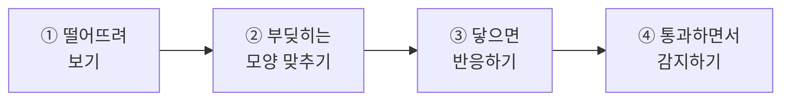
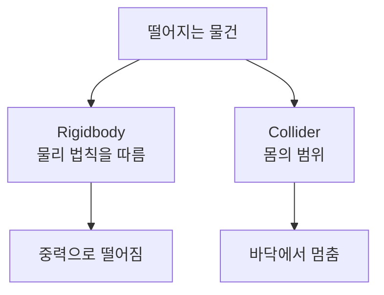
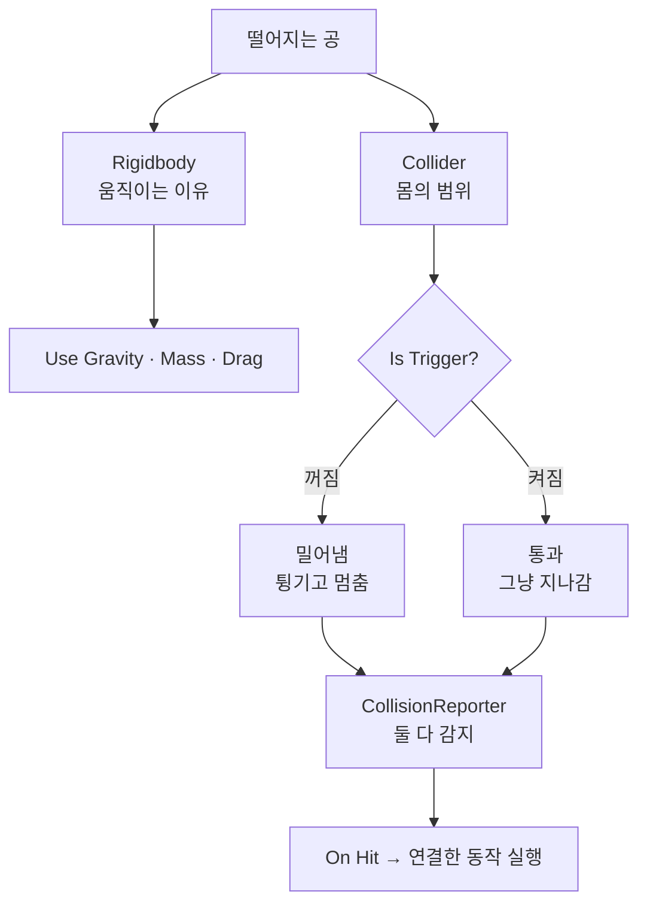

# **21차시. 떨어뜨리고 부딪히기**
---

> ℹ️ **이 자료는 이렇게 보세요**
>
> - **강의 영상과 함께 보는 자료**입니다. 영상을 따라가시면서 옆에 두고 보시면 됩니다.
> - 이번 차시에도 **코드를 한 줄도 쓰지 않습니다.**
> - 오늘 하실 일은 **부품 붙이기, 값 조절하기, 이름표 달기** 정도입니다.
> - 오늘이 **게임 만들기 직전 마지막 차시**입니다. 다음 시간부터 실제 게임을 만듭니다.

---

## **오늘의 목표**

이번 차시가 끝나면 여러분은 **코드 없이** 이런 것을 만드시게 됩니다.

- **중력으로 떨어지는** 공
- **바닥에 닿으면 반응하는** 공
- **특정한 것에만 반응하는** 공 (이름표로 구분)
- **통과하면서도 감지하는** 영역



> 💬 **20차시와 오늘의 차이**
>
> 20차시에는 **버튼으로** 물건을 움직였습니다.
> 오늘은 **저절로 움직이고, 저절로 반응**하게 만듭니다. 게임다워지는 지점이에요.

---

## **1. 떨어지려면 부품 두 개가 필요합니다**

14차시에 큐브를 떨어뜨려 보셨죠. 그때 `Rigidbody` 를 붙였습니다.
그런데 사실 **떨어지고 부딪히려면 부품이 두 개** 필요합니다.

| 부품 | 하는 일 | 없으면 |
| :--- | :--- | :--- |
| **Rigidbody** | **물리 법칙을 따르게** 합니다 — 중력, 속도, 튕김 | 안 떨어집니다 |
| **Collider** | **몸의 범위**를 정합니다 — 어디까지가 이 물건인가 | 바닥을 뚫고 지나갑니다 |



> ✅ **핵심 한 줄**
>
> **Rigidbody는 '움직이는 이유', Collider는 '멈추는 이유'입니다.**

> 📝 **Cube를 만들면 이미 하나는 붙어 있습니다**
>
> `3D Object` → `Cube` 로 만들면 **`Box Collider` 가 이미 붙어 있습니다.**
> Unity가 **부딪히는 부품은 미리 붙여서** 주는 거예요.
>
> 그래서 14차시에 `Rigidbody` 만 붙여도 바닥에 멈췄던 겁니다.

---

## **2. Rigidbody에서 만질 것**

값이 많아 보이지만 **오늘 만질 건 네 개**입니다. 나머지는 **지금은 몰라도 됩니다.**

| 항목 | 무슨 뜻인가요 | 올리면 |
| :--- | :--- | :--- |
| **Mass** | 무게 | 밀기 어려워집니다 |
| **Drag** | 공기 저항 | 천천히 떨어지고, 천천히 멈춥니다 |
| **Use Gravity** | 중력을 받을지 | 끄면 **공중에 뜬 채로** 있습니다 |
| **Is Kinematic** | 물리를 **무시**할지 | 켜면 **밀어도 안 밀립니다** |

> ⚠️ **Mass는 낙하 속도와 상관없습니다**
>
> 무거운 공과 가벼운 공을 같이 떨어뜨리면 **똑같이 떨어집니다.**
> 현실에서도 그렇죠. 무게는 **부딪혔을 때 누가 밀리느냐**에 영향을 줍니다.
>
> 실습 ①에서 직접 확인해보세요. 이거 헷갈리는 분이 많습니다.

---

## **3. Collider — 몸의 범위**

Collider는 **눈에 보이는 모양과 다를 수 있습니다.** 초록색 선으로만 표시돼요.

| 종류 | 모양 | 어디에 |
| :--- | :--- | :--- |
| **Box Collider** | 네모 상자 | 상자, 벽, 바닥 |
| **Sphere Collider** | 공 | 공, 총알, 열매 |
| **Capsule Collider** | 알약 | 사람, 나무 기둥 |
| **Mesh Collider** | 모양 그대로 | 복잡한 지형 |

> 💡 **복잡한 모양이라도 단순한 걸 쓰는 게 좋습니다**
>
> **모양 그대로 따라가는 것은 계산이 많이 듭니다.**
> 사람 모양이어도 **알약 하나면 충분한** 경우가 대부분이에요.
>
> 게임에서는 **정확함보다 자연스러움**이 중요합니다.

### **밀어내는 충돌 vs 통과하는 충돌**

Collider에는 **`Is Trigger`** 라는 체크가 있습니다. 이게 성격을 완전히 바꿉니다.

| | `Is Trigger` 꺼짐 | `Is Trigger` 켜짐 |
| :--- | :--- | :--- |
| **성격** | **밀어냅니다** | **통과시킵니다** |
| 부딪히면 | 튕기고 멈춥니다 | 그냥 지나갑니다 |
| 감지는? | **됩니다** | **됩니다** |
| 어디에 쓰나 | 바닥, 벽, 공 | 골인 지점, 함정 영역, 아이템 |

> ✅ **통과하는데 감지는 됩니다**
>
> 이게 처음엔 이상하게 들리는데, 게임에서 아주 많이 씁니다.
>
> **골인 지점**을 생각해보세요. 캐릭터가 **통과해서 지나가야** 하지만,
> **지나갔다는 건 알아야** 하잖아요. 그게 `Is Trigger` 입니다.

---

## **4. 이름표(Tag) — 무엇에 반응할지 고르기**

공이 **바닥에 닿았을 때만** 반응하게 하고 싶습니다. 벽에 닿았을 땐 말고요.
그럼 **바닥인지 벽인지 구분**할 수 있어야 합니다.

Unity는 물건에 **이름표(Tag)** 를 달 수 있게 해줍니다.

| | |
| :--- | :--- |
| **어디에 있나요** | Inspector **맨 위**, 이름 바로 아래 **`Tag`** |
| **어떻게 만드나요** | `Tag` 목록 → **`Add Tag...`** → `+` → 이름 입력 |
| **주의** | **이름표를 만든 다음, 물건에 다시 골라줘야** 합니다 |

> ⚠️ **이름표는 '만들기'와 '달기'가 따로입니다**
>
> `Add Tag...` 로 만들기만 하면 **아직 아무한테도 안 달려 있습니다.**
>
> 만든 뒤에 **물건을 선택하고 `Tag` 목록에서 골라줘야** 달립니다.
> **이 두 단계를 헷갈리는 분이 아주 많습니다.**

---

## **5. 오늘 사용할 부품 — CollisionReporter**

강의자료의 **`CollisionReporter`** 를 씁니다. **부딪힘을 감지해서 알려주는 부품**이에요.

### **5.1 조절할 수 있는 값**

| Inspector 항목 | 무슨 뜻인가요 | 어떻게 바꾸나요 |
| :--- | :--- | :--- |
| **Target Tag** | **이 이름표를 단 것에만** 반응 | 글자 입력 (**비워두면 무엇에든** 반응) |
| **Report To Console** | 부딪힐 때마다 Console에 남길지 | 체크 켜고 끄기 |

### **5.2 특별한 칸 두 개**

| 항목 | 무슨 뜻인가요 |
| :--- | :--- |
| **On Hit** | **부딪히는 순간** 같이 실행할 동작을 연결하는 자리 |
| **On Leave** | **떨어지는 순간** 같이 실행할 동작을 연결하는 자리 |

> 📝 **이 부품은 Collider가 있어야 동작합니다**
>
> 부딪히는 부품이 없으면 **아무 일도 일어나지 않습니다.**
> 붙일 때 Collider가 없으면 **노란 경고 한 줄**이 뜹니다. 그때 붙여주시면 돼요.

> ✅ **밀어내든 통과하든 둘 다 감지합니다**
>
> `Is Trigger` 가 켜져 있든 꺼져 있든 **양쪽 모두 반응합니다.**
> 실습 ④에서 확인해보세요.

---

## **6. 실습 — 직접 해보세요**

영상에서 강사가 "멈추세요"라고 하는 지점에서 아래 순서대로 따라 하시면 됩니다.
**안 되셔도 괜찮습니다.**

---

### **실습 ① — 떨어뜨려보기**

> 🎯 **목표**
>
> `Rigidbody` 의 값을 바꿔가며 **무엇이 어떻게 달라지는지** 확인합니다.

1. **Hierarchy** 우클릭 → `3D Object` → `Plane` → `Position` 을 **`0, 0, 0`** 으로
   → 바닥입니다. 좁으면 `Scale` 을 **`2, 1, 2`** 정도로 키우세요.
2. 우클릭 → `3D Object` → `Sphere` → `Position` 을 **`0, 5, 0`** 으로
   → 공중에 뜬 공입니다.
3. 공을 선택하고 **`Add Component`** → **`Rigidbody`** 추가
4. **▶** → **떨어져서 바닥에 멈춥니다.**
5. ▶ 를 끄고, 값을 하나씩 바꿔가며 다시 ▶ 를 눌러봅니다.

| 바꿀 것 | 어떻게 되나요 |
| :--- | :--- |
| **Use Gravity** 체크 해제 | **공중에 그대로** 떠 있습니다 |
| **Drag** 를 `5` 로 | **천천히** 떨어집니다 |
| **Is Kinematic** 체크 | 물리를 무시해서 **안 떨어집니다** |
| **Mass** 를 `100` 으로 | **낙하 속도는 그대로**입니다 |

6. 공을 **`Ctrl + D`** 로 복제하고, 하나는 `Mass` 를 `1`, 다른 하나는 `100` 으로 둡니다.
   → 나란히 놓고 **▶** → **똑같이 떨어집니다.**

<details>
<summary>✅ 확인해보세요</summary>

- **무거운 공이 더 빨리 떨어지지 않았죠?**
  → **무게는 낙하 속도와 상관없습니다.** 현실에서도 그래요.
  → 무게는 **부딪혔을 때 누가 밀리느냐**에 영향을 줍니다.
- `Use Gravity` 를 끄니 떠 있었나요? → **떨어지는 이유는 중력**입니다.
- `Is Kinematic` 은 **"물리를 아예 무시해라"** 입니다. 나중에 문이나 승강기 만들 때 씁니다.

</details>

> ⚠️ **잘 안 되신다면**
>
> - 공이 바닥을 뚫고 지나간다 → 바닥(`Plane`)에 **`Mesh Collider` 가 있는지** 확인해주세요. 보통은 자동으로 붙어 있습니다.
> - 공이 안 떨어진다 → `Use Gravity` 체크와 `Is Kinematic` 체크를 확인해주세요.

---

### **실습 ② — 부딪히는 모양 맞추기**

> 🎯 **목표**
>
> **보이는 모양과 부딪히는 모양이 다를 수 있다**는 것을 확인합니다.

1. 공을 선택하고 Scene 창을 봅니다.
   → 공을 감싼 **초록색 선**이 보입니다. 그게 **부딪히는 범위**입니다.
2. Inspector의 **`Sphere Collider`** 에서 **`Radius`** 를 **`1.5`** 로 키워봅니다.
   → **초록 선만 커집니다.** 공은 그대로예요.
3. **▶** → **공이 바닥에서 붕 뜬 채로 멈춥니다.**
   → 보이지 않는 큰 몸이 바닥에 먼저 닿았기 때문입니다.
4. `Radius` 를 **`0.5`** 로 되돌립니다.
5. 이번엔 **`Box Collider`** 를 추가로 붙여봅니다.
   → 공에 **네모난 초록 선**이 생깁니다. 부품은 여러 개 붙일 수 있습니다.
6. 확인했으면 `Box Collider` 는 **점 세 개(⋮) → `Remove Component`** 로 떼주세요.

<details>
<summary>✅ 확인해보세요</summary>

- **보이는 모양과 부딪히는 모양은 별개**죠?
  → 16차시에 배운 **"보이는 것과 눌리는 것은 별개"** 와 비슷한 이야기입니다.
- 초록 선이 크면 **더 일찍 부딪힙니다.**
- 나중에 "왜 안 닿았는데 부딪히지?" 싶으면 **초록 선을 확인**해보세요.

</details>

> ⚠️ **잘 안 되신다면**
>
> - 초록 선이 안 보인다 → 물건이 **선택되어 있어야** 보입니다. 그래도 안 보이면 Scene 창 위쪽 `Gizmos` 가 켜져 있는지 확인해주세요.

---

### **실습 ③ — 바닥에 닿으면 반응하기 (오늘의 핵심)**

> 🎯 **목표**
>
> **떨어진 공이 바닥에 닿는 순간 반응하게** 만듭니다. 이름표로 대상을 정합니다.

#### **1단계 — 바닥에 이름표를 답니다**

1. **바닥(`Plane`)을 선택**합니다.
2. Inspector **맨 위의 `Tag`** 목록을 클릭 → **`Add Tag...`**
3. **`+`** 를 누르고 **`Ground`** 라고 입력 → **`Save`**
4. **다시 바닥을 선택**하고, `Tag` 목록에서 **`Ground`** 를 고릅니다.

    > 🚨 **여기서 가장 많이 막힙니다**
    >
    > 3번까지만 하면 **이름표를 만들기만 한 것**입니다. **아직 아무한테도 안 달렸어요.**
    >
    > **4번을 꼭 해주세요.** 물건을 다시 선택해서 목록에서 골라야 달립니다.

#### **2단계 — 공에 감지 부품을 붙입니다**

5. **공을 선택**하고, 강의자료의 **`CollisionReporter`** 를 **끌어다 놓습니다.**
6. 값을 맞춥니다.

| 항목 | 값 |
| :--- | :--- |
| **Target Tag** | `Ground` |
| **Report To Console** | ☑ 체크 |

7. **`Console` 탭을 열어둡니다.**
8. **▶** → 공이 떨어져 바닥에 닿는 순간 **Console에 줄이 하나 뜹니다.**

#### **3단계 — 눈에 보이게 반응시킵니다**

9. 공에 **`CubeSpinner`** 도 붙입니다. (14차시에 쓰던 그것입니다.)
   → **`Is Spinning`** 체크를 **해제**하고, **`Target Color`** 를 빨간색으로 골라둡니다.
10. `CollisionReporter` 의 **`On Hit`** 칸에서 **`+`** 클릭
11. **공을 왼쪽 칸에 끌어다 놓기** → 목록에서 **`CubeSpinner`** → **`ChangeColor`**
12. **▶** → **공이 바닥에 닿는 순간 빨개집니다.**

<details>
<summary>✅ 무슨 일이 일어났나요</summary>

**공이 바닥에 닿는 순간, 색이 바뀌었습니다.**

여러분이 한 일은 이것뿐이에요.
- 바닥에 **이름표를 달고**
- 공에 **감지 부품을 붙이고**
- **"닿으면 색을 바꿔라"** 를 연결했습니다.

**`On Hit` 은 버튼의 `On Click` 과 똑같이 생겼죠?**
19차시의 `On Stopped` 도 그랬고요. **전부 같은 방식**입니다.

> 💡 **이게 게임에서 어떻게 쓰이냐면**
>
> 총알이 표적에 맞으면 터지고 점수가 오르는 것.
> **22차시부터 만들 게임이 정확히 이 구조입니다.**

</details>

> 🚨 **꼭 알아두세요 — 값이 사라지는 이유**
>
> **▶ 를 누른 상태에서 바꾼 값은, ▶ 를 끄면 전부 사라집니다.**
>
> 오늘은 ▶ 를 자주 켜게 됩니다.
> **부품 붙이고 연결하는 작업은 ▶ 가 꺼진 상태에서** 하세요.

> ⚠️ **잘 안 되신다면**
>
> - 아무 일도 안 일어난다 → **바닥에 이름표를 실제로 달았는지** 확인해주세요. 만들기만 하고 안 고른 경우가 대부분입니다.
> - 목록에 `ChangeColor` 가 안 보인다 → 왼쪽 칸에 **공을 끌어다 놓지 않으신 경우**입니다.
> - 색이 안 바뀐다 → `CubeSpinner` 의 **`Target Color`** 를 골라두셨는지 확인해주세요.
> - 노란 경고가 뜬다 → 공에 **Collider가 없는** 경우입니다. `Sphere` 로 만드셨으면 보통 있습니다.

---

### **실습 ④ — 통과하면서 감지하기 (선택)**

> 🎯 **목표**
>
> **`Is Trigger`** 를 켜서, **통과하는데 감지는 되는** 영역을 만들어봅니다.

1. **Hierarchy** 우클릭 → `3D Object` → `Cube` → 이름을 **`Gate`** 로
2. 공이 떨어지는 **길목**에 놓습니다. → `Position` 을 **`0, 2, 0`**, `Scale` 을 **`3, 0.2, 3`** 정도로
3. **▶** → **공이 `Gate` 위에 얹혀서 멈춥니다.** 바닥까지 못 갑니다.
4. ▶ 를 끄고, `Gate` 의 **`Box Collider`** 에서 **`Is Trigger`** 를 **체크**합니다.
5. **▶** → **공이 그냥 통과해서 바닥까지 떨어집니다.**
6. 이제 `Gate` 에도 이름표를 달아봅니다. → `Add Tag...` → **`Gate`** → 다시 골라주기
7. 공의 `CollisionReporter` 에서 **`Target Tag`** 를 **`Gate`** 로 바꿉니다.
8. **▶** → **통과하는 순간 색이 바뀝니다.**

<details>
<summary>✅ 확인해보세요</summary>

- **통과하는데 감지는 됐죠?**
  → 이게 `Is Trigger` 입니다. **골인 지점, 함정 영역, 아이템 줍기**가 전부 이 방식이에요.
- `Target Tag` 를 **비워두면** 무엇에든 반응합니다. 해보셔도 좋습니다.
- `On Leave` 에도 뭔가 연결해보세요. → **빠져나가는 순간** 실행됩니다.

</details>

> ⚠️ **잘 안 되신다면**
>
> - 통과 안 하고 얹힌다 → `Is Trigger` 체크를 **`Gate` 쪽**에 하셨는지 확인해주세요. 공이 아니라 `Gate` 입니다.
> - 통과는 하는데 색이 안 바뀐다 → `Target Tag` 를 **`Gate`** 로 바꾸셨는지, `Gate` 에 이름표를 **실제로 달았는지** 확인해주세요.

---

## **7. 코드는 딱 한 번만 보고 갑니다**

**외우실 필요도, 치실 필요도 없습니다.** 그냥 구경만 하세요.

```
Target Tag 칸  ──→  [ Target Tag : Ground ]
On Hit 칸      ──→  [ 부딪히는 순간 실행할 목록 ]
On Leave 칸    ──→  [ 떨어지는 순간 실행할 목록 ]
```

> ✅ **오늘 배운 것도 결국 같은 구조입니다**
>
> 지금까지 나온 **"~할 때"** 칸들을 모아보면 이렇습니다.
>
> | 칸 이름 | 언제 | 배운 차시 |
> | :--- | :--- | :---: |
> | **On Click** | 버튼이 눌렸을 때 | 14 |
> | **On Value Changed** | 슬라이더 값이 바뀌었을 때 | 18 |
> | **On Stopped** | 회전이 멈췄을 때 | 19 |
> | **On Changed** | 위치가 바뀌었을 때 | 20 |
> | **On Hit / On Leave** | 부딪혔을 때 / 떨어졌을 때 | 21 |
>
> **전부 똑같이 생겼고, 전부 똑같이 연결합니다.**

> 💬 **그래서 이 과정의 결론 하나**
>
> **"무슨 일이 일어났을 때, 무엇을 할지"를 연결하는 것.**
> 이게 코드 없이 게임을 만드는 방식입니다.

---

## **8. 오늘 배운 것을 그림으로**



> ✅ **이 그림 하나만 기억하셔도 오늘은 성공입니다**
>
> - **Rigidbody는 움직이는 이유, Collider는 멈추는 이유**
> - **`Is Trigger` 를 켜면 통과하지만, 감지는 여전히 됩니다**
> - **이름표(Tag)로 무엇에 반응할지 고릅니다**

---

## **9. 정리 문제**

맞히는 게 목적이 아닙니다. **오늘 내용이 머리에 남았는지 확인하는 용도**예요.

### **문제 1**
물건이 **떨어지고 바닥에 멈추려면** 무엇이 필요한가요?

<details>
<summary>✅ 정답 보기</summary>

**`Rigidbody` 와 `Collider` 둘 다** 필요합니다.

- **Rigidbody**: 물리 법칙을 따르게 합니다 → **움직이는 이유**
- **Collider**: 몸의 범위를 정합니다 → **멈추는 이유**

Collider가 없으면 **바닥을 뚫고 지나갑니다.**

</details>

### **문제 2**
무거운 공과 가벼운 공을 같이 떨어뜨리면 **어느 게 먼저** 닿을까요?

<details>
<summary>✅ 정답 보기</summary>

**똑같이 떨어집니다.**

**무게(`Mass`)는 낙하 속도와 상관없습니다.** 현실에서도 그래요.
무게는 **부딪혔을 때 누가 밀리느냐**에 영향을 줍니다.

이거 헷갈리는 분이 많습니다. 실습 ①에서 직접 확인해보셨죠.

</details>

### **문제 3**
**`Is Trigger`** 를 켜면 어떻게 되나요?

<details>
<summary>✅ 정답 보기</summary>

**밀어내지 않고 통과시킵니다. 그런데 감지는 여전히 됩니다.**

**골인 지점**을 생각해보세요.
캐릭터가 **통과해서 지나가야** 하지만, **지나갔다는 건 알아야** 하죠.

함정 영역, 아이템 줍기도 전부 이 방식입니다.

</details>

### **문제 4**
이름표(Tag)를 만들었는데 **아무 반응이 없습니다.** 무엇을 빠뜨렸을까요?

<details>
<summary>✅ 정답 보기</summary>

**물건에 이름표를 실제로 달지 않으셨을** 가능성이 큽니다.

이름표는 **'만들기'와 '달기'가 따로**입니다.

1. `Add Tag...` 로 **만들기** — 여기까지는 아직 아무한테도 안 달림
2. 물건을 **다시 선택**해서 `Tag` 목록에서 **고르기** ← **이걸 빠뜨립니다**

> 💡 **이 답이 잘 안 떠오르셨다면**
>
> 영상에서 **이름표 다는 파트를 한 번 더** 보시는 걸 권합니다.
> 22차시부터 계속 쓰게 됩니다.

</details>

### **문제 5**
지금까지 배운 **`On Click`, `On Stopped`, `On Hit`** 의 공통점은?

<details>
<summary>✅ 정답 보기</summary>

**"무슨 일이 일어났을 때, 무엇을 할지"를 연결하는 자리**입니다.

| 칸 이름 | 언제 |
| :--- | :--- |
| On Click | 버튼이 눌렸을 때 |
| On Value Changed | 슬라이더 값이 바뀌었을 때 |
| On Stopped | 회전이 멈췄을 때 |
| On Hit | 부딪혔을 때 |

**전부 똑같이 생겼고, 전부 똑같이 연결합니다.**
`+` 누르고, 물건 끌어다 놓고, 목록에서 고르기.

</details>

---

## **10. 앞으로 조심할 것**

> ⚠️ **흔한 실수**
>
> - **이름표를 만들고 안 달기** → 오늘 가장 흔한 실수입니다.
> - **`Is Trigger` 를 엉뚱한 쪽에 켜기** → 통과시킬 쪽에 켜야 합니다.
> - **초록 선을 확인 안 하고 "왜 안 닿지" 하기** → 보이는 모양과 부딪히는 모양은 별개입니다.
> - **무게를 올리면 빨리 떨어질 거라 생각하기** → 상관없습니다.

> 💡 **좋은 습관 두 개**
>
> - **복잡한 모양이어도 단순한 Collider 쓰기.** 정확함보다 자연스러움이 중요합니다.
> - **이름표는 만들자마자 바로 달기.** 두 단계를 붙여서 하면 안 빠뜨립니다.

---

## **11. 오늘의 정리**

> ✅ **세 줄 요약**
>
> 1. **Rigidbody는 움직이는 이유, Collider는 멈추는 이유**다.
> 2. **`Is Trigger` 를 켜면 통과하지만 감지는 된다.**
> 3. **이름표(Tag)로 무엇에 반응할지** 고른다.

**오늘로 기초가 전부 끝났습니다.**

화면 보는 법부터 시작해서, 물건 만들고, 묶고, 틀로 찍어내고, 화면을 만들고, 버튼으로 조종하고,
축을 익히고, 이제 떨어뜨리고 부딪히는 것까지 하셨습니다. **코드는 한 줄도 안 쓰고요.**

충분히 잘하셨습니다.

---

## **12. 다음 차시 준비**

> 🧩 **22차시부터 — 게임을 만듭니다**
>
> 다음 시간부터 **여섯 차시에 걸쳐 게임 하나를 완성**합니다. **클레이 사격**이에요.
>
> 11차시 첫 시간에 보여드렸던 그 게임입니다. 이제 그걸 직접 만드십니다.
>
> 지금까지 배운 게 **전부 쓰입니다.**
>
> | 배운 것 | 게임에서 |
> | :--- | :--- |
> | 부품 붙이기 (14) | 총과 표적 만들기 |
> | 붕어빵 틀 (15) | 표적을 수십 개로 |
> | 흩날리는 효과 (16) | 총구 불꽃, 표적 터짐 |
> | 화면 만들기 (17~19) | 점수판, 시작 버튼 |
> | X · Y · Z (20) | 총알이 날아가는 방향 |
> | 부딪힘 감지 (21) | 명중 판정 |

> 📝 **미리 해두시면 좋은 것**
>
> - [ ] 지금까지 만든 것을 **`Ctrl + S` 로 저장**해두기
> - [ ] **11 ~ 21차시에서 헷갈렸던 부분**이 있으면 그 차시를 한 번 더 보기
> - [ ] 강의자료의 **클레이 사격용 파일들**이 프로젝트에 들어 있는지 확인
>
> > 💡 **여기서 한 번 정리하고 가시면 좋습니다**
> >
> > 다음 여섯 차시는 **계속 이어지는 하나의 작업**입니다.
> > 지금까지 중에 **특히 안 잡힌 게 있다면** 그 차시를 먼저 복습하시는 걸 권합니다.
> >
> > 그래도 막히시면 **차시별 완성 파일**이 강의자료에 있으니 걱정하지 마세요.

---

## **부록 — 오늘 나온 용어 정리**

| 화면에 보이는 이름 | 우리말로 하면 |
| :--- | :--- |
| **Rigidbody** | 물리 법칙을 따르게 하는 부품 |
| **Mass** | 무게 |
| **Drag** | 공기 저항 |
| **Use Gravity** | 중력을 받을지 |
| **Is Kinematic** | 물리를 무시할지 |
| **Collider** | 부딪히는 부품 — 몸의 범위 |
| **Box / Sphere / Capsule Collider** | 네모 / 공 / 알약 모양 범위 |
| **Radius** | 공 모양 범위의 반지름 |
| **Is Trigger** | 통과시킬지 (감지는 됨) |
| **Tag** | 이름표 — 무엇인지 구분하는 표시 |
| **Add Tag...** | 이름표 만들기 |
| **Target Tag** | 이 이름표를 단 것에만 반응 |
| **On Hit** | 부딪히는 순간 |
| **On Leave** | 떨어지는 순간 |
| **Gizmos** | Scene 창의 보조 표시 (초록 선 등) |
