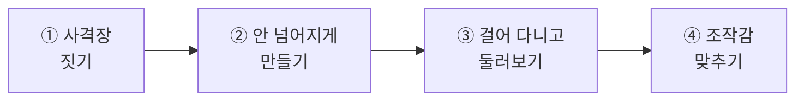
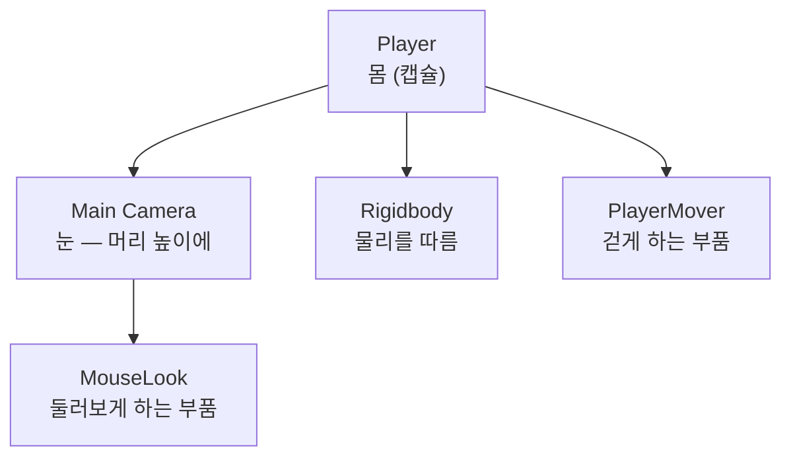
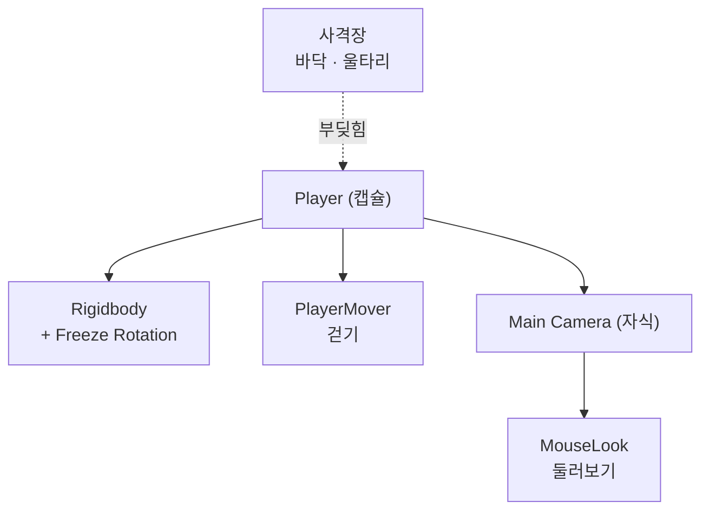

# **22차시. 사격장을 만들고 걸어 다니기**
---

> ℹ️ **이 자료는 이렇게 보세요**
>
> - **강의 영상과 함께 보는 자료**입니다. 영상을 따라가시면서 옆에 두고 보시면 됩니다.
> - 이번 차시에도 **코드를 한 줄도 쓰지 않습니다.** 여섯 차시 내내 안 씁니다.
> - 오늘 하실 일은 **도형 배치하기, 부품 붙이기, 값 조절하기** 정도입니다.
> - 오늘부터 **여섯 차시에 걸쳐 게임 하나를 완성**합니다. 앞 차시 결과물을 계속 이어서 씁니다.

---

## **오늘의 목표**

이번 차시가 끝나면 여러분은 **코드 없이** 이런 것을 만드시게 됩니다.

- **울타리가 있는 사격장**
- 그 안을 **직접 걸어 다니기**
- **마우스로 둘러보기**



> 💬 **21차시와 오늘의 차이**
>
> 지금까지는 **밖에서 물건을 내려다보며** 만들었습니다.
> 오늘부터는 **여러분이 그 안으로 들어갑니다.** 시점이 완전히 바뀌어요.

---

## **1. 여섯 차시의 지도**

오늘부터 만드는 게 **한 덩어리**입니다. 어디쯤 가고 있는지 먼저 보여드릴게요.

| 차시 | 그날이 끝나면 |
| :---: | :--- |
| **22 (오늘)** | 걸어 다닐 수 있는 사격장 |
| 23 | 표적이 하늘로 날아옴 (아직 못 맞힘) |
| 24 | 총알이 나감 (아직 맞아도 아무 일 없음) |
| **25** | **맞으면 터지고 점수가 오름 — 게임이 됩니다** |
| 26 | 난이도 세 단계 |
| 27 | 하늘·소리가 붙은 완성본 |

> ✅ **25차시가 봉우리입니다**
>
> **25차시에 처음으로 '게임'이 됩니다.** 거기까지 가시면 나머지는 다듬는 일이에요.

> 💡 **중간에 막히셔도 괜찮습니다**
>
> **각 차시의 완성 파일**을 강의자료에 같이 드립니다.
> 한 차시 놓치셔도 다음 차시를 따라오실 수 있어요.

---

## **2. 오늘부터 시점이 바뀝니다**

14차시에 자동차를 만드셨죠. 그때 여러분은 **자동차를 밖에서 내려다보고** 있었습니다.

오늘은 다릅니다. **여러분이 사격장 안에 서 있게** 됩니다.

| | 지금까지 | 오늘부터 |
| :--- | :--- | :--- |
| **보는 위치** | 밖에서 내려다봄 | **안에 서 있음** |
| **화면의 정체** | 작업대(Scene) | **내 눈** |
| **카메라** | 그냥 놓여 있음 | **내 머리에 붙어 있음** |

### **카메라가 눈이 되려면**

카메라를 **몸의 자식으로** 넣습니다. 14차시에 자동차 바퀴를 `Car` 안에 넣었던 그 방식이에요.



> ✅ **핵심 한 줄**
>
> **몸이 움직이면 눈도 같이 움직입니다.** 부모를 움직이면 자식이 따라오니까요.
> 14차시에 배운 그대로입니다.

---

## **3. 왜 캡슐인가요**

사람 모양을 만들 필요가 없습니다. **캡슐(Capsule) 하나면 충분**합니다.

| 이유 | |
| :--- | :--- |
| **어차피 안 보입니다** | 카메라가 그 안에 있으니 자기 몸은 안 보여요 |
| **모서리가 없어 잘 걸립니다** | 네모는 문턱에 턱턱 걸리는데, 캡슐은 미끄러져 넘어갑니다 |
| **21차시에 배운 것** | 복잡한 모양보다 **단순한 게 낫다** |

---

## **4. 넘어지지 않게 하는 법**

캡슐에 `Rigidbody`를 붙이고 걸으면 **넘어집니다.** 물리 법칙을 따르니까요.

사람은 안 넘어지죠. 그래서 **회전을 잠가야** 합니다.

| Inspector 항목 | 어떻게 |
| :--- | :--- |
| **Constraints** → **Freeze Rotation** | **X · Y · Z 전부 체크** |

> ⚠️ **이걸 안 하면**
>
> 걷자마자 **캡슐이 굴러갑니다.** 화면도 같이 뒤집혀서 아주 어지러워요.
>
> **처음 겪으면 뭔가 크게 잘못한 것 같지만, 체크 세 개면 해결됩니다.**

> 📝 **그럼 좌우로는 어떻게 도나요**
>
> 회전을 잠갔는데 마우스로 둘러보면 몸이 돌아가야 하잖아요.
>
> **`MouseLook` 이 물리를 거치지 않고 직접 돌려줍니다.** 그래서 잠가도 괜찮습니다.

---

## **5. 커서가 잠깁니다**

1인칭 게임을 해보셨으면 아실 텐데, **마우스 커서가 화면에서 사라집니다.**

| 왜 잠그나요 | |
| :--- | :--- |
| 커서가 화면 밖으로 나가면 | 더 못 돌아봅니다 |
| 커서가 보이면 | 조준하는 데 방해가 됩니다 |

> 💡 **풀고 싶으면 `Esc`**
>
> **`Esc` 를 누르면 커서가 다시 나타납니다.**
>
> ▶ 를 끄고 싶은데 커서가 없어서 못 누르실 때, 이걸 기억하세요.
> **이거 모르면 정말 답답합니다.** 오늘 꼭 익혀두세요.

---

## **6. 오늘 사용할 부품 — PlayerMover · MouseLook**

강의자료에 들어 있는 부품 두 개를 씁니다.

### **6.1 PlayerMover — 걷게 하는 부품**

| Inspector 항목 | 무슨 뜻인가요 | 어떻게 바꾸나요 |
| :--- | :--- | :--- |
| **Move Speed** | 걷는 속도 | 숫자 입력 |
| **Jump Force** | 점프하는 힘 (`0` 이면 점프 안 함) | 숫자 입력 |
| **Can Move** | 움직일 수 있는지 | 체크 켜고 끄기 |

| 동작 이름 | 무슨 일을 하나요 |
| :--- | :--- |
| **EnableMove** | 움직일 수 있게 |
| **DisableMove** | 못 움직이게 (게임 끝났을 때) |

### **6.2 MouseLook — 둘러보게 하는 부품**

| Inspector 항목 | 무슨 뜻인가요 | 어떻게 바꾸나요 |
| :--- | :--- | :--- |
| **Sensitivity** | 마우스 감도 | 숫자 입력 (클수록 예민) |
| **Invert Y** | 위아래 뒤집기 | 체크 켜고 끄기 |
| **Min Angle** | 아래로 얼마나 내려다볼지 | 숫자 입력 |
| **Max Angle** | 위로 얼마나 올려다볼지 | 숫자 입력 |
| **Lock Cursor** | 커서를 잠글지 | 체크 켜고 끄기 |

| 동작 이름 | 무슨 일을 하나요 |
| :--- | :--- |
| **LockCursor** | 커서 잠그기 |
| **UnlockCursor** | 커서 풀기 |

> 📝 **이 부품은 카메라에 붙입니다**
>
> `PlayerMover` 는 **몸(Player)** 에, `MouseLook` 은 **눈(Camera)** 에 붙입니다.
>
> 헷갈리시면 이렇게 기억하세요. **걷는 건 몸이 하고, 둘러보는 건 눈이 합니다.**

---

## **7. 실습 — 직접 해보세요**

> ⚠️ **🟨 이 절은 아직 확정 전입니다**
>
> 아래 순서는 **잠정 초안**입니다.
> 에디터 검증(U-7)이 끝나면 실제 조작에 맞춰 확정됩니다.

---

### **실습 ① — 사격장 짓기**

> 🎯 **목표**
>
> 바닥과 울타리로 **닫힌 공간**을 만듭니다.

1. **새 씬**을 만듭니다. `File` → `New Scene` → `Basic (URP)`
   → 이름을 **`ClayShooting`** 으로 저장합니다.
2. **Hierarchy** 우클릭 → `3D Object` → `Plane` → 이름을 **`Ground`** 로
   → `Scale` 을 **`5, 1, 5`** 로 키웁니다.
3. 우클릭 → `3D Object` → `Cube` → 이름을 **`Fence_Back`** 으로
   → `Position` `0, 1.5, 25` / `Scale` `50, 3, 1`
4. **`Ctrl + D`** 로 두 개 복제해 좌우 벽을 만듭니다.

| 이름 | Position | Scale |
| :--- | :--- | :--- |
| `Fence_Back` | `0, 1.5, 25` | `50, 3, 1` |
| `Fence_Left` | `-25, 1.5, 0` | `1, 3, 50` |
| `Fence_Right` | `25, 1.5, 0` | `1, 3, 50` |

5. 13차시에 배운 대로 **재료(Material)를 만들어 색을 입혀둡니다.**

<details>
<summary>✅ 확인해보세요</summary>

- 위에서 내려다봤을 때 **삼면이 막힌 공간**이 되었나요?
- 바닥과 벽에 **Collider가 붙어 있는지** 확인해보세요. 기본 도형이라 자동으로 붙어 있습니다.
- 아직 걸어 다닐 수는 없습니다. 그건 실습 ③에서요.

</details>

> ⚠️ **잘 안 되신다면**
>
> - 벽이 너무 얇거나 두껍다 → `Scale` 의 **어느 칸이 두께인지** 헷갈리기 쉽습니다. 20차시에 배운 X·Y·Z를 떠올려보세요.

---

### **실습 ② — 안 넘어지는 몸 만들기**

> 🎯 **목표**
>
> 캡슐에 물리를 붙이고, **넘어지는 것을 직접 겪은 뒤** 고칩니다.

1. **Hierarchy** 우클릭 → `3D Object` → `Capsule` → 이름을 **`Player`** 로
   → `Position` 을 **`0, 1, -20`** 으로 (사격장 뒤쪽)
2. **`Add Component`** → **`Rigidbody`** 추가
3. **▶** 를 눌러봅니다. → 아직 아무 일도 없습니다. (조작할 부품이 없으니까요)
4. ▶ 를 끄고, `Player` 를 **살짝 기울여** 봅니다. `Rotation X` 를 `20` 정도로.
5. 다시 **▶** → **넘어집니다.**
6. ▶ 를 끄고 `Rotation` 을 `0` 으로 되돌린 뒤,
   `Rigidbody` 의 **`Constraints`** → **`Freeze Rotation`** 의 **X · Y · Z 를 전부 체크**합니다.
7. 다시 기울여보고 **▶** → **이번엔 안 넘어집니다.**

<details>
<summary>✅ 확인해보세요</summary>

- 넘어지는 걸 **직접 보셨나요?** → 물리 법칙을 따르니까 당연한 일입니다.
- 체크 세 개로 해결됐죠? → **사람은 안 넘어져야** 하니 회전을 잠근 겁니다.
- 이건 1인칭 게임을 만들 때 **거의 항상 하는 설정**입니다.

</details>

> ⚠️ **잘 안 되신다면**
>
> - `Constraints` 가 안 보인다 → `Rigidbody` 안에서 **접혀 있을 수 있습니다.** 삼각형을 눌러 펼쳐보세요.

---

### **실습 ③ — 걸어 다니고 둘러보기 (오늘의 핵심)**

> 🎯 **목표**
>
> **1인칭으로 사격장을 걸어 다닙니다.** 오늘의 결과물입니다.

#### **1단계 — 눈을 답니다**

1. Hierarchy의 **`Main Camera` 를 `Player` 위로 끌어다 놓습니다.**
   → 자식으로 들어갑니다. 14차시의 그 방식입니다.
2. `Main Camera` 의 **`Position`** 을 **`0, 0.6, 0`** 으로 맞춥니다.
   → 캡슐의 **머리 높이**입니다.
3. `Rotation` 도 **`0, 0, 0`** 으로 맞춰둡니다.

#### **2단계 — 부품을 붙입니다**

4. **`Player` 를 선택**하고 강의자료의 **`PlayerMover`** 를 끌어다 놓습니다.
5. **`Main Camera` 를 선택**하고 **`MouseLook`** 을 끌어다 놓습니다.

#### **3단계 — 걸어봅니다**

6. **▶** 를 누릅니다.
7. **`W` `A` `S` `D`** 로 걸어보고, **마우스로 둘러봅니다.**
8. **`Space`** 로 점프해봅니다.
9. **`Esc`** 를 눌러 커서를 되찾고, ▶ 를 끕니다.

<details>
<summary>✅ 무슨 일이 일어났나요</summary>

**여러분이 만든 공간 안에 직접 들어가셨습니다.**

그리고 하신 일은 **부품 두 개를 끌어다 놓은 것**뿐이에요.
걷는 계산, 시점 회전 계산 — 그런 건 하나도 안 하셨습니다.

> 💡 **몸과 눈이 같이 움직였죠**
>
> 카메라를 `Player` 의 **자식으로** 넣었기 때문입니다.
> **부모가 움직이면 자식이 따라온다** — 14차시의 그 규칙이 여기서도 그대로 쓰였습니다.

</details>

> 🚨 **꼭 알아두세요 — 커서가 사라집니다**
>
> ▶ 를 누르면 **마우스 커서가 사라집니다.** 1인칭 게임이라 그렇습니다.
>
> **▶ 를 끄고 싶은데 커서가 없어서 못 누르실 수 있습니다.**
> 그때는 **`Esc`** 를 누르세요. 커서가 돌아옵니다.
>
> **이거 모르면 정말 답답합니다.** 지금 한 번 해보고 넘어가세요.

> ⚠️ **잘 안 되신다면**
>
> - 안 걸어진다 → `PlayerMover` 를 **`Player`(캡슐)** 에 붙이셨는지 확인해주세요. 카메라가 아닙니다.
> - 둘러봐지지 않는다 → `MouseLook` 을 **`Main Camera`** 에 붙이셨는지 확인해주세요.
> - 화면이 빙글빙글 돈다 → **`Freeze Rotation`** 체크를 안 하신 겁니다. 실습 ②로 돌아가주세요.
> - 바닥 아래로 떨어진다 → `Player` 의 `Position Y` 를 **`1`** 이상으로 올려주세요.

---

### **실습 ④ — 조작감 맞추기 (선택)**

> 🎯 **목표**
>
> **본인에게 편한 조작감**을 찾습니다. 정답이 없는 실습입니다.

1. **▶ 를 끈 상태에서** `PlayerMover` 의 **`Move Speed`** 를 바꿔봅니다.
   → `3` (느긋하게) / `5` (기본) / `10` (빠릿하게)
2. `MouseLook` 의 **`Sensitivity`** 를 바꿔봅니다.
   → `0.05` (둔감) / `0.15` (기본) / `0.4` (예민)
3. **`Invert Y`** 를 켜봅니다. → 위아래가 뒤집힙니다. 이게 편한 분도 계십니다.
4. **`Max Angle`** 을 `30` 으로 줄여봅니다. → 하늘을 많이 못 올려다봅니다.
   → **표적이 하늘에서 오니까 다시 `80` 으로 되돌려주세요.**

<details>
<summary>✅ 확인해보세요</summary>

- 조작감은 **사람마다 다릅니다.** 본인에게 편한 값을 찾으시면 됩니다.
- `Max Angle` 을 줄였을 때 답답하셨나요? → **다음 차시부터 표적이 하늘에서 옵니다.** 넉넉히 두세요.
- **▶ 를 끈 상태에서** 바꾸셔야 값이 남습니다.

</details>

---

## **8. 코드는 딱 한 번만 보고 갑니다**

**외우실 필요도, 치실 필요도 없습니다.**

```
Move Speed 칸    ──→  [ Move Speed  : 5   ]
Sensitivity 칸   ──→  [ Sensitivity : 0.15 ]
EnableMove 동작  ──→  [ 26차시에 게임 시작과 연결할 이름 ]
```

> ✅ **오늘 붙인 부품이 하는 일**
>
> **키보드가 눌렸는지 확인하고, 그만큼 몸을 옮기는 것.**
> 20차시에 버튼으로 하셨던 것과 **같은 일**입니다. 누르는 게 버튼에서 키보드로 바뀌었을 뿐이에요.

---

## **9. 오늘 배운 것을 그림으로**



> ✅ **이 그림 하나만 기억하셔도 오늘은 성공입니다**
>
> - **몸(캡슐)에 눈(카메라)을 자식으로** 답니다.
> - **회전을 잠가야** 안 넘어집니다.
> - **걷는 건 몸이, 둘러보는 건 눈이** 합니다.

---

## **10. 정리 문제**

### **문제 1**
왜 카메라를 **`Player` 의 자식으로** 넣었나요?

<details>
<summary>✅ 정답 보기</summary>

**몸이 움직이면 눈도 같이 움직여야** 하기 때문입니다.

14차시에 자동차 바퀴를 `Car` 안에 넣었던 것과 같습니다.
**부모가 움직이면 자식이 전부 따라옵니다.**

</details>

### **문제 2**
캡슐에 `Rigidbody` 를 붙였더니 **걷자마자 굴러갑니다.** 어떻게 할까요?

<details>
<summary>✅ 정답 보기</summary>

**`Constraints` → `Freeze Rotation` 의 X · Y · Z 를 전부 체크**합니다.

물리 법칙을 따르니까 넘어지는 게 당연합니다.
사람은 안 넘어지니까 **회전을 잠그는** 거예요.

1인칭 게임을 만들 때 **거의 항상 하는 설정**입니다.

</details>

### **문제 3**
▶ 를 눌렀더니 **마우스 커서가 사라져서 ▶ 를 못 끄겠습니다.**

<details>
<summary>✅ 정답 보기</summary>

**`Esc` 를 누르세요.** 커서가 돌아옵니다.

1인칭에서는 커서가 화면 밖으로 나가면 더 못 돌아보기 때문에 잠급니다.

> 💡 **이거 하나로 답답함이 사라집니다**
>
> 모르면 창을 강제 종료하게 됩니다. **꼭 기억해두세요.**

</details>

### **문제 4**
왜 사람 모양 대신 **캡슐**을 쓸까요?

<details>
<summary>✅ 정답 보기</summary>

- **어차피 안 보입니다.** 카메라가 그 안에 있으니까요.
- **모서리가 없어 잘 걸립니다.** 네모는 문턱에 턱턱 걸리는데 캡슐은 미끄러져 넘어갑니다.

21차시에 배운 **"복잡한 모양보다 단순한 게 낫다"** 가 여기서도 그대로입니다.

</details>

### **문제 5**
`PlayerMover` 와 `MouseLook` 은 각각 **어디에** 붙이나요?

<details>
<summary>✅ 정답 보기</summary>

- **`PlayerMover`** → **`Player`(몸, 캡슐)**
- **`MouseLook`** → **`Main Camera`(눈)**

헷갈리시면 이렇게 기억하세요.
**걷는 건 몸이 하고, 둘러보는 건 눈이 합니다.**

</details>

---

## **11. 앞으로 조심할 것**

> ⚠️ **흔한 실수**
>
> - **`Freeze Rotation` 을 안 하고 "화면이 뒤집혀요" 하기** → 오늘 배운 그것입니다.
> - **부품을 반대로 붙이기** → 몸에 `MouseLook`, 눈에 `PlayerMover` 를 붙이면 안 됩니다.
> - **`Esc` 를 몰라서 창을 강제 종료하기** → 커서는 `Esc` 로 돌아옵니다.
> - **카메라를 자식으로 안 넣기** → 걸어도 화면이 안 따라옵니다.

> 💡 **좋은 습관 하나**
>
> **오늘부터 여섯 차시는 계속 이어집니다.** 매 차시 끝에 **`Ctrl + S`** 를 꼭 눌러주세요.
> 그리고 가능하면 **차시마다 씬을 복사해두시면** 되돌아가기 쉽습니다.

---

## **12. 오늘의 정리**

> ✅ **세 줄 요약**
>
> 1. **몸(캡슐)에 눈(카메라)을 자식으로** 달면 같이 움직인다.
> 2. **회전을 잠가야** 안 넘어진다.
> 3. **커서가 사라지면 `Esc`.**

오늘 여러분은 **직접 들어가서 걸어 다닐 수 있는 공간**을 만드셨습니다.
게임의 첫 삽을 뜬 거예요. 충분히 잘하셨습니다.

---

## **13. 다음 차시 준비**

> 🧩 **23차시 — 표적이 날아오게**
>
> 빈 사격장에 **표적**을 띄웁니다.
>
> 발사기를 만들어서 **클레이 접시를 하늘로 쏘아 올려요.**
> 15차시에 배운 **붕어빵 틀**이 여기서 제대로 쓰입니다.

> 📝 **미리 해두시면 좋은 것**
>
> - [ ] 오늘 만든 사격장을 **`Ctrl + S` 로 저장**해두기
> - [ ] 씬 파일을 **`22_완료` 처럼 복사**해두기 (되돌아갈 때 편합니다)
> - [ ] 강의자료의 **`TargetLauncher` · `TargetLife` · `GameStarter`** 가 들어 있는지 확인

---

## **부록 — 오늘 나온 용어 정리**

| 화면에 보이는 이름 | 우리말로 하면 |
| :--- | :--- |
| **Capsule** | 알약 모양 — 플레이어의 몸 |
| **Plane** | 얇은 바닥판 |
| **Constraints** | 물리 제한 |
| **Freeze Rotation** | 회전 잠그기 |
| **Move Speed** | 걷는 속도 |
| **Jump Force** | 점프하는 힘 |
| **Can Move** | 움직일 수 있는지 |
| **Sensitivity** | 마우스 감도 |
| **Invert Y** | 위아래 뒤집기 |
| **Min / Max Angle** | 내려다보기 / 올려다보기 한계 |
| **Lock Cursor** | 커서 잠그기 |
| **Esc** | 커서 되찾기 |
| **W A S D** | 앞·왼쪽·뒤·오른쪽으로 걷기 |
