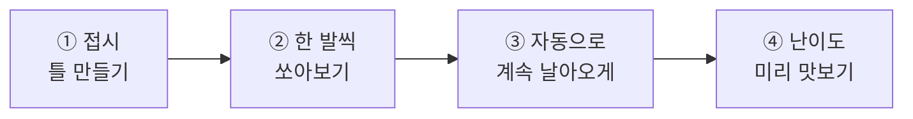
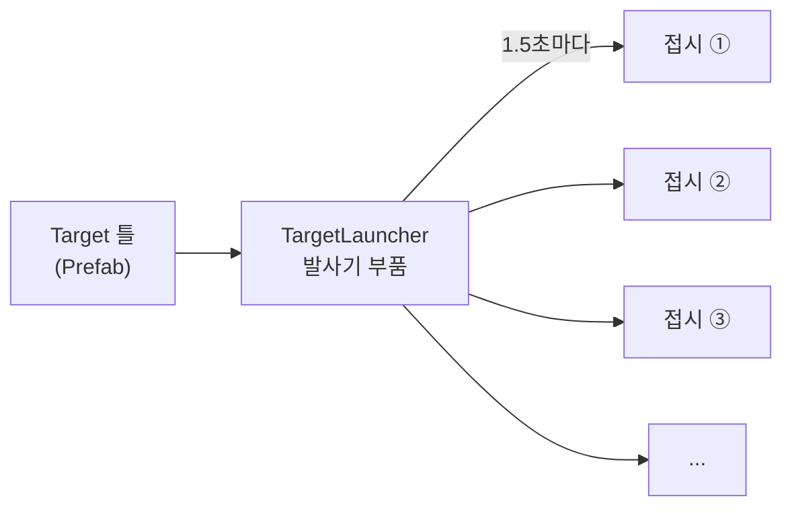
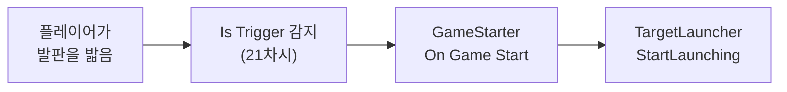
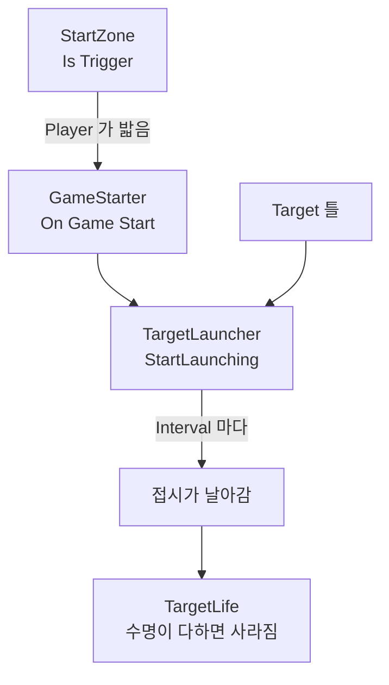

# **23차시. 표적이 날아오게**
---

> ℹ️ **이 자료는 이렇게 보세요**
>
> - **강의 영상과 함께 보는 자료**입니다. 영상을 따라가시면서 옆에 두고 보시면 됩니다.
> - 이번 차시에도 **코드를 한 줄도 쓰지 않습니다.**
> - 오늘 하실 일은 **틀 만들기, 각도 맞추기, 값 조절하기** 정도입니다.
> - 22차시에 만든 **사격장을 그대로 씁니다.** 저장해두셨죠?

---

## **오늘의 목표**

이번 차시가 끝나면 여러분은 **코드 없이** 이런 것을 만드시게 됩니다.

- **클레이 접시 틀**
- 접시를 **하늘로 쏘아 올리는 발사기**
- **발판을 밟으면 게임이 시작되는** 구조



> 💬 **22차시와 오늘의 차이**
>
> 22차시에는 **빈 공간**을 만들었습니다.
> 오늘은 그 공간에 **움직이는 것**이 생깁니다. 아직 못 맞히지만요.

---

## **1. 계속 만들어내려면 어떻게 할까요**

표적은 한 개가 아닙니다. **게임이 끝날 때까지 계속 새로 나와야** 합니다.

15차시에 배운 **붕어빵 틀**을 떠올려보세요. 틀이 있으면 몇 개든 찍어낼 수 있죠.

| 15차시에는 | 오늘은 |
| :--- | :--- |
| 틀을 **손으로 끌어다** 놓았습니다 | **부품이 알아서 찍어냅니다** |
| 자동차 다섯 대 | 표적 **수십 개** |



> ✅ **핵심 한 줄**
>
> **틀을 만들어 부품에 끌어다 놓으면, 부품이 알아서 찍어냅니다.**
>
> 여러분이 하실 일은 **틀을 만들고, 칸에 끌어다 놓는 것**뿐이에요.

---

## **2. 발사기의 구조**

발사기는 두 부분입니다.

| 부분 | 역할 |
| :--- | :--- |
| **몸통** (Cube) | 눈에 보이는 기계 모양. 그냥 장식입니다 |
| **발사 지점** (빈 그릇) | **접시가 나오는 자리와 방향** |

### **방향이 핵심입니다**

접시는 **발사 지점이 보고 있는 쪽**으로 날아갑니다.
그래서 발사 지점을 **위로 기울여** 둬야 하늘로 올라갑니다.

| Inspector 항목 | 값 | 결과 |
| :--- | :---: | :--- |
| `Rotation X` | `0` | 앞으로 똑바로 |
| `Rotation X` | **`-45`** | **비스듬히 위로** ✅ |
| `Rotation X` | `-90` | 수직으로 위 |

> 💡 **20차시가 여기서 쓰입니다**
>
> **`Rotation` 의 숫자는 회전 중심축**이라고 했죠.
> `X` 는 🔴 좌우 축입니다. 그 축을 중심으로 돌리면 **앞뒤로 고개를 끄덕이듯** 기울어집니다.
>
> 음수를 넣으면 **위를 향합니다.** 직접 돌려보시면서 확인해보세요.

---

## **3. 안 치우면 쌓입니다**

접시가 1.5초마다 나오는데 **아무도 안 치우면** 어떻게 될까요.

바닥에 접시가 **수백 개** 쌓입니다. 화면이 느려지고, 나중엔 멈춥니다.

> ✅ **해결은 간단합니다**
>
> 접시에 **수명**을 정해둡니다. **일정 시간이 지나면 스스로 사라지게** 하는 거예요.
>
> 못 맞힌 접시는 알아서 치워집니다.

| 부품 | 하는 일 |
| :--- | :--- |
| **TargetLife** | 정해진 시간이 지나면 **스스로 사라집니다** |

> 📝 **왜 이게 중요한가요**
>
> **눈에 안 보이는 문제**라서 그렇습니다.
> 화면에는 멀쩡해 보이는데 조금씩 느려집니다. 원인을 찾기 어려워요.
>
> **"만들어내는 게 있으면 치우는 것도 있어야 한다."** 이것만 기억해두세요.

---

## **4. 언제 시작할까요**

▶ 를 누르자마자 표적이 날아오면 **준비할 틈이 없습니다.**

그래서 **시작 신호**가 필요합니다. 21차시에 배운 것을 씁니다.



| 21차시에 배운 것 | 오늘 쓰이는 곳 |
| :--- | :--- |
| **Is Trigger** — 통과하지만 감지는 됨 | 발판을 **밟고 지나갈 수 있어야** 하니까 |
| **Tag** — 무엇에 반응할지 | 플레이어만 반응하게 |

> ✅ **골인 지점과 같은 구조입니다**
>
> 21차시에 **"통과하는데 감지는 된다"** 를 배우셨죠.
> 그때 골인 지점 이야기를 했었는데, **오늘 그걸 실제로 만듭니다.**

---

## **5. 오늘 사용할 부품 세 개**

### **5.1 TargetLauncher — 발사기**

| Inspector 항목 | 무슨 뜻인가요 | 어떻게 바꾸나요 |
| :--- | :--- | :--- |
| **Target Prefab** | 쏘아 올릴 **표적 틀** | 끌어다 놓기 |
| **Launch Point** | 표적이 나올 **자리와 방향** | 끌어다 놓기 |
| **Interval** | 몇 초마다 쏠지 | 숫자 (작을수록 어려움) |
| **Launch Force** | 얼마나 세게 쏠지 | 숫자 (클수록 어려움) |
| **Spread Angle** | 방향이 얼마나 흩어질지 | 숫자 (클수록 어려움) |

| 동작 이름 | 무슨 일을 하나요 |
| :--- | :--- |
| **StartLaunching** | 계속 쏘기 시작 |
| **StopLaunching** | 멈추기 |
| **LaunchOne** | **지금 한 개만** 쏘기 (시험용) |

> 💡 **`LaunchOne` 이 오늘 아주 유용합니다**
>
> 자동 발사를 켜두면 **접시가 계속 날아와서 값을 맞추기 어렵습니다.**
>
> **버튼 하나 만들어서 `LaunchOne` 에 걸어두면**, 원할 때 한 발씩 쏘면서 각도와 힘을 조율할 수 있어요.

### **5.2 TargetLife — 수명**

| Inspector 항목 | 무슨 뜻인가요 |
| :--- | :--- |
| **Life Time** | 몇 초 뒤에 사라질지 |

| 이벤트 칸 | 무슨 뜻인가요 |
| :--- | :--- |
| **On Expired** | **못 맞히고 사라질 때** 같이 실행할 동작 |

### **5.3 GameStarter — 시작 신호**

| Inspector 항목 | 무슨 뜻인가요 |
| :--- | :--- |
| **Trigger Tag** | 이 이름표를 단 것이 들어오면 시작 |
| **Start Once** | 한 번만 시작할지 |

| 동작 이름 | 무슨 일을 하나요 |
| :--- | :--- |
| **StartGame** | 게임 시작 |
| **EndGame** | 게임 종료 |
| **ResetGame** | 다시 시작할 수 있게 되돌리기 |

| 이벤트 칸 | 무슨 뜻인가요 |
| :--- | :--- |
| **On Game Start** | 시작할 때 같이 실행할 동작 |
| **On Game End** | 끝날 때 같이 실행할 동작 |

> 📝 **`On Game Start` 는 앞으로 계속 커집니다**
>
> 오늘은 여기에 **하나만** 연결합니다. 발사 시작이요.
>
> 그런데 26차시가 되면 **여섯 개**가 연결됩니다.
> 18차시에 배운 **"칸을 여러 개 만들면 한꺼번에 실행된다"** 가 여기서 제대로 쓰입니다.

---

## **6. 실습 — 직접 해보세요**

> ⚠️ **🟨 이 절은 아직 확정 전입니다**
>
> 아래 순서는 **잠정 초안**입니다.
> 에디터 검증(U-7)이 끝나면 실제 조작에 맞춰 확정됩니다.

---

### **실습 ① — 접시 틀 만들기**

> 🎯 **목표**
>
> **날아갈 수 있는 접시**를 만들어 틀로 저장합니다.

1. **Hierarchy** 우클릭 → `3D Object` → `Cylinder` → 이름을 **`Target`** 으로
2. `Scale` 을 **`0.4, 0.05, 0.4`** 로 → **납작한 접시**가 됩니다.
3. **`Add Component`** → **`Rigidbody`** 추가
   → 날아가려면 물리를 따라야 합니다. 21차시에 배운 그것입니다.
4. 강의자료의 **`TargetLife`** 를 끌어다 놓고, **`Life Time`** 을 **`5`** 로
5. 눈에 잘 띄는 **색깔 재료**를 만들어 입힙니다. (주황색을 권합니다)
6. Inspector 맨 위 **`Tag`** → **`Add Tag...`** → **`Target`** 을 만들고,
   **다시 `Target` 을 선택해서 이름표를 달아줍니다.**
7. **`Target` 을 Project 의 `Prefabs` 폴더로 끌어다 놓습니다.** → **틀 완성**
8. Hierarchy 에 남은 `Target` 은 **지웁니다.** (틀만 있으면 됩니다)

<details>
<summary>✅ 확인해보세요</summary>

- `Prefabs` 폴더에 `Target` 이 생겼나요?
- 이름표를 **만들기만 하고 안 달지** 않으셨나요? → 21차시의 그 함정입니다.
- Hierarchy 에서 지워도 **틀은 남아 있습니다.** 15차시에 배운 그대로예요.

</details>

> ⚠️ **잘 안 되신다면**
>
> - 접시가 안 납작하다 → `Scale` 의 **가운데 칸(Y)** 을 작게 해야 합니다.
> - Tag 가 `Untagged` 로 남아 있다 → **만들고 나서 다시 골라주셔야** 합니다.

---

### **실습 ② — 한 발씩 쏘아보기**

> 🎯 **목표**
>
> 발사기를 만들고, **`LaunchOne` 으로 한 발씩** 쏘며 각도와 힘을 맞춥니다.

1. **Hierarchy** 우클릭 → `Create Empty` → 이름을 **`Launcher`** 로
   → `Position` 을 **`0, 0, 15`** 로 (플레이어 앞쪽)
2. `Launcher` 위에서 우클릭 → `3D Object` → `Cube` → 이름을 **`LauncherBase`** 로
   → `Scale` 을 **`1, 0.5, 1`** 로
3. `Launcher` 위에서 우클릭 → `Create Empty` → 이름을 **`LaunchPoint`** 로
   → `Position` **`0, 0.5, 0`** / **`Rotation` `-45, 180, 0`**
   → `Rotation Y` 를 `180` 으로 두면 **플레이어 쪽을 향합니다.**
4. **`Launcher` 를 선택**하고 **`TargetLauncher`** 를 끌어다 놓습니다.
5. 칸을 채웁니다.

| 칸 | 여기에 끌어다 놓기 |
| :--- | :--- |
| **Target Prefab** | `Prefabs` 폴더의 **`Target`** |
| **Launch Point** | Hierarchy 의 **`LaunchPoint`** |

6. 화면에 **버튼 하나**를 만들어 **`LaunchOne`** 에 연결합니다.
   → 19차시에 배운 방식 그대로입니다.
7. **▶** 를 누르고 버튼을 눌러 **한 발씩** 쏘아봅니다.
8. **`Launch Force`** 와 **`LaunchPoint` 의 `Rotation X`** 를 조절해
   **플레이어 앞쪽 하늘로 적당히 날아가게** 맞춥니다.

<details>
<summary>✅ 확인해보세요</summary>

- 버튼을 누를 때마다 접시가 하나씩 날아가나요?
- **5초 뒤에 사라지나요?** → `TargetLife` 가 일하고 있는 겁니다.
- 자동 발사를 안 켠 이유는 **값 맞추기가 훨씬 편해서**입니다.

</details>

> ⚠️ **잘 안 되신다면**
>
> - 접시가 안 나온다 → **`Target Prefab` 칸이 비어 있는지** 확인해주세요.
> - 접시가 그냥 툭 떨어진다 → **`Launch Force`** 를 올려보세요.
> - 접시가 엉뚱한 데로 간다 → **`LaunchPoint` 의 `Rotation`** 을 확인해주세요. `Y` 가 `180` 이어야 플레이어 쪽입니다.

---

### **실습 ③ — 발판을 밟으면 시작 (오늘의 핵심)**

> 🎯 **목표**
>
> **발판을 밟으면 표적이 계속 날아오게** 만듭니다. 오늘의 결과물입니다.

#### **1단계 — 발판을 놓습니다**

1. **Hierarchy** 우클릭 → `3D Object` → `Cube` → 이름을 **`StartZone`** 으로
   → `Position` **`0, 0.1, -15`** / `Scale` **`3, 0.2, 3`**
2. **`Box Collider`** 의 **`Is Trigger`** 를 **체크**합니다.
   → 21차시에 배운 그것입니다. **밟고 지나갈 수 있게** 하는 거예요.
3. 눈에 띄는 색을 입혀둡니다. (노란색을 권합니다)

#### **2단계 — 플레이어에 이름표를 답니다**

4. **`Player` 를 선택**하고 `Tag` 를 **`Player`** 로 지정합니다.
   → `Player` 는 Unity 가 미리 만들어둔 이름표라 **바로 고르시면 됩니다.**

#### **3단계 — 시작 신호를 연결합니다**

5. **Hierarchy** 우클릭 → `Create Empty` → 이름을 **`GameManager`** 로
6. **`GameStarter`** 를 끌어다 놓고, **`Trigger Tag`** 를 **`Player`** 로
7. 그런데 `GameStarter` 는 **발판에서 감지해야** 합니다.
   → **`GameStarter` 를 `StartZone` 에 붙이세요.** (`GameManager` 가 아닙니다)
8. `GameStarter` 의 **`On Game Start`** 에서 **`+`** 클릭
9. **`Launcher` 를 왼쪽 칸에 끌어다 놓기** → **`TargetLauncher`** → **`StartLaunching`**
10. **▶** 를 누르고 **발판 위로 걸어갑니다.**

<details>
<summary>✅ 무슨 일이 일어났나요</summary>

**발판을 밟는 순간 표적이 날아오기 시작합니다.**

21차시에 배운 **"통과하는데 감지는 된다"** 가 여기서 쓰였습니다.
발판을 밟고 **지나갈 수 있으면서도**, 밟았다는 건 알아채는 거죠.

> 💡 **이제 게임의 뼈대가 생겼습니다**
>
> 아직 못 맞히지만, **시작이 있고 움직이는 표적이 있습니다.**
> 다음 시간에 총을 만들면 쏠 수 있게 됩니다.

</details>

> 🚨 **꼭 알아두세요 — 값이 사라지는 이유**
>
> **▶ 를 누른 상태에서 바꾼 값은, ▶ 를 끄면 전부 사라집니다.**
>
> 오늘은 값을 맞추느라 ▶ 를 자주 켜게 됩니다.
> **마음에 드는 값을 찾으셨으면, ▶ 를 끄고 그 값을 다시 넣어주세요.**

> ⚠️ **잘 안 되신다면**
>
> - 밟아도 아무 일이 없다 → `Player` 에 **이름표를 실제로 달았는지** 확인해주세요.
> - 발판 위에 올라서지지 않는다 → `Is Trigger` 를 켜면 **통과합니다.** 정상이에요. 밟고 지나가면 됩니다.
> - 목록에 `StartLaunching` 이 안 보인다 → 왼쪽 칸에 **`Launcher` 를 끌어다 놓지 않으신 경우**입니다.

---

### **실습 ④ — 난이도 미리 맛보기 (선택)**

> 🎯 **목표**
>
> 값 세 개를 바꿔가며 **어떤 값이 어떻게 어려움을 만드는지** 느껴봅니다.

**▶ 를 끈 상태에서** 아래 값을 하나씩 바꿔보고, ▶ 를 눌러 확인해보세요.

| 바꿀 값 | 이렇게 하면 | 어떻게 느껴지나요 |
| :--- | :--- | :--- |
| **Interval** | `2.5` → `0.8` | 접시가 **훨씬 자주** 나옵니다 |
| **Launch Force** | `8` → `16` | 접시가 **빠르고 멀리** 갑니다 |
| **Spread Angle** | `10` → `40` | 어디로 갈지 **예측이 안 됩니다** |

<details>
<summary>✅ 확인해보세요</summary>

- 세 값 중에 **어느 게 가장 어렵게 만들던가요?**
  → 사람마다 다릅니다. 정답은 없어요.
- **26차시에 이 값들로 난이도 세 단계를 만듭니다.** 오늘 감을 잡아두시면 그때 편합니다.
- `TargetLife` 의 `Life Time` 도 바꿔보세요. 짧으면 **맞힐 시간이 줄어듭니다.**

</details>

---

## **7. 코드는 딱 한 번만 보고 갑니다**

```
Target Prefab 칸   ──→  [ 어떤 틀을 찍어낼지 ]
Interval 칸        ──→  [ Interval : 1.5 ]
StartLaunching 동작 ──→ [ 시작 신호에 걸 이름 ]
```

> ✅ **오늘 부품이 한 일**
>
> **정해진 시간마다, 정해진 틀을, 정해진 방향으로 하나씩 만들어내는 것.**
>
> "만들어낸다"는 부분만 부품이 대신했고, **무엇을 · 어디서 · 얼마나 자주**는 전부 여러분이 정하셨습니다.

---

## **8. 오늘 배운 것을 그림으로**



> ✅ **이 그림 하나만 기억하셔도 오늘은 성공입니다**
>
> - **틀을 만들어 부품에 끌어다 놓으면** 알아서 찍어냅니다.
> - **발사 지점이 보는 방향**으로 날아갑니다.
> - **만들어내는 게 있으면 치우는 것도** 있어야 합니다.

---

## **9. 정리 문제**

### **문제 1**
표적을 **계속 만들어내려면** 무엇이 필요한가요?

<details>
<summary>✅ 정답 보기</summary>

**틀(Prefab)과, 그 틀을 찍어내는 부품**입니다.

15차시에는 틀을 **손으로 끌어다** 놓았죠. 오늘은 **부품이 알아서** 찍어냅니다.

여러분이 하실 일은 **틀을 만들고 칸에 끌어다 놓는 것**뿐입니다.

</details>

### **문제 2**
접시가 **하늘로 올라가게** 하려면 무엇을 조절하나요?

<details>
<summary>✅ 정답 보기</summary>

**`LaunchPoint` 의 `Rotation X`** 를 **음수**로 기울입니다. (`-45` 정도)

접시는 **발사 지점이 보고 있는 쪽**으로 날아가기 때문입니다.

20차시에 배운 **"`Rotation` 의 숫자는 회전 중심축"** 이 여기서 쓰입니다.

</details>

### **문제 3**
`TargetLife` 가 **없으면** 어떻게 될까요?

<details>
<summary>✅ 정답 보기</summary>

**못 맞힌 접시가 계속 쌓입니다.** 수백 개가 되면 화면이 느려지고 결국 멈춥니다.

> 💡 **눈에 안 보이는 문제라 더 위험합니다**
>
> 화면에는 멀쩡해 보이는데 조금씩 느려집니다. 원인을 찾기 어려워요.
>
> **"만들어내는 게 있으면 치우는 것도 있어야 한다."**

</details>

### **문제 4**
발판에 **`Is Trigger`** 를 켠 이유는?

<details>
<summary>✅ 정답 보기</summary>

**밟고 지나갈 수 있어야** 하기 때문입니다.

끄면 발판이 **밀어내서** 그 위에 올라서게 됩니다.
켜면 **통과하면서도 밟았다는 건 감지**됩니다.

21차시에 배운 **골인 지점**과 같은 구조입니다.

</details>

### **문제 5**
밟아도 아무 일이 없습니다. **가장 먼저 확인할 것**은?

<details>
<summary>✅ 정답 보기</summary>

**`Player` 에 이름표(Tag)가 실제로 달려 있는지** 확인합니다.

21차시에 배운 그 함정입니다.
이름표는 **'만들기'와 '달기'가 따로**예요.

(`Player` 는 Unity 가 미리 만들어둔 이름표라 **고르기만** 하면 됩니다.)

</details>

---

## **10. 앞으로 조심할 것**

> ⚠️ **흔한 실수**
>
> - **이름표를 안 달고 "반응이 없어요" 하기** → 21차시부터 계속 나오는 함정입니다.
> - **`TargetLife` 를 빼먹기** → 당장은 괜찮지만 나중에 느려집니다.
> - **자동 발사를 켜두고 값 맞추기** → `LaunchOne` 으로 한 발씩 하시는 게 훨씬 편합니다.
> - **`GameStarter` 를 엉뚱한 데 붙이기** → **발판(`StartZone`)에** 붙여야 감지합니다.

> 💡 **좋은 습관 하나**
>
> **시험용 버튼을 하나 만들어두세요.**
> `LaunchOne` 처럼 "지금 한 번만 해봐" 하는 동작을 버튼에 걸어두면 값 맞추기가 훨씬 빠릅니다.

---

## **11. 오늘의 정리**

> ✅ **세 줄 요약**
>
> 1. **틀을 부품에 끌어다 놓으면** 알아서 찍어낸다.
> 2. **발사 지점이 보는 방향**으로 날아간다.
> 3. **만들어내는 게 있으면 치우는 것도** 있어야 한다.

오늘 여러분의 사격장에 **움직이는 것**이 생겼습니다.
아직 못 맞히지만, 다음 시간이면 쏠 수 있어요. 충분히 잘하셨습니다.

---

## **12. 다음 차시 준비**

> 🧩 **24차시 — 총을 쏘게**
>
> 드디어 **총**을 만듭니다.
>
> 총을 **카메라의 자식으로** 달고, 마우스를 누르면 **총알이 날아가게** 해요.
> 총구에서 **불꽃**도 터뜨립니다.

> 📝 **미리 해두시면 좋은 것**
>
> - [ ] 오늘 만든 것을 **`Ctrl + S` 로 저장**해두기
> - [ ] 씬을 **`23_완료` 로 복사**해두기
> - [ ] 강의자료의 **`SimpleGun` · `Projectile`** 이 들어 있는지 확인

---

## **부록 — 오늘 나온 용어 정리**

| 화면에 보이는 이름 | 우리말로 하면 |
| :--- | :--- |
| **Target Prefab** | 쏘아 올릴 표적 틀 |
| **Launch Point** | 표적이 나올 자리와 방향 |
| **Interval** | 몇 초마다 쏠지 |
| **Launch Force** | 얼마나 세게 쏠지 |
| **Spread Angle** | 방향이 흩어지는 정도 |
| **StartLaunching / StopLaunching** | 계속 쏘기 시작 / 멈추기 |
| **LaunchOne** | 지금 한 개만 쏘기 |
| **Life Time** | 몇 초 뒤에 사라질지 |
| **On Expired** | 못 맞히고 사라질 때 |
| **Trigger Tag** | 무엇이 들어오면 반응할지 |
| **On Game Start / On Game End** | 시작할 때 / 끝날 때 |
| **Is Trigger** | 통과시키되 감지는 하기 |
