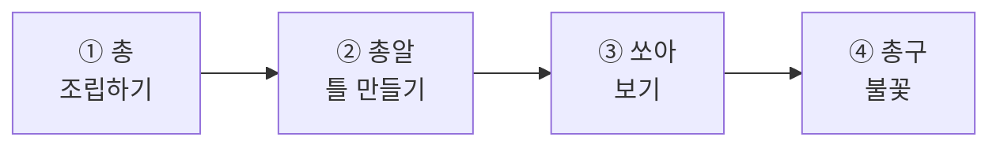
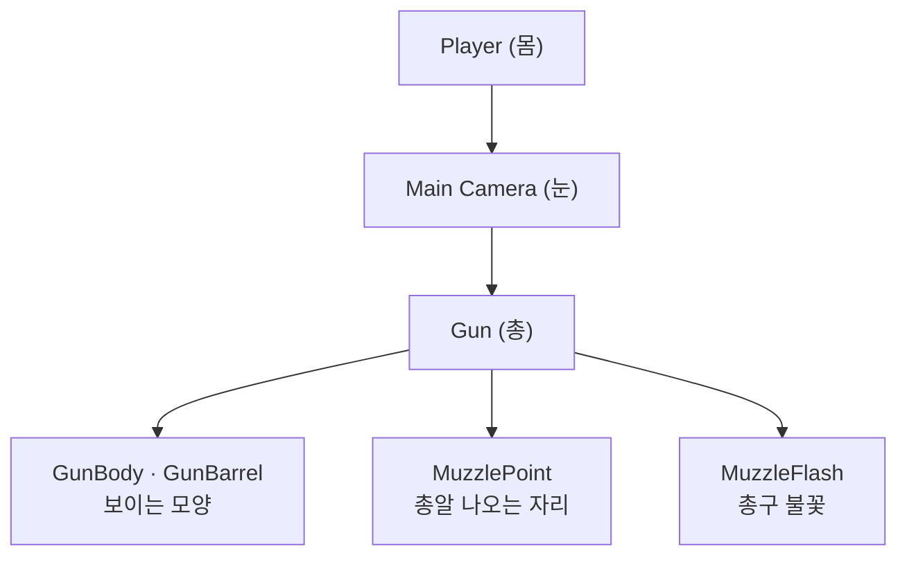
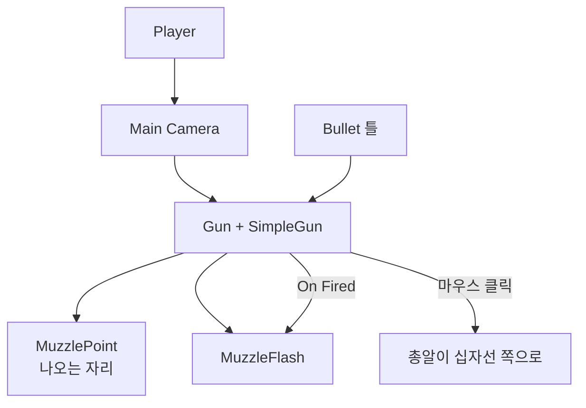

# **24차시. 총을 쏘게**
---

> ℹ️ **이 자료는 이렇게 보세요**
>
> - **강의 영상과 함께 보는 자료**입니다. 영상을 따라가시면서 옆에 두고 보시면 됩니다.
> - 이번 차시에도 **코드를 한 줄도 쓰지 않습니다.**
> - 오늘 하실 일은 **도형 조립하기, 자리 잡기, 값 조절하기** 정도입니다.
> - 23차시에 만든 **사격장을 그대로 씁니다.**

---

## **오늘의 목표**

이번 차시가 끝나면 여러분은 **코드 없이** 이런 것을 만드시게 됩니다.

- **손에 들린 것처럼 보이는 총**
- 마우스를 누르면 **총알이 눈에 보이게 날아가기**
- **총구에서 불꽃이 터지기**



> 💬 **23차시와 오늘의 차이**
>
> 23차시에는 표적이 날아왔지만 **바라볼 수밖에** 없었습니다.
> 오늘부터는 **쏠 수 있습니다.** 아직 맞아도 아무 일 없지만요.

---

## **1. 총은 카메라의 자식입니다**

1인칭 게임에서 총은 **항상 화면 같은 자리**에 있죠. 고개를 돌려도 따라옵니다.

어떻게 그럴까요? **카메라의 자식으로 붙여뒀기** 때문입니다.



| 22차시에 배운 것 | 오늘 쓰이는 곳 |
| :--- | :--- |
| 카메라를 **몸의 자식**으로 → 몸이 움직이면 눈이 따라옴 | 총을 **눈의 자식**으로 → 눈이 돌아가면 총이 따라옴 |

> ✅ **14차시의 규칙이 세 겹으로 쌓입니다**
>
> **몸 → 눈 → 총.**
>
> 몸이 걸으면 눈이 따라오고, 눈이 돌아가면 총이 따라옵니다.
> **부모가 움직이면 자식이 따라온다** — 이 규칙 하나로 전부 해결됩니다.

---

## **2. 총구 자리가 왜 따로 필요한가요**

총알이 **총 한가운데서** 나오면 어색합니다. **총구 끝**에서 나와야죠.

그래서 총구 끝에 **빈 그릇**을 하나 놓습니다. 이름은 `MuzzlePoint`.

| 이 빈 그릇이 하는 일 | |
| :--- | :--- |
| **위치** | 총알이 나오는 자리 |
| **방향** | (참고용 — 실제 방향은 아래 참고) |

> 📝 **빈 그릇은 '표시'입니다**
>
> 화면에 안 보이고, 아무 일도 안 합니다. **여기가 그 자리다**를 표시할 뿐이에요.
>
> 14차시의 `Car` 도 그랬죠. 빈 그릇은 **자리를 잡거나 묶는 데** 씁니다.

### **조준은 화면 한가운데 기준입니다**

여기가 조금 까다로운 부분입니다.

총은 화면 **오른쪽 아래**에 있는데, 조준점(십자선)은 **한가운데**에 있습니다.
총구에서 똑바로 쏘면 **십자선과 어긋납니다.**

> ✅ **부품이 알아서 맞춰줍니다**
>
> `SimpleGun` 은 **총알을 총구에서 내보내되, 방향은 십자선 쪽으로** 맞춥니다.
>
> 그래서 **십자선에 대고 쏘면 그리로 갑니다.** 여러분이 신경 쓰실 건 없어요.

---

## **3. 총알도 틀입니다**

총알은 **쏠 때마다 새로 만들어져야** 합니다. 23차시의 표적과 같습니다.

| | 표적 (23차시) | 총알 (오늘) |
| :--- | :--- | :--- |
| 무엇이 만드나 | `TargetLauncher` | **`SimpleGun`** |
| 언제 | 정해진 간격마다 | **마우스를 누를 때** |
| 수명 | `TargetLife` | **`Projectile` 의 `Life Time`** |

### **총알에 중력을 주면 안 됩니다**

총알은 **똑바로 날아가야** 합니다. 중력을 받으면 금방 아래로 떨어져요.

| Inspector 항목 | 값 |
| :--- | :--- |
| `Rigidbody` → **`Use Gravity`** | **체크 해제** |

> 💡 **21차시에 배운 그 체크입니다**
>
> `Use Gravity` 를 끄면 **공중에 뜬 채로** 있는다고 했죠.
> 총알은 그 상태에서 **앞으로만** 날아갑니다.

---

## **4. 연사 제한이 왜 필요한가요**

마우스를 연타하면 **총알이 수십 발** 한꺼번에 나갑니다. 게임이 무너져요.

그래서 **한 발 쏘고 잠깐 기다리는** 시간을 둡니다.

| Inspector 항목 | 무슨 뜻인가요 |
| :--- | :--- |
| **Fire Rate** | 한 발 쏘고 **다음 발까지 기다릴 시간**(초) |

| 값 | 느낌 |
| :---: | :--- |
| `0.1` | 기관총처럼 |
| **`0.3`** | **산탄총처럼 (권장)** |
| `1.0` | 한 발씩 신중하게 |

---

## **5. 총구 불꽃**

총을 쏠 때 총구에서 **번쩍** 하죠. 16차시에 배운 **흩날리는 효과**로 만듭니다.

| 16차시에 배운 것 | 오늘 |
| :--- | :--- |
| 파티클을 목록에서 골라 확인 | **총을 쏠 때마다 한 번씩 터뜨리기** |

> ✅ **이벤트에 연결하면 됩니다**
>
> `SimpleGun` 에는 **`On Fired`** 라는 칸이 있습니다. **"총을 쏠 때"** 라는 뜻이에요.
>
> 여기에 불꽃 터뜨리기를 연결하면 **쏠 때마다 자동으로** 터집니다.
>
> 19차시의 `On Stopped`, 21차시의 `On Hit` 과 **똑같은 구조**입니다.

---

## **6. 오늘 사용할 부품**

### **6.1 SimpleGun — 총**

| Inspector 항목 | 무슨 뜻인가요 | 어떻게 바꾸나요 |
| :--- | :--- | :--- |
| **Bullet Prefab** | 쏘아 보낼 **총알 틀** | 끌어다 놓기 |
| **Muzzle Point** | 총알이 **나올 자리** | 끌어다 놓기 |
| **Bullet Speed** | 총알이 날아가는 속도 | 숫자 입력 |
| **Fire Rate** | 다음 발까지 기다릴 시간 | 숫자 입력 |
| **Can Fire** | 쏠 수 있는지 | 체크 켜고 끄기 |

| 동작 이름 | 무슨 일을 하나요 |
| :--- | :--- |
| **Fire** | 한 발 쏘기 |
| **EnableFire** | 쏠 수 있게 |
| **DisableFire** | 못 쏘게 (게임 끝났을 때) |

| 이벤트 칸 | 무슨 뜻인가요 |
| :--- | :--- |
| **On Fired** | **총을 쏠 때마다** 같이 실행할 동작 |

### **6.2 Projectile — 총알**

| Inspector 항목 | 무슨 뜻인가요 |
| :--- | :--- |
| **Life Time** | 몇 초 뒤에 사라질지 |
| **Target Tag** | **이 이름표를 단 것**에 맞았을 때만 반응 |

| 이벤트 칸 | 무슨 뜻인가요 |
| :--- | :--- |
| **On Hit** | 표적에 **맞는 순간** |
| **On Miss** | 아무것도 못 맞히고 **사라질 때** |

> 📝 **속도는 총이 정합니다**
>
> 총알 틀에는 속도 칸이 없습니다. **`SimpleGun` 의 `Bullet Speed`** 하나로 정해요.
>
> 두 군데에 있으면 **어느 쪽이 이기는지 헷갈리기** 때문입니다.

---

## **7. 실습 — 직접 해보세요**

> ⚠️ **🟨 이 절은 아직 확정 전입니다**
>
> 아래 순서는 **잠정 초안**입니다.
> 특히 **총 위치 잡기(실습 ①)와 조준 정확도(실습 ③)** 는 에디터 검증(U-7) 결과로 확정됩니다.

---

### **실습 ① — 총 조립하기**

> 🎯 **목표**
>
> 기본 도형으로 총을 만들어 **카메라의 자식으로** 답니다.

1. Hierarchy 에서 **`Main Camera` 위에서 우클릭** → `Create Empty` → 이름을 **`Gun`** 으로
   → 카메라의 자식으로 들어갑니다.
2. `Gun` 의 `Position` 을 **`0.3, -0.25, 0.5`** 로
   → 화면 **오른쪽 아래**에 놓이게 됩니다.
3. `Gun` 위에서 우클릭 → `3D Object` → `Cube` → 이름 **`GunBody`**
   → `Scale` **`0.08, 0.1, 0.35`**
4. `Gun` 위에서 우클릭 → `3D Object` → `Cylinder` → 이름 **`GunBarrel`**
   → `Position` **`0, 0.03, 0.3`** / `Rotation` **`90, 0, 0`** / `Scale` **`0.03, 0.15, 0.03`**
5. `Gun` 위에서 우클릭 → `Create Empty` → 이름 **`MuzzlePoint`**
   → `Position` **`0, 0.03, 0.5`** (총구 끝)
6. 어두운 색 재료를 만들어 총에 입힙니다.
7. **▶** 를 눌러 **총이 화면에 보이는지, 둘러볼 때 따라오는지** 확인합니다.

    > 🟨 **U-7 `3-1` 결과로 확정** — 총 위치 잡기가 마우스만으로 편한지

<details>
<summary>✅ 확인해보세요</summary>

- 둘러볼 때 **총이 화면 같은 자리에 붙어 있나요?**
  → 카메라의 자식이라서 그렇습니다. **몸 → 눈 → 총**, 세 겹으로 따라옵니다.
- 총이 너무 크거나 화면을 가리면 **`Gun` 의 `Position` 과 `Scale`** 로 조절하세요.
- **정답이 없습니다.** 본인 눈에 자연스러우면 됩니다.

</details>

> ⚠️ **잘 안 되신다면**
>
> - 총이 안 보인다 → `Gun` 의 **`Position Z`** 를 키워 카메라 앞으로 보내세요.
> - 총이 화면을 다 가린다 → `Scale` 을 줄이거나 `Position Z` 를 키우세요.
> - 둘러봐도 총이 안 따라온다 → **`Main Camera` 의 자식**이 맞는지 확인해주세요.

---

### **실습 ② — 총알 틀 만들기**

> 🎯 **목표**
>
> **똑바로 날아가는 총알**을 만들어 틀로 저장합니다.

1. **Hierarchy** 우클릭 → `3D Object` → `Sphere` → 이름을 **`Bullet`** 으로
2. `Scale` 을 **`0.08, 0.08, 0.08`** 로 → 작은 구슬
3. **`Add Component`** → **`Rigidbody`** 추가
   → **`Use Gravity` 체크를 해제**합니다. (중력을 받으면 떨어집니다)
4. 강의자료의 **`Projectile`** 을 끌어다 놓습니다.

| 항목 | 값 |
| :--- | :--- |
| **Life Time** | `3` |
| **Target Tag** | `Target` |

5. 눈에 띄는 색(노란색 권장)을 입힙니다.
6. `Tag` → **`Add Tag...`** → **`Bullet`** 을 만들고, **다시 골라서 달아줍니다.**
7. **`Prefabs` 폴더로 끌어다 놓아** 틀로 만듭니다.
8. Hierarchy 의 `Bullet` 은 **지웁니다.**

<details>
<summary>✅ 확인해보세요</summary>

- `Use Gravity` 를 껐나요? → 안 끄면 총알이 **발밑으로 뚝 떨어집니다.**
- 이름표를 **만들고 달았나요?** → 25차시에 이게 있어야 명중 판정이 됩니다.
- 틀이 `Prefabs` 폴더에 생겼나요?

</details>

> ⚠️ **잘 안 되신다면**
>
> - `Target Tag` 칸에 뭘 넣을지 모르겠다 → 23차시에 만든 **`Target`** 입니다. 글자로 입력하시면 됩니다.

---

### **실습 ③ — 쏘아보기 (오늘의 핵심)**

> 🎯 **목표**
>
> **마우스를 누르면 총알이 날아가게** 만듭니다. 오늘의 결과물입니다.

1. **`Gun` 을 선택**하고 강의자료의 **`SimpleGun`** 을 끌어다 놓습니다.
2. 칸을 채웁니다.

| 칸 | 여기에 |
| :--- | :--- |
| **Bullet Prefab** | `Prefabs` 폴더의 **`Bullet`** |
| **Muzzle Point** | Hierarchy 의 **`MuzzlePoint`** |
| **Bullet Speed** | `40` |
| **Fire Rate** | `0.3` |

3. 화면 한가운데에 **십자선**을 만듭니다.
   → `Canvas` 위에서 우클릭 → `UI` → `Image` → 이름 **`Crosshair`**
   → 앵커를 **`center`** 로, `Width`·`Height` 를 **`8`** 로, 색을 눈에 띄게
4. **▶** 를 누르고 **마우스 왼쪽 버튼**을 눌러봅니다.
5. 표적이 날아올 때 **십자선을 맞춰 쏴봅니다.**

    > 🟨 **U-7 `3-4` · `3-5` 결과로 확정** — 십자선 방향으로 나가는지 / 눈에 보이는 속도인지

<details>
<summary>✅ 무슨 일이 일어났나요</summary>

**총알이 날아갑니다.** 그리고 **눈에 보입니다.**

맞아도 아직 아무 일도 없어요. **그건 다음 시간에** 만듭니다.

> 💡 **왜 눈에 보이는 총알을 쓰나요**
>
> 실제 게임 중에는 **보이지 않는 방식**을 쓰기도 합니다. 즉시 판정하는 거죠.
>
> 그런데 그러면 **뭐가 일어나는지 안 보입니다.**
> 21차시에 배운 **Collider · Rigidbody** 가 그대로 쓰이는 것도 이 방식이라서예요.

</details>

> 🚨 **꼭 알아두세요 — 커서와 값**
>
> - **▶ 중에는 커서가 잠깁니다.** ▶ 를 끄려면 **`Esc`** 를 먼저 누르세요. (22차시)
> - **▶ 중에 바꾼 값은 ▶ 를 끄면 사라집니다.** 값 조절은 ▶ 를 끄고 하세요.

> ⚠️ **잘 안 되신다면**
>
> - 총알이 안 나온다 → **`Bullet Prefab` 칸이 비어 있는지** 확인해주세요.
> - 총알이 너무 빨라 안 보인다 → **`Bullet Speed`** 를 `20` 정도로 낮춰보세요.
> - 총알이 발밑에 떨어진다 → 총알 틀의 **`Use Gravity`** 가 켜져 있습니다.
> - 총알이 십자선과 어긋난다 → **`Muzzle Point` 칸이 비어 있는지** 확인해주세요.

---

### **실습 ④ — 총구 불꽃 (선택)**

> 🎯 **목표**
>
> 쏠 때마다 **총구에서 불꽃이 터지게** 합니다.

1. `Gun` 위에서 우클릭 → `Effects` → `Particle System` → 이름 **`MuzzleFlash`**
   → `Position` 을 **`MuzzlePoint` 와 같게** 맞춥니다.
2. Inspector 에서 값을 맞춥니다.

| 항목 | 값 |
| :--- | :--- |
| **Play On Awake** | **체크 해제** (쏠 때만 터져야 하니까) |
| **Duration** | `0.1` |
| **Start Lifetime** | `0.05` |
| **Start Speed** | `2` |
| **Start Color** | 노란색·주황색 |

3. **`SimpleGun` 의 `On Fired`** 에서 **`+`** 클릭
4. **`MuzzleFlash` 를 왼쪽 칸에 끌어다 놓기**
5. 오른쪽 목록에서 **`ParticleSystem`** → **`Play`** 를 고릅니다.

    > 🟨 **U-7 `3-6` 결과로 확정** — 목록에 `ParticleSystem.Play` 가 나오는지
    > 안 나오면 강의자료의 **`MuzzleFlashPlayer`** 를 대신 씁니다.

6. **▶** 를 누르고 쏴봅니다.

<details>
<summary>✅ 확인해보세요</summary>

- 쏠 때마다 **총구에서 번쩍**하나요?
- `On Fired` 는 **"총을 쏠 때"** 라는 뜻입니다.
  → 19차시의 `On Stopped`, 21차시의 `On Hit` 과 **똑같은 구조**예요.
- 27차시에 여기에 **총소리**도 연결합니다.

</details>

> ⚠️ **잘 안 되신다면**
>
> - 계속 터지고 있다 → **`Play On Awake` 체크**를 꺼주세요.
> - 안 터진다 → `On Fired` 에 연결하셨는지, 왼쪽 칸이 비어 있지 않은지 확인해주세요.

---

## **8. 코드는 딱 한 번만 보고 갑니다**

```
Bullet Prefab 칸  ──→  [ 어떤 틀을 찍어낼지 ]
Bullet Speed 칸   ──→  [ Bullet Speed : 40 ]
Fire 동작         ──→  [ 마우스 클릭에 이어진 이름 ]
On Fired 칸       ──→  [ 쏠 때 같이 실행할 목록 ]
```

> ✅ **23차시와 같은 구조입니다**
>
> **정해진 틀을, 정해진 자리에서, 정해진 방향으로 만들어내는 것.**
>
> 표적 발사기와 총이 하는 일이 **사실상 같습니다.**
> 다른 건 **언제 만드느냐**뿐이에요. 하나는 시간마다, 하나는 클릭할 때.

---

## **9. 오늘 배운 것을 그림으로**



> ✅ **이 그림 하나만 기억하셔도 오늘은 성공입니다**
>
> - **몸 → 눈 → 총**, 부모-자식이 세 겹입니다.
> - **총알도 틀**입니다. 쏠 때마다 찍어냅니다.
> - **`On Fired`** 에 연결하면 쏠 때마다 같이 실행됩니다.

---

## **10. 정리 문제**

### **문제 1**
총이 **화면 같은 자리에 계속 붙어 있는** 이유는?

<details>
<summary>✅ 정답 보기</summary>

**카메라의 자식으로 붙여뒀기** 때문입니다.

**몸 → 눈 → 총** 세 겹으로 쌓여 있어서,
몸이 걸으면 눈이 따라오고 눈이 돌아가면 총이 따라옵니다.

14차시에 배운 **"부모가 움직이면 자식이 따라온다"** 그대로입니다.

</details>

### **문제 2**
총알 틀의 **`Use Gravity`** 를 끄는 이유는?

<details>
<summary>✅ 정답 보기</summary>

**똑바로 날아가야** 하기 때문입니다.

중력을 받으면 총알이 **발밑으로 뚝 떨어집니다.**
21차시에 배운 **"끄면 공중에 뜬 채로 있는다"** 를 이용한 겁니다.

</details>

### **문제 3**
**`Fire Rate`** 가 없으면 어떻게 될까요?

<details>
<summary>✅ 정답 보기</summary>

마우스를 연타하면 **총알이 수십 발 한꺼번에** 나갑니다. 게임이 무너져요.

`Fire Rate` 는 **한 발 쏘고 다음 발까지 기다릴 시간**입니다.

| 값 | 느낌 |
| :---: | :--- |
| `0.1` | 기관총 |
| `0.3` | 산탄총 |
| `1.0` | 한 발씩 신중하게 |

</details>

### **문제 4**
**`MuzzlePoint`** 라는 빈 그릇은 왜 필요한가요?

<details>
<summary>✅ 정답 보기</summary>

**총알이 나올 자리를 표시**하기 위해서입니다.

총 한가운데서 나오면 어색하니까, **총구 끝**에 표시를 하나 두는 거예요.

빈 그릇은 화면에 안 보이고 아무 일도 안 합니다.
**자리를 잡거나 묶는 데** 씁니다. 14차시의 `Car` 도 그랬죠.

</details>

### **문제 5**
`TargetLauncher`(23차시)와 `SimpleGun`(오늘)의 **공통점**은?

<details>
<summary>✅ 정답 보기</summary>

**정해진 틀을, 정해진 자리에서, 정해진 방향으로 만들어냅니다.**

사실상 **같은 일**을 합니다. 다른 건 **언제 만드느냐**뿐이에요.

- `TargetLauncher` → **시간마다**
- `SimpleGun` → **마우스를 클릭할 때**

</details>

---

## **11. 앞으로 조심할 것**

> ⚠️ **흔한 실수**
>
> - **`Use Gravity` 를 안 끄기** → 총알이 발밑에 떨어집니다.
> - **총을 카메라 밖에 만들기** → 둘러봐도 안 따라옵니다.
> - **`Play On Awake` 를 안 끄기** → 총구가 계속 번쩍입니다.
> - **▶ 중에 값 맞추기** → 끄면 사라집니다.

> 💡 **좋은 습관 하나**
>
> **총알 속도는 `20` ~ `40` 사이가 적당합니다.**
> 너무 빠르면 **눈에 안 보여서** 뭐가 일어나는지 모릅니다. 실제 총알처럼 만들 필요 없어요.

---

## **12. 오늘의 정리**

> ✅ **세 줄 요약**
>
> 1. **몸 → 눈 → 총**, 부모-자식이 세 겹으로 쌓인다.
> 2. **총알도 틀**이다. 쏠 때마다 찍어낸다.
> 3. **`On Fired`** 에 연결하면 쏠 때마다 같이 실행된다.

오늘 여러분의 손에 **총이 생겼습니다.**
다음 시간이면 맞힐 수 있어요. 충분히 잘하셨습니다.

---

## **13. 다음 차시 준비**

> 🧩 **25차시 — 맞으면 터지고 점수가**
>
> **다음 시간에 게임이 됩니다.**
>
> 맞히면 표적이 **터지고**, **점수가 오릅니다.**
> 지금까지 배운 게 전부 모이는 차시예요.

> 📝 **미리 해두시면 좋은 것**
>
> - [ ] 오늘 만든 것을 **`Ctrl + S` 로 저장**해두기
> - [ ] 씬을 **`24_완료` 로 복사**해두기
> - [ ] 강의자료의 **`HitScorer` · `Hittable` · `FeedbackSpawner`** 가 들어 있는지 확인
> - [ ] **17~19차시에 만든 점수판**이 어땠는지 한 번 떠올려보기 (다음 시간에 씁니다)

---

## **부록 — 오늘 나온 용어 정리**

| 화면에 보이는 이름 | 우리말로 하면 |
| :--- | :--- |
| **Bullet Prefab** | 총알 틀 |
| **Muzzle Point** | 총알이 나올 자리 |
| **Bullet Speed** | 총알 속도 |
| **Fire Rate** | 다음 발까지 기다릴 시간 |
| **Can Fire** | 쏠 수 있는지 |
| **Fire** | 한 발 쏘기 |
| **EnableFire / DisableFire** | 쏠 수 있게 / 못 쏘게 |
| **On Fired** | 총을 쏠 때마다 |
| **On Hit / On Miss** | 맞았을 때 / 못 맞혔을 때 |
| **Use Gravity** | 중력을 받을지 |
| **Play On Awake** | 시작하자마자 재생할지 |
| **Crosshair** | 십자선 (조준점) |
