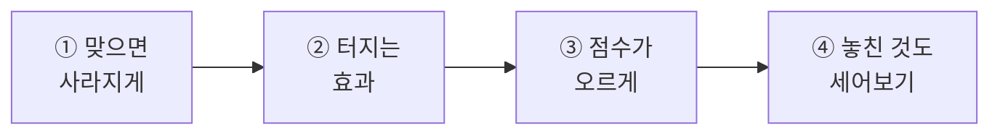
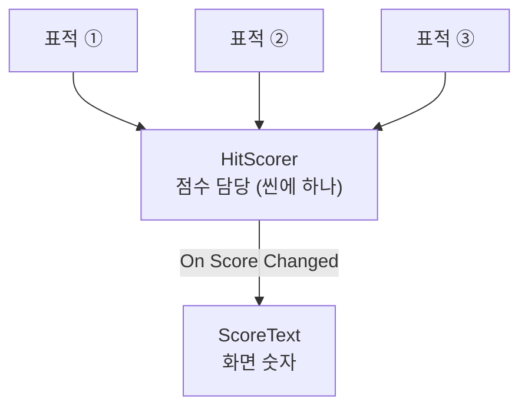
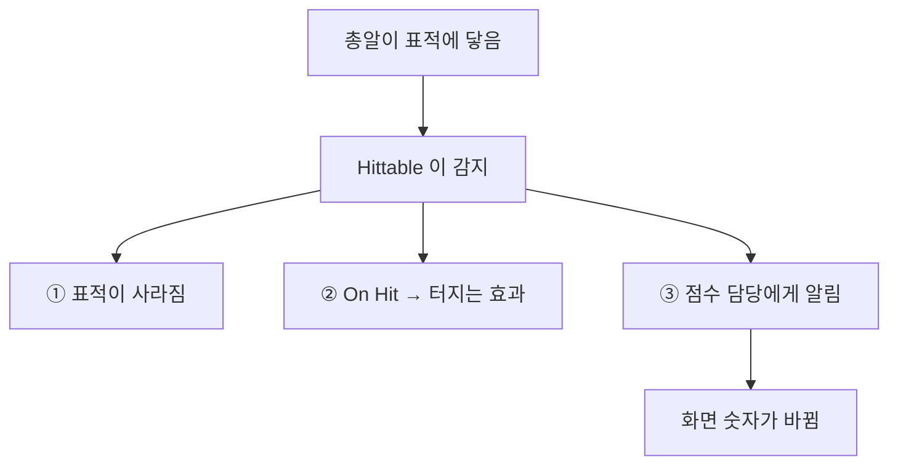
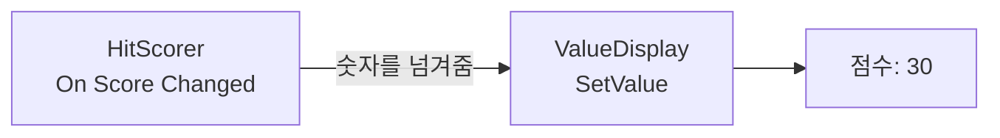
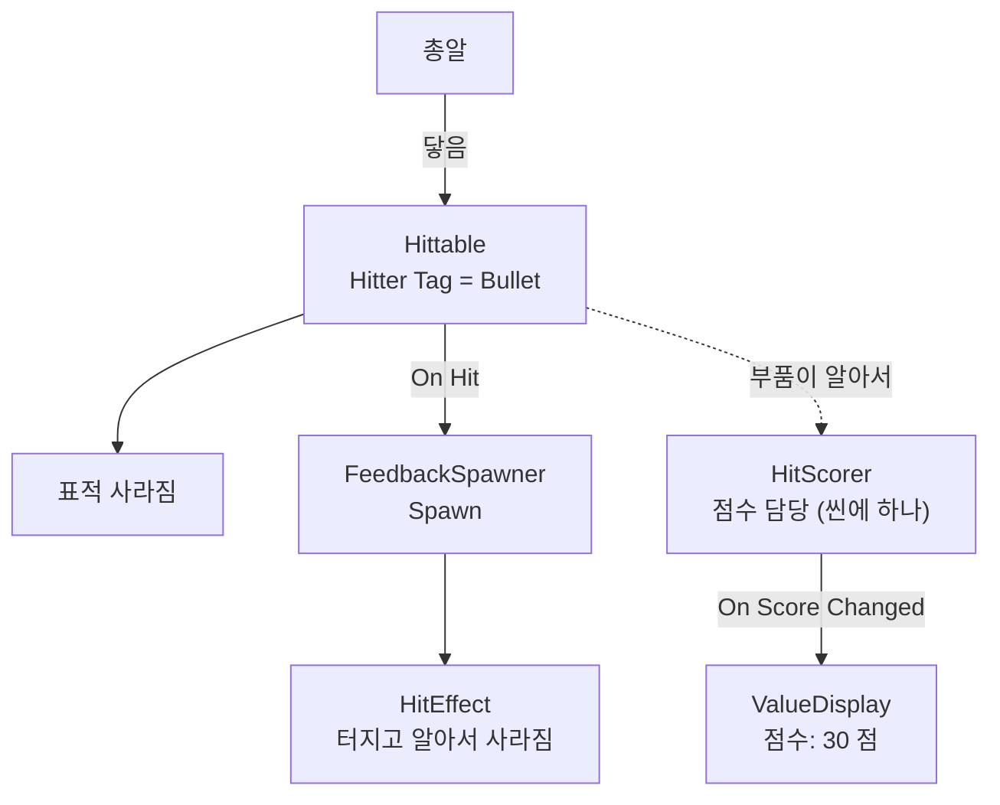

# **25차시. 맞으면 터지고 점수가 오르게**
---

!!! info "이 자료는 이렇게 보세요"
    - **강의 영상과 함께 보는 자료**입니다. 영상을 따라가시면서 옆에 두고 보시면 됩니다.
    - 이번 차시에도 **코드를 한 줄도 쓰지 않습니다.**
    - 오늘 하실 일은 **부품 붙이기, 이름표 확인하기, 이벤트 연결하기**입니다.
    - **오늘 게임이 됩니다.** 여섯 차시 중 가장 중요한 날이에요.

---

## **오늘의 목표**

이번 차시가 끝나면 여러분은 **코드 없이** 이런 것을 만드시게 됩니다.

- 총알이 맞으면 **표적이 사라지기**
- 맞은 자리에서 **터지는 효과**
- **점수가 오르고 화면에 표시되기**



!!! success "오늘이 봉우리입니다"
    22차시부터 하나씩 쌓아왔는데, **오늘 그게 게임이 됩니다.**

    시작이 있고, 표적이 날아오고, 쏠 수 있고, **맞으면 점수가 오릅니다.**
    26·27차시는 여기에 다듬는 일이에요.

---

## **1. 누가 맞았다는 걸 알아채나요**

총알이 표적에 닿았을 때, **누가 그걸 감지할까요?**

둘 다 가능합니다. 그런데 **표적이 감지하는 쪽**이 훨씬 편합니다.

| | 총알이 감지 | **표적이 감지** ✅ |
| :--- | :--- | :--- |
| 사라져야 하는 것 | 표적 (남에게 시켜야 함) | **자기 자신** |
| 터져야 하는 자리 | 표적 자리 (남의 자리) | **자기 자리** |
| 점수를 올리는 것 | 표적이 몇 점인지 모름 | **자기가 몇 점인지 앎** |

!!! success "핵심 한 줄"
    **맞은 쪽이 반응합니다.**

    표적이 **"나 맞았다"** 를 알아채고, 사라지고, 터지고, 점수를 올립니다.

21차시에 배운 그대로입니다. `CollisionReporter` 를 공에 붙여서 **공이 바닥을 감지**하게 했었죠.

---

## **2. 점수판은 하나, 표적은 수십 개**

여기가 오늘 **가장 중요한 부분**입니다. 그리고 처음엔 좀 이상하게 느껴집니다.

### **여기서 걸리는 것**

점수판은 화면에 **하나**입니다. 그런데 표적은 **계속 새로 만들어집니다.**

**표적 하나하나가 점수판을 알고 있을 수는 없습니다.**
15차시에 배운 **틀(Prefab)** 을 떠올려보세요. 틀은 **미리 만들어둔 파일**이고, 점수판은 **씬 안에 있는 물건**입니다.

!!! warning "실제로 안 됩니다"
    표적 틀의 칸에 **점수판을 끌어다 놓으려고 해보세요. 안 들어갑니다.**

    틀은 **아직 씬에 나오지도 않은 상태**라, 씬 안의 물건을 가리킬 수가 없어요.
    **오늘 실습에서 직접 해보시고 확인하시게 됩니다.**

### **해결 — 심판을 한 명 둡니다**

축구 경기를 생각해보세요.

| 축구장 | 우리 게임 |
| :--- | :--- |
| 선수는 여러 명 | 표적이 여러 개 |
| **심판은 한 명** | **점수 담당이 하나** |
| 골이 들어가면 **심판에게 알림** | 표적이 맞으면 **점수 담당에게 알림** |
| 심판이 점수판을 올림 | 점수 담당이 화면 숫자를 바꿈 |

**선수가 각자 점수판을 들고 다니지 않습니다.** 심판 한 명이 관리하죠.



!!! success "여러분이 하실 일은 두 가지뿐입니다"
    1. **씬에 점수 담당(`HitScorer`)을 하나 놓는다**
    2. **그 담당을 화면 숫자와 연결한다**

    표적이 담당을 찾아가는 건 **부품이 알아서** 합니다. 신경 안 쓰셔도 돼요.

---

## **3. 맞았을 때 일어나는 일 세 가지**



| 순서 | 무엇이 | 어떻게 |
| :---: | :--- | :--- |
| ① | 표적이 **사라짐** | `Hittable` 의 `Destroy On Hit` |
| ② | **터지는 효과** | `On Hit` → `FeedbackSpawner.Spawn` |
| ③ | **점수** | 부품이 알아서 (여러분은 안 하셔도 됩니다) |

!!! note "②가 ①보다 먼저 일어납니다"
    표적이 사라지기 **전에** 효과를 만들어야 합니다. 안 그러면 효과도 같이 사라져요.

    부품이 순서를 지켜주니까 **신경 안 쓰셔도 됩니다.** 다만 왜 그런지는 알아두시면 좋아요.

---

## **4. 터지는 효과도 틀입니다**

23차시의 표적, 24차시의 총알과 같습니다. **만들어질 때마다 새로 찍어냅니다.**

그런데 효과는 **터지고 나면 알아서 사라져야** 합니다. 안 그러면 쌓이죠.

| Particle System 항목 | 값 | 뜻 |
| :--- | :--- | :--- |
| **Play On Awake** | **체크** | 만들어지자마자 터짐 |
| **Looping** | **체크 해제** | 한 번만 터짐 |
| **Stop Action** | **`Destroy`** | **다 터지면 스스로 사라짐** |

!!! success "치우는 부품을 따로 안 만들어도 됩니다"
    `Stop Action` 을 `Destroy` 로 두면 **파티클이 알아서 자기를 지웁니다.**

    23차시에 `TargetLife` 를 붙였던 것과 같은 일을, **설정 하나로** 해결하는 거예요.

---

## **5. 점수를 화면에 띄우기**

**18차시에 배운 것이 그대로 쓰입니다.**



| 18차시에는 | 오늘은 |
| :--- | :--- |
| **슬라이더**가 값을 넘겨줌 | **점수 담당**이 값을 넘겨줌 |
| `On Value Changed` | `On Score Changed` |
| **`Dynamic float`** 을 골랐음 | **`Dynamic float`** 을 고름 |

!!! tip "`Dynamic` 을 다시 만납니다"
    18차시에 **위쪽 `Dynamic float`** 을 골라야 한다고 했었죠.
    아래쪽 `Static` 을 고르면 **미리 정한 고정 숫자**가 들어간다고요.

    **오늘도 똑같습니다.** 위쪽을 고르셔야 점수가 따라옵니다.

---

## **6. 오늘 사용할 부품 세 개**

### **6.1 HitScorer — 점수 담당 (씬에 하나)**

| Inspector 항목 | 무슨 뜻인가요 |
| :--- | :--- |
| **Points Per Hit** | 한 번 맞힐 때마다 오를 점수 |

| 동작 이름 | 무슨 일을 하나요 |
| :--- | :--- |
| **AddScore** | 점수 올리기 |
| **ResetScore** | 점수를 `0` 으로 |

| 이벤트 칸 | 무슨 뜻인가요 |
| :--- | :--- |
| **On Score Changed** | 점수가 바뀔 때마다. **현재 점수를 숫자로 넘겨줍니다** |

!!! danger "씬에 하나만 두세요"
    여러 개 두면 **어느 쪽에 점수가 쌓일지 알 수 없습니다.**

    `GameManager` 같은 **빈 그릇 하나**를 만들어 거기에 붙이시면 됩니다.

### **6.2 Hittable — 맞으면 반응 (표적 틀에)**

| Inspector 항목 | 무슨 뜻인가요 |
| :--- | :--- |
| **Hitter Tag** | **이 이름표를 단 것**에 맞았을 때만 반응 |
| **Destroy On Hit** | 맞으면 사라질지 |
| **Add Score** | 점수를 올릴지 |

| 이벤트 칸 | 무슨 뜻인가요 |
| :--- | :--- |
| **On Hit** | **맞는 순간** 같이 실행할 동작 |

### **6.3 FeedbackSpawner — 효과 만들기 (표적 틀에)**

| Inspector 항목 | 무슨 뜻인가요 |
| :--- | :--- |
| **Effect Prefab** | 만들어낼 **효과 틀** |
| **Spawn Offset** | 얼마나 떨어진 자리에 만들지 |

| 동작 이름 | 무슨 일을 하나요 |
| :--- | :--- |
| **Spawn** | 효과를 하나 만들어내기 |

---

## **7. 실습 — 직접 해보세요**

!!! warning "🟨 이 절은 아직 확정 전입니다"
    아래 순서는 **잠정 초안**입니다.
    특히 **실습 ③의 점수 연결**은 에디터 검증(U-7 `4-4` ~ `4-6`) 결과로 확정됩니다.

---

### **실습 ① — 맞으면 사라지게**

!!! abstract "목표"
    총알이 맞으면 **표적이 사라지는** 것까지 만듭니다.

1. `Prefabs` 폴더의 **`Target` 을 더블클릭**해 틀 고치는 방으로 들어갑니다.
   → 15차시에 배운 그 방식입니다.
2. 강의자료의 **`Hittable`** 을 끌어다 놓습니다.
3. 값을 맞춥니다.

| 항목 | 값 |
| :--- | :--- |
| **Hitter Tag** | `Bullet` |
| **Destroy On Hit** | ☑ 체크 |
| **Add Score** | ☑ 체크 |

4. 왼쪽 위 **`<`** 로 나옵니다.
5. **▶** 를 누르고 표적을 맞혀봅니다.

??? success "확인해보세요"
    - 맞으면 **표적이 사라지나요?**
    - 안 맞으면 그대로 날아가다가 **5초 뒤에 사라지죠?** (23차시의 `TargetLife`)
    - 아직 점수는 안 오릅니다. 그건 실습 ③에서요.
    - **틀을 고쳤으니 앞으로 나오는 표적 전부**에 적용됩니다. 15차시의 그 원리입니다.

!!! warning "잘 안 되신다면"
    - 맞아도 안 사라진다 → 총알 틀의 **`Tag` 가 `Bullet` 인지** 확인해주세요. 만들기만 하고 안 달았을 수 있습니다.
    - 총알이 표적을 통과한다 → 총알이 **너무 빠르면** 지나칠 수 있습니다. `Bullet Speed` 를 낮춰보세요.

---

### **실습 ② — 터지는 효과**

!!! abstract "목표"
    맞은 자리에서 **파티클이 터지게** 합니다.

#### **1단계 — 효과 틀 만들기**

1. **Hierarchy** 우클릭 → `Effects` → `Particle System` → 이름을 **`HitEffect`** 로
2. 값을 맞춥니다.

| 항목 | 값 |
| :--- | :--- |
| **Duration** | `0.5` |
| **Looping** | **체크 해제** |
| **Play On Awake** | ☑ **체크** |
| **Start Lifetime** | `0.4` |
| **Start Speed** | `5` |
| **Start Color** | 주황색·노란색 |
| **Stop Action** | **`Destroy`** |

3. **`Prefabs` 폴더로 끌어다 놓아** 틀로 만들고, Hierarchy 의 것은 **지웁니다.**

#### **2단계 — 표적에 연결하기**

4. `Prefabs` 의 **`Target` 을 더블클릭**해 들어갑니다.
5. 강의자료의 **`FeedbackSpawner`** 를 끌어다 놓습니다.
6. **`Effect Prefab`** 칸에 **`HitEffect` 틀**을 끌어다 놓습니다.
7. **`Hittable` 의 `On Hit`** 에서 **`+`** 클릭
8. **`Target` 자기 자신을 왼쪽 칸에 끌어다 놓기**
   → 틀 고치는 방 안에서는 **Hierarchy 의 `Target` 을** 끌면 됩니다.
9. 오른쪽 목록 → **`FeedbackSpawner`** → **`Spawn`**
10. **`<`** 로 나와서 **▶** → 맞혀봅니다.

??? success "확인해보세요"
    - 맞은 자리에서 **터지나요?**
    - 효과가 **알아서 사라지나요?** → `Stop Action` 이 `Destroy` 라서 그렇습니다.
    - 여기서 중요한 게 있습니다. **틀 안에서 틀을 끌어다 놓는 건 됩니다.**
      → `Target` 틀의 칸에 `HitEffect` 틀을 넣었죠. **둘 다 틀**이라 가능합니다.

!!! warning "잘 안 되신다면"
    - 안 터진다 → `Effect Prefab` 칸이 **비어 있는지**, `On Hit` 왼쪽 칸이 **`None` 인지** 확인해주세요.
    - 계속 터지고 있다 → **`Looping` 체크**를 꺼주세요.
    - 효과가 쌓인다 → **`Stop Action`** 을 `Destroy` 로 하셨는지 확인해주세요.

---

### **실습 ③ — 점수가 오르게 (오늘의 핵심)**

!!! abstract "목표"
    **맞히면 점수가 오르고 화면에 표시되게** 합니다. 게임이 완성되는 순간입니다.

#### **1단계 — 안 되는 걸 먼저 해봅니다**

1. `Prefabs` 의 **`Target` 을 더블클릭**해 들어갑니다.
2. `Hittable` 의 `On Hit` 에 **`+`** 를 하나 더 만듭니다.
3. **씬에 있는 점수판(글자)을 왼쪽 칸에 끌어다 놓으려고 해보세요.**
   → **안 들어갑니다.**

    > 🟨 **U-7 `4-4` 로 확인** — 실제로 안 들어가는지

??? success "왜 안 될까요"
    **틀은 아직 씬에 나오지도 않은 상태**입니다.

    지금 이 `Target` 은 **파일**이에요. 씬 안의 점수판을 가리킬 수가 없습니다.

    그래서 **심판을 한 명 두는** 방식을 씁니다. 방금 만든 `+` 는 **지워주세요.**

#### **2단계 — 점수 담당을 놓습니다**

4. **`<`** 로 나옵니다.
5. **Hierarchy** 우클릭 → `Create Empty` → 이름을 **`GameManager`** 로
   → 이미 만드셨으면 그걸 쓰시면 됩니다.
6. 강의자료의 **`HitScorer`** 를 끌어다 놓고, **`Points Per Hit`** 을 **`10`** 으로

#### **3단계 — 화면에 띄웁니다**

7. `Canvas` 위에서 우클릭 → `UI` → `Text - TextMeshPro` → 이름을 **`ScoreText`** 로
   → 앵커를 **`top-right`** 로 (`Alt` 누르고), 한글 글꼴을 지정합니다.
8. **`ScoreText`** 에 강의자료의 **`ValueDisplay`** 를 끌어다 놓습니다.

| 항목 | 값 |
| :--- | :--- |
| **Prefix** | `점수: ` |
| **Suffix** | ` 점` |
| **Decimals** | `0` |

9. **`GameManager` 를 선택**하고 `HitScorer` 의 **`On Score Changed`** 에서 **`+`** 클릭
10. **`ScoreText` 를 왼쪽 칸에 끌어다 놓기**
11. 오른쪽 목록 → **위쪽 `Dynamic float`** 의 **`ValueDisplay`** → **`SetValue`**

    > 🟨 **U-7 `4-6` 으로 확인** — `Dynamic float` 항목이 나오는지

12. **▶** 를 누르고 표적을 맞혀봅니다.

??? success "무슨 일이 일어났나요"
    **맞힐 때마다 점수가 10씩 오릅니다.**

    그리고 여러분이 하신 일을 보세요.

    - 표적 틀에는 **`Hittable` 만** 붙였습니다
    - 씬에는 **점수 담당을 하나** 놓았습니다
    - **담당과 화면 숫자를 연결**했습니다

    **표적이 담당을 찾아가는 건 안 하셨습니다.** 부품이 알아서 했어요.

    !!! success "오늘 게임이 됐습니다"
        시작이 있고, 표적이 날아오고, 쏠 수 있고, **맞으면 점수가 오릅니다.**

        22차시부터 네 시간 동안 쌓아온 게 **오늘 하나로 이어졌습니다.**

!!! danger "꼭 알아두세요 — 값이 사라지는 이유"
    **▶ 를 누른 상태에서 바꾼 값은, ▶ 를 끄면 전부 사라집니다.**

    오늘은 연결이 많아서 ▶ 를 자주 켜게 됩니다.
    **붙이고 연결하는 작업은 ▶ 가 꺼진 상태에서** 하세요.

!!! warning "잘 안 되신다면"
    - 점수가 **안 오른다** → 씬에 **`HitScorer` 가 있는지** 확인해주세요. Console 에 노란 경고가 떴을 겁니다.
    - 점수는 오르는데 **화면이 안 바뀐다** → 목록에서 **아래쪽 `Static`** 을 고르신 겁니다. **위쪽 `Dynamic float`** 으로 다시 골라주세요. (18차시의 그 함정)
    - 글자가 **네모(☐)** 로 나온다 → 한글 글꼴을 지정해주세요. (18차시)
    - `HitScorer` 가 **두 개 이상** 있다 → 하나만 남기세요.

---

### **실습 ④ — 놓친 것도 세어보기 (선택)**

!!! abstract "목표"
    **못 맞히고 사라진 표적**도 세어봅니다. 23차시의 `On Expired` 를 씁니다.

1. `Canvas` 에 글자를 하나 더 만듭니다. 이름은 **`MissText`**
2. **`ValueDisplay`** 를 붙이고 `Prefix` 를 **`놓침: `** 으로
3. `GameManager` 에 **`HitScorer` 를 하나 더** 붙입니다.
   → 이번엔 **놓침 담당**입니다. `Points Per Hit` 을 **`1`** 로

    !!! warning "잠깐, 아까 하나만 두라고 했는데요"
        맞습니다. **표적이 알아서 찾아가는 담당은 하나여야** 합니다.

        그런데 이 두 번째 담당은 **아무도 자동으로 찾아가지 않습니다.**
        여러분이 **직접 연결**해서 쓰는 거예요. 그래서 괜찮습니다.

        > 🟨 **U-7 결과로 확정** — 두 번째 `HitScorer` 가 자동 탐색을 방해하지 않는지

4. 두 번째 `HitScorer` 의 `On Score Changed` → **`MissText`** → `ValueDisplay.SetValue`
5. `Prefabs` 의 **`Target`** 으로 들어가 **`TargetLife` 의 `On Expired`** 에 **`+`**
6. 여기서도 **씬의 담당을 끌어다 놓을 수 없습니다.**
   → 대신 **`Target` 자기 자신** 을 넣고, 목록에서 **`Hittable`** 은 쓸 수 없으니...

??? success "여기서 막히는 게 정상입니다"
    **틀에서 씬의 담당을 부를 방법이 없습니다.**

    실습 ③에서 배운 그 제약이 **여기서 또 나옵니다.**

    !!! tip "그래서 실제로는 이렇게 합니다"
        **"놓침"까지 세려면 부품을 하나 더 만들어야 합니다.**

        오늘은 **"이런 제약이 있다"** 를 아신 것으로 충분합니다.
        모든 걸 노코드로 할 수 있는 건 아니고, **어디까지 되는지 아는 것**도 중요한 감각이에요.

    대신 **`On Expired` 에 소리나 효과를 연결**해보세요. 그건 틀 안에서 되니까요.

---

## **8. 코드는 딱 한 번만 보고 갑니다**

```
Points Per Hit 칸    ──→  [ Points Per Hit : 10 ]
Hitter Tag 칸        ──→  [ Hitter Tag : Bullet ]
On Score Changed 칸  ──→  [ 바뀐 점수를 넘겨주는 자리 ]
```

!!! success "오늘 숨겨진 것 하나"
    표적이 **점수 담당을 찾아가는 부분**은 여러분이 안 하셨습니다. 부품 안에 들어 있어요.

    **왜 숨겼을까요?**
    그건 **"어떻게 찾을까"** 에 대한 이야기지, **"무엇을 만들까"** 에 대한 이야기가 아니기 때문입니다.

!!! quote "노코드의 경계"
    **여러분이 정하는 것**: 무엇이 · 무엇에 맞으면 · 몇 점이 오르고 · 어디에 표시될지
    **부품이 하는 것**: 어떻게 찾아가고 어떻게 계산할지

    **앞의 것이 기획이고, 뒤의 것이 구현입니다.** 오늘 여러분은 기획을 하셨습니다.

---

## **9. 오늘 배운 것을 그림으로**



!!! success "이 그림 하나만 기억하셔도 오늘은 성공입니다"
    - **맞은 쪽이 반응**합니다.
    - **점수 담당은 씬에 하나**, 표적이 찾아갑니다.
    - **`Dynamic float`** 으로 연결해야 숫자가 따라옵니다.

---

## **10. 정리 문제**

### **문제 1**
총알과 표적 중에 **누가 감지하게** 만들었나요? 왜죠?

??? success "정답 보기"
    **표적이 감지합니다.**

    사라져야 하는 것도, 터져야 하는 자리도, 몇 점인지도 **전부 표적 자신의 일**이기 때문입니다.

    **맞은 쪽이 반응한다.** 21차시에 공이 바닥을 감지했던 것과 같습니다.

### **문제 2**
표적 틀에서 **씬의 점수판을 끌어다 놓을 수 없는** 이유는?

??? success "정답 보기"
    **틀은 아직 씬에 나오지도 않은 파일**이기 때문입니다.

    씬 안의 물건을 가리킬 수가 없어요.

    그래서 **심판을 한 명 두는** 방식을 씁니다.
    축구에서 선수가 각자 점수판을 들고 다니지 않는 것과 같아요.

### **문제 3**
점수는 오르는데 **화면 숫자가 안 바뀝니다.**

??? success "정답 보기"
    목록에서 **아래쪽 `Static Parameters`** 를 고르셨을 가능성이 큽니다.

    - **위쪽 `Dynamic float`** → 넘겨받은 점수를 씁니다 ✅
    - **아래쪽 `Static`** → 미리 적어둔 고정 숫자가 들어갑니다

    **18차시의 그 함정이 그대로 다시 나옵니다.**

### **문제 4**
터지는 효과가 **화면에 쌓입니다.** 무엇을 확인할까요?

??? success "정답 보기"
    Particle System 의 **`Stop Action` 이 `Destroy`** 인지 확인합니다.

    그리고 **`Looping` 이 꺼져 있는지**도요. 켜져 있으면 계속 터집니다.

    23차시의 `TargetLife` 처럼, **만들어내는 게 있으면 치우는 것도 있어야** 합니다.

### **문제 5**
`HitScorer` 를 **씬에 하나만** 두라고 한 이유는?

??? success "정답 보기"
    **표적이 알아서 찾아가기 때문**입니다.

    여러 개 있으면 **어느 쪽에 점수가 쌓일지 알 수 없습니다.**

    `GameManager` 같은 빈 그릇 하나에 붙여두시면 됩니다.

---

## **11. 앞으로 조심할 것**

!!! warning "흔한 실수"
    - **`Static` 을 골라서 "숫자가 안 바뀌어요" 하기** → 18차시부터 계속 나오는 함정입니다.
    - **이름표를 안 달기** → 총알에 `Bullet` 이름표가 있어야 표적이 알아봅니다.
    - **`HitScorer` 를 여러 개 두기** → 하나만 두세요.
    - **`Stop Action` 을 안 걸기** → 효과가 쌓입니다.

!!! tip "좋은 습관 하나"
    **틀을 고칠 때는 반드시 `Prefabs` 폴더의 것을 더블클릭해서 들어가세요.**
    씬에 날아다니는 표적을 고쳐봐야 **그 하나만** 바뀌고, 다음에 나오는 표적은 그대로입니다.

---

## **12. 오늘의 정리**

!!! success "세 줄 요약"
    1. **맞은 쪽이 반응한다.**
    2. **점수 담당은 씬에 하나**, 표적이 찾아간다. (틀은 씬을 가리킬 수 없으니까)
    3. **`Dynamic float`** 으로 연결해야 숫자가 따라온다.

**오늘 게임이 됐습니다.**

22차시에 빈 사격장을 만들고, 23차시에 표적을 띄우고, 24차시에 총을 만들고,
오늘 그게 **하나로 이어졌습니다.** 코드는 한 줄도 안 쓰고요.

**충분히 잘하셨습니다.** 여기까지 오신 것만으로 큰일을 하신 거예요.

---

## **13. 다음 차시 준비**

!!! example "26차시 — 난이도와 시간"
    게임은 됐는데 **끝이 없습니다.** 계속 쏘기만 하죠.

    다음 시간에는 **제한 시간**을 넣고, **난이도를 버튼 세 개로** 고를 수 있게 만듭니다.
    23차시에 맛봤던 그 값들이 여기서 쓰입니다.

!!! note "미리 해두시면 좋은 것"
    - [ ] 오늘 만든 것을 **`Ctrl + S` 로 저장**해두기
    - [ ] 씬을 **`25_완료` 로 복사**해두기 (**게임이 되는 첫 버전이라 특히 중요합니다**)
    - [ ] 강의자료의 **`RoundTimer` · `DifficultyPreset`** 이 들어 있는지 확인
    - [ ] 한 번 **직접 플레이해보세요.** 어디가 심심하고 어디가 어려운지 느껴보시면 다음 시간이 재밌어집니다.

---

## **부록 — 오늘 나온 용어 정리**

| 화면에 보이는 이름 | 우리말로 하면 |
| :--- | :--- |
| **Hittable** | 맞으면 반응하는 부품 |
| **Hitter Tag** | 무엇에 맞았을 때 반응할지 |
| **Destroy On Hit** | 맞으면 사라질지 |
| **HitScorer** | 점수 담당 (씬에 하나) |
| **Points Per Hit** | 한 번 맞힐 때 오를 점수 |
| **AddScore / ResetScore** | 점수 올리기 / 0으로 |
| **On Score Changed** | 점수가 바뀔 때마다 |
| **FeedbackSpawner** | 효과를 만들어내는 부품 |
| **Effect Prefab** | 만들어낼 효과 틀 |
| **Spawn** | 효과 하나 만들기 |
| **Stop Action → Destroy** | 다 재생되면 스스로 사라지기 |
| **Looping** | 계속 반복할지 |
| **Dynamic float** | 넘겨받은 숫자를 그대로 쓰기 |
