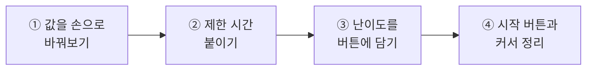
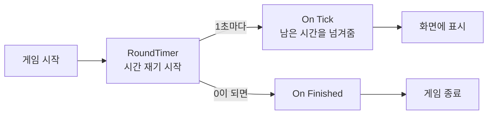
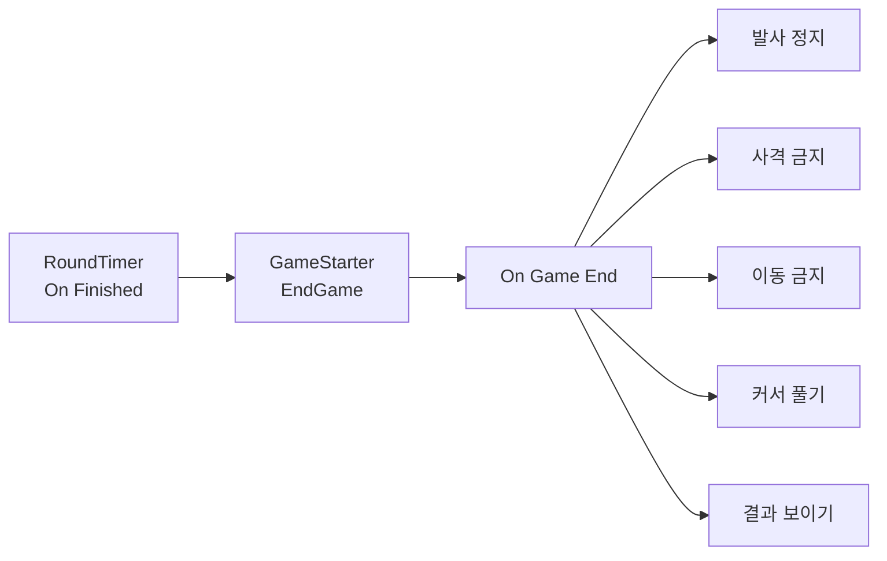
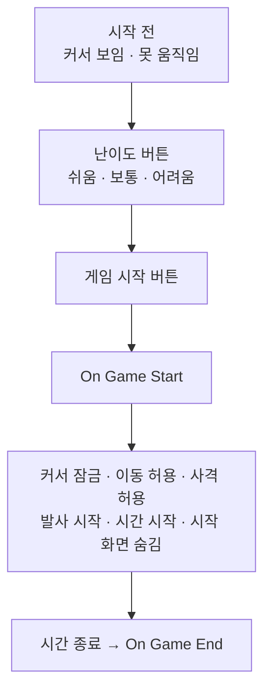
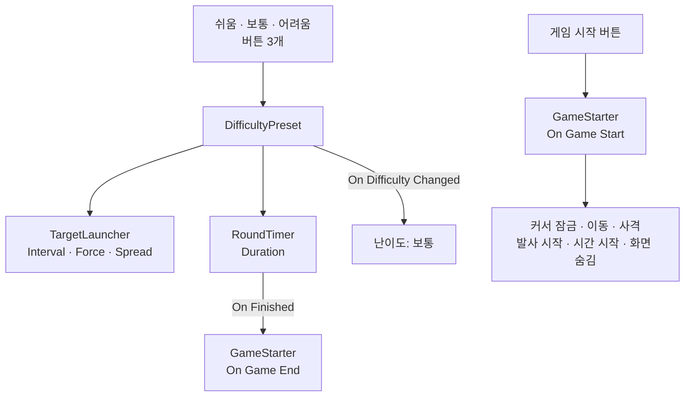

# **26차시. 난이도와 제한 시간**
---

> ℹ️ **이 자료는 이렇게 보세요**
>
> - **강의 영상과 함께 보는 자료**입니다. 영상을 따라가시면서 옆에 두고 보시면 됩니다.
> - 이번 차시에도 **코드를 한 줄도 쓰지 않습니다.**
> - 오늘 하실 일은 **값 바꿔보기, 버튼에 담기, 이벤트 연결하기**입니다.
> - 25차시에 만든 **게임을 그대로 씁니다.**

---

## **오늘의 목표**

이번 차시가 끝나면 여러분은 **코드 없이** 이런 것을 만드시게 됩니다.

- **제한 시간**이 있고 끝나면 멈추는 게임
- **버튼 세 개로 난이도**를 고르기
- **시작 버튼**을 눌러 시작하기



> 💬 **25차시와 오늘의 차이**
>
> 25차시에 **게임이 됐습니다.** 그런데 **끝이 없었죠.** 계속 쏘기만 했습니다.
> 오늘은 **시작과 끝, 그리고 난이도**를 만듭니다.

---

## **1. 난이도는 값의 조합입니다**

"어렵게 만들어라" 라고 하면 막막하죠. 그런데 게임에서 난이도는 **값 몇 개의 조합**입니다.

23차시 실습 ④에서 이미 맛보셨습니다.

| 값 | 어떻게 어려워지나요 |
| :--- | :--- |
| **Interval** (발사 간격) | **작을수록** 표적이 자주 나옵니다 |
| **Launch Force** (발사 힘) | **클수록** 빠르고 멀리 갑니다 |
| **Spread Angle** (퍼짐 각도) | **클수록** 어디로 갈지 예측이 안 됩니다 |
| **Duration** (제한 시간) | **짧을수록** 여유가 없습니다 |

> ✅ **핵심 한 줄**
>
> **노코드에서 난이도 조정은 값 조정입니다.**
>
> 새로 뭘 만드는 게 아니라, **이미 있는 값을 다르게 조합**하는 거예요.

### **세 단계로 정리하면**

| 난이도 | Interval | Launch Force | Spread Angle | Duration |
| :--- | :---: | :---: | :---: | :---: |
| **쉬움** | `2.5` | `8` | `10` | `90` |
| **보통** | `1.5` | `12` | `25` | `60` |
| **어려움** | `0.8` | `16` | `40` | `45` |

> 📝 **이 숫자가 정답은 아닙니다**
>
> **직접 플레이해보고 조율하셔야** 합니다.
> 사람마다 손이 다르고, 여러분이 만든 사격장 크기도 다르니까요.
>
> 오늘 실습 ①에서 **먼저 손으로 바꿔보는** 이유가 그겁니다.

---

## **2. 왜 손으로 먼저 바꿔보나요**

오늘 버튼 세 개를 만들 건데, **버튼부터 만들면 그냥 마법이 됩니다.**

| 순서 | 무엇을 얻나요 |
| :--- | :--- |
| **먼저 손으로 바꿔본다** | 어떤 값이 어떻게 어려움을 만드는지 **몸으로** 압니다 |
| **그다음 버튼에 담는다** | 버튼이 **무슨 일을 하는지** 압니다 |

> ✅ **버튼이 하는 일은 단순합니다**
>
> **미리 적어둔 값을 옮겨 담는 것**뿐입니다.
>
> 여러분이 Inspector 에서 손으로 하던 걸, **버튼이 대신 해주는** 거예요.
> 새로운 마법이 아닙니다.

---

## **3. 제한 시간**

게임에 **끝**이 있어야 합니다. 안 그러면 언제 그만둘지 알 수 없어요.



| 이벤트 칸 | 무슨 뜻인가요 |
| :--- | :--- |
| **On Tick** | **1초 줄어들 때마다.** 남은 시간을 **숫자로 넘겨줍니다** |
| **On Finished** | **시간이 다 됐을 때** |

> 💡 **`On Tick` 도 숫자를 넘겨줍니다**
>
> 18차시의 슬라이더, 25차시의 점수와 **똑같습니다.**
>
> **`Dynamic float`** 으로 `ValueDisplay.SetValue` 에 연결하시면 됩니다.
> 이제 세 번째라 익숙하시죠?

---

## **4. 끝날 때 할 일이 많습니다**

시간이 다 되면 뭘 해야 할까요? 생각보다 많습니다.

| 끝나면 | 왜 |
| :--- | :--- |
| 표적 발사 **정지** | 안 그러면 계속 날아옵니다 |
| **못 쏘게** | 끝났는데 쏘면 이상하죠 |
| **못 움직이게** | 결과를 보는 시간이니까 |
| 커서 **풀기** | 다시 버튼을 눌러야 하니까 |
| 결과 화면 **보이기** | 점수를 확인해야죠 |

**다섯 가지**입니다. 이걸 다 어디에 연결할까요?

> ✅ **한자리에 모읍니다**
>
> `GameStarter` 에 **`On Game End`** 라는 칸이 있습니다.
>
> **`RoundTimer` 의 `On Finished` → `GameStarter.EndGame`** 으로 한 번만 이어두면,
> 끝날 때 할 일은 **전부 `On Game End` 한자리에** 모입니다.



> 💡 **18차시의 그 원리입니다**
>
> **"칸을 여러 개 만들면 한꺼번에 실행된다."**
>
> 슬라이더 하나로 숫자와 체력바를 같이 움직였던 것 기억나시죠?
> **오늘은 다섯 개를 한꺼번에** 실행합니다.

---

## **5. 시작 방식이 바뀝니다**

23차시부터 **발판을 밟으면** 시작했습니다. 그런데 오늘부터 문제가 생깁니다.

> ⚠️ **난이도를 언제 고르죠?**
>
> 난이도 버튼을 누르려면 **마우스 커서가 있어야** 합니다.
>
> 그런데 22차시부터 **▶ 를 누르면 커서가 잠깁니다.** 발판까지 걸어가야 하니까요.
>
> **커서가 없으면 버튼을 못 누릅니다.**

### **그래서 오늘은 이렇게 바꿉니다**

| | 25차시까지 | **오늘부터** |
| :--- | :--- | :--- |
| **시작 전** | 걸어 다닐 수 있음, 커서 잠김 | **못 움직임, 커서 보임** |
| **시작 방법** | 발판을 밟는다 | **"게임 시작" 버튼을 누른다** |
| **시작 후** | — | **커서 잠김, 걷고 쏠 수 있음** |



> ✅ **발판은 지우셔도 되고 두셔도 됩니다**
>
> `GameStarter` 는 **발판으로도, 버튼으로도** 시작할 수 있게 되어 있습니다.
>
> 발판을 남겨두면 **두 가지 방법 다** 쓸 수 있어요.

---

## **6. 오늘 사용할 부품 두 개**

### **6.1 RoundTimer — 제한 시간**

| Inspector 항목 | 무슨 뜻인가요 |
| :--- | :--- |
| **Duration** | 한 판이 몇 초인지 |
| **Auto Start** | ▶ 누르자마자 시작할지 (**보통은 끕니다**) |

| 동작 이름 | 무슨 일을 하나요 |
| :--- | :--- |
| **StartTimer** | 시간 재기 시작 |
| **StopTimer** | 멈추기 |
| **ResetTimer** | 처음으로 되돌리기 |

| 이벤트 칸 | 무슨 뜻인가요 |
| :--- | :--- |
| **On Tick** | 1초 줄어들 때마다. **남은 시간을 넘겨줍니다** |
| **On Finished** | 시간이 다 됐을 때 |

### **6.2 DifficultyPreset — 난이도 담기**

| Inspector 항목 | 무슨 뜻인가요 |
| :--- | :--- |
| **Launcher** | 값을 옮겨 담을 **발사기** |
| **Timer** | 제한 시간을 옮겨 담을 **타이머** |
| **Easy / Normal / Hard** | 세 단계의 값 묶음 |
| **Apply Normal On Start** | ▶ 누를 때 '보통'을 미리 적용할지 |

| 동작 이름 | 무슨 일을 하나요 |
| :--- | :--- |
| **ApplyEasy** | 쉬움으로 |
| **ApplyNormal** | 보통으로 |
| **ApplyHard** | 어려움으로 |

| 이벤트 칸 | 무슨 뜻인가요 |
| :--- | :--- |
| **On Difficulty Changed** | 난이도가 바뀔 때마다. **난이도 이름을 글자로 넘겨줍니다** |

> 📝 **이번엔 숫자가 아니라 '글자'를 넘겨줍니다**
>
> 18차시부터 **`Dynamic float`**(숫자)만 보셨죠.
>
> 이건 **`Dynamic string`**(글자)입니다. TextMeshPro 의 **`text`** 에 연결하면
> 화면에 **"보통"** 이라고 표시됩니다.
>
> **넘겨주는 게 숫자면 float, 글자면 string.** 그것만 다릅니다.

---

## **7. 실습 — 직접 해보세요**

### **실습 ① — 값을 손으로 바꿔보기**

> 🎯 **목표**
>
> **어떤 값이 어떻게 어려움을 만드는지** 몸으로 익힙니다.

**▶ 를 끈 상태에서** 값을 바꾸고, ▶ 를 눌러 **직접 플레이해보세요.**

1. `Launcher` 의 **`TargetLauncher`** 를 아래처럼 맞춰봅니다.

| 순서 | Interval | Launch Force | Spread Angle | 느껴보실 것 |
| :---: | :---: | :---: | :---: | :--- |
| 1 | `2.5` | `8` | `10` | 여유롭습니다 |
| 2 | `1.5` | `12` | `25` | 적당합니다 |
| 3 | `0.8` | `16` | `40` | 정신없습니다 |

2. 한 가지씩만 바꿔보기도 해보세요.
   → `Interval` 만 `0.8` 로 / `Spread Angle` 만 `40` 으로

<details>
<summary>✅ 확인해보세요</summary>

- **어느 값이 가장 어렵게** 만들던가요? 사람마다 다릅니다.
- `Spread Angle` 만 키웠을 때와 `Interval` 만 줄였을 때, **느낌이 다르죠?**
  → 하나는 **예측이 어렵고**, 하나는 **바쁩니다.**
- 이 감각이 있어야 다음 실습에서 버튼이 **무슨 일을 하는지** 압니다.

</details>

> 💡 **본인 손에 맞게 조율하세요**
>
> 표에 적힌 숫자는 **출발점**입니다. 여러분이 만든 사격장 크기에 따라 달라져요.
> **직접 해보고 마음에 드는 값을 찾으시는 게** 오늘의 진짜 실습입니다.

---

### **실습 ② — 제한 시간 붙이기**

> 🎯 **목표**
>
> **시간이 흐르고, 끝나면 게임이 멈추게** 합니다.

#### **1단계 — 타이머를 놓습니다**

1. **`GameManager` 를 선택**하고 강의자료의 **`RoundTimer`** 를 끌어다 놓습니다.

| 항목 | 값 |
| :--- | :--- |
| **Duration** | `60` |
| **Auto Start** | **체크 해제** |

2. `Canvas` 에 글자를 하나 만듭니다. 이름은 **`TimeText`**
   → 앵커 **`top-center`**, 한글 글꼴 지정
3. **`ValueDisplay`** 를 붙이고 `Prefix` 를 **`남은 시간: `**, `Suffix` 를 **`초`** 로

#### **2단계 — 화면에 띄웁니다**

4. `RoundTimer` 의 **`On Tick`** 에서 **`+`** → **`TimeText`** 끌어다 놓기
5. 목록 → **위쪽 `Dynamic float`** 의 **`ValueDisplay`** → **`SetValue`**

#### **3단계 — 시작·종료를 잇습니다**

6. `GameStarter` 의 **`On Game Start`** 에 **`+`** 를 하나 더 만듭니다.
7. **`GameManager`** 를 넣고 → **`RoundTimer`** → **`StartTimer`**
8. `RoundTimer` 의 **`On Finished`** 에서 **`+`**
9. **`StartZone`**(`GameStarter` 가 붙은 곳)을 넣고 → **`GameStarter`** → **`EndGame`**
10. `GameStarter` 의 **`On Game End`** 에 아래를 **차례로 연결**합니다.

| 연결할 것 | 목록에서 |
| :--- | :--- |
| `Launcher` | `TargetLauncher` → **`StopLaunching`** |
| `Gun` | `SimpleGun` → **`DisableFire`** |
| `Player` | `PlayerMover` → **`DisableMove`** |
| `Main Camera` | `MouseLook` → **`UnlockCursor`** |

11. **▶** → 발판을 밟고 60초를 기다려봅니다.

<details>
<summary>✅ 무슨 일이 일어났나요</summary>

**시간이 다 되면 게임이 멈춥니다.** 표적도 안 나오고, 쏠 수도 없고, 커서가 돌아옵니다.

그리고 `On Game End` **한자리에 네 개**를 연결했죠?

> 💡 **18차시의 그 원리입니다**
>
> **"칸을 여러 개 만들면 한꺼번에 실행된다."**
>
> 슬라이더 하나로 숫자와 체력바를 같이 움직였던 것과 **똑같은 구조**예요.
> 개수만 늘었을 뿐입니다.

</details>

> ⚠️ **잘 안 되신다면**
>
> - 시간이 **안 줄어든다** → `On Game Start` 에 **`StartTimer`** 를 연결하셨는지 확인해주세요.
> - 화면에 **숫자가 안 뜬다** → **위쪽 `Dynamic float`** 을 고르셨는지 확인해주세요. (18·25차시의 그 함정)
> - 끝나도 **표적이 계속 나온다** → `On Game End` 연결을 확인해주세요.

---

### **실습 ③ — 난이도를 버튼에 담기 (오늘의 핵심)**

> 🎯 **목표**
>
> 실습 ①에서 손으로 바꾸던 값을 **버튼 세 개에 담습니다.**

#### **1단계 — 부품을 붙입니다**

1. **`GameManager` 를 선택**하고 **`DifficultyPreset`** 을 끌어다 놓습니다.
2. 칸을 채웁니다.

| 칸 | 여기에 |
| :--- | :--- |
| **Launcher** | Hierarchy 의 **`Launcher`** |
| **Timer** | **`GameManager`** (자기 자신) |

3. `Easy` · `Normal` · `Hard` 를 펼쳐 값을 확인합니다.
   → 기본값이 들어 있습니다. **실습 ①에서 찾으신 값으로 바꾸셔도 됩니다.**

#### **2단계 — 버튼 세 개를 만듭니다**

4. `Canvas` 위에서 우클릭 → `UI` → `Panel` → 이름을 **`StartPanel`** 로
5. `StartPanel` 안에 **버튼 세 개**를 만듭니다. 글자는 **쉬움 · 보통 · 어려움**
6. 각 버튼의 `On Click` 에서 **`+`** → **`GameManager`** 끌어다 놓기
7. 목록 → **`DifficultyPreset`** → 아래대로

| 버튼 | 동작 |
| :--- | :--- |
| 쉬움 | **`ApplyEasy`** |
| 보통 | **`ApplyNormal`** |
| 어려움 | **`ApplyHard`** |

#### **3단계 — 지금 난이도를 보여줍니다**

8. `StartPanel` 안에 글자를 하나 만듭니다. 이름 **`DifficultyText`**
9. `DifficultyPreset` 의 **`On Difficulty Changed`** 에서 **`+`**
10. **`DifficultyText`** 를 넣고, 목록 → **위쪽 `Dynamic string`** 의 **`TextMeshProUGUI`** → **`text`**

    > ⚠️ **`Dynamic string` 은 목록 위쪽에 있습니다**
    >
    > 아래쪽 `Static Parameters` 의 `text` 를 고르면 **미리 적어둔 글자**가 그대로 들어갑니다.
    > 난이도를 바꿔도 글자가 안 바뀌어요. 18차시 · 25차시와 같은 함정입니다.

11. **▶** 를 누르고 버튼을 눌러봅니다.
12. **▶ 를 끄지 말고** `Launcher` 를 선택해 **`Interval` 값이 실제로 바뀌었는지** 확인해보세요.

<details>
<summary>✅ 무슨 일이 일어났나요</summary>

**버튼을 누르면 값이 바뀝니다.** 실습 ①에서 손으로 하던 그 일이에요.

Inspector 를 열어놓고 눌러보시면, **숫자가 실제로 바뀌는 게 보입니다.**

> ✅ **버튼은 마법이 아닙니다**
>
> **미리 적어둔 값을 옮겨 담는 것**뿐입니다.
>
> 실습 ①을 먼저 한 이유가 이겁니다. **손으로 해본 일이라야 버튼이 뭘 하는지 알죠.**

</details>

> 🚨 **꼭 알아두세요 — 값이 사라지는 이유**
>
> **▶ 중에 버튼으로 바뀐 값도, ▶ 를 끄면 원래대로 돌아갑니다.**
>
> 그래서 `DifficultyPreset` 의 `Easy`·`Normal`·`Hard` 값 자체는
> **▶ 를 끈 상태에서** 맞춰두셔야 합니다.

> ⚠️ **잘 안 되신다면**
>
> - 버튼을 눌러도 **값이 안 바뀐다** → `Launcher` · `Timer` 칸이 **비어 있는지** 확인해주세요.
> - 목록에 `ApplyEasy` 가 **안 보인다** → 왼쪽 칸에 `GameManager` 를 안 넣으신 겁니다.
> - 난이도 글자가 **안 바뀐다** → **`Dynamic string`** 쪽을 고르셨는지 확인해주세요.

---

### **실습 ④ — 시작 버튼과 커서 정리 (선택)**

> 🎯 **목표**
>
> **난이도를 고르고 → 시작 버튼을 눌러** 시작하는 흐름을 만듭니다.

#### **1단계 — 시작 전에는 못 움직이게**

1. **`Player` 의 `PlayerMover`** 에서 **`Can Move`** 체크를 **해제**합니다.
2. **`Gun` 의 `SimpleGun`** 에서 **`Can Fire`** 체크를 **해제**합니다.
3. **`Main Camera` 의 `MouseLook`** 에서 **`Lock Cursor`** 체크를 **해제**합니다.
   → 이제 ▶ 를 눌러도 **커서가 보이고 못 움직입니다.**

#### **2단계 — 시작 버튼**

4. `StartPanel` 안에 버튼을 하나 더 만듭니다. 글자는 **"게임 시작"**
5. `On Click` 에서 **`+`** → **`StartZone`**(`GameStarter` 가 붙은 곳) 끌어다 놓기
6. 목록 → **`GameStarter`** → **`StartGame`**

#### **3단계 — 시작하면 풀어주기**

7. `GameStarter` 의 **`On Game Start`** 에 아래를 **추가로 연결**합니다.

| 연결할 것 | 목록에서 |
| :--- | :--- |
| `Main Camera` | `MouseLook` → **`LockCursor`** |
| `Player` | `PlayerMover` → **`EnableMove`** |
| `Gun` | `SimpleGun` → **`EnableFire`** |
| `StartPanel` | `GameObject` → **`SetActive`** (체크 **해제**) |

> ✅ **여기까지 하면 여섯 개입니다**
>
> 시작 하나에 **커서 잠금 · 이동 허용 · 사격 허용 · 발사 시작 · 시간 시작 · 시작 화면 숨김.**
> 18차시의 *"칸을 여러 개 만들면 한꺼번에 실행된다"* 가 여기서 가장 커집니다.

#### **4단계 — 임시로 만든 도구 치우기**

8. 23차시에 만든 **"한 발 쏘기"** 버튼을 **지웁니다.**
   → Hierarchy 에서 골라 `Delete`

> 💡 **만들 때 쓰는 도구와 완성본은 다릅니다**
>
> "한 발 쏘기" 는 23차시에 **`Launch Force` 를 맞추려고** 만든 도구였습니다.
> 이제 난이도 버튼이 값을 바꿔주니 **역할이 끝났습니다.**
>
> 안 치우면 **완성한 게임 화면에 개발용 버튼이 남습니다.**
> 게임 회사에서도 내보내기 전에 이런 것들을 정리합니다.

9. **▶** 를 누르고 **난이도 고르기 → 시작 버튼 → 플레이** 순서로 해봅니다.

<details>
<summary>✅ 확인해보세요</summary>

- 시작 전에는 **커서가 보이고 못 움직이나요?**
- 시작 버튼을 누르면 **커서가 잠기고 시작 화면이 사라지나요?**
- `On Game Start` 에 **몇 개가 연결**되었는지 세어보세요. **여섯 개**쯤 될 겁니다.

> ✅ **이게 오늘의 진짜 결론입니다**
>
> **"무슨 일이 일어났을 때, 무엇을 할지"** 를 연결하는 것.
>
> 21차시에 정리했던 그 문장이, 오늘 **한 이벤트에 여섯 개**로 커졌습니다.
> 개수만 늘었지 방식은 똑같아요.

</details>

> ⚠️ **잘 안 되신다면**
>
> - 시작 버튼을 눌러도 **아무 일도 없다** → `GameStarter` 가 붙은 물건을 왼쪽 칸에 넣으셨는지 확인해주세요.
> - 시작해도 **커서가 안 잠긴다** → `On Game Start` 에 `LockCursor` 를 연결하셨는지 확인해주세요.
> - 시작 화면이 **안 사라진다** → `SetActive` 의 **체크를 해제**하셔야 숨겨집니다.

---

## **8. 코드는 딱 한 번만 보고 갑니다**

```
Duration 칸       ──→  [ Duration : 60 ]
Easy / Normal / Hard  ──→  [ 값 묶음 세 개 ]
ApplyEasy 동작    ──→  [ 값을 옮겨 담는 이름 ]
On Tick 칸        ──→  [ 남은 시간을 넘겨주는 자리 ]
```

> ✅ **오늘 부품이 한 일**
>
> **미리 적어둔 값을, 다른 부품의 칸에 옮겨 담는 것.**
>
> 여러분이 Inspector 에서 손으로 하던 것과 **완전히 같은 일**입니다.
> 다른 건 **누가 하느냐**뿐이에요. 사람 대신 버튼이 합니다.

> 💬 **20차시에도 같은 결론이었습니다**
>
> **"버튼으로 하는 일도, 결국 인스펙터의 숫자를 바꾸는 것이다."**

---

## **9. 오늘 배운 것을 그림으로**



> ✅ **이 그림 하나만 기억하셔도 오늘은 성공입니다**
>
> - **난이도는 값의 조합**입니다.
> - **버튼은 값을 옮겨 담을 뿐**입니다.
> - **한 이벤트에 여러 개를 연결**하면 한꺼번에 실행됩니다.

---

## **10. 정리 문제**

### **문제 1**
게임에서 **난이도**란 결국 무엇인가요?

<details>
<summary>✅ 정답 보기</summary>

**값의 조합**입니다.

| 값 | 어떻게 어려워지나요 |
| :--- | :--- |
| Interval | 작을수록 자주 나옴 |
| Launch Force | 클수록 빠르고 멀리 |
| Spread Angle | 클수록 예측 불가 |
| Duration | 짧을수록 여유 없음 |

새로 뭘 만드는 게 아니라 **이미 있는 값을 다르게 조합**하는 거예요.

</details>

### **문제 2**
왜 **손으로 먼저 바꿔본 뒤에** 버튼을 만들었나요?

<details>
<summary>✅ 정답 보기</summary>

**버튼이 무슨 일을 하는지 알기 위해서**입니다.

버튼은 **미리 적어둔 값을 옮겨 담는 것**뿐입니다.
손으로 해본 적이 없으면 그냥 **마법처럼** 보이죠.

</details>

### **문제 3**
시간이 다 됐을 때 할 일이 **다섯 가지**입니다. 어디에 연결하나요?

<details>
<summary>✅ 정답 보기</summary>

**`GameStarter` 의 `On Game End` 한자리에** 모읍니다.

`RoundTimer` 의 `On Finished` → `GameStarter.EndGame` 으로 한 번만 이어두면,
끝날 때 할 일은 전부 거기 모입니다.

**18차시의 "칸을 여러 개 만들면 한꺼번에 실행된다"** 그대로입니다.

</details>

### **문제 4**
26차시부터 **시작 방식이 바뀌는** 이유는?

<details>
<summary>✅ 정답 보기</summary>

**난이도 버튼을 누르려면 커서가 있어야** 하기 때문입니다.

22차시부터 ▶ 를 누르면 커서가 잠겼죠. 걸어 다녀야 하니까요.
그런데 커서가 없으면 **버튼을 못 누릅니다.**

그래서 **시작 전에는 커서를 풀어두고, 시작 버튼으로** 시작합니다.

</details>

### **문제 5**
`On Difficulty Changed` 는 **숫자가 아니라 글자**를 넘겨줍니다. 어떻게 연결하나요?

<details>
<summary>✅ 정답 보기</summary>

목록에서 **`Dynamic string`** 쪽의 **`text`** 를 고릅니다.

- 넘겨주는 게 **숫자**면 → `Dynamic float`
- 넘겨주는 게 **글자**면 → `Dynamic string`

18차시부터 `float` 만 보셨는데, **원리는 똑같습니다.**

</details>

---

## **11. 앞으로 조심할 것**

> ⚠️ **흔한 실수**
>
> - **버튼부터 만들고 값을 안 느껴보기** → 뭐가 어떻게 어려워지는지 모르게 됩니다.
> - **▶ 중에 난이도 값 자체를 바꾸기** → ▶ 를 끄면 사라집니다.
> - **`Auto Start` 를 켜두기** → 준비하기도 전에 시간이 흐릅니다.
> - **`On Game End` 연결을 빠뜨리기** → 끝나도 표적이 계속 나옵니다.

> 💡 **좋은 습관 하나**
>
> **직접 플레이해보고 값을 조율하세요.**
> 표에 적힌 숫자는 출발점일 뿐입니다. **본인이 만든 사격장에 맞는 값**은 직접 해봐야 나옵니다.

---

## **12. 오늘의 정리**

> ✅ **세 줄 요약**
>
> 1. **난이도는 값의 조합**이다.
> 2. **버튼은 값을 옮겨 담을 뿐**이다. 마법이 아니다.
> 3. **한 이벤트에 여러 개를 연결**하면 한꺼번에 실행된다.

오늘 여러분의 게임에 **시작과 끝, 그리고 난이도**가 생겼습니다.
이제 **게임처럼** 보이시죠? 충분히 잘하셨습니다.

---

## **13. 다음 차시 준비**

> 🧩 **27차시 — 배경과 소리, 그리고 완성**
>
> **여섯 차시의 마지막**입니다.
>
> 하늘을 바꾸고, 조명으로 분위기를 잡고, **총소리와 배경음악**을 넣습니다.
> 그러면 **완성**이에요.

> 📝 **미리 해두시면 좋은 것**
>
> - [ ] 오늘 만든 것을 **`Ctrl + S` 로 저장**해두기
> - [ ] 씬을 **`26_완성` 로 복사**해두기
> - [ ] 강의자료의 **효과음·배경음악 파일**이 들어 있는지 확인
> - [ ] 난이도 세 단계를 **직접 다 플레이해보기** (본인 손에 맞는 값을 찾아두세요)

---

## **부록 — 오늘 나온 용어 정리**

| 화면에 보이는 이름 | 우리말로 하면 |
| :--- | :--- |
| **RoundTimer** | 제한 시간 재는 부품 |
| **Duration** | 한 판이 몇 초인지 |
| **Auto Start** | 시작하자마자 시간을 잴지 |
| **StartTimer / StopTimer / ResetTimer** | 시작 / 멈춤 / 되돌리기 |
| **On Tick** | 1초 줄어들 때마다 |
| **On Finished** | 시간이 다 됐을 때 |
| **DifficultyPreset** | 난이도를 담아두는 부품 |
| **ApplyEasy / ApplyNormal / ApplyHard** | 쉬움 / 보통 / 어려움으로 |
| **On Difficulty Changed** | 난이도가 바뀔 때마다 |
| **Dynamic string** | 넘겨받은 글자를 그대로 쓰기 |
| **SetActive** | 물건을 켜고 끄기 |
| **Can Move / Can Fire** | 움직일 수 있는지 / 쏠 수 있는지 |
