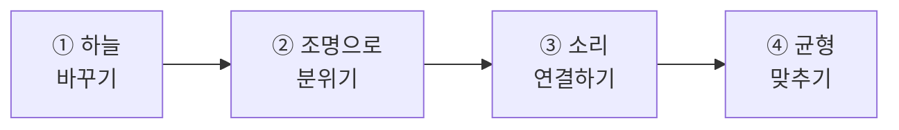
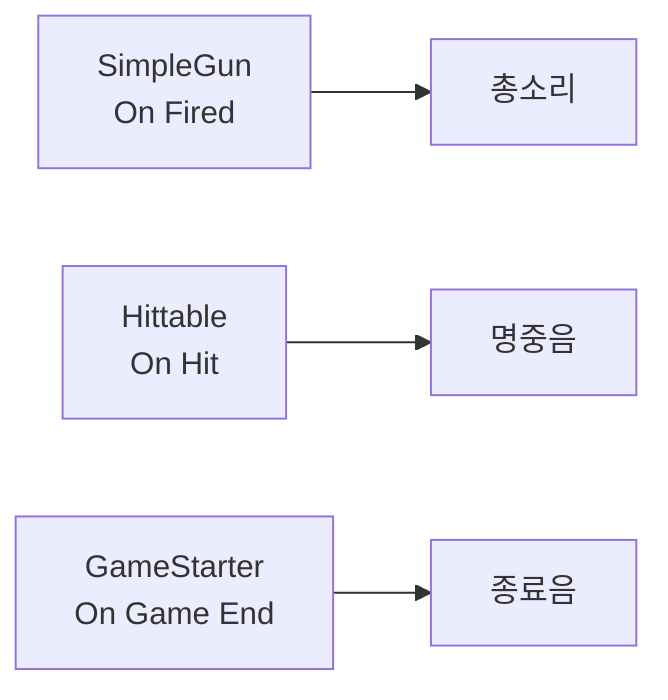
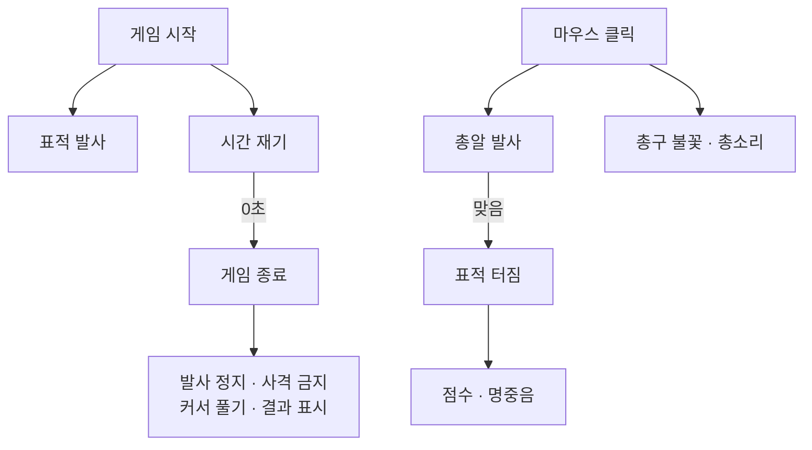

# **27차시. 배경과 소리, 그리고 완성**
---

!!! info "이 자료는 이렇게 보세요"
    - **강의 영상과 함께 보는 자료**입니다. 영상을 따라가시면서 옆에 두고 보시면 됩니다.
    - 이번 차시에도 **코드를 한 줄도 쓰지 않습니다.**
    - 오늘 하실 일은 **하늘 고르기, 조명 맞추기, 소리 연결하기**입니다.
    - **여섯 차시의 마지막**입니다. 오늘 끝나면 게임이 완성됩니다.

---

## **오늘의 목표**

이번 차시가 끝나면 여러분은 **코드 없이** 이런 것을 만드시게 됩니다.

- **하늘이 있는** 사격장
- 분위기가 잡힌 **조명**
- **총소리 · 명중음 · 배경음악**이 나는 게임



!!! quote "26차시와 오늘의 차이"
    26차시까지 **기능**은 다 됐습니다.
    오늘은 **느낌**을 만듭니다. 같은 게임인데 훨씬 그럴듯해져요.

---

## **1. 왜 이걸 마지막에 하나요**

배경과 소리는 **없어도 게임이 돌아갑니다.** 그래서 마지막에 합니다.

| 순서 | 왜 |
| :--- | :--- |
| 먼저 **되게** 만든다 (22~26) | 안 되는 걸 예쁘게 만들어봐야 소용없습니다 |
| 그다음 **좋게** 만든다 (오늘) | 되는 걸 다듬으면 확 좋아집니다 |

!!! success "실제 게임 개발도 이 순서입니다"
    처음부터 예쁘게 만들려고 하면 **끝을 못 봅니다.**

    **일단 돌아가게 만들고, 그다음 다듬는다.** 여러분은 그 순서를 그대로 밟으셨어요.

---

## **2. 하늘 (Skybox)**

지금 사격장 위를 보면 **밋밋한 파란색**입니다. 이건 Unity 기본 하늘이에요.

**Skybox** 는 세상을 감싸는 **거대한 상자**라고 생각하시면 됩니다.
안쪽에 하늘 그림이 그려져 있고, 우리는 그 안에 서 있는 거예요.

| 바꾸는 곳 | |
| :--- | :--- |
| 위쪽 메뉴 **`Window`** → **`Rendering`** → **`Lighting`** | `Environment` 탭의 **`Skybox Material`** |

!!! tip "16차시의 재료(Material)입니다"
    Skybox 도 **재료**예요. 큐브에 색깔 재료를 입혔던 것처럼, **하늘에 하늘 재료를 입히는** 겁니다.

    16차시에 `Metallic`·`Smoothness` 를 만졌던 그 재료와 **같은 종류**입니다.

---

## **3. 조명으로 분위기 만들기**

같은 사격장인데 **조명만 바꿔도** 느낌이 완전히 달라집니다.

| Directional Light 항목 | 무슨 뜻인가요 | 바꾸면 |
| :--- | :--- | :--- |
| **Rotation** | 해가 뜬 방향 | **그림자 방향**이 바뀝니다 |
| **Color** | 빛의 색 | 주황이면 노을, 파랑이면 새벽 |
| **Intensity** | 밝기 | 낮추면 어둑해집니다 |

!!! note "16차시에 그림자를 배우셨죠"
    그때 **`Cast Shadows`** 로 그림자를 껐다 켜보셨습니다.

    오늘은 **빛 쪽**을 만집니다. **빛의 각도가 곧 그림자의 방향**이에요.

!!! tip "해를 낮게 눕히면"
    `Rotation X` 를 **`15`** 정도로 낮추면 **긴 그림자**가 생겨서 노을처럼 보입니다.
    **`Color` 를 주황색으로** 같이 바꾸면 더 그럴듯해져요.

---

## **4. 소리는 세 종류입니다**

| 종류 | 언제 나나요 | 예 |
| :--- | :--- | :--- |
| **효과음** | 무슨 일이 일어날 때 **한 번** | 총소리, 명중음 |
| **배경음악** | **계속** 반복 | BGM |
| **환경음** | 계속 반복 (분위기) | 바람, 새소리 |

### **소리를 내는 방법**

Unity 에서 소리를 내려면 **`Audio Source`** 라는 부품이 필요합니다.

| Audio Source 항목 | 무슨 뜻인가요 |
| :--- | :--- |
| **Audio Clip** | 어떤 소리 파일을 쓸지 |
| **Play On Awake** | 시작하자마자 재생할지 |
| **Loop** | 계속 반복할지 |
| **Volume** | 소리 크기 |

| 소리 종류 | Play On Awake | Loop |
| :--- | :---: | :---: |
| **효과음** (총소리) | 체크 해제 | 체크 해제 |
| **배경음악** | ☑ 체크 | ☑ 체크 |

---

## **5. 언제 소리를 낼까 — 이벤트에 연결**

여기가 오늘의 핵심입니다. 그런데 **완전히 새로운 게 아닙니다.**

지금까지 배운 **"~할 때"** 칸에 소리를 연결하면 끝이에요.

| 이벤트 칸 | 어느 차시 | 여기에 연결할 소리 |
| :--- | :---: | :--- |
| **On Fired** | 24 | **총소리** |
| **On Hit** | 25 | **명중음** |
| **On Expired** | 23 | 놓쳤을 때 소리 |
| **On Game End** | 26 | 종료음 |



!!! success "새로 배울 게 없습니다"
    **`+` 누르고, 소리 나는 물건 끌어다 놓고, 목록에서 `Play` 고르기.**

    14차시부터 스무 번쯤 하신 그 동작입니다.

!!! note "표적 소리는 조금 다릅니다"
    표적은 **틀(Prefab)** 이라, 씬에 있는 소리를 끌어다 놓을 수 없습니다. (25차시의 그 제약)

    그래서 **표적 틀 안에 `Audio Source` 를 같이 넣어둡니다.**
    그러면 틀 안에서 끌어다 놓을 수 있어요.

---

## **6. 오늘 사용할 부품**

!!! warning "🟨 아직 확정 전입니다"
    **`Audio Source` 만으로 될 수도** 있습니다.

    Unity 내장 부품인 `Audio Source` 의 **`Play`** 가 목록에 그대로 나오면,
    강의자료의 **`AudioPlayer` 는 안 써도** 됩니다.

    > 🟨 **U-7 `6-2` 결과로 확정**

### **AudioPlayer (필요할 경우)**

| Inspector 항목 | 무슨 뜻인가요 |
| :--- | :--- |
| **Clip** | 재생할 소리 파일 |
| **Volume** | 소리 크기 |
| **Random Pitch** | 소리 높낮이를 얼마나 흔들지 |

| 동작 이름 | 무슨 일을 하나요 |
| :--- | :--- |
| **Play** | 한 번 재생 |
| **Stop** | 멈추기 |

!!! tip "`Random Pitch` 가 있으면 좋은 이유"
    총소리가 **매번 똑같으면 금방 어색해집니다.**

    높낮이를 조금씩 흔들면 **실제 총처럼** 들려요. 값 하나로 체감이 꽤 달라집니다.

---

## **7. 실습 — 직접 해보세요**

!!! warning "🟨 이 절은 아직 확정 전입니다"
    아래 순서는 **잠정 초안**입니다.
    특히 **실습 ③의 소리 연결 방식**은 에디터 검증(U-7 `6-2` ~ `6-4`) 결과로 확정됩니다.

---

### **실습 ① — 하늘 바꾸기**

!!! abstract "목표"
    밋밋한 기본 하늘을 **다른 하늘로** 바꿉니다.

1. 위쪽 메뉴 **`Window`** → **`Rendering`** → **`Lighting`**
2. **`Environment`** 탭을 클릭합니다.
3. **`Skybox Material`** 칸을 찾습니다.
4. 강의자료의 **하늘 재료**를 끌어다 놓습니다.
   → 또는 오른쪽 동그란 아이콘을 눌러 목록에서 고르셔도 됩니다.
5. **Game 창**에서 하늘이 바뀐 걸 확인합니다.
6. 다른 하늘도 몇 개 바꿔보세요.

??? success "확인해보세요"
    - 하늘이 바뀌니 **느낌이 확 다르죠?**
    - Skybox 도 **재료(Material)** 입니다. 16차시에 큐브에 색을 입혔던 그 종류예요.
    - 하늘을 바꾸면 **바닥 색까지 조금 달라집니다.**
      → 하늘빛이 사방에서 비추기 때문입니다. 신기하시면 껐다 켜보세요.

!!! warning "잘 안 되신다면"
    - `Lighting` 창을 못 찾겠다 → `Window` → `Rendering` 아래에 있습니다.
    - 하늘이 안 바뀐다 → **Game 창**을 보고 계신지 확인해주세요. Scene 창은 따로 설정이 있습니다.

---

### **실습 ② — 조명으로 분위기 만들기**

!!! abstract "목표"
    빛의 **각도 · 색 · 밝기**를 바꿔 완전히 다른 분위기를 만들어봅니다.

1. Hierarchy 에서 **`Directional Light`** 를 선택합니다.
2. 아래 세 가지를 차례로 바꿔보세요.

| 순서 | Rotation X | Color | Intensity | 어떤 느낌 |
| :---: | :---: | :--- | :---: | :--- |
| 1 | `50` | 흰색 | `1` | 한낮 (기본) |
| 2 | **`15`** | **주황색** | `1` | **노을** |
| 3 | `-20` | 짙은 파랑 | `0.3` | 밤 |

3. 각각에서 **그림자가 어떻게 달라지는지** 봐주세요.
4. 마음에 드는 걸로 정합니다.

??? success "확인해보세요"
    - **빛의 각도가 곧 그림자의 방향**이죠?
    - 해를 낮게 눕히면(`Rotation X` 를 작게) **그림자가 길어집니다.**
    - 16차시에 배운 **`Cast Shadows`** 는 "그림자를 만들지"였고, 오늘은 **빛 쪽**을 만졌습니다.
    - **정답이 없습니다.** 본인 눈에 좋으면 됩니다.

!!! warning "잘 안 되신다면"
    - 너무 어두워서 안 보인다 → `Intensity` 를 올리거나, `Lighting` 창의 **환경광**을 조절해보세요.
    - 그림자가 안 보인다 → 물건들의 **`Cast Shadows`** 가 켜져 있는지 확인해주세요. (16차시)

---

### **실습 ③ — 소리 연결하기 (오늘의 핵심)**

!!! abstract "목표"
    **총소리 · 명중음 · 배경음악**을 넣습니다.

#### **1단계 — 총소리**

1. **`Gun` 을 선택**하고 **`Add Component`** → **`Audio Source`**
2. 값을 맞춥니다.

| 항목 | 값 |
| :--- | :--- |
| **Audio Clip** | 강의자료의 **총소리** |
| **Play On Awake** | **체크 해제** |
| **Loop** | **체크 해제** |
| **Volume** | `0.6` |

3. **`SimpleGun` 의 `On Fired`** 에서 **`+`** 클릭
4. **`Gun` 을 왼쪽 칸에 끌어다 놓기**
5. 목록 → **`AudioSource`** → **`Play`**

    > 🟨 **U-7 `6-2` 결과로 확정** — 목록에 `AudioSource.Play` 가 나오는지
    > 안 나오면 강의자료의 **`AudioPlayer`** 를 대신 붙여 씁니다.

6. **▶** 를 누르고 쏴봅니다.

#### **2단계 — 명중음**

7. `Prefabs` 의 **`Target` 을 더블클릭**해 틀 고치는 방으로 들어갑니다.
8. **`Add Component`** → **`Audio Source`** (명중음, `Play On Awake` 해제)
9. **`Hittable` 의 `On Hit`** 에서 **`+`** 클릭
10. **`Target` 자기 자신**을 넣고 → **`AudioSource`** → **`Play`**

    !!! note "왜 틀 안에 넣나요"
        25차시에 배운 그 제약입니다. **틀은 씬 안의 물건을 가리킬 수 없어요.**

        그래서 **소리도 틀 안에 같이 넣어둡니다.** 그러면 틀 안끼리는 연결이 됩니다.

11. **`<`** 로 나옵니다.

#### **3단계 — 배경음악**

12. **Hierarchy** 우클릭 → `Create Empty` → 이름을 **`BGM`** 으로
13. **`Add Component`** → **`Audio Source`**

| 항목 | 값 |
| :--- | :--- |
| **Audio Clip** | 강의자료의 **배경음악** |
| **Play On Awake** | ☑ **체크** |
| **Loop** | ☑ **체크** |
| **Volume** | `0.3` |

14. **▶** 를 눌러 전체를 확인합니다.

??? success "무슨 일이 일어났나요"
    **쏘면 소리가 나고, 맞으면 소리가 나고, 배경음악이 흐릅니다.**

    그런데 오늘 새로 배운 게 있나요? **거의 없습니다.**

    - `On Fired` 는 **24차시**에 만든 칸
    - `On Hit` 은 **25차시**에 만든 칸
    - 연결하는 방식은 **14차시부터** 스무 번쯤 하신 그것

    !!! success "이게 이 과정의 결론입니다"
        **"무슨 일이 일어났을 때, 무엇을 할지" 를 연결하는 것.**

        21차시에 정리했던 그 문장 하나로, **소리까지** 붙였습니다.
        새 개념이 아니라 **같은 방식의 반복**이었어요.

!!! danger "꼭 알아두세요 — 값이 사라지는 이유"
    **▶ 를 누른 상태에서 바꾼 값은, ▶ 를 끄면 전부 사라집니다.**

    소리 크기를 맞추다 보면 ▶ 를 켜둔 채로 만지기 쉽습니다.
    **마음에 드는 값을 찾으셨으면 ▶ 를 끄고 다시 넣어주세요.**

!!! warning "잘 안 되신다면"
    - **소리가 안 난다** → Game 창 위쪽의 **`Mute Audio`** 버튼이 켜져 있는지 확인해주세요. 이게 1위 원인입니다.
    - **계속 소리가 난다** → 효과음의 **`Play On Awake`** 를 꺼주세요.
    - **표적 소리가 안 난다** → 표적이 **사라지면서 소리도 같이 사라질** 수 있습니다. `Hittable` 의 `Destroy On Hit` 을 잠깐 꺼서 확인해보세요.
    - **목록에 `Play` 가 없다** → `Audio Source` 를 붙이셨는지 확인해주세요.

---

### **실습 ④ — 균형 맞추기 (선택)**

!!! abstract "목표"
    소리와 화면의 **균형**을 맞춰 완성도를 올립니다.

1. **소리 크기**를 조절합니다.

| 소리 | 권장 Volume | 왜 |
| :--- | :---: | :--- |
| 총소리 | `0.5` ~ `0.7` | 자주 나니까 너무 크면 피곤합니다 |
| 명중음 | `0.8` ~ `1.0` | **성공한 느낌**이 나야 하니까 |
| 배경음악 | `0.2` ~ `0.3` | 깔리기만 하면 됩니다 |

2. **`AudioPlayer`** 를 쓰신다면 **`Random Pitch`** 를 `0.1` 정도로 넣어보세요.
   → 총소리가 **매번 조금씩 달라집니다.**
3. 화면도 마지막으로 손봅니다.
   - 점수판·시간 글자가 **하늘색과 겹쳐 안 보이지 않는지**
   - 십자선이 **너무 크거나 작지 않은지**
4. 난이도 세 단계를 **다 플레이해봅니다.**
5. **`Ctrl + S`** 로 저장하고, 씬을 **`27_완성` 으로 복사**해둡니다.

??? success "확인해보세요"
    - 소리 균형이 맞으니 **훨씬 편하죠?**
    - `Random Pitch` 를 넣으니 총소리가 **덜 기계적**이지 않나요?
    - 여기까지 하셨으면 **여러분의 게임이 완성됐습니다.**

!!! tip "완성의 기준은 본인입니다"
    더 다듬을 곳은 항상 있습니다. 그런데 **"이 정도면 됐다"** 를 정하는 것도 중요해요.

    **한 번 끝까지 만들어본 경험**이 다음 작품을 훨씬 쉽게 만듭니다.

---

## **8. 코드는 딱 한 번만 보고 갑니다**

**여섯 차시 동안 코드를 몇 줄 쓰셨을까요? 한 줄도 안 쓰셨습니다.**

```
On Fired 칸    ──→  [ 쏠 때 실행할 목록 ]
On Hit 칸      ──→  [ 맞을 때 실행할 목록 ]
On Game End 칸 ──→  [ 끝날 때 실행할 목록 ]
```

!!! success "22 ~ 27차시를 한 문장으로"
    **"무슨 일이 일어났을 때, 무엇을 할지" 를 연결한 것.**

    | 무슨 일 | 무엇을 |
    | :--- | :--- |
    | 발판을 밟으면 | 표적 발사 시작 |
    | 마우스를 누르면 | 총알 발사 · 총구 불꽃 · 총소리 |
    | 총알이 맞으면 | 표적 사라짐 · 터짐 · 점수 · 명중음 |
    | 시간이 다 되면 | 발사 정지 · 사격 금지 · 커서 풀기 |

    **전부 같은 방식**이었습니다. `+` 누르고, 끌어다 놓고, 목록에서 고르기.

---

## **9. 여섯 차시를 그림 하나로**



!!! success "이 그림이 여러분이 만든 게임입니다"
    22차시에 **빈 사격장**으로 시작해서, 여섯 시간 만에 여기까지 오셨습니다.

---

## **10. 정리 문제**

### **문제 1**
왜 **배경과 소리를 마지막에** 하나요?

??? success "정답 보기"
    **없어도 게임이 돌아가기 때문**입니다.

    **일단 되게 만들고, 그다음 다듬는다.**
    처음부터 예쁘게 만들려고 하면 끝을 못 봅니다.

    실제 게임 개발도 이 순서예요.

### **문제 2**
**Skybox** 는 무엇인가요?

??? success "정답 보기"
    **세상을 감싸는 거대한 상자**입니다. 안쪽에 하늘 그림이 그려져 있어요.

    그리고 Skybox 도 **재료(Material)** 입니다.
    16차시에 큐브에 색깔 재료를 입혔던 것과 **같은 종류**예요.

### **문제 3**
총소리를 **언제** 나게 만들었나요?

??? success "정답 보기"
    **`SimpleGun` 의 `On Fired`** 에 연결했습니다. **24차시에 만든 칸**이에요.

    새로 만든 게 아니라, **이미 있던 칸에 하나 더 연결**했을 뿐입니다.

### **문제 4**
표적의 명중음은 왜 **틀 안에** 넣었나요?

??? success "정답 보기"
    **틀은 씬 안의 물건을 가리킬 수 없기 때문**입니다. 25차시에 배운 그 제약이에요.

    그래서 **소리도 틀 안에 같이 넣어둡니다.**
    틀 안끼리는 연결이 됩니다.

### **문제 5**
소리가 하나도 안 납니다. **가장 먼저 확인할 것**은?

??? success "정답 보기"
    **Game 창 위쪽의 `Mute Audio` 버튼**이 켜져 있는지 확인합니다.

    이게 문의 1위입니다. 실수로 눌러두면 **아무 소리도 안 납니다.**

    그다음은 `Audio Clip` 이 비어 있지 않은지, `Volume` 이 `0` 이 아닌지요.

---

## **11. 앞으로 조심할 것**

!!! warning "흔한 실수"
    - **`Mute Audio` 를 켜놓고 "소리가 안 나요" 하기** → 문의 1위입니다.
    - **효과음에 `Play On Awake` 를 켜두기** → 시작하자마자 총소리가 납니다.
    - **배경음악을 너무 크게** → 효과음이 안 들립니다.
    - **▶ 켠 채로 소리 크기 맞추기** → 끄면 사라집니다.

!!! tip "좋은 습관 하나"
    **완성한 씬은 반드시 복사해두세요.**
    `27_완성` 처럼요. 나중에 뭘 바꾸다 망가져도 **돌아갈 곳**이 있습니다.

---

## **12. 오늘의 정리**

!!! success "세 줄 요약"
    1. **되게 만든 다음에 좋게** 만든다.
    2. **Skybox 도 재료**다. 조명 각도가 곧 그림자 방향이다.
    3. 소리는 **"~할 때" 칸에 연결**하면 된다. 새로 배울 게 없다.

---

## **13. 여섯 차시를 마치며**

!!! success "여러분이 만드신 것"
    22차시에 **빈 사격장**을 만들고, 걸어 다니는 것부터 시작했습니다.

    그리고 지금 여러분에게는
    **시작이 있고, 표적이 날아오고, 총으로 쏘고, 맞히면 터지고 점수가 오르고,
    시간이 지나면 끝나고, 난이도를 고를 수 있고, 하늘과 소리가 있는 게임**이 있습니다.

    **코드는 한 줄도 안 쓰셨습니다.**

!!! quote "11차시에 드렸던 약속"
    첫 시간에 이 게임을 보여드리면서 **"여러분이 직접 만드실 겁니다"** 라고 했었죠.

    **그 약속이 지켜졌습니다.** 충분히 잘하셨어요.

### **그리고 이건 절반입니다**

| | |
| :--- | :--- |
| **11 ~ 27차시** | 화면으로 하는 게임 — **오늘 완성** |
| **28 ~ 33차시** | **VR로 들어갑니다** |

다음 시간부터는 **VR**입니다. 그리고 32·33차시에는
**오늘 만든 이 게임을 VR로 옮깁니다.** 직접 손을 뻗어 총을 잡고 쏘게 돼요.

---

## **14. 다음 차시 준비**

!!! example "28차시 — VR로 들어갈 준비"
    VR을 만들려면 **설정을 몇 가지** 해야 합니다.
    다음 시간에는 그 준비를 합니다.

    11차시에 말씀드렸죠. **VR에 필요한 건 이미 부품으로 만들어져 있다**고요.
    그게 뭔지 다음 시간부터 실제로 보시게 됩니다.

!!! note "미리 해두시면 좋은 것"
    - [ ] **완성한 씬을 `27_완성` 으로 복사**해두기 (32차시에 다시 씁니다)
    - [ ] 전체 프로젝트를 **`Ctrl + S` 로 저장**
    - [ ] 12차시에 **`Android Build Support`** 를 설치하셨는지 확인
      → 안 하셨으면 **미리 설치해두세요.** 시간이 꽤 걸립니다.

    !!! tip "여기서 한 번 쉬어가셔도 좋습니다"
        **큰 봉우리를 하나 넘으셨습니다.**

        여유가 되시면 **친구나 가족에게 한 판 시켜보세요.**
        남이 하는 걸 보면 **어디가 어려운지** 바로 보입니다. 그것도 좋은 공부예요.

---

## **부록 — 오늘 나온 용어 정리**

| 화면에 보이는 이름 | 우리말로 하면 |
| :--- | :--- |
| **Skybox** | 세상을 감싸는 하늘 |
| **Lighting** | 조명 설정 창 |
| **Environment** | 환경(하늘·환경광) 설정 |
| **Skybox Material** | 하늘 재료 |
| **Directional Light** | 해처럼 한 방향에서 오는 빛 |
| **Intensity** | 빛의 밝기 |
| **Audio Source** | 소리를 내는 부품 |
| **Audio Clip** | 소리 파일 |
| **Play On Awake** | 시작하자마자 재생할지 |
| **Loop** | 계속 반복할지 |
| **Volume** | 소리 크기 |
| **Random Pitch** | 소리 높낮이를 흔드는 정도 |
| **Mute Audio** | Game 창의 소리 끄기 버튼 |
