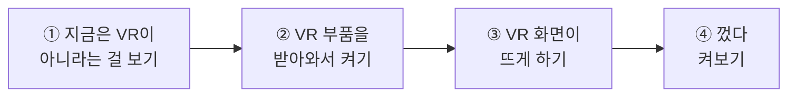
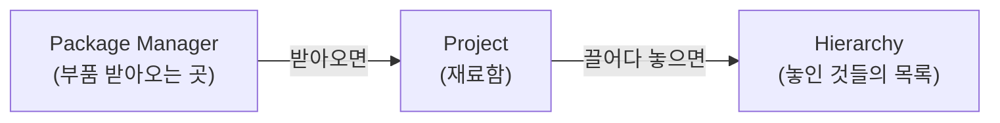
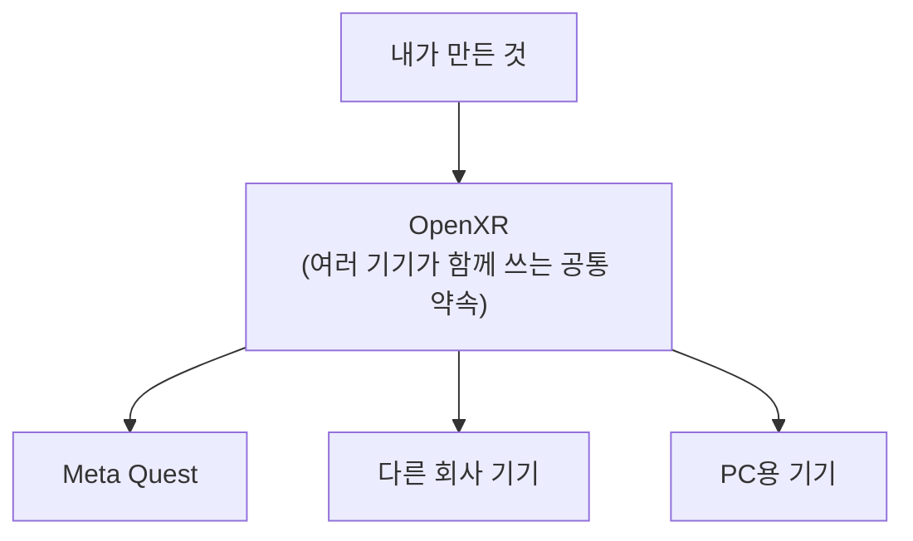
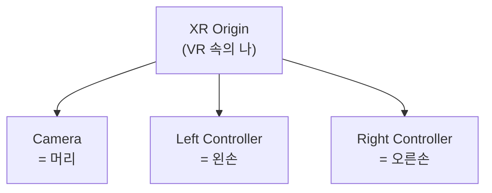
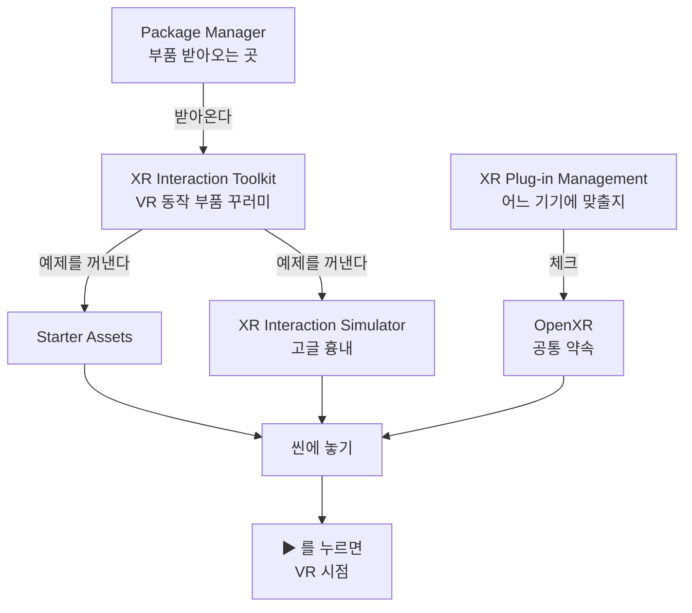

# **28차시. 고글 없이 VR 준비하기**

---

> ℹ️ **이 자료는 이렇게 보세요**
>
> - **강의 영상과 함께 보는 자료**입니다. 영상을 따라가시면서 옆에 두고 보시면 됩니다.
> - 오늘도 **코드를 한 줄도 쓰지 않습니다.** 오늘 하실 일은 **체크박스 켜기, 목록에서 고르기, 버튼 한 번 누르기**가 전부예요.
> - **VR 고글이 없어도 됩니다.** 오늘 그 이야기를 가장 먼저 하겠습니다.
> - **이번 차시부터는 따라 하지 않으셔도 괜찮습니다.** 자세한 안내는 실습 절 앞에 적어두었습니다.

---

## **오늘의 목표**

> 💬 **27차시와 오늘의 차이**
>
> 27차시까지는 **화면 안의 세상**을 만들었습니다.
> 오늘부터는 그 세상 **안으로 들어갑니다.**

이번 차시가 끝나면 여러분의 프로젝트는 이렇게 됩니다.

- **▶ 를 누르면 VR 시점으로 화면이 바뀝니다**
- 고글이 없어도 **키보드와 마우스로 둘러볼 수 있습니다**
- VR을 **껐다 켰다** 할 수 있게 됩니다



---

## **1. VR은 뭐가 다른가요?**

지금까지 만든 것과 VR은 딱 **두 가지**가 다릅니다. 그게 전부예요.

| | 지금까지 | VR |
| :--- | :--- | :--- |
| **화면** | 하나 | **두 개** (왼쪽 눈 · 오른쪽 눈) |
| **시점** | 마우스로 돌림 | **머리를 돌리면 따라감** |

> ✅ **핵심 한 줄**
>
> **VR은 새로 배우는 게 아니라, 시점이 머리를 따라오게 만드는 것뿐입니다.**
>
> 22차시에 만든 1인칭 사격장 기억하시나요? 마우스로 둘러봤죠.
> 그 **마우스 자리에 머리가 들어가는 것**, 그게 VR입니다.

### **그럼 뭐가 더 필요한가요**

| 필요한 것 | 누가 하나요 |
| :--- | :--- |
| 눈 두 개에 각각 화면 그리기 | **Unity가 알아서** |
| 머리 움직임을 읽어오기 | **Unity가 알아서** |
| 손 위치를 읽어오기 | **Unity가 알아서** |
| 그 기능을 **켜주기** | ← **오늘 여러분이 할 일** |

> 💡 **그래서 오늘은 만드는 게 아니라 '켜는' 날입니다**
>
> 이미 다 만들어져 있습니다. 우리는 **스위치를 올리기만** 하면 됩니다.

---

## **2. 고글이 없어도 됩니다**

여기가 오늘 가장 중요한 이야기입니다.

VR을 만들려면 고글이 있어야 할 것 같지만, **없어도 만들 수 있습니다.**
**고글 흉내를 내주는 부품**이 따로 있거든요. 이름은 **XR Interaction Simulator**입니다.

| 진짜 고글이라면 | 흉내 내는 부품이라면 |
| :--- | :--- |
| 고개를 돌린다 | **마우스 오른쪽 버튼을 누른 채** 마우스를 움직인다 |
| 걸어간다 | **`W` `A` `S` `D`** 를 누른다 |
| 손을 뻗는다 | **키로 손을 고른 뒤** 마우스로 움직인다 |

> 📝 **조작은 29차시에서 제대로 다룹니다**
>
> 오늘은 **시점이 도는 것만** 확인하시면 됩니다. 위 표는 미리 보기예요.

> ✅ **그러니까 안심하셔도 됩니다**
>
> **이 과정은 고글 없이 끝까지 갈 수 있게 만들어져 있습니다.**
>
> 실제 고글(Meta Quest)에서 돌아가는 화면은 **강사가 따로 찍어서 영상으로 보여드립니다.**
> 여러분이 고글을 사실 필요는 없습니다.

> 📝 **고글이 있으신 분은**
>
> 있으시면 물론 더 좋습니다. 다만 **연결 설정이 기기마다 달라서** 이 과정에서는 다루지 않습니다.
> 흉내 내는 부품으로 만든 것은 **고글에서도 그대로 돌아갑니다.**

---

## **3. 부품을 받아오는 곳 — Package Manager**

오늘 새로 만나는 창이 하나 있습니다. **Package Manager**입니다.

지금까지 부품은 **두 곳**에서 왔습니다.

1. Unity에 **원래 들어 있던 것** — 위치 부품, 떨어지는 부품 같은 것들
2. **강의자료로 받은 것** — `CubeSpinner`, `SimpleGun` 같은 것들

그런데 VR 부품은 **둘 다 아닙니다.** 무거워서 **필요한 사람만 따로 받아가게** 되어 있어요.
그 받아오는 창이 **Package Manager**입니다.



> ⚠️ **'받아오기'와 '붙이기'는 다릅니다**
>
> **받아왔다고 화면에 뭔가 생기지 않습니다.** 재료함에 재료가 들어온 것뿐이에요.
>
> 붕어빵 틀을 사 왔다고 붕어빵이 생기지 않는 것과 같습니다.
> **받아온 다음에 꺼내서 놓아야** 비로소 화면에 나타납니다.

> 📝 **지금은 몰라도 됩니다**
>
> Package Manager 창을 열면 목록이 아주 깁니다. **하나도 모르셔도 괜찮습니다.**
> 오늘 우리가 볼 것은 **딱 두 줄**입니다.

---

## **4. 받아올 것은 두 덩어리입니다**

이름이 길고 낯설지만, **하는 일로 외우시면 쉽습니다.**

| 받아올 것 | 하는 일 | 쉽게 말하면 |
| :--- | :--- | :--- |
| **XR Plug-in Management** | 어느 기기에 맞출지 정하기 | **어느 기기에 맞출지 정하는 곳** |
| **XR Interaction Toolkit** | VR 동작 모음 + 고글 흉내 부품 | **VR 동작을 미리 만들어둔 부품 꾸러미** |

### **왜 두 개나 필요한가요**

VR 기기는 종류가 많습니다. 회사마다 다르고, 조작 방식도 다릅니다.
**기기마다 따로 만들면 끝이 없겠죠.**

그래서 **공통 약속**을 하나 정해두었습니다. 그게 **OpenXR**입니다.



> ✅ **11차시에 했던 말이 여기서 돌아옵니다**
>
> **"한 번 만들면 어디든 간다."**
>
> VR도 마찬가지입니다. 공통 약속에 맞춰 만들어두면 **기기가 바뀌어도 다시 안 만들어도 됩니다.**

> 📝 **OpenXR이라는 이름은 안 외우셔도 됩니다**
>
> 오늘 **체크 한 번** 하고 나면 다시 볼 일이 거의 없습니다.

---

## **5. VR 속의 '나' — XR Origin**

VR에서는 **내가 어디에 서 있고, 머리가 어디를 보고, 손이 어디 있는지**가 필요합니다.

그걸 한 덩어리로 묶어둔 것이 **XR Origin**입니다. **VR 속의 나**라고 생각하시면 됩니다.



> ✅ **14차시의 그 구조입니다**
>
> **묶은 것 · 묶인 것**, 기억하시죠?
> 22차시에서 **몸 아래에 눈(카메라)** 을 묶었던 것과 **똑같은 구조**입니다.
>
> 몸이 움직이면 머리도 같이 갑니다. 머리만 돌리면 몸은 그대로 있고요.

| 22차시의 1인칭 | VR에서는 |
| :--- | :--- |
| Player (몸) | **XR Origin** |
| Main Camera (눈) | **Camera** (머리) |
| — | **Left · Right Controller** (두 손) |

> 📝 **손 두 개가 새로 생겼습니다**
>
> 지금까지 없던 것이 **손**입니다. 그래서 VR이 재미있어지는 거예요.
> **손으로 뭘 하는지는 29차시부터** 본격적으로 다룹니다.

---

## **6. 오늘 만질 것 정리**

부품을 붙이는 게 아니라 **설정을 켜는** 날이라, 표가 조금 다릅니다.

### **6.1 켜고 끄는 것**

| 항목 | 어디에 있나요 | 무슨 뜻인가요 |
| :--- | :--- | :--- |
| **OpenXR** | 어느 기기에 맞출지 정하는 곳 | 체크하면 VR 기능이 **켜집니다** |
| **플랫폼 탭** | 같은 창의 위쪽 | **PC용** 과 **Android용**(Quest)이 따로입니다 |

### **6.2 씬에 놓는 것**

| 놓을 것 | 어디서 꺼내나요 | 무슨 역할인가요 |
| :--- | :--- | :--- |
| **XR Origin (XR Rig)** | `Starter Assets` ▸ `Prefabs` | **VR 속의 나** — 머리와 두 손 |
| **XR Interaction Simulator** | 같은 이름의 폴더 안 | **고글 흉내 내는 부품** |

> ✅ **둘 다 붕어빵 틀입니다**
>
> **만드는 게 아니라 끌어다 놓습니다.** 15차시에 하신 그 방식 그대로예요.

> ⚠️ **이 표가 복잡해 보이셔도**
>
> **지금은 몰라도 됩니다.** 실습에서 하나씩 짚어드립니다.
> 오늘 외우실 것은 **"받아온다 → 켠다 → 놓는다"** 세 단어뿐이에요.

---

## **7. 실습 — 직접 해보세요**

> ℹ️ **이번 차시부터는 따라 하지 않으셔도 됩니다**
>
> VR 설정은 **한 번 해두면 끝**이고, **안 해두셔도 다음 차시를 보시는 데 지장이 없습니다.**
>
> | | |
> | :--- | :--- |
> | **직접 해보고 싶으시면** | 아래 순서대로 따라오세요 |
> | **눈으로만 보셔도 됩니다** | 영상에서 강사가 하는 걸 보시는 것으로 충분합니다 |
>
> 실제 고글(Meta Quest)에서 돌아가는 화면은 **별도 영상**으로 따로 보여드립니다.
> **어느 쪽을 고르셔도 29차시부터 따라오실 수 있습니다.**

> 🚨 **27차시에 만든 씬에서 하지 마세요**
>
> VR을 켜면 **씬의 카메라 구조가 바뀝니다.**
> 27차시에 완성한 클레이 사격 씬에서 작업하시면 **그 씬이 망가질 수 있습니다.**
>
> **반드시 새 씬을 만들어서** 오늘 실습을 하세요.
> 클레이 사격을 VR로 바꾸는 것은 **32차시에 따로** 합니다.

**안 되셔도 괜찮습니다.** 오늘은 기다리는 시간이 좀 있어요. 조급해하지 않으셔도 됩니다.

---

### **실습 ① — 지금은 VR이 아니라는 걸 확인하기**

> 🎯 **목표**
>
> **무엇이 바뀌는지 알려면, 바뀌기 전을 봐야 합니다.** 오늘의 '전' 을 눈에 담아둡니다.

1. `File` → `New Scene` → 기본 틀로 새 씬을 만들고, **`28_완성`** 으로 저장합니다.
   → 오늘은 여기서만 작업합니다.
2. 위쪽 **▶** 를 눌러봅니다.
   → **평범한 화면**이 뜹니다. 지금은 VR이 아닙니다.
3. ▶ 를 다시 눌러 멈춥니다.
4. `Edit` → `Project Settings` 를 엽니다.
5. 왼쪽 목록을 **쭉 내려봅니다.**
   → **XR 관련 항목이 없습니다.** 아직 아무것도 안 받아왔으니까요.

<details>
<summary>✅ 확인해보세요</summary>

- ▶ 를 눌렀을 때 **평범한 화면**이었나요?
- 설정 목록에 **XR 이라는 글자가 없었나요?**
  → 맞습니다. **지금 이 프로젝트는 VR을 전혀 모릅니다.**
- 이걸 기억해두세요. 실습 ③이 끝나면 **같은 ▶ 인데 화면이 달라집니다.**

</details>

> ⚠️ **잘 안 되신다면**
>
> 설정 창이 안 열린다 → `Edit` 메뉴는 Unity 창 **맨 위**에 있습니다. 프로젝트 창이 아니라 **Unity 자체의 메뉴**예요.

---

### **실습 ② — VR 부품 받아오고 켜기**

> 🎯 **목표**
>
> **부품 두 덩어리를 받아오고**, 어느 기기에 맞출지 **체크 한 번**을 합니다.

#### **1단계 — 받아오기**

1. `Window` → **`Package Manager`** 를 엽니다.
2. 왼쪽 위에서 **`Unity Registry`** 를 고릅니다.
   → Unity가 제공하는 부품 꾸러미 전체 목록입니다. **길어도 놀라지 마세요.**
3. 검색창에 **`XR Interaction Toolkit`** 을 입력하고 고른 뒤 **`Install`** 을 누릅니다.
4. **기다립니다.** 받아오는 데 시간이 걸리고, 중간에 Unity가 잠깐 멈춘 것처럼 보입니다.
   → **정상입니다.** 그냥 두세요.

> 📝 **Unity가 멈춘 것 같을 때**
>
> 부품을 받아오면 Unity가 **한 번 정리하는 시간**이 있습니다.
> 화면이 하얗게 되거나 반응이 없어 보여도 **기다리시면 됩니다.** 12차시에 겪으셨던 그 기다림과 같아요.

#### **2단계 — 예제 꾸러미 두 개 꺼내기**

부품 꾸러미 안에는 **바로 쓸 수 있게 만들어둔 예제**가 같이 들어 있습니다. 그걸 꺼냅니다.

1. 같은 창에서 방금 받은 것을 고른 채로 **`Samples`** 를 찾습니다.
2. 목록에 **두 개**가 보입니다. **둘 다 꺼냅니다.**

    | 꺼낼 것 | 왜 필요한가요 |
    | :--- | :--- |
    | **`Starter Assets`** | **VR 속의 나** 붕어빵 틀이 여기 있습니다 |
    | **`XR Interaction Simulator`** | **고글 흉내 내는 부품**이 여기 있습니다 |

3. 각각 옆의 **`Import`** 를 누릅니다.

#### **3단계 — 어느 기기에 맞출지 켜기**

1. `Edit` → `Project Settings` → 왼쪽 목록에 **`XR Plug-in Management`** 가 **새로 생겼습니다.**
   → 실습 ①에서 없던 그 항목입니다.
2. **설치 버튼**이 보이면 누릅니다. (`Install XR Plug-in Management` 같은 문구입니다)
3. 위쪽에 **작은 탭 두 개**가 있습니다. **컴퓨터 모양 탭**(PC용)이 골라져 있는지 확인합니다.
4. **`OpenXR`** 에 **체크**합니다.
   → 잠시 뒤 아래에 항목이 몇 개 더 생기고, 재료함에 **`XR` 폴더**가 만들어집니다.

<details>
<summary>✅ 확인해보세요</summary>

- 설정 목록에 **`XR Plug-in Management`** 가 생겼나요?
- **`OpenXR`** 옆 체크가 켜졌나요?
  → 이제 이 프로젝트는 **VR을 알게 됐습니다.**
- 재료함(`Project`)에 **새 폴더**가 생겼나요?
  → 예제 꾸러미가 들어온 것입니다.

</details>

> ⚠️ **잘 안 되신다면**
>
> `XR Plug-in Management` 가 목록에 없다 → **1단계가 아직 안 끝난 것**입니다.
> Unity 오른쪽 아래에 **동그라미가 돌고 있는지** 보세요. 돌고 있으면 아직 받아오는 중입니다.

> 💡 **마음껏 만져보셔도 됩니다**
>
> 체크는 **껐다 켜도 아무것도 망가지지 않습니다.** 궁금하시면 눌러보세요.

---

### **실습 ③ — VR 화면이 뜨게 하기 (오늘의 핵심)**

> 🎯 **목표**
>
> **▶ 를 눌렀을 때 VR 시점으로 화면이 바뀌게** 만듭니다. 오늘의 결과물입니다.

#### **1단계 — 원래 카메라 치우기**

1. **Hierarchy**(놓인 것들의 목록)에서 **`Main Camera`** 를 고릅니다.
2. **`Delete`** 로 지웁니다.
   → 화면이 까맣게 됩니다. **정상입니다.** 볼 눈이 없어졌으니까요.

> 📝 **왜 지우나요**
>
> 이제 **VR 속의 나**가 눈을 가지고 옵니다. 눈이 두 개면 어느 쪽으로 볼지 헷갈립니다.

#### **2단계 — VR 속의 나 놓기**

**재료함(`Project`)** 에서 아래 경로를 따라갑니다.

```
Assets ▸ Samples ▸ XR Interaction Toolkit ▸ 3.3.2 ▸ Starter Assets ▸ Prefabs
```

1. 거기 있는 **`XR Origin (XR Rig)`** 를 **Hierarchy 로 끌어다 놓습니다.**
2. 놓인 것의 **왼쪽 화살표를 눌러 펼쳐보세요.**
   → 안에 **Camera** 와 **손 두 개**가 들어 있습니다. **5절에서 본 그 구조**입니다.

> ✅ **왜 만들지 않고 끌어다 놓나요**
>
> 이 붕어빵 틀에는 **VR에 필요한 것이 전부 들어 있습니다.**
> 걷기·돌기·순간이동까지 **미리 붙어 있어요.** 우리는 갖다 쓰기만 하면 됩니다.
>
> 15차시에 만든 **자동차 붕어빵 틀**, 기억하시죠? **완전히 같은 방식**입니다.

> ⚠️ **메뉴로 만드는 방법도 있지만 오늘은 쓰지 않습니다**
>
> `Hierarchy` 우클릭 → `XR` → `XR Origin (VR)` 로도 만들 수 있습니다.
> 그런데 그건 **껍데기만** 만들어줍니다. **걷는 데 필요한 부품이 빠져 있어서** 나중에 하나씩 붙여야 해요.
>
> **끌어다 놓는 쪽이 훨씬 쉽고, 빠지는 것도 없습니다.**

#### **3단계 — 고글 흉내 부품 놓기**

**재료함**에서 아래 경로를 따라갑니다.

```
Assets ▸ Samples ▸ XR Interaction Toolkit ▸ 3.3.2 ▸ XR Interaction Simulator
```

1. 거기 있는 **`XR Interaction Simulator`** 를 **Hierarchy 로 끌어다 놓습니다.**

> 📝 **이름이 길어서 헷갈리실 수 있습니다**
>
> 폴더 이름과 프리팹 이름이 **똑같습니다.** 폴더를 열고 그 **안에 있는 것**을 끌어다 놓으세요.

#### **4단계 — 확인**

1. 바닥이 없으면 허공이라 확인이 어렵습니다.
   Hierarchy 우클릭 → `3D Object` → **`Plane`** 을 하나 놓습니다.
2. **▶** 를 누릅니다.
3. **`Game`(미리보기) 창을 한 번 클릭합니다.** ← **이걸 안 하면 조작이 안 먹습니다**
4. **마우스 오른쪽 버튼을 누른 채로** 마우스를 움직여봅니다.
   → **시점이 따라 움직입니다.**

> ⚠️ **그냥 마우스만 움직이면 안 돕니다**
>
> **오른쪽 버튼을 누른 채로** 움직이셔야 합니다.
>
> 평소 게임과 달라서 여기서 많이 막히십니다. **고글 흉내 내는 부품의 방식**이라 그렇습니다.
> 진짜 고글에서는 **그냥 고개만 돌리면** 됩니다.

<details>
<summary>✅ 완성되면</summary>

**▶ 를 눌렀을 때 화면이 달라졌습니다.**

실습 ①에서 눌렀던 그 **똑같은 ▶** 인데요.
바뀐 건 **받아오고, 켜고, 놓은 것**뿐입니다. **코드는 한 줄도 쓰지 않았습니다.**

고개를 돌리듯 시점이 움직인다면 **오늘의 목표는 달성입니다.**

</details>

> ⚠️ **시점이 안 돌아간다면**
>
> **`Game` 창을 클릭하지 않으신 경우**가 대부분입니다.
> Unity는 **마지막에 클릭한 창**으로 키보드·마우스를 보냅니다. 미리보기 창을 한 번 눌러주세요.

---

### **실습 ④ — 껐다 켜보기 (선택)**

> 🎯 **목표**
>
> **VR이 '켜고 끌 수 있는 것'** 이라는 걸 눈으로 확인합니다.

1. ▶ 를 눌러 멈춥니다.
2. `Edit` → `Project Settings` → `XR Plug-in Management`
3. **`OpenXR`** 체크를 **해제**합니다.
4. **▶** 를 눌러봅니다. → **평범한 화면**으로 돌아갑니다.
5. 다시 **체크**하고 ▶ → **VR 화면**이 돌아옵니다.

<details>
<summary>✅ 무슨 일이 일어났나요</summary>

**체크 하나로 VR이 켜졌다 꺼졌다 합니다.**

1차시부터 계속 말씀드린 그 문장이 여기서도 그대로입니다.

> **붙이면 생기고, 빼면 사라진다.**

VR도 예외가 아니었습니다. **특별한 게 아니라, 켜고 끄는 기능 중 하나**입니다.

</details>

> 💡 **여유가 되시면**
>
> 실습 ③의 4단계로 돌아가 **키보드도 눌러보세요.**
> 앞뒤로 움직이는 키가 있습니다. 어떤 키가 무슨 일을 하는지는 **29차시에서 제대로** 다룹니다.

---

## **8. 오늘 한 일을 그림으로**



> ✅ **이 그림 하나만 기억하셔도 오늘은 성공입니다**
>
> - **받아온다** — Package Manager 에서 부품 꾸러미를
> - **켠다** — 어느 기기에 맞출지 체크
> - **놓는다** — VR 속의 나 + 고글 흉내 부품
>
> 세 단어입니다. **받아온다 · 켠다 · 놓는다.**

---

## **9. 정리 문제**

맞히는 게 목적이 아닙니다. **오늘 내용이 머리에 남았는지 확인하는 용도**예요.
먼저 스스로 답을 떠올려보신 뒤에 정답을 펼쳐주세요.

### **문제 1**
**VR 고글이 없으면** 이 과정을 따라올 수 없을까요?

<details>
<summary>✅ 정답 보기</summary>

**따라올 수 있습니다.**

**고글 흉내 내는 부품(XR Interaction Simulator)** 이 있어서, **키보드와 마우스로** 대신할 수 있습니다.
실제 고글에서 돌아가는 화면은 **강사가 따로 찍은 영상**으로 보여드립니다.

그리고 흉내 내는 부품으로 만든 것은 **고글에서도 그대로 돌아갑니다.**

</details>

### **문제 2**
**Package Manager**는 무엇을 하는 곳인가요? **재료함(Project)** 과는 어떻게 다른가요?

<details>
<summary>✅ 정답 보기</summary>

- **Package Manager**: 부품 꾸러미를 **받아오는 곳**
- **재료함(Project)**: 받아온 것이 **들어와 있는 곳**

받아왔다고 화면에 뭔가 생기지는 않습니다.
**붕어빵 틀을 사 왔다고 붕어빵이 생기지 않는 것**과 같아요.

받아온 다음 **꺼내서 놓아야** 화면에 나타납니다.

</details>

### **문제 3**
**OpenXR**은 왜 필요한가요?

<details>
<summary>✅ 정답 보기</summary>

VR 기기는 **회사마다 다릅니다.** 기기마다 따로 만들면 끝이 없습니다.

그래서 **여러 기기가 함께 쓰는 공통 약속**을 정해둔 것이 OpenXR입니다.
여기에 맞춰 만들어두면 **기기가 바뀌어도 다시 안 만들어도 됩니다.**

> 💡 **11차시의 그 말입니다**
>
> **한 번 만들면, 어디든 간다.**

</details>

### **문제 4**
**XR Origin** 안에는 무엇이 들어 있나요? 그리고 그 구조를 **몇 차시에서** 배웠나요?

<details>
<summary>✅ 정답 보기</summary>

**머리(Camera)와 두 손(Left · Right Controller)** 이 들어 있습니다. **VR 속의 나**예요.

구조는 **14차시의 묶은 것 · 묶인 것**입니다.
**22차시**에서 몸(Player) 아래에 눈(Camera)을 묶었던 것과 **똑같습니다.**

달라진 건 **손 두 개가 생겼다**는 것뿐이에요.

</details>

### **문제 5**
▶ 를 눌렀는데 **마우스를 움직여도 시점이 안 돌아갑니다.** 무엇을 확인해야 할까요?

<details>
<summary>✅ 정답 보기</summary>

**`Game`(미리보기) 창을 클릭했는지** 확인하세요.

Unity는 **마지막에 클릭한 창**으로 키보드·마우스를 보냅니다.
작업대(`Scene`)를 클릭한 상태면 미리보기 창은 조작을 못 받습니다.

> 📝 **이건 VR만의 문제가 아닙니다**
>
> 22차시에 1인칭으로 걸어 다닐 때도 같은 이유로 안 움직이는 경우가 있었습니다.
> **미리보기 창을 한 번 눌러주기**, 습관으로 만들어두시면 좋습니다.

</details>

---

## **10. 앞으로 조심할 것**

> ⚠️ **흔한 실수**
>
> - **27차시 씬에서 VR을 켜기** → 그 씬이 망가집니다. **새 씬에서** 하세요.
> - **받아오는 중에 이것저것 누르기** → 기다리시는 게 빠릅니다.
> - **플랫폼 탭을 헷갈리기** → PC용과 Android용은 **따로** 켭니다. 한쪽만 켜면 다른 쪽에선 VR이 안 뜹니다.

> 💡 **좋은 습관 하나**
>
> **VR 작업은 씬을 따로 두고 하세요.**
>
> 지금까지 만든 것을 건드리지 않고 **새 씬에서 연습**한 뒤, 잘 되면 그때 옮기면 됩니다.
> 32차시에 클레이 사격을 VR로 바꿀 때도 **원본은 그대로 두고** 복사본에서 작업합니다.

---

## **11. 오늘의 정리**

> ✅ **세 줄 요약**
>
> 1. VR은 새로 배우는 게 아니라 **시점이 머리를 따라오게 만드는 것**이다.
> 2. **받아온다 · 켠다 · 놓는다** — 오늘 한 일은 이 세 가지가 전부다.
> 3. **고글이 없어도 된다.** 흉내 내는 부품이 대신해준다.

여러분은 오늘 **코드 한 줄 없이 프로젝트를 VR로 바꾸셨습니다.**
낯선 이름이 많이 나왔는데 여기까지 오셨네요. 충분히 잘하셨어요.

---

## **12. 다음 차시 준비**

> 🧩 **29차시 — VR 속에서 움직이기**
>
> 오늘은 **화면이 뜨는 것까지** 했습니다. 아직 **가만히 서 있기만** 하죠.
>
> 다음 시간에는 **손을 움직이고, 걸어 다닙니다.**
> 실습 ④ 끝에서 눌러본 그 키들이 **정확히 뭘 하는 키인지** 다음 시간에 알려드립니다.

> 📝 **미리 해두시면 좋은 것**
>
> - [ ] 오늘 만든 **`28_완성` 씬을 저장** (`Ctrl + S`)
> - [ ] `OpenXR` **체크를 켜둔 상태**로 두기 — 실습 ④에서 껐다면 **다시 켜주세요**
> - [ ] 27차시 완성 씬(`27_완성`)이 **그대로 남아 있는지** 확인
>
> > 💡 **오늘 실습을 안 하셨다면**
> >
> > **괜찮습니다.** 29차시는 강사 화면을 보시는 것만으로 따라오실 수 있습니다.
> > 나중에 해보고 싶어지시면 **이 자료를 보고 언제든** 하실 수 있어요.

---

## **부록 — 오늘 나온 용어 정리**

영어 이름이 낯설게 느껴지실 때 이 표를 보세요.

| 화면에 보이는 이름 | 우리말로 하면 |
| :--- | :--- |
| **Package Manager** | 부품 받아오는 곳 |
| **Package** | 부품 꾸러미 |
| **Unity Registry** | Unity가 제공하는 부품 목록 |
| **Install** | 받아오기 |
| **Samples** | 같이 들어 있는 예제 꾸러미 |
| **Import** | 예제를 꺼내오기 |
| **XR** | VR · AR을 함께 부르는 말 |
| **XR Plug-in Management** | 어느 기기에 맞출지 정하는 곳 |
| **OpenXR** | 여러 기기가 함께 쓰는 공통 약속 |
| **XR Interaction Toolkit** | VR 동작을 미리 만들어둔 부품 꾸러미 |
| **XR Interaction Simulator** | 고글 흉내 내는 부품 |
| **XR Origin** | VR 속의 나 (머리와 두 손) |
| **Controller** | VR 조종기 = 손 |
| **Project Settings** | 프로젝트 전체 설정 창 |
| **Plane** | 바닥으로 쓰는 납작한 판 |
