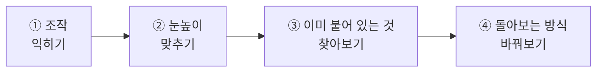
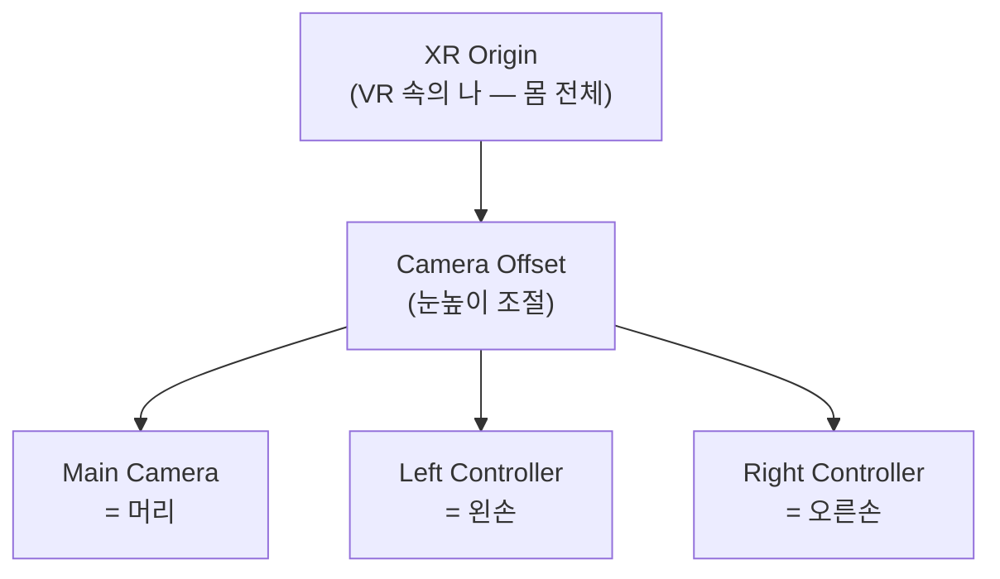
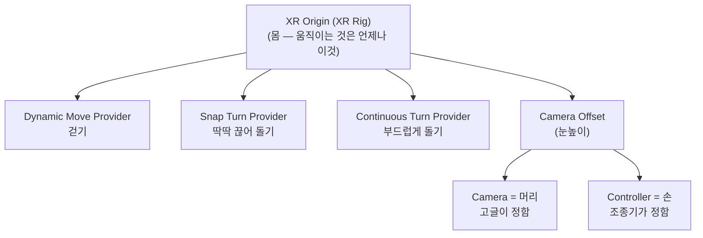

# **29차시. VR 속에서 걸어 다니기**

---

> ℹ️ **이 자료는 이렇게 보세요**
>
> - **강의 영상과 함께 보는 자료**입니다. 영상을 따라가시면서 옆에 두고 보시면 됩니다.
> - 오늘도 **코드를 한 줄도 쓰지 않습니다.** 오늘은 **붙일 것도 없습니다.** 숫자 바꾸고 체크만 껐다 켭니다.
> - **28차시를 안 하셨어도 괜찮습니다.** 영상만 보셔도 따라오실 수 있습니다.
> - 오늘은 **키보드 조작을 좀 외우셔야** 하는데, **다 적어드릴 테니 외우지 마시고 보고 하세요.**

---

## **오늘의 목표**

> 💬 **28차시와 오늘의 차이**
>
> 28차시에는 **화면이 뜨는 것**까지만 확인했습니다.
> 오늘은 그 안을 **제대로 돌아다니고, 내 몸에 맞춥니다.**

이번 차시가 끝나면 여러분은 이렇게 됩니다.

- **VR 안을 자유롭게 걸어 다니고 둘러볼 수 있습니다**
- **눈높이를 자기 키에 맞출 수 있습니다**
- **걷기·돌기가 어디에 들어 있는지 알게 됩니다**



> ✅ **오늘은 붙일 게 없습니다**
>
> 28차시에 끌어다 놓은 **붕어빵 틀에 걷기·돌기가 이미 들어 있습니다.**
>
> 그래서 오늘은 **만드는 날이 아니라 맞추는 날**입니다.
> **어디에 뭐가 들어 있는지 알고, 내 몸에 맞추는 것** — 이것도 만드는 일의 절반이에요.

---

## **1. 먼저, 조작법부터**

오늘은 이야기보다 **조작법**이 먼저입니다. 이걸 모르면 아무것도 확인할 수 없거든요.

28차시에 놓은 **고글 흉내 내는 부품**은 키보드와 마우스로 VR을 흉내 냅니다.
그런데 **손이 두 개**라서, "지금 어느 손을 움직이는 중인지"를 정해줘야 합니다.

### **기본 조작**

| 하고 싶은 것 | 이렇게 합니다 |
| :--- | :--- |
| **둘러보기** | **마우스 오른쪽 버튼을 누른 채로** 마우스 움직이기 |
| **걸어 다니기** | **`W` `A` `S` `D`** |
| **위아래로** | **`Q`** (내려감) · **`E`** (올라감) |
| **원래대로 되돌리기** | **`R`** |

> ⚠️ **그냥 마우스만 움직이면 시점이 안 돕니다**
>
> **오른쪽 버튼을 누른 채로** 움직이셔야 합니다. 28차시에 겪으신 그거예요.
>
> 평소 게임과 달라서 계속 헷갈리십니다. **진짜 고글에서는 그냥 고개만 돌리면** 됩니다.

### **손을 움직이려면 — 먼저 '고릅니다'**

마우스는 하나인데 움직일 건 **머리·왼손·오른손 셋**입니다.
그래서 **"지금 뭘 움직일지"를 먼저 고르는** 방식입니다.

| 키 | 무엇을 고르나요 |
| :--- | :--- |
| **`[`** | **왼손** |
| **`]`** | **오른손** |
| **`H`** | **머리** |

> ✅ **누르고 있는 게 아니라 '바뀌는' 것입니다**
>
> `[` 를 한 번 누르면 **다시 누를 때까지 계속 왼손**입니다.
> 키를 꾹 누르고 있을 필요가 없어요. **한 번 눌러서 바꾸고, 한 번 더 눌러서 되돌립니다.**
>
> TV 리모컨의 채널 버튼 같은 겁니다. 누르는 동안만 채널이 바뀌는 게 아니잖아요.

> 📝 **화면 구석에 안내가 떠 있습니다**
>
> ▶ 를 누르면 화면 한쪽에 **조작 안내**가 같이 뜹니다. **`X`** 를 누르면 더 자세히 볼 수 있어요.
> 영어라 낯설어 보여도 **지금은 몰라도 됩니다.** 위 표만 알면 오늘은 충분합니다.

> 💡 **외우지 마세요**
>
> **`[` `]` 는 키보드에서 `P` 오른쪽에 나란히 있습니다.** 왼쪽 것이 왼손, 오른쪽 것이 오른손이에요.
> 위치가 곧 의미라 한 번 보면 잊히지 않습니다.

---

## **2. VR 속의 나, 다시 보기**

28차시에 **XR Origin**을 놓고 펼쳐만 봤습니다. 오늘은 그 안을 제대로 봅니다.



| 이름 | 무엇인가요 | 움직이면 |
| :--- | :--- | :--- |
| **XR Origin** | 나 전체 (몸) | **내가 통째로 이동합니다** |
| **Camera Offset** | 눈높이 조절 | **키가 커지거나 작아집니다** |
| **Main Camera** | 머리 | (고글이 알아서 움직입니다) |
| **Left · Right Controller** | 두 손 | (조종기가 알아서 움직입니다) |

> ✅ **22차시와 똑같은 구조입니다**
>
> **몸 아래에 눈을 묶었던 것**, 기억하시죠?
>
> | 22차시 1인칭 | VR |
> | :--- | :--- |
> | Player (몸) | **XR Origin** |
> | Main Camera (눈) | **Main Camera** |
> | — | **손 두 개** |
>
> 달라진 건 **손이 생겼다**는 것뿐입니다.

> ⚠️ **머리와 손은 직접 움직이지 마세요**
>
> **머리와 손의 위치는 고글과 조종기가 정합니다.** 우리가 숫자로 넣어도 실행하면 덮어씌워집니다.
>
> **우리가 움직이는 건 언제나 `XR Origin`(몸)입니다.** 이게 VR에서 가장 헷갈리는 부분이에요.

---

## **3. 눈높이 — 키를 어디서 재나요**

VR에서 **키를 어디서부터 재는지**를 정하는 칸이 있습니다. 두 가지 중에 고릅니다.

| 고르는 값 | 뜻 | 이럴 때 씁니다 |
| :--- | :--- | :--- |
| **바닥 기준** (Floor) | **바닥에서부터** 잽니다 | 서서 하는 VR — **보통 이걸 씁니다** |
| **앉은 기준** (Device) | **고글 위치가 기준**입니다 | 앉아서 하는 VR |

> 🚨 **바닥에 파묻히거나 공중에 뜬다면 여기입니다**
>
> VR을 켰는데 **시점이 바닥 아래**에 있거나 **너무 높이** 있으면, 십중팔구 이 칸이 잘못된 것입니다.
>
> **`Floor`(바닥 기준)로 두시면** 대부분 해결됩니다.
>
> 이건 **고쳐도 흔적이 안 남는** 종류의 문제라, 원인을 모르면 계속 헤매게 됩니다. 이 문단을 기억해두세요.

### **키를 조절하고 싶다면**

**Camera Offset**의 높이 값을 바꿉니다. **눈높이 조절**이라고 생각하시면 됩니다.

- 값을 **키우면** → 키가 커집니다 (내려다봄)
- 값을 **줄이면** → 키가 작아집니다 (올려다봄)

> 💡 **직접 해보시는 게 빠릅니다**
>
> 실습 ②에서 값을 바꿔가며 확인합니다. **마음껏 바꿔보셔도 됩니다.**

---

## **4. VR에서 움직이는 두 가지 방법**

VR에서 이동하는 방법은 크게 두 가지입니다.

| 방식 | 어떻게 | 오늘 다루나요 |
| :--- | :--- | :---: |
| **부드럽게 걷기** | 스틱을 밀면 스르륵 이동 | ✅ **오늘** |
| **순간이동** | 바닥을 가리키고 놓으면 그 자리로 | **31차시** |

> 📝 **왜 두 가지나 있나요**
>
> **사람마다 멀미를 느끼는 정도가 다르기 때문입니다.** 바로 다음 절에서 이야기합니다.

오늘은 **부드럽게 걷기**를 씁니다. 22차시에 만든 1인칭 이동과 **느낌이 거의 같습니다.**

> 📝 **붙일 필요는 없습니다**
>
> **붕어빵 틀에 이미 들어 있습니다.** 실습 ③에서 어디 있는지 찾아봅니다.

---

## **5. VR에는 '멀미'라는 문제가 있습니다**

여기가 VR에만 있는 이야기입니다. **게임을 만들 때 반드시 고려해야 하는 것**이에요.

**눈은 움직인다고 하는데 몸은 가만히 있으면**, 사람은 멀미를 느낍니다.
차 안에서 책을 읽을 때와 비슷한 원리예요.

### **가장 심한 건 '돌기'입니다**

걷는 것보다 **몸을 돌릴 때** 훨씬 심합니다. 그래서 VR에는 **돌아보는 방식이 두 가지** 있습니다.

| 방식 | 어떻게 돌아가나요 | 멀미 |
| :--- | :--- | :--- |
| **부드럽게 돌기** | 스르륵 돌아갑니다 | **더 심합니다** |
| **딱딱 끊어 돌기** | 45도씩 **툭툭 끊어서** 돌아갑니다 | **덜합니다** |

> ✅ **왜 일부러 끊어서 돌리나요**
>
> **부드럽게 도는 그 중간 과정이 멀미를 만듭니다.**
> 아예 **건너뛰어 버리면** 눈이 헷갈릴 시간이 없어요.
>
> 처음 보면 "왜 이렇게 뚝뚝 끊기지?" 싶지만, **일부러 그렇게 만든 것**입니다.

> 💡 **만드는 사람의 정답은 '둘 다 넣기'입니다**
>
> 실제 VR 게임들은 **설정에서 고를 수 있게** 해둡니다. 사람마다 다르니까요.
>
> **여러분의 붕어빵 틀에도 둘 다 들어 있습니다.** 실습 ④에서 갈아 끼워봅니다.

---

## **6. 오늘 만질 것 정리**

### **6.1 이미 붙어 있는 부품 (붙이지 않습니다)**

**28차시에 끌어다 놓은 붕어빵 틀 안에** 전부 들어 있습니다.
**`XR Origin (XR Rig)` ▸ `Locomotion`** 을 펼치면 **종류별로 나뉘어** 있어요.

| 어디에 | 조종석에 보이는 이름 | 하는 일 | 오늘 |
| :--- | :--- | :--- | :--- |
| **`Move`** | Dynamic Move Provider | 걷기 | 실습 ③에서 **찾아만 봄** |
| **`Turn`** | Snap Turn Provider | 딱딱 끊어 돌기 | 실습 ③에서 **껐다 켬** · ④에서 갈아 끼움 |
| 〃 | Continuous Turn Provider | 부드럽게 돌기 | 실습 ④에서 갈아 끼움 |
| **`Teleportation`** | Teleportation Provider | 순간이동 | **31차시에 씁니다** |

> ⚠️ **맨 위 `XR Origin (XR Rig)` 에는 없습니다**
>
> 거기를 고르면 안 보입니다. **`Locomotion` 안으로 한 단계 더** 들어가셔야 합니다.

### **6.2 조절할 수 있는 값**

| 항목 | 어디에 | 무슨 뜻인가요 |
| :--- | :--- | :--- |
| **Camera Offset 높이** | Camera Offset | 눈높이 (오늘의 실습 ②) |
| **Tracking Origin Mode** | XR Origin | 키를 어디서 재는지 |
| **Turn Amount** | Snap Turn Provider | 한 번에 도는 각도 (`45` 기본) |

> 📝 **이 표가 복잡해 보이셔도**
>
> **지금은 몰라도 됩니다.** 실습에서 하나씩 짚어드립니다.

---

## **7. 실습 — 직접 해보세요**

> ℹ️ **따라 하지 않으셔도 됩니다**
>
> 28차시와 같습니다. **눈으로만 보셔도 30차시를 따라오실 수 있습니다.**
>
> | | |
> | :--- | :--- |
> | **직접 해보고 싶으시면** | 28차시에서 만든 `28_완성` 씬을 열어주세요 |
> | **눈으로만 보셔도 됩니다** | 영상에서 강사가 하는 걸 보시면 충분합니다 |
>
> 실제 고글에서 움직이는 화면은 **별도 영상**으로 따로 보여드립니다.

**안 되셔도 괜찮습니다.** 오늘 실습은 **되돌리기 쉬운 것들**뿐이에요.

---

### **실습 ① — 조작 익히기**

> 🎯 **목표**
>
> **시뮬레이터 조작에 익숙해집니다.** 만드는 것은 없습니다. 그냥 놀아보시면 됩니다.

1. 28차시에서 만든 **`28_완성`** 씬을 엽니다.
   → 안 하셨다면 강의자료의 **`29_시작`** 씬을 여시면 됩니다.
2. **▶** 를 누르고 **`Game`(미리보기) 창을 클릭**합니다. ← 28차시의 그 습관
3. **마우스 오른쪽 버튼을 누른 채로** 움직여봅니다 → **시점이 돌아갑니다.**
4. **`W` `A` `S` `D`** 를 눌러봅니다 → **걸어 다닙니다.**
5. **`[`** 를 **한 번** 누릅니다. 그다음 마우스를 움직여봅니다.
   → 이번엔 시점이 아니라 **왼손이 움직입니다.**
6. **`]`** 를 한 번 누릅니다 → 이제 **오른손**이 움직입니다.
7. **`H`** 를 한 번 누릅니다 → 다시 **머리**로 돌아옵니다.
8. 헷갈리면 **`R`** 을 누르세요. 전부 제자리로 돌아갑니다.

<details>
<summary>✅ 확인해보세요</summary>

- 손 두 개가 **화면에 보이나요?**
- `[` 를 누른 뒤 **키에서 손을 떼도** 계속 왼손이 움직이나요?
  → 맞습니다. **누르고 있는 게 아니라 바뀌는 것**이에요.
- 걸어 다녀지나요? → **네, 벌써 됩니다.**

</details>

> ✅ **잠깐, 벌써 걸어지네요?**
>
> 맞습니다. **28차시에 끌어다 놓은 붕어빵 틀에 이미 다 들어 있었습니다.**
>
> 걷기·돌기·순간이동까지요. 우리가 붙일 건 **없습니다.**
> 그래서 오늘은 **만드는 날이 아니라 맞추는 날**입니다.

> ⚠️ **손이 안 보인다면**
>
> **▶ 를 누르지 않으신 경우**가 대부분입니다.
> 작업대(`Scene`)에서는 손이 안 보이고, **실행해야** 나타납니다.

---

### **실습 ② — 눈높이 맞추기**

> 🎯 **목표**
>
> **내 키에 맞게** 눈높이를 조절합니다. 숫자만 바꿉니다.

1. ▶ 를 **끈 상태**에서 합니다. ← 중요
2. **Hierarchy**에서 **`XR Origin`** 을 고릅니다.
3. **조종석(Inspector)** 에서 **`Tracking Origin Mode`** 를 찾아 **`Floor`**(바닥 기준)로 되어 있는지 확인합니다.

4. Hierarchy에서 **`Camera Offset`** 을 고릅니다.
5. 위치 부품의 **Y 값**을 바꿔봅니다.
   - `1.6` → 보통 어른 눈높이
   - `0.8` → 앉은 것처럼 낮아집니다
   - `3` → 천장 근처에서 내려다봅니다
6. 값을 바꿀 때마다 **▶** 를 눌러 확인합니다.

<details>
<summary>✅ 확인해보세요</summary>

- 숫자 하나로 **보는 높이가 달라졌나요?**
- `3` 으로 놓았을 때 **세상이 작아 보였나요?**
  → 눈높이만 바뀌었을 뿐인데 **완전히 다른 공간처럼** 느껴집니다. VR에서 높이가 중요한 이유예요.

</details>

> 🚨 **▶ 를 누른 상태에서 바꾼 값은 사라집니다**
>
> **실행 중에 바꾼 값은 ▶ 를 끄면 원래대로 돌아갑니다.**
> 1차시부터 계속 나온 이야기인데, **VR에서는 특히 자주 겪습니다.** 값을 바꾸실 땐 **▶ 를 끄고** 하세요.

> 💡 **마음껏 망가뜨리셔도 됩니다**
>
> 이상해지면 항목 이름 위에서 **우클릭 → `Revert`** 로 되돌릴 수 있습니다.

---

### **실습 ③ — 이미 붙어 있는 것 찾아보기 (오늘의 핵심)**

> 🎯 **목표**
>
> **걷기·돌기가 어디에 들어 있는지** 눈으로 찾아내고, **껐다 켜서 확인**합니다.
> 오늘의 결과물은 **"이게 여기 있었구나"** 를 아는 것입니다.

#### **1단계 — 몸을 열어보기**

1. ▶ 를 **끕니다.**
2. **Hierarchy**에서 **`XR Origin (XR Rig)`** 왼쪽 화살표를 눌러 **펼칩니다.**
3. 그 안의 **`Locomotion`** 을 다시 **펼칩니다.**

이런 이름들이 나옵니다. **이동에 관한 건 전부 여기 모여 있습니다.**

```
XR Origin (XR Rig)
└── Locomotion
    ├── Move            ← 걷기
    ├── Turn            ← 돌기 (두 방식이 여기 같이)
    ├── Teleportation   ← 순간이동 (31차시에 씁니다)
    ├── Grab Move       ← 손으로 세상을 끌어당겨 이동
    ├── Gravity         ← 중력
    └── Jump            ← 점프
```

> ⚠️ **맨 위 `XR Origin (XR Rig)` 을 고르면 안 보입니다**
>
> 거기엔 **없습니다.** 이동 부품들은 **`Locomotion` 안에 종류별로 나뉘어** 붙어 있어요.
>
> **이름만 보고 찾으시면 됩니다.** `Move` 는 걷기, `Turn` 은 돌기. 그게 전부예요.

4. **`Move`** 를 클릭하고 조종석을 봅니다. → **`Dynamic Move Provider`** 가 붙어 있습니다.
5. **`Turn`** 을 클릭해봅니다. → **`Snap Turn Provider`** 와 **`Continuous Turn Provider`** 가 **둘 다** 있습니다.

> ✅ **여러분은 아무것도 안 붙였습니다**
>
> **28차시에 끌어다 놓은 붕어빵 틀에 처음부터 다 들어 있었습니다.**
>
> 이게 **붕어빵 틀의 힘**입니다. 15차시에 자동차 틀 하나로 다섯 대를 놓으셨죠?
> 여기서는 **VR에 필요한 부품 한 무더기**가, **폴더까지 정리된 채로** 담겨 있었던 겁니다.

> 📝 **이름이 많아서 어지러우시면**
>
> **지금은 몰라도 됩니다.** **`Move` 와 `Turn` 둘만** 보시면 오늘은 충분합니다.

#### **2단계 — 껐다 켜서 확인하기**

정말 그게 그 일을 하는지 **직접 확인**해봅니다. **`Turn` 으로** 해볼게요.

1. **`Turn`** 을 선택하고, 조종석의 **`Snap Turn Provider`** 이름 왼쪽 **체크를 해제**합니다.
2. **▶** 를 누르고 **`Game` 창 클릭** → **돌아보려고 해봅니다.**
   → **안 돌아갑니다.**
3. ▶ 를 끄고 **다시 체크**합니다. → **▶ 를 누르면 다시 돌아갑니다.**

> 💡 **더 간단한 방법**
>
> 조종석 대신 **Hierarchy 에서 `Turn` 오브젝트 자체의 체크**를 꺼도 결과는 같습니다.
> 찾기 쉬운 쪽으로 하세요.

> 📝 **왜 걷기(`Move`)로 안 하고 돌기로 하나요**
>
> **`Move` 를 꺼도 `W A S D` 는 그대로 움직입니다.** 궁금해서 해보셨다면 그게 정상이에요.
>
> **고글 흉내 내는 부품이 기기 자체를 옮기기** 때문입니다.
> 게임의 걷기 부품을 거치지 않고, **고글을 손으로 들고 옮기는 것**처럼 동작하는 거예요.
>
> | | 흉내 내는 부품 (지금) | 진짜 고글 |
> | :--- | :--- | :--- |
> | `W A S D` | **기기를 직접 옮김** | 그런 키가 없음 |
> | 걷기 부품 | 조종기 스틱을 밀 때 작동 | 〃 |
>
> 그래서 **껐다 켜는 확인은 `Turn` 으로** 합니다. 이건 확실히 차이가 보이거든요.

<details>
<summary>✅ 완성되면</summary>

**"걷기는 여기 들어 있다"** 를 눈으로 확인하셨습니다.

그리고 오늘도 그 문장이 그대로였죠.

> **붙이면 생기고, 빼면 사라진다.**

1차시에 Rigidbody 체크를 껐다 켜신 것과 **완전히 같은 일**입니다.
부품 이름만 어려워졌지 **하는 일도, 확인하는 방법도 똑같습니다.**

</details>

> ⚠️ **체크를 껐는데도 그대로라면**
>
> **▶ 를 켠 상태로 체크를 만지신 경우**입니다.
> ▶ 를 끄고 바꾼 뒤에 다시 켜야 반영됩니다.

---

### **실습 ④ — 돌아보는 방식 바꿔보기 (선택)**

> 🎯 **목표**
>
> **끊어 돌기와 부드럽게 돌기**를 둘 다 겪어보고, 왜 끊어 돌리는지 몸으로 확인합니다.

1. ▶ 를 **끕니다.**
2. **`XR Origin (XR Rig)` ▸ `Locomotion` ▸ `Turn`** 을 선택합니다.
   → 조종석에 **두 부품이 같이** 있습니다.
3. **`Snap Turn Provider`** 체크를 **해제**하고, **`Continuous Turn Provider`** 는 **켜둡니다.**
4. **▶** 를 누르고 돌아봅니다. → **스르륵** 돌아갑니다.
5. 반대로 바꿔서 다시 해봅니다. → **툭툭** 끊어서 돌아갑니다.

> 📝 **두 부품이 한 곳에 같이 있습니다**
>
> `Turn` 오브젝트 하나에 **끊어 돌기와 부드럽게 돌기가 나란히** 붙어 있어요.
> 그래서 **체크만 번갈아 켜면** 방식이 바뀝니다.

<details>
<summary>✅ 무슨 일이 일어났나요</summary>

**어느 쪽이 편하셨나요?**

사람마다 다릅니다. 그래서 실제 VR 게임은 **설정에서 고를 수 있게** 해둡니다.
**정답이 없는 문제**라서 그래요.

그리고 여기서 알아두실 게 하나 더 있습니다.
**두 부품이 처음부터 둘 다 켜져 있었습니다.** 만든 사람이 **양쪽 다 쓸 수 있게** 넣어둔 거예요.

</details>

> 💡 **여유가 되시면**
>
> **`Snap Turn Provider`** 의 **`Turn Amount`** 를 바꿔보세요.
> `45` 가 기본인데, `90` 으로 하면 **한 번에 확 돌아갑니다.** 어지러운지 보세요.

---

## **8. 오늘 배운 것을 그림으로**



> ✅ **이 그림 하나만 기억하셔도 오늘은 성공입니다**
>
> - **걷기·돌기는 몸(XR Origin)에** 들어 있습니다 — **처음부터 붙어 있었습니다**
> - **머리와 손은 기기가 정합니다.** 우리가 건드리지 않습니다
> - **눈높이는 Camera Offset** 에서 맞춥니다
>
> 한 줄로 하면 — **움직이는 건 언제나 몸입니다.**

---

## **9. 정리 문제**

맞히는 게 목적이 아닙니다. **오늘 내용이 머리에 남았는지 확인하는 용도**예요.
먼저 스스로 답을 떠올려보신 뒤에 정답을 펼쳐주세요.

### **문제 1**
Simulator에서 **머리**를 돌리려면? **손**을 움직이려면?

<details>
<summary>✅ 정답 보기</summary>

- **머리**: 아무것도 안 누르고 **마우스만** 움직입니다
- **손**: **`[`(왼손)** 또는 **`]`(오른손)** 를 **한 번 눌러 바꾼 뒤** 마우스
- **머리로 되돌리기**: **`H`** 를 한 번

한 줄로 하면 — **키로 골라서 바꾸고, 마우스는 오른쪽 버튼을 누른 채.**

> 📝 **누르고 있는 게 아닙니다**
>
> **한 번 누르면 다시 누를 때까지 유지**됩니다. 리모컨 채널 버튼처럼요.

</details>

### **문제 2**
걷기·돌기 부품은 **어디에** 들어 있었나요? 왜 머리가 아니라 거기일까요?

<details>
<summary>✅ 정답 보기</summary>

**`XR Origin (XR Rig)` ▸ `Locomotion`** 안에, **종류별로 나뉘어** 들어 있습니다.
걷기는 **`Move`**, 돌기는 **`Turn`** 이에요. **우리가 붙인 게 아니라 처음부터 있었습니다.**

**맨 위 `XR Origin (XR Rig)` 을 고르면 안 보입니다.** 한 단계 더 들어가야 해요.

왜 몸 쪽이냐면 — **머리와 손의 위치는 고글과 조종기가 정하기 때문**입니다.
거기에 이동을 붙여도 실행하는 순간 **덮어씌워집니다.**

움직이는 건 **언제나 몸**입니다.

> 💡 **그래서 VR에서 뭔가 이상하면**
>
> **`XR Origin` 안쪽부터 보세요.** 파묻히는 것도, 안 걸어지는 것도 거의 다 여기 있습니다.

</details>

### **문제 3**
VR을 켰는데 **시점이 바닥에 파묻혀** 있습니다. 어디를 봐야 할까요?

<details>
<summary>✅ 정답 보기</summary>

**`Tracking Origin Mode`**(키를 어디서 재는지)를 확인하세요.

**`Floor`(바닥 기준)** 로 두시면 대부분 해결됩니다.
`Device`(앉은 기준)로 되어 있으면 바닥 기준이 안 맞아서 파묻히거나 뜹니다.

</details>

### **문제 4**
**딱딱 끊어 돌기**는 왜 일부러 뚝뚝 끊어지게 만들었을까요?

<details>
<summary>✅ 정답 보기</summary>

**멀미를 줄이기 위해서**입니다.

**부드럽게 도는 그 중간 과정**이 멀미를 만듭니다.
눈은 움직인다고 하는데 몸은 가만히 있으니까요.

아예 **건너뛰어 버리면** 눈이 헷갈릴 시간이 없습니다.

> 💡 **만드는 사람의 정답은**
>
> **둘 다 넣고 고르게 하는 것**입니다. 사람마다 다르니까요.

</details>

### **문제 5**
VR에서 **키를 크게** 만들고 싶습니다. 어디를 바꾸나요?

<details>
<summary>✅ 정답 보기</summary>

**`Camera Offset`** 의 **높이(Y) 값**을 키웁니다. **눈높이 조절**이에요.

> 📝 **머리(Camera)를 직접 올리면요?**
>
> **안 됩니다.** 실행하면 고글이 그 값을 덮어씁니다.
> **눈높이는 Camera Offset 에서** 맞춥니다.

</details>

---

## **10. 앞으로 조심할 것**

> ⚠️ **흔한 실수**
>
> - **이동 부품을 머리나 손에 붙이기** → 몸(`XR Origin`)에 붙입니다.
> - **머리·손 위치를 숫자로 넣기** → 실행하면 덮어씌워집니다.
> - **▶ 를 켠 채로 값 바꾸기** → 끄면 사라집니다.

> 💡 **좋은 습관 하나**
>
> **VR에서 뭔가 이상하면 `XR Origin` 부터 보세요.**
>
> 파묻히는 것도, 안 걸어지는 것도, 키가 이상한 것도 **거의 다 여기 있습니다.**

---

## **11. 오늘의 정리**

> ✅ **세 줄 요약**
>
> 1. **움직이는 건 언제나 몸(`XR Origin`)** 이다. 머리와 손은 기기가 정한다.
> 2. **걷기와 돌기는 부품을 붙이면** 생긴다. 22차시와 같은 방식이다.
> 3. VR에는 **멀미**라는 고유한 문제가 있고, **끊어 돌기**가 그 대답 중 하나다.

여러분은 오늘 **VR 안을 걸어 다닐 수 있게** 만드셨습니다.
붙인 부품은 **두 개**뿐이에요. 충분히 잘하셨습니다.

---

## **12. 다음 차시 준비**

> 🧩 **30차시 — 360도 배경 안으로**
>
> 지금은 **하얀 판 위**를 걸어 다니고 있죠. 좀 허전합니다.
>
> 다음 시간에는 **사방이 진짜 풍경인 공간**을 만듭니다.
> 사진 한 장으로 **세상을 통째로 감싸는** 방법이 있거든요.
>
> 27차시에 하늘(Skybox)을 바꿔보셨죠? **그것의 확장판**입니다.

> 📝 **미리 해두시면 좋은 것**
>
> - [ ] 오늘 만든 씬을 **저장** (`Ctrl + S`)
> - [ ] 실습 ④에서 **부드럽게 돌기로 바꾸셨다면**, 어느 쪽이든 **하나만 켜둔 상태**로 두기
> - [ ] 바닥(`Plane`)을 **넓게** 해두기 — 다음 시간에 걸어 다닐 공간이 필요합니다
>
> > 💡 **오늘 실습을 안 하셨다면**
> >
> > **괜찮습니다.** 30차시도 강사 화면을 보시는 것만으로 따라오실 수 있습니다.

---

## **부록 — 오늘 나온 용어 정리**

| 화면에 보이는 이름 | 우리말로 하면 |
| :--- | :--- |
| **XR Origin (XR Rig)** | VR 속의 나 (몸 전체) |
| **Camera Offset** | 눈높이 조절 |
| **Camera** | 머리 |
| **Left · Right Controller** | 왼손 · 오른손 |
| **Tracking Origin Mode** | 키를 어디서 재는지 |
| **Floor** | 바닥 기준 (서서 하는 VR) |
| **Device** | 앉은 기준 (앉아서 하는 VR) |
| **Locomotion** | 이동 방식 |
| **Dynamic Move Provider** | 걷기 부품 |
| **Snap Turn Provider** | 딱딱 끊어 돌기 부품 |
| **Continuous Turn Provider** | 부드럽게 돌기 부품 |
| **Teleportation Provider** | 순간이동 부품 (31차시) |
| **Turn Amount** | 한 번에 도는 각도 |

### **시뮬레이터 조작 키**

| 키 | 무엇을 |
| :--- | :--- |
| **마우스 오른쪽 버튼 + 이동** | 둘러보기 |
| **`W` `A` `S` `D`** | 걸어 다니기 |
| **`Q` · `E`** | 아래로 · 위로 |
| **`[` · `]` · `H`** | 왼손 · 오른손 · 머리 고르기 |
| **`R`** | 원래대로 되돌리기 |
| **`X`** | 조작 안내 보기 |
