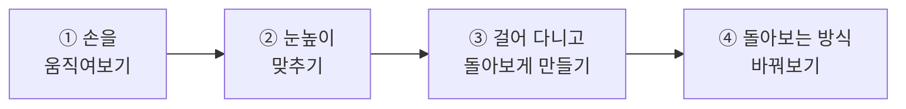
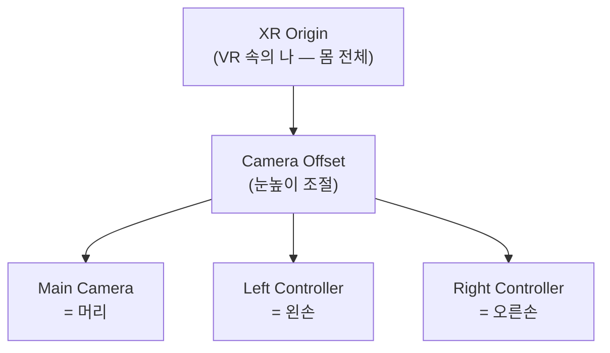
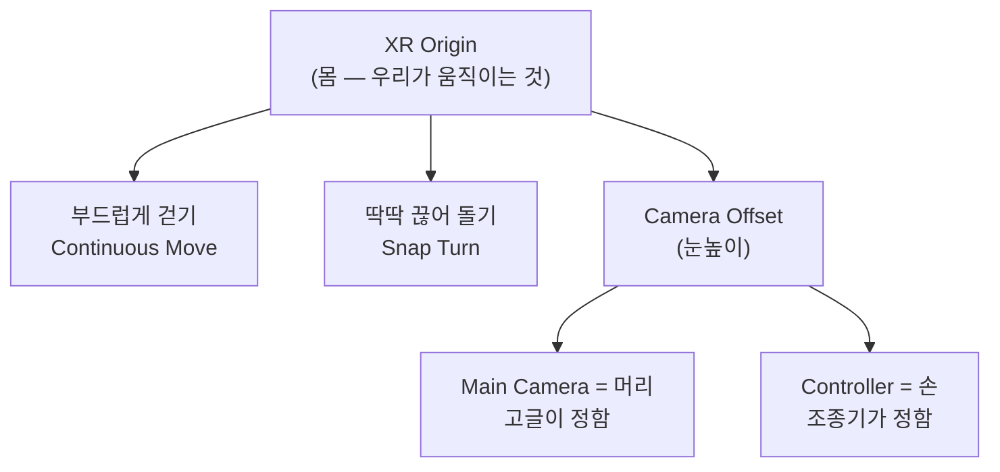

# **29차시. VR 속에서 걸어 다니기**

---

!!! info "이 자료는 이렇게 보세요"
    - **강의 영상과 함께 보는 자료**입니다. 영상을 따라가시면서 옆에 두고 보시면 됩니다.
    - 오늘도 **코드를 한 줄도 쓰지 않습니다.** 오늘 하실 일은 **부품 붙이기, 숫자 바꾸기, 목록에서 고르기**예요.
    - **28차시를 안 하셨어도 괜찮습니다.** 영상만 보셔도 따라오실 수 있습니다.
    - 오늘은 **키보드 조작을 좀 외우셔야** 하는데, **다 적어드릴 테니 외우지 마시고 보고 하세요.**

---

## **오늘의 목표**

!!! quote "28차시와 오늘의 차이"
    28차시에는 **VR 화면이 뜨는 것**까지 했습니다. 아직 **제자리에 서 있기만** 했죠.
    오늘은 그 안에서 **걸어 다니고, 돌아봅니다.**

이번 차시가 끝나면 여러분의 VR은 이렇게 됩니다.

- **키보드로 걸어 다닐 수 있습니다**
- **몸을 돌려 뒤를 볼 수 있습니다**
- **눈높이를 자기 키에 맞출 수 있습니다**

---

## **1. 먼저, 조작법부터**

오늘은 이야기보다 **조작법**이 먼저입니다. 이걸 모르면 아무것도 확인할 수 없거든요.

28차시에 놓은 **고글 흉내 내는 부품**은 키보드와 마우스로 VR을 흉내 냅니다.
그런데 **손이 두 개**라서, "지금 어느 손을 움직이는 중인지"를 정해줘야 합니다.

### **기본 조작**

| 하고 싶은 것 | 이렇게 합니다 |
| :--- | :--- |
| **머리 돌리기** | 그냥 **마우스 움직이기** |
| **왼손 잡기** | **`왼쪽 Shift`를 누른 채로** 마우스 |
| **오른손 잡기** | **`Space`를 누른 채로** 마우스 |
| **손 놓기** | 누르던 키에서 **손 떼기** |

> 🟨 **U-9 결과로 확정** — Simulator 기본 키 배치

!!! success "이것만 기억하세요"
    **아무것도 안 누르면 머리, 뭔가 누르면 손.**

    나머지는 **화면에 안내가 떠 있습니다.** 외우지 않으셔도 됩니다.

!!! note "화면 구석에 표가 하나 뜹니다"
    ▶ 를 누르면 화면 한쪽에 **조작 안내표**가 같이 뜹니다.
    영어라 낯설어 보여도 **지금은 몰라도 됩니다.** 위 네 줄만 알면 오늘은 충분해요.

---

## **2. VR 속의 나, 다시 보기**

28차시에 **XR Origin**을 놓고 펼쳐만 봤습니다. 오늘은 그 안을 제대로 봅니다.

| 이름 | 무엇인가요 | 움직이면 |
| :--- | :--- | :--- |
| **XR Origin** | 나 전체 (몸) | **내가 통째로 이동합니다** |
| **Camera Offset** | 눈높이 조절 | **키가 커지거나 작아집니다** |
| **Main Camera** | 머리 | (고글이 알아서 움직입니다) |
| **Left · Right Controller** | 두 손 | (조종기가 알아서 움직입니다) |

!!! success "22차시와 똑같은 구조입니다"
    **몸 아래에 눈을 묶었던 것**, 기억하시죠?

    | 22차시 1인칭 | VR |
    | :--- | :--- |
    | Player (몸) | **XR Origin** |
    | Main Camera (눈) | **Main Camera** |
    | — | **손 두 개** |

    달라진 건 **손이 생겼다**는 것뿐입니다.

!!! warning "머리와 손은 직접 움직이지 마세요"
    **머리와 손의 위치는 고글과 조종기가 정합니다.** 우리가 숫자로 넣어도 실행하면 덮어씌워집니다.

    **우리가 움직이는 건 언제나 `XR Origin`(몸)입니다.** 이게 VR에서 가장 헷갈리는 부분이에요.

---

## **3. 눈높이 — 키를 어디서 재나요**

VR에서 **키를 어디서부터 재는지**를 정하는 칸이 있습니다. 두 가지 중에 고릅니다.

| 고르는 값 | 뜻 | 이럴 때 씁니다 |
| :--- | :--- | :--- |
| **바닥 기준** (Floor) | **바닥에서부터** 잽니다 | 서서 하는 VR — **보통 이걸 씁니다** |
| **앉은 기준** (Device) | **고글 위치가 기준**입니다 | 앉아서 하는 VR |

!!! danger "바닥에 파묻히거나 공중에 뜬다면 여기입니다"
    VR을 켰는데 **시점이 바닥 아래**에 있거나 **너무 높이** 있으면, 십중팔구 이 칸이 잘못된 것입니다.

    **`Floor`(바닥 기준)로 두시면** 대부분 해결됩니다.

    이건 **고쳐도 흔적이 안 남는** 종류의 문제라, 원인을 모르면 계속 헤매게 됩니다. 이 문단을 기억해두세요.

### **키를 조절하고 싶다면**

**Camera Offset**의 높이 값을 바꿉니다. **눈높이 조절**이라고 생각하시면 됩니다.

- 값을 **키우면** → 키가 커집니다 (내려다봄)
- 값을 **줄이면** → 키가 작아집니다 (올려다봄)

!!! tip "직접 해보시는 게 빠릅니다"
    실습 ②에서 값을 바꿔가며 확인합니다. **마음껏 바꿔보셔도 됩니다.**

---

## **4. VR에서 움직이는 두 가지 방법**

VR에서 이동하는 방법은 크게 두 가지입니다.

| 방식 | 어떻게 | 오늘 다루나요 |
| :--- | :--- | :---: |
| **부드럽게 걷기** | 스틱을 밀면 스르륵 이동 | ✅ **오늘** |
| **순간이동** | 바닥을 가리키고 놓으면 그 자리로 | **31차시** |

!!! note "왜 두 가지나 있나요"
    **사람마다 멀미를 느끼는 정도가 다르기 때문입니다.** 바로 다음 절에서 이야기합니다.

오늘은 **부드럽게 걷기**를 붙입니다. 22차시에 만든 1인칭 이동과 **느낌이 거의 같습니다.**

---

## **5. VR에는 '멀미'라는 문제가 있습니다**

여기가 VR에만 있는 이야기입니다. **게임을 만들 때 반드시 고려해야 하는 것**이에요.

**눈은 움직인다고 하는데 몸은 가만히 있으면**, 사람은 멀미를 느낍니다.
차 안에서 책을 읽을 때와 비슷한 원리예요.

### **가장 심한 건 '돌기'입니다**

걷는 것보다 **몸을 돌릴 때** 훨씬 심합니다. 그래서 VR에는 **돌아보는 방식이 두 가지** 있습니다.

| 방식 | 어떻게 돌아가나요 | 멀미 |
| :--- | :--- | :--- |
| **부드럽게 돌기** | 스르륵 돌아갑니다 | **더 심합니다** |
| **딱딱 끊어 돌기** | 45도씩 **툭툭 끊어서** 돌아갑니다 | **덜합니다** |

!!! success "왜 일부러 끊어서 돌리나요"
    **부드럽게 도는 그 중간 과정이 멀미를 만듭니다.**
    아예 **건너뛰어 버리면** 눈이 헷갈릴 시간이 없어요.

    처음 보면 "왜 이렇게 뚝뚝 끊기지?" 싶지만, **일부러 그렇게 만든 것**입니다.

!!! tip "만드는 사람의 정답은 '둘 다 넣기'입니다"
    실제 VR 게임들은 **설정에서 고를 수 있게** 해둡니다.
    사람마다 다르니까요. **오늘은 끊어 돌기로 만들고, 실습 ④에서 바꿔봅니다.**

---

## **6. 오늘 만질 것 정리**

### **6.1 붙이는 부품**

| 부품 | 하는 일 |
| :--- | :--- |
| **부드럽게 걷기** (Continuous Move) | 스틱·키보드 입력으로 **몸을 이동**시킵니다 |
| **딱딱 끊어 돌기** (Snap Turn) | 입력을 받아 **몸을 45도씩 돌립니다** |

> 🟨 **U-9 결과로 확정** — 부품의 정확한 이름과 붙이는 위치

### **6.2 조절할 수 있는 값**

| 항목 | 무슨 뜻인가요 | 어떻게 바꾸나요 |
| :--- | :--- | :--- |
| **Move Speed** | 걷는 속도 | 숫자 입력 (클수록 빠름) |
| **Turn Amount** | 한 번에 도는 각도 | 숫자 입력 (`45` 가 기본) |
| **Camera Offset 높이** | 눈높이 | 숫자 입력 |
| **Tracking Origin Mode** | 키를 어디서 재는지 | 목록에서 고르기 |

!!! note "이 표가 복잡해 보이셔도"
    **지금은 몰라도 됩니다.** 실습에서 하나씩 짚어드립니다.

---

## **7. 실습 — 직접 해보세요**

!!! info "따라 하지 않으셔도 됩니다"
    28차시와 같습니다. **눈으로만 보셔도 30차시를 따라오실 수 있습니다.**

    | | |
    | :--- | :--- |
    | **직접 해보고 싶으시면** | 28차시에서 만든 `28_VR연습` 씬을 열어주세요 |
    | **눈으로만 보셔도 됩니다** | 영상에서 강사가 하는 걸 보시면 충분합니다 |

    실제 고글에서 움직이는 화면은 **별도 영상**으로 따로 보여드립니다.

**안 되셔도 괜찮습니다.** 오늘 실습은 **되돌리기 쉬운 것들**뿐이에요.

---

### **실습 ① — 손을 움직여보기**

!!! abstract "목표"
    **Simulator 조작에 익숙해집니다.** 만드는 것은 없습니다. 그냥 놀아보시면 됩니다.

1. 28차시에서 만든 **`28_VR연습`** 씬을 엽니다.
   → 안 하셨다면 강의자료의 **`29_시작`** 씬을 여시면 됩니다.
2. **▶** 를 누르고 **`Game`(미리보기) 창을 클릭**합니다. ← 28차시의 그 습관
3. **마우스만** 움직여봅니다 → **머리가 돌아갑니다.**
4. **`왼쪽 Shift`를 누른 채로** 마우스를 움직여봅니다 → **왼손이 움직입니다.**
5. **`Space`를 누른 채로** 마우스를 움직여봅니다 → **오른손이 움직입니다.**
6. 키에서 손을 떼고 다시 마우스만 → **다시 머리**입니다.

??? success "확인해보세요"
    - 손 두 개가 **화면에 보이나요?**
    - 키를 누를 때와 안 누를 때 **움직이는 게 달라지나요?**
      → **아무것도 안 누르면 머리, 뭔가 누르면 손.** 이것만 잡으시면 됩니다.
    - 앞으로 걸어가려고 해보셨나요? → **아직 안 됩니다.** 실습 ③에서 됩니다.

!!! warning "손이 안 보인다면"
    **▶ 를 누르지 않으신 경우**가 대부분입니다.
    작업대(`Scene`)에서는 손이 안 보이고, **실행해야** 나타납니다.

---

### **실습 ② — 눈높이 맞추기**

!!! abstract "목표"
    **내 키에 맞게** 눈높이를 조절합니다. 숫자만 바꿉니다.

1. ▶ 를 **끈 상태**에서 합니다. ← 중요
2. **Hierarchy**에서 **`XR Origin`** 을 고릅니다.
3. **조종석(Inspector)** 에서 **`Tracking Origin Mode`** 를 찾아 **`Floor`**(바닥 기준)로 되어 있는지 확인합니다.

    > 🟨 **U-9 결과로 확정** — 항목이 표시되는 위치

4. Hierarchy에서 **`Camera Offset`** 을 고릅니다.
5. 위치 부품의 **Y 값**을 바꿔봅니다.
   - `1.6` → 보통 어른 눈높이
   - `0.8` → 앉은 것처럼 낮아집니다
   - `3` → 천장 근처에서 내려다봅니다
6. 값을 바꿀 때마다 **▶** 를 눌러 확인합니다.

??? success "확인해보세요"
    - 숫자 하나로 **보는 높이가 달라졌나요?**
    - `3` 으로 놓았을 때 **세상이 작아 보였나요?**
      → 눈높이만 바뀌었을 뿐인데 **완전히 다른 공간처럼** 느껴집니다. VR에서 높이가 중요한 이유예요.

!!! danger "▶ 를 누른 상태에서 바꾼 값은 사라집니다"
    **실행 중에 바꾼 값은 ▶ 를 끄면 원래대로 돌아갑니다.**
    1차시부터 계속 나온 이야기인데, **VR에서는 특히 자주 겪습니다.** 값을 바꾸실 땐 **▶ 를 끄고** 하세요.

!!! tip "마음껏 망가뜨리셔도 됩니다"
    이상해지면 항목 이름 위에서 **우클릭 → `Revert`** 로 되돌릴 수 있습니다.

---

### **실습 ③ — 걸어 다니고 돌아보게 만들기 (오늘의 핵심)**

!!! abstract "목표"
    **키보드로 걸어 다니고, 몸을 돌릴 수 있게** 만듭니다. 오늘의 결과물입니다.

#### **1단계 — 걷기 붙이기**

1. ▶ 를 **끕니다.**
2. **Hierarchy**에서 **`XR Origin`** 을 고릅니다.
3. **`Add Component`** → **부드럽게 걷기 부품**(Continuous Move)을 찾아 붙입니다.

    > 🟨 **U-9 결과로 확정** — 부품의 정확한 이름과 붙이는 위치

4. **`Move Speed`** 를 확인합니다. 기본값 그대로 두셔도 됩니다.

#### **2단계 — 돌기 붙이기**

1. 같은 **`XR Origin`** 에 **딱딱 끊어 돌기 부품**(Snap Turn)을 붙입니다.
2. **`Turn Amount`** 가 **`45`** 인지 확인합니다.

#### **3단계 — 확인**

1. 바닥(`Plane`)이 넓은지 봅니다. 좁으면 걸어도 티가 안 납니다.
   → 좁으면 `Scale` 을 `5, 1, 5` 정도로 키워주세요.
2. **▶** 를 누르고 **`Game` 창을 클릭**합니다.
3. **키보드로 걸어봅니다.** → 앞뒤좌우로 움직입니다.
4. **돌아봅니다.** → **45도씩 툭툭** 끊어서 돌아갑니다.

> 🟨 **U-9 결과로 확정** — Simulator에서 이동·회전에 배정된 키

??? success "완성되면"
    **VR 안을 걸어 다닐 수 있습니다.**

    28차시에는 **제자리에 서 있기만** 했는데요.
    오늘 한 건 **부품 두 개를 붙인 것**뿐입니다. **코드는 한 줄도 쓰지 않았습니다.**

    그리고 이 방식, 어디서 보셨죠? **22차시에서 사격장을 걸어 다닌 그 방식**입니다.
    부품 이름만 다르지 **하는 일은 똑같습니다.**

!!! warning "걸어지지 않는다면"
    **부품을 `XR Origin` 이 아닌 다른 곳에 붙이신 경우**가 대부분입니다.

    움직이는 건 **언제나 몸(`XR Origin`)** 입니다. 머리나 손에 붙이면 안 됩니다.
    Hierarchy에서 **맨 위 `XR Origin`** 을 고르고 다시 확인해주세요.

---

### **실습 ④ — 돌아보는 방식 바꿔보기 (선택)**

!!! abstract "목표"
    **끊어 돌기와 부드럽게 돌기**를 둘 다 겪어보고, 왜 끊어 돌리는지 몸으로 확인합니다.

1. ▶ 를 끕니다.
2. **`XR Origin`** 의 **딱딱 끊어 돌기 부품** 이름 왼쪽 **체크를 해제**합니다.
3. **`Add Component`** → **부드럽게 돌기 부품**(Continuous Turn)을 붙입니다.
4. **▶** 를 누르고 돌아봅니다. → **스르륵** 돌아갑니다.
5. 두 방식을 **번갈아** 켜보며 비교해봅니다.

??? success "무슨 일이 일어났나요"
    **어느 쪽이 편하셨나요?**

    사람마다 다릅니다. 그래서 실제 VR 게임은 **설정에서 고를 수 있게** 해둡니다.

    그리고 여기서도 그 문장이 그대로입니다.

    > **붙이면 생기고, 빼면 사라진다.**

    부품 두 개를 **번갈아 켜는 것**만으로 이동 방식이 바뀌었습니다.

!!! tip "여유가 되시면"
    **`Move Speed`** 를 크게 올려서 걸어보세요.
    빠를수록 멀미가 심해지는 걸 느끼실 수 있습니다. **속도도 멀미와 관계가 있습니다.**

---

## **8. 오늘 배운 것을 그림으로**

!!! success "이 그림 하나만 기억하셔도 오늘은 성공입니다"
    - **몸(XR Origin)에 부품을 붙이면** 움직입니다
    - **머리와 손은 기기가 정합니다.** 우리가 건드리지 않습니다
    - **눈높이는 Camera Offset** 에서 맞춥니다

    한 줄로 하면 — **움직이는 건 언제나 몸입니다.**

---

## **9. 정리 문제**

맞히는 게 목적이 아닙니다. **오늘 내용이 머리에 남았는지 확인하는 용도**예요.
먼저 스스로 답을 떠올려보신 뒤에 정답을 펼쳐주세요.

### **문제 1**
Simulator에서 **머리**를 돌리려면? **손**을 움직이려면?

??? success "정답 보기"
    - **머리**: 아무것도 안 누르고 **마우스만** 움직입니다
    - **손**: **`왼쪽 Shift`(왼손)** 또는 **`Space`(오른손)** 를 **누른 채로** 마우스

    한 줄로 하면 — **아무것도 안 누르면 머리, 뭔가 누르면 손.**

### **문제 2**
이동 부품을 **어디에** 붙여야 하나요? 머리에 붙이면 안 되는 이유는요?

??? success "정답 보기"
    **`XR Origin`(몸)** 에 붙입니다.

    **머리와 손의 위치는 고글과 조종기가 정하기 때문**입니다.
    거기에 이동을 붙여도 실행하는 순간 **덮어씌워집니다.**

    움직이는 건 **언제나 몸**입니다.

### **문제 3**
VR을 켰는데 **시점이 바닥에 파묻혀** 있습니다. 어디를 봐야 할까요?

??? success "정답 보기"
    **`Tracking Origin Mode`**(키를 어디서 재는지)를 확인하세요.

    **`Floor`(바닥 기준)** 로 두시면 대부분 해결됩니다.
    `Device`(앉은 기준)로 되어 있으면 바닥 기준이 안 맞아서 파묻히거나 뜹니다.

### **문제 4**
**딱딱 끊어 돌기**는 왜 일부러 뚝뚝 끊어지게 만들었을까요?

??? success "정답 보기"
    **멀미를 줄이기 위해서**입니다.

    **부드럽게 도는 그 중간 과정**이 멀미를 만듭니다.
    눈은 움직인다고 하는데 몸은 가만히 있으니까요.

    아예 **건너뛰어 버리면** 눈이 헷갈릴 시간이 없습니다.

    !!! tip "만드는 사람의 정답은"
        **둘 다 넣고 고르게 하는 것**입니다. 사람마다 다르니까요.

### **문제 5**
VR에서 **키를 크게** 만들고 싶습니다. 어디를 바꾸나요?

??? success "정답 보기"
    **`Camera Offset`** 의 **높이(Y) 값**을 키웁니다. **눈높이 조절**이에요.

    !!! note "머리(Camera)를 직접 올리면요?"
        **안 됩니다.** 실행하면 고글이 그 값을 덮어씁니다.
        **눈높이는 Camera Offset 에서** 맞춥니다.

---

## **10. 앞으로 조심할 것**

!!! warning "흔한 실수"
    - **이동 부품을 머리나 손에 붙이기** → 몸(`XR Origin`)에 붙입니다.
    - **머리·손 위치를 숫자로 넣기** → 실행하면 덮어씌워집니다.
    - **▶ 를 켠 채로 값 바꾸기** → 끄면 사라집니다.

!!! tip "좋은 습관 하나"
    **VR에서 뭔가 이상하면 `XR Origin` 부터 보세요.**

    파묻히는 것도, 안 걸어지는 것도, 키가 이상한 것도 **거의 다 여기 있습니다.**

---

## **11. 오늘의 정리**

!!! success "세 줄 요약"
    1. **움직이는 건 언제나 몸(`XR Origin`)** 이다. 머리와 손은 기기가 정한다.
    2. **걷기와 돌기는 부품을 붙이면** 생긴다. 22차시와 같은 방식이다.
    3. VR에는 **멀미**라는 고유한 문제가 있고, **끊어 돌기**가 그 대답 중 하나다.

여러분은 오늘 **VR 안을 걸어 다닐 수 있게** 만드셨습니다.
붙인 부품은 **두 개**뿐이에요. 충분히 잘하셨습니다.

---

## **12. 다음 차시 준비**

!!! example "30차시 — 360도 배경 안으로"
    지금은 **하얀 판 위**를 걸어 다니고 있죠. 좀 허전합니다.

    다음 시간에는 **사방이 진짜 풍경인 공간**을 만듭니다.
    사진 한 장으로 **세상을 통째로 감싸는** 방법이 있거든요.

    27차시에 하늘(Skybox)을 바꿔보셨죠? **그것의 확장판**입니다.

!!! note "미리 해두시면 좋은 것"
    - [ ] 오늘 만든 씬을 **저장** (`Ctrl + S`)
    - [ ] 실습 ④에서 **부드럽게 돌기로 바꾸셨다면**, 어느 쪽이든 **하나만 켜둔 상태**로 두기
    - [ ] 바닥(`Plane`)을 **넓게** 해두기 — 다음 시간에 걸어 다닐 공간이 필요합니다

    !!! tip "오늘 실습을 안 하셨다면"
        **괜찮습니다.** 30차시도 강사 화면을 보시는 것만으로 따라오실 수 있습니다.

---

## **부록 — 오늘 나온 용어 정리**

| 화면에 보이는 이름 | 우리말로 하면 |
| :--- | :--- |
| **XR Origin** | VR 속의 나 (몸 전체) |
| **Camera Offset** | 눈높이 조절 |
| **Main Camera** | 머리 |
| **Left · Right Controller** | 왼손 · 오른손 |
| **Tracking Origin Mode** | 키를 어디서 재는지 |
| **Floor** | 바닥 기준 (서서 하는 VR) |
| **Device** | 앉은 기준 (앉아서 하는 VR) |
| **Locomotion** | 이동 방식 |
| **Continuous Move** | 부드럽게 걷기 |
| **Move Speed** | 걷는 속도 |
| **Snap Turn** | 딱딱 끊어 돌기 |
| **Turn Amount** | 한 번에 도는 각도 |
| **Continuous Turn** | 부드럽게 돌기 |
