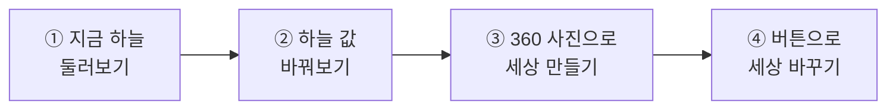
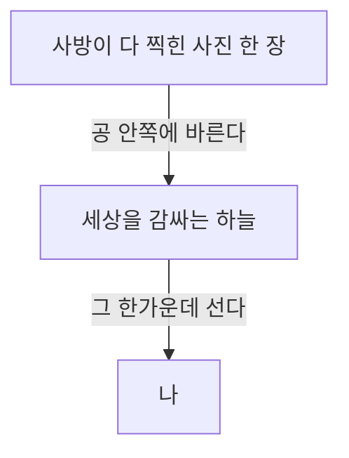
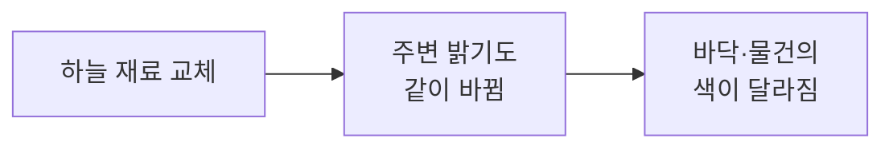
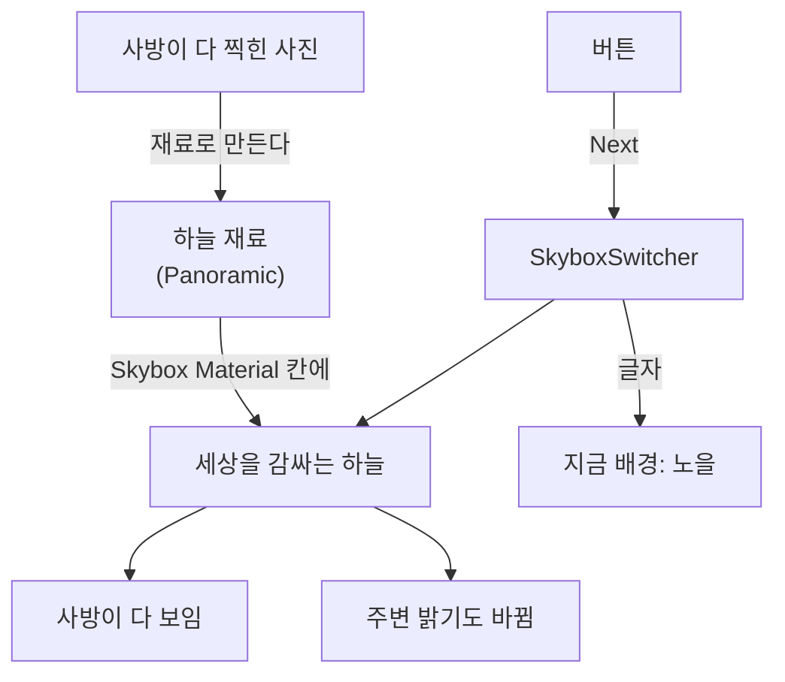

# **30차시. 360도 배경 안으로**

---

!!! info "이 자료는 이렇게 보세요"
    - **강의 영상과 함께 보는 자료**입니다. 영상을 따라가시면서 옆에 두고 보시면 됩니다.
    - 오늘도 **코드를 한 줄도 쓰지 않습니다.** 오늘 하실 일은 **재료 만들기, 목록에서 고르기, 끌어다 놓기**예요.
    - 오늘은 **사진 한 장으로 세상을 통째로 바꿉니다.** 결과가 가장 눈에 띄는 차시입니다.
    - **앞 차시를 안 하셨어도 괜찮습니다.** 강의자료의 **`30_시작`** 씬으로 바로 붙으실 수 있습니다.

---

## **오늘의 목표**

!!! quote "29차시와 오늘의 차이"
    29차시까지 우리가 걸어 다닌 곳은 **하얀 판 위**였습니다. 좀 허전했죠.
    오늘은 그 자리를 **진짜 풍경**으로 바꿉니다.

이번 차시가 끝나면 여러분의 VR은 이렇게 됩니다.

- **사방이 진짜 풍경인 공간**에 서 있게 됩니다
- 그 안을 **걸어 다닐 수 있습니다**
- **버튼 하나로 세상을 바꿀 수 있습니다**

---

## **1. 360도 배경이란 뭔가요**

**사방이 다 찍힌 사진 한 장**입니다.

보통 사진은 **앞만** 찍혀 있죠. 360 사진은 **위·아래·좌우·뒤까지 전부** 한 장에 들어 있습니다.

그 사진을 **공 안쪽에 발라놓고**, 우리가 그 공 한가운데 서는 겁니다.

!!! success "27차시에 이미 해보셨습니다"
    27차시에 **하늘(Skybox)** 을 목록에서 골라 바꾸셨죠.

    **완전히 같은 자리에, 다른 재료를 넣는 것**입니다.
    오늘은 그 재료를 **360 사진으로** 만들어봅니다. **확장판이에요.**

---

## **2. VR에서는 이게 왜 중요한가요**

일반 화면이라면 배경이 좀 허술해도 티가 잘 안 납니다. **화면 밖은 안 보이니까요.**

**VR은 다릅니다.** 고개를 돌리면 **어디든 보입니다.**

| | 일반 화면 | VR |
| :--- | :--- | :--- |
| 보이는 범위 | **화면 안쪽만** | **사방 전부** |
| 배경이 허술하면 | 잘 모릅니다 | **바로 들통납니다** |
| 뒤를 돌아보면 | 볼 수 없음 | **볼 수 있음** |

!!! success "그래서 VR에서 배경은 '분위기'가 아니라 '기본'입니다"
    일반 게임에서 배경은 **꾸미기**에 가깝습니다.
    **VR에서는 배경이 곧 그 세상 자체**예요. 사방이 다 배경이니까요.

!!! tip "직접 겪어보시면 압니다"
    실습 ③에서 배경을 바꾸는 순간, **같은 공간인데 완전히 다른 곳**처럼 느껴집니다.
    바닥도 그대로고 물건도 그대로인데요.

---

## **3. 한 가지 한계가 있습니다**

솔직하게 말씀드리는 게 좋겠습니다. **360 배경에는 분명한 한계가 있습니다.**

**다가갈 수 없습니다.**

배경 속 산이 멀리 보인다고 걸어가 보세요. **아무리 걸어도 가까워지지 않습니다.**
사진이니까요. 벽에 걸린 그림에 다가가는 것과 같습니다.

| | 360 배경 | 진짜로 만든 물건 |
| :--- | :--- | :--- |
| 만드는 비용 | **사진 한 장** | 오래 걸림 |
| 걸어가면 | **가까워지지 않음** | 가까워짐 |
| 손으로 만지면 | **통과함** | 만져짐 |

!!! note "그럼 못 쓰는 건가요"
    아닙니다. **아주 많이 씁니다.**

    - **멀리 있는 것**은 어차피 다가갈 일이 없습니다. 하늘·산·먼 건물
    - **가까이 있는 것**만 실제로 만들면 됩니다

    실제 VR 콘텐츠가 대부분 이렇게 만들어져 있어요. **멀리는 사진, 가까이는 물건.**

!!! success "그래서 오늘 이렇게 만듭니다"
    **배경은 360 사진**으로, **발밑 바닥과 손에 닿는 물건은 진짜로.**

    29차시에 만든 바닥을 **지우지 않는 이유**가 이겁니다.

---

## **4. 하늘이 바뀌면 밝기도 바뀝니다**

여기가 처음 보면 놀라는 부분입니다.

**배경을 노을 사진으로 바꾸면, 바닥에 놓인 물건들도 붉게 물듭니다.**

!!! success "왜 그럴까요"
    **실제로도 그렇기 때문입니다.**

    노을 질 때 주변이 붉어지죠. 흐린 날엔 전체가 회색빛이고요.
    Unity가 **하늘을 조명처럼 취급**해서 그렇습니다.

!!! note "27차시의 조명과 이어집니다"
    27차시에 **해 같은 빛(Directional Light)** 으로 분위기를 만드셨죠.
    오늘은 **하늘 자체가 조명 역할**을 합니다. 둘이 같이 작동해요.

---

## **5. 오늘 사용할 부품 — SkyboxSwitcher**

강의자료에 들어 있는 **`SkyboxSwitcher`** 를 씁니다. **배경을 버튼으로 갈아 끼우는 부품**이에요.

27차시에는 **Lighting 창에서 손으로** 갈아 끼우셨죠. 이 부품은 그걸 **버튼 하나로** 해줍니다.

### **5.1 조절할 수 있는 값**

| Inspector 항목 | 무슨 뜻인가요 | 어떻게 바꾸나요 |
| :--- | :--- | :--- |
| **Skyboxes** | 갈아 끼울 배경 목록 | **`+`** 로 칸을 늘리고 채웁니다 |
| ├ **Label** | 화면에 보여줄 이름 | 글자 입력 (예: `노을`) |
| └ **Material** | 씌울 하늘 재료 | **끌어다 놓기** |
| **Start Index** | 시작할 때 보여줄 번호 | 숫자 입력 (**맨 처음이 `0`**) |

### **5.2 버튼에 연결할 수 있는 동작**

| 동작 이름 | 무슨 일을 하나요 |
| :--- | :--- |
| **Next** | 다음 배경으로 (마지막이면 처음으로) |
| **Previous** | 이전 배경으로 |
| **Apply** | 번호로 바로 고르기 |

### **5.3 특별한 칸 하나**

| 항목 | 무슨 뜻인가요 |
| :--- | :--- |
| **On Skybox Changed** | **배경이 바뀌는 순간** 같이 실행할 동작을 연결하는 자리. **배경 이름을 글자로 넘겨줍니다** |

!!! success "26차시에서 보신 그 방식입니다"
    난이도 버튼이 **"난이도: 보통"** 이라고 글자를 넘겨줬죠.
    이것도 똑같이 **`Dynamic string`** 으로 연결하면 **"지금 배경: 노을"** 이 됩니다.

!!! note "`Label` 을 비워두면"
    **재료 이름이 그대로 나옵니다.** 파일 이름이라 좀 딱딱해요.
    한글로 적어두시면 화면에 예쁘게 나옵니다.

---

## **6. 실습 — 직접 해보세요**

!!! info "따라 하지 않으셔도 됩니다"
    28 · 29차시와 같습니다. **눈으로만 보셔도 31차시를 따라오실 수 있습니다.**

    | | |
    | :--- | :--- |
    | **직접 해보고 싶으시면** | 29차시에서 만든 씬을 열어주세요 |
    | **앞 차시를 안 하셨으면** | 강의자료의 **`30_시작`** 씬을 여시면 됩니다 |
    | **눈으로만 보셔도 됩니다** | 영상에서 강사가 하는 걸 보시면 충분합니다 |

!!! note "360 사진은 강의자료에 들어 있습니다"
    직접 구하실 필요 없습니다. **강의자료에 몇 장 넣어두었습니다.**
    마음에 드는 걸 직접 구해 쓰셔도 되지만, **오늘은 준비된 것으로** 하시면 됩니다.

**안 되셔도 괜찮습니다.** 오늘 실습은 **되돌리기 아주 쉬운 것들**뿐이에요.

---

### **실습 ① — 지금 하늘 둘러보기**

!!! abstract "목표"
    **바뀌기 전**을 눈에 담고, 하늘이 어디서 정해지는지 확인합니다.

1. 씬을 열고 **▶** 를 누른 뒤 **`Game` 창을 클릭**합니다.
2. **마우스로 사방을 둘러봅니다.** 위도 보고, 뒤도 돌아봅니다.
   → 지금은 **밋밋한 기본 하늘**입니다.
3. ▶ 를 끕니다.
4. `Window` → `Rendering` → **`Lighting`** 을 엽니다.
5. **`Environment`** 탭에서 **`Skybox Material`** 칸을 찾습니다.
   → **여기가 하늘이 정해지는 자리**입니다. 27차시에 만지셨던 그 칸이에요.

??? success "확인해보세요"
    - 뒤를 돌아봤을 때 **끝이 없었나요?**
      → 하늘은 **사방이 다 이어져** 있습니다. 그래서 끝이 안 보여요.
    - `Skybox Material` 칸을 찾으셨나요?
      → **오늘 이 칸 하나만 바꿉니다.** 그게 전부예요.

!!! warning "Lighting 창이 안 보인다면"
    창이 다른 탭 뒤에 숨어 있을 수 있습니다. **`Window` 메뉴에서 다시 열면** 앞으로 나옵니다.

---

### **실습 ② — 하늘 값 바꿔보기**

!!! abstract "목표"
    **재료의 숫자를 바꾸면** 분위기가 어떻게 달라지는지 봅니다.

1. **재료함(`Project`)** 에서 지금 쓰고 있는 **하늘 재료**를 고릅니다.
2. 조종석에서 값을 바꿔봅니다.
   - **`Exposure`**(밝기) 를 `0.5` → 어두워집니다
   - **`Exposure`** 를 `2` → 눈부시게 밝아집니다
   - **`Rotation`**(회전) 을 `180` → **해가 반대편으로** 갑니다
3. 바꿀 때마다 **작업대(`Scene`)** 를 봅니다. → **▶ 를 안 눌러도 바로 바뀝니다.**
4. 바닥에 놓인 물건의 **색도 같이 변하는지** 봅니다.

??? success "확인해보세요"
    - 하늘만 바꿨는데 **바닥 물건 색까지** 달라졌나요?
      → **하늘이 조명 역할**을 하고 있어서 그렇습니다.
    - `Rotation` 을 돌렸을 때 **그림자 방향**도 바뀌던가요?
      → 27차시의 조명과 **같이 작동**하고 있습니다.

!!! tip "마음껏 망가뜨리셔도 됩니다"
    이상해지면 항목 이름 위에서 **우클릭 → `Revert`** 로 되돌릴 수 있습니다.
    **재료는 씬이 아니라 재료함에 있어서**, 값이 ▶ 와 상관없이 그대로 남습니다.

---

### **실습 ③ — 360 사진으로 세상 만들기 (오늘의 핵심)**

!!! abstract "목표"
    **360 사진으로 하늘 재료를 만들어 씌우고**, 그 안을 걸어 다닙니다. 오늘의 결과물입니다.

#### **1단계 — 사진 준비하기**

1. **재료함**에서 강의자료의 **360 사진**을 하나 고릅니다.
2. 조종석에서 **`Texture Shape`** 를 **`2D`** 그대로 두고, 맨 아래 **`Apply`** 를 누릅니다.

    > 🟨 **U-9 결과로 확정** — 360 사진에 필요한 임포트 설정

#### **2단계 — 하늘 재료 만들기**

1. 재료함 빈 곳에서 **우클릭** → `Create` → **`Material`**
2. 이름을 **`Sky_노을`** 처럼 알아보기 쉽게 지어줍니다.
3. 만든 재료를 고르고, 조종석 **맨 위 목록**에서 **`Skybox`** → **`Panoramic`** 을 고릅니다.
   → **재료의 종류를 고르는 목록**입니다. 뜻은 몰라도 됩니다.

    !!! warning "`Skybox` 안에 네 가지가 있습니다"
        **`6 Sided` · `Cubemap` · `Panoramic` · `Procedural`** 이 나옵니다.
        **반드시 `Panoramic`** 을 고르세요. 다른 걸 고르면 사진이 제대로 안 감깁니다.

4. **360 사진을 넣는 칸**에 1단계의 사진을 **끌어다 놓습니다.**
   → 재료 종류를 `Panoramic` 으로 바꾸면 **큰 사진 칸이 하나** 생깁니다. 거기예요.

    > 🟨 **확인 필요** — 그 칸의 정확한 이름 (`Spherical (HDR)` 로 보일 것)

#### **3단계 — 씌우기**

1. `Window` → `Rendering` → **`Lighting`** → **`Environment`**
2. **`Skybox Material`** 칸에 **방금 만든 재료를 끌어다 놓습니다.**
   → **세상이 바뀝니다.**

#### **4단계 — 그 안을 걸어 다니기**

1. **▶** 를 누르고 **`Game` 창을 클릭**합니다.
2. **사방을 둘러봅니다.** 위도 보고 뒤도 돌아봅니다.
3. **걸어 다녀봅니다.** ← 29차시에 붙인 부품이 그대로 일합니다.
4. 배경 속 **멀리 있는 것을 향해 걸어가 봅니다.**
   → **가까워지지 않습니다.** 3절에서 말씀드린 그 한계예요.

??? success "완성되면"
    **같은 씬인데 완전히 다른 곳**이 되었습니다.

    바닥도 그대로고 물건도 그대로입니다. **바꾼 건 재료 하나**뿐이에요.
    **코드는 한 줄도 쓰지 않았습니다.**

    그리고 걸어 다니는 건 **29차시에 붙인 부품**이 그대로 하고 있습니다.
    **한 번 붙여둔 건 계속 일합니다.**

!!! warning "하늘이 이상하게 늘어나 보인다면"
    **`Panoramic` 을 안 고르신 경우**가 대부분입니다.

    재료 **맨 위 목록**을 다시 확인해주세요. 여기가 `Standard` 로 되어 있으면 사진이 제대로 안 감깁니다.

---

### **실습 ④ — 버튼으로 세상 바꾸기 (선택)**

!!! abstract "목표"
    **버튼 하나로 배경을 갈아 끼웁니다.** 19차시 버튼과 26차시 글자 표시를 한 번에 씁니다.

#### **1단계 — 배경 여러 개 준비**

1. 실습 ③의 2단계를 반복해서 **하늘 재료를 2~3개 더** 만듭니다.
   → 사진만 다른 것을 끌어다 놓으면 됩니다.

#### **2단계 — 부품 붙이기**

1. Hierarchy 우클릭 → `Create Empty` → 이름을 **`WorldManager`** 로
2. **`Add Component`** → **`SkyboxSwitcher`**
3. **`Skyboxes`** 옆 **`+`** 를 눌러 칸을 만들고, 각 칸에
   - **`Label`** 에 한글 이름 (예: `노을`)
   - **`Material`** 에 만든 하늘 재료를 **끌어다 놓기**
4. 만든 개수만큼 반복합니다.

#### **3단계 — 버튼 연결**

1. Hierarchy 우클릭 → `UI` → `Button - TextMeshPro`
2. 버튼의 **`On Click ()`** 에서 **`+`** 클릭
3. **`WorldManager`** 를 왼쪽 칸으로 **끌어다 놓기**
4. 목록에서 **`SkyboxSwitcher`** → **`Next`** 선택
5. 버튼 글자를 **"다음 배경"** 으로 바꿉니다
6. **▶** 를 누르고 버튼을 눌러봅니다 → **세상이 바뀝니다.**

#### **4단계 — 이름도 보이게 (여유가 되시면)**

1. `Text - TextMeshPro` 를 하나 놓습니다.
2. **`WorldManager`** 의 **`On Skybox Changed`** 에서 **`+`** 클릭
3. 방금 만든 글자를 끌어다 놓고, 목록에서 **`TextMeshProUGUI`** → **`text`**
   → ⚠️ **`Dynamic string`** 쪽을 고르세요
4. ▶ 를 누르고 버튼을 눌러봅니다 → **글자도 같이 바뀝니다.**

??? success "무슨 일이 일어났나요"
    **버튼 하나로 세상이 통째로 바뀌었습니다.**

    그런데 이거, **1차시에 버튼으로 큐브를 멈추신 것과 완전히 같은 일**입니다.
    `+` 누르고, 물건 끌어다 놓고, 목록에서 고르기. **하나도 안 변했어요.**

    그리고 **`Dynamic string`** — 26차시에 난이도 이름 표시할 때 쓰신 그 방식입니다.

!!! warning "버튼을 눌러도 안 바뀐다면"
    **`WorldManager` 를 왼쪽 칸에 끌어다 놓지 않으신 경우**가 대부분입니다.
    왼쪽이 `None` 으로 비어 있으면 오른쪽 목록에 아무것도 안 나옵니다. 1차시부터 같은 함정이에요.

---

## **7. 오늘 배운 것을 그림으로**

!!! success "이 그림 하나만 기억하셔도 오늘은 성공입니다"
    - **사진 한 장** → 재료로 만들어 → **하늘 칸에 넣으면** 세상이 됩니다
    - 하늘이 바뀌면 **주변 밝기도** 같이 바뀝니다
    - **멀리는 사진, 가까이는 진짜 물건.** 이게 VR을 만드는 방식입니다

---

## **8. 정리 문제**

맞히는 게 목적이 아닙니다. **오늘 내용이 머리에 남았는지 확인하는 용도**예요.
먼저 스스로 답을 떠올려보신 뒤에 정답을 펼쳐주세요.

### **문제 1**
**360 배경**은 어떻게 만들어지나요?

??? success "정답 보기"
    **사방이 다 찍힌 사진 한 장**을 **공 안쪽에 발라놓고**, 우리가 그 한가운데 서는 것입니다.

    27차시에 하늘을 목록에서 골라 바꾸셨죠. **같은 자리에 다른 재료**를 넣는 것뿐이에요.

### **문제 2**
일반 화면보다 **VR에서 배경이 훨씬 중요한** 이유는?

??? success "정답 보기"
    **VR은 고개를 돌리면 어디든 보이기 때문**입니다.

    일반 화면은 **화면 밖이 안 보이니까** 배경이 좀 허술해도 티가 안 납니다.
    VR은 **사방이 다 배경**이라 바로 들통납니다.

    그래서 VR에서 배경은 **꾸미기가 아니라 기본**입니다.

### **문제 3**
360 배경의 **한계**는 무엇인가요? 그럼 어떻게 만들어야 할까요?

??? success "정답 보기"
    **다가갈 수 없습니다.** 걸어가도 가까워지지 않고, 손으로 만지면 통과합니다. 사진이니까요.

    그래서 이렇게 만듭니다.

    > **멀리는 사진, 가까이는 진짜 물건.**

    멀리 있는 건 어차피 다가갈 일이 없고, **손에 닿는 것만** 실제로 만들면 됩니다.

### **문제 4**
배경을 노을 사진으로 바꿨더니 **바닥 물건까지 붉어졌습니다.** 왜일까요?

??? success "정답 보기"
    **Unity가 하늘을 조명처럼 취급**하기 때문입니다.

    실제로도 그렇죠. 노을 질 때 주변이 붉어지고, 흐린 날엔 전체가 회색빛입니다.

    27차시에 배운 **해 같은 빛(Directional Light)** 과 **같이 작동**합니다.

### **문제 5**
`SkyboxSwitcher` 의 **`On Skybox Changed`** 는 무엇을 넘겨주나요? 어디서 보던 방식인가요?

??? success "정답 보기"
    **배경 이름을 글자로** 넘겨줍니다.

    **26차시**에서 난이도 버튼이 **"난이도: 보통"** 이라고 글자를 넘겨줬죠. **같은 방식**입니다.
    TMP 의 `text` 에 **`Dynamic string`** 으로 연결하면 됩니다.

    !!! tip "이름이 파일 이름처럼 나온다면"
        **`Label`** 칸이 비어 있는 것입니다. 한글로 적어두시면 예쁘게 나옵니다.

---

## **9. 앞으로 조심할 것**

!!! warning "흔한 실수"
    - **재료 종류를 `Panoramic` 으로 안 바꾸기** → 사진이 이상하게 늘어납니다.
    - **배경 속 물건에 다가가려 하기** → 사진이라 안 가까워집니다. 한계입니다.
    - **버튼 왼쪽 칸을 비워두기** → 1차시부터 같은 함정입니다.

!!! tip "좋은 습관 하나"
    **하늘 재료 이름을 알아보기 쉽게 지으세요.**

    `New Material` 이 세 개 있으면 나중에 본인도 못 찾습니다.
    **`Sky_노을`**, **`Sky_밤하늘`** 처럼요. 15차시에 프리팹 이름 지을 때와 같은 이야기입니다.

---

## **10. 오늘의 정리**

!!! success "세 줄 요약"
    1. **사진 한 장으로 세상을 감쌉니다.** 27차시 하늘의 확장판이다.
    2. **VR에서 배경은 기본이다.** 사방이 다 보이니까.
    3. **멀리는 사진, 가까이는 진짜 물건.** 이게 VR을 만드는 방식이다.

여러분은 오늘 **사진 한 장으로 세상을 통째로 바꾸셨습니다.**
바꾼 건 **재료 하나**뿐이었어요. 충분히 잘하셨습니다.

---

## **11. 다음 차시 준비**

!!! example "31차시 — 손으로 잡고, 던지고"
    지금까지는 **보고 걸어 다니기만** 했습니다. 세상을 **구경**한 거죠.

    다음 시간부터는 그 세상을 **만집니다.**
    **물건을 집고, 던지고, 바닥을 가리켜 순간이동**합니다.

    29차시에 말씀드린 **멀미** 이야기가 다음 시간에 한 번 더 나옵니다.
    **순간이동이 그 대답**이거든요.

!!! note "미리 해두시면 좋은 것"
    - [ ] 오늘 만든 씬을 **저장** (`Ctrl + S`)
    - [ ] **바닥이 남아 있는지** 확인 — 다음 시간에 순간이동 바닥으로 씁니다
    - [ ] 배경은 **마음에 드는 것 하나**로 두기

    !!! tip "오늘 실습을 안 하셨다면"
        **괜찮습니다.** 31차시도 강사 화면을 보시는 것만으로 따라오실 수 있습니다.

---

## **부록 — 오늘 나온 용어 정리**

| 화면에 보이는 이름 | 우리말로 하면 |
| :--- | :--- |
| **360 이미지 · Panorama** | 사방이 다 찍힌 사진 |
| **Skybox** | 세상을 감싸는 하늘 |
| **Skybox Material** | 하늘 재료 |
| **Panoramic** | 360 사진용 재료 종류 |
| **Spherical (HDR)** | 360 사진을 넣는 칸 |
| **Lighting** | 조명 설정 창 |
| **Environment** | 하늘·주변 밝기 설정 |
| **Exposure** | 하늘 밝기 |
| **Rotation** | 하늘 회전 (해 위치) |
| **Environment Lighting** | 주변 밝기 |
| **Skyboxes** | 갈아 끼울 배경 목록 |
| **Label** | 화면에 보여줄 이름 |
| **Start Index** | 시작할 때 보여줄 번호 (맨 처음이 0) |
| **Next · Previous** | 다음 · 이전 배경으로 |
| **On Skybox Changed** | 배경이 바뀌었을 때 |
