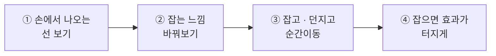
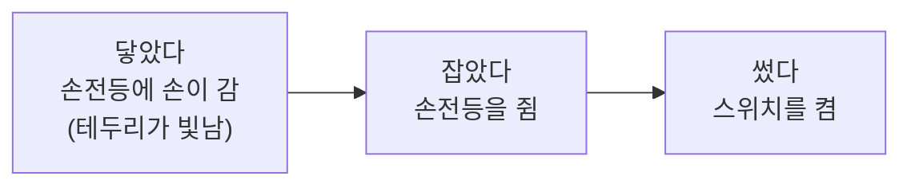
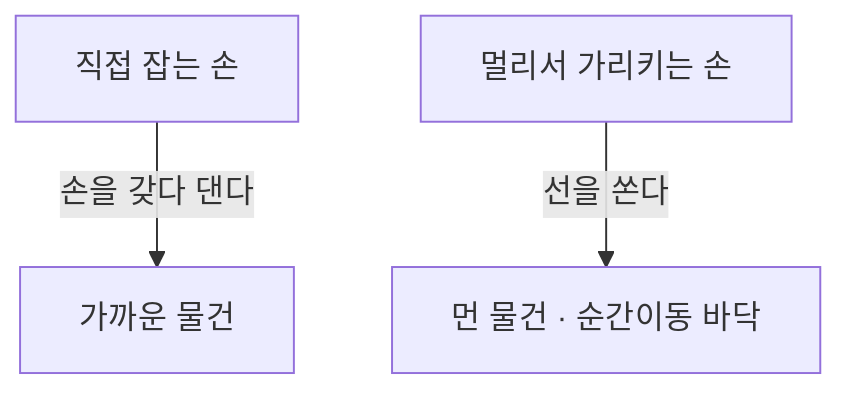
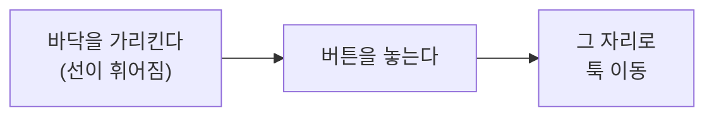
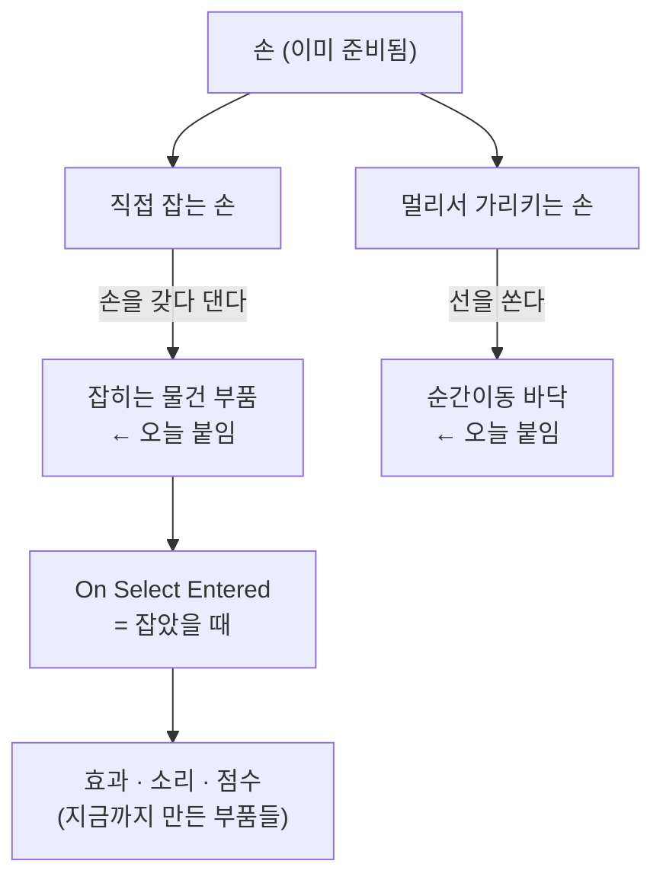

# **31차시. 손으로 잡고, 던지고, 순간이동**

---

!!! info "이 자료는 이렇게 보세요"
    - **강의 영상과 함께 보는 자료**입니다. 영상을 따라가시면서 옆에 두고 보시면 됩니다.
    - 오늘도 **코드를 한 줄도 쓰지 않습니다.** 오늘 하실 일은 **부품 붙이고, 이벤트 칸에 연결하기**예요.
    - 오늘은 **VR이 진짜 재미있어지는 날**입니다. 손으로 물건을 만지기 시작하거든요.
    - **앞 차시를 안 하셨어도 괜찮습니다.** 강의자료의 **`31_시작`** 씬으로 바로 붙으실 수 있습니다.

---

## **오늘의 목표**

!!! quote "30차시와 오늘의 차이"
    30차시까지는 **보고 걸어 다니기만** 했습니다. 세상을 **구경**한 거죠.
    오늘부터는 그 세상을 **만집니다.**

이번 차시가 끝나면 여러분의 VR은 이렇게 됩니다.

- **손으로 물건을 집을 수 있습니다**
- **집은 물건을 던질 수 있습니다**
- **바닥을 가리켜 순간이동할 수 있습니다**

---

## **1. VR에서 물건을 만지는 세 단계**

VR에서 무언가를 만질 때는 **항상 세 단계**를 거칩니다. 이름만 알아두시면 오늘이 쉬워집니다.

| 단계 | 우리말로 | 무슨 상황인가요 |
| :--- | :--- | :--- |
| **1** | **닿았다** | 손이 물건 **근처에 갔다** — 아직 안 잡음 |
| **2** | **잡았다** | 버튼을 눌러 **실제로 쥐었다** |
| **3** | **썼다** | 쥔 상태에서 **한 번 더** 눌렀다 |

### **손전등으로 생각해보세요**

!!! success "왜 세 단계로 나눴을까요"
    **잡는 것**과 **쓰는 것**이 다르기 때문입니다.

    총을 **쥐는 것**과 **쏘는 것**은 다른 동작이죠. 문을 **잡는 것**과 **여는 것**도 그렇고요.
    그래서 나눠뒀습니다.

!!! note "오늘은 앞의 두 개만 씁니다"
    **닿았다 · 잡았다** 까지만 다룹니다.
    **썼다**는 **32차시에서 총을 쏠 때** 씁니다. 이름만 기억해두세요.

---

## **2. 잡는 쪽과 잡히는 쪽**

물건을 잡으려면 **양쪽 다** 준비가 되어 있어야 합니다.

| | 이름 | 어디에 붙나요 |
| :--- | :--- | :--- |
| **잡는 쪽** | **잡는 손** | 손(Controller)에 — **이미 붙어 있습니다** |
| **잡히는 쪽** | **잡히는 물건 부품** | 잡고 싶은 물건에 — **오늘 우리가 붙입니다** |

!!! success "오늘 할 일은 이 한 줄입니다"
    **손은 이미 준비돼 있습니다. 우리는 '잡히는 쪽'만 만들면 됩니다.**

    28차시에 XR Origin 을 놓을 때 **손에 필요한 건 다 같이 딸려 왔습니다.**

!!! warning "한쪽만 있으면 안 잡힙니다"
    잡히는 물건 부품을 안 붙였는데 손을 대면 → **그냥 통과합니다.**
    오늘 "안 잡혀요" 의 **대부분이 이 경우**입니다.

---

## **3. 잡는 방법은 두 가지입니다**

손이 물건을 잡는 방식이 두 가지 있습니다. **거리**가 다릅니다.

| 방식 | 어떻게 | 이럴 때 씁니다 |
| :--- | :--- | :--- |
| **직접 잡는 손** | 손을 **물건에 갖다 대고** 쥡니다 | 가까운 물건 — **오늘의 기본** |
| **멀리서 가리키는 손** | **선(레이저)** 을 쏴서 가리키고 쥡니다 | 먼 물건 · 화면 버튼 · **순간이동** |

!!! note "손에서 선이 나오는 걸 보셨을 겁니다"
    28 · 29차시에 ▶ 를 누르면 **손에서 얇은 선**이 나왔죠.
    그게 **멀리서 가리키는 손**입니다. 이미 붙어 있었어요.

    오늘 그 선을 **순간이동에 씁니다.**

---

## **4. 순간이동 — 왜 걷기 대신 쓰나요**

29차시에 **멀미** 이야기를 했습니다. **걷는 게 멀미를 만든다**고요.

**순간이동은 그 대답입니다.** 중간 과정이 아예 없으니까요.

| | 걷기 | 순간이동 |
| :--- | :--- | :--- |
| **이동** | 스르륵 미끄러짐 | **툭 하고 도착** |
| **멀미** | 있음 | **거의 없음** |
| **느낌** | 자연스러움 | 게임 같음 |

### **어떻게 동작하나요**

!!! success "핵심은 '바닥에 표시를 붙이는 것' 입니다"
    아무 데나 갈 수 있으면 벽 속으로도 들어가겠죠.

    그래서 **"여기는 갈 수 있는 바닥이다"** 라고 **표시를 붙여둡니다.**
    표시가 붙은 곳만 갈 수 있어요. **21차시의 이름표(Tag)와 비슷한 발상**입니다.

---

## **5. 잡으면 무슨 일이 일어나게 — 이벤트 칸**

여기가 오늘 가장 반가운 부분입니다.

**잡히는 물건 부품**에는 **이벤트 칸**이 있습니다. 그런데 이거…

!!! success "1차시부터 계속 보던 그 칸입니다"
    | 어디서 봤나요 | 칸 이름 |
    | :--- | :--- |
    | 1 · 19차시 버튼 | `On Click` — **눌렸을 때** |
    | 21차시 부딪힘 | `On Trigger Enter` — **닿았을 때** |
    | 25차시 명중 | `On Hit` — **맞았을 때** |
    | **31차시 VR** | **`On Select Entered` — 잡았을 때** |

    **생긴 것도 똑같고, 쓰는 법도 똑같습니다.**
    `+` 누르고, 물건 끌어다 놓고, 목록에서 고르기. **끝입니다.**

| 이벤트 칸 | 언제 실행되나요 |
| :--- | :--- |
| **On Hover Entered** | 손이 **닿았을 때** |
| **On Select Entered** | **잡았을 때** |
| **On Select Exited** | **놓았을 때** |

!!! tip "여기에 뭘 연결하면 좋을까요"
    - 잡으면 **소리**가 나게 (27차시 방식)
    - 잡으면 **효과가 터지게** (25차시의 `FeedbackSpawner`)
    - 놓으면 **점수가 오르게** (25차시의 `HitScorer`)

    **지금까지 만든 부품을 그대로 붙일 수 있습니다.** 실습 ④에서 해봅니다.

---

## **6. 오늘 만질 것 정리**

### **6.1 붙이는 부품**

| 부품 | 어디에 | 하는 일 |
| :--- | :--- | :--- |
| **잡히는 물건 부품** (XR Grab Interactable) | 잡고 싶은 물건 | 손에 잡히게 만듭니다 |
| **순간이동 바닥** (Teleportation Area) | 바닥 | 여기로 갈 수 있다고 표시합니다 |

> 🟨 **U-9 결과로 확정** — 부품의 정확한 이름과 목록에서의 표기

### **6.2 조절할 수 있는 값**

| 항목 | 무슨 뜻인가요 | 어떻게 바꾸나요 |
| :--- | :--- | :--- |
| **Movement Type** | 잡았을 때 따라오는 방식 | 목록에서 고르기 |
| **Throw On Detach** | 놓을 때 **던져질지** | 체크 켜고 끄기 |
| **Throw Velocity Scale** | 던지는 세기 | 숫자 입력 (클수록 멀리) |
| **Attach Transform** | 잡았을 때 **손의 어디에** 붙을지 | 빈 그릇 끌어다 놓기 |

> 🟨 **U-9 결과로 확정** — 항목 이름 표기

### **6.3 이벤트 칸**

| 항목 | 무슨 뜻인가요 |
| :--- | :--- |
| **On Select Entered** | **잡는 순간** 같이 실행할 동작을 연결하는 자리 |
| **On Select Exited** | **놓는 순간** 같이 실행할 동작을 연결하는 자리 |

!!! warning "이 표가 복잡해 보이셔도"
    **지금은 몰라도 됩니다.** 오늘 실제로 만지는 건 **세 개**뿐이에요.
    부품 두 개 붙이고, 이벤트 칸 하나 연결하면 끝입니다.

---

## **7. 실습 — 직접 해보세요**

!!! info "따라 하지 않으셔도 됩니다"
    28 ~ 30차시와 같습니다. **눈으로만 보셔도 32차시를 따라오실 수 있습니다.**

    | | |
    | :--- | :--- |
    | **직접 해보고 싶으시면** | 30차시에서 만든 씬을 열어주세요 |
    | **앞 차시를 안 하셨으면** | 강의자료의 **`31_시작`** 씬을 여시면 됩니다 |
    | **눈으로만 보셔도 됩니다** | 영상에서 강사가 하는 걸 보시면 충분합니다 |

    실제 고글에서 물건을 잡는 화면은 **별도 영상**으로 따로 보여드립니다.

**안 되셔도 괜찮습니다.** 오늘은 **부품을 붙였다 뗐다** 하는 게 전부라 되돌리기 쉽습니다.

---

### **실습 ① — 손에서 나오는 선 보기**

!!! abstract "목표"
    **이미 준비돼 있는 것**을 눈으로 확인합니다. 만드는 것은 없습니다.

1. 씬을 열고 **▶** 를 누른 뒤 **`Game`(미리보기) 창을 클릭**합니다.
2. **`Space`를 누른 채로** 마우스를 움직여 **오른손**을 이리저리 움직여봅니다.
3. 손에서 **얇은 선**이 나오는지 봅니다.
4. 그 선을 **바닥에 대봅니다.** → 아직 아무 일도 안 일어납니다.
5. 씬에 놓인 **아무 물건에나 손을 갖다 대봅니다.** → **그냥 통과합니다.**

??? success "확인해보세요"
    - 손에서 **선이 나왔나요?**
      → 그게 **멀리서 가리키는 손**입니다. **이미 붙어 있었습니다.**
    - 물건에 손을 댔는데 **아무 일도 안 일어났나요?**
      → 맞습니다. **잡히는 쪽이 준비가 안 됐기** 때문이에요. 그걸 실습 ③에서 만듭니다.

!!! warning "선이 안 보인다면"
    **▶ 를 안 누르셨거나, 미리보기 창을 클릭 안 하신 경우**입니다.
    28차시부터 계속 나온 그 습관이에요. **▶ 누르고 미리보기 창 한 번 클릭.**

---

### **실습 ② — 잡는 느낌 미리 만져보기**

!!! abstract "목표"
    **잡히는 물건 부품**을 하나 붙여보고, **값 두 개**를 바꿔봅니다.

1. ▶ 를 **끕니다.**
2. Hierarchy 우클릭 → `3D Object` → **`Cube`** 를 하나 놓습니다.
3. 크기를 **`0.2, 0.2, 0.2`** 정도로 줄입니다. → 손에 들 만한 크기예요.
4. 위치를 **손이 닿을 만한 곳**으로 옮깁니다. (눈앞 1m 정도)
5. **`Add Component`** → **잡히는 물건 부품**을 붙입니다.
   → **`Rigidbody`가 같이 생깁니다.** 놀라지 마세요. **잡으려면 필요한 부품**입니다.
6. **`Throw Velocity Scale`** 값을 봅니다. 기본값 그대로 두세요.

??? success "확인해보세요"
    - 부품을 붙였더니 **`Rigidbody`가 같이 생겼나요?**
      → **21차시의 그 떨어지는 부품**입니다. 잡고 던지려면 물리가 필요하거든요.
    - 조종석을 아래로 내려보면 **이벤트 칸들**이 보이나요?
      → 버튼의 `On Click`과 **똑같이 생겼죠.** 실습 ④에서 씁니다.

!!! danger "▶ 를 누른 상태에서 붙인 부품은 사라집니다"
    **실행 중에 붙인 부품은 ▶ 를 끄면 없어집니다.**
    값뿐 아니라 **부품 자체가** 사라져요. **반드시 ▶ 를 끄고** 붙이세요.

!!! tip "마음껏 망가뜨리셔도 됩니다"
    부품은 **이름 위에서 우클릭 → `Remove Component`** 로 언제든 뗄 수 있습니다.

---

### **실습 ③ — 잡고, 던지고, 순간이동 (오늘의 핵심)**

!!! abstract "목표"
    **물건을 집어서 던지고, 바닥을 가리켜 이동**할 수 있게 만듭니다. 오늘의 결과물입니다.

#### **1단계 — 잡아보기**

1. **▶** 를 누르고 미리보기 창을 클릭합니다.
2. **`Space`를 누른 채로** 오른손을 **큐브 쪽으로** 가져갑니다.
3. 손이 큐브에 닿으면 **잡는 키를 누릅니다.**

    > 🟨 **U-9 결과로 확정** — Simulator에서 '잡기' 에 배정된 키

4. **큐브가 손에 붙어 따라옵니다.**

#### **2단계 — 던지기**

1. 잡은 상태에서 **손을 크게 휘두르면서** 잡는 키를 **놓습니다.**
2. **큐브가 날아갑니다.**
3. ▶ 를 끄고 **`Throw Velocity Scale`** 을 크게 올린 뒤 다시 해봅니다.
   → **훨씬 멀리 날아갑니다.**

!!! note "던져지지 않고 툭 떨어진다면"
    **`Throw On Detach`** 체크가 꺼져 있는지 보세요. 켜져 있어야 던져집니다.

#### **3단계 — 순간이동 바닥 만들기**

1. ▶ 를 **끕니다.**
2. Hierarchy에서 **바닥(`Plane`)** 을 고릅니다.
3. **`Add Component`** → **순간이동 바닥 부품**을 붙입니다.

    > 🟨 **U-9 결과로 확정** — 부품 이름과 추가로 필요한 설정

4. **▶** 를 누르고, 손에서 나오는 **선을 바닥에 대봅니다.**
   → **선이 휘어지면서 도착 지점이 표시됩니다.**
5. **버튼을 놓으면** 그 자리로 **툭 이동합니다.**

??? success "완성되면"
    **물건을 집어 던지고, 바닥을 가리켜 이동할 수 있습니다.**

    오늘 하신 게 뭐죠? **부품 두 개를 붙였습니다.**
    잡히는 물건에 하나, 바닥에 하나. **코드는 한 줄도 쓰지 않았습니다.**

    그리고 30차시까지는 **구경만** 했는데, 오늘부터 **만집니다.**
    VR이 재미있어지는 지점이 여기예요.

!!! warning "물건이 안 잡힌다면"
    **잡히는 물건 부품을 안 붙이신 경우**가 대부분입니다.

    손은 이미 준비돼 있습니다. **잡히는 쪽**을 확인해주세요.
    조종석에 **잡히는 물건 부품이 보이는지** 봐주시면 됩니다.

---

### **실습 ④ — 잡으면 효과가 터지게 (선택)**

!!! abstract "목표"
    **잡는 순간 다른 일도 같이** 일어나게 만듭니다. 1차시부터 해오던 그 연결이에요.

1. ▶ 를 끄고 **큐브**를 고릅니다.
2. **`Add Component`** → **`FeedbackSpawner`** 를 붙입니다. ← **25차시에 쓰던 그 부품**
3. **`Effect Prefab`** 칸에 **`HitEffect`** 프리팹을 끌어다 놓습니다.
4. 조종석을 아래로 내려 **`On Select Entered`** 칸을 찾습니다.
5. **`+`** 클릭 → **큐브를 끌어다 놓기** → 목록에서 **`FeedbackSpawner`** → **`Spawn`** 선택
6. **▶** 를 누르고 큐브를 **잡아봅니다.** → **잡는 순간 효과가 터집니다.**

??? success "무슨 일이 일어났나요"
    **잡기만 했는데 효과도 같이 터졌습니다.**

    이거, 1차시에 **"멈추면 색도 바뀌게"** 하신 것과 **완전히 같은 일**입니다.
    19차시 버튼도, 21차시 부딪힘도, 25차시 명중도 전부 같은 구조였고요.

    | 차시 | 칸 이름 |
    | :---: | :--- |
    | 1 · 19 | `On Click` |
    | 21 | `On Trigger Enter` |
    | 25 | `On Hit` |
    | **31** | **`On Select Entered`** |

    **이름만 다르지 하는 일은 똑같습니다.** VR이라고 새로 배울 게 없었어요.

!!! tip "여유가 되시면"
    **`On Select Exited`**(놓았을 때)에도 하나 연결해보세요.
    잡을 때와 놓을 때 **다른 일**이 일어나게 할 수 있습니다.

---

## **8. 오늘 배운 것을 그림으로**

!!! success "이 그림 하나만 기억하셔도 오늘은 성공입니다"
    - **손은 이미 준비돼 있습니다.** 우리는 **잡히는 쪽**만 만듭니다
    - 가까우면 **직접**, 멀면 **선으로**
    - **잡았을 때** 칸은 **버튼의 `On Click`과 똑같습니다**

---

## **9. 정리 문제**

맞히는 게 목적이 아닙니다. **오늘 내용이 머리에 남았는지 확인하는 용도**예요.
먼저 스스로 답을 떠올려보신 뒤에 정답을 펼쳐주세요.

### **문제 1**
VR에서 물건을 만질 때 거치는 **세 단계**는 무엇인가요?

??? success "정답 보기"
    **닿았다 → 잡았다 → 썼다**

    - **닿았다**: 손이 근처에 갔다 (아직 안 잡음)
    - **잡았다**: 버튼을 눌러 실제로 쥐었다
    - **썼다**: 쥔 상태에서 한 번 더 눌렀다

    **손전등**으로 생각하시면 쉽습니다. 손이 가고 → 쥐고 → 스위치를 켭니다.

    !!! note "'썼다' 는 오늘 안 썼습니다"
        **32차시에서 총을 쏠 때** 씁니다.

### **문제 2**
물건에 손을 댔는데 **통과해버립니다.** 무엇이 빠진 걸까요?

??? success "정답 보기"
    **잡히는 물건 부품**이 안 붙어 있는 것입니다.

    잡으려면 **양쪽 다** 준비가 돼야 합니다.
    - **잡는 손** → 이미 준비돼 있습니다 (28차시에 같이 딸려 왔음)
    - **잡히는 물건 부품** → **우리가 붙여야 합니다**

    "안 잡혀요" 의 **대부분이 이 경우**입니다.

### **문제 3**
**순간이동**은 왜 만들어졌을까요? 어떤 방식과 비교되나요?

??? success "정답 보기"
    **멀미를 줄이기 위해서**입니다. **걷기**와 비교됩니다.

    걷기는 **스르륵 미끄러지는 중간 과정**이 있어서 멀미를 만듭니다.
    순간이동은 그 과정이 **아예 없습니다.** 툭 하고 도착하죠.

    29차시의 **딱딱 끊어 돌기**와 **같은 발상**입니다. 중간을 없애는 거예요.

### **문제 4**
아무 데나 순간이동하면 벽 속으로도 들어가겠죠. 어떻게 막나요?

??? success "정답 보기"
    **갈 수 있는 바닥에 표시를 붙여둡니다.** (순간이동 바닥 부품)

    표시가 붙은 곳만 갈 수 있습니다.
    **21차시의 이름표(Tag)와 비슷한 발상**이에요. 대상을 미리 정해두는 겁니다.

### **문제 5**
**`On Select Entered`** 칸은 지금까지 어떤 칸들과 같은 것인가요?

??? success "정답 보기"
    **버튼의 `On Click`과 똑같습니다.** 이름만 다릅니다.

    | 차시 | 칸 이름 | 언제 |
    | :---: | :--- | :--- |
    | 1 · 19 | `On Click` | 눌렸을 때 |
    | 21 | `On Trigger Enter` | 닿았을 때 |
    | 25 | `On Hit` | 맞았을 때 |
    | **31** | **`On Select Entered`** | **잡았을 때** |

    쓰는 법도 같습니다. **`+` 누르고, 물건 끌어다 놓고, 목록에서 고르기.**

    !!! tip "이게 오늘의 진짜 결론입니다"
        **VR이라고 새로 배울 게 없었습니다.** 1차시에 배운 걸 그대로 쓰고 있어요.

---

## **10. 앞으로 조심할 것**

!!! warning "흔한 실수"
    - **잡히는 물건 부품을 안 붙이고 "안 잡혀요"** → 잡히는 쪽을 확인하세요.
    - **▶ 를 켠 채로 부품 붙이기** → 끄면 **부품 자체가** 사라집니다.
    - **큰 물건에 잡히는 부품 붙이기** → 손에 들 만한 크기로 줄이세요. 집이 손에 붙으면 이상합니다.

!!! tip "좋은 습관 하나"
    **잡히는 물건은 작게 만드세요.**

    손에 드는 물건은 **20~30cm** 정도가 자연스럽습니다.
    32차시에서 총을 만들 때도 같은 기준으로 갑니다.

---

## **11. 오늘의 정리**

!!! success "세 줄 요약"
    1. VR에서 만지는 건 **닿았다 → 잡았다 → 썼다** 세 단계다.
    2. **손은 이미 준비돼 있다.** 우리는 **잡히는 쪽**만 만든다.
    3. **잡았을 때 칸은 버튼의 `On Click`과 똑같다.** 새로 배울 게 없었다.

여러분은 오늘 **VR 세상을 만지기 시작하셨습니다.**
붙인 부품은 **두 개**뿐이고, 나머지는 **1차시부터 해오던 연결**이었어요. 충분히 잘하셨습니다.

---

## **12. 다음 차시 준비**

!!! example "32차시 — VR로 클레이 사격"
    이제 재료가 다 모였습니다.

    **22 ~ 27차시에 만든 클레이 사격**, 기억하시죠?
    다음 시간에는 그걸 **VR로 옮깁니다.** 새로 만드는 게 아니라 **옮기는 것**이에요.

    오늘 배운 **"잡았다"** 로 총을 쥐고, 오늘 안 쓴 **"썼다"** 로 방아쇠를 당깁니다.

!!! note "미리 해두시면 좋은 것"
    - [ ] 오늘 만든 씬을 **저장** (`Ctrl + S`)
    - [ ] **27차시 완성 씬(`27_완성`)이 남아 있는지** 확인 ← **다음 시간에 씁니다**
    - [ ] 없거나 지우셨다면 강의자료의 **`32_시작`** 씬을 받아두기

    !!! tip "오늘 실습을 안 하셨다면"
        **괜찮습니다.** 32차시도 강사 화면을 보시는 것만으로 따라오실 수 있습니다.

---

## **부록 — 오늘 나온 용어 정리**

| 화면에 보이는 이름 | 우리말로 하면 |
| :--- | :--- |
| **Interactor** | 잡는 손 |
| **Interactable** | 잡히는 물건 |
| **Hover** | 닿음 |
| **Select** | 잡음 |
| **Activate** | 씀 (잡은 뒤 한 번 더) |
| **XR Direct Interactor** | 직접 잡는 손 |
| **XR Ray Interactor** | 멀리서 가리키는 손 |
| **XR Grab Interactable** | 잡히는 물건 부품 |
| **Teleportation Area** | 순간이동 바닥 |
| **Movement Type** | 잡았을 때 따라오는 방식 |
| **Throw On Detach** | 놓을 때 던져질지 |
| **Throw Velocity Scale** | 던지는 세기 |
| **Attach Transform** | 손의 어디에 붙을지 |
| **On Hover Entered** | 닿았을 때 |
| **On Select Entered** | 잡았을 때 |
| **On Select Exited** | 놓았을 때 |
