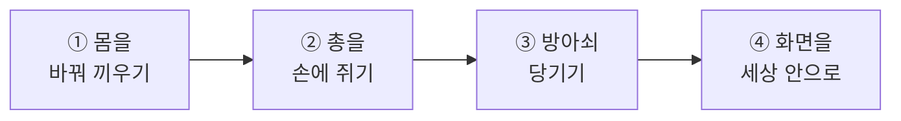
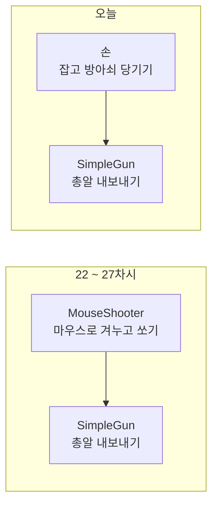
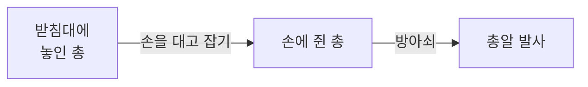
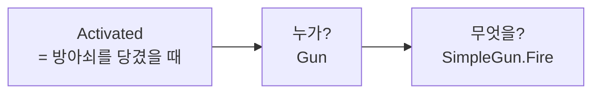
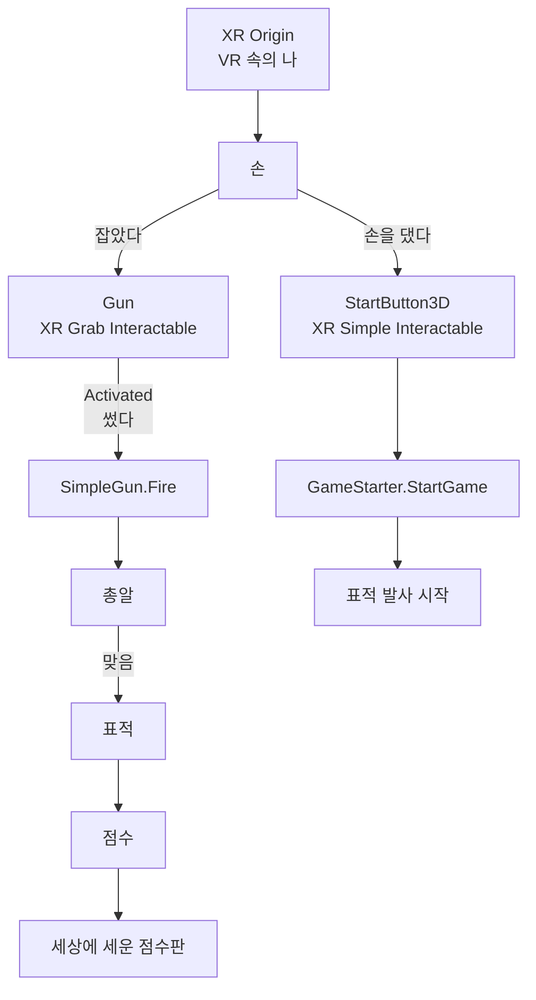

# **32차시. VR로 총을 잡고 쏘기**
---

> ℹ️ **이 자료는 이렇게 보세요**
>
> - **강의 영상과 함께 보는 자료**입니다. 영상을 따라가시면서 옆에 두고 보시면 됩니다.
> - 이번 차시에도 **코드를 한 줄도 쓰지 않습니다.**
> - 오늘 하실 일은 **지우기, 끌어다 놓기, 부품 하나 떼기, 이벤트 하나 연결하기**입니다.
> - **22 ~ 27차시에 만든 클레이 사격**을 씁니다. 새로 만드는 게 아니라 **옮기는 것**이에요.

---

## **오늘의 목표**

이번 차시가 끝나면 여러분은 **코드 없이** 이런 것을 만드시게 됩니다.

- VR 사격장 안에 **직접 서 있기**
- **손을 뻗어 총을 집어 들기**
- **방아쇠를 당겨 표적 맞히기**
- 점수판을 **세상 안에** 세우기



> 🎮 **오늘 쓰는 조작 (고글 흉내 부품)**
>
> | 하고 싶은 것 | 키 |
> | :--- | :--- |
> | 오른손 고르기 | **`]`** |
> | 잡기 | **`G`** 를 누른 채로 |
> | **쏘기** | 잡은 채로 **`T`** |
> | 순간이동 | **`I`** 를 누른 채 바닥을 겨누고 떼기 |
> | 조작 안내 펼치기 | **`X`** |

> 💬 **31차시와 오늘의 차이**
>
> 31차시에는 **큐브를 잡고 던졌습니다.** 연습이었죠.
> 오늘은 **총을 잡고 쏩니다.** 여섯 차시 동안 만든 그 게임을요.

---

## **1. 오늘은 만드는 날이 아니라 옮기는 날입니다**

22 ~ 27차시에 게임을 하나 완성하셨습니다. 그런데 그건 **화면으로 하는 게임**이었어요.

오늘은 그걸 **VR로 옮깁니다.**

| | 27차시까지 | **오늘부터** |
| :--- | :--- | :--- |
| **몸** | 캡슐 하나가 걸어 다님 | **VR 속의 나** |
| **시야** | 마우스로 돌림 | **고개를 돌림** |
| **총** | 눈에 붙어 다님 | **손으로 집어 듦** |
| **조준** | 화면 십자선 | **총구가 향한 쪽** |
| **발사** | 마우스 클릭 | **방아쇠** |

> ✅ **게임 자체는 하나도 안 건드립니다**
>
> 표적이 날아오는 것, 맞으면 터지는 것, 점수가 오르는 것, 시간이 흐르는 것.
> **전부 그대로 씁니다.**
>
> 바꾸는 건 **«사람이 어떻게 조작하느냐»** 뿐이에요.

---

## **2. 24차시에 미리 나눠둔 것이 오늘 값을 합니다**

24차시에 총을 만들 때, 부품을 **둘로 나눠서** 붙이셨습니다. 기억나세요?

| 부품 | 하는 일 |
| :--- | :--- |
| **`SimpleGun`** | 총알을 만들어 **총구가 향한 쪽으로** 내보낸다 |
| **`MouseShooter`** | 총을 **십자선 쪽으로 돌려놓고**, 마우스를 누르면 쏘라고 시킨다 |

그때 이렇게 말씀드렸죠 — *"32차시에서 이 총을 VR로 옮길 때, **떼어낸 그 자리에 손이 들어옵니다.**"*



> ✅ **오늘 총에 하는 일은 두 가지뿐입니다**
>
> **`MouseShooter` 를 뗀다. 그 자리에 손을 연결한다.**
>
> 총알을 만드는 부품(`SimpleGun`)은 **손도 안 댑니다.**
> 부품 하나가 일 하나만 하게 나눠뒀기 때문이에요.

---

## **3. 십자선이 사라집니다**

VR에는 **화면 한가운데**라는 게 없습니다. 고개를 돌리면 세상이 통째로 움직이니까요.

그래서 **십자선을 씁니다.** 대신 **총구가 곧 조준선**입니다.

| | 화면 게임 | **VR** |
| :--- | :--- | :--- |
| 어디를 겨누나 | 화면 한가운데 | **총구가 향한 쪽** |
| 총을 어떻게 겨누나 | 부품이 알아서 돌려놓음 | **손으로 직접 겨눔** |

> ✅ **이게 VR이 재미있는 이유입니다**
>
> 화면 게임에서는 **마우스를 움직이면 총이 알아서** 그쪽을 봤습니다.
>
> VR에서는 **손을 움직여야** 총이 그쪽을 봅니다. **진짜 총처럼요.**
> 처음엔 잘 안 맞습니다. **그게 정상이고, 그래서 재미있습니다.**

---

## **4. 화면에 붙은 것은 고글에서 안 보입니다**

여기가 오늘 **가장 손이 많이 가는 부분**입니다.

25 ~ 27차시에 만든 점수판·시간·시작 화면은 전부 **화면에 붙여둔 것**이었습니다.
17차시에 배운 **압정(앵커)** 으로 화면 구석에 못 박아뒀죠.

그런데 **고글에는 «화면 구석» 이 없습니다.**

| | |
| :--- | :--- |
| **화면 게임** | 화면 오른쪽 위 = 늘 같은 자리 |
| **VR** | 고개를 돌리면 **오른쪽 위가 어디죠?** |

> 🚨 **고글 흉내 부품에서는 보입니다. 진짜 고글에서는 안 보입니다**
>
> 30차시까지는 **미리보기 창**으로 확인했기 때문에 버튼이 보였습니다.
>
> 그런데 **실제 고글에서는 안 나옵니다.**
> «화면에 덧대는 방식» 은 고글에 그려지지 않거든요.

### **그래서 세상 안에 세웁니다**

| 방법 | 어떻게 |
| :--- | :--- |
| **판을 세상에 세운다** | 점수판을 **옆에 게시판으로 세웁니다.** 고개를 돌리면 보이고, 앞을 보면 안 보입니다 |
| **버튼을 물건으로 만든다** | 시작 버튼을 **손으로 누를 수 있는 물건**으로 만듭니다 |

> ✅ **이게 VR에서 더 자연스럽습니다**
>
> 눈앞에 판이 계속 떠 있으면 **어지럽습니다.**
>
> 실제 사격장에도 점수판은 **벽에 걸려** 있죠. 눈앞에 떠 있지 않고요.
> **세상 안에 놓는 게 VR의 방식**입니다.

---

## **5. 총을 «집는다» 는 것**

31차시에 큐브를 잡아보셨습니다. 총도 똑같습니다.



> ⚠️ **잡히려면 «잡힐 몸» 이 있어야 합니다**
>
> 24차시에 총을 만들면서 **부딪히는 부품을 지웠습니다.** 총알이 총에 맞아 사라졌으니까요.
>
> 그런데 **잡으려면 그게 있어야 합니다.** 손이 «여기 물건이 있다» 를 알아야 하거든요.
>
> 그래서 오늘 **손잡이 쪽에만** 다시 붙입니다. **총구 앞으로는 안 뻗게** 해서
> 총알이 걸리지 않게 하면 됩니다.

---

## **6. 오늘 만질 것 정리**

**새로 받으실 부품은 없습니다.** 31차시까지 쓰던 것에 하나만 더 씁니다.

| 부품 | 어디에 | 하는 일 |
| :--- | :--- | :--- |
| **`XR Grab Interactable`** | 총 | **잡히게** 합니다 (31차시의 그것) |
| **`XR Simple Interactable`** | 시작 버튼 물건 | **잡히진 않고 «눌리게»** 합니다 |

### **`XR Grab Interactable` 에서 오늘 볼 칸**

| 항목 | 무슨 뜻인가요 |
| :--- | :--- |
| **Select Mode** | **한 손으로만** 잡을지, 두 손으로도 잡을지 |
| **Activated** | **방아쇠를 당겼을 때** ← **오늘의 핵심** |

> 📝 **«잡았다» 와 «썼다» 는 다릅니다**
>
> 31차시에 잠깐 나왔던 이야기입니다.
>
> | 이벤트 칸 | 언제 |
> | :--- | :--- |
> | **Select Entered** (잡았다) | 물건을 **쥐는 순간** |
> | **Activated** (썼다) | 쥔 채로 **방아쇠를 당기는 순간** |
>
> 총은 **쥐는 것과 쏘는 것이 다른 동작**이니, 칸도 둘로 나뉘어 있습니다.

### **`XR Simple Interactable` 은 왜 따로 있나요**

| | `XR Grab Interactable` | `XR Simple Interactable` |
| :--- | :--- | :--- |
| 손에 **딸려오나** | **네** (집어 듭니다) | **아니오** (제자리에 있습니다) |
| 어디에 쓰나 | 총 · 물건 | **버튼 · 손잡이 · 레버** |

시작 버튼이 손에 딸려오면 곤란하겠죠. 그래서 **«눌리기만 하는»** 쪽을 씁니다.

---

## **7. 실습 — 직접 해보세요**

> ℹ️ **따라 하지 않으셔도 됩니다**
>
> 28 ~ 31차시와 같습니다. **눈으로만 보셔도** 됩니다.
>
> | | |
> | :--- | :--- |
> | **직접 해보고 싶으시면** | 27차시에서 만든 `27_완성` 씬을 여세요 |
> | **없거나 지우셨다면** | 강의자료의 **`32_시작`** 씬을 쓰시면 됩니다 |

> 🚨 **반드시 «다른 이름으로 저장» 부터 하세요**
>
> `27_완성` 을 **그대로 고치면 원본이 사라집니다.**
>
> 씬을 연 뒤 **`File` → `Save As`** 로 **`32_시작`** 이라고 먼저 저장하세요.
> 화면 게임 원본은 남겨두는 게 좋습니다.

---

### **실습 ① — 몸을 바꿔 끼우기**

> 🎯 **목표**
>
> 캡슐로 된 몸을 **VR 속의 나**로 바꿉니다.

#### **1단계 — 총을 먼저 꺼냅니다**

1. Hierarchy에서 **`Player`** 를 펼칩니다.
   → 안에 `Main Camera` 가 있고, 그 안에 **`Gun`** 이 있습니다. (24차시의 «몸 → 눈 → 총»)
2. **`Gun` 을 밖으로 끌어냅니다.** 목록 맨 아래 빈 곳에 놓으시면 됩니다.
   → 이제 `Gun` 이 **아무에게도 안 붙은 상태**가 됩니다.

    > ⚠️ **먼저 꺼내지 않으면 총이 같이 사라집니다**
    >
    > `Player` 안에 들어 있는 상태로 지우면 **총도 통째로 없어집니다.**
    > 14차시에 배운 «부모가 사라지면 자식도 사라진다» 그대로예요.

#### **2단계 — 몸을 지웁니다**

3. **`Player`** 를 고르고 **`Delete`** 를 누릅니다.
   → 화면이 까맣게 됩니다. **정상입니다.** 28차시에도 겪으셨어요.

#### **3단계 — VR 속의 나를 놓습니다**

4. 재료함에서 **`XR Origin (XR Rig)`** 를 Hierarchy로 끌어다 놓습니다.
   → 28차시에 놓았던 그 틀입니다.
5. 재료함에서 **`XR Interaction Simulator`** 도 끌어다 놓습니다.
6. **`XR Origin (XR Rig)`** 를 고르고 위치를 맞춥니다.

| 항목 | 값 |
| :--- | :--- |
| **Position** | `0, 0, -20` |

    → 사격장 뒤쪽, 표적이 날아오는 쪽을 바라보는 자리입니다.

#### **4단계 — 바닥을 순간이동 목적지로**

7. Hierarchy에서 **바닥(`Ground`)** 을 고릅니다.
8. **`Add Component`** → **`Teleportation Area`**
9. **`Interaction Layer Mask`** 를 **`Teleport`** 로 바꿉니다.

    > 📝 **31차시에서 하신 그대로입니다**
    >
    > 그때는 **연습용 바닥**에 붙였습니다. 이번엔 **사격장 바닥**이에요.
    > 목록에 `Teleport` 가 없으면 **`Edit Layers...` 로 먼저 만드셔야** 합니다.
    >
    > **사격장이 가로 50미터입니다.** 걸어서만 다니면 느려요.
    > 33차시에서 사격장이 여러 개가 되면 **더 그렇습니다.**

#### **5단계 — 확인**

10. **▶** 를 누르고 **미리보기 창을 클릭**한 뒤 둘러봅니다.

<details>
<summary>✅ 확인해보세요</summary>

- **사격장 안에 서 계신가요?** 울타리와 발사기가 보이면 성공입니다.
- 고개를 돌려(우클릭 드래그) **뒤쪽 울타리**도 보이나요?
- 걸어 다녀지나요? → **28차시 틀에 이미 들어 있습니다.** 오늘도 붙일 게 없어요.
- **`I` 를 누른 채 바닥을 겨눠보세요.** 선이 휘면 순간이동이 됩니다.
  → 빨간 선이면 `Interaction Layer Mask` 가 아직 `Teleport` 가 아닙니다. 31차시의 그 함정이에요.
- 표적이 날아오나요? → **아직 안 옵니다.** 시작을 안 눌렀으니까요. 실습 ④에서 만듭니다.

</details>

> ⚠️ **잘 안 되신다면**
>
> - 화면이 계속 까맣다 → **`XR Origin (XR Rig)` 을 안 놓으신 경우**입니다. 28차시 실습 ③과 같습니다.
> - 조작이 안 먹는다 → **미리보기 창을 한 번 클릭**해주세요. 28차시부터 계속 나온 습관이에요.
> - 땅에 파묻혀 있다 → `XR Origin` 의 **`Position Y` 가 `0`** 인지 확인해주세요.
> - 점검기가 **«끊어진 연결»** 을 짚는다 → `Player` 를 지우면서 남은 것입니다.
>   `StartZone` 의 **`On Game Start`** 와 **`On Game End`** 에서 **왼쪽 칸이 `None` 인 줄**을
>   `-` 로 지워주세요. 마우스 시야 · 캡슐 걷기라 **VR 에서는 안 씁니다.**

---

### **실습 ② — 총을 손에 쥐기**

> 🎯 **목표**
>
> 바닥에 놓인 총을 **손으로 집어 들 수 있게** 만듭니다.

#### **1단계 — 마우스 부품을 뗍니다**

1. **`Gun`** 을 고릅니다.
2. **`MouseShooter`** 부품 이름 위에서 **우클릭 → `Remove Component`**

    > ✅ **이 한 번이 오늘의 절반입니다**
    >
    > 24차시에 나눠뒀기 때문에 **떼어내기만 하면** 됩니다.
    > `SimpleGun` 은 **손도 안 댑니다.** 총알은 여전히 총구가 향한 쪽으로 나갑니다.

#### **2단계 — 잡힐 몸을 만듭니다**

3. `Gun` 에 **`Add Component`** → **`Box Collider`**
4. 값을 맞춥니다.

| 항목 | 값 |
| :--- | :--- |
| **Center** | `0, 0, 0` |
| **Size** | `0.12, 0.14, 0.4` |

    > ⚠️ **총구 앞까지 뻗으면 안 됩니다**
    >
    > 총알은 **총구 끝**에서 나옵니다. 부딪히는 몸이 거기까지 뻗어 있으면
    > **총알이 나오자마자 총에 맞고 사라집니다.** 24차시에 겪으셨던 그 일이에요.
    >
    > 위 값은 **손잡이 쪽만** 감쌉니다. 총구 앞은 비어 있습니다.

#### **3단계 — 잡히게 만듭니다**

5. `Gun` 에 **`Add Component`** → **`XR Grab Interactable`**
   → **`Rigidbody` 가 같이 생깁니다.** 31차시에 겪으셨죠.
6. **`Select Mode`** 를 **`Single`**(한 손)로 바꿉니다.

    > 📝 **왜 한 손인가요**
    >
    > 두 손으로 잡게 하면 **고글 흉내 부품으로 시험하기가 아주 어렵습니다.**
    > 손 두 개를 마우스로 번갈아 움직여야 하거든요.
    >
    > 실제 고글에서도 **한 손 사격이 훨씬 편합니다.**

#### **4단계 — 받침대에 올려둡니다**

7. Hierarchy 우클릭 → `3D Object` → **`Cube`** → 이름을 **`GunStand`** 로
8. 값을 맞춥니다.

| 항목 | 값 |
| :--- | :--- |
| **Position** | `0.5, 0.5, -19` |
| **Scale** | `0.6, 1, 0.6` |

9. **`Gun`** 의 위치를 받침대 위로 옮깁니다.

| 항목 | 값 |
| :--- | :--- |
| **Position** | `0.5, 1.1, -19` |
| **Rotation** | `0, 0, 0` |

10. **▶** → 미리보기 창 클릭 → **`]`** 로 오른손 → 총에 손을 대고 **`G`** 를 누른 채로.

<details>
<summary>✅ 확인해보세요</summary>

- **총이 손에 붙어 따라오나요?** 그러면 성공입니다.
- `G` 를 떼면 **떨어지나요?** → `Rigidbody` 가 있어서 그렇습니다. 21차시의 그 부품이에요.
- 아직 **쏘이지는 않습니다.** 그건 실습 ③에서요.

</details>

> ⚠️ **잘 안 되신다면**
>
> - 총이 안 잡힌다 → **`Box Collider`** 를 안 붙이신 경우가 대부분입니다. 손이 «여기 물건이 있다» 를 못 알아챕니다.
> - 총이 바닥으로 떨어진다 → **받침대 위에 올려두셨는지** 확인해주세요. 위치 `Y` 가 받침대보다 높아야 합니다.
> - 손이 안 보인다 → **▶ 를 누르고 미리보기 창을 클릭**하셔야 합니다.

---

### **실습 ③ — 방아쇠 당기기 (오늘의 핵심)**

> 🎯 **목표**
>
> **쥔 총으로 쏩니다.** 오늘의 결과물입니다.

1. **`Gun`** 을 고르고 조종석을 아래로 내려 **`Activated`** 칸을 찾습니다.
   → **«썼다»** 라는 뜻입니다. 31차시에 이름만 들으셨던 그것이에요.
2. **`+`** 를 눌러 칸을 하나 만듭니다.
3. **`Gun` 을 왼쪽 칸에 끌어다 놓습니다.** ← **누가**
4. 오른쪽 목록 → **`SimpleGun`** → **`Fire`** ← **무엇을**
5. **▶** → **`]`** → 총을 잡고(**`G`** 누른 채) → **`T`** 를 누릅니다.

    > 💡 **잡는 키와 쏘는 키**
    >
    > | 하고 싶은 것 | 키 |
    > | :--- | :--- |
    > | **잡기** | **`G`** 를 누른 채로 |
    > | **쏘기** | 잡은 채로 **`T`** |
    >
    > **`G` 를 놓으면 총을 떨어뜨립니다.** 누른 채로 `T` 를 눌러주세요.
    > 헷갈리면 미리보기 창에서 **`X`** 를 눌러 조작 안내를 펼쳐보시면 됩니다.

    > 🚨 **총알이 안 나가면 — 아직 «시작» 을 안 했기 때문입니다**
    >
    > 26차시에 **«시작 전에는 못 쏘게»** 만들어두셨습니다. 기억나세요?
    > 그래서 `SimpleGun` 의 **`Can Fire`** 체크가 **꺼져 있습니다.**
    >
    > 시작 버튼은 **실습 ④에서** 만듭니다. 지금은 **`Can Fire` 를 잠깐 켜두세요.**
    > (`Gun` 을 고르고 `SimpleGun` 의 `Can Fire` 에 체크)
    >
    > 실습 ④에서 시작 버튼을 만들고 나면 **다시 꺼두시면 됩니다.**
    > 그래야 «시작 버튼을 눌러야 쏠 수 있는» 게임이 됩니다.

6. 총을 이리저리 돌리며 쏴봅니다.



<details>
<summary>✅ 무슨 일이 일어났나요</summary>

**총알이 나갑니다. 그리고 총구가 향한 쪽으로만 나갑니다.**

손을 위로 들면 위로, 옆으로 돌리면 옆으로요. **화면 한가운데는 아무 상관이 없습니다.**

그리고 오늘 총에 하신 일을 보세요.

- 부품 하나를 **뗐습니다** (`MouseShooter`)
- 칸 하나를 **걸었습니다** (`Activated` ▸ `Fire`)

**그게 전부입니다.** 총알을 만드는 부품은 손도 안 댔어요.

> ✅ **24차시에 나눠둔 값을 여기서 받습니다**
>
> 만약 «마우스를 읽는 일» 과 «총알을 내보내는 일» 이 **한 부품에 섞여 있었다면**,
> 오늘 그 부품을 **통째로 새로 만들어야** 했을 겁니다.
>
> **부품 하나는 일 하나만.** 그래서 오늘이 쉬웠습니다.

</details>

> 🚨 **꼭 알아두세요 — 값이 사라지는 이유**
>
> **▶ 를 누른 상태에서 붙인 부품과 바꾼 값은, ▶ 를 끄면 전부 사라집니다.**
>
> 오늘은 잡고 쏘느라 ▶ 를 계속 켜두게 됩니다.
> **붙이고 연결하는 작업은 ▶ 가 꺼진 상태에서** 하세요.

> ⚠️ **잘 안 되신다면**
>
> - 목록에 `Fire` 가 안 보인다 → 왼쪽 칸에 **`Gun` 을 끌어다 놓지 않으신 경우**입니다.
> - 총알이 안 보인다 → `SimpleGun` 의 **`Bullet Prefab`** 칸이 비었는지 확인해주세요.
> - 총알이 나오자마자 사라진다 → **`Box Collider` 의 `Size Z` 가 너무 큽니다.** `0.4` 로 맞춰주세요.
> - 총을 안 잡았는데 쏴진다 → **`MouseShooter` 가 아직 붙어 있는 겁니다.** 실습 ② 1단계를 다시 봐주세요.
> - **아무리 눌러도 안 나간다** → `SimpleGun` 의 **`Can Fire`** 체크를 보세요. 26차시에 꺼둔 그것입니다.
> - 쏘려는데 총을 놓쳐버린다 → **`G` 를 계속 누른 채로** `T` 를 눌러야 합니다.

---

### **실습 ④ — 화면을 세상 안으로**

> 🎯 **목표**
>
> 점수판을 **게시판으로 세우고**, 시작 버튼을 **손으로 누르는 물건**으로 만듭니다.

#### **1단계 — 점수 게시판을 세웁니다**

실제 사격장처럼 **기둥 위에 판을 얹은 게시판**을 만듭니다.

1. Hierarchy 우클릭 → **`Create Empty`** → 이름을 **`ScoreBoard`** 로
2. 값을 맞춥니다.

| 항목 | 값 |
| :--- | :--- |
| **Position** | `3, 0, -17` |
| **Rotation** | `0, 45, 0` |

    > 📝 **`45` 라는 숫자는 어디서 나왔나요**
    >
    > 사람은 `0, 0, -20` 에 서 있습니다. 게시판은 거기서 **오른쪽으로 3, 앞으로 3.**
    >
    > 오른쪽과 앞이 **똑같이 3** 이니까 **정확히 45도** 방향이에요.
    > 이 값을 안 넣으면 게시판이 **옆을 보고 서 있어** 글자를 비스듬히 보게 됩니다.

3. `ScoreBoard` **우클릭** → `3D Object` → **`Cube`** → 이름을 **`Leg`**(기둥) 로
4. 같은 방법으로 **`Panel`**(판) 도 하나 만듭니다.
5. 둘의 값을 맞춥니다.

| 이름 | Position | Scale |
| :--- | :--- | :--- |
| **`Leg`** | `0, 0.7, 0` | `0.14, 1.4, 0.14` |
| **`Panel`** | `0, 1.8, 0` | `2, 1, 0.08` |

    > ✅ **왜 `ScoreBoard` 안에 넣나요**
    >
    > **14차시의 부모-자식**입니다. 나중에 게시판 자리가 마음에 안 들면
    > **`ScoreBoard` 하나만 옮기면** 기둥도 판도 글자도 **통째로 따라옵니다.**

#### **2단계 — 점수를 게시판에 올립니다**

6. Hierarchy에서 **`Canvas`** 를 **`ScoreBoard`** 안으로 **끌어다 놓습니다.**
7. **`Render Mode`** 를 **`World Space`** 로 바꿉니다.
   → 화면이 갑자기 이상해집니다. **정상입니다.** 이제 «세상 안의 물건» 이 됐거든요.
8. **`Event Camera`** 칸에 **`XR Origin` 안의 `Main Camera`** 를 끌어다 놓습니다.
9. `Canvas` 의 **`Rect Transform`** 값을 맞춥니다.

| 항목 | 값 |
| :--- | :--- |
| **Pos X · Y · Z** | `0`, `1.8`, `-0.05` |
| **Width · Height** | `800`, `400` |
| **Scale** | `0.0023, 0.0023, 0.0023` |

    > 📝 **크기가 왜 이렇게 작나요**
    >
    > 화면에 붙어 있을 때는 **점 단위**였습니다. 이제는 **미터 단위**예요.
    > `800` 을 그대로 두면 **가로 800미터짜리 판**이 됩니다.
    >
    > `0.0023` 을 곱하면 **가로 1.84미터** — 방금 세운 판(2미터) 안에 딱 들어갑니다.

10. **`Crosshair`**(십자선)를 고르고 **`Delete`** 합니다.
    → VR에서는 안 씁니다. 3절에서 말씀드린 그 이야기예요.

#### **3단계 — 조작 콘솔을 세웁니다**

버튼을 허공에 띄워두면 **어느 게 무슨 버튼인지 알 수 없습니다.**
게시판과 똑같은 방법으로 **버튼을 얹을 판**을 하나 세웁니다.

11. Hierarchy 우클릭 → **`Create Empty`** → 이름을 **`ControlConsole`** 로
12. 값을 맞춥니다.

| 항목 | 값 |
| :--- | :--- |
| **Position** | `-0.7, 0, -19.3` |
| **Rotation** | `0, -45, 0` |

    > 💡 **이번엔 왼쪽이라 `-45` 입니다**
    >
    > 왼쪽으로 `0.7`, 앞으로 `0.7`. 게시판과 **똑같은 45도인데 반대쪽**이에요.
    > 사람에게서 **1미터** — 손을 뻗으면 닿는 거리입니다.

13. `ControlConsole` 안에 **`Leg`** 와 **`Panel`** 을 만듭니다. (3 ~ 4번과 같은 방법)

| 이름 | Position | Scale |
| :--- | :--- | :--- |
| **`Leg`** | `0, 0.5, 0` | `0.12, 1, 0.12` |
| **`Panel`** | `0, 1.15, 0` | `1.15, 0.72, 0.08` |

#### **4단계 — 시작 버튼을 물건으로**

14. `StartPanel` 을 고르고 **체크를 해제**합니다. (지우지 말고 꺼두세요)
15. `ControlConsole` 안에 **`Cube`** 를 만들고 이름을 **`StartButton3D`** 로

| 항목 | 값 |
| :--- | :--- |
| **Position** | `0, 1.36, -0.09` |
| **Scale** | `0.44, 0.2, 0.12` |

16. `ControlConsole` **우클릭** → `3D Object` → **`Text - TextMeshPro`**
    → 이름을 **`StartButton3D_Label`** 로

| 항목 | 값 |
| :--- | :--- |
| **Position** | `0, 1.36, -0.16` |
| **Width · Height** | `0.4`, `0.16` |
| **Text** | `시작` |
| **Alignment** | 가로 · 세로 모두 **가운데** |
| **Auto Size** | 체크 |

    > 🚨 **글자는 버튼 «안» 이 아니라 «옆» 에 둡니다**
    >
    > 버튼 큐브는 `0.44 × 0.2 × 0.12` 로 **납작하게 눌려** 있습니다.
    > 글자를 그 **안에** 넣으면 **글자도 같이 눌려서** 찌그러집니다.
    >
    > 둘 다 **`ControlConsole` 바로 아래**에 나란히 두세요.
    > 그러면 눌리지도, 뒤집히지도 않습니다.

17. `StartButton3D` 에 **`Add Component`** → **`XR Simple Interactable`**
18. 조종석 아래의 **`Select Entered`** 칸에서 **`+`**
19. **`StartZone`**(`GameStarter` 가 붙은 곳)을 왼쪽 칸에 끌어다 놓기
20. 오른쪽 목록 → **`GameStarter`** → **`StartGame`**
21. `Gun` 의 **`Can Fire`** 를 **다시 꺼둡니다.**
    → 이제 **시작 버튼을 눌러야** 쏠 수 있습니다. 26차시의 그 구조가 VR에서도 그대로예요.
22. **▶** → **버튼을 겨누고 `G`** → 그다음 총을 잡고 **`T`**

    > 🚨 **손을 «대기만» 해서는 안 눌립니다**
    >
    > 손에는 **부딪히는 몸이 없습니다.** 그래서 버튼에 손을 얹어도 아무 일도 안 일어나요.
    >
    > **반드시 `G` 를 눌러야** «골랐다» 가 됩니다.
    > 가까이 대고 누르는 것보다 **조금 떨어져서 선으로 겨누는 쪽**이 훨씬 쉽습니다.

<details>
<summary>✅ 무슨 일이 일어났나요</summary>

**표적이 날아오기 시작합니다. 그리고 그걸 쏠 수 있습니다.**

여러분이 만드신 게 뭐죠? **VR 사격 게임입니다.**

- 사격장 안에 **직접 서 있고**
- 총을 **손으로 집어 들고**
- **방아쇠를 당겨** 표적을 맞히고
- 점수가 **옆 게시판에** 올라갑니다

**코드는 한 줄도 쓰지 않았습니다.**

> ✅ **연결하는 방법은 하나도 안 바뀌었습니다**
>
> `Select Entered` 에 `+` 누르고, 물건 끌어다 놓고, 목록에서 고르기.
>
> **14차시에 버튼으로 큐브를 멈추신 것과 완전히 같은 일**입니다.
> 부품 이름만 어려워졌지 **하는 일도, 하는 방법도 똑같습니다.**

</details>

#### **5단계 — 난이도 버튼도 (여유가 되시면)**

23. 15 ~ 20번을 **세 번 더** 반복해서 버튼 세 개와 글자 세 개를 만듭니다.
    → 크기는 조금 작게 **`0.32, 0.18, 0.12`**, 글자칸은 **`0.3`, `0.15`**

| 이름 | 버튼 Position | 글자 Position | 글자 | 연결할 동작 |
| :--- | :--- | :--- | :--- | :--- |
| **`EasyButton3D`** | `-0.36, 1.02, -0.09` | `-0.36, 1.02, -0.16` | `쉬움` | `DifficultyPreset` → **`ApplyEasy`** |
| **`NormalButton3D`** | `0, 1.02, -0.09` | `0, 1.02, -0.16` | `보통` | `DifficultyPreset` → **`ApplyNormal`** |
| **`HardButton3D`** | `0.36, 1.02, -0.09` | `0.36, 1.02, -0.16` | `어려움` | `DifficultyPreset` → **`ApplyHard`** |

24. 셋 다 왼쪽 칸에는 **`GameManager`** 를 끌어다 놓습니다.

> 💡 **색을 다르게 하면 알아보기 쉽습니다**
>
> 16차시에 만든 색깔 재료를 끌어다 놓으세요. 글자와 색이 같이 있으면 **한눈에 들어옵니다.**

> ⚠️ **잘 안 되신다면**
>
> - 버튼에 손을 대도 아무 일이 없다 → **`G` 를 누르셔야 합니다.** 닿는 것만으로는 안 됩니다.
> - 점수판이 안 보인다 → **`Scale` 이 `0.0023`** 인지 확인해주세요. `1` 이면 너무 커서 눈앞을 다 덮습니다.
> - 글자가 **좌우로 뒤집혀** 보인다 → `ScoreBoard` · `ControlConsole` 의 **`Rotation Y`** 를 확인해주세요.
>   `45` 와 `-45` 가 **서로 바뀌면** 판이 등을 돌리고 서서 글자가 뒤집힙니다.
> - 글자가 찌그러져 있다 → **글자를 버튼 «안» 에 넣으신 겁니다.** 16번 경고를 다시 봐주세요.
> - 버튼이 안 눌린다 → **`XR Simple Interactable`** 을 붙이셨는지, 그리고 **부딪히는 부품(Collider)** 이 있는지 확인해주세요. 큐브는 보통 있습니다.
> - 버튼이 손에 딸려온다 → **`XR Grab Interactable`** 을 잘못 붙이신 겁니다. 버튼은 **`Simple`** 쪽입니다.

---

## **8. 코드는 딱 한 번만 보고 갑니다**

**외우실 필요도, 치실 필요도 없습니다.** 그냥 구경만 하세요.

오늘 연결한 칸이 코드에서는 이렇게 생겼습니다.

```
Activated 칸        ──→  [ 방아쇠를 당겼을 때 실행할 목록 ]
Select Entered 칸   ──→  [ 손이 닿았을 때 실행할 목록 ]
Fire 동작           ──→  [ 총알을 만들어 총구 쪽으로 ]
```

> ✅ **오늘 안 만진 것이 더 중요합니다**
>
> `SimpleGun` · `Hittable` · `HitScorer` · `RoundTimer` · `TargetLauncher`.
>
> **여섯 차시 동안 만든 게임의 속은 하나도 안 건드렸습니다.**
> 바꾼 건 **«사람이 어떻게 조작하느냐»** 뿐이에요.
>
> 이게 **부품을 나눠두면 좋은 이유**입니다.

---

## **9. 오늘 배운 것을 그림으로**



> ✅ **왼쪽 절반은 오늘 만들었고, 오른쪽 절반은 그대로입니다**
>
> 손 · 총 잡기 · 방아쇠 · 3D 버튼 — **오늘 만든 것.**
> 총알 · 표적 · 점수 · 발사 — **22 ~ 27차시에 만들어둔 것.**
>
> **옮긴다는 건 이런 뜻입니다.**

---

## **10. 정리 문제**

맞히는 게 목적이 아닙니다. **오늘 내용이 머리에 남았는지 확인하는 용도**예요.
먼저 스스로 답을 떠올려보신 뒤에 정답을 펼쳐주세요.

### **문제 1**

VR로 옮기면서 **총에서 뗀 부품**은 무엇인가요?

<details>
<summary>✅ 정답 보기</summary>

**`MouseShooter`** 입니다.

마우스로 겨누고 마우스로 쏘라고 시키던 부품이에요.
VR에서는 **손이 그 일을 하니** 필요가 없어졌습니다.

`SimpleGun`(총알을 내보내는 부품)은 **그대로 씁니다.**

</details>

### **문제 2**

**«잡았다»** 와 **«썼다»** 는 어떻게 다른가요?

<details>
<summary>✅ 정답 보기</summary>

| 칸 | 언제 |
| :--- | :--- |
| **Select Entered** (잡았다) | 물건을 **쥐는 순간** |
| **Activated** (썼다) | 쥔 채로 **방아쇠를 당기는 순간** |

총은 **쥐는 것과 쏘는 것이 다른 동작**이라 칸도 둘로 나뉘어 있습니다.

</details>

### **문제 3**

화면 오른쪽 위에 붙여둔 점수판이 **고글에서 안 보이는** 이유는?

<details>
<summary>✅ 정답 보기</summary>

**고글에는 «화면 구석» 이 없기 때문**입니다.

고개를 돌리면 세상이 통째로 움직이는데, 그때 «오른쪽 위» 가 어디일까요?
정할 수가 없습니다.

그래서 **판을 세상 안에 세웁니다.** 실제 사격장에서 점수판이 **벽에 걸려 있는** 것과 같아요.

</details>

### **문제 4**

시작 버튼에 **`XR Grab Interactable`** 을 붙이면 어떻게 될까요?

<details>
<summary>✅ 정답 보기</summary>

**버튼이 손에 딸려옵니다.** 집어 들어지는 거죠.

버튼은 **제자리에 있으면서 눌리기만** 해야 하니
**`XR Simple Interactable`** 을 씁니다.

| | 손에 딸려오나 |
| :--- | :--- |
| **Grab** | 네 (총 · 물건) |
| **Simple** | 아니오 (**버튼 · 손잡이 · 레버**) |

</details>

### **문제 5**

총에 **부딪히는 부품(Collider)** 을 다시 붙이면서, **총구 앞까지 뻗지 않게** 한 이유는?

<details>
<summary>✅ 정답 보기</summary>

**총알이 나오자마자 총에 맞고 사라지기 때문**입니다.

총알은 **총구 끝**에서 나옵니다. 부딪히는 몸이 거기까지 뻗어 있으면
총알이 태어나자마자 «뭔가에 부딪혔다» 가 되어 없어집니다.

24차시에 총을 만들 때 **부딪히는 부품을 통째로 지웠던 이유**가 바로 이것이었죠.
오늘은 **잡아야 해서** 다시 붙이되, **손잡이 쪽만** 감싸게 했습니다.

</details>

---

## **11. 앞으로 조심할 것**

> ⚠️ **흔한 실수**
>
> | 증상 | 원인 |
> | :--- | :--- |
> | 총이 안 잡힌다 | **부딪히는 부품(Collider)** 이 없음 |
> | 총알이 나오자마자 사라진다 | Collider 가 **총구 앞까지** 뻗음 |
> | 총을 안 잡았는데 쏴진다 | **`MouseShooter` 가 아직 붙어 있음** |
> | 점수판이 눈앞을 다 덮는다 | `Canvas` 의 **`Scale` 이 `1`** |
> | 버튼이 손에 딸려온다 | **`Grab`** 을 붙임 (**`Simple`** 이 맞음) |
> | 표적이 안 날아온다 | **시작을 안 누름** |
> | 총알이 안 나간다 | **`Can Fire` 가 꺼져 있음** — 시작 버튼을 먼저 누르세요 |
> | 점검기가 «끊어진 연결» 을 짚는다 | `Player` 를 지우면서 남은 줄. `On Game Start` · `On Game End` 에서 `None` 인 줄 지우기 |

> 🚨 **원본 씬을 덮어쓰지 마세요**
>
> `27_완성` 은 **화면으로 하는 게임의 완성본**입니다.
> 오늘 작업은 반드시 **`32_시작` 으로 저장한 뒤** 하세요.
>
> 33차시에서도 **원본이 남아 있어야** 되돌릴 수 있습니다.

---

## **12. 오늘의 정리**

> ✅ **세 줄 요약**
>
> 1. **VR로 옮긴다는 건 «사람이 어떻게 조작하느냐» 만 바꾸는 것**이다. 게임 속은 그대로다.
> 2. **«잡았다» 로 쥐고, «썼다» 로 쏜다.** 부품 하나 떼고 칸 하나 걸면 끝이다.
> 3. **화면에 붙인 것은 고글에서 안 보인다.** 세상 안에 세워야 한다.

**여섯 차시 동안 만든 게임 안에, 오늘 직접 들어가 서셨습니다.**

11차시에 이 장면을 보여드리면서 *"여러분이 직접 만드실 겁니다"* 라고 했었죠.
**손을 뻗어 총을 집는 그 장면**이요.

**충분히 잘하셨어요.**

---

## **13. 다음 차시 준비**

> 🧩 **33차시 — 사격장이 여러 개인 게임월드**
>
> 이제 사격장이 **하나** 있습니다. 다음 시간에는 **여러 개**로 늘립니다.
>
> 15차시에 자동차 한 대를 **틀로 만들어 다섯 대**를 놓으셨죠?
> **이번엔 사격장 하나를 통째로** 그렇게 합니다.
>
> 그리고 25차시의 **«심판은 하나»** 가 왜 그랬는지, 다음 시간에 눈으로 보시게 됩니다.

> 📝 **미리 해두시면 좋은 것**
>
> - [ ] 오늘 만든 씬을 **`32_완성` 으로 저장** (`Ctrl + S` 로는 부족합니다. `Save As`)
> - [ ] `27_완성` 이 **그대로 남아 있는지** 확인
> - [ ] 총을 잡고 쏘는 것까지 **한 번은 해보기** — 33차시는 이걸 복제하는 차시입니다

---

## **부록 — 오늘 나온 용어 정리**

| 화면에 보이는 이름 | 우리말로 하면 |
| :--- | :--- |
| **XR Origin (XR Rig)** | VR 속의 나 (몸 · 눈 · 손) |
| **XR Interaction Simulator** | 고글 흉내 내는 부품 |
| **XR Grab Interactable** | 잡히는 물건 |
| **XR Simple Interactable** | **눌리기만 하는 물건** (안 딸려옴) |
| **Select Entered** | 잡았을 때 · 손이 닿았을 때 |
| **Activated** | **썼을 때** (방아쇠를 당겼을 때) |
| **Select Mode** | 한 손으로만 잡을지 |
| **Single** | 한 손 |
| **Box Collider** | 부딪히는 몸 (네모) |
| **Render Mode** | 화면을 어떻게 그릴지 |
| **World Space** | **세상 안에 세우기** |
| **Event Camera** | 어느 눈으로 볼지 |
| **Rect Transform** | 화면 물건의 위치 · 크기 |
| **Teleportation Area** | 순간이동으로 갈 수 있는 바닥 |
| **Save As** | 다른 이름으로 저장 |

---
