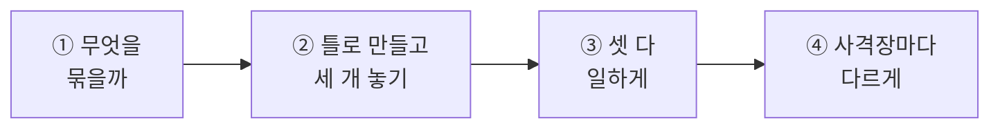
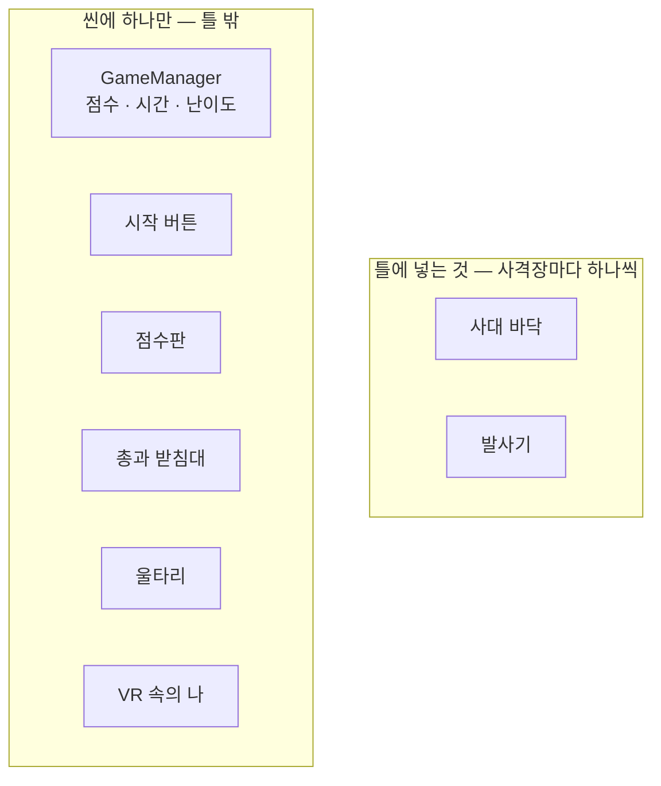
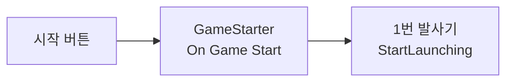
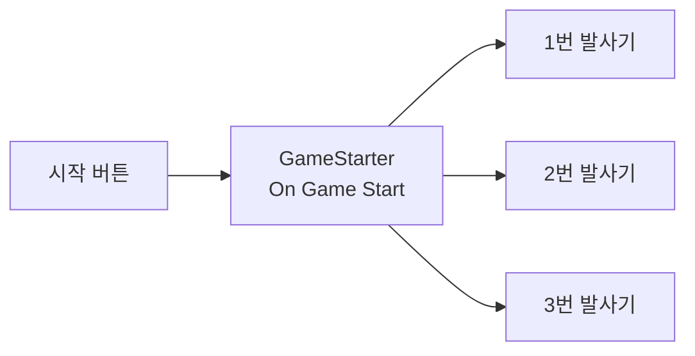
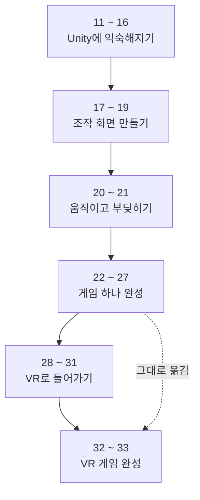

# **33차시. 사격장이 여러 개인 게임월드**
---

> ℹ️ **이 자료는 이렇게 보세요**
>
> - **강의 영상과 함께 보는 자료**입니다. 영상을 따라가시면서 옆에 두고 보시면 됩니다.
> - **마지막 시간입니다.** 오늘도 **코드를 한 줄도 쓰지 않습니다.**
> - 오늘 하실 일은 **묶기, 틀로 만들기, 여러 개 놓기, 연결 추가하기**입니다.
> - **32차시에 만든 VR 사격장**을 씁니다. 새 부품은 **하나도 없습니다.**

---

## **오늘의 목표**

이번 차시가 끝나면 여러분은 **코드 없이** 이런 것을 만드시게 됩니다.

- 사격장 하나를 **통째로 틀로** 만들기
- **여러 개 놓아** 게임월드 구성하기
- 틀 하나를 고쳐 **전부 바꾸기**
- 사격장마다 **난이도를 다르게**



> 💬 **32차시와 오늘의 차이**
>
> 32차시에는 사격장 **하나**에 들어가 서셨습니다.
> 오늘은 그걸 **여러 개**로 늘립니다. **게임월드**를 만드는 거예요.

---

## **1. 마지막 시간입니다**

오늘 새로 배우는 게 있을까요? **거의 없습니다.**

| 오늘 쓰는 것 | 배운 차시 |
| :--- | :---: |
| 묶으면 한 몸처럼 움직인다 | **14** |
| 틀로 만들면 여러 개를 찍어낼 수 있다 | **15** |
| 틀 하나를 고치면 전부 바뀐다 | **15** |
| 하나만 따로 다르게 할 수 있다 | **15** |
| 칸을 여러 개 만들면 한꺼번에 실행된다 | **18** |
| **심판은 씬에 하나만** | **25** |
| 틀은 씬 안의 물건을 가리킬 수 없다 | **25** |

> ✅ **오늘은 «다 써먹는 날» 입니다**
>
> 스물두 차시 동안 하나씩 배운 것들이 **오늘 한자리에 모입니다.**
>
> 그리고 25차시에 배운 **«심판은 하나»** 가 왜 그랬는지,
> 오늘 **눈으로 보시게 됩니다.**

---

## **2. 사격장 하나를 통째로 틀로**

15차시에 자동차 한 대를 틀로 만들어 **다섯 대**를 놓으셨죠.

오늘은 **사격장 하나**를 그렇게 합니다. 대상만 커졌지 방식은 똑같습니다.

| 15차시 | **오늘** |
| :--- | :--- |
| 자동차 한 대 | **사격장 하나** |
| 다섯 대를 놓음 | **세 개를 놓음** |
| 틀의 몸체 색을 바꾸니 다섯 대가 전부 | **틀의 발사기를 바꾸니 세 곳이 전부** |
| 한 대만 크게 (실습 ④) | **한 곳만 어렵게** |

> 💡 **«자동차가 오십 대라면요?» 를 기억하시나요**
>
> 15차시에 그렇게 말씀드렸습니다. **그래서 틀을 만든다**고요.
>
> 오늘 그 말이 **실물로 증명됩니다.** 사격장을 열 개로 늘려도 **틀 하나만 고치면** 됩니다.

---

## **3. 오늘의 진짜 내용 — 무엇을 넣고 무엇을 뺄까**

여기가 이 차시의 핵심입니다. **틀에 다 넣으면 안 됩니다.**

사격장을 통째로 복제하면 **같이 딸려오면 안 되는 것**이 있습니다.

| | 여러 개면 어떻게 되나 | 틀에 |
| :--- | :--- | :---: |
| **바닥 · 발사기** | 사격장마다 하나씩 있어야 **맞습니다** | ✅ **넣습니다** |
| **점수 담당** (`HitScorer`) | 🚨 **심판이 둘이면 경기가 안 됩니다** | ❌ **뺍니다** |
| **제한 시간** (`RoundTimer`) | 시간이 세 개면 **어느 게 진짜인지 모릅니다** | ❌ **뺍니다** |
| **시작 담당** (`GameStarter`) | 시작 버튼이 세 개가 됩니다 | ❌ **뺍니다** |
| **난이도 담당** (`DifficultyPreset`) | 〃 | ❌ **뺍니다** |
| **총 · 받침대** | 총이 세 자루 필요하진 않습니다 | ❌ **뺍니다** |
| **울타리** | 사격장마다 울타리가 있으면 **못 걸어 다닙니다** | ❌ **뺍니다** |
| **VR 속의 나** | 사람이 셋이 될 수는 없죠 | ❌ **뺍니다** |



> 🚨 **점수 담당을 왜 뺄까요 — 25차시의 그 이야기입니다**
>
> 25차시에 **축구 심판** 비유를 들었습니다.
> 선수가 각자 점수판을 들고 다니지 않고, **경기장에 심판이 하나** 있다고요.
>
> 사격장을 세 개 놓았는데 **점수 담당도 셋이면**,
> 표적이 어느 심판에게 가야 할지 **정해지지 않습니다.**
>
> 그래서 유니티가 **아예 못 붙이게** 막아뒀습니다. 한 그릇에 하나만 붙습니다.
> **25차시에 배운 그 제약이 오늘 이유를 보여줍니다.**

> ✅ **판단하는 법은 간단합니다**
>
> **«이게 세 개 있어도 말이 되나?»** 를 물어보세요.
>
> | | |
> | :--- | :--- |
> | 발사기 셋 | ✅ 말이 됩니다. 사격장마다 표적이 날아와야죠 |
> | 심판 셋 | ❌ 말이 안 됩니다 |
> | 시간 셋 | ❌ 말이 안 됩니다 |

---

## **4. 복제하면 아무도 시작시켜 주지 않습니다**

여기서 한 번 막히실 겁니다. **미리 말씀드립니다.**

32차시에서 시작 버튼을 누르면 **발사기가 표적을 쏘기 시작**했습니다.
그건 `GameStarter` 의 **«시작할 때» 칸**에 발사기를 연결해뒀기 때문이에요.



그런데 사격장을 **복제해서 두 번째, 세 번째**를 놓으면요?

> ⚠️ **새 발사기는 그 목록에 없습니다**
>
> 복제한 것은 **새로 생긴 물건**입니다.
> `GameStarter` 는 그게 있는 줄도 모릅니다.
>
> **시작 버튼을 눌러도 1번 사격장에서만 표적이 날아옵니다.**

### **해결 — 목록에 한 줄씩 더합니다**



> ✅ **18차시의 그 원리입니다**
>
> **«칸을 여러 개 만들면 한꺼번에 실행된다.»**
>
> 18차시에 슬라이더 하나로 숫자와 체력바를 같이 움직이셨죠.
> 26차시에는 시작 하나에 **여섯 가지**를 걸으셨고요.
>
> 오늘은 거기에 **두 줄을 더합니다.** 방식은 하나도 안 바뀌었습니다.

---

## **5. 오늘 만질 것 정리**

> ✅ **새로 받으실 부품이 없습니다**
>
> 오늘은 **이미 있는 것들을 묶고, 틀로 만들고, 연결을 더하는** 것이 전부입니다.
> **부품은 하나도 새로 안 붙입니다.**

| 하는 일 | 어떻게 |
| :--- | :--- |
| **묶기** | 빈 그릇을 만들고 **끌어다 넣기** (14차시) |
| **틀로 만들기** | 재료함으로 **끌어다 놓기** (15차시) |
| **여러 개 놓기** | 틀을 씬으로 **끌어다 놓기** (15차시) |
| **연결 더하기** | `+` 누르고 · 끌어다 놓고 · 목록에서 고르기 (14차시부터 계속) |

---

## **6. 실습 — 직접 해보세요**

> ℹ️ **따라 하지 않으셔도 됩니다**
>
> | | |
> | :--- | :--- |
> | **직접 해보고 싶으시면** | 32차시에서 만든 `32_완성` 씬을 여세요 |
> | **없거나 지우셨다면** | 강의자료의 **`33_시작`** 씬을 쓰시면 됩니다 |

> 🚨 **오늘도 «다른 이름으로 저장» 부터**
>
> `32_완성` 을 그대로 고치면 원본이 사라집니다.
> **`File` → `Save As`** 로 **`33_시작`** 이라고 먼저 저장하세요.

---

### **실습 ① — 무엇을 묶을까**

> 🎯 **목표**
>
> 사격장이 될 것들을 **하나로 묶습니다.** 무엇을 넣고 뺄지 정하는 게 오늘의 절반입니다.

#### **1단계 — 사대 바닥을 만듭니다**

1. Hierarchy 우클릭 → `3D Object` → **`Cube`** → 이름을 **`RangeFloor`** 로
2. 값을 맞춥니다.

| 항목 | 값 |
| :--- | :--- |
| **Position** | `0, 0.05, -20` |
| **Scale** | `6, 0.1, 6` |

    → 사람이 서는 자리를 표시하는 **납작한 판**입니다. 어느 사격장인지 눈에 보이게요.

3. 16차시에 만든 **색깔 재료**를 하나 끌어다 놓습니다.

#### **2단계 — 빈 그릇에 묶습니다**

4. Hierarchy 우클릭 → `Create Empty` → 이름을 **`ShootingRange`** 로
5. `Position` 을 **`0, 0, 0`** 으로 맞춥니다.
6. 아래 **둘만** `ShootingRange` 위로 끌어다 넣습니다.

| 넣을 것 | 왜 |
| :--- | :--- |
| **`RangeFloor`** | 사격장마다 사대가 하나씩 있어야 합니다 |
| **`Launcher`** | 사격장마다 표적이 날아와야 합니다 |

7. **나머지는 절대 넣지 마세요.** 아래 것들은 **씬에 그대로 둡니다.**

| 두는 것 | 왜 |
| :--- | :--- |
| `GameManager` | **심판 · 시간 · 난이도는 하나만** |
| `StartZone` · `StartButton3D` | 시작은 하나만 |
| `Canvas` (점수판) | 점수판은 하나만 |
| `Gun` · `GunStand` | 총은 하나만 |
| `Ground` · `Fence` | 울타리가 여러 개면 **못 걸어 다닙니다** |
| `XR Origin` · `XR Interaction Simulator` | 사람은 하나입니다 |

<details>
<summary>✅ 확인해보세요</summary>

- `ShootingRange` 를 펼치면 **`RangeFloor` 와 `Launcher` 둘만** 있나요?
- `ShootingRange` 를 골라 `W` 로 옮겨보세요. → **사대와 발사기가 같이 따라옵니다.**
  → 14차시의 «묶으면 한 몸» 그대로예요. 확인했으면 **`Ctrl + Z`** 로 되돌려주세요.
- `GameManager` 가 **밖에 있는지** 다시 한번 봐주세요. 이게 제일 중요합니다.

</details>

> ⚠️ **잘 안 되신다면**
>
> - 끌어다 놓았는데 안 들어간다 → 목록에서 **`ShootingRange` 이름 위에 정확히** 놓아야 합니다. 14차시의 그 요령이에요.
> - 넣었더니 위치가 확 변했다 → `ShootingRange` 의 `Position` 이 **`0, 0, 0`** 인지 확인해주세요.

---

### **실습 ② — 틀로 만들고 세 개 놓기 (오늘의 핵심)**

> 🎯 **목표**
>
> 사격장을 **틀로 만들어 세 개**를 놓고, **틀 하나를 고쳐 전부** 바꿉니다.

#### **1단계 — 틀 만들기**

1. **`ShootingRange` 를 재료함의 `Prefabs` 폴더로 끌어다 놓습니다.**
2. Hierarchy에서 이름이 **파란색**으로 변한 것을 확인합니다.
   → **틀에 연결됐다**는 표시입니다. 15차시에 자동차로 하셨던 그것이에요.

#### **2단계 — 세 개 놓기**

3. `Prefabs` 폴더의 **`ShootingRange` 를 Scene 창으로 끌어다 놓습니다.** → 두 번째가 생깁니다.
4. 한 번 더 놓습니다. → **총 세 개.**
5. 자리를 나눕니다.

| | Position |
| :--- | :--- |
| **1번** (원래 있던 것) | `0, 0, 0` |
| **2번** | `-18, 0, 0` |
| **3번** | `18, 0, 0` |

    → 울타리 안(`±25`)에 나란히 들어갑니다.

6. **▶** 를 누르고 **걸어서 옆 사격장으로** 가봅니다.

    > 💡 **순간이동으로도 갑니다**
    >
    > 32차시에 바닥을 순간이동 목적지로 만들어두셨죠.
    > 손으로 바닥을 겨눠 **툭 옮겨가도** 됩니다.

#### **3단계 — 틀 하나만 고치기**

7. ▶ 를 **끕니다.**
8. `Prefabs` 폴더의 **`ShootingRange` 를 더블클릭**해 틀 고치는 방으로 들어갑니다.
9. 안의 **`RangeFloor`** 를 골라 **색깔 재료를 다른 것으로** 바꿉니다.
10. 왼쪽 위 **`<`** 로 나옵니다.

<details>
<summary>✅ 무슨 일이 일어났나요</summary>

**세 곳이 전부 색이 바뀌었습니다.**

한 곳만 고쳤는데요. 나머지 둘은 건드리지도 않았습니다.

**15차시에 자동차 다섯 대로 하셨던 그것과 완전히 같습니다.**
대상이 자동차에서 사격장으로 커졌을 뿐이에요.

> 💡 **복제였다면**
>
> `Ctrl + D` 로 복제했다면 **세 번 고쳐야** 했을 겁니다.
> 사격장이 열 개라면요? **그래서 틀을 만듭니다.**

</details>

> 🚨 **꼭 알아두세요 — 값이 사라지는 이유**
>
> **▶ 를 누른 상태에서 놓은 것과 바꾼 값은, ▶ 를 끄면 전부 사라집니다.**
>
> 오늘은 걸어 다니며 확인하느라 ▶ 를 자주 켜게 됩니다.
> **놓고 고치는 작업은 ▶ 가 꺼진 상태에서** 하세요.

> ⚠️ **잘 안 되신다면**
>
> - 이름이 파랗게 안 변한다 → `Prefabs` **폴더 안에** 정확히 놓으셨는지 확인해주세요.
> - 틀을 고쳤는데 세 곳이 안 바뀐다 → 고친 게 **틀이 아니라 놓아둔 것 중 하나**일 수 있습니다. 반드시 **재료함의 틀을 더블클릭**해서 들어가야 합니다.
> - 사격장이 겹친다 → `Position X` 를 **`0` · `-18` · `18`** 로 확인해주세요.

---

### **실습 ③ — 셋 다 일하게**

> 🎯 **목표**
>
> **세 사격장 모두에서 표적이 날아오게** 합니다.

#### **1단계 — 문제를 먼저 봅니다**

1. **▶** 를 누르고 총을 잡습니다.
2. **시작 버튼**을 누릅니다.
3. **1번 사격장만** 봅니다. → 표적이 날아옵니다.
4. **2번 · 3번 사격장**으로 걸어가 봅니다.
   → **아무것도 안 날아옵니다.**

<details>
<summary>✅ 왜 그럴까요</summary>

**새 발사기는 시작 목록에 없기 때문**입니다.

시작 버튼은 `GameStarter` 의 **«시작할 때» 칸**에 걸린 것들을 실행합니다.
그 칸에는 **1번 발사기만** 들어 있어요.

2번 · 3번은 **나중에 놓은 것**이라, `GameStarter` 는 그게 있는 줄도 모릅니다.

</details>

#### **2단계 — 목록에 두 줄을 더합니다**

5. ▶ 를 **끕니다.**
6. **`StartZone`**(`GameStarter` 가 붙은 곳)을 고릅니다.
7. **`On Game Start`** 칸에서 **`+`** 를 눌러 칸을 하나 더 만듭니다.
8. **2번 사격장 안의 `Launcher`** 를 왼쪽 칸에 끌어다 놓습니다.
   → Hierarchy에서 2번 `ShootingRange` 를 펼쳐야 보입니다.
9. 목록 → **`TargetLauncher`** → **`StartLaunching`**
10. **3번도 같은 방법으로** 한 줄 더 만듭니다.
11. 같은 방식으로 **`On Game End`** 에도 두 줄을 더합니다.
    → 목록에서 **`StopLaunching`** 을 고릅니다.

    > 📝 **끝날 때도 멈춰야 합니다**
    >
    > 안 하면 시간이 다 돼도 **2번 · 3번에서는 계속 날아옵니다.**
    > 26차시에 «끝날 때 할 일» 을 한자리에 모아둔 이유가 이것이에요.

12. **▶** → 시작 버튼 → **세 곳을 다 돌아봅니다.**

<details>
<summary>✅ 무슨 일이 일어났나요</summary>

**세 곳 모두에서 표적이 날아옵니다.**

그리고 어느 사격장에서 맞혀도 **점수판의 숫자가 오릅니다.**

> ✅ **심판이 하나라서 그렇습니다**
>
> 표적은 맞으면 **점수 담당을 알아서 찾아갑니다.** 25차시에 배운 그것이죠.
>
> 그 담당이 **씬에 하나뿐**이라, 어느 사격장에서 맞히든 **같은 곳으로 갑니다.**
> 점수가 **합산**되는 거예요.
>
> 만약 사격장마다 심판이 있었다면? **점수가 셋으로 흩어졌을 겁니다.**

**18차시의 그 원리가 여기서 마지막으로 쓰였습니다.**
«칸을 여러 개 만들면 한꺼번에 실행된다.» 오늘은 **세 개**를 한꺼번에 실행합니다.

</details>

> ⚠️ **잘 안 되신다면**
>
> - 2번에서 표적이 안 날아온다 → `On Game Start` 에 **그 사격장의 `Launcher`** 를 넣으셨는지 확인해주세요. **1번 것을 두 번 넣으신 경우**가 많습니다.
> - 목록에 `StartLaunching` 이 안 보인다 → 왼쪽 칸에 **`Launcher` 를 안 넣으신 경우**입니다.
> - 끝나도 계속 날아온다 → **`On Game End`** 에 `StopLaunching` 을 안 거신 겁니다.

---

### **실습 ④ — 사격장마다 다르게 (선택)**

> 🎯 **목표**
>
> 사격장마다 **난이도를 다르게** 만듭니다. 쉬움 · 보통 · 어려움 사격장이 되는 거예요.

1. **2번 사격장 안의 `Launcher`** 를 고릅니다.
2. `TargetLauncher` 값을 **쉽게** 바꿉니다.

| 항목 | 값 |
| :--- | :--- |
| **Interval** | `2.5` |
| **Launch Force** | `8` |
| **Spread Angle** | `10` |

3. **3번 사격장**은 **어렵게** 바꿉니다.

| 항목 | 값 |
| :--- | :--- |
| **Interval** | `0.8` |
| **Launch Force** | `16` |
| **Spread Angle** | `40` |

4. 조종석을 보면 바꾼 항목 이름이 **굵게** 표시됩니다.
   → **«틀이랑 다릅니다»** 라는 표시입니다. 15차시 실습 ④에서 보셨죠.
5. **▶** → 세 곳을 돌아다니며 **체감 차이**를 느껴봅니다.

<details>
<summary>✅ 확인해보세요</summary>

- 2번은 **여유롭고**, 3번은 **정신없나요?**
- 1번 사격장은 **그대로**죠? → 하나만 바꿔도 나머지는 안 건드려집니다.
- 이게 15차시 실습 ④의 **«하나만 따로 다르게»** 입니다. 대상만 커졌어요.

</details>

> 📝 **난이도 버튼은 한 곳만 바꿉니다**
>
> 32차시에 만든 **난이도 버튼**을 눌러보세요.
> **1번 사격장만** 바뀝니다.
>
> `DifficultyPreset` 의 **`Launcher` 칸이 하나**라서 그렇습니다. 한 곳만 가리킬 수 있어요.
>
> 세 곳을 한꺼번에 바꾸려면 **부품을 고쳐야** 합니다. 그건 프로그래머의 일이에요.
> **오늘은 «사격장마다 값을 다르게 박아두는» 쪽**이 훨씬 간단하고, 게임으로도 더 재미있습니다.

> 💡 **어느 사격장인지 표시하고 싶으시면**
>
> 사대 바닥의 **색을 다르게** 해보세요. 초록 = 쉬움, 노랑 = 보통, 빨강 = 어려움.
> **VR에서는 글자보다 색이 훨씬 잘 읽힙니다.**
>
> 단, **틀이 아니라 놓아둔 것**의 색을 바꾸셔야 합니다. 틀을 고치면 세 곳이 다 같아져요.

---

## **7. 코드는 딱 한 번만 보고 갑니다**

**스물세 차시 동안 코드를 몇 줄 쓰셨을까요? 한 줄도 안 쓰셨습니다.**

오늘 한 일도 코드가 아닙니다.

```
ShootingRange 를 재료함으로  ──→  [ 틀이 하나 만들어짐 ]
틀을 씬으로 세 번           ──→  [ 세 개가 놓임 ]
On Game Start 에 + 두 번    ──→  [ 시작할 때 실행할 목록이 셋 ]
```

> ✅ **이게 노코드로 만든다는 뜻입니다**
>
> **끌어다 놓기. 값 바꾸기. 목록에서 고르기.**
>
> 13차시에 큐브 하나에 색을 입힐 때부터 오늘 게임월드를 만들 때까지,
> **이 셋 밖으로 나간 적이 없습니다.**

---

## **8. 스물세 차시를 그림 하나로**



> ✅ **점선이 오늘의 이야기입니다**
>
> 22 ~ 27차시에 만든 게임을 **버리지 않고 그대로 옮겼습니다.**
>
> 32차시에는 **조작만** 바꿨고, 오늘은 **여러 개로 늘렸습니다.**
> 게임의 속은 **여섯 차시 때 만든 그대로**예요.

---

## **9. 정리 문제**

맞히는 게 목적이 아닙니다. **오늘 내용이 머리에 남았는지 확인하는 용도**예요.
먼저 스스로 답을 떠올려보신 뒤에 정답을 펼쳐주세요.

### **문제 1**

사격장을 틀로 만들 때 **점수 담당(`HitScorer`)을 빼는** 이유는?

<details>
<summary>✅ 정답 보기</summary>

**심판이 여러 명이면 경기가 안 되기 때문**입니다.

표적은 맞으면 **점수 담당을 알아서 찾아갑니다.**
담당이 셋이면 **어디로 가야 할지 정해지지 않습니다.**

25차시에 «씬에 하나만 두세요» 라고 했던 그 이유가, 오늘 눈앞에 펼쳐진 겁니다.

</details>

### **문제 2**

사격장을 복제했는데 **2번에서 표적이 안 날아옵니다.** 왜일까요?

<details>
<summary>✅ 정답 보기</summary>

**새 발사기가 «시작할 때» 목록에 없기 때문**입니다.

`GameStarter` 는 자기 목록에 걸린 것만 실행합니다.
2번은 나중에 놓은 것이라 **그 목록에 없습니다.**

`On Game Start` 에 **`+` 를 눌러 한 줄 더** 만들고, 2번 발사기를 걸어주면 됩니다.
18차시의 «칸을 여러 개» 그대로예요.

</details>

### **문제 3**

**«이걸 틀에 넣을까?»** 를 판단하는 간단한 방법은?

<details>
<summary>✅ 정답 보기</summary>

**«이게 세 개 있어도 말이 되나?»** 를 물어보면 됩니다.

| | |
| :--- | :--- |
| 발사기 셋 | ✅ 말이 됩니다 → **넣습니다** |
| 심판 셋 · 시간 셋 · 사람 셋 | ❌ 말이 안 됩니다 → **뺍니다** |

</details>

### **문제 4**

**틀을 고쳤는데** 세 곳이 안 바뀝니다. 무엇을 확인해야 할까요?

<details>
<summary>✅ 정답 보기</summary>

**고친 게 틀이 아니라 «놓아둔 것 중 하나»** 일 수 있습니다.

반드시 **재료함의 틀을 더블클릭**해서 들어가야 합니다.
씬에 놓인 것을 고치면 **그 하나만** 바뀝니다.

15차시에도 같은 함정이 있었습니다.

</details>

### **문제 5**

난이도 버튼이 **1번 사격장만** 바꿉니다. 왜일까요?

<details>
<summary>✅ 정답 보기</summary>

**`DifficultyPreset` 의 `Launcher` 칸이 하나뿐**이기 때문입니다.

한 칸에는 **하나만** 넣을 수 있으니, 한 곳만 가리킬 수 있어요.

세 곳을 한꺼번에 바꾸려면 **부품을 고쳐야** 합니다. 그건 프로그래머의 일이에요.
**«어디까지 되는지 아는 것»** 도 만드는 사람의 감각입니다. 25차시 실습 ④에서도 같은 이야기를 했었죠.

</details>

---

## **10. 앞으로 조심할 것**

> ⚠️ **흔한 실수**
>
> | 증상 | 원인 |
> | :--- | :--- |
> | 2번에서 표적이 안 날아온다 | **`On Game Start` 에 안 걸었음** |
> | 1번 것을 두 번 걸었다 | Hierarchy에서 **그 사격장을 펼쳐서** 골라야 합니다 |
> | 끝나도 계속 날아온다 | `On Game End` 에 `StopLaunching` 을 안 걸었음 |
> | 틀을 고쳤는데 안 바뀐다 | **놓아둔 것**을 고쳤음 (틀이 아니라) |
> | 사격장 밖으로 못 나간다 | **울타리를 틀에 넣었음** — 빼야 합니다 |
> | 점수가 안 오른다 | **점수 담당을 틀에 넣었음** — 하나만 남겨야 합니다 |

> 🚨 **틀 안에 «하나만 있어야 하는 것» 을 넣지 마세요**
>
> 이게 오늘 유일하게 어려운 판단입니다.
>
> **«세 개 있어도 말이 되나?»** 로 물어보시면 대부분 답이 나옵니다.

---

## **11. 오늘의 정리**

> ✅ **세 줄 요약**
>
> 1. **사격장 하나를 틀로 만들면 여러 개를 찍어낼 수 있다.** 자동차 다섯 대와 같다.
> 2. **하나만 있어야 하는 것은 틀에서 뺀다.** 심판 · 시간 · 사람.
> 3. **복제한 것은 목록에 없다.** «시작할 때» 칸에 한 줄씩 더해야 일한다.

**여러분은 방금 게임월드를 만드셨습니다.**

사격장 세 곳, 난이도가 다르고, 걸어서 옮겨 다닐 수 있고,
어디서 쏘든 점수가 합산됩니다. **VR로요.**

**충분히 잘하셨어요.**

---

## **12. 여기까지 오신 여러분께**

> ✅ **11차시에 드렸던 약속**
>
> 첫 시간에 VR 사격 영상을 보여드리면서
> **«여러분이 직접 만드실 겁니다»** 라고 했습니다.
>
> **그 약속이 전부 지켜졌습니다.**

### **스물세 차시 동안 하신 일**

| | |
| :--- | :--- |
| **11 ~ 16차시** | Unity 화면이 안 무서워졌고, 물건을 만들어 다루게 됐습니다 |
| **17 ~ 19차시** | 버튼을 눌러 뭔가를 조종하는 화면을 만들 수 있게 됐습니다 |
| **20 ~ 21차시** | 물건이 움직이고, 부딪히면 반응하게 만들 수 있게 됐습니다 |
| **22 ~ 27차시** | **게임 하나를 끝까지 완성**하셨습니다 |
| **28 ~ 31차시** | VR 안에서 손으로 물건을 잡고 이동할 수 있게 됐습니다 |
| **32 ~ 33차시** | **만든 게임을 VR로 옮겨 게임월드**로 만드셨습니다 |

> ✅ **그리고 코드는 한 줄도 안 쓰셨습니다**
>
> **끌어다 놓기. 값 바꾸기. 목록에서 고르기.**
>
> 이 셋으로 여기까지 오셨습니다.

### **앞으로 더 해보고 싶으시다면**

| 하고 싶은 것 | 어디서부터 |
| :--- | :--- |
| **사격장을 더 예쁘게** | 27차시 — 하늘 · 조명 · 소리. **값 몇 개면 확 달라집니다** |
| **다른 게임 만들기** | **21차시**로 돌아가 보세요. «부딪히면 반응한다» 가 거의 모든 게임의 뼈대입니다 |
| **직접 부품 만들기** | 여기서부터는 **코드**입니다. 오늘까지 배운 «무슨 일이 일어났을 때, 무엇을 할지» 를 알고 시작하면 훨씬 쉽습니다 |
| **고글에서 돌려보기** | 12차시에 설치한 **`Android Build Support`** 로 완성해서 내보낼 수 있습니다 |

> 💡 **막히면 되돌아가셔도 됩니다**
>
> 각 차시의 **시작 씬과 완성 씬**이 강의자료에 전부 들어 있습니다.
> 어디서든 다시 붙으실 수 있어요.

**여기까지 오시느라 수고 많으셨습니다.**

---

## **부록 — 오늘 나온 용어 정리**

| 화면에 보이는 이름 | 우리말로 하면 |
| :--- | :--- |
| **Prefab** | 붕어빵 틀 |
| **Create Empty** | 빈 그릇 만들기 |
| **On Game Start** | 시작할 때 |
| **On Game End** | 끝났을 때 |
| **StartLaunching** | 표적 쏘기 시작 |
| **StopLaunching** | 표적 쏘기 멈춤 |
| **Interval** | 표적이 나오는 간격 |
| **Launch Force** | 표적을 쏘아 올리는 힘 |
| **Spread Angle** | 표적이 퍼지는 정도 |
| **Save As** | 다른 이름으로 저장 |

---
