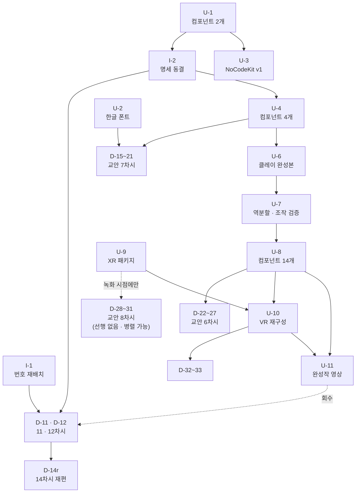

# 작업 우선순위 — 통합 백로그

`01_교안_작업계획.md` 와 `02_유니티_프로젝트_작업계획.md` 의 항목을 **하나의 순서로 합친** 문서입니다.
두 계획은 서로를 막고 있어서(교육용 컴포넌트가 없으면 교안 실습이 성립하지 않음) 따로 진행할 수 없습니다.

---

## 1. 판정 기준

우선순위는 아래 네 가지로 정했습니다. **위에 있을수록 셉니다.**

| 기준 | 뜻 | 해당 예 |
| :--- | :--- | :--- |
| **① 이미 깨져 있는가** | 배포된 결과물이 지금 동작하지 않음 | 배포된 교안이 요구하는 스크립트가 리포지토리에 없음 |
| **② 늦출수록 비싸지는가** | 시간이 갈수록 고칠 대상이 늘어남 | 번호 재배치 — 지금 6개, 나중엔 46개 |
| **③ 뒤를 막고 있는가** | 이게 없으면 다음 작업을 시작할 수 없음 | 클레이 사격 완성본 → 22~27 교안 |
| **④ 틀리면 재작업이 큰가** | 결정이 흔들리면 이미 쓴 것을 다 고쳐야 함 | 어휘집 · 컴포넌트 명세 |

**가시적 진척**은 기준에 넣지 않았습니다. 단, 같은 등급 안에서는 **완결되는 단위를 먼저** 배치했습니다.

---

## 2. 우선순위 표

### 🔴 P0 — 지금 즉시 (차단 해제 · 비용 급증 방지)

| ID | 항목 | 근거 | 산출물 | 선행 |
| :---: | :--- | :---: | :--- | :---: |
| **U-1** | `CubeSpinner` · `ConsoleTester` 제작 | ① | 스크립트 2개 | — |
| **I-1** | 파일 번호 재배치(11~33) + 섹션 폴더 구조 | ② | 폴더 · `.pages` · `index.md` | — |
| **I-2** | 어휘집 · 컴포넌트 명세 **동결** | ④ | `00_교안_생성_프롬프트.md` §C·§D-1 갱신 | U-1 |

> **U-1이 1순위인 이유**: 13·14차시 교안이 이미 GitHub Pages에 올라가 있는데, 그 교안이 "강의자료에서 받은 `CubeSpinner`를 끌어다 놓으세요"라고 지시합니다. **지금 수강생이 따라 할 수 없는 상태**입니다.
> **I-1이 2순위인 이유**: 순수하게 **지금이 가장 쌉니다.** 파일 6개일 때 30분, 46개일 때 반나절입니다.

---

### 🟠 P1 — Batch A 완주 (첫 4차시를 끝까지)

| ID | 항목 | 근거 | 산출물 | 선행 |
| :---: | :--- | :---: | :--- | :---: |
| **D-11** | 11차시 「왜 메타버스에 유니티인가」 신규 | ③ | 교안 + VOD | I-1 · I-2 |
| **D-12** | 12차시 「환경 설정」 신규 | ③ | 교안 + VOD | I-1 |
| **D-14r** | 14차시 실습 재편 (부품 붙이기 흡수) | ④ | 교안 + VOD 수정 | D-11 |
| **U-2** | TMP 한글 폰트 SDF 제작 | ④ | 폰트 에셋 | — |
| **U-3** | 13·14차시 씬 + `NoCodeKit` v1 배포본 | ③ | `.unitypackage` | U-1 |

> **11~14차시가 한 덩어리로 끝나야** 커리큘럼이 앞에서부터 말이 됩니다. 지금은 13·14만 있고 앞이 비어 있습니다.
> **U-2를 여기 둔 이유**: 18차시에서 반드시 터지는 문제인데, **만드는 데 30분이고 잊으면 Batch B가 멈춥니다.** 싸고 확실할 때 처리합니다.

---

### 🟡 P2 — Batch B (15 ~ 21차시)

| ID | 항목 | 근거 | 산출물 | 선행 |
| :---: | :--- | :---: | :--- | :---: |
| **U-4** | Batch B 컴포넌트 4개 | ③ | `RendererSwitcher` `ValueDisplay` `TransformDriver` `CollisionReporter` | I-2 |
| **U-5** | 프리팹 샘플 세트 (15차시용) | ③ | `Car` 프리팹 등 | U-1 |
| **D-15~21** | 15 ~ 21차시 교안 7차시 | — | 교안 + VOD 14개 | U-4 · U-5 · U-2 |

**D-15~21 내부 순서** — 원본이 충분한 것부터 (빨리 끝나는 것 먼저):

```
17 · 19 · 20 · 21  (원본 충분)  →  15 · 16 · 18  (부분 · 보강 필요)
```

> 단, **15차시(프리팹)는 33차시의 회수 지점**이라 개념 정의를 일찍 확정해야 합니다. 집필은 뒤로 미루되 **"붕어빵 틀" 비유는 I-2에서 미리 동결**합니다.

---

### 🔵 P3 — Batch C · 클레이 사격 (22 ~ 27차시) ★ 최대 병목

| ID | 항목 | 근거 | 산출물 | 선행 |
| :---: | :--- | :---: | :--- | :---: |
| **U-6** | 클레이 사격 **완성본 제작** | ③ | 씬 1개 | U-4 |
| **U-7** | 6개 마일스톤 역분할 + **마우스 조작 검증** | ③④ | 씬 6개 · 판정 결과 | U-6 |
| **U-8** | 클레이 사격 컴포넌트 14개 | ③ | 스크립트 14개 | U-7 |
| **D-22~27** | 22 ~ 27차시 교안 6차시 | — | 교안 + VOD 12개 | U-8 |

> **U-7이 이 구간의 심장입니다.** "이 조작이 마우스만으로 되는가"를 통과 못 하는 지점이 곧 U-8의 명세가 됩니다. 검증을 건너뛰고 교안을 쓰면 **실습이 성립하지 않는 차시가 나옵니다.**
> 전체 일정의 절반이 여기 묶이므로, **P0~P2를 먼저 완결**해 안전지대를 확보한 뒤 착수합니다.

---

### 🟣 P4 — Batch D · E (28 ~ 33차시) + 회수

| ID | 항목 | 근거 | 산출물 | 선행 |
| :---: | :--- | :---: | :--- | :---: |
| **U-9** | XR 패키지 설치 + XR Origin 프리팹 | ③ | `manifest.json` · 프리팹 | — (**녹화**를 막지, 집필은 안 막음) |
| **D-28~31** | 28 ~ 31차시 교안 | — | 교안 + VOD 8개 | **없음 — 지금 착수 가능** |
| **U-10** | VR 클레이 사격 재구성 | ③ | 씬 2개 | U-8 · U-9 |
| **D-32~33** | 32 · 33차시 교안 | — | 교안 + VOD 4개 | U-10 |
| **U-11** | **11차시 완성작 투어 영상 소재** | — | 플레이 영상 | U-8 · U-10 |

> **XR 설계 전제는 확정됐습니다** (`HANDOFF.md` §6 결정 9). **Simulator 는 강사의 녹화 환경**이고 **수강생 실습은 선택**이며 **실기기 화면은 별도 동영상**입니다.
> 따라서 **D-28~31 은 아무것도 기다리지 않습니다.** U-6/U-7 과 **병렬로 집필**하세요. U-9 는 **녹화 전까지만** 있으면 됩니다.
> **D-32~33 은 다릅니다** — 클레이 사격의 VR 재구성이라 **U-7 결과가 나와야** 합니다.
> **U-11은 마지막이지만 11차시로 되돌아갑니다.** D-11 집필 시 VOD 스크립트의 🖥 지시를 `<완성본 플레이 영상 — U-11에서 채움>` 으로 비워둡니다.

---

## 3. 의존 관계



---

## 4. 진행 상태

| 등급 | 항목 | 상태 |
| :---: | :--- | :---: |
| P0 | U-1 컴포넌트 2개 | ✅ 완료 |
| P0 | I-1 번호 재배치 · 폴더 구조 | ✅ 완료 |
| P0 | I-2 어휘집 · 명세 동결 | ✅ 완료 |
| P1 | D-11 11차시 | ✅ 완료 |
| P1 | D-12 12차시 | ✅ 완료 |
| P1 | D-14r 14차시 실습 재편 | ✅ 완료 |
| P1 | U-2 한글 폰트 | 🟨 **문자셋·절차 준비 완료 → 에디터 작업만 남음** |
| P1 | U-3 씬 + NoCodeKit v1 | 🟨 **에디터 작업 필요** |
| P2 | U-4 컴포넌트 4개 | ✅ 완료 |
| P2 | D-15 ~ D-21 (7차시) | ✅ 완료 |
| P2 | U-5 프리팹 샘플 | 🟨 **에디터 작업 필요** |
| P3 | **설계 문서** (`04_클레이사격_설계.md`) | ✅ 완료 |
| P3 | U-8 컴포넌트 14개 | ✅ 완료 |
| P3 | U-6 완성본 · U-7 검증 | 🟨 **에디터 작업 필요** |
| P3 | D-22~27 교안 | ⬜ **U-7 결과 대기** |
| P4 | **D-28~31 교안 8개** | ✅ **초안 완료** (`drafts/`) — 🟨 클릭 경로만 U-9 대기 |
| P4 | U-9 XR 패키지 · U-10 VR 재구성 | ⬜ 에디터 작업 (녹화 전까지) |
| P4 | D-32~33 · U-11 | ⬜ **U-7 결과 대기** |

### 🟨 = 에디터에서 사람이 해야 하는 작업

아래 세 가지는 **Unity 에디터를 열어야** 끝납니다. 절차는 `tools/README.md` 에 있습니다.

| 항목 | 해야 할 일 | 언제까지 |
| :--- | :--- | :---: |
| **U-2** | 한글 `.ttf` 넣고 Font Asset Creator 로 SDF 생성 (`Dynamic`) | 18차시 전 |
| **U-3a** | `Assets/_NoCodeKit/` → `.unitypackage` 내보내기 (v1) | 13차시 녹화 전 |
| **U-3b** | 13 · 14차시용 씬 2개 | 13차시 녹화 전 |
| **U-11** | 11차시 오프닝용 **완성작 플레이 영상** | 11차시 녹화 전 (P4에서 회수) |

> **11차시 VOD 스크립트의 🖥 지시가 `<완성본 플레이 영상 — U-11에서 채움>` 으로 비어 있습니다.**
> 이 영상이 없으면 11차시를 녹화할 수 없습니다. **클레이 사격(P3)과 VR(P4)이 끝나야 찍을 수 있으므로, 11차시 녹화는 사실상 맨 마지막입니다.**
> 교안 집필 순서와 녹화 순서가 다르다는 점을 일정에 반영해주세요.

---

## 5. 순서를 바꿔도 되는 것 / 안 되는 것

| | 항목 |
| :--- | :--- |
| **바꿔도 됨** | P2 안의 차시 순서 (17·19·20·21 ↔ 15·16·18) · U-2 시점 · U-3 시점 |
| **절대 안 됨** | U-7(조작 검증) → U-8(컴포넌트) 순서. 뒤집으면 **쓸모없는 컴포넌트를 만들게 됩니다** |
| **절대 안 됨** | I-2(명세 동결) → 교안 집필. 뒤집으면 교안의 Inspector 항목명과 실제가 어긋납니다 |
| **바꿔도 됨** | **D-28~31 시점** — 선행이 없습니다. U-6/U-7 과 병렬로 쓰면 됩니다 |
| **절대 안 됨** | U-7 → D-32~33. 32·33차시는 22~27차시의 VR 재구성이라 원본이 먼저 확정돼야 합니다 |
