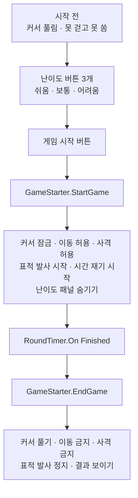

# 클레이 사격 설계 — 22 ~ 27차시

> **이 문서의 용도**: Unity 에디터에서 **U-6(완성본 제작) → U-7(역분할·조작 검증) → U-8(컴포넌트 제작)** 을 진행하기 위한 설계도입니다.
> 교안(D-22~27)은 **U-7의 검증 결과가 나온 뒤에** 씁니다. 순서를 뒤집으면 성립하지 않는 실습이 나옵니다.

---

## 0. 이 문서를 읽는 순서

| 절 | 내용 | 누가 |
| :---: | :--- | :--- |
| 1 | 완성본이 어떤 게임인가 | 먼저 합의할 것 |
| 2 | **노코드 구조상의 함정 3개** | ⚠️ 설계 전에 반드시 |
| 3 | 씬 구성 · 프리팹 | 에디터 작업 |
| 4 | 교육용 컴포넌트 14개 명세 | 에디터 작업 |
| 5 | 6개 마일스톤 역분할 | 에디터 작업 |
| 6 | **마우스 조작 검증 체크리스트 (U-7)** | ⚠️ 이 문서의 핵심 |
| 7 | 에셋 목록 | 에디터 작업 |
| 8 | 작업 순서 | |

---

## 1. 완성본 명세

### 게임 규칙

1. 플레이어가 **사격장에 서 있습니다.** 걸어 다닐 수 있고, 마우스로 둘러볼 수 있습니다.
2. 앞쪽 **시작 발판**에 올라서면 게임이 시작됩니다.
3. 정면의 **발사기**가 일정 간격으로 **클레이 접시를 하늘로 쏘아 올립니다.**
4. 마우스 왼쪽 버튼으로 **총을 쏩니다.** 총알이 눈에 보이게 날아갑니다.
5. 총알이 접시에 맞으면 → **접시가 터지고(파티클) 점수가 오릅니다.**
6. **제한 시간**이 끝나면 게임이 멈추고 최종 점수가 남습니다.
7. 난이도에 따라 **접시 속도 · 발사 간격 · 퍼짐 각도**가 달라집니다.

### 왜 이 구성인가

| 요소 | 회수하는 차시 |
| :--- | :--- |
| 사격장·총·표적을 **기본 도형 조합**으로 | 14 (부품 붙이기 · 부모-자식) |
| 표적·총알을 **프리팹**으로 | 15 (붕어빵 틀) |
| 총구 불꽃 · 명중 효과를 **파티클**로 | 16 (흩날리는 효과) |
| 점수판 · 시간 표시 | 17~19 (화면 만들기) |
| 총알이 날아가는 **방향** | 20 (X·Y·Z) |
| **명중 판정** | 21 (Collider · Is Trigger · Tag) |

**11 ~ 21차시에서 버릴 게 하나도 없습니다.** 이게 이 게임을 고른 이유입니다.

---

## 2. ⚠️ 노코드 구조상의 함정 3개

설계를 시작하기 전에 이것부터 정해야 합니다. **나중에 발견하면 컴포넌트를 다시 만들어야 합니다.**

### 함정 ① — 프리팹은 씬 안의 물건을 끌어다 놓을 수 없습니다

**가장 큰 제약입니다.**

표적은 **프리팹**입니다. 그런데 표적이 맞았을 때 **씬에 하나뿐인 점수판**에 점수를 올려야 합니다.

```
Target.prefab  ──✗──>  씬의 ScoreText
   (프리팹)              (씬 오브젝트)
```

Unity는 **프리팹 파일에서 씬 오브젝트를 참조할 수 없습니다.** 끌어다 놓으려 해도 칸이 안 받습니다.

!!! 해결 방식
    **점수를 세는 쪽을 씬에 하나 두고, 표적이 알아서 찾아가게** 합니다.

    - 씬에 **`HitScorer`** 를 하나 둡니다 (예: `GameManager` 라는 빈 그릇에)
    - 표적 프리팹에는 **`Hittable`** 만 붙입니다
    - `Hittable` 이 **내부적으로 씬의 `HitScorer` 를 찾아** 점수를 올립니다

    수강생이 하는 일: **"`HitScorer` 를 씬에 하나 놓고, 점수판을 연결"** 이게 전부입니다.
    찾아가는 과정은 부품 안에 숨깁니다. **이건 정당한 은닉입니다** — 수강생이 알 필요 없는 배선이니까요.

> **이 함정은 25차시 설계 전체를 좌우합니다.** 컴포넌트를 만들기 전에 이 구조로 확정하세요.

### 함정 ② — 마우스를 잠그면 UI 버튼을 못 누릅니다

1인칭으로 둘러보려면 **마우스 커서를 화면 중앙에 잠가야** 합니다.
그런데 잠그면 **화면의 버튼을 클릭할 수 없습니다.**

| 필요한 것 | 충돌 |
| :--- | :--- |
| 마우스로 조준 (22차시~) | 커서 잠금 필요 |
| 버튼으로 난이도 선택 (26차시) | 커서 필요 |

!!! 해결 방식 — 26차시에서 시작 방식을 바꿉니다
    **`MouseLook` 에 `Lock Cursor` 체크를 두고, `Esc` 로 해제되게** 했습니다.
    그런데 그것만으로는 부족합니다. **난이도 버튼을 넣으면 23차시의 발판 방식과 충돌**하기 때문입니다.

    | 차시 | 시작 방식 | 커서 |
    | :---: | :--- | :--- |
    | 22 · 23 · 24 · 25 | **발판(StartZone)을 밟으면** 시작 | 처음부터 잠김 (걸어야 하니까) |
    | **26 · 27** | **"게임 시작" 버튼**을 누르면 시작 | 시작 전 **풀림** → 시작하면 잠김 |

    **26차시에서 "발판 → 버튼" 으로 갈아탑니다.** 이건 교육적으로도 자연스럽습니다.
    *"난이도를 골라야 하니, 시작하기 전에 화면을 보여줘야 한다"* 가 그 차시의 동기가 되니까요.

    `GameStarter.StartGame` 은 **발판 트리거로도, 버튼으로도** 발동하게 만들어두었습니다.
    그래서 25차시까지의 씬을 그대로 두고 **26차시에 버튼만 얹으면** 됩니다.

### 26 · 27차시의 게임 흐름 (확정)



| 이벤트 | 연결할 동작들 |
| :--- | :--- |
| **`On Game Start`** | `MouseLook.LockCursor` · `PlayerMover.EnableMove` · `SimpleGun.EnableFire` · `TargetLauncher.StartLaunching` · `RoundTimer.StartTimer` · 난이도 패널 `SetActive(false)` |
| **`On Game End`** | `MouseLook.UnlockCursor` · `PlayerMover.DisableMove` · `SimpleGun.DisableFire` · `TargetLauncher.StopLaunching` · 결과 패널 `SetActive(true)` |

> **`On Game Start` 하나에 여섯 개를 연결합니다.** 18차시에 배운 *"칸을 여러 개 만들면 한꺼번에 실행된다"* 의 가장 큰 회수 지점입니다.

> **U-7에서 반드시 검증할 항목입니다.** 이게 안 잡히면 26차시 실습이 성립하지 않습니다.

### 함정 ③ — 이미 있는 기능을 새로 만들지 마세요

Unity 내장 컴포넌트 중 일부는 **이미 버튼 드롭다운에 나옵니다.** 이런 건 새로 만들 필요가 없습니다.

| 하고 싶은 것 | 내장으로 되는가 | 판정 |
| :--- | :--- | :---: |
| 소리 재생 | `AudioSource.Play()` 가 드롭다운에 **나옵니다** | **U-7에서 확인** |
| 물건 끄고 켜기 | `GameObject.SetActive(bool)` 가 **나옵니다** | ✅ 됩니다 |
| 파티클 재생 | `ParticleSystem.Play()` 가 **나오는지 확인 필요** | **U-7에서 확인** |
| 체력바 채우기 | `Image.fillAmount` **나옵니다** (18차시에 이미 씀) | ✅ 됩니다 |

!!! 확인하고 나서 만드세요
    **`AudioSource.Play()` 가 드롭다운에 나오면 `AudioPlayer` 는 안 만들어도 됩니다.**
    27차시를 **"AudioSource를 붙이고 이벤트에 Play를 연결"** 로 설계하면 되고, 그게 더 정직합니다.

    같은 이유로 `MuzzleFlashPlayer` 도 `ParticleSystem.Play()` 로 대체될 수 있습니다.

> **U-7에서 이 네 줄만 확인하면 컴포넌트 2개를 안 만들어도 됩니다.**

---

## 3. 씬 구성

### 3-1. Hierarchy 전체 구조 (완성본 기준)

```
ClayShooting (Scene)
│
├── ── 환경 ──────────────────────
├── Ground              Plane, Scale 5,1,5
├── Fence_Left          Cube  (사격장 경계)
├── Fence_Right         Cube
├── Fence_Back          Cube
├── Directional Light
│
├── ── 플레이어 ───────────────────
├── Player              Capsule
│   │                   + Rigidbody (Freeze Rotation 전부 체크)
│   │                   + Capsule Collider
│   │                   + PlayerMover
│   │                   + Tag: Player
│   └── Main Camera     (자식, Position 0, 0.6, 0)
│       │               + MouseLook
│       └── Gun         빈 그릇 (Position 0.3, -0.3, 0.5)
│           ├── GunBody     Cube    Scale 0.1, 0.1, 0.4
│           ├── GunBarrel   Cylinder Scale 0.03,0.2,0.03 / Rot 90,0,0
│           ├── MuzzlePoint 빈 그릇  ← 총알이 나오는 자리
│           └── MuzzleFlash Particle System (Play On Awake 끄기)
│           + SimpleGun (Gun 에 부착)
│
├── ── 게임 진행 ──────────────────
├── GameManager         빈 그릇
│                       + GameStarter
│                       + HitScorer      ← 씬에 하나 (함정 ①)
│                       + RoundTimer
│
├── StartZone           Cube, Is Trigger 체크, Mesh Renderer 끄기(선택)
│                       + Tag: StartZone
│
├── Launcher            빈 그릇 (플레이어 정면 20m 앞)
│   ├── LauncherBase    Cube  Scale 1, 0.5, 1
│   ├── LaunchPoint     빈 그릇 (Rotation X = -45 정도로 위를 향하게)
│   └──                 + TargetLauncher (Launcher 에 부착)
│
└── Canvas              Screen Space - Overlay
    │                   Canvas Scaler: Scale With Screen Size / 1920×1080 / Match 0.5
    ├── ScorePanel      Image, 앵커 top-right
    │   └── ScoreText   TMP + ValueDisplay (Prefix "점수: ")
    ├── TimePanel       Image, 앵커 top-center
    │   └── TimeText    TMP + ValueDisplay (Prefix "남은 시간: ", Suffix "초")
    ├── Crosshair       Image, 앵커 center, 작은 십자 모양
    └── StartMessage    TMP, "발판에 올라서면 시작합니다"
```

### 3-2. 프리팹 3개

| 프리팹 | 구성 | 붙는 부품 |
| :--- | :--- | :--- |
| **`Target`** | Cylinder, Scale `0.4, 0.05, 0.4` (납작한 접시) | Rigidbody · Collider · `TargetLife` · `Hittable` · `FeedbackSpawner` · Tag `Target` |
| **`Bullet`** | Sphere, Scale `0.08, 0.08, 0.08` | Rigidbody(Use Gravity 끔) · Collider · `Projectile` · Tag `Bullet` |
| **`HitEffect`** | 빈 그릇 + Particle System | (Play On Awake **켜기** · Stop Action `Destroy`) |

!!! 왜 HitEffect는 Play On Awake를 켜는가
    **생성되자마자 터져야** 하기 때문입니다. 그리고 `Stop Action` 을 `Destroy` 로 두면
    **재생이 끝나면 알아서 사라집니다.** 지우는 부품을 따로 안 만들어도 됩니다.

### 3-3. Tag 목록

23차시부터 쓰는 이름표입니다. **21차시에서 배운 그 방식**입니다.

| Tag | 붙는 대상 | 쓰는 곳 |
| :--- | :--- | :--- |
| `Player` | Player | `GameStarter` 의 `Trigger Tag` |
| `StartZone` | StartZone | (플레이어가 감지) |
| `Target` | Target 프리팹 | `Projectile` 의 `Target Tag` |
| `Bullet` | Bullet 프리팹 | `Hittable` 의 `Hitter Tag` |

---

## 4. 교육용 컴포넌트 명세 (14개)

> **설계 제약은 `plans/02_유니티_프로젝트_작업계획.md` §3-0 을 그대로 따릅니다.**
> Inspector 표시명이 곧 교안 용어이므로, **여기 적힌 이름 그대로** 만들어주세요.
>
> ✅ **14개 전부 제작 완료** — `Assets/_NoCodeKit/Scripts/ClayShooting/`

!!! ⚠️ 입력 처리 — 이 프로젝트는 새 Input System 전용입니다
    `ProjectSettings` 의 **`Active Input Handling` 이 `Input System Package (New)`** 로 되어 있습니다.

    이 상태에서 옛 방식(`Input.GetAxis` 등)을 쓰면 **실행하는 순간 예외가 터집니다.**
    `PlayerMover` · `MouseLook` · `SimpleGun` 은 **양쪽 다 컴파일되도록** 만들어두었습니다.

    수강생이 12차시에서 **`Universal 3D` 템플릿**으로 프로젝트를 만들면 같은 설정이 나옵니다.
    **다른 템플릿을 고르면 입력이 안 먹을 수 있으니**, 12차시 교안의 템플릿 지정을 그대로 지켜주세요.

### 4-1. 22차시 — 플레이어 (2개)

| 컴포넌트 | 조절할 수 있는 값 | 동작 | 이벤트 |
| :--- | :--- | :--- | :--- |
| **PlayerMover** | `Move Speed` · `Jump Force` · `Can Move` | `EnableMove` · `DisableMove` | — |
| **MouseLook** | `Sensitivity` · `Invert Y` · `Min Angle` · `Max Angle` · `Lock Cursor` | `LockCursor` · `UnlockCursor` | — |

- `PlayerMover` 는 **Rigidbody 기반**으로 만듭니다. 21차시에 배운 물리와 이어집니다.
- `MouseLook` 은 **좌우는 Player 를 돌리고, 위아래는 Camera 를 돌립니다.** 이게 1인칭의 표준 구조입니다.
- **`Esc` 로 커서 잠금이 풀리게** 해주세요. (함정 ②)

### 4-2. 23차시 — 표적과 발사기 (3개)

| 컴포넌트 | 조절할 수 있는 값 | 동작 | 이벤트 |
| :--- | :--- | :--- | :--- |
| **GameStarter** | `Trigger Tag` · `Start Once` | `StartGame` · **`EndGame`** · `ResetGame` | `On Game Start` · `On Game End` |
| **TargetLauncher** | `Target Prefab` · `Launch Point` · `Interval` · `Launch Force` · `Spread Angle` | `StartLaunching` · `StopLaunching` · **`LaunchOne`** | `On Launched` |
| **TargetLife** | `Life Time` | — | `On Expired` |

- `GameStarter` 는 **Is Trigger 감지**로 시작합니다. **21차시 실습 ④의 회수 지점**입니다.
- **`EndGame` 을 추가했습니다.** `RoundTimer` 의 `On Finished` → `GameStarter.EndGame` 으로 연결하면
  게임 종료 시 실행할 것들을 **한자리(`On Game End`)에 모을 수** 있습니다.
- **`LaunchOne` 을 추가했습니다.** 버튼에 걸어두면 **한 발씩 시험 발사**해볼 수 있어 23차시 실습이 수월해집니다.
- `TargetLauncher` 의 `Spread Angle` 이 **난이도의 핵심 값**입니다. 26차시에 여기를 만집니다.
- `TargetLife` 는 못 맞힌 접시를 치웁니다. 없으면 접시가 무한히 쌓입니다.

### 4-3. 24차시 — 총과 총알 (3개)

| 컴포넌트 | 조절할 수 있는 값 | 동작 | 이벤트 |
| :--- | :--- | :--- | :--- |
| **SimpleGun** | `Bullet Prefab` · `Muzzle Point` · `Bullet Speed` · `Fire Rate` · `Can Fire` | `Fire` · `EnableFire` · `DisableFire` | `On Fired` |
| **Projectile** | `Life Time` · `Target Tag` | — | `On Hit` · `On Miss` |
| **MuzzleFlashPlayer** ⚠️ | `Particle` · `Flash Light` · `Duration` | `Play` | — |

!!! ⚠️ MuzzleFlashPlayer 는 만들기 전에 확인하세요
    `SimpleGun` 의 `On Fired` 에 **`ParticleSystem.Play()` 를 직접 연결할 수 있으면** 이 컴포넌트는 **불필요합니다.**
    U-7 검증에서 확인한 뒤 결정하세요. (함정 ③)

- **총알은 실제로 날아가는 물건**으로 만듭니다. 눈에 안 보이는 방식(즉시 판정)은 쓰지 않습니다.
  → 21차시에 배운 Collider·Rigidbody가 그대로 쓰이고, **총알이 날아가는 게 눈에 보여야** 노코드 수강생이 이해합니다.
- `Fire Rate` 는 **연사 제한**입니다. 없으면 클릭을 연타해서 게임이 무너집니다.
- **`Projectile` 에서 `Speed` 를 뺐습니다.** 속도를 두 군데에 두면 어느 쪽이 이기는지 헷갈립니다.
  **속도는 `SimpleGun` 의 `Bullet Speed` 한 곳에서만** 정합니다.
- 조준은 **화면 한가운데(십자선) 기준**입니다. 총이 화면 구석에 있어도 십자선으로 나갑니다.

### 4-4. 25차시 — 명중과 점수 (3개)

| 컴포넌트 | 붙는 곳 | 조절할 수 있는 값 | 동작 | 이벤트 |
| :--- | :--- | :--- | :--- | :--- |
| **HitScorer** | **씬에 하나** | `Points Per Hit` | `AddScore` · `ResetScore` | **`On Score Changed (숫자)`** |
| **Hittable** | 표적 프리팹 | `Hitter Tag` · `Destroy On Hit` · **`Add Score`** | — | `On Hit` |
| **FeedbackSpawner** | 표적 프리팹 | `Effect Prefab` · `Spawn Offset` | `Spawn` | — |

!!! 이 세 개의 관계가 25차시의 전부입니다
    ```
    총알이 표적에 닿음
        ↓
    Hittable 이 감지 (Hitter Tag = Bullet)
        ↓
    ├─→ On Hit → FeedbackSpawner.Spawn  (터지는 효과 생성)
    └─→ 씬의 HitScorer 에 점수 자동 추가  (함정 ①: 내부에서 찾아감)
                ↓
        On Score Changed (숫자 전달)
                ↓
        ValueDisplay.SetValue  ← 18차시의 Dynamic float 연결!
    ```

    **`On Score Changed` 가 숫자를 넘겨주는 것**이 중요합니다.
    18차시에 슬라이더로 배운 **`Dynamic float`** 연결이 여기서 그대로 재활용됩니다.

### 4-5. 26차시 — 시간과 난이도 (2개)

| 컴포넌트 | 조절할 수 있는 값 | 동작 | 이벤트 |
| :--- | :--- | :--- | :--- |
| **RoundTimer** | `Duration` · `Auto Start` | `StartTimer` · `StopTimer` · `ResetTimer` | **`On Tick (숫자)`** · `On Finished` |
| **DifficultyPreset** | `Launcher` · `Timer` · `Easy` · `Normal` · `Hard` · `Apply Normal On Start` | `ApplyEasy` · `ApplyNormal` · `ApplyHard` | **`On Difficulty Changed (글자)`** |

- `On Tick` 도 **숫자를 넘겨줍니다.** → `TimeText` 의 `ValueDisplay.SetValue` 에 연결
- `On Difficulty Changed` 는 **글자를 넘겨줍니다.** → TMP 의 `text` 에 **`Dynamic string`** 으로 연결
  → 18차시에 `Dynamic float` 만 봤는데, **글자 버전도 있다**는 것을 여기서 한 번 보여줍니다.

#### 난이도 값 (`DifficultyPreset` 의 기본값으로 들어가 있음)

| 난이도 | Interval | Launch Force | Spread Angle | Duration |
| :--- | :---: | :---: | :---: | :---: |
| 쉬움 | `2.5` | `8` | `10` | `90` |
| 보통 | `1.5` | `12` | `25` | `60` |
| 어려움 | `0.8` | `16` | `40` | `45` |

!!! 26차시를 두 단계로 가르칩니다
    **`DifficultyPreset` 이 하는 일은 "미리 적어둔 값을 옮겨 담는 것"뿐입니다.**
    그래서 교안도 그 순서로 갑니다.

    | 실습 | 내용 |
    | :---: | :--- |
    | ① · ② | **값을 직접 바꿔가며** 난이도가 어떻게 달라지는지 몸으로 익히기 |
    | ③ | **`DifficultyPreset` 으로 그 값들을 버튼 세 개에 담기** ★ |
    | ④ | 시작 버튼 · 커서 흐름 정리 |

    **먼저 손으로 바꿔봐야 버튼이 무슨 일을 하는지 압니다.** 버튼부터 주면 그냥 마법이 됩니다.

### 4-6. 27차시 — 소리 (1개, 조건부)

| 컴포넌트 | 조절할 수 있는 값 | 동작 | 이벤트 |
| :--- | :--- | :--- | :--- |
| **AudioPlayer** ⚠️ | `Clip` · `Volume` · `Random Pitch` | `Play` · `Stop` | — |

!!! ⚠️ 이것도 만들기 전에 확인하세요
    `AudioSource.Play()` 가 드롭다운에 **나오면 안 만들어도 됩니다.** (함정 ③)

    다만 **총소리에 약간의 높낮이 변화**를 주려면(매번 똑같으면 어색합니다)
    `Random Pitch` 가 있는 편이 결과물이 훨씬 낫습니다. **결과물 품질과 컴포넌트 수를 저울질하세요.**

---

## 5. 6개 마일스톤 역분할

각 마일스톤은 **그 차시가 끝났을 때의 프로젝트 스냅샷**입니다.
`M(n)` 의 끝 상태 = `M(n+1)` 의 시작 상태이고, **차이가 곧 그 차시의 실습 ③** 입니다.

### M1 — 22차시 · 걸어 다닐 수 있는 사격장

| | |
| :--- | :--- |
| **결과** | 1인칭으로 사격장을 걸어 다니고 둘러볼 수 있다 |
| **만드는 것** | Ground · Fence 3개 · Player(Capsule + Camera) · Directional Light |
| **붙이는 부품** | `PlayerMover` · `MouseLook` · Rigidbody · Capsule Collider |
| **아직 없는 것** | 총, 표적, 점수, 시간 |

**실습 ③**: 사격장을 만들고 걸어 다니기

### M2 — 23차시 · 표적이 날아옴

| | |
| :--- | :--- |
| **결과** | 발판에 올라서면 발사기가 접시를 하늘로 쏘아 올린다 (아직 못 맞힘) |
| **추가** | `Target` 프리팹 · Launcher · StartZone · GameManager |
| **붙이는 부품** | `GameStarter` · `TargetLauncher` · `TargetLife` |
| **회수하는 것** | 15차시 프리팹 · 21차시 Is Trigger |

**실습 ③**: 표적 프리팹을 만들고 발사기에서 날아오게 하기

### M3 — 24차시 · 총알이 나감

| | |
| :--- | :--- |
| **결과** | 마우스를 클릭하면 총알이 날아간다 (아직 맞아도 아무 일 없음) |
| **추가** | Gun(카메라 자식) · `Bullet` 프리팹 · MuzzleFlash |
| **붙이는 부품** | `SimpleGun` · `Projectile` · (`MuzzleFlashPlayer`) |
| **회수하는 것** | 14차시 부모-자식 · 16차시 파티클 · 20차시 방향 |

**실습 ③**: 총을 만들고 총알이 나가게 하기

### M4 — 25차시 · 맞으면 터지고 점수가 오름 ★

| | |
| :--- | :--- |
| **결과** | **게임이 성립합니다.** 맞히면 터지고 점수가 오릅니다 |
| **추가** | `HitEffect` 프리팹 · Canvas · ScorePanel |
| **붙이는 부품** | `HitScorer`(씬) · `Hittable`(표적) · `FeedbackSpawner`(표적) · `ValueDisplay` |
| **회수하는 것** | 17~19차시 화면 · 18차시 Dynamic float · 21차시 Tag 감지 |

**실습 ③**: 명중 판정 · 터지는 효과 · 점수판 연결

> **여기가 이 여섯 차시의 봉우리입니다.** M4에서 처음으로 "게임"이 됩니다.
> 25차시 오프닝에서 **"오늘 끝나면 게임이 됩니다"** 를 명시하세요.

### M5 — 26차시 · 난이도 3단계

| | |
| :--- | :--- |
| **결과** | 제한 시간이 있고, **버튼 세 개로 난이도를 고를 수 있다** |
| **추가** | TimePanel · **StartPanel**(난이도 버튼 3개 + 시작 버튼 + 난이도 표시 글자) |
| **붙이는 부품** | `RoundTimer` · **`DifficultyPreset`** + `ValueDisplay` |
| **하는 일** | 값을 손으로 바꿔보고 → **그 값을 버튼에 담기** → 커서 흐름 정리 |
| **바뀌는 것** | 시작 방식이 **발판 → 버튼**으로 전환됩니다 (함정 ②) |

**실습 ③**: 난이도 버튼 세 개 만들고 값 담기

> **25차시까지의 씬을 그대로 두고 버튼만 얹습니다.** 발판은 남겨두셔도 되고 지우셔도 됩니다.

### M6 — 27차시 · 완성본

| | |
| :--- | :--- |
| **결과** | 하늘·조명·효과음·배경음악이 붙은 완성본 |
| **추가** | Skybox · 조명 조정 · AudioSource 3~4개 |
| **붙이는 부품** | (`AudioPlayer`) 또는 내장 `AudioSource` |
| **연결** | `On Fired` → 총소리 / `On Hit` → 명중음 / `On Finished` → 종료음 / BGM 반복 |

**실습 ③**: 배경과 소리를 붙여 완성하기

---

## 6. ⚠️ 마우스 조작 검증 체크리스트 (U-7)

> **이 문서에서 가장 중요한 절입니다.**
> 완성본을 만든 뒤, 아래 조작을 **하나씩 직접 해보고 판정을 채워주세요.**
> ❌ 가 나오는 항목이 **곧 컴포넌트가 흡수해야 할 명세**입니다.

### 판정 기준

| 표시 | 뜻 |
| :---: | :--- |
| ✅ | **마우스 + Inspector 값 입력만으로** 됩니다 |
| ⚠️ | 되지만 **헷갈리거나 실수하기 쉽습니다** → 교안 트러블슈팅에 넣을 것 |
| ❌ | **안 됩니다** → 컴포넌트가 흡수하거나 실습에서 뺄 것 |

### M1 — 22차시

| # | 조작 | 판정 | 메모 |
| :---: | :--- | :---: | :--- |
| 1-1 | Plane·Cube 로 사격장 배치 | | 14차시 방식 그대로여야 함 |
| 1-2 | Capsule 에 Rigidbody 붙이고 **Freeze Rotation 체크** | | 안 하면 넘어짐. ⚠️ 예상 |
| 1-3 | Camera 를 Player 의 **자식으로** 넣기 | | 14차시 부모-자식 |
| 1-4 | `PlayerMover` 붙이고 `Move Speed` 조절 | | |
| 1-5 | `MouseLook` 붙이고 **좌우/위아래가 자연스러운지** | | 감도 기본값 확인 |
| 1-6 | **`Esc` 로 커서가 풀리는지** | | **함정 ②** |
| 1-7 | 벽 밖으로 안 나가는지 | | Fence 에 Collider 필요 |

### M2 — 23차시

| # | 조작 | 판정 | 메모 |
| :---: | :--- | :---: | :--- |
| 2-1 | Cylinder 를 납작하게 눌러 접시 만들기 | | |
| 2-2 | 접시를 **프리팹으로** 만들기 | | 15차시 방식 |
| 2-3 | `TargetLauncher` 의 `Target Prefab` 칸에 **프리팹 끌어다 놓기** | | 프리팹→프리팹 참조는 ✅ |
| 2-4 | `Launch Point` 칸에 **씬의 빈 그릇 끌어다 놓기** | | 씬→씬 참조는 ✅ |
| 2-5 | `LaunchPoint` 를 `Rotation X = -45` 로 **위를 향하게** | | 20차시 회전축 회수 |
| 2-6 | StartZone 에 **Is Trigger 체크** | | 21차시 회수 |
| 2-7 | `GameStarter` 의 `On Game Start` → `TargetLauncher.StartLaunching` 연결 | | **씬→씬이라 가능** |
| 2-8 | 접시가 **적당한 높이로** 날아가는지 | | `Launch Force` 조율 필요 |

### M3 — 24차시

| # | 조작 | 판정 | 메모 |
| :---: | :--- | :---: | :--- |
| 3-1 | 총을 **Camera 의 자식으로** 넣고 화면 구석에 배치 | | ⚠️ 위치 잡기가 까다로움 |
| 3-2 | `MuzzlePoint` 빈 그릇을 총구 끝에 배치 | | |
| 3-3 | `SimpleGun` 의 `Bullet Prefab` · `Muzzle Point` 연결 | | |
| 3-4 | 클릭하면 총알이 **십자선 방향으로** 날아가는지 | | ❌ 나오면 큰 문제 |
| 3-5 | 총알이 **눈에 보이는 속도**인지 | | 너무 빠르면 안 보임 |
| 3-6 | **`ParticleSystem.Play()` 가 드롭다운에 나오는지** | | **함정 ③ — 여기서 결정** |
| 3-7 | 연사가 `Fire Rate` 로 제한되는지 | | |

### M4 — 25차시 ★

| # | 조작 | 판정 | 메모 |
| :---: | :--- | :---: | :--- |
| 4-1 | 표적 프리팹에 `Hittable` 붙이고 `Hitter Tag = Bullet` | | |
| 4-2 | `Hittable` 의 `On Hit` → `FeedbackSpawner.Spawn` 연결 | | **프리팹 내부끼리라 ✅ 예상** |
| 4-3 | `FeedbackSpawner` 의 `Effect Prefab` 에 프리팹 끌어다 놓기 | | 프리팹→프리팹 ✅ |
| 4-4 | **표적 프리팹에서 씬의 점수판을 끌어다 놓으려 해보기** | | **❌ 나와야 정상 (함정 ①)** |
| 4-5 | 씬의 `HitScorer` 가 **자동으로 점수를 받는지** | | 함정 ① 해결 확인 |
| 4-6 | `On Score Changed` → `ValueDisplay.SetValue` **Dynamic float 로** 연결 | | 18차시 회수 |
| 4-7 | 맞았을 때 터지는 효과가 **표적 자리에** 생기는지 | | `Spawn Offset` 조율 |
| 4-8 | 효과가 **재생 후 알아서 사라지는지** | | Stop Action = Destroy |

### M5 — 26차시

| # | 조작 | 판정 | 메모 |
| :---: | :--- | :---: | :--- |
| 5-1 | `RoundTimer` 의 `On Tick` → `ValueDisplay.SetValue` 연결 | | |
| 5-2 | `On Finished` → `GameStarter.EndGame` 연결 | | 종료 처리를 한자리에 모음 |
| 5-3 | `On Game End` 에 **네 개 이상 연결**되는지 | | 커서·이동·사격·발사 정지 |
| 5-4 | §4-5 난이도 값으로 **실제로 난이도가 달라지는지** | | **직접 플레이해서 조율** |
| 5-5 | `MouseLook` 의 `Lock Cursor` 를 **끈 상태로 시작**했을 때 버튼이 눌리는지 | | **함정 ②** |
| 5-6 | `GameStarter.StartGame` 을 **버튼에 걸었을 때** 발동하는지 | | 발판 → 버튼 전환 |
| 5-7 | `On Game Start` → `MouseLook.LockCursor` 로 **잠기는지** | | |
| 5-8 | `DifficultyPreset` 버튼을 누르면 `TargetLauncher` **값이 실제로 바뀌는지** | | Inspector 로 확인 |
| 5-9 | `On Difficulty Changed` → TMP 의 `text` 에 **`Dynamic string`** 이 나오는지 | | ⚠️ 없으면 실습 ③ 축소 |
| 5-10 | 난이도 패널을 `SetActive(false)` 로 **숨길 수 있는지** | | 함정 ③ 확인 |

### M6 — 27차시

| # | 조작 | 판정 | 메모 |
| :---: | :--- | :---: | :--- |
| 6-1 | Skybox 를 목록에서 골라 바꾸기 | | Lighting 창 |
| 6-2 | **`AudioSource.Play()` 가 드롭다운에 나오는지** | | **함정 ③ — 여기서 결정** |
| 6-3 | `On Fired` → 총소리 연결 | | |
| 6-4 | `On Hit` → 명중음 연결 | | ⚠️ 프리팹 내부 AudioSource 필요 |
| 6-5 | BGM 이 `Loop` 로 계속 재생되는지 | | Play On Awake |
| 6-6 | 소리가 **너무 크거나 겹치지 않는지** | | Volume 조율 |

### 검증 결과 정리 (채워주세요)

| | 개수 | 조치 |
| :--- | :---: | :--- |
| ✅ 그대로 됨 | | 교안 실습으로 |
| ⚠️ 헷갈림 | | 교안 **트러블슈팅**에 반영 |
| ❌ 안 됨 | | **컴포넌트 명세 추가** 또는 실습에서 제외 |

> **❌ 항목이 나오면 이 문서 §4로 돌아와 컴포넌트 명세를 고치고, 저에게 알려주세요.**
> 명세가 확정돼야 교안(D-22~27)을 쓸 수 있습니다.

---

## 7. 에셋 목록

**기본 도형 위주 + 최소 무료 에셋** 방침(사용자 확정)에 따릅니다.

| 필요한 것 | 조달 | 비고 |
| :--- | :--- | :--- |
| 사격장 · 총 · 표적 · 발사기 | **Unity 기본 도형** | 14차시 자동차와 같은 방식 |
| 재질 | **URP Lit 직접 제작** | 13·16차시에 배운 방식 |
| 명중 파티클 · 총구 불꽃 | **Unity 기본 Particle System** | 16차시 회수 |
| 십자선(Crosshair) | **직접 그린 PNG 한 장** 또는 TMP 문자 `+` | |
| 효과음 3개 (발사·명중·종료) | **CC0** | freesound.org 등 |
| 배경음악 1개 | **CC0** | |
| Skybox (하늘) | **Unity 기본** 또는 CC0 HDRI 1장 | 30차시와 공유 |
| **한글 TMP 폰트** | **U-2에서 이미 준비** | 점수판·시간에 필요 |

!!! 라이선스 확인
    효과음과 BGM은 **`.unitypackage` 로 수강생에게 배포**됩니다.
    **재배포 가능한 라이선스(CC0 권장)** 인지 반드시 확인해주세요.

---

## 8. 작업 순서

| 순서 | 작업 | 산출물 | 예상 |
| :---: | :--- | :--- | :--- |
| 1 | **함정 ①②③ 결론 확정** | 이 문서 §2 확인 | 30분 |
| 2 | ~~컴포넌트 14개 제작~~ | ✅ **완료** | — |
| 3 | **완성본 한 번에 만들기 (U-6)** | `ClayShooting.unity` 1개 | — |
| 4 | **U-7 검증 체크리스트 채우기** | §6 판정 표 | **가장 중요** |
| 5 | ❌ 항목에 맞춰 컴포넌트 수정 | 스크립트 v2 | — |
| 6 | 6개 마일스톤 씬으로 역분할 | `M1_*.unity` ~ `M6_*.unity` | — |
| 7 | `NoCodeKit` v3 내보내기 | `.unitypackage` | — |
| 8 | **교안 D-22~27 집필** | 교안 + VOD 12개 | 검증 후 |

### 지금 당장 할 수 있는 것

**순서 1~2 는 제가 도울 수 있습니다.** 함정 ①②③에 대한 판단이 서면 **컴포넌트 13개를 바로 만들어드립니다.**

순서 3~6 은 에디터 작업이라 사용자가 하셔야 합니다.
**§6 체크리스트를 채워서 주시면** 순서 5·8을 이어서 진행하겠습니다.

---

## 9. 열어둔 결정 3가지

교안을 쓰기 전에 확정돼야 하는 것들입니다.

| # | 결정 사항 | 기본안 | 대안 |
| :---: | :--- | :--- | :--- |
| 1 | **총알 방식** | 실제로 날아가는 물건 (권장) | 즉시 판정 — 눈에 안 보여서 비권장 |
| 2 | **`MuzzleFlashPlayer` · `AudioPlayer`** | U-7 검증 후 결정 | 내장으로 되면 안 만듦 |
| 3 | ~~난이도 전환 방식~~ | ✅ **버튼 3개 + `DifficultyPreset` 으로 확정** | — |

> 3번이 확정되면서 **26차시에서 시작 방식이 발판 → 버튼으로 바뀝니다.** §2 함정 ② 를 확인해주세요.
> 남은 결정은 **2번(내장으로 되는지)** 뿐이고, 그건 **U-7 검증으로만** 답이 나옵니다.
